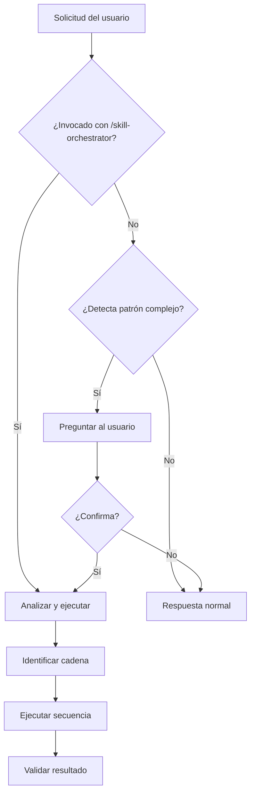

# Skill Orchestrator

> `{year-semestre}` representa el ciclo académico actual (ej: `2026-1`). Determínalo por el contexto del repositorio.

Orquesta múltiples skills para completar tareas complejas. Puede invocarse manualmente o detectar automáticamente cuando una solicitud requiere múltiples skills.

## Comportamiento

### Modo 1: Invocación Manual
El usuario escribe `/skill-orchestrator` + descripción de la tarea.

### Modo 2: Auto-detección (con confirmación)
El agente detecta palabras clave que indican tarea compleja y **pregunta** antes de ejecutar:

```
¿Quieres que use el Skill Orchestrator para esta tarea?
Detecté que necesitas: clase-processor, structured-notes, flowchart
Responde "sí" para orquestar o "no" para ejecutar skills individualmente
```

### Palabras Clave de Detección

| Patrón | Skills detectados | Cadena sugerida |
|--------|-------------------|-----------------|
| "documenta la clase X con todo" | clase-processor + structured-notes + flowchart + mermaid | Cadena 1 |
| "documenta la clase X" (sin "con todo") | clase-processor | Solo PDF |
| "explica el concepto de X" | complex-concept + structured-notes | Cadena 2 |
| "prepara una presentación sobre" | structured-notes + presentation-prep | Cadena 3 |
| "crea un plan de aprendizaje de" | learning-roadmap + workflow | Cadena 5 |
| "haz un trabajo académico sobre" | structured-notes + academic-paper | Cadena 4 |
| "genera apuntes de X" | structured-notes | Solo apuntes |
| "crea un diagrama de X" | flowchart | Solo diagrama |

### Flujo de Auto-detección



## Skills Disponibles

| Skill | Uso | Output |
|-------|-----|--------|
| `clase-processor` | Procesar archivos de clase (PPTX → PDF + MD) | PDF + Markdown |
| `structured-notes-generator` | Generar apuntes de estudio | Markdown estructurado |
| `complex-concept-explainer` | Explicar conceptos difíciles | Explicación por capas |
| `flowchart-decision-builder` | Crear diagramas de flujo | Mermaid/ASCII |
| `learning-roadmap-generator` | Planes de aprendizaje | Roadmap semanal |
| `presentation-prep-skill` | Preparar presentaciones | Estructura slide-by-slide |
| `academic-paper-drafter` | Trabajos académicos | Documento estructurado |
| `conventional-commit-generator` | Mensajes de commit | Conventional Commit |
| `workflow-automation-agent` | Flujos de trabajo | Workflow paso a paso |
| `mermaid-analysis` | Analizar oportunidades Mermaid | Análisis + diagramas |

## Constraints

- **DEBES** ejecutar skills en la secuencia correcta (respetar dependencias)
- **DEBES** pasar outputs relevantes entre skills
- **NO** ejecutar skills innecesarios (solo los que aportan valor)
- **NO** saltar validaciones intermedias
- **SIEMPRE** reportar progreso al usuario
- **SIEMPRE** validar resultado final antes de entregar

## Approach

### Paso 1: Analizar Solicitud

Si el usuario **no invocó con `/skill-orchestrator`**:
1. Buscar patrones de palabras clave en la solicitud
2. Si detecta patrón complejo → **preguntar** si quiere orquestación
3. Si el usuario confirma → continuar al Paso 2
4. Si el usuario dice no → ejecutar skill individual

Si el usuario **invocó con `/skill-orchestrator`**:
1. Analizar solicitud directamente
2. Identificar skills necesarios

### Paso 2: Identificar Skills

Para cada solicitud, responder:

| Pregunta | Criterio |
|----------|----------|
| ¿Qué tipo de contenido se necesita? | Clase, apuntes, presentación, workflow |
| ¿Hay dependencias entre skills? | Ej: clase-processor → structured-notes |
| ¿Cuáles son los outputs esperados? | PDF, Markdown, diagrama |
| ¿Hay validación requerida? | Checklist, convenciones |

### Paso 3: Definir Secuencia

Usar estas cadenas predefinidas cuando apliquen:

#### Cadena 1: Documentación de Clase Completa
```
clase-processor → structured-notes-generator → flowchart-decision-builder → mermaid-analysis
```
**Para:** Documentar una clase con todo (PDF + apuntes + diagramas)

#### Cadena 2: Concepto Complejo
```
complex-concept-explainer → structured-notes-generator → flowchart-decision-builder
```
**Para:** Explicar un concepto difícil con analogías + apuntes + diagrama

#### Cadena 3: Preparación de Presentación
```
structured-notes-generator → complex-concept-explainer → presentation-prep-skill
```
**Para:** Preparar presentación basada en contenido existente

#### Cadena 4: Trabajo Académico
```
structured-notes-generator → academic-paper-drafter → conventional-commit-generator
```
**Para:** Generar trabajo académico con research previo

#### Cadena 5: Plan de Aprendizaje
```
learning-roadmap-generator → workflow-automation-agent → conventional-commit-generator
```
**Para:** Crear plan de aprendizaje con tareas concretas

### Paso 4: Ejecutar Skills

Para cada skill en la secuencia:

1. **Preparar input** con output del skill anterior
2. **Invocar skill** con `task` tool
3. **Capturar output** y guardarlo
4. **Validar** que el output cumple expectativas
5. **Continuar** al siguiente skill

### Paso 5: Validar Resultado Final

Verificar:
- Todos los outputs esperados fueron generados
- Los archivos están en la ubicación correcta
- Los enlaces y referencias funcionan
- Las convenciones del repo se respetaron

## Output Format

**Progreso durante ejecución:**

```
🔄 Orquestando: {nombre de la tarea}

Paso 1/4: Ejecutando clase-processor...
   ✅ PDF generado: tema-clase-N.pdf
   ✅ PPTX eliminado

Paso 2/4: Ejecutando structured-notes-generator...
   ✅ Apuntes generados: tema-clase-N.md

Paso 3/4: Ejecutando flowchart-decision-builder...
   ✅ Diagrama generado: proceso-clase-N.md

Paso 4/4: Ejecutando mermaid-analysis...
   ✅ Análisis completado

✅ Tarea completada: {resumen de outputs}
```

**Resultado final:**

```md
## Resumen de Ejecución

**Tarea:** {descripción}
**Skills ejecutados:** {lista}
**Archivos generados:** {lista con rutas}
**Validación:** {estado}

### Archivos Generados
- `ruta/archivo1.pdf` — {descripción}
- `ruta/archivo2.md` — {descripción}
- `ruta/archivo3.md` — {descripción}

### Próximos pasos
- {acción sugerida 1}
- {acción sugerida 2}
```

## Ejemplo de Ejecución

### Ejemplo 1: Invocación Manual

**Input:**
```
/ skill-orchestrator
Documenta la clase 5 de Arquitectura Empresarial con todo
```

**Output:**
```
🔄 Orquestando: Documentación completa de Clase 5

Paso 1/4: Ejecutando clase-processor...
   ✅ PDF generado: arquitectura-empresarial-toeaf-clase-5.pdf
   ✅ PPTX eliminado

Paso 2/4: Ejecutando structured-notes-generator...
   ✅ Apuntes generados: arquitectura-empresarial-toeaf-clase-5.md
   - 12 conceptos documentados
   - 4 ejemplos prácticos
   - Glosario de 8 términos

Paso 3/4: Ejecutando flowchart-decision-builder...
   ✅ Diagrama generado: toeaf-proceso-clase-5.md
   - 1 diagrama de flujo (TOGAF ADM)
   - 1 árbol de decisión (selección de arquitectura)

Paso 4/4: Ejecutando mermaid-analysis...
   ✅ Análisis completado
   - 2 oportunidades de Mermaid identificadas
   - 1 tabla comparativa sugerida

✅ Documentación completada en: 2026-1/arq-empresarial/clase-5/
   - arquitectura-empresarial-toeaf-clase-5.pdf
   - arquitectura-empresarial-toeaf-clase-5.md
   - toeaf-proceso-clase-5.md
   - README.md actualizado
```

### Ejemplo 2: Auto-detección

**Input del usuario:**
```
Documenta la clase 5 de Arquitectura Empresarial con todo
```

**Respuesta del agente:**
```
Detecté que esta tarea puede usar múltiples skills:

📋 Skills sugeridos:
1. clase-processor → PDF de la clase
2. structured-notes-generator → Apuntes de estudio
3. flowchart-decision-builder → Diagramas de procesos
4. mermaid-analysis → Análisis de oportunidades Mermaid

¿Quieres que orqueste todos estos skills?
- Responde "sí" para ejecutar la cadena completa
- Responde "no" para ejecutar individualmente
```

**Si el usuario responde "sí":**
→ Ejecuta la cadena completa (como Ejemplo 1)

**Si el usuario responde "no":**
```
¿Qué skill quieres ejecutar?
1. clase-processor (solo PDF)
2. structured-notes-generator (solo apuntes)
3. flowchart-decision-builder (solo diagrama)
```

## Errores Comunes a Evitar

❌ NO ejecutar skills sin definir secuencia primero  
❌ NO ignorar outputs de skills anteriores  
❌ NO saltar validaciones intermedias  
❌ NO ejecutar skills redundantes  
❌ NO dejar archivos generados sin verificar ubicación  
❌ NO crear PR sin confirmar que todos los archivos están correctos  

---

**Última actualización**: 2 de septiembre de 2026  
**Alcance**: ISIL {year-semestre} Multi-Curso
