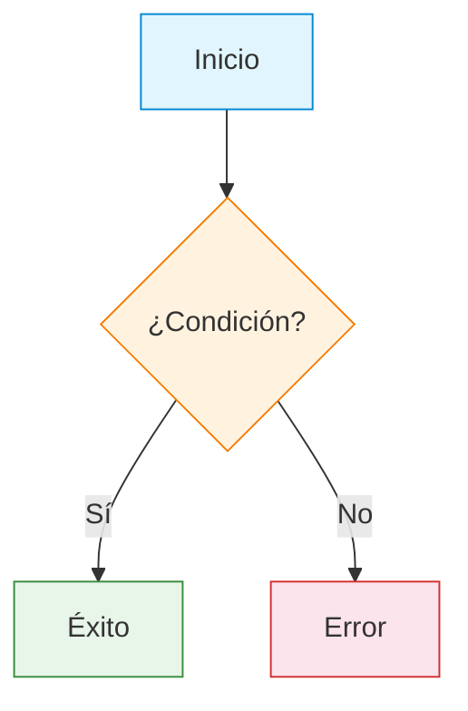
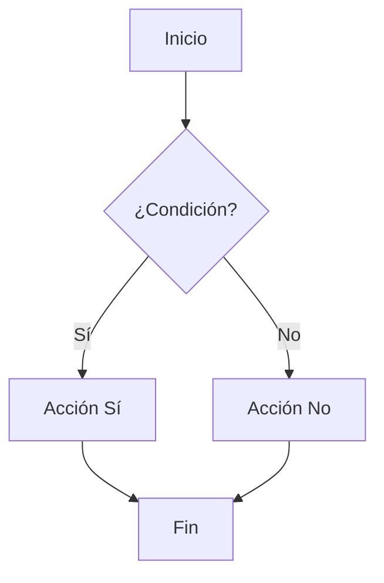
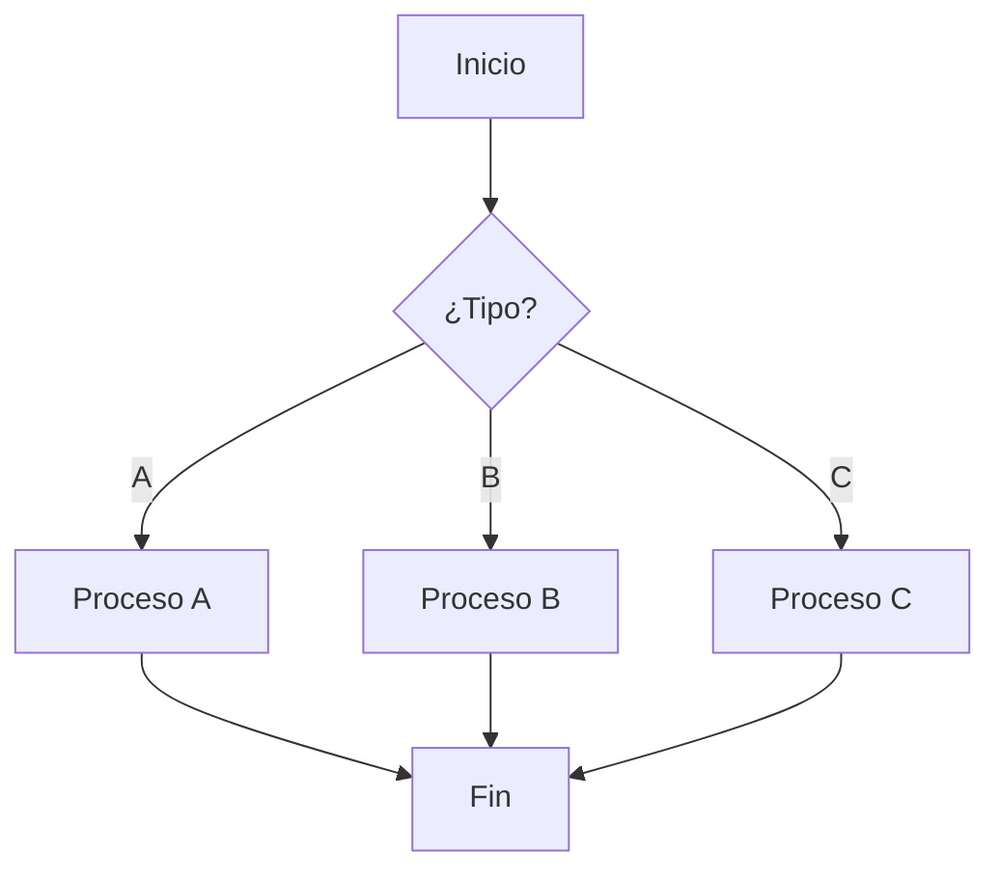
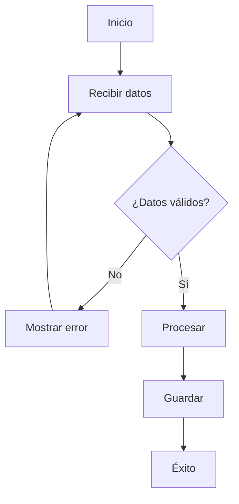
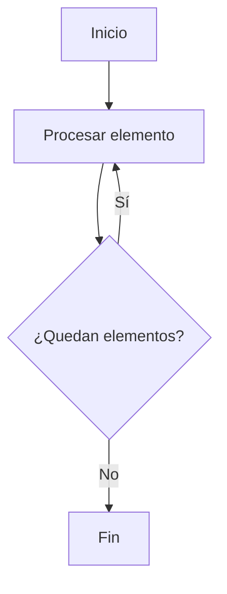
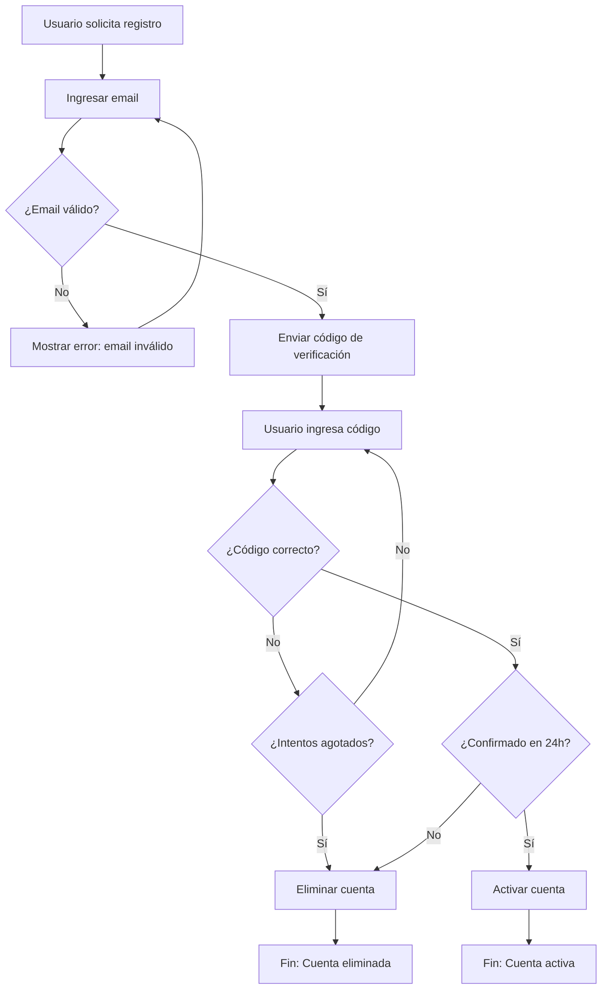

# Constructor de Diagramas de Flujo

Convierte procesos en diagramas de flujo para toma de decisiones clara. Transforma texto narrativo en árboles de decisión y diagramas de flujo con nodos, conexiones y ramificación condicional.

---

## Flujo de Trabajo

### Paso 1: Identificar el Proceso

Analizar el texto fuente para extraer:

| Elemento | Qué buscar |
|----------|------------|
| **Pasos** | Acciones secuenciales que ocurren en orden |
| **Decisiones** | Preguntas con 2+ respuestas posibles (sí/no, opción A/B/C) |
| **Resultados** | Finales del proceso (éxito, error, siguiente paso) |
| **Condiciones** | Si X entonces Y, excepciones, validaciones |

### Paso 2: Mapear la Estructura

Organizar en jerarquía:

```
Inicio
  ├── Paso 1
  │   ├── Condición A → Resultado A
  │   └── Condición B → Paso 2
  ├── Paso 2
  │   └── ...
  └── Fin
```

### Paso 3: Generar Diagrama

Crear en formato Mermaid o ASCII según el caso:

| Complejidad | Formato recomendado | Cuándo usarlo |
|-------------|---------------------|---------------|
| **Simple** (3-5 nodos) | Mermaid | Flujos lineales, decisiones sí/no |
| **Media** (6-10 nodos) | Mermaid | Procesos con varias ramas |
| **Compleja** (10+ nodos) | ASCII o dividir en subdiagramas | Arquitectura, procesos con muchas excepciones |

> **Regla:** Si Mermaid no se renderiza correctamente (diagrama demasiado ancho, cruces inevitables), usar ASCII. La claridad del diagrama tiene prioridad sobre el formato.

### Paso 4: Validar Claridad

Verificar que el diagrama sea comprensible sin necesidad de leer el texto original.

---

## Formato de Salida

### Encabezado

```md
# Diagrama de Flujo: {Nombre del Proceso}

**Propósito:** {qué decide o resuelve este diagrama}
**Nodo inicial:** {dónde empieza}
**Posibles finales:** {cuántos y cuáles son los resultados}
```

### Diagrama Mermaid

````md
```mermaid
flowchart TD
    A[Inicio: {descripción}] --> B{¿Condición?}
    B -->|Sí| C[Acción A]
    B -->|No| D[Acción B]
    C --> E[Resultado A]
    D --> F[Resultado B]
```
````

### Diagrama ASCII (alternativa)

```md
                    ┌─────────────┐
                    │   INICIO    │
                    └──────┬──────┘
                           │
                    ┌──────▼──────┐
                    │ ¿Condición? │
                    └──────┬──────┘
                     Sí │     │ No
                ┌────▼───┐ ┌──▼────┐
                │Acción A│ │Acción B│
                └───┬────┘ └───┬───┘
                    │          │
                ┌───▼────┐ ┌──▼─────┐
                │Resultado│ │Resultado│
                │   A    │ │   B    │
                └────────┘ └────────┘
```

### Leyenda de Nodos

| Tipo de nodo | Forma | Uso |
|--------------|-------|-----|
| **Inicio/Fin** | Rectángulo redondeado | Puntos de entrada y salida |
| **Proceso** | Rectángulo | Acciones o pasos |
| **Decisión** | Diamante | Preguntas con 2+ ramas |
| **Datos** | Paralelogramo | Entrada/salida de información |
| **Conector** | Círculo | Enlace entre secciones |

---

## Reglas de Diseño

### Simplicidad

- **Máximo 10-12 nodos** por diagrama (si es más grande, dividir en subdiagramas)
- **Un nodo = una acción o decisión** clara
- **Evitar nodos innecesarios** — si no agrega claridad, eliminarlo

### Etiquetado

- **Nodos de decisión:** terminar en `?` ("¿Es válido?")
- **Conexiones:** etiquetar cada rama con la condición ("Sí", "No", "Error", "Timeout")
- **Nodos de proceso:** usar verbo en infinitivo o imperativo ("Validar datos", "Enviar notificación")

### Flujo

- **De arriba hacia abajo** (vertical) como estándar
- **De izquierda a derecha** solo si el diagrama es ancho
- **Evitar cruces** de líneas cuando sea posible
- **Un punto de inicio**, múltiples puntos de fin si es necesario

### Colores (Mermaid)



---

## Patrones Comunes

### Decisión Simple (Sí/No)



### Decisión Múltiple



### Proceso con Validación



### Flujo Iterativo



---

## Ejemplo de Uso

**Entrada:**
> "Cuando un usuario se registra, primero validamos su email. Si es válido, le enviamos un código de verificación. Si confirma el código en 24 horas, activamos su cuenta. Si no, la eliminamos."

**Salida:**
```md
# Diagrama de Flujo: Registro de Usuario

**Propósito:** Flujo completo de registro y verificación de cuenta
**Nodo inicial:** Solicitud de registro
**Posibles finales:** Cuenta activada / Cuenta eliminada

---



---

**Guía de nodos:**
| Nodo | Tipo | Acción |
|------|------|--------|
| A | Proceso | Registro iniciado |
| B | Proceso | Ingreso de email |
| C | Decisión | Validación de formato |
| D | Proceso | Mensaje de error |
| E | Proceso | Envío de código |
| F | Proceso | Ingreso de código |
| G | Decisión | Validación de código |
| H | Decisión | Control de intentos |
| I | Proceso | Eliminación de cuenta |
| J | Decisión | Control de tiempo |
| K | Proceso | Activación de cuenta |
| L/M | Fin | Resultado final |

---

## Herramientas Recomendadas

| Herramienta | Tipo | Ventaja |
|-------------|------|---------|
| **Mermaid** | Markdown integrado | Se renderiza en GitHub, VS Code, docs |
| **draw.io** | App web/gratis | Arrastrar y soltar, exportar PNG/SVG |
| **Lucidchart** | App web/pago | Colaboración en tiempo real |
| **Excalidraw** | App web | Estilo dibujo a mano, gratuito |
| **PlantUML** | Texto a diagrama | Uso en documentación técnica |

---

## Restricciones

- **Mantener diagramas simples** — si hay más de 12 nodos, dividir en subdiagramas
- **Evitar nodos innecesarios** — cada nodo debe agregar claridad
- **No cruzar líneas** cuando sea posible
- **Etiquetar siempre** las conexiones de decisión
- **Un solo punto de inicio** — múltiples fines son aceptables
- **Usar Mermaid** como formato首选 para diagramas simples; **ASCII** cuando Mermaid no sea suficiente (arquitectura compleja, diagramas muy anchos)

---

## Checklist de Calidad

Antes de entregar el diagrama, verificar:

- [ ] Nodo de inicio claro y único
- [ ] Cada decisión tiene 2+ ramas etiquetadas
- [ ] No hay nodos huérfanos (sin conexión)
- [ ] No hay cruces de líneas innecesarios
- [ ] El diagrama se entiende sin leer el texto original
- [ ] Máximo 10-12 nodos (o dividido en subdiagramas)
- [ ] Los nodos de decisión terminan en `?`
- [ ] Cada nodo tiene una sola acción o decisión
- [ ] Hay al menos un nodo de fin para cada camino
