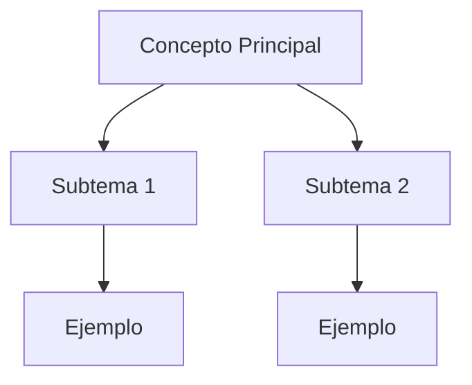

# Generador de Apuntes Estructurados

Convierte cualquier fuente de contenido educativo en apuntes limpios, jerárquicos y listos para estudiar. Extrae lo esencial, lo organiza por bloques temáticos y añade elementos que facilitan la retención.

---

## Flujo de Trabajo

### Paso 1: Recopilar Fuente

Identificar el tipo de entrada:

| Tipo | Acción |
|------|--------|
| **Tema o concepto** | Buscar en el repositorio o en la web fuentes confiables |
| **PDF de clase** | Extraer contenido con OCR o lectura directa |
| **Transcripción** | Procesar texto crudo y eliminar ruido |
| **Video/ conferencia** | Usar transcripción si está disponible |

### Paso 2: Analizar Contenido

- Identificar conceptos principales y secundarios
- Extraer definiciones clave
- Detectar relaciones entre conceptos
- Marcar ejemplos y casos prácticos existentes

### Paso 3: Estructurar Apuntes

Usar esta jerarquía:

```
# {Tema}
## 1. Concepto Principal → Definición → Ejemplo
## 2. Subtema A → Definición → Ejemplo
## 3. Subtema B → Definición → Ejemplo
### Conexiones entre conceptos
## Preguntas de Repaso
## Glosario
```

### Paso 4: Enriquecer

- Añadir analogías para conceptos complejos
- Incluir ejemplos prácticos o de la industria
- Crear esquemas de relación (ASCII o Mermaid)
- Generar preguntas de repaso (3-5)

### Paso 5: Validar

Verificar que los apuntes cumplan el checklist de calidad.

---

## Formato de Salida

### Encabezado Obligatorio

```md
# {Tema del tema} (Clase N)

**Curso:** {Nombre del curso} (ISIL, {year-semestre})
**Docente:** {Nombre del docente}
**Fecha:** DD/MM/AAAA
**Fuente:** {PDF, transcripción, tema, etc.}
```

### Estructura del Documento

```md
## Introducción
Gancho humano o pregunta guía que conecte con el estudiante.

## 1. {Concepto Principal}
### ¿Qué es?
Definición clara en 1-2 líneas.

### ¿Para qué sirve?
Uso o propósito inmediato.

### Ejemplo práctico
Caso real o analogía.

## 2. {Subtema}
Misma estructura: qué es → para qué sirve → ejemplo.

## Conexiones entre Conceptos
Mapa de relaciones o esquema visual.

## Preguntas de Repaso
3-5 preguntas que cubran los puntos más importantes.

## Glosario
| Término | Definición | Ejemplo |
|---------|------------|---------|
| ... | ... | ... |
```

---

## Reglas de Escritura

- **Español claro** y directo, sin jerga innecesaria
- **Frases cortas** (máx. 15 palabras en promedio)
- **Una idea principal por párrafo**
- **Negrita** solo para términos clave que ayuden a escanear
- **Listas** para conceptos sin orden, numeradas para pasos
- **Tablas** para comparar 3+ opciones o características

---

## Manejo de Conceptos Complejos

Para cada concepto que sea abstracto o difícil:

1. **Definición simple** en 1-2 líneas
2. **Analogía** con algo cotidiano
3. **Ejemplo real** de empresa o industria
4. **Conexión** con otro concepto del curso

> **Nota:** Para analogías de alta calidad, seguir las reglas del skill `complex-concept-explainer`: la analogía debe ser fiel, reconocible y no forzada. Si el concepto requiere explicación por capas (básico → intermedio → técnico), invocar ese skill directamente.

Si un concepto necesita más contexto, marcar con `[AMPLIAR]`.

---

## Esquemas de Relación

Usar Mermaid cuando la relación entre conceptos sea visual:



O ASCII para esquemas simples:

```
┌─────────────────┐
│ Concepto Principal │
└────────┬────────┘
         │
    ┌────┴────┐
    │         │
┌───▼──┐ ┌───▼──┐
│ Sub 1 │ │ Sub 2 │
└──────┘ └──────┘
```

---

## Preguntas de Repaso

Generar 3-5 preguntas que cubran:

1. **Definición** — ¿Qué es X?
2. **Aplicación** — ¿Cómo se usa X en la práctica?
3. **Comparación** — ¿Cuál es la diferencia entre X e Y?
4. **Análisis** — ¿Por qué X es importante para Z?
5. **Crítica** — ¿Qué pasaría si no existiera X?

---

## Restricciones

- **No inventar** información que no esté en la fuente
- **No simplificar** hasta perder precisión técnica
- **Marcar con [AMPLIAR]** conceptos que necesiten más contexto
- **Mantener apuntes** entre 500-1500 palabras salvo que el tema exija más
- **Respetar convenciones** del repositorio (español, estructura, nombres de archivo)

---

## Checklist de Calidad

Antes de entregar los apuntes, verificar:

- [ ] Encabezado cumple formato obligatorio
- [ ] Cada concepto tiene: definición → para qué sirve → ejemplo
- [ ] Hay al menos un ejemplo práctico por concepto complejo
- [ ] Preguntas de repaso cubran los puntos principales
- [ ] Glosario incluye términos clave
- [ ] El documento se entiende en lectura rápida
- [ ] No hay párrafos de más de 5 líneas
- [ ] Conexiones entre conceptos están claras
- [ ] Formato markdown es limpio y consistente

---

## Ejemplo de Uso

**Entrada:**
> "Genera apuntes sobre el modelo de madurez CMMI"

**Salida:**
```md
# Modelos de Madurez CMMI (Clase 6)

**Curso:** Arquitectura Empresarial (ISIL, 2026-1)
**Docente:** Richard Anthony Romero Mori
**Fecha:** 22/04/2026
**Fuente:** PDF de clase + investigacion complementaria

---

## Introducción

¿Alguna vez te preguntaste por qué algunas organizaciones ejecutan proyectos con calidad consistente y otras siempre tienen problemas? La respuesta está en su nivel de madurez de procesos.

## 1. ¿Qué es CMMI?

### ¿Qué es?
CMMI (Capability Maturity Model Integration) es un marco de referencia que evalúa la madurez de los procesos de una organización en 5 niveles.

### ¿Para qué sirve?
Para diagnosticar el nivel actual de madurez y definir un camino de mejora estructurado.

### Ejemplo práctico
Una empresa de software que pasa del Nivel 1 (caótico) al Nivel 3 (definido) puede reducir defectos en producción hasta en un 40%.

...
```
