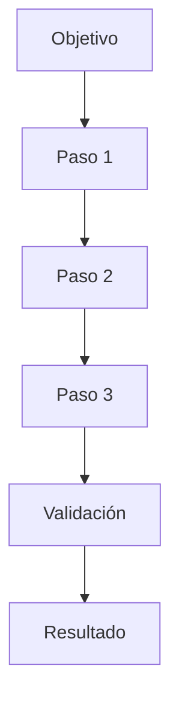
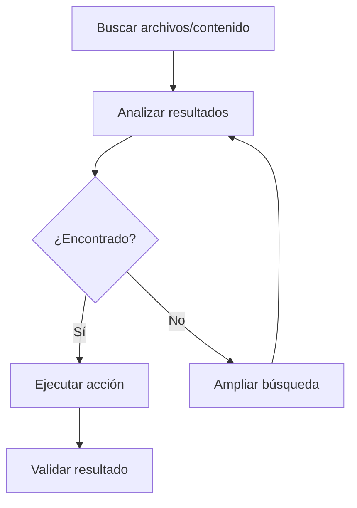
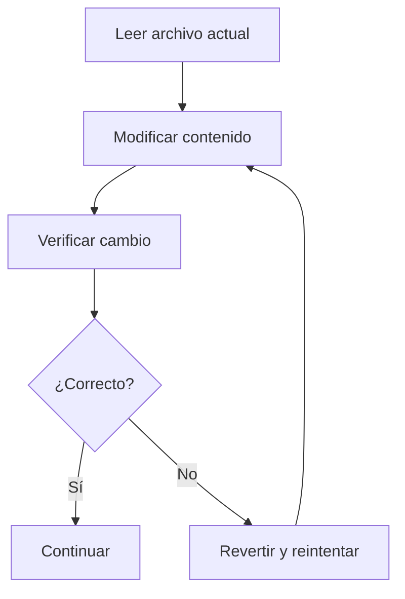
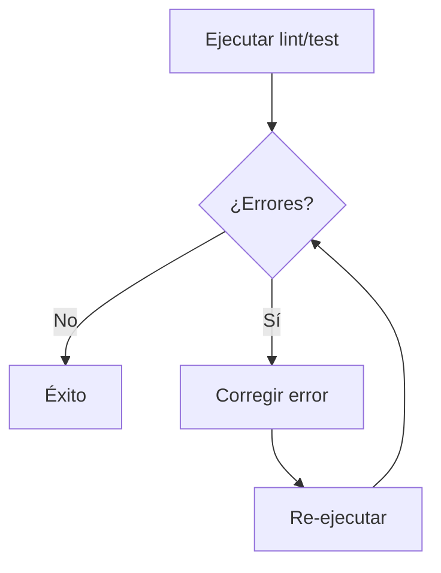
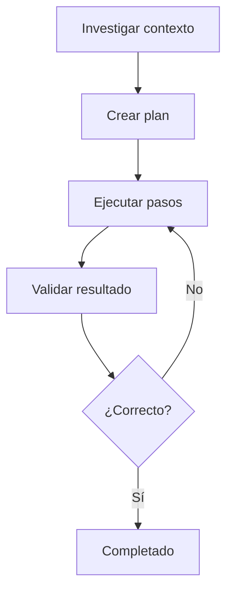
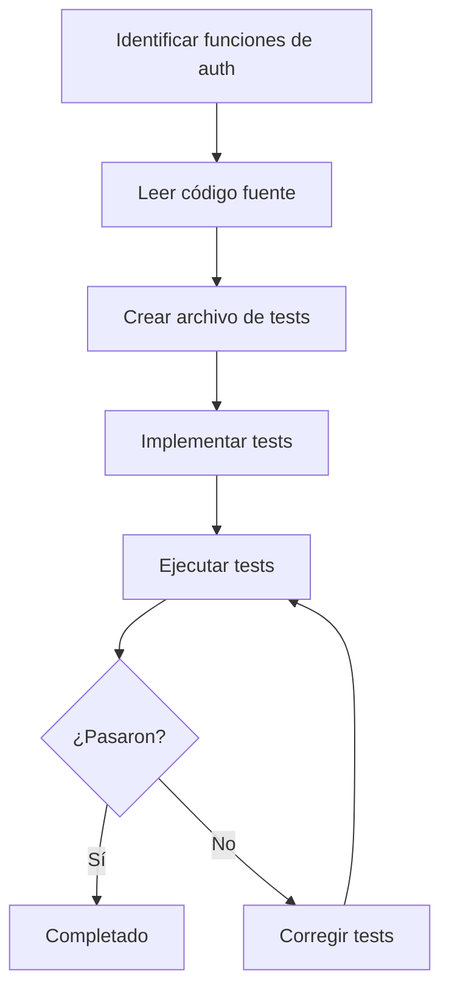

# Agente de Automatización de Flujos de Trabajo

Convierte objetivos en flujos de trabajo accionables para ejecución asistida por IA o humana. Descompone tareas complejas en pasos concretos, mapea acciones a herramientas y optimiza la ejecución.

---

## Flujo de Trabajo

### Paso 1: Entender el Objetivo

Definir claramente qué se quiere lograr:

| Pregunta | Propósito |
|----------|-----------|
| ¿Cuál es el resultado final? | Definir el "qué" |
| ¿Quién ejecuta? (humano, IA, ambos) | Adaptar el nivel de detalle |
| ¿Cuál es el contexto? (repositorio, proyecto, equipo) | Restricciones y convenciones |
| ¿Hay dependencias externas? | Identificar bloqueos |
| ¿Cuál es la prioridad? | Ordenar pasos |

### Paso 2: Descomponer en Pasos

Dividir el objetivo en acciones atómicas:

```
Objetivo
  ├── Paso 1 (acción concreta)
  ├── Paso 2 (depende de Paso 1)
  ├── Paso 3 (paralelizable con Paso 2)
  └── Paso 4 (validación final)
```

### Paso 3: Mapear Herramientas

Asignar cada paso a una herramienta o capacidad:

| Herramienta | Uso típico |
|-------------|------------|
| **Bash** | Comandos del sistema, git, npm, docker |
| **Read/Write/Edit** | Archivos del proyecto |
| **Grep/Glob** | Búsqueda de contenido o archivos |
| **Task (subagent)** | Tareas complejas que requieren autonomía |
| **WebSearch/WebFetch** | Investigación externa |
| **Skill** | Metodologías especializadas |

### Paso 4: Optimizar Ejecución

Identificar oportunidades de paralelismo y eficiencia.

### Paso 5: Validar

Verificar que cada paso tiene un resultado claro y verificable.

---

## Formato de Salida

### Encabezado del Workflow

```md
# Workflow: {Nombre del Objetivo}

**Objetivo:** {qué se quiere lograr}
**Ejecuta:** {humano / IA / ambos}
**Dependencias:** {herramientas, permisos, archivos necesarios}
**Tiempo estimado:** {N minutos}
**Resultado esperado:** {qué se obtiene al final}
```

### Diagrama de Flujo

````md

````

### Pasos Detallados

Para cada paso:

```md
### Paso N: {Título de la acción}

**Acción:** {qué hacer exactamente}
**Herramienta:** {bash / read / write / grep / task / skill}
**Comando/Instrucción:**
\`\`\`bash
{comando exacto o instrucción}
\`\`\`

**Resultado esperado:** {qué se obtiene}
**Si falla:** {cómo recuperarse}
**Depende de:** {Paso anterior o "ninguno"}
```

### Resumen de Herramientas

```md
| Paso | Herramienta | Comando clave | Estado |
|------|-------------|---------------|--------|
| 1 | Bash | `git status` | ⏳ |
| 2 | Read | `src/config.js` | ⏳ |
| 3 | Edit | `src/app.js` | ⏳ |
| 4 | Bash | `npm test` | ⏳ |
```

---

## Reglas de Diseño

### Acciones Atómicas

Cada paso debe ser una **única acción concreta**:

- ❌ "Configurar el proyecto"
- ✅ "Ejecutar `npm install` para instalar dependencias"
- ❌ "Revisar el código"
- ✅ "Buscar funciones sin test con `grep -n 'function' src/`"

### Resultados Verificables

Cada paso debe tener un **resultado que se pueda comprobar**:

- ❌ "Mejorar el código"
- ✅ "Archivos creados: `src/utils/validate.js`, `tests/validate.test.js`"
- ❌ "Ejecutar tests"
- ✅ "Tests pasan: 15/15 OK, 0 fallidos"

### Dependencias Claras

Indicar si un paso **depende de otro** o es **paralelizable**:

```
Paso 1 → Paso 2 → Paso 3 (secuencial)
Paso 1 → Paso 2a y Paso 2b (paralelo) → Paso 3
```

### Manejo de Errores

Incluir siempre un plan de recuperación:

```md
**Si falla:** 
- Verificar que el archivo `config.json` existe
- Si no existe, ejecutar `cp config.example.json config.json`
- Reintentar el paso
```

---

## Patrones Comunes

### Patrón: Búsqueda → Análisis → Acción



### Patrón: Leer → Modificar → Verificar



### Patrón: Detectar → Corregir → Confirmar



### Patrón: Investigar → Planificar → Ejecutar → Validar



---

## Ejemplo de Uso

**Entrada:**
> "Necesito agregar tests unitarios para el módulo de autenticación"

**Salida:**
```md
# Workflow: Agregar Tests de Autenticación

**Objetivo:** Crear suite de tests unitarios para el módulo de autenticación
**Ejecuta:** IA (asistida por humano para validación)
**Dependencias:** Jest configurado, módulo auth en `src/auth/`
**Tiempo estimado:** 15 minutos
**Resultado esperado:** Tests cubriendo login, logout, validación de token

---

## Diagrama de Flujo



---

### Paso 1: Identificar funciones a testear

**Acción:** Buscar todas las funciones exportadas del módulo auth
**Herramienta:** Grep
**Comando/Instrucción:**
```bash
grep -n "export" src/auth/*.js
```

**Resultado esperado:** Lista de funciones: `login`, `logout`, `validateToken`, `refreshToken`
**Si falla:** Verificar que la ruta `src/auth/` existe
**Depende de:** Ninguno

---

### Paso 2: Leer código fuente

**Acción:** Leer cada función para entender parámetros, retorno y edge cases
**Herramienta:** Read
**Comando/Instrucción:**
```bash
Read: src/auth/login.js
Read: src/auth/logout.js
Read: src/auth/validateToken.js
```

**Resultado esperado:** Comprensión de lógica, validaciones y errores posibles
**Si falla:** Archivo no encontrado → verificar nombre exacto con `ls src/auth/`
**Depende de:** Paso 1

---

### Paso 3: Crear archivo de tests

**Acción:** Crear `src/auth/auth.test.js` con estructura básica
**Herramienta:** Write
**Comando/Instrucción:**
```javascript
// src/auth/auth.test.js
const { login, logout, validateToken } = require('./index');

describe('Auth Module', () => {
  describe('login', () => {
    // tests aquí
  });
  
  describe('logout', () => {
    // tests aquí
  });
  
  describe('validateToken', () => {
    // tests aquí
  });
});
```

**Resultado esperado:** Archivo creado con describe blocks para cada función
**Si falla:** Verificar que Jest está configurado en `package.json`
**Depende de:** Paso 2

---

### Paso 4: Implementar tests

**Acción:** Escribir tests para cada función con casos happy path y edge cases
**Herramienta:** Edit
**Comando/Instrucción:**
```javascript
// Casos a testear:
// login: credenciales válidas, credenciales inválidas, usuario no existe
// logout: token válido, token expirado
// validateToken: token válido, token expirado, token malformado
```

**Resultado esperado:** 8-12 tests implementados
**Si falla:** Revisar mocking de dependencias externas
**Depende de:** Paso 3

---

### Paso 5: Ejecutar y validar

**Acción:** Ejecutar suite de tests y verificar cobertura
**Herramienta:** Bash
**Comando/Instrucción:**
```bash
npm test -- --coverage src/auth/auth.test.js
```

**Resultado esperado:** Todos los tests pasan, cobertura > 80%
**Si falla:** Revisar tests fallidos, corregir assertions
**Depende de:** Paso 4

---

## Resumen de Herramientas

| Paso | Herramienta | Comando clave | Estado |
|------|-------------|---------------|--------|
| 1 | Grep | `grep -n "export" src/auth/*.js` | ⏳ |
| 2 | Read | `src/auth/login.js`, `logout.js`, `validateToken.js` | ⏳ |
| 3 | Write | `src/auth/auth.test.js` | ⏳ |
| 4 | Edit | Agregar tests por función | ⏳ |
| 5 | Bash | `npm test --coverage` | ⏳ |
```

---

## Restricciones

- **Evitar instrucciones vagas** — cada paso debe ser una acción concreta
- **Mantener flujo lógico** — dependencias claras entre pasos
- **No más de 10-12 pasos** — si es más grande, dividir en sub-workflows
- **Incluir resultado esperado** en cada paso
- **Incluir plan de recuperación** si falla
- **Herramientas específicas** — no "usar herramienta X" sino el comando exacto

---

## Checklist de Calidad

Antes de entregar el workflow, verificar:

- [ ] Objetivo claro y específico
- [ ] Cada paso es una acción atómica y concreta
- [ ] Cada paso tiene herramienta asignada
- [ ] Cada paso tiene resultado verificable
- [ ] Dependencias entre pasos están marcadas
- [ ] Pasos paralelizables están identificados
- [ ] Plan de recuperación para errores comunes
- [ ] Flujo lógico sin saltos innecesarios
- [ ] Tiempo estimado razonable
- [ ] Resumen de herramientas al final
