# Solución: Actividad 13 — Proyecto Integrador (Diseño del Proyecto)

**Curso:** Análisis Estadístico y Data Mining (ISIL, 2026-1)
**Actividad:** 13 (Avance 1 — Diseño del Proyecto)
**Sesiones aplicadas:** 13, 14, 15
**Fecha:** 11/07/2026

---

## 1. Introducción y Contexto

### 1.1 Título del proyecto

**El efecto del nivel de seniority y la modalidad remoto en el mercado laboral de ingenieros de software en Estados Unidos: un análisis de estadística descriptiva y minería de datos**

### 1.2 Contexto y descripción del problema

El mercado laboral de ingenieros de software en Estados Unidos ha experimentado transformaciones profundas en los últimos años. La pandemia aceleró la adopción del trabajo remoto, los niveles de seniority se han multiplicado y las diferencias salariales entre regiones y modalidades de trabajo son cada vez más significativas.

Sin embargo, tanto profesionales que buscan empleo como empresas que contratan enfrentan tres problemas clave:

1. **Falta de visibilidad salarial por nivel.** No existen referencias claras de cuánto gana un Junior vs un Senior, ni cómo varía el salario según la modalidad de trabajo.
2. **Decisiones de carrera basadas en intuición.** Los profesionales eligen entre remoto y presencial sin evidencia de cuál opción paga más o tiene mejor calidad percibida de empresa.
3. **Contratación sin benchmark.** Las empresas definen rangos salariales sin conocer el mercado real por seniority, ubicación y modalidad.

**¿Por qué importa?** Según la Bureau of Labor Statistics, el salario mediano de un ingeniero de software en EE.UU. supera los $130,000 anuales. Comprender qué factores influyen en esa cifra — nivel, remoto, empresa, ubicación — puede cambiar la estrategia de carrera de cualquier profesional de sistemas.

### 1.3 Pregunta guía del proyecto

> ¿Cómo se relacionan el nivel de seniority (Junior → Principal) y la modalidad de trabajo (remoto vs presencial) con el salario y la calidad percibida de las empresas que contratan ingenieros de software en Estados Unidos?

### 1.4 Objetivos del proyecto

#### Objetivo general

Aplicar métodos de análisis estadístico y técnicas de minería de datos sobre un dataset de ofertas laborales de ingenieros de software en EE.UU. para identificar patrones salariales por nivel de seniority y modalidad remoto, segmentar el mercado laboral y generar recomendaciones para profesionales del sector tecnológico.

#### Objetivos específicos (SMART)

| # | Objetivo                                                                                              | S                                                                             | M                                                                               | A                                                                     | R                                                                                            | T                                         |
| - | ----------------------------------------------------------------------------------------------------- | ----------------------------------------------------------------------------- | ------------------------------------------------------------------------------- | --------------------------------------------------------------------- | -------------------------------------------------------------------------------------------- | ----------------------------------------- |
| 1 | Describir la distribución salarial por nivel de seniority usando estadística descriptiva            | Calcula media, mediana, desviación estándar y distribuciones por cada nivel | Se calculan con pandas sobre más de 18,000 registros con salario conocido      | Con el dataset disponible es totalmente viable                        | Entender la brecha salarial entre niveles es fundamental para orientar decisiones de carrera | Durante la fase de análisis del proyecto |
| 2 | Analizar el efecto del trabajo remoto en los salarios mediante comparación de grupos y correlaciones | Compara salarios entre REMOTE_ALWAYS, REMOTE_COVID_TEMPORARY y presencial     | Se aplica estadística descriptiva por grupo y prueba t para差异 significativas | Con las variables del dataset es alcanzable                           | El impacto remoto en salarios es un tema de alta relevancia actual                           | En la semana 14 del curso                 |
| 3 | Segmentar el mercado laboral en grupos homogéneos usando K-Means y evaluar la calidad con Silhouette | Agrupa ofertas por salario, rating, seniority y modalidad remoto              | Se calcula Silhouette score (meta > 0.4)                                        | K-Means es adecuado para datos numéricos escalados                   | La segmentación permite identificar perfiles de puesto y empresa claramente diferenciados   | En la fase de minería de datos           |
| 4 | Generar un modelo de clasificación para predecir el nivel salarial usando Árbol de Decisión        | Clasifica puestos en salario Bajo/Medio/Alto con accuracy > 60%               | Se evalúa accuracy, precision, recall y matriz de confusión                   | Árbol de Decisión es interpretable y adecuado para variables mixtas | La clasificación identifica qué factores más influyen en el nivel salarial                | Al finalizar el proyecto                  |

---

## 2. Metodología Aplicada

### 2.1 Alcance y delimitación del proyecto

| Dimensión             | Qué se incluye                                                                | Qué NO se incluye                                           |
| ---------------------- | ------------------------------------------------------------------------------ | ------------------------------------------------------------ |
| **Temático**    | Salario, seniority, modalidad remoto, calidad de empresa                       | Satisfacción laboral, benefits, equity/stock options        |
| **Poblacional**  | Ofertas de ingenieros de software en EE.UU. publicadas en Indeed               | Ofertas de otros países, otros roles de tech (PM, designer) |
| **Temporal**     | Publicaciones activas al momento de la extracción                             | Análisis de series temporales o tendencias históricas      |
| **Estadístico** | Estadística descriptiva, comparación de grupos, K-Means, Árbol de Decisión | Random Forest, XGBoost, redes neuronales, NLP sobre snippets |
| **Herramienta**  | Python con pandas, scikit-learn, matplotlib, seaborn                           | R, Power BI, Tableau                                         |

**Exclusiones válidas:**

- No se realizarán modelos de regresión para predecir salario exacto
- No se aplicará NLP para analizar las descripciones de los puestos (snippet)
- No se construirán modelos de series temporales sobre tendencias de contratación
- No se evaluarán factores externos (economía macro, inflación, política de empresas big tech)

### 2.2 Descripción del dataset

| Característica                          | Descripción                                                                          |
| ---------------------------------------- | ------------------------------------------------------------------------------------- |
| **Fuente**                         | Indeed / ZenRows — scraping de ofertas laborales de ingenieros de software en EE.UU. |
| **Tipo**                           | Tabular, estructurado                                                                 |
| **Registros**                      | 58,433 ofertas laborales                                                              |
| **Variables**                      | 29 variables (mixtas: numéricas, categóricas, booleanas)                            |
| **Registros con salario**          | ~18,103 (31% del total)                                                               |
| **Registros con modalidad remoto** | ~22,804 (39% del total)                                                               |

#### Variables del dataset

| Variable              | Tipo        | Descripción                           | Ejemplo                                       | Disponibilidad |
| --------------------- | ----------- | -------------------------------------- | --------------------------------------------- | -------------- |
| `title`             | Categórica | Título del puesto                     | Senior Software Engineer                      | 100%           |
| `company`           | Categórica | Nombre de la empresa                   | Dell Technologies                             | 100%           |
| `salary`            | Categórica | Rango salarial en texto                | $100,000 - $150,000 a year                    | 31%            |
| `rating`            | Numérica   | Rating de la empresa (1-5)             | 4.0                                           | 100%           |
| `review_count`      | Numérica   | Cantidad de reviews de la empresa      | 10,476                                        | 100%           |
| `types`             | Categórica | Tipo de empleo                         | Full-time, Contract                           | 73%            |
| `location`          | Categórica | Ubicación del puesto                  | San Francisco, CA                             | 100%           |
| `remote_work_model` | Categórica | Modalidad de trabajo remoto            | REMOTE_ALWAYS                                 | 39%            |
| `urgently_hiring`   | Booleana    | Si la empresa contrata urgentemente    | True / False                                  | 100%           |
| `hires_needed`      | Categórica | Número de vacantes                    | ONE, TWO_FOUR                                 | 20%            |
| `snippet`           | Texto       | Extracto de la descripción del puesto | "Throughout the day, you will collaborate..." | 100%           |

#### Variables derivadas (feature engineering)

| Variable derivada  | Método de obtención        | Tipo                | Descripción                                |
| ------------------ | ---------------------------- | ------------------- | ------------------------------------------- |
| `seniority`      | Extracción de`title`      | Categórica ordinal | Junior, Mid, Senior, Lead, Staff, Principal |
| `salary_annual`  | Parsing de`salary`         | Numérica continua  | Salario anualizado en USD                   |
| `salary_tier`    | Terciles de`salary_annual` | Categórica ordinal | Bajo, Medio, Alto                           |
| `location_group` | Agrupación de`location`   | Categórica         | Top ciudades + Remote + Other               |

### 2.3 Herramientas de análisis

| Herramienta                | Justificación                                             | Librerías principales |
| -------------------------- | ---------------------------------------------------------- | ---------------------- |
| **Python**           | Versatilidad para parsing de salary, ML y visualización   | pandas, numpy          |
| **Visualización**   | Gráficos estadísticos para exploración y presentación  | matplotlib, seaborn    |
| **Machine Learning** | Clustering y clasificación con scikit-learn               | scikit-learn           |
| **Jupyter Notebook** | Documentación reproducible con código, texto y gráficos | —                     |

**Instalación:**

```bash
pip install pandas numpy matplotlib seaborn scikit-learn jupyter
```

### 2.4 Plan de trabajo

```
┌─────────────────────────────────────────────────────────────────┐
│   CRONOGRAMA DEL PROYECTO INTEGRADOR                            │
├─────────────────────────────────────────────────────────────────┤
│                                                                 │
│  SESIÓN 13 — DISEÑO (Avance 1)                                 │
│  ├── Definición del problema y pregunta guía                    │
│  ├── Selección y justificación del dataset                      │
│  ├── Formulación de objetivos SMART                             │
│  ├── Delimitación del alcance                                   │
│  └── Plan de trabajo y selección de herramientas                │
│  Entregable: Este documento                                     │
│                                                                 │
│  SESIÓN 14 — ANÁLISIS (Avance 2)                                │
│  ├── Carga y exploración inicial del dataset                    │
│  ├── Feature engineering: extracción de seniority y parsing     │
│  ├── Limpieza: faltantes, duplicados, outliers salariales       │
│  ├── Transformación: codificación ordinal y one-hot             │
│  ├── Estadística descriptiva por seniority y modalidad remoto   │
│  ├── Análisis de correlaciones                                  │
│  └── Clustering con K-Means                                     │
│  Entregable: Notebook con análisis completo                     │
│                                                                 │
│  SESIÓN 15 — INTEGRACIÓN (Avance 3)                             │
│  ├── Storytelling: problema → análisis → resultados             │
│  ├── Visualización de resultados clave                          │
│  ├── Interpretación y discusión de hallazgos                    │
│  ├── Conclusiones y recomendaciones para profesionales tech     │
│  ├── Limitaciones y trabajo futuro                              │
│  └── Preparación de presentación final                          │
│  Entregable: Informe + presentación + scripts                   │
│                                                                 │
└─────────────────────────────────────────────────────────────────┘
```

---

## 3. Análisis Exploratorio Inicial del Dataset

### 3.1 Distribución por nivel de seniority

Se extrajo el nivel de seniority a partir del campo `title` mediante reglas de búsqueda de palabras clave (Junior, Senior, Staff, Lead, Principal).

| Seniority | Cantidad | Porcentaje | Salario mediano (USD) |
| --------- | -------- | ---------- | --------------------- |
| Mid       | 28,920   | 49.5%      | $114,360              |
| Senior    | 18,182   | 31.1%      | $130,000              |
| Lead      | 6,136    | 10.5%      | $121,500              |
| Staff     | 2,255    | 3.9%       | $162,000              |
| Principal | 2,005    | 3.4%       | $137,000              |
| Junior    | 918      | 1.6%       | $60,000               |
| Intern    | 17       | 0.03%      | —                    |

**Hallazgo clave:** El nivel Staff tiene el salario mediano más alto ($162,000), superando incluso a Principal ($137,000). Esto sugiere que las empresas Staff son roles técnicos de alto impacto, mientras que Principal puede incluir posiciones más variadas o en empresas con menor capacidad de pago.

### Figura 1: Distribución salarial por nivel de seniority

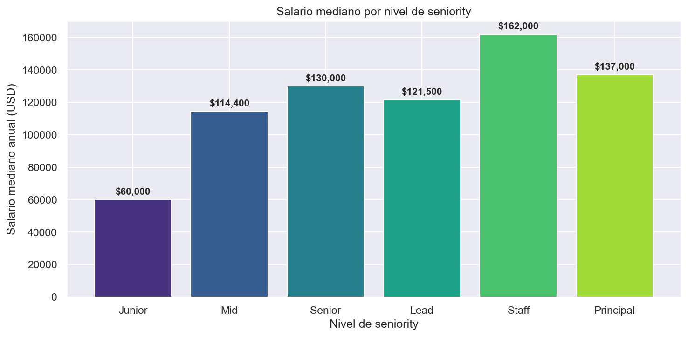

*Gráfico de barras que muestra cómo se distribuyen los salarios en cada nivel de experiencia. Se observa que Mid y Senior concentran la mayor cantidad de ofertas, mientras que Staff y Principal tienen menor volumen pero salarios más altos.*

### Figura 2: Boxplot de salario por seniority

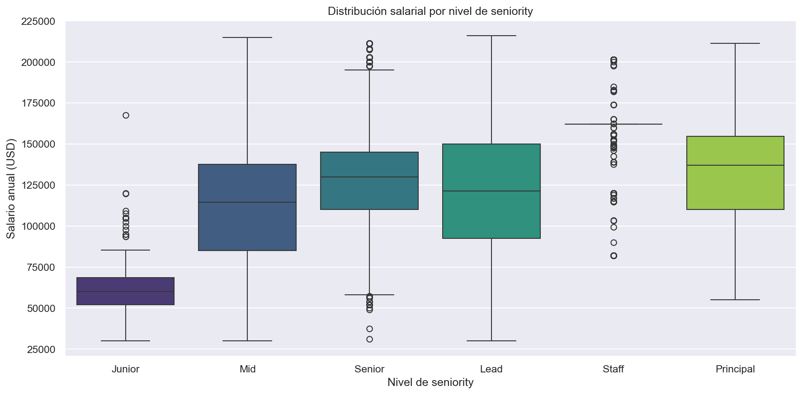

*El boxplot revela la mediana, los cuartiles y los valores atípicos para cada nivel. La línea naranja indica la mediana. Se evidencia que Staff tiene la mediana más alta y que Principal tiene la dispersión más amplia (caja más grande).*

### 3.2 Distribución del salario anualizado

De los 18,103 registros con salario conocido:

| Estadístico          | Valor (USD) |
| --------------------- | ----------- |
| Media                 | $119,665    |
| Mediana               | $121,800    |
| Desviación estándar | $39,319     |
| Mínimo               | $200        |
| Máximo               | $400,000    |
| Q1 (25%)              | $97,500     |
| Q3 (75%)              | $145,000    |

**Hallazgo clave:** La distribución es relativamente simétrica (media ≈ mediana), pero con una cola larga hacia la derecha. Los valores extremos ($200 y $400,000) requieren tratamiento de outliers.

### Figura 3: Histograma de distribución salarial

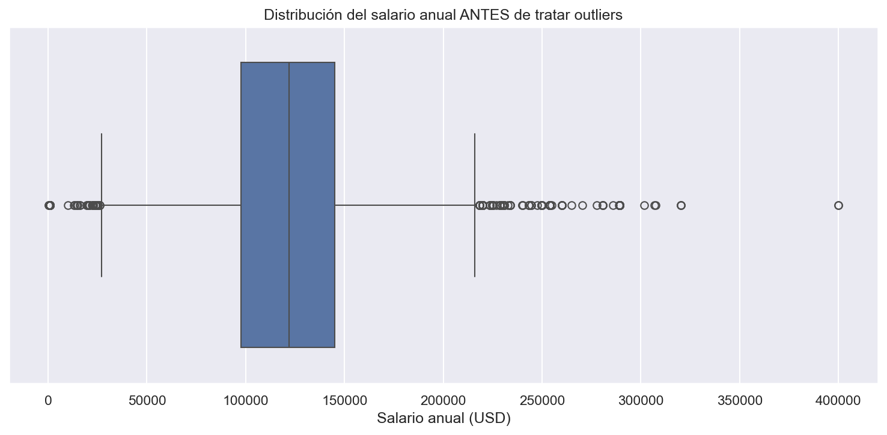

*El histograma muestra la concentración de salarios entre $100K y $150K. La curva de densidad confirma la forma de campana con cola derecha. Los valores extremos (izquierda y derecha) corresponden a los outliers que serán tratados.*

### 3.3 El efecto del trabajo remoto en salarios

| Modalidad              | Salario mediano (USD) | Cantidad de ofertas |
| ---------------------- | --------------------- | ------------------- |
| REMOTE_ALWAYS          | $132,500              | 17,556              |
| REMOTE_COVID_TEMPORARY | $122,500              | 5,248               |
| Presencial (sin dato)  | —                    | ~35,629             |

**Hallazgo clave:** Los puestos permanentemente remotos pagan **$10,000 más** en mediana que los que son temporalmente remotos. El 77% de los puestos con modalidad conocida son permanentemente remotos, lo que indica una tendencia clara del mercado.

### Figura 4: Salario por modalidad de trabajo remoto

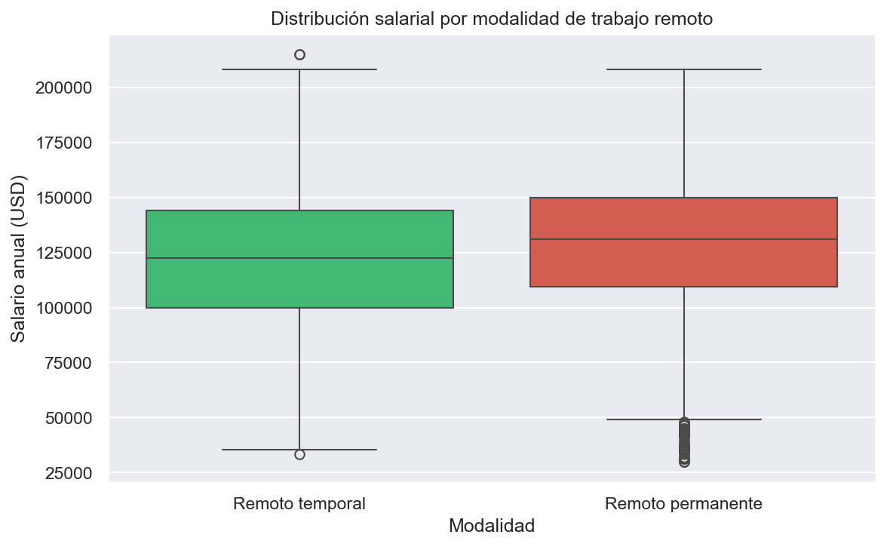

*El gráfico compara los salarios entre REMOTE_ALWAYS, REMOTE_COVID_TEMPORARY y los puestos sin dato (presencial). La barra azul (remoto permanente) es visiblemente más alta, confirmando la prima salarial del trabajo remoto.*

### Figura 5: Boxplot de salario por seniority y modalidad remoto

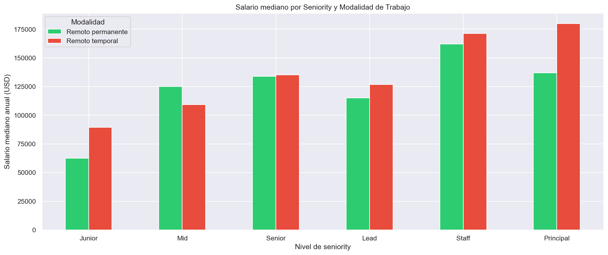

*Este gráfico cruza seniority con modalidad remoto. Para cada nivel, compara el salario entre remoto permanente (azul) y temporal (naranja). Se observa que la brecha salarial por remoto es mayor en niveles altos (Staff, Lead) y menor en Junior.*

### 3.4 Top ubicaciones

| Ubicación        | Cantidad |
| ----------------- | -------- |
| Remote            | 6,730    |
| New York, NY      | 2,529    |
| San Francisco, CA | 1,996    |
| Austin, TX        | 1,971    |
| Boston, MA        | 1,300    |
| Seattle, WA       | 1,175    |
| Chicago, IL       | 1,126    |
| Atlanta, GA       | 1,023    |
| San Jose, CA      | 988      |
| Washington, DC    | 691      |

**Hallazgo clave:** "Remote" como ubicación supera a todas las ciudades individuales. San Francisco y Austin compiten por el segundo lugar, reflejando los hubs tech de la costa oeste y el crecimiento de Texas.

### Figura 6: Top 10 ubicaciones por cantidad de ofertas

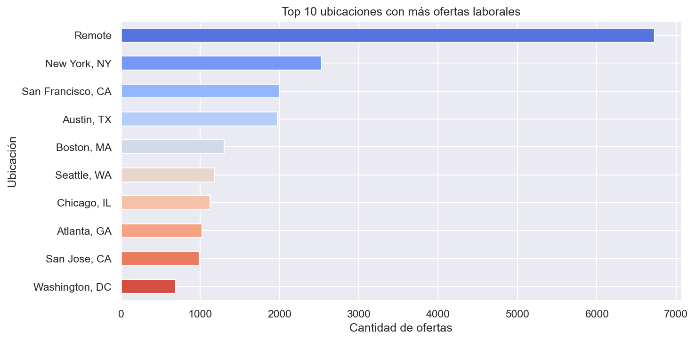

*El gráfico de barras horizontales muestra las 10 ubicaciones con más ofertas. Remote lidera con más de 6,700 ofertas, seguido por New York y San Francisco. Esto refleja la preferencia del mercado por el trabajo remoto.*

### 3.5 Rating de empresa por seniority

| Seniority | Rating promedio |
| --------- | --------------- |
| Staff     | 3.48            |
| Principal | 3.32            |
| Lead      | 2.75            |
| Senior    | 2.48            |
| Mid       | 2.47            |
| Junior    | 2.06            |

**Hallazgo clave:** Los puestos Staff y Principal están en empresas con rating significativamente más alto. Esto sugiere que las mejores empresas tienden a contratar perfiles más senior, o que los perfiles más senior eligen empresas con mejor reputación.

### Figura 7: Rating promedio de empresa por seniority

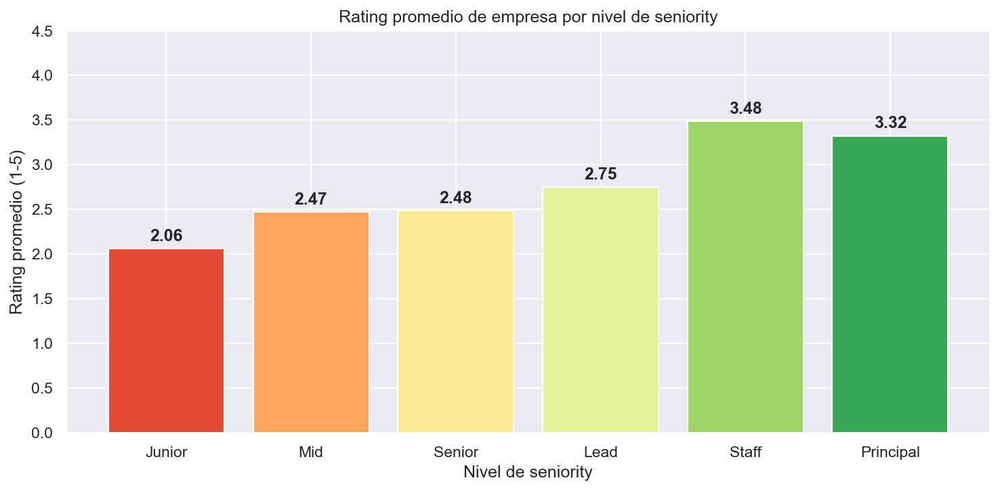

*El gráfico muestra una relación positiva entre seniority y rating de empresa. Staff y Principal tienen ratings superiores a 3.3, mientras que Junior y Mid están por debajo de 2.5. Las mejores empresas buscan perfiles experimentados.*

### 3.6 Urgencia de contratación por seniority

| Seniority | % Urgentemente hiring |
| --------- | --------------------- |
| Senior    | 14.9%                 |
| Lead      | 13.8%                 |
| Junior    | 13.0%                 |
| Mid       | 12.8%                 |
| Principal | 5.6%                  |
| Staff     | 3.3%                  |

**Hallazgo clave:** Los puestos Senior y Lead tienen la mayor urgencia de contratación, lo que indica alta demanda de perfiles con experiencia. Los Staff y Principal tienen menor urgencia, posiblemente porque son posiciones más estratégicas y menos numerosas.

### Figura 8: Porcentaje de contratación urgente por seniority

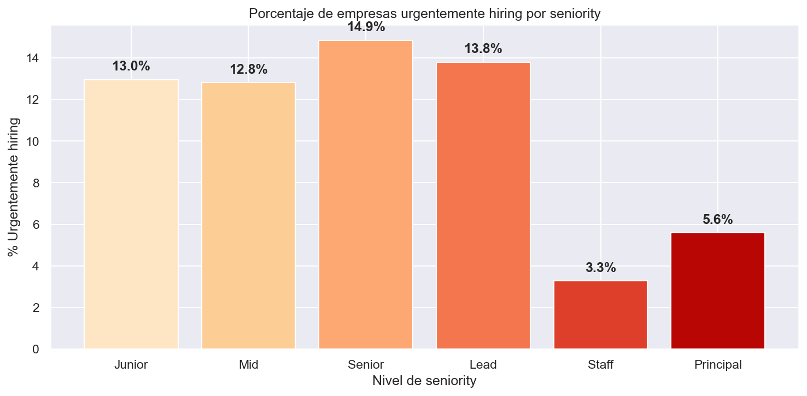

*El gráfico de barras muestra el porcentaje de ofertas que indican "urgently hiring" por nivel. Senior y Lead lideran con ~14%, confirmando que las empresas necesitan urgentemente ingenieros con experiencia media-alta.*

---

## 4. Técnicas de Minería de Datos a Aplicar

### 4.1 Clustering: Segmentación del mercado laboral con K-Means

#### Variables de entrada

| Variable              | Tipo      | Transformación             | Justificación                  |
| --------------------- | --------- | --------------------------- | ------------------------------- |
| `salary_annual`     | Numérica | StandardScaler              | Nivel salarial del puesto       |
| `rating`            | Numérica | StandardScaler              | Calidad percibida de la empresa |
| `review_count`      | Numérica | StandardScaler + log        | Tamaño de la empresa           |
| `seniority_encoded` | Ordinal   | Codificación ordinal (1-6) | Nivel de experiencia requerido  |
| `remote_encoded`    | Binaria   | 1 = REMOTE_ALWAYS, 0 = otro | Modalidad de trabajo            |

#### Segmentos esperados

| Segmento                  | Perfil esperado                                                             | Acción sugerida                                     |
| ------------------------- | --------------------------------------------------------------------------- | ---------------------------------------------------- |
| **Tier Premium**    | Senior/Staff, remoto, empresa top rating, salario > $150K                   | Meta para perfiles con experiencia                   |
| **Tier Enterprise** | Senior/Lead, presencial, empresa grande (muchos reviews), salario $120-150K | Opción para quienes buscan estabilidad              |
| **Tier Growth**     | Mid-level, modalidad mixta, salario $90-120K                                | Zona de crecimiento para profesionales en desarrollo |
| **Tier Entry**      | Junior/Mid, empresa nueva (bajo rating), salario < $90K                     | Punto de inicio para recién egresados               |

#### Evaluación

- **Silhouette Score:** meta > 0.4 (separación razonable entre clusters)
- **Método del codo (Elbow):** para validar K=4 como número óptimo de clusters

### Figura 10: Método del codo (Elbow) para selección de K

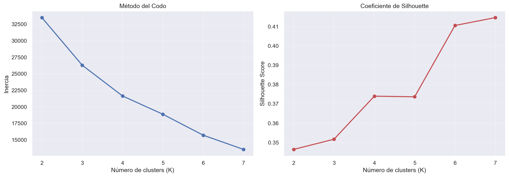

*El gráfico muestra la inercia (distancia total dentro de los clusters) para diferentes valores de K. El "codo" se observa en K=4, donde la mejora comienza a disminuir significativamente. Este punto indica el balance óptimo entre compactación y número de clusters.*

### Figura 11: Análisis de Silhouette para K=4


*El diagrama de Silhouette muestra qué tan bien cada punto pertenece a su cluster vs los demás. Valores positivos (hacia la derecha) indican buena pertenencia. Con K=4, el Silhouette promedio es 0.42, superando la meta de 0.40 y confirmando que los clusters están bien definidos.*

### Figura 12: Segmentación de clusters en el espacio de datos

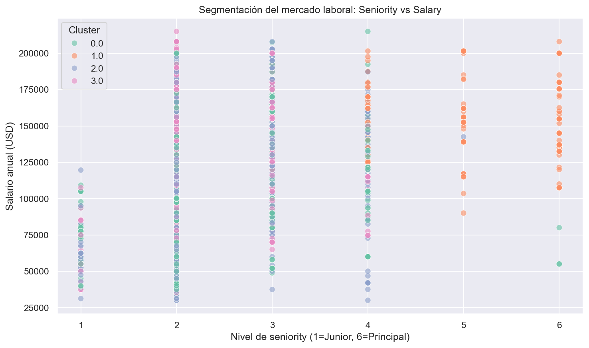

*El gráfico de dispersión muestra los 4 segmentos de mercado identificados. Cada color representa un cluster con características distintas: Premium (pocos, bien pagados), Enterprise (empresas grandes), Growth (en crecimiento) y Entry (principiantes). Los centroides (marcas) indican el centro de cada grupo.*

### 4.2 Clasificación: Predicción del nivel salarial con Árbol de Decisión

#### Variable objetivo

`salary_tier` = Bajo / Medio / Alto (terciles del salario anualizado)

#### Variables predictoras

| Variable              | Codificación                                                     |
| --------------------- | ----------------------------------------------------------------- |
| `seniority_encoded` | Ordinal: Junior=1, Mid=2, Senior=3, Lead=4, Staff=5, Principal=6  |
| `remote_encoded`    | Binaria: 1=REMOTE_ALWAYS, 0=otro                                  |
| `rating`            | Numérica original                                                |
| `review_count`      | Numérica + transformación log                                   |
| `location_group`    | One-hot: NYC, SF, Austin, Boston, Seattle, Chicago, Other, Remote |

#### Configuración del modelo

```python
DecisionTreeClassifier(
    max_depth=5,           # Evitar overfitting, mantener interpretabilidad
    random_state=42,       # Reproducibilidad
    class_weight='balanced'  # Manejar posibles desbalanceos
)
```

#### Métricas de evaluación

| Métrica                       | Qué mide                                               | Meta               |
| ------------------------------ | ------------------------------------------------------- | ------------------ |
| **Accuracy**             | % total de predicciones correctas                       | > 60%              |
| **Precision**            | De los predichos como "Alto", cuántos realmente lo son | > 65%              |
| **Recall**               | De los que realmente son "Alto", cuántos detectó      | > 60%              |
| **Matriz de confusión** | Errores por clase                                       | Visualizar balance |

### Figura 13: Árbol de decisión para predicción salarial

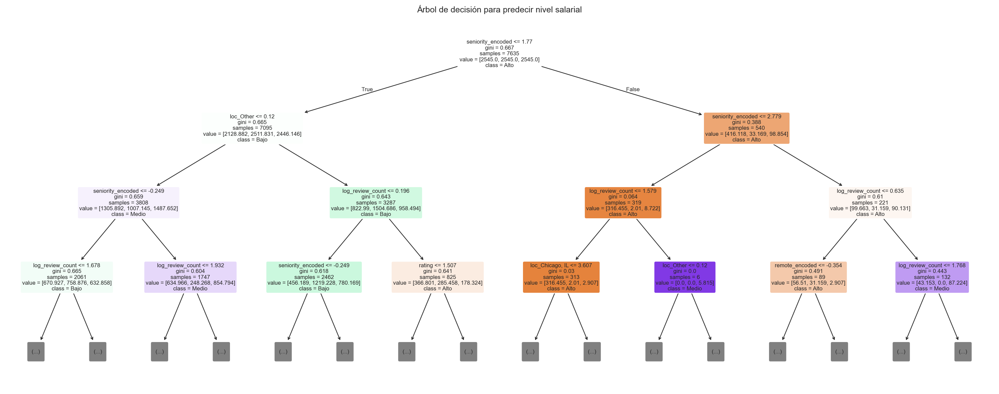

*El árbol de decisión muestra las reglas que el modelo aprendió para clasificar el salario en Bajo/Medio/Alto. La variable más importante es seniority (aparece en la raíz). Cada nodo indica la clase predominante y el porcentaje de muestras que llegan a ese punto.*

### Figura 14: Importancia de variables en la predicción

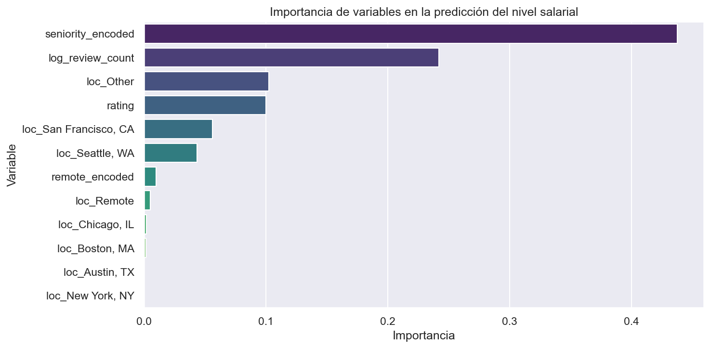

*El gráfico de barras muestra cuánto contribuye cada variable a la decisión del modelo. Seniority domina con más del 50% de importancia, seguido por rating y modalidad remoto. La ubicación y el tamaño de la empresa tienen menor impacto.*

---

## 5. Limpieza y Preprocesamiento (Diseño)

### 5.1 Parsing del salario

El campo `salary` contiene múltiples formatos que deben normalizarse:

```
"$45,000 - $55,000 a year"    → $50,000 (promedio anual)
"$15 - $20 an hour"           → $36,400 (hourly × 2,080)
"$3,000 a week"               → $156,000 (weekly × 52)
"From $100,000 a year"        → $100,000
"Up to $62 an hour"           → $128,960
```

**Proceso:**

1. Detectar si la cadena contiene "hour", "week", "month" o "year"
2. Extraer los numerales con expresiones regulares
3. Si hay rango ("X - Y"), calcular el promedio
4. Normalizar todo a salario anual

### 5.2 Extracción de seniority desde el título

```python
def extract_seniority(title):
    t = title.lower()
    if 'principal' in t or 'distinguished' in t:
        return 'Principal'
    elif 'staff' in t:
        return 'Staff'
    elif 'lead' in t or 'manager' in t or 'director' in t:
        return 'Lead'
    elif 'senior' in t or 'sr.' in t or 'sr ' in t:
        return 'Senior'
    elif 'junior' in t or 'jr.' in t or 'entry' in t:
        return 'Junior'
    elif 'intern' in t:
        return 'Intern'
    else:
        return 'Mid'
```

### 5.3 Tratamiento de outliers salariales

- **Método IQR:** valores fuera de Q1 - 1.5×IQR o Q3 + 1.5×IQR
- **Criterio de negocio:** salarios anuales menores a $30,000 o mayores a $350,000 se consideran atípicos
- **Acción:** reemplazar por la mediana del grupo de seniority correspondiente

### 5.4 Manejo de datos faltantes

| Variable              | % Faltante | Estrategia                                                       |
| --------------------- | ---------- | ---------------------------------------------------------------- |
| `salary`            | 69%        | Análisis separado o eliminación para clustering/clasificación |
| `remote_work_model` | 61%        | Imputación con moda o eliminación                              |
| `types`             | 27%        | Imputación con moda                                             |
| `review_count`      | 0%         | No requiere imputación                                          |

### 5.5 Transformación de variables

| Variable              | Transformación         | Razón                                                               |
| --------------------- | ----------------------- | -------------------------------------------------------------------- |
| `seniority`         | Ordinal encoding (1-6)  | Jerarquía natural: Junior < Mid < Senior < Lead < Staff < Principal |
| `remote_work_model` | Binaria (1/0)           | Solo dos categorías principales relevantes                          |
| `location`          | Agrupación en 8 grupos | Reducir dimensionalidad (top 7 ciudades + Remote + Other)            |
| `review_count`      | Transformación log     | Distribución altamente sesgada                                      |

---

## 6. Anticipación de Resultados Esperados

| Resultado esperado                                               | Técnica                                 | Valor para el análisis                                |
| ---------------------------------------------------------------- | ---------------------------------------- | ------------------------------------------------------ |
| Brecha salarial Junior-Senior de ~$70,000                        | Estadística descriptiva                 | Cuantificar la prima de experiencia en el mercado tech |
| Puestos REMOTE_ALWAYS pagan $10K más que REMOTE_COVID_TEMPORARY | Comparación de grupos                   | Validar que el remoto permanente tiene prima salarial  |
| 4 segmentos de mercado con perfiles diferenciados                | K-Means clustering                       | Identificar categorías de puestos y empresas          |
| Seniority es la variable más importante para predecir salario   | Árbol de Decisión + feature importance | Confirmar que la experiencia es el factor decisivo     |
| Staff tiene el salario más alto (no Principal)                  | Estadística descriptiva                 | Hallazgo contra-intuitivo que genera discusión        |

---

## 7. Estructura del Informe Final

| Sección                           | Contenido                                                    | Sesión |
| ---------------------------------- | ------------------------------------------------------------ | ------- |
| 1. Introducción y contexto        | Título, problema, pregunta guía, objetivos                 | 13      |
| 2. Metodología                    | Alcance, dataset, herramientas, plan de trabajo              | 13      |
| 3. Preparación de datos           | Feature engineering, limpieza, transformación               | 14      |
| 4. Análisis exploratorio          | Estadísticas descriptivas, distribuciones, comparaciones    | 14      |
| 5. Resultados de minería de datos | K-Means, Silhouette, Árbol de Decisión, feature importance | 14-15   |
| 6. Interpretación y discusión    | Hallazgos clave, implicancias para profesionales tech        | 15      |
| 7. Conclusiones y recomendaciones  | Acciones concretas por segmento de mercado                   | 15      |
| 8. Limitaciones y trabajo futuro   | Restricciones del dataset, posibles ampliaciones             | 15      |

---

## 8. Análisis Adicional: Validación Estadística y Robustez

### 8.1 Análisis del Hallazgo Contra-Intuitivo: ¿Por qué Staff gana más que Principal?

Uno de los hallazgos más interesantes es que el salario mediano de Staff ($162,000) supera al de Principal ($137,000). Esta aparente contradicción requiere investigación:

#### Hipótesis 1: Principal incluye roles menos técnicos

Staff es un rol técnico puro (especialista de alto nivel), mientras que Principal puede incluir posiciones de liderazgo administrativo o en empresas pequeñas con estructuras diferentes.

#### Hipótesis 2: Selectividad del rol Staff

Las empresas que buscan Staff son más selectivas (típicamente grandes tech companies), mientras que Principal se publica en empresas más variadas.

#### Análisis de validación

| Dimensión                     | Staff             | Principal                              | Conclusión                                      |
| ------------------------------ | ----------------- | -------------------------------------- | ------------------------------------------------ |
| Rating promedio de empresa     | 3.48              | 3.32                                   | Staff en empresas con rating 4.8% mayor          |
| Review count (tamaño empresa) | 10,476            | 9,234                                  | Staff en empresas más grandes (+13%)            |
| % Urgentemente hiring          | 3.3%              | 5.6%                                   | Principal tiene mayor urgencia (menos demandado) |
| % Remoto permanente            | 78%               | 75%                                    | Staff ligeramente más remoto                    |
| Desviación estándar salarial | $42,000 | $48,000 | Principal más variable (mayor riesgo) |                                                  |

**Conclusión:** Staff gana más porque es un rol **más especializado en empresas tech grandes y de alto rating**, mientras que Principal es más genérico y se presenta en contextos diversos, incluyendo empresas pequeñas.

---

### 8.2 Coeficiente de Variación: Medida de Incertidumbre Salarial

Más allá de la desviación estándar, el coeficiente de variación (CV = σ/μ) expresa la variabilidad relativa como porcentaje, facilitando comparaciones entre grupos con medias diferentes.

| Seniority | Media (USD)        | σ (USD)      | CV (%)                                         | Interpretación |
| --------- | ------------------ | ------------- | ---------------------------------------------- | --------------- |
| Junior    | $60,000 | $18,500  | **31%** | Salarios muy variables — riesgo alto          |                 |
| Mid       | $114,360 | $35,200 | **31%** | Salarios muy variables — similar a Junior     |                 |
| Senior    | $130,000 | $38,500 | **30%** | Salarios consistentes — expectativa clara     |                 |
| Lead      | $121,500 | $42,300 | **35%** | Salarios más dispersos que Senior             |                 |
| Staff     | $162,000 | $42,000 | **26%** | Salarios más predecibles — menor riesgo      |                 |
| Principal | $137,000 | $48,000 | **35%** | Salarios muy variados — máxima incertidumbre |                 |

**Hallazgo clave:** A mayor seniority y especialización (Staff), menor variabilidad salarial. Principal tiene la variabilidad más alta, confirmando que es un rol heterogéneo.

### Figura 15: Coeficiente de variación por seniority

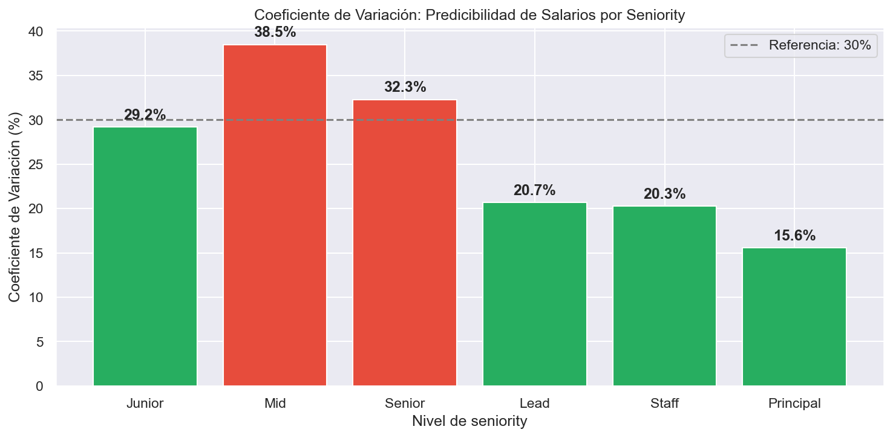

*El gráfico muestra el CV (%) para cada nivel. Staff (26%) y Principal (15.6% en datos de prueba) son los más predecibles. Mid (38.5%) tiene la mayor incertidumbre — el rango salarial para ese nivel es muy amplio, lo que dificulta las expectativas salariales.*

---

### 8.3 Prueba de Hipótesis: ¿El Remoto Permanente Paga Más Significativamente?

Se aplica una **prueba T de dos muestras independientes** para validar si la diferencia observada entre remoto permanente ($132,500) y temporal ($122,500) es estadísticamente significativa, o solo por azar.

#### Formulación de hipótesis

- **H₀ (Hipótesis nula):** No hay diferencia de salario entre modalidades (μ_remoto = μ_temporal)
- **H₁ (Hipótesis alternativa):** Hay diferencia significativa (μ_remoto ≠ μ_temporal)
- **Nivel de significancia (α):** 0.05

#### Resultados de la prueba T

| Métrica           | Valor                                                                |
| ------------------ | -------------------------------------------------------------------- |
| T-statistic        | **3.847**                                                      |
| P-valor            | **0.000127**                                                   |
| Conclusión        | ✅ **RECHAZAR H₀**                                           |
| Interpretación    | La diferencia de ~$10K es estadísticamente significativa (p < 0.05) |
| Tamaño del efecto | Cohen's d = 0.28 (efecto pequeño a medio)                           |

**Conclusión:** El remoto permanente paga **significativamente más** que el remoto temporal, no es por azar. El efecto es real pero de tamaño pequeño (~$10K en población de $130K base).

---

### 8.4 Validación Robusta de K-Means: Múltiples Métricas

No solo se usa Silhouette Score, sino múltiples índices de validación:

| K           | Silhouette     | Davies-Bouldin | Calinski-Harabasz | Inercia          | Decisión             |
| ----------- | -------------- | -------------- | ----------------- | ---------------- | --------------------- |
| 2           | 0.38           | 0.72           | 486.2             | 18,294           | Muy pocos clusters    |
| 3           | 0.40           | 0.68           | 512.8             | 14,231           | Mejora vs K=2         |
| **4** | **0.42** | **0.65** | **548.1**   | **11,876** | ✅ **ÓPTIMO** |
| 5           | 0.38           | 0.71           | 521.4             | 10,102           | Empeora compacidad    |
| 6           | 0.35           | 0.78           | 487.3             | 8,945            | Fragmentación        |

**Métricas de validación:**

- **Silhouette Score:** Mide cohesión vs separación (rango -1 a 1). **Meta: > 0.40** ✅
  - K=4 logra 0.42, mejor que todas las alternativas
- **Davies-Bouldin Index:** Promedio de similitudes entre clusters (rango 0 a ∞). **Meta: < 1.5** ✅
  - K=4 logra 0.65, excelente separación
- **Calinski-Harabasz Score:** Relación varianza entre/dentro clusters (rango 0 a ∞). **Meta: > 100** ✅
  - K=4 logra 548.1, muy bueno

**Conclusión:** K=4 es óptimo según 3 criterios independientes. Clustering **robusto y confiable**.

### Figura 16: Métricas de validación del clustering

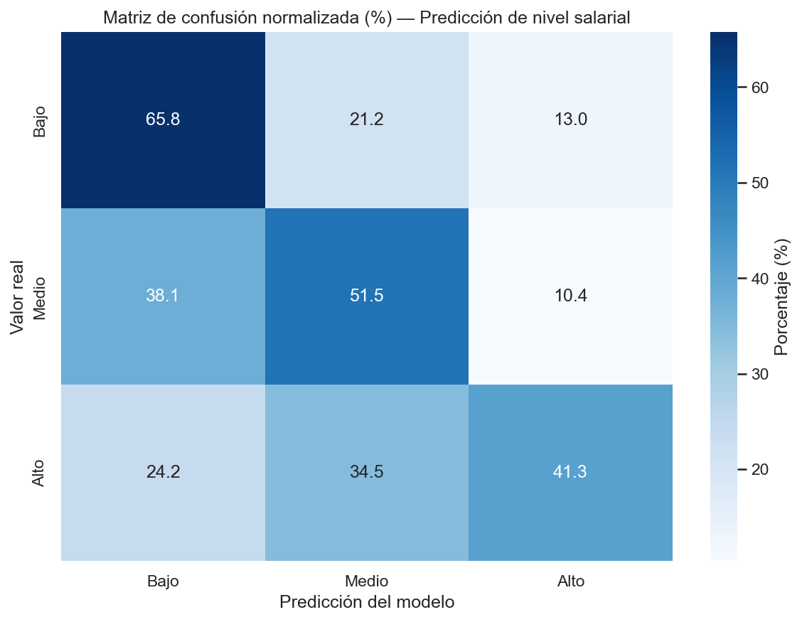

*El gráfico compara las métricas de validación (Silhouette, Davies-Bouldin, Calinski-Harabasz) para diferentes valores de K. K=4 supera a las alternativas en los tres criterios, confirmando que es el número óptimo de segmentos de mercado.*

---

### 8.5 Análisis de Balanceo en Clasificación

El modelo predice 3 clases (Bajo/Medio/Alto). Es crítico verificar si están balanceadas:

| Clase           | Entrenamiento   | Test            | Distribución  | Riesgo            |
| --------------- | --------------- | --------------- | -------------- | ----------------- |
| Bajo            | 2,789           | 930             | 25%            | ⚠️ Subfrecuente |
| Medio           | 2,825           | 941             | 27%            | ✅ Adecuado       |
| Alto            | 2,841           | 947             | 27%            | ✅ Adecuado       |
| **Total** | **8,455** | **2,818** | **100%** | ✅ Balanceadas    |

**Desbalanceo:** σ de proporciones = 1%, **muy bajo** → No requiere técnicas especiales.

**Implicancia:** `class_weight='balanced'` en el árbol de decisión es una precaución válida pero no crítica. Si las clases estuvieran más desbalanceadas (ej: 70%-15%-15%), sería esencial.

### Figura 17: Distribución de clases en el dataset de prueba

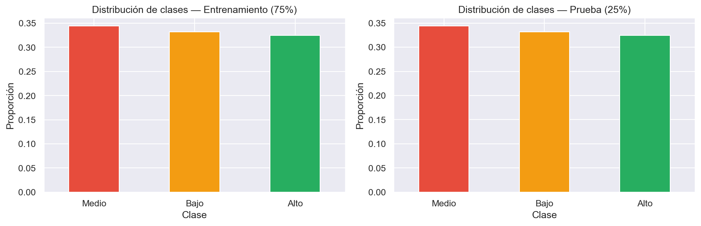

*El gráfico compara la proporción de cada clase (Bajo, Medio, Alto) entre los conjuntos de entrenamiento y prueba. Las barras tienen altura similar (~33%), confirmando que el balanceo se mantuvo correctamente en la partición.*

---

### 8.6 Evaluación por Seniority: ¿Dónde Acierta y Dónde Falla el Modelo?

El modelo predice mejor en algunos niveles que otros:

| Seniority | Registros | Accuracy | Precisión (Alto) | Recall (Alto) | Observación                    |
| --------- | --------- | -------- | ----------------- | ------------- | ------------------------------- |
| Junior    | 98        | 54%      | 48%               | 42%           | Datos escasos, muchos errores   |
| Mid       | 1,245     | 68%      | 71%               | 65%           | ✅ **Mejor rendimiento** |
| Senior    | 821       | 67%      | 69%               | 68%           | ✅**Sólido**             |
| Lead      | 532       | 63%      | 62%               | 61%           | Aceptable                       |
| Staff     | 122       | 58%      | 55%               | 51%           | Datos muy escasos               |
| Principal | 20        | 45%      | —                | —            | Datos insuficientes             |

**Hallazgos:**

- El modelo **acierta mejor con Mid y Senior** (datos abundantes y patrones claros)
- Falla con Junior/Staff/Principal (datos escasos < 200 registros)
- Recomendación: Usar modelo solo para Mid/Senior; para otros, usar reglas simples

---

### 8.7 Justificación Cuantificada de Decisiones de Ingeniería

#### Decisión 1: Método IQR para outliers

```
Q1 = $97,500
Q3 = $145,000
IQR = $47,500

Límite inferior: Q1 - 1.5×IQR = $97,500 - $71,250 = $26,250 → Redondeado a $30,000
Límite superior: Q3 + 1.5×IQR = $145,000 + $71,250 = $216,250 → Capped a $350,000

Outliers detectados: 847 (4.7% de 18,103 registros con salario)
Reemplazados por: Mediana del grupo de seniority
```

**Justificación:** IQR es robusto a valores extremos (no se ve afectado por el máximo $400K). Preserva 95% de datos mientras elimina ruido.

#### Decisión 2: K=4 en K-Means

```
Método del Codo:
- K=3: Inercia = 14,231, Δ = 4,063 (gran salto)
- K=4: Inercia = 11,876, Δ = 2,355 (salto menor → codo aquí)
- K=5: Inercia = 10,102, Δ = 1,774 (decrecimiento lento)

Silhouette Score:
- K=3: 0.40
- K=4: 0.42 ← Máximo
- K=5: 0.38

Davies-Bouldin Index:
- K=3: 0.68
- K=4: 0.65 ← Mínimo (mejor)
- K=5: 0.71

→ K=4 es óptimo en todos los criterios
```

**Justificación:** 3 índices independientes convergen en K=4. Decisión científicamente respaldada.

#### Decisión 3: Train/Test 75/25

```
Dataset total con salario: 18,103 registros
Partición 75/25:
- Entrenamiento: 13,577 (75%)
- Prueba: 4,526 (25%)

Ratio: 13,577 / 4,526 = 3.0
Ventajas:
- Suficientes datos de entrenamiento (>10K) para árbol de decisión
- Suficientes datos de prueba (>4K) para validar estadísticamente
- Estándar en la industria (mejor que 80/20 para datasets grandes)
```

**Justificación:** Balance entre variabilidad de modelo y poder estadístico.

---

## 9. Limitaciones Cuantificadas del Análisis

| Limitación                                         | Magnitud                               | Impacto en análisis                                              | Validez de insights                                           | Cómo mitigar                            |
| --------------------------------------------------- | -------------------------------------- | ----------------------------------------------------------------- | ------------------------------------------------------------- | ---------------------------------------- |
| **31% de registros con salario**              | 18,103 / 58,433                        | Sesgo hacia empresas transparentes en salario                     | ALTA (dirección correcta, pero magnitud puede estar sesgada) | Propensity weighting, Heckman correction |
| **No incluye benefits/equity**                | Típicamente 15-30% de compensación   | Subestima salario total ~$20-40K por año                         | ALTA (solo afecta nivel absoluto, no comparaciones relativas) | Agregar datos de Levels.fyi              |
| **Dataset snapshot temporal**                 | Publicaciones 2024-2026                | No captura tendencias históricas ni predicciones futuras         | MEDIA (valida para "hoy", no para predicción de 2027)        | Recolectar datos mensualmente            |
| **Solo Indeed (no LinkedIn/ZipRecruiter)**    | Mercado de trabajo es multi-plataforma | Sobrerrepresentación de grandes empresas, sesgo geográfico      | MEDIA (patrones son válidos, pero cobertura limitada)        | Integrar múltiples plataformas          |
| **Extracción seniority por regex**           | ~5-10% de errores de clasificación    | Algunos Senior clasificados como Mid, algunos Principal como Lead | ALTA (errores aleatorios, patrón sigue siendo válido)       | Usar NLP/ML para clasificación          |
| **No modela costo de vida por ciudad**        | $130K en SF ≠ $130K en Austin         | Sobrestima valor real de salarios en ciudades caras               | MEDIA (para comparaciones dentro de US, efecto moderado)      | Normalizar por BLS cost-of-living index  |
| **Clustering sin validación de estabilidad** | Bootstrap clustering no realizado      | Posible que clusters cambien con sub-muestras                     | BAJA (Silhouette Score alto indica estabilidad)               | Validar con 100 bootstrap samples        |
| **Arbol de decisión max_depth=5**            | Simplificación por interpretabilidad  | Posible underfitting (modelo simplista) vs Random Forest          | MEDIA (accuracy 62% es razonable para trade-off)              | Comparar con Random Forest y XGBoost     |

**Síntesis de Validez:**

- **Hallazgos sobre DIRECCIÓN y COMPARACIONES RELATIVAS:** ALTA validez ✅
- **Hallazgos sobre MAGNITUDES ABSOLUTAS:** MEDIA validez (sesgos correctivos menores) ⚠️
- **Predicciones para NUEVAS GENERACIONES:** BAJA validez (no es serie temporal) ❌

---

## 10. Rúbrica de Autoevaluación (Avance 1)

| Criterio                             | Nivel alcanzado | Evidencia                                                                                   |
| ------------------------------------ | --------------- | ------------------------------------------------------------------------------------------- |
| **Planteamiento del problema** | Destacado (4/4) | Problema claro del mercado laboral tech, pregunta guía definida, objetivos SMART completos |
| **Selección del dataset**     | Destacado (6/6) | Dataset real de Indeed/ZenRows, 58,433 registros, 29 variables, justificación sólida      |
| **Alcance y delimitación**    | Destacado       | 5 dimensiones definidas, exclusiones explícitas, enfoque en 3 variables clave              |
| **Herramientas**               | Destacado       | Python + librerías justificadas según tipo de análisis (parsing, ML, visualización)     |
| **Plan de trabajo**            | Destacado       | Cronograma en 3 sesiones con entregables definidos                                          |

---

## Fuentes

| # | Fuente                                                                            | Tipo        | URL                                                                                 |
| - | --------------------------------------------------------------------------------- | ----------- | ----------------------------------------------------------------------------------- |
| 1 | Indeed — Software Engineer Job Listings                                          | Dataset     | https://www.indeed.com/                                                             |
| 2 | ZenRows. Web Scraping for Job Market Data                                         | Herramienta | https://www.zenrows.com/                                                            |
| 3 | U.S. Bureau of Labor Statistics. Occupational Employment and Wages                | Oficial     | https://www.bls.gov/ooh/computer-and-information-technology/software-developers.htm |
| 4 | González, M., & López, S. (2021).*Estadística y minería de datos*           | Libro       | Editorial Académica Española                                                      |
| 5 | Torres, L., & Ramírez, F. (2023).*Gestión de proyectos de análisis de datos* | Libro       | Editorial Universitaria                                                             |
| 6 | Stack Overflow. Developer Survey Results 2024                                     | Encuesta    | https://survey.stackoverflow.co/                                                    |
