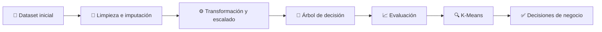

# Minería de datos aplicada a clientes retail con Python (Actividad Sesión 8)

**Curso:** Análisis Estadístico y Data Mining (ISIL, 2026-1)  
**Docente:** Omar David Visitación Romero  
**Fecha:** 30/05/2026

---

## 1. Contexto o problema

La empresa ficticia **Comercial Andina S.A.C.** quiere entender mejor a sus clientes para tomar decisiones de marketing, ventas y fidelización con base en datos.

La actividad plantea cinco preguntas de negocio:

- qué clientes tienen mayor probabilidad de realizar compras altas;
- qué errores deben corregirse antes de modelar;
- qué variables influyen más en el comportamiento de compra;
- qué segmentos de clientes existen;
- qué tan confiables son los modelos obtenidos.

El flujo completo del laboratorio sigue esta secuencia:



> **Idea clave:** el laboratorio no solo enseña a ejecutar código. Enseña que un modelo útil depende primero de datos limpios, variables bien tratadas y una interpretación empresarial seria.

## 2. Desarrollo / análisis

### 2.1 Conceptos que se aplican en el laboratorio

| Concepto | Qué es | Cómo se usa aquí |
| --- | --- | --- |
| **Minería de datos** | Proceso de descubrir patrones útiles en datos. | Se usa para clasificar clientes y segmentarlos. |
| **Limpieza de datos** | Corrección de errores, faltantes e inconsistencias. | Se corrige una edad negativa, faltantes y un outlier. |
| **Imputación** | Reemplazo de valores faltantes con una regla estadística. | Se usa mediana en variables numéricas y moda en categóricas. |
| **Clasificación** | Técnica supervisada para predecir una categoría. | Se entrena un árbol de decisión para `compra_alta`. |
| **Clustering** | Técnica no supervisada para agrupar casos similares. | Se aplica K-Means con 3 clusters. |
| **Estandarización** | Escalado para dejar variables con media 0 y desviación 1. | Se usa `StandardScaler` antes del árbol y de K-Means. |
| **Accuracy** | Proporción total de predicciones correctas. | Resume el desempeño global del árbol. |
| **Precision** | Qué tan confiables son las predicciones positivas. | Mide cuántos clientes predichos como compra alta realmente lo eran. |
| **Recall** | Qué tantos positivos reales detecta el modelo. | Mide cuántos clientes de compra alta fueron encontrados. |
| **Silhouette** | Indicador de qué tan separados están los clusters. | Evalúa la calidad de la segmentación obtenida. |

### 2.2 Fórmulas clave del flujo

La guía llama a esta etapa “normalización”, pero el código usa **estandarización Z-score** con `StandardScaler`:

$$
z = \frac{x - \mu}{\sigma}
$$

Para detectar outliers en `gasto_promedio` se usa IQR:

$$
IQR = Q_3 - Q_1
$$

$$
LI = Q_1 - 1.5 \cdot IQR \quad ; \quad LS = Q_3 + 1.5 \cdot IQR
$$

Para evaluar el árbol de decisión se usan estas métricas:

$$
Accuracy = \frac{TP + TN}{TP + TN + FP + FN}
$$

$$
Precision = \frac{TP}{TP + FP}
$$

$$
Recall = \frac{TP}{TP + FN}
$$

| Símbolo | Significado |
| --- | --- |
| **$x$** | Valor observado de una variable |
| **$\mu$** | Media |
| **$\sigma$** | Desviación estándar |
| **$Q_1$** | Primer cuartil |
| **$Q_3$** | Tercer cuartil |
| **$IQR$** | Rango intercuartílico |
| **$LI$, $LS$** | Límites para detectar valores atípicos |
| **$TP$** | Verdaderos positivos |
| **$TN$** | Verdaderos negativos |
| **$FP$** | Falsos positivos |
| **$FN$** | Falsos negativos |

### 2.3 Base de datos inicial

El dataset inicial tiene **150 registros** y **8 variables**.

| Variable | Tipo | Qué representa |
| --- | --- | --- |
| **cliente_id** | Numérica | Identificador del cliente |
| **edad** | Numérica | Edad del cliente |
| **ingreso_mensual** | Numérica | Ingreso estimado |
| **frecuencia_compra** | Numérica | Número de compras realizadas |
| **gasto_promedio** | Numérica | Ticket medio del cliente |
| **canal_compra** | Categórica | Tienda, Online o Mixto |
| **satisfaccion** | Categórica | Bajo, Medio o Alto |
| **compra_alta** | Binaria | 1 = compra alta, 0 = compra baja |

Problemas insertados intencionalmente para practicar limpieza:

| Problema | Cantidad | Ejemplo | Tratamiento |
| --- | ---: | --- | --- |
| **Valor faltante en ingreso** | 1 | `ingreso_mensual` en el registro 6 | Mediana = **6449** |
| **Valor faltante en gasto** | 1 | `gasto_promedio` en el registro 19 | Mediana = **502** |
| **Valor faltante en canal** | 1 | `canal_compra` en el registro 33 | Moda = **Tienda** |
| **Valor faltante en satisfacción** | 1 | `satisfaccion` en el registro 48 | Moda = **Bajo** |
| **Outlier extremo** | 1 | `gasto_promedio = 15000` en el cliente 11 | Reemplazo por mediana sin outlier = **502** |
| **Edad inconsistente** | 1 | `edad = -5` en el registro 21 | Corrección con mediana de edades válidas = **42** |

### 2.4 Limpieza, imputación y validación

Antes de la limpieza, el conteo de faltantes era el siguiente:

| Variable | Nulos antes |
| --- | ---: |
| **ingreso_mensual** | 1 |
| **gasto_promedio** | 1 |
| **canal_compra** | 1 |
| **satisfaccion** | 1 |

Después de la imputación y la corrección de la edad negativa, la base queda sin nulos:

| Variable | Nulos después |
| --- | ---: |
| **ingreso_mensual** | 0 |
| **gasto_promedio** | 0 |
| **canal_compra** | 0 |
| **satisfaccion** | 0 |

Detección de outliers con IQR sobre `gasto_promedio`:

| Métrica | Valor |
| --- | ---: |
| **$Q_1$** | 283.00 |
| **$Q_3$** | 713.00 |
| **$IQR$** | 430.00 |
| **Límite inferior** | -362.00 |
| **Límite superior** | 1358.00 |
| **Outliers detectados** | 1 |

> **Lectura práctica:** el único valor extremo era artificial y estaba muy por encima del rango esperado. En una empresa real, un valor así puede ser fraude, error de digitación o una transacción extraordinaria. Aquí se corrige porque el laboratorio lo insertó a propósito como error.

### 2.5 Transformación y modelado

La preparación del dataset siguió cuatro decisiones técnicas:

1. **Codificación ordinal de satisfacción:** `Bajo = 1`, `Medio = 2`, `Alto = 3`.
2. **One-hot encoding de canal:** se crean columnas para `Tienda`, `Online` y `Mixto`.
3. **Estandarización de variables numéricas:** evita que ingreso y gasto dominen por escala.
4. **Separación train/test:** `112` filas para entrenamiento y `38` para prueba.

Variables usadas en el árbol de decisión:

| Variable | Rol |
| --- | --- |
| **edad** | Perfil demográfico |
| **ingreso_mensual** | Capacidad económica |
| **frecuencia_compra** | Intensidad de compra |
| **gasto_promedio** | Ticket medio |
| **satisfaccion_codificada** | Valor ordinal del nivel de satisfacción |
| **canal_compra_Mixto** | Dummy de canal |
| **canal_compra_Online** | Dummy de canal |
| **canal_compra_Tienda** | Dummy de canal |

### 2.6 Resultados del modelo de clasificación

Métricas obtenidas con el árbol de decisión:

| Métrica | Resultado | Lectura rápida |
| --- | ---: | --- |
| **Accuracy** | 0.500 | El modelo acierta la mitad de los casos. |
| **Precision** | 0.455 | Solo 45.5 % de los clientes predichos como compra alta realmente lo son. |
| **Recall** | 0.588 | El modelo detecta 58.8 % de los clientes que sí hacen compra alta. |

Matriz de confusión:

| Real \ Predicción | Compra baja | Compra alta |
| --- | ---: | ---: |
| **Compra baja** | 9 | 12 |
| **Compra alta** | 7 | 10 |

> **Hallazgo técnico importante:** este árbol no es fuerte. Un clasificador trivial que siempre predijera “compra baja” habría acertado **21 de 38 casos** en prueba, es decir, **55.3 %**, más que el propio árbol. En un proyecto real, este modelo no debería pasar a producción.

Importancia de variables en el árbol:

| Variable | Importancia |
| --- | ---: |
| **gasto_promedio** | 0.4256 |
| **frecuencia_compra** | 0.2172 |
| **ingreso_mensual** | 0.1969 |
| **edad** | 0.1336 |
| **canal_compra_Online** | 0.0266 |
| **satisfaccion_codificada** | 0.0000 |
| **canal_compra_Mixto** | 0.0000 |
| **canal_compra_Tienda** | 0.0000 |

### 2.7 Segmentación con K-Means

El algoritmo generó **3 clusters** y el coeficiente **Silhouette = 0.216**.

Esto indica una separación **débil a moderada** entre grupos. La segmentación sirve para explorar, pero no para afirmar que los segmentos estén perfectamente aislados.

Perfil de los clusters:

| Cluster | Clientes | Ingreso promedio | Frecuencia promedio | Gasto promedio | Satisfacción promedio | Lectura de negocio |
| --- | ---: | ---: | ---: | ---: | ---: | --- |
| **0** | 43 | 8588.05 | 17.23 | 369.05 | 2.49 | Clientes frecuentes, con alto ingreso, pero ticket bajo. Hay oportunidad de **upselling**. |
| **1** | 56 | 5143.88 | 5.38 | 483.00 | 2.25 | Clientes ocasionales o de bajo consumo. Conviene activar campañas de reactivación. |
| **2** | 51 | 5895.88 | 17.22 | 608.73 | 1.24 | Segmento de mayor valor actual, pero con satisfacción baja. Requiere retención rápida. |

Ejemplo práctico en retail:

| Situación | Acción recomendada |
| --- | --- |
| **Cliente frecuente con ticket bajo** | Ofrecer combos, venta cruzada o beneficios por monto mínimo. |
| **Cliente ocasional** | Enviar descuentos de reactivación o campañas por temporada. |
| **Cliente de alto valor con baja satisfacción** | Priorizar atención, beneficios VIP y seguimiento postventa. |

### 2.8 Código Python usado en el laboratorio

El siguiente script resume el flujo completo usado para construir la base, limpiarla, entrenar el árbol de decisión, evaluar el modelo y segmentar clientes con K-Means.

```python
import pandas as pd
import numpy as np
import matplotlib.pyplot as plt
import seaborn as sns

from sklearn.model_selection import train_test_split
from sklearn.preprocessing import StandardScaler
from sklearn.tree import DecisionTreeClassifier, plot_tree
from sklearn.metrics import (
   accuracy_score,
   precision_score,
   recall_score,
   confusion_matrix,
   classification_report,
)
from sklearn.cluster import KMeans
from sklearn.metrics import silhouette_score


sns.set()
np.random.seed(42)


# 1. Creación del dataset
n_clientes = 150

datos = pd.DataFrame(
   {
      "cliente_id": range(1, n_clientes + 1),
      "edad": np.random.randint(18, 70, n_clientes),
      "ingreso_mensual": np.random.randint(1200, 12000, n_clientes),
      "frecuencia_compra": np.random.randint(1, 25, n_clientes),
      "gasto_promedio": np.random.randint(50, 900, n_clientes),
      "canal_compra": np.random.choice(["Tienda", "Online", "Mixto"], n_clientes),
      "satisfaccion": np.random.choice(["Bajo", "Medio", "Alto"], n_clientes),
      "compra_alta": np.random.choice([0, 1], n_clientes, p=[0.55, 0.45]),
   }
)

print("Base de datos creada correctamente")
print(datos.head())


# 2. Simulación de problemas
datos.loc[5, "ingreso_mensual"] = np.nan
datos.loc[18, "gasto_promedio"] = np.nan
datos.loc[32, "canal_compra"] = np.nan
datos.loc[47, "satisfaccion"] = np.nan
datos.loc[10, "gasto_promedio"] = 15000
datos.loc[20, "edad"] = -5

print("Se agregaron valores faltantes y errores para practicar limpieza")
print(datos.loc[[5, 10, 18, 20, 32, 47]])


# 3. Exploración inicial
print("\nPrimeras filas del dataset:")
print(datos.head())

print("\nTamaño de la base de datos:")
print(datos.shape)

print("\nTipos de datos:")
print(datos.dtypes)

print("\nResumen estadístico:")
print(datos.describe())

print("\nValores faltantes por columna:")
print(datos.isnull().sum())


# 4. Corrección de edad inconsistente
mediana_edad = datos.loc[datos["edad"] >= 18, "edad"].median()
datos.loc[datos["edad"] < 18, "edad"] = mediana_edad

print("\nEdad negativa corregida")
print(datos.loc[20, "edad"])


# 5. Tratamiento de datos faltantes
datos["ingreso_mensual"] = datos["ingreso_mensual"].fillna(
   datos["ingreso_mensual"].median()
)
datos["gasto_promedio"] = datos["gasto_promedio"].fillna(
   datos["gasto_promedio"].median()
)
datos["canal_compra"] = datos["canal_compra"].fillna(
   datos["canal_compra"].mode()[0]
)
datos["satisfaccion"] = datos["satisfaccion"].fillna(
   datos["satisfaccion"].mode()[0]
)

print("\nValores faltantes después de la imputación:")
print(datos.isnull().sum())


# 6. Detección y tratamiento de outliers
plt.figure(figsize=(8, 4))
sns.boxplot(x=datos["gasto_promedio"])
plt.title("Boxplot de gasto promedio antes de tratar outliers")
plt.xlabel("Gasto promedio")
plt.show()

Q1 = datos["gasto_promedio"].quantile(0.25)
Q3 = datos["gasto_promedio"].quantile(0.75)
IQR = Q3 - Q1

limite_inferior = Q1 - 1.5 * IQR
limite_superior = Q3 + 1.5 * IQR

print("\nLímite inferior:", limite_inferior)
print("Límite superior:", limite_superior)

outliers = datos[
   (datos["gasto_promedio"] < limite_inferior)
   | (datos["gasto_promedio"] > limite_superior)
]

print("\nValores atípicos detectados:")
print(outliers)

mediana_gasto = datos.loc[
   datos["gasto_promedio"] <= limite_superior, "gasto_promedio"
].median()
datos.loc[datos["gasto_promedio"] > limite_superior, "gasto_promedio"] = (
   mediana_gasto
)

plt.figure(figsize=(8, 4))
sns.boxplot(x=datos["gasto_promedio"])
plt.title("Boxplot de gasto promedio después de tratar outliers")
plt.xlabel("Gasto promedio")
plt.show()


# 7. Transformación de variables categóricas
mapa_satisfaccion = {"Bajo": 1, "Medio": 2, "Alto": 3}
datos["satisfaccion_codificada"] = datos["satisfaccion"].map(mapa_satisfaccion)

datos_transformados = pd.get_dummies(
   datos, columns=["canal_compra"], drop_first=False
)

print("\nDatos después de transformar variables categóricas:")
print(datos_transformados.head())


# 8. Selección de variables para el modelo
variables_modelo = [
   "edad",
   "ingreso_mensual",
   "frecuencia_compra",
   "gasto_promedio",
   "satisfaccion_codificada",
   "canal_compra_Mixto",
   "canal_compra_Online",
   "canal_compra_Tienda",
]

X = datos_transformados[variables_modelo]
y = datos_transformados["compra_alta"]

print("\nVariables predictoras:")
print(X.head())

print("\nVariable objetivo:")
print(y.head())


# 9. Estandarización
escalador = StandardScaler()
X_escalado = escalador.fit_transform(X)
X_escalado = pd.DataFrame(X_escalado, columns=variables_modelo)

print("\nDatos normalizados:")
print(X_escalado.head())


# 10. División en entrenamiento y prueba
X_train, X_test, y_train, y_test = train_test_split(
   X_escalado,
   y,
   test_size=0.25,
   random_state=42,
   stratify=y,
)

print("\nTamaño del conjunto de entrenamiento:")
print(X_train.shape)

print("\nTamaño del conjunto de prueba:")
print(X_test.shape)


# 11. Árbol de decisión
modelo_arbol = DecisionTreeClassifier(max_depth=4, random_state=42)
modelo_arbol.fit(X_train, y_train)
predicciones = modelo_arbol.predict(X_test)

print("\nModelo de árbol de decisión entrenado correctamente")


# 12. Evaluación del modelo
accuracy = accuracy_score(y_test, predicciones)
precision = precision_score(y_test, predicciones)
recall = recall_score(y_test, predicciones)

print("\nRESULTADOS DEL MODELO DE CLASIFICACIÓN")
print("Accuracy:", round(accuracy, 3))
print("Precision:", round(precision, 3))
print("Recall:", round(recall, 3))

print("\nReporte de clasificación:")
print(classification_report(y_test, predicciones))

matriz = confusion_matrix(y_test, predicciones)

plt.figure(figsize=(6, 4))
sns.heatmap(matriz, annot=True, fmt="d", cmap="Blues")
plt.title("Matriz de confusión")
plt.xlabel("Predicción del modelo")
plt.ylabel("Valor real")
plt.show()


# 13. Visualización del árbol
plt.figure(figsize=(18, 8))
plot_tree(
   modelo_arbol,
   feature_names=variables_modelo,
   class_names=["Compra baja", "Compra alta"],
   filled=True,
   rounded=True,
)
plt.title("Árbol de decisión para clasificar clientes")
plt.show()


# 14. Importancia de variables
importancias = pd.DataFrame(
   {
      "Variable": variables_modelo,
      "Importancia": modelo_arbol.feature_importances_,
   }
).sort_values(by="Importancia", ascending=False)

print("\nImportancia de variables en el modelo:")
print(importancias)

plt.figure(figsize=(10, 5))
sns.barplot(data=importancias, x="Importancia", y="Variable")
plt.title("Importancia de variables en la clasificación")
plt.show()


# 15. Clustering con K-Means
variables_cluster = [
   "ingreso_mensual",
   "frecuencia_compra",
   "gasto_promedio",
   "satisfaccion_codificada",
]

X_cluster = datos_transformados[variables_cluster]

escalador_cluster = StandardScaler()
X_cluster_escalado = escalador_cluster.fit_transform(X_cluster)

kmeans = KMeans(n_clusters=3, random_state=42, n_init=10)
datos_transformados["cluster"] = kmeans.fit_predict(X_cluster_escalado)

print("\nClientes con cluster asignado:")
print(
   datos_transformados[
      [
         "cliente_id",
         "ingreso_mensual",
         "frecuencia_compra",
         "gasto_promedio",
         "satisfaccion_codificada",
         "cluster",
      ]
   ].head()
)


# 16. Evaluación del clustering
silhouette = silhouette_score(X_cluster_escalado, datos_transformados["cluster"])

print("\nCoeficiente Silhouette:")
print(round(silhouette, 3))


# 17. Perfil de clusters
perfil_cluster = datos_transformados.groupby("cluster")[variables_cluster].mean()

print("\nPerfil promedio de cada cluster:")
print(perfil_cluster)


# 18. Visualización de clusters
plt.figure(figsize=(8, 5))
sns.scatterplot(
   data=datos_transformados,
   x="frecuencia_compra",
   y="gasto_promedio",
   hue="cluster",
   palette="Set2",
   s=80,
)
plt.title("Segmentación de clientes según frecuencia y gasto")
plt.xlabel("Frecuencia de compra")
plt.ylabel("Gasto promedio")
plt.show()


# 19. Interpretación automática de clusters
print("\nINTERPRETACIÓN EMPRESARIAL DE LOS CLUSTERS")

for cluster in sorted(datos_transformados["cluster"].unique()):
   promedio_ingreso = perfil_cluster.loc[cluster, "ingreso_mensual"]
   promedio_frecuencia = perfil_cluster.loc[cluster, "frecuencia_compra"]
   promedio_gasto = perfil_cluster.loc[cluster, "gasto_promedio"]
   promedio_satisfaccion = perfil_cluster.loc[cluster, "satisfaccion_codificada"]

   print("\nCluster", cluster)
   print("Ingreso promedio:", round(promedio_ingreso, 2))
   print("Frecuencia promedio:", round(promedio_frecuencia, 2))
   print("Gasto promedio:", round(promedio_gasto, 2))
   print("Satisfacción promedio:", round(promedio_satisfaccion, 2))

   if (
      promedio_gasto >= perfil_cluster["gasto_promedio"].median()
      and promedio_frecuencia >= perfil_cluster["frecuencia_compra"].median()
   ):
      print("Interpretación: Clientes de alto valor comercial.")
      print(
         "Acción recomendada: ofrecer beneficios exclusivos, programa VIP y campañas de fidelización."
      )
   elif (
      promedio_gasto < perfil_cluster["gasto_promedio"].median()
      and promedio_frecuencia < perfil_cluster["frecuencia_compra"].median()
   ):
      print("Interpretación: Clientes ocasionales o de bajo consumo.")
      print(
         "Acción recomendada: enviar promociones de activación y descuentos personalizados."
      )
   else:
      print("Interpretación: Clientes de valor medio.")
      print(
         "Acción recomendada: aplicar campañas de venta cruzada y acumulación de puntos."
      )
```

## 3. Resultados o hallazgos

### 3.1 Respuestas directas a la actividad

1. **¿Cuántos registros y cuántas variables tiene la base de datos inicial?**  
   La base tiene **150 registros** y **8 variables**.

2. **¿Qué errores o problemas fueron insertados en la base de datos?**  
   Se insertaron **4 valores faltantes**, **1 outlier extremo** en `gasto_promedio = 15000` y **1 edad inconsistente** con valor `-5`.

3. **¿Por qué fue necesario corregir la edad negativa?**  
   Porque una edad negativa no tiene sentido de negocio ni validez estadística. Si se deja, distorsiona el análisis y puede afectar al modelo. Por eso se reemplazó con la **mediana de edades válidas (42)**.

4. **¿Por qué se reemplazaron los valores faltantes por la mediana o la moda?**  
   Porque la **mediana** es robusta ante valores extremos en variables numéricas y la **moda** conserva una categoría válida en variables cualitativas. Así se evita perder registros y se mantiene una imputación razonable.

5. **¿Por qué se normalizaron las variables antes de aplicar modelos?**  
   Porque ingreso, gasto y frecuencia tienen escalas distintas. Si no se escalan, una variable grande puede dominar el modelo o el clustering. Técnicamente, aquí se aplicó **estandarización Z-score** con `StandardScaler`.

6. **¿Cuál fue el valor de accuracy del modelo?**  
   El **accuracy fue 0.500**, es decir, el árbol acertó el **50 %** de los casos del conjunto de prueba.

7. **¿Qué significa precision en este caso empresarial?**  
   Significa que, de todos los clientes que el modelo marcó como **compra alta**, solo **45.5 %** realmente pertenecían a esa categoría. En negocio, esto mide cuántas campañas premium se enviarían a clientes correctos.

8. **¿Qué significa recall en este caso empresarial?**  
   Significa que el modelo logró detectar **58.8 %** de los clientes que sí eran de **compra alta**. En negocio, muestra cuántas oportunidades valiosas se están capturando y cuántas se escapan.

9. **¿Cuál fue la variable más importante en el árbol de decisión?**  
   La variable más importante fue **`gasto_promedio`**, con una importancia de **0.4256**.

10. **¿Cuántos clusters se generaron?**  
    Se generaron **3 clusters**, pensados para representar clientes de **bajo valor**, **valor medio** y **alto valor**.

### 3.2 Hallazgos clave

1. **La limpieza fue simple, pero obligatoria.** Cuatro nulos, una edad inválida y un outlier bastaron para mostrar cómo un modelo puede deteriorarse si se entrena con errores.
2. **El árbol no ofrece desempeño suficiente.** Su accuracy de 0.500 está por debajo de un baseline ingenuo, así que no conviene usarlo como apoyo real de decisiones.
3. **`gasto_promedio` sí concentra señal predictiva.** Fue la variable más importante, seguida por frecuencia e ingreso.
4. **Los clusters muestran valor comercial desigual.** Hay un grupo ocasional, uno de alto potencial por ingreso y otro de valor alto con riesgo de satisfacción.
5. **La segmentación es útil para explorar, no para cerrar decisiones sin validación adicional.** El silhouette de 0.216 sugiere separación limitada.

### 3.3 Recomendaciones

1. **No desplegar el árbol actual en producción.** Antes debe mejorarse la variable objetivo o enriquecer las variables predictoras.
2. **Usar los clusters como base de campañas diferenciadas.** No como verdad absoluta, sino como punto de partida comercial.
3. **Fortalecer la calidad del dato desde el origen.** Validación de rangos, captura obligatoria y reglas automáticas para detectar extremos.

## 4. Conclusiones

La actividad demuestra el flujo completo de un proyecto de minería de datos: preparar datos, transformar variables, entrenar un clasificador, evaluar resultados y segmentar clientes.

Sin embargo, la lección más valiosa no es que “el modelo funcionó”, sino que **no todo modelo entrenado es un buen modelo**. En este caso, el árbol de decisión quedó con un desempeño débil y la segmentación mostró separación limitada. Eso obliga a interpretar con criterio y no confundir ejecución técnica con valor empresarial.

**Conclusión ejecutiva:** Comercial Andina sí puede usar esta base para aprender sobre segmentación y perfiles de clientes, pero todavía no debería automatizar decisiones comerciales con el clasificador actual. El siguiente paso correcto es mejorar la calidad del dato, redefinir mejor la variable `compra_alta` y agregar variables de comportamiento más informativas antes de volver a modelar.

## 5. Fuentes

Las afirmaciones y métricas de este documento se basan en el laboratorio entregado por el curso y en la documentación oficial de las librerías utilizadas.
Tipo: **Oficial** = publicado por el curso o por el autor de la herramienta.

### Material base del laboratorio

| # | Fuente | Tipo | URL |
| --- | --- | --- | --- |
| 1 | ISIL. *Actividad sesión 8: Minería de datos aplicada a clientes retail* | Oficial | [Documento base](./ACTIVIDAD%20SESI%C3%93N%208.docx) |

### Librerías y métodos usados

| # | Fuente | Tipo | URL |
| --- | --- | --- | --- |
| 2 | pandas. *DataFrame.fillna* | Oficial | [Ver documentación](https://pandas.pydata.org/docs/reference/api/pandas.DataFrame.fillna.html) |
| 3 | pandas. *get_dummies* | Oficial | [Ver documentación](https://pandas.pydata.org/docs/reference/api/pandas.get_dummies.html) |
| 4 | scikit-learn. *StandardScaler* | Oficial | [Ver documentación](https://scikit-learn.org/stable/modules/generated/sklearn.preprocessing.StandardScaler.html) |
| 5 | scikit-learn. *DecisionTreeClassifier* | Oficial | [Ver documentación](https://scikit-learn.org/stable/modules/generated/sklearn.tree.DecisionTreeClassifier.html) |
| 6 | scikit-learn. *accuracy_score* | Oficial | [Ver documentación](https://scikit-learn.org/stable/modules/generated/sklearn.metrics.accuracy_score.html) |
| 7 | scikit-learn. *precision_score* | Oficial | [Ver documentación](https://scikit-learn.org/stable/modules/generated/sklearn.metrics.precision_score.html) |
| 8 | scikit-learn. *recall_score* | Oficial | [Ver documentación](https://scikit-learn.org/stable/modules/generated/sklearn.metrics.recall_score.html) |
| 9 | scikit-learn. *confusion_matrix* | Oficial | [Ver documentación](https://scikit-learn.org/stable/modules/generated/sklearn.metrics.confusion_matrix.html) |
| 10 | scikit-learn. *KMeans* | Oficial | [Ver documentación](https://scikit-learn.org/stable/modules/generated/sklearn.cluster.KMeans.html) |
| 11 | scikit-learn. *silhouette_score* | Oficial | [Ver documentación](https://scikit-learn.org/stable/modules/generated/sklearn.metrics.silhouette_score.html) |

*Última verificación de fuentes: 30/05/2026.*
