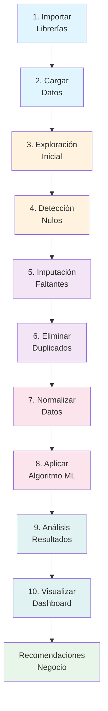
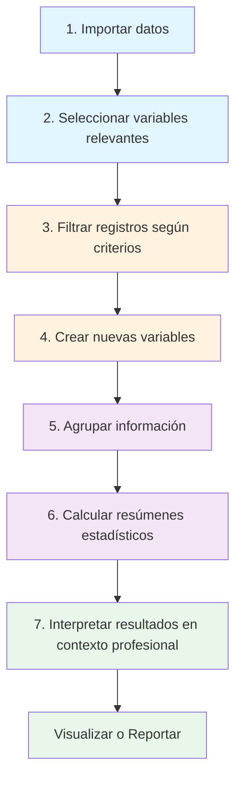
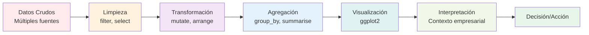

# Análisis Estadístico en R y Python: Manipulación de Datos y Machine Learning

**Código de Clase:** 40097  
**Curso:** Análisis Estadístico y Data Mining  
**Clase:** 10  
**Tema:** Manipulación de Datos con dplyr (R) y Pandas (Python) + Fundamentos de Machine Learning  
**Profesor:** Omar David Visitación Romero  
**Plataforma:** Google Colab / Visual Studio Code  
**Fecha:** Semana 10  

---

## Introducción

En esta clase se aborda el **ciclo completo del análisis de datos** desde dos perspectivas complementarias: manipulación con R (dplyr) y preparación con Python (Pandas), seguido de conceptos fundamentales de Machine Learning. 

R y Python se han consolidado como las herramientas más potentes para el análisis estadístico y la ciencia de datos. Su ecosistema de paquetes especializados permite:

- ✅ Manipular, transformar y limpiar datos de forma eficiente
- ✅ Aplicar algoritmos de ML supervisado y no supervisado
- ✅ Visualizar resultados de manera clara y profesional
- ✅ Automatizar procesos repetitivos y reportes periódicos
- ✅ Tomar decisiones basadas en evidencia

---

## Parte I: Conceptos Fundamentales de Machine Learning

### ¿Qué es Machine Learning?

El aprendizaje automático es la capacidad de los sistemas para **aprender de los datos** sin ser explícitamente programados. Existen tres grandes categorías:

### 1. **Regresión Lineal** (Aprendizaje Supervisado)

**Objetivo:** Predecir un **valor numérico continuo** en el futuro basándose en ciertos atributos.

**Ejemplo de Negocio:**
```
Contexto: Inmobiliaria
Objetivo: Predecir el precio de un departamento a fin de año

Variables de entrada (features):
  - Ubicación (barrio, distrito)
  - Área en m²
  - Antigüedad (años de construcción)
  - Piso en el que se encuentra
  - Número de habitaciones
  - Presencia de ascensor

Variable de salida (target):
  - Precio en soles (valor continuo)

Aplicación: El modelo aprende de departamentos históricos vendidos
para predecir precios de nuevas propiedades.
```

**En R con caret y lm():**
```r
# Modelo simple de regresión lineal
modelo <- lm(precio ~ area + antiguedad + piso, data = datos_inmuebles)
predicciones <- predict(modelo, nuevos_datos)
```

### 2. **Clasificación** (Aprendizaje Supervisado)

**Objetivo:** Asignar un objeto o individuo a un **grupo o etiqueta específica** ya determinada.

**Ejemplo de Negocio:**
```
Contexto: Institución Financiera - Aprobación de Créditos
Objetivo: Determinar si la solicitud de crédito será "Aprobada" o "Denegada"

Reglas de decisión:
  ✓ Salario > 3,000 soles
  ✓ Edad > 18 años
  ✓ Trabajador dependiente (SUNAT registrado)

Etiquetas posibles (clases):
  - Crédito Aprobado (1)
  - Crédito Denegado (0)

Aplicación: Automatizar decisiones de riesgo crediticio
reduciendo tiempo de evaluación de días a segundos.
```

**En Python con Scikit-Learn:**
```python
from sklearn.ensemble import RandomForestClassifier

# Modelo de clasificación
modelo = RandomForestClassifier(n_estimators=100)
modelo.fit(X_train, y_train)  # Entrenar con datos históricos

# Predecir nuevas solicitudes
predicciones = modelo.predict(nuevas_solicitudes)
# Output: [1, 0, 1] → Aprobada, Denegada, Aprobada
```

### 3. **Clusterización / Segmentación** (Aprendizaje No Supervisado)

**Objetivo:** Agrupar individuos por **grado de similitud** sin etiquetas previas.

**Ejemplo de Negocio:**
```
Contexto: E-commerce - Segmentación de Clientes
Objetivo: Agrupar clientes por su comportamiento de compra

Atributos sin etiquetar:
  - Frecuencia de compra (compras/mes)
  - Gasto promedio por transacción
  - Categorías preferidas
  - Número de días inactivos

El modelo descubre automáticamente perfiles:
  📊 Cluster 1: "Compradores VIP" → Gasto alto, frecuencia alta
  📊 Cluster 2: "Clientes Regulares" → Compras moderadas
  📊 Cluster 3: "Clientes Inactivos" → Bajo gasto, no compran hace meses

Aplicación: Estrategias de marketing personalizadas por cluster.
```

**En Python con K-Means:**
```python
from sklearn.cluster import KMeans

# Modelo de clusterización
modelo = KMeans(n_clusters=3)
clusters = modelo.fit_predict(datos_clientes)

# Resultado: Asignación de cada cliente a un cluster (0, 1 o 2)
```

---

## Parte II: Importancia Crítica del Preprocesamiento de Datos

### ¿Por qué el preprocesamiento es decisivo?

No realizar una limpieza y preparación adecuada de datos genera **inconsistencias y errores graves** que afectan directamente la calidad de predicciones y la toma de decisiones del negocio.

### Impacto Negativo Real

```
⚠️ CASO DE RIESGO FINANCIERO

Escenario: Fondo de Inversión utiliza un modelo de predicción
de precios de acciones

Problema: 
  - Datos duplicados en el dataset de entrenamientto
  - Valores faltantes no tratados
  - Formatos inconsistentes en fechas

Predicción Errónea:
  → Modelo predice: "Acciones van a SUBIR 15% próxima semana"
  → Decisión de Negocio: "No vender. Mantener posición"
  
Realidad:
  → Acciones caen 25%
  
Resultado Financiero:
  ❌ Pérdida potencial de MILLONES de soles

Lección: El preprocesamiento NO es un lujo, es una NECESIDAD.
```

---

## Parte III: Operaciones de Limpieza de Datos

### Usando Pandas en Python

```python
import pandas as pd
import numpy as np

# Cargar datos
df = pd.read_csv('clientes.csv')
```

### 1. Manejo de Valores Faltantes (NaN / Nulos)

**Estrategia 1: Eliminación**
```python
# Si hay pocos registros nulos (< 5%)
df_limpio = df.dropna()  # Eliminar filas con algún NaN

# O eliminar nulos de columnas específicas
df['edad'].dropna()
```

**Estrategia 2: Imputación (Relleno)**
```python
# Rellenar con el promedio (media)
df['edad'] = df['edad'].fillna(df['edad'].mean())

# Rellenar con la mediana (más robusta a outliers)
df['ingresos'] = df['ingresos'].fillna(df['ingresos'].median())

# Rellenar con valor específico
df['estado_civil'] = df['estado_civil'].fillna('No especificado')
```

**Criterio de Decisión:**

| % de Nulos | Estrategia | Razón |
|-----------|-----------|--------|
| < 5% | Eliminar filas | Impacto mínimo en tamaño del dataset |
| 5% - 30% | Imputación | Mantener datos, respetar patrón |
| > 30% | Revisar fuente | Posible error de recolección |

### 2. Eliminación de Registros Duplicados

```python
# Detectar duplicados
print(df.duplicated().sum())  # Cantidad de filas duplicadas

# Eliminar duplicados
df_limpio = df.drop_duplicates()

# Eliminar duplicados considerando columnas específicas
df_limpio = df.drop_duplicates(subset=['email', 'cedula'])
```

**¿Por qué es crítico?**
- Duplicados distorsionan sumatorias (inflando ingresos reales)
- Afectan cálculos de media y desviación estándar
- Sesgan modelos de ML hacia ciertos patrones

### 3. Transformación y Unificación de Formatos

**Problema: Fechas en formatos mixtos**
```python
# ❌ PROBLEMA: Formatos inconsistentes
fechas_crudas = ['12/11/2025', '11-12-2025', '2025-11-12', '12 nov 2025']

# La máquina confunde: ¿12 de noviembre o 11 de diciembre?
# Resultado: Análisis temporales completamente errados

# ✅ SOLUCIÓN: Estandarizar a un único formato
df['fecha'] = pd.to_datetime(df['fecha'], format='%d/%m/%Y')

# Ahora todas las fechas están en formato ISO (YYYY-MM-DD)
```

**Ejemplo de Impacto:**
```python
# Datos crudos
eventos = ['12/11/2025', '11/12/2025', '12-11-2025', '2025-11-12']

# Si la máquina interpreta incorrectamente:
# 12/11/2025 → 12 de noviembre (interpretación correcta)
# 11/12/2025 → 11 de diciembre (si lo lee como MM/DD/YYYY)
#            → 11 de diciembre es diferente a 12 de noviembre

# Análisis de series temporales: ¡Completamente errado!
```

---

## Parte IV: Principales Librerías para Análisis y ML

### En Python

| Librería | Uso | Instalación |
|----------|-----|-------------|
| **Pandas (pd)** | Manipulación y limpieza de datos (DataFrames) | `pip install pandas` |
| **NumPy (np)** | Operaciones numéricas, vectores y matrices | `pip install numpy` |
| **Scikit-Learn (sklearn)** | Algoritmos de ML (clasificación, regresión, clustering) | `pip install scikit-learn` |
| **Matplotlib** | Gráficos básicos (líneas, barras, dispersión) | `pip install matplotlib` |
| **Seaborn** | Gráficos estadísticos avanzados y estéticos | `pip install seaborn` |

### En R

| Librería | Uso | Instalación |
|----------|-----|-------------|
| **dplyr** | Manipulación de datos (filter, select, mutate, etc.) | `install.packages("dplyr")` |
| **tidyr** | Transformación de datos (pivot_longer, pivot_wider) | `install.packages("tidyr")` |
| **caret** | Entrenamiento y validación de modelos ML | `install.packages("caret")` |
| **ggplot2** | Visualización avanzada de datos | `install.packages("ggplot2")` |

---

## Parte V: Taller Práctico - Segmentación de Clientes

### Caso de Estudio

**Empresa:** Plataforma de E-commerce  
**Objetivo:** Segmentar 9 clientes para estrategias de marketing personalizadas

### Dataset Inicial

| ID | Edad | Ingresos | Visitas Web | Tiempo Nav (min) | Compra (0/1) | Gasto Mensual | Frecuencia |
|----|------|----------|-------------|-----------------|--------------|---------------|-----------|
| 1  | 28   | 3200     | 45          | 120            | 1            | 850           | 4         |
| 2  | 45   | 4500     | 32          | 95             | 1            | 1200          | 5         |
| 3  | NaN  | 2800     | 18          | 45             | 0            | 200           | 1         |
| 4  | 35   | NaN      | 62          | 180            | 1            | 950           | 6         |
| 5  | 35   | 3500     | 62          | 180            | 1            | 950           | 6         |
| 6  | 52   | 5200     | 28          | 75             | 0            | 0             | 0         |
| 7  | 31   | 2900     | 72          | 210            | 1            | 780           | 5         |
| 8  | 48   | 4100     | 25          | 60             | 1            | 650           | 3         |
| 9  | 26   | 2200     | 85          | 250            | 1            | 1100          | 6         |

### Paso 1: Importación de Librerías

```python
import pandas as pd
import numpy as np
import matplotlib.pyplot as plt
import seaborn as sns
from sklearn.cluster import KMeans
from sklearn.preprocessing import StandardScaler

# Verificar versiones
print("Pandas versión:", pd.__version__)
print("NumPy versión:", np.__version__)
print("Scikit-Learn versión:", sklearn.__version__)
```

### Paso 2: Creación del DataFrame

```python
# Datos de los clientes
datos_clientes = {
    'id': [1, 2, 3, 4, 5, 6, 7, 8, 9],
    'edad': [28, 45, np.nan, 35, 35, 52, 31, 48, 26],
    'ingresos': [3200, 4500, 2800, np.nan, 3500, 5200, 2900, 4100, 2200],
    'visitas_web': [45, 32, 18, 62, 62, 28, 72, 25, 85],
    'tiempo_navegacion': [120, 95, 45, 180, 180, 75, 210, 60, 250],
    'realizó_compra': [1, 1, 0, 1, 1, 0, 1, 1, 1],
    'gasto_mensual': [850, 1200, 200, 950, 950, 0, 780, 650, 1100],
    'frecuencia_compra': [4, 5, 1, 6, 6, 0, 5, 3, 6]
}

df = pd.DataFrame(datos_clientes)
print(df)
```

### Paso 3: Detección de Valores Faltantes

```python
# Detectar nulos
print("Valores faltantes por columna:")
print(df.isnull().sum())

# Resultado esperado:
# edad: 1 nulo (cliente 3)
# ingresos: 1 nulo (cliente 4)
# Otras columnas: 0 nulos
```

### Paso 4: Imputación de Datos Faltantes

```python
# Rellenar con la media
df['edad'] = df['edad'].fillna(df['edad'].mean())
df['ingresos'] = df['ingresos'].fillna(df['ingresos'].mean())

# Verificar que no quedan nulos
print("Nulos después de imputación:")
print(df.isnull().sum())

# Los valores se rellenan con:
# Edad promedio: (28+45+35+35+52+31+48+26) / 8 = 37.5 → 37 (redondeado)
# Ingresos promedio: (3200+4500+2800+3500+5200+2900+4100+2200) / 8 = 3588.75 → 3588.8
```

### Paso 5: Detección de Duplicados

```python
# Verificar si hay duplicados
print("Número de duplicados:", df.duplicated().sum())

# Visualizar qué filas son iguales
print(df[df.duplicated(keep=False)].sort_values('id'))

# Resultado esperado:
# Clientes 4 y 5 quedan IDÉNTICOS después de la imputación
# (edad 35, ingresos 3500, mismos patrones de navegación)
```

### Paso 6: Eliminación de Duplicados

```python
# Eliminar registros duplicados (mantener el primero)
df_limpio = df.drop_duplicates(keep='first')

print(f"Dataset original: {len(df)} registros")
print(f"Dataset limpio: {len(df_limpio)} registros")
# Resultado: 9 → 8 registros (se elimina cliente 5)
```

### Paso 7: Normalización de Datos

```python
# Para ML, normalizar es crítico (todas las variables en escala similar)
scaler = StandardScaler()

# Seleccionar variables para clustering
features = ['edad', 'ingresos', 'visitas_web', 'tiempo_navegacion', 
            'gasto_mensual', 'frecuencia_compra']

df_normalizado = scaler.fit_transform(df_limpio[features])
```

### Paso 8: Aplicar K-Means Clustering

```python
# Entrenar modelo con 3 clusters
kmeans = KMeans(n_clusters=3, random_state=42)
df_limpio['cluster'] = kmeans.fit_predict(df_normalizado)

# Visualizar clusters
print("\nAsignación de clusters:")
print(df_limpio[['id', 'edad', 'gasto_mensual', 'frecuencia_compra', 'cluster']])
```

### Paso 9: Análisis de Clusters

```python
# Estadísticas por cluster
print("\nCaracterísticas por cluster:")
print(df_limpio.groupby('cluster')[features].mean().round(2))

# Interpretación:
# Cluster 0: "Clientes VIP" → Gasto alto, frecuencia alta
# Cluster 1: "Clientes Regulares" → Gasto moderado
# Cluster 2: "Clientes Ocasionales" → Gasto bajo, poca frecuencia
```

---

## Parte VI: Visualización y Dashboarding

### Principio Fundamental

> **"El Dashboard es la evidencia del trabajo analítico."**

Por muy riguroso que sea el análisis de datos y sofisticados los algoritmos, si la visualización final no responde de forma clara a las necesidades del cliente, **el proyecto pierde valor**.

### Gráficos Esenciales para Segmentación

#### 1. **Gráfico de Dispersión (Scatter Plot)**

```python
plt.figure(figsize=(10, 6))
scatter = plt.scatter(df_limpio['gasto_mensual'], 
                      df_limpio['frecuencia_compra'],
                      c=df_limpio['cluster'], 
                      cmap='viridis', 
                      s=200, 
                      alpha=0.6)
plt.xlabel('Gasto Mensual (soles)', fontsize=12)
plt.ylabel('Frecuencia de Compra (compras/mes)', fontsize=12)
plt.title('Segmentación de Clientes por Gasto y Frecuencia', fontsize=14, fontweight='bold')
plt.colorbar(scatter, label='Cluster')
plt.grid(True, alpha=0.3)
plt.show()
```

#### 2. **Gráfico de Barras (Comparación por Cluster)**

```python
fig, axes = plt.subplots(2, 2, figsize=(14, 10))

# Gasto promedio
df_limpio.groupby('cluster')['gasto_mensual'].mean().plot(kind='bar', ax=axes[0, 0])
axes[0, 0].set_title('Gasto Promedio por Cluster')

# Frecuencia promedio
df_limpio.groupby('cluster')['frecuencia_compra'].mean().plot(kind='bar', ax=axes[0, 1])
axes[0, 1].set_title('Frecuencia Promedio de Compra')

# Edad promedio
df_limpio.groupby('cluster')['edad'].mean().plot(kind='bar', ax=axes[1, 0])
axes[1, 0].set_title('Edad Promedio')

# Cantidad de clientes por cluster
df_limpio['cluster'].value_counts().plot(kind='bar', ax=axes[1, 1])
axes[1, 1].set_title('Cantidad de Clientes por Cluster')

plt.tight_layout()
plt.show()
```

#### 3. **Matriz de Correlación (Heatmap)**

```python
# Correlación entre variables
plt.figure(figsize=(10, 8))
correlation_matrix = df_limpio[features].corr()
sns.heatmap(correlation_matrix, annot=True, cmap='coolwarm', center=0)
plt.title('Matriz de Correlación - Variables de Clientes')
plt.show()

# Interpretación:
# - Gasto y Frecuencia: Correlación POSITIVA fuerte
#   → A mayor gasto, mayor frecuencia de compra
# - Ingresos y Gasto: Correlación POSITIVA
#   → Ingresos más altos predisponen a mayor gasto
```

---

## Flujo Completo de Análisis



---

## Conceptos Clave: Manipulación de Datos

### ¿Qué es la Manipulación de Datos?

Es el proceso mediante el cual se **organiza, transforma, limpia y resume** la información antes de aplicar análisis estadísticos o construir modelos.

En R, el paquete **dplyr** permite realizar estas tareas de forma intuitiva, rápida y estructurada, utilizando una **"gramática de datos"** basada en verbos que representan acciones analíticas.

### Ventajas de dplyr

| Ventaja | Descripción |
|---------|-------------|
| **Reduce errores** | Elimina manipulaciones manuales típicas de hojas de cálculo |
| **Acelera procesos** | Automatiza análisis repetitivos y reportes periódicos |
| **Trazabilidad** | Facilita el seguimiento del proceso analítico |
| **Escalabilidad** | Permite trabajar con grandes volúmenes de datos |
| **Legibilidad** | Código claro y profesional, fácil de mantener |

---

## Funciones Principales de dplyr

```r
# Instalación y carga
install.packages("dplyr")
library(dplyr)
```

### Verbos Esenciales

1. **`filter()`** — Filtra filas según condiciones
   ```r
   ventas_altas <- ventas %>% filter(venta > 500)
   ```

2. **`select()`** — Selecciona columnas relevantes
   ```r
   datos_resumidos <- datos %>% select(region, venta, fecha)
   ```

3. **`mutate()`** — Crea nuevas variables o indicadores
   ```r
   datos <- datos %>% mutate(venta_neta = venta * 0.9)
   ```

4. **`arrange()`** — Ordena registros por criterios
   ```r
   datos_ordenados <- datos %>% arrange(desc(venta))
   ```

5. **`summarise()`** — Calcula estadísticas resumen
   ```r
   resumen <- datos %>% summarise(venta_promedio = mean(venta))
   ```

6. **`group_by()`** — Agrupa datos para análisis comparativo
   ```r
   por_region <- datos %>% group_by(region) %>% summarise(total = sum(venta))
   ```

---

## Flujo de Trabajo Típico en R



---

## Ejemplo Práctico: Análisis de Ventas por Región

### Caso de Negocio
Una empresa desea conocer el **promedio de ventas mensuales por región** (Norte, Sur, Centro), considerando solo ventas mayores a 500 unidades.

### Datos Iniciales

| Región | Venta |
|--------|-------|
| Norte  | 520   |
| Norte  | 610   |
| Sur    | 480   |
| Sur    | 750   |
| Centro | 900   |
| Centro | 430   |

### Solución en R

```r
# Paso 1: Crear base de datos simulada
library(dplyr)

ventas <- data.frame(
  region = c("Norte", "Norte", "Sur", "Sur", "Centro", "Centro"),
  ventas = c(520, 610, 480, 750, 900, 430)
)

# Paso 2: Filtrar ventas mayores a 500
ventas_filtradas <- ventas %>%
  filter(ventas > 500)

# Paso 3: Agrupar por región y calcular promedio
resultado <- ventas_filtradas %>%
  group_by(region) %>%
  summarise(
    promedio_ventas = mean(ventas),
    total_registros = n(),
    venta_max = max(ventas),
    venta_min = min(ventas)
  ) %>%
  arrange(desc(promedio_ventas))

# Resultado esperado:
#    region promedio_ventas total_registros venta_max venta_min
# 1 Centro            900.0              1       900       900
# 2  Norte            565.0              2       610       520
# 3    Sur            750.0              1       750       750
```

---

## Cadena de Operaciones (Pipe '%>%')

El operador **pipe (`%>%`)** de dplyr permite encadenar operaciones de forma legible:

```r
# Sin pipe (anidado e ilegible):
summarise(group_by(filter(ventas, ventas > 500), region), 
          promedio = mean(ventas))

# Con pipe (claro y legible):
ventas %>%
  filter(ventas > 500) %>%
  group_by(region) %>%
  summarise(promedio = mean(ventas))
```

**Ventajas del pipe:**
- ✅ Código más legible y mantenible
- ✅ Reduce el anidamiento
- ✅ Facilita depuración
- ✅ Refleja el flujo lógico del análisis

---

## Visualización y Análisis Comparativo



---

## Casos de Uso Empresariales

### 1. **Análisis Financiero (Detección de Fraude)**

**Contexto:** Banco detecta transacciones anómalas

```python
# Identificar transacciones fuera del rango normal
transacciones = pd.read_csv('transacciones_bancarias.csv')

# Filtrar outliers (> P95)
umbral = transacciones['monto'].quantile(0.95)
anomalas = transacciones[transacciones['monto'] > umbral]

# Agrupar por cliente
print(anomalas.groupby('cliente_id').agg({
    'monto': ['count', 'sum', 'mean']
}).round(2))

# Resultado: Detectar patrones de fraude ANTES de que causen daño
```

### 2. **Marketing: Segmentación y Personalización**

**Contexto:** E-commerce diseña campañas por cluster

```python
# Estrategia por cluster
estrategias = {
    0: {
        'nombre': 'VIP',
        'accion': 'Ofertas exclusivas, descuentos progresivos',
        'meta': 'Retención y upselling',
        'email': 'premium@mitienda.com'
    },
    1: {
        'nombre': 'Regular',
        'accion': 'Recomendaciones personalizadas',
        'meta': 'Aumentar frecuencia de compra',
        'email': 'regular@mitienda.com'
    },
    2: {
        'nombre': 'Ocasional',
        'accion': 'Incentivos para reactivar',
        'meta': 'Recuperación de clientes dormidos',
        'email': 'reactivacion@mitienda.com'
    }
}

# Enviar campañas diferenciadas
for cluster_id, estrategia in estrategias.items():
    clientes_cluster = df_limpio[df_limpio['cluster'] == cluster_id]
    print(f"\nCluster {cluster_id} ({estrategia['nombre']})")
    print(f"Cantidad: {len(clientes_cluster)} clientes")
    print(f"Acción: {estrategia['accion']}")
```

### 3. **Operaciones: Optimización de Recursos**

**Contexto:** Centro de soporte técnico asigna recursos según demanda

```python
# Predecir carga por tipo de cliente
cargas_esperadas = {
    0: '25% del volumen total',  # VIP: llamadas de calidad
    1: '45% del volumen total',  # Regular: soporte estándar
    2: '30% del volumen total'   # Ocasional: consultas puntuales
}

# Asignar agentes según distribución
recursos = {
    0: 'Agentes senior, soporte prioritario',
    1: 'Agentes estándar, cola normal',
    2: 'Chatbot + agentes junior'
}
```

---

## Casos de Uso Empresariales (Análisis Financiero con R)

### 1. **Análisis Financiero**
```r
# Identificar transacciones anómalas
transacciones %>%
  filter(monto > quantile(monto, 0.95)) %>%
  group_by(cliente) %>%
  summarise(total_anomalas = n())
```

### 2. **Estudios de Mercado**
```r
# Segmentación de clientes por gasto
clientes %>%
  mutate(segmento = case_when(
    gasto_anual > 10000 ~ "Premium",
    gasto_anual > 5000 ~ "Regular",
    TRUE ~ "Básico"
  )) %>%
  group_by(segmento) %>%
  summarise(cantidad = n(), gasto_promedio = mean(gasto_anual))
```

### 3. **Indicadores Empresariales**
```r
# KPI: Tendencia de ventas por trimestre
ventas %>%
  mutate(trimestre = quarter(fecha)) %>%
  group_by(trimestre) %>%
  summarise(
    total_ventas = sum(venta),
    numero_transacciones = n(),
    ticket_promedio = mean(venta)
  ) %>%
  arrange(trimestre)
```

---

## Glosario de Términos

| Término | Definición |
|---------|-----------|
| **Regresión Lineal** | Algoritmo supervisado que predice valores numéricos continuos basado en relaciones lineales |
| **Clasificación** | Tarea de ML que asigna datos a categorías predefinidas (binaria: 2 clases, multiclase: >2) |
| **Clusterización** | Técnica no supervisada que agrupa datos similares sin etiquetas previas |
| **K-Means** | Algoritmo de clustering que particiona datos en K clusters equidistantes |
| **Preprocesamiento** | Fase crítica de limpieza, transformación y preparación de datos antes de ML |
| **Valores Faltantes (NaN)** | Datos ausentes que pueden ser eliminados o imputados (rellenados) |
| **Imputación** | Técnica de relleno de valores faltantes usando media, mediana u otros métodos |
| **Duplicados** | Registros idénticos que distorsionan análisis y deben eliminarse |
| **Normalización** | Transformación de variables a escala común (0-1 o media=0, std=1) |
| **Feature** | Variable o atributo de entrada utilizado por algoritmos de ML |
| **Target** | Variable de salida que el modelo intenta predecir |
| **Pandas DataFrame** | Estructura de datos de Python equivalente a tabla: filas, columnas e índices |
| **dplyr** | Librería de R para manipulación eficiente de datos con verbos intuitivos |
| **Pipe (`%>%`)** | Operador de R que encadena operaciones de forma legible (izquierda a derecha) |
| **Scikit-Learn** | Librería Python con algoritmos de ML: clasificación, regresión, clustering |
| **Dashboard** | Visualización interactiva que comunica resultados de forma ágil al tomador de decisiones |
| **Outlier** | Dato anómalo o extremo que se desvía significativamente del patrón normal |
| **Validación Cruzada** | Técnica que divide datos en pliegues para evaluación robusta del modelo |
| **filter()** | Función que filtra filas según condiciones lógicas |
| **select()** | Función que selecciona columnas específicas de un dataframe |
| **mutate()** | Función que crea o modifica columnas en un dataframe |
| **group_by()** | Función que agrupa datos por una o más variables |
| **summarise()** | Función que calcula estadísticas resumen (media, suma, conteo, etc.) |
| **Gramática de datos** | Sistema de verbos y funciones que permite expresar operaciones analíticas de forma natural |
| **Reproducibilidad** | Capacidad de ejecutar el mismo código y obtener idénticos resultados |
| **Trazabilidad** | Registro documentado del proceso analítico desde datos crudos hasta conclusiones |

---

## Resumen de Aprendizajes Clave

✅ **Machine Learning** tiene tres pilares: Regresión (predicción continua), Clasificación (etiquetado), Clusterización (agrupación)

✅ **Preprocesamiento es crítico:** Datos sucios = predicciones erróneas = decisiones costosas

✅ **Herramientas:** Python (Pandas) para preprocesamiento masivo; Scikit-Learn para ML; R (dplyr) para análisis profundos

✅ **Operaciones esenciales:** Manejo de nulos, eliminación de duplicados, normalización de formatos

✅ **Flujo completo:** Importar → Explorar → Limpiar → Normalizar → Modelar → Visualizar → Comunicar

✅ **Visualización es poder:** El mejor análisis del mundo no tiene valor si no se comunica efectivamente

✅ **Segmentación de clientes** permite estrategias personalizadas que maximizan ROI

---

## Diferencias Clave: R vs Python

| Aspecto | R (dplyr) | Python (Pandas) |
|--------|----------|-----------------|
| **Sintaxis** | Gramática intuitiva (`%>%`) | Más explícito, orientado a objetos |
| **Velocidad** | Rápido para operaciones simples | Más eficiente con grandes volúmenes |
| **ML** | caret, mlr3 | Scikit-Learn (estándar de la industria) |
| **Visualización** | ggplot2 (más bonito) | Matplotlib/Seaborn (más flexible) |
| **Comunidad** | Estadísticos, académica | Ingenieros, industria tech |
| **Adopción** | Fuerte en universidades | Preferido en empresas grandes |

**Recomendación:** Usar **ambas herramientas**:
- **Python:** Para preprocesamiento y ML a escala
- **R:** Para análisis estadísticos profundos y reportes hermosos

---

## Próximos Pasos

1. 📊 Practicar preprocesamiento con datasets reales
2. 🤖 Experimentar con diferentes algoritmos (Random Forest, SVM, etc.)
3. 📈 Crear dashboards interactivos con Plotly o Tableau
4. 🎯 Validar modelos con técnicas de validación cruzada
5. 💼 Documentar decisiones para reproducibilidad

---

**Fuente:** Clase 10 - Análisis Estadístico y Data Mining  
**Instructor:** Omar David Visitación Romero  
**Plataforma:** Google Colab / Visual Studio Code  
**Última actualización:** 11 de junio de 2026
