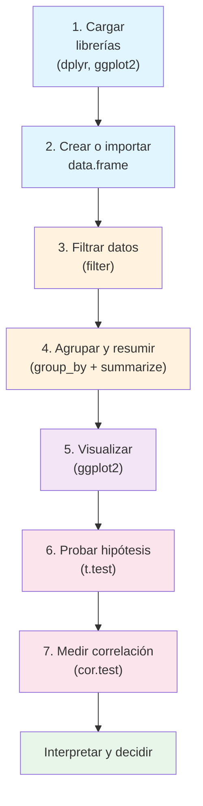

# Diseño del Proyecto Integrador y Taller Práctico en R Studio (Clase 13)

**Curso:** Análisis Estadístico y Data Mining (ISIL, 2026-1)  
**Docente:** Omar David Visitación Romero  
**Fecha:** 02/07/2026

---

## Introducción

**Gancho humano:** Llevas 12 clases aprendiendo estadística, R, Python y minería de datos. Ahora viene la pregunta: ¿cómo juntar todo eso en un proyecto que realmente demuestre lo que sabes? La respuesta está en el diseño... y en la práctica.

**Pregunta guía:** ¿Cómo convertir una idea vaga en un proyecto de análisis de datos estructurado, factible y con impacto? Y una vez diseñado, ¿cómo se ejecuta en R Studio?

**Objetivos de aprendizaje:**
- Seleccionar un dataset adecuado según criterios de calidad y relevancia
- Formular objetivos claros usando el marco SMART
- Delimitar el alcance del proyecto para hacerlo realista
- Planificar etapas y entregables en 3 semanas
- Configurar R Studio y comprender su interfaz
- Manipular datos con `dplyr`: filtrado, agrupamiento y resumen
- Visualizar resultados con `ggplot2`
- Aplicar pruebas estadísticas (T-test) y análisis de correlación en R

---

## PARTE I: Diseño del Proyecto Integrador

---

## 1. Selección de Datos: Fuentes Relevantes y Criterios

### ¿Por qué empezar por los datos?

**Analogía simple:** Seleccionar datos es como elegir el terreno antes de construir una casa. Si el terreno es inestable, todo lo que construyas se caerá. Si es sólido y del tamaño correcto, el proyecto será viable.

### Los 5 criterios de selección

| # | Criterio | Qué evaluar | Preguntas guía |
|---|----------|-------------|----------------|
| 01 | **Relevancia** | ¿El dataset está alineado con tu tema? | ¿Este dataset permite responder mi pregunta de investigación? |
| 02 | **Calidad y estructura** | Número de registros, tipos de variables, limpieza | ¿Necesitaré mucha limpieza para poder usarlo? |
| 03 | **Accesibilidad y confiabilidad** | Fuente pública, verificable, documentada | ¿La fuente es pública, confiable y verificable? |
| 04 | **Potencial analítico** | Variables numéricas y categóricas suficientes | ¿Podré aplicar clustering o clasificación? |
| 05 | **Autenticidad y representatividad** | Valores coherentes, rangos posibles | ¿Los valores parecen reales y creíbles? |

### Fuentes válidas

- **Kaggle** — Miles de datasets documentados
- **Data.gov / Data.gov.pe** — Datos abiertos del gobierno
- **INEI** — Estadísticas nacionales de Perú
- **APIs públicas** — Twitter, Spotify, OpenStreetMap
- **Datos propios** — De tu trabajo o emprendimiento (con aprobación)

### Fuentes no recomendadas

- ❌ Datos inventados
- ❌ Bases mal documentadas
- ❌ Datasets con menos de 200 registros

### Pasos concretos

```
┌─────────────────────────────────────────────┐
│   PROCESO DE SELECCIÓN DE DATOS             │
├─────────────────────────────────────────────┤
│  1. Elegir tema: clientes, ventas, salud,   │
│     educación, transporte, etc.             │
│     ↓                                       │
│  2. Buscar datasets alineados (mínimo 2)    │
│     ↓                                       │
│  3. Evaluar los 5 criterios y justificar    │
│     ↓                                       │
│  4. Describir el dataset final: fuente,     │
│     observaciones, variables, tipos,        │
│     relevancia                              │
└─────────────────────────────────────────────┘
```

---

## 2. Objetivos: Definición de Metas SMART

### ¿Por qué usar SMART?

**Analogía simple:** Un objetivo sin SMART es como decir "quiero estar en forma". Un objetivo SMART es decir "quiero poder correr 5K en 30 minutos para el 15 de julio". La diferencia es que el segundo es medible, alcanzable y tiene fecha.

### Las 5 letras de SMART

| Letra | Significado | Ejemplo malo | Ejemplo bueno |
|-------|------------|--------------|---------------|
| **S** | Específico | "Analizar los datos" | "Calcular estadísticas descriptivas de consumo y perfil demográfico" |
| **M** | Medible | "Comprender el comportamiento" | "Analizar mediante estadísticas descriptivas y visualizaciones" |
| **A** | Alcanzable | "Crear 10 modelos avanzados" | "Realizar limpieza y estandarización de variables numéricas" |
| **R** | Relevante | "Analizar migración (con dataset de ventas)" | "Determinar qué variables influyen en el comportamiento de compra" |
| **T** | Temporal | "Hacer análisis" | "Durante la fase de análisis del proyecto, aplicar pruebas estadísticas" |

### Estructura recomendada

- **1 objetivo general** — Describe la finalidad global del proyecto
- **2 a 4 objetivos específicos SMART** — Detallan los pasos concretos

### Ejemplo de objetivo general

> "Identificar patrones y segmentos de comportamiento entre los clientes de un negocio de consumo mediante análisis estadístico y técnicas de minería de datos"

---

## 3. Alcance: Delimitación del Proyecto

### ¿Por qué delimitar?

Un proyecto sin alcance definido es como un viaje sin mapa: puedes terminar en cualquier lugar, o no llegar a ningún lado. Delimitar permite enfocar, priorizar y garantizar que sea realista en el tiempo.

### Las 5 dimensiones del alcance

| Dimensión | Qué define | Ejemplo |
|-----------|-----------|---------|
| **Temático** | ¿Qué se analizará? | "Patrones de compra de clientes" |
| **Estadístico/Metodológico** | ¿Qué técnicas se aplicarán? | "Estadística descriptiva + clustering" |
| **Poblacional** | ¿A quién se refiere? | "Clientes que compraron en los últimos 6 meses" |
| **Temporal** | ¿Qué periodo abarcan los datos? | "Ventas entre enero y diciembre de 2025" |
| **Límites y exclusiones** | ¿Qué NO se hará? | "No se realizarán modelos predictivos supervisados" |

### Ejemplo de exclusiones válidas

- "No se evaluarán factores externos no incluidos en las variables"
- "No se analizarán datos faltantes de forma avanzada (solo limpieza básica)"
- "No se compararán múltiples algoritmos, solo k-means"

---

## 4. Estructura: Planificación de Etapas y Entregables

### ¿Por qué planificar?

La planificación evita improvisaciones, atrasos y análisis incompletos. Distribuye el trabajo en semanas y asegura que los resultados se construyan de forma progresiva.

### Cronograma del proyecto (3 semanas)

```
┌─────────────────────────────────────────────┐
│   CRONOGRAMA PROYECTO INTEGRADOR            │
├─────────────────────────────────────────────┤
│                                             │
│  SEMANA 13: DISEÑO                          │
│  ├── Selección del dataset                  │
│  ├── Descripción de variables               │
│  ├── Formulación de objetivos SMART         │
│  ├── Delimitación del alcance               │
│  └── Plan de trabajo                        │
│  Entregable: documento de diseño            │
│                                             │
│  SEMANA 14: ANÁLISIS                        │
│  ├── Limpieza de datos                      │
│  ├── Preprocesamiento                       │
│  ├── Estadística descriptiva e inferencial  │
│  ├── Minería de datos (clustering/clasif.)  │
│  └── Gráficos y hallazgos preliminares      │
│  Entregable: reporte de análisis            │
│                                             │
│  SEMANA 15: INTEGRACIÓN                     │
│  ├── Storytelling del proyecto              │
│  ├── Visualización de resultados            │
│  ├── Conclusiones basadas en evidencia      │
│  ├── Recomendaciones y limitaciones         │
│  └── Preparación de presentación            │
│  Entregable: borrador del informe           │
│                                             │
│  SEMANA 16: ENTREGA FINAL                   │
│  ├── Informe completo                       │
│  ├── Presentación oral                      │
│  └── Scripts en R y/o Python                │
└─────────────────────────────────────────────┘
```

---

## 5. Herramientas: Selección de R o Python

### ¿Cómo elegir?

La elección depende del tipo de análisis, tus habilidades y los objetivos del proyecto.

### Comparación rápida

| Criterio | R | Python |
|----------|---|--------|
| **Mejor para** | Estadística descriptiva e inferencial | Minería de datos y machine learning |
| **Visualización** | ggplot2 (limpio y rápido) | matplotlib, seaborn, plotly |
| **Librerías clave** | tidyverse, caret, stats | scikit-learn, pandas, numpy |
| **Ideal cuando** | El análisis es centrado en estadísticas | Se necesita escalabilidad y ML robusto |

### Cuándo elegir R

- Análisis de encuestas
- Comparación de grupos (t-test, ANOVA)
- Identificación de patrones con gráficos
- Estadística tradicional

### Cuándo elegir Python

- Segmentación con k-means
- Clasificación (árboles, regresión logística)
- Análisis de comportamiento por patrones
- Datasets grandes que requieren escalabilidad

---

## Errores Comunes a Evitar

| Error | Ejemplo | Consecuencia |
|-------|---------|--------------|
| Dataset demasiado pequeño | 30 registros para clustering | Resultados no confiables |
| Objetivos vagos | "Analizar todo sobre los clientes" | Proyecto infinito e imposible |
| Sin delimitar exclusiones | No decir qué NO se hará | Expectativas irreales |
| Elegir herramienta por tendencia | Usar Python cuando R es más adecuado | Tiempo perdido, código innecesario |

---

## Conclusiones

### Parte I: Diseño del Proyecto
1. La selección del dataset es la base: debe ser relevante, confiable y con potencial analítico
2. Los objetivos SMART dan un rumbo claro, medible y evaluable
3. Delimitar el alcance facilita mantener el proyecto dentro de límites realistas
4. La planificación en etapas asegura cumplimiento progresivo de entregables

### Parte II: Taller Práctico en R Studio
5. R Studio es la interfaz ideal para análisis estadístico: combina editor, consola, entorno y visualización
6. `dplyr` permite manipular datos con verbos claros: `filter`, `group_by`, `summarize`
7. `ggplot2` genera gráficos profesionales con sistema de capas
8. El T-test (P-value < 0.05) confirma si una diferencia es real o fruto del azar
9. La correlación (0.99) demuestra relaciones lineales fuertes entre variables

**Frase clave:**
> "Un buen diseño de proyecto no garantiza el éxito, pero un mal diseño garantiza el fracaso. Y un diseño sin ejecución práctica es solo un papel bonito."

---

## Glosario

| Término | Definición | Ejemplo |
|---------|------------|---------|
| **SMART** | Framework para objetivos: Specific, Measurable, Achievable, Relevant, Time-bound | "Reducir churn 10% en 3 meses" |
| **Dataset** | Conjunto de datos estructurado para análisis | Archivo CSV con ventas de 2025 |
| **Clustering** | Técnica de minería para agrupar registros similares | Segmentar clientes por comportamiento de compra |
| **Outliers** | Valores atípicos fuera del rango esperado | Un cliente con 200 años de edad |
| **Storytelling** | Narrativa basada en datos para comunicar resultados | Presentar hallazgos con contexto e impacto |
| **Alcance** | Límites y exclusiones del proyecto | "No se evaluarán factores externos" |
| **R Studio** | IDE para R: editor, consola, entorno y visualización en una sola ventana | Interfaz con 4 paneles |
| **`dplyr`** | Librería de R para manipulación de datos con verbos como `filter`, `group_by` | Equivalente a Pandas en Python |
| **`ggplot2`** | Librería de R para visualización de datos con sistema de capas | Gráficos de barras, dispersión, líneas |
| **Pipe (`%>%`)** | Operador de R que encadena operaciones de forma legible | `datos %>% filter(x > 5)` |
| **T-test** | Prueba estadística para comparar medias de dos grupos | Comparar ventas tradicional vs nueva estrategia |
| **P-value** | Probabilidad de que el resultado sea por azar; si < 0.05, es significativo | P = 0.000067 → significativo |
| **Correlación** | Medida lineal entre dos variables (-1 a 1) | 0.99 = relación positiva fuerte |
| **`data.frame`** | Estructura de datos tabular en R (filas y columnas) | Tabla de ventas por región |

---

## Preguntas de Reflexión

### Diseño del Proyecto
1. **Pregunta aplicada:** "Si tuvieras que elegir un dataset para analizar el rendimiento de una universidad, ¿qué variables incluirías y por qué?"
2. **Pregunta comparativa:** "¿Cuál de los 5 criterios de selección de datos crees que es el más importante y por qué?"
3. **Pregunta crítica:** "¿Qué pasaría si un proyecto de análisis de datos no tiene objetivos SMART definidos desde el inicio?"

### Taller Práctico en R Studio
4. **Pregunta práctica:** "¿Cuál es la diferencia entre el operador de asignación `<-` y el pipe `%>%` en R?"
5. **Pregunta analítica:** "Si el P-value de un T-test da 0.08, ¿qué concluyes? ¿Es significativo el resultado?"
6. **Pregunta de aplicación:** "Si tienes un coeficiente de correlación de -0.85 entre precio y demanda, ¿qué relación describes y qué decisión de negocio tomarías?"

---

## PARTE II: Taller Práctico — Introducción a R Studio

**Gancho:** Ya tienes el diseño del proyecto. Ahora la pregunta es: ¿cómo se ejecuta? En esta parte nos sentamos frente a R Studio y vemos cómo se manipulan datos, se grafican resultados y se aplican pruebas estadísticas reales.

---

### 6. R Studio: Qué es y Por Qué Importa

**R** es el lenguaje de programación (el motor estadístico). **R Studio** es la interfaz gráfica (IDE) que facilita el trabajo. Es como la diferencia entre saber conducir (R) y tener un auto con GPS y tablero digital (R Studio).

### Estructura de la Interfaz (Las 4 Vistas)

| Ubicación | Vista | Qué hace |
|-----------|-------|----------|
| **Superior Izquierda** | Editor de Scripts | Donde se escribe y almacena el código (`.R`) |
| **Inferior Izquierda** | Consola | Muestra los resultados de la ejecución del código |
| **Superior Derecha** | Environment | Muestra las variables, objetos y DataSets cargados en memoria |
| **Inferior Derecha** | Files / Plots / Help | Permite explorar archivos del sistema y visualizar gráficos |

> **Nota técnica:** Para guardar un script en R, se utiliza la extensión `.R` (ej. `taller-basico.R`). Para ejecutar líneas de código seleccionadas, se usa el atajo **`Control + Enter`**. El símbolo **`#`** se utiliza para añadir comentarios que el lenguaje no ejecutará.

---

### 7. Gestión de Librerías y Estructuras de Datos

Para empezar a trabajar, se instalaron y llamaron dos librerías fundamentales de R:

| Librería | Equivalente en Python | Para qué sirve |
|----------|----------------------|----------------|
| **`dplyr`** | Pandas | Manipular tablas, filtrar, agrupar y organizar filas/columnas |
| **`ggplot2`** | Matplotlib / Seaborn | Creación avanzada de gráficos y presentación de resultados |

### Ejemplo: Creación de un Data Frame

En R, el operador de asignación es una flecha apuntando a la izquierda (`<-`). Se creó una pequeña base de datos horizontal utilizando la función `data.frame()`:

```r
# Crear la tabla de ventas por región
ventas <- data.frame(
  region = c("Norte", "Norte", "Sur", "Sur", "Centro", "Centro"),
  ventas = c(520, 610, 750, 900, 480, 430)
)
```

---

### 8. Manipulación de Datos con `dplyr`

#### Filtrado de Datos

Para conectar operaciones en R de forma secuencial, se utiliza el operador *pipe* (**`%>%`**), que se lee como *"además de esto, haz lo siguiente"*.

El profesor filtró la tabla para mantener solo los registros con ventas superiores a 500:

```r
# Filtrar registros mayores a 500
ventas_filtradas <- ventas %>% filter(ventas > 500)
```

*Resultado:* Desaparecen las filas del "Centro" (480 y 430), quedando solo las ventas más altas.

#### Agrupamiento y Resumen (`group_by` y `summarize`)

Se agruparon los datos por región para calcular el promedio de ventas de cada una:

```r
# Agrupar por región y calcular el promedio
resumen_region <- ventas_filtradas %>% 
  group_by(region) %>% 
  summarize(promedio_ventas = mean(ventas))
```

*Detalle del resultado:*

- La región **Norte** combinó sus dos registros (520 y 610) dando un promedio de **565**.
- Las regiones **Centro** y **Sur** mantuvieron sus valores únicos al no tener múltiples registros que promediar tras el filtro.

---

### 9. Visualización de Datos con `ggplot2`

Se construyó un gráfico de barras interactivo utilizando capas combinadas con el signo **`+`**:

```r
# Generar gráfico de barras minimalista
ggplot(data = resumen_region, aes(x = region, y = promedio_ventas, fill = region)) +
  geom_bar(stat = "identity") +
  labs(title = "Promedio de ventas por región", x = "Región", y = "Promedio de ventas") +
  theme_minimal()
```

| Componente | Qué hace |
|------------|----------|
| **`aes()`** | Define los ejes ($X$ = región, $Y$ = promedio) y el color de relleno (`fill`) por región |
| **`geom_bar(stat = "identity")`** | Respeta los valores exactos de la tabla |
| **`theme_minimal()`** | Aplica un diseño limpio y moderno en la pestaña de *Plots* |

---

### 10. Análisis de Hipótesis: El T-test (Prueba T de Student)

El **T-test** sirve para comparar los promedios de dos escenarios y determinar si la diferencia matemática se debe a una **tendencia real o a la mera casualidad estadística**.

#### Ejemplo: Venta Tradicional vs. Venta Nueva

Se registraron los resultados de dos estrategias comerciales:

| Estrategia | Valores |
|------------|---------|
| `ventas_tradicional` | 1200, 1300, 1250, 1280, 1070 |
| `ventas_nueva` | 1400, 1450, 1500, 1480, 1420 |

```r
# Prueba T para comparar medias
t.test(ventas_tradicional, ventas_nueva)
```

#### Resultado Clave: El P-Value

El sistema aplicó el método *Welch* (ideal para datos con variabilidad) y arrojó:

> **P-value = $6.7 \times 10^{-5}$** (es decir, $0.000067$)

Al ser **menor que 0.05**, se concluye con un **95% de confiabilidad** que la nueva estrategia es **consistente y significativamente superior**, descartando que el incremento haya sido por pura suerte.

#### Regla de Decisión

| P-value | Interpretación |
|---------|----------------|
| **< 0.05** | Diferencia estadísticamente significativa — rechazar hipótesis nula |
| **>= 0.05** | No hay evidencia suficiente — no se puede rechazar hipótesis nula |

---

### 11. Análisis de Correlación

Se analizó el impacto y vinculación entre dos variables cuantitativas independientes: la inversión en **Publicidad** y las **Ventas Mensuales**.

```r
# Test de correlación
cor.test(publicidad, ventas_mensuales)
```

**Resultado obtenido:** **0.99**

> El coeficiente de correlación varía entre -1 y 1. Al estar en **0.99** (extremadamente cerca de 1), demuestra una **relación positiva fuerte**. Cada sol invertido en publicidad se refleja directamente en un incremento de las ventas.

#### Tabla de Interpretación de Correlación

| Rango de r | Fuerza | Interpretación |
|------------|--------|----------------|
| 0.7 a 1.0 | Fuerte positiva | A mayor X, mayor Y de forma consistente |
| 0.4 a 0.69 | Moderada positiva | Existe relación, pero con excepciones |
| 0.0 a 0.39 | Débil o nula | Poca o ninguna relación lineal |
| -0.4 a -0.69 | Moderada negativa | A mayor X, menor Y |
| -0.7 a -1.0 | Fuerte negativa | Relación inversa consistente |

---

### Resumen: Flujo Completo en R Studio



---

### Pregunta de Cierre: ¿R o Python?

A la duda de un alumno sobre cuándo usar R en lugar de Python, el profesor aclaró:

| Criterio | R | Python |
|----------|---|--------|
| **Mejor para** | Entornos puramente estadísticos y académicos | Machine Learning, Data Science complejo y Deep Learning |
| **Comunidad** | Más pequeña, especializada | Más grande, diversa |
| **Librerías** | Paquetes nativos estadísticos muy cómodos | scikit-learn, TensorFlow, PyTorch |
| **Conclusión** | Ambos pueden realizar tareas estadísticas por igual | Elegir según el contexto del proyecto |

> **Recomendación práctica:** Para el Proyecto Integrador, usa la herramienta que mejor se adapte al tipo de análisis que necesites. R es excelente para estadística pura y visualización. Python es más versátil para ML y escalabilidad.

---

## Fuentes

| # | Fuente | Tipo | URL |
|---|--------|------|-----|
| 1 | González, M., & López, S. (2021). *Estadística y minería de datos para la toma de decisiones empresariales* | Libro | Editorial Académica Española |
| 2 | Martínez, J., & Pérez, A. (2022). *Data Science y análisis de datos con Python* | Libro | Editorial Profesional |
| 3 | Torres, L., & Ramírez, F. (2023). *Gestión de proyectos de análisis de datos* | Libro | Editorial Universitaria |
