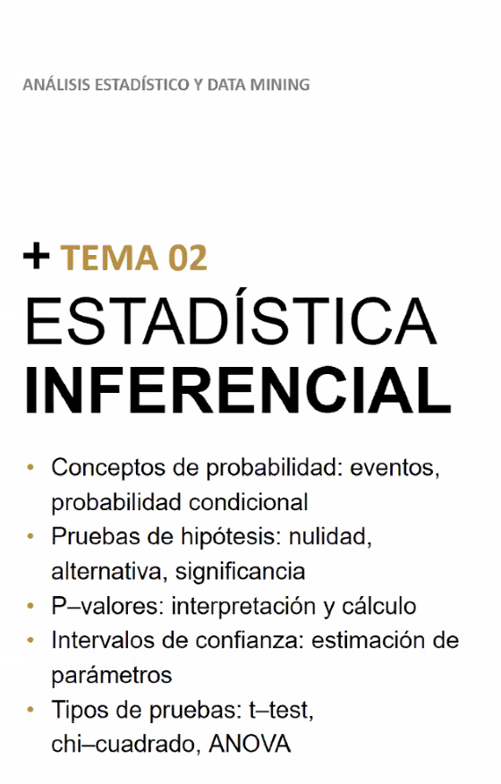
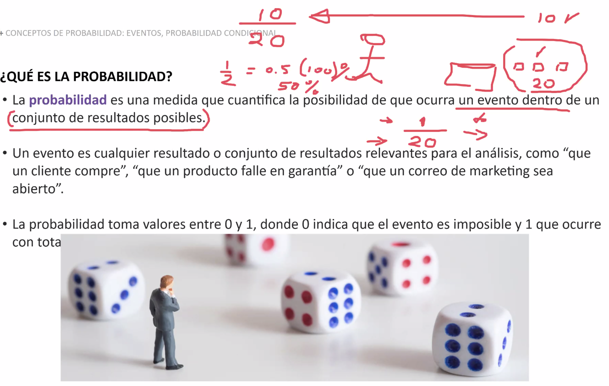
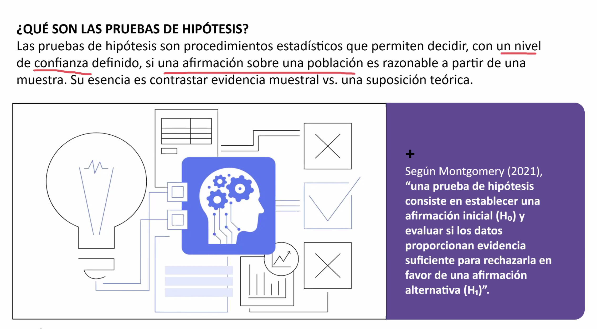
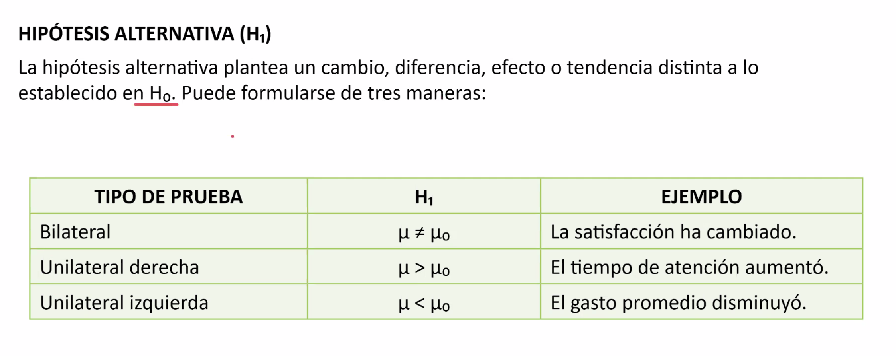
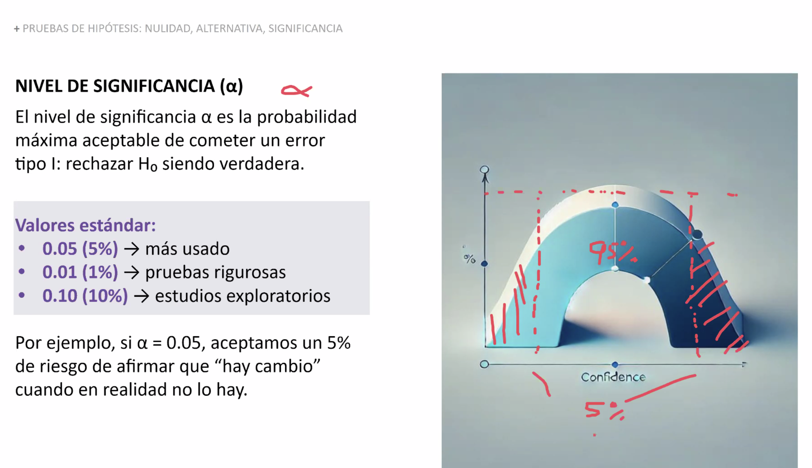
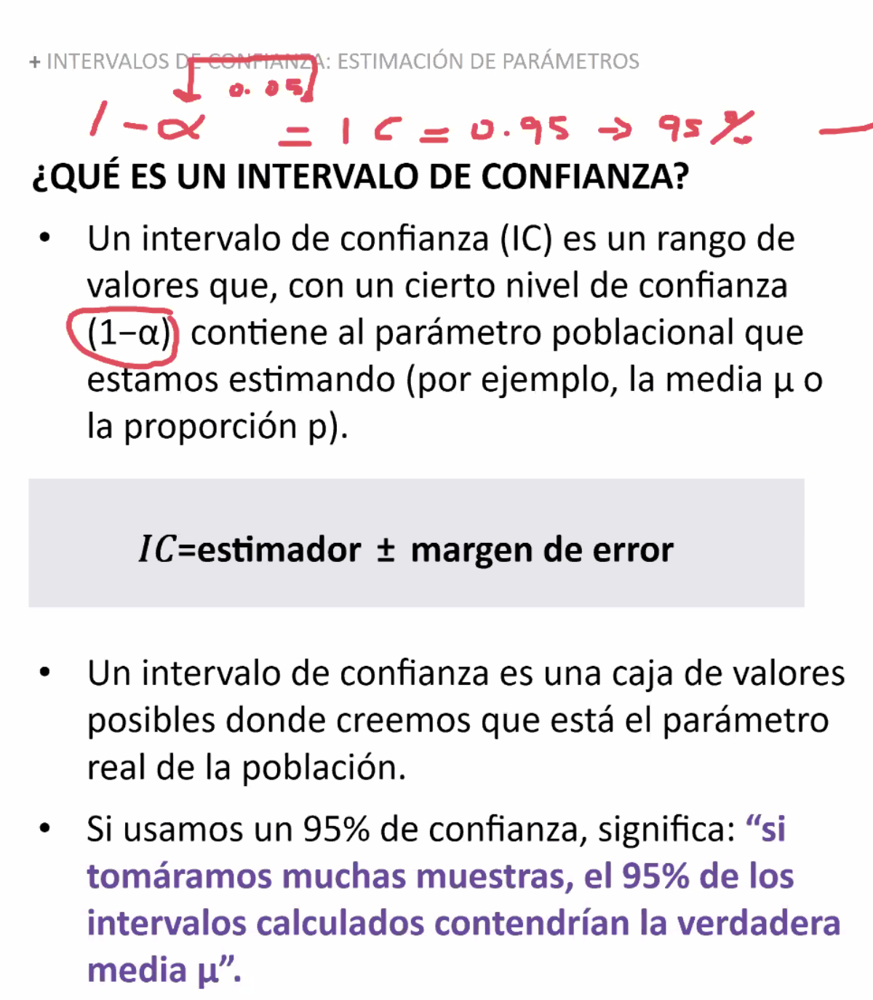
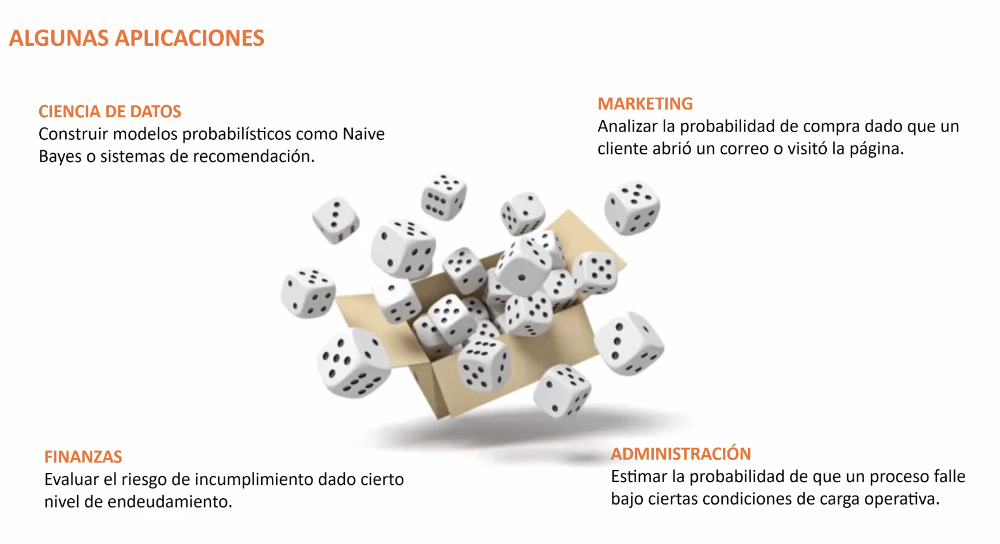
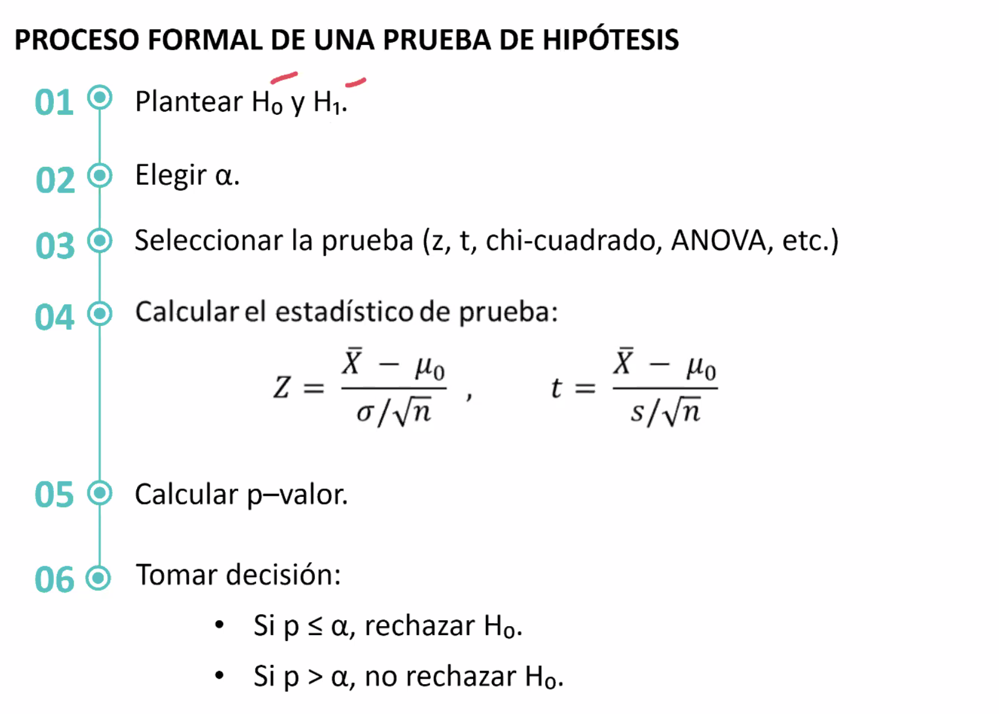

# Análisis Estadístico y Data Mining — Tema 02: Estadística Inferencial (Clase 3)

**Curso:** Análisis Estadístico y Data Mining (ISIL, 2026-1)  
**Docente:** [Por confirmar]  
**Fecha:** 22/04/2026

---

## 1. Introducción: Dos Ramas de la Estadística

> **Esencia:** Trabajar con datos para entender patrones y tomar decisiones bajo incertidumbre.

| **Rama** | **Qué hace** | **Scope** | **Pregunta típica** |
|----------|-------------|----------|-------------------|
| **Descriptiva** | Resume datos existentes | Lo que YA mediste | ¿Cuál es el promedio de mis datos? |
| **Inferencial** | Generaliza desde muestra a población | Lo que NO mediste | ¿Qué podemos decir de TODA la población basándonos en una muestra? |

### Ejemplo comparativo:
- **Descriptiva:** En tu salón hay 30 alumnos con notas 6, 7, 8, 9. **Promedio:** 7.5.
- **Inferencial:** Encuestamos 500 personas y 60% apoya una idea. **Estimamos:** ~60% de TODA la ciudad lo apoya (margen de error: ±3%).

---

## 2. Conceptos Fundamentales: Población, Muestra y Probabilidad



Esta imagen muestra los conceptos nucleares de la estadística inferencial: la relación entre población y muestra, la función de la probabilidad y el rol de la prueba de hipótesis para validar conclusiones.

### Vocabulario clave:

| **Término** | **Definición** | **Ejemplo** |
|-----------|--------------|----------|
| **Población** | Todos los individuos que te interesan | Todos los votantes de un país |
| **Muestra** | Una parte representativa de la población | 1,000 votantes seleccionados aleatoriamente |
| **Parámetro** | Característica desconocida de la población | Media poblacional μ (mu) |
| **Estimador** | Valor calculado de la muestra | Media muestral x̄ (x barra) |
| **Estimación** | Cálculo aproximado del parámetro poblacional | Creemos que μ ≈ 65 |
| **Intervalo de Confianza** | Rango donde probablemente está el valor real | Con 95% confianza: μ está entre 62 y 68 |
| **Prueba de Hipótesis** | Test para decidir si una diferencia es real o por azar | ¿Este medicamento realmente funciona o solo por suerte? |
| **Nivel de Significancia (α)** | Probabilidad de cometer error tipo 1 | Típicamente 0.05 (5%) |
| **P-valor** | Probabilidad de observar datos si la hipótesis nula es verdadera | Si p-valor < 0.05 → rechazamos hipótesis nula |

### Glosario visual rápido:

> **Población:** *todos* los que te interesan.  
> Ej.: "toda la ciudad", "todos los clientes de un banco".

> **Muestra:** *una parte* representativa de esa población.  
> Ej.: "1,000 personas", "200 transacciones aleatorias".

> **Estimación:** un **cálculo aproximado** del total usando la muestra.  
> Ej.: "estimamos que 60% apoya esta política".

> **Intervalo de confianza:** un **rango** donde probablemente está el valor real.  
> Ej.: "con 95% confianza, está entre 57% y 63%".

> **Prueba de hipótesis:** decidir si una diferencia es **real** o fue **por suerte/azar**.  
> Ej.: "¿este método de estudio mejora las notas o solo parece?"

---

## 3. Estadística Inferencial: La Rama Principal

**La estadística inferencial** (también llamada **estadística diferencial**) es la parte de la estadística que:

> **Usa datos de una muestra** → **Para sacar conclusiones, estimar valores o tomar decisiones sobre una población completa** → Cuando no puedes medir a todos.

### ¿En qué se diferencia de la descriptiva?

| Aspecto | Descriptiva | Inferencial |
|--------|-----------|-------------|
| **Objetivo** | Resumir datos | Generalizar a población |
| **Herramientas** | Promedios, medianas, gráficos | Intervalos, pruebas de hipótesis, modelos |
| **Incertidumbre** | No cuantifica error | Siempre habla de probabilidad y confianza |
| **Muestra vs Población** | Solo describe muestra | Estima población desde muestra |

---

## 4. Herramientas de Estadística Inferencial

### A. Estimación: De Muestra a Población con Probabilidad

**Concepto:** Predecir el valor de un parámetro poblacional usando datos muestrales.



El gráfico explica la base de la probabilidad aplicada a estimaciones: cómo una muestra permite inferir un parámetro desconocido y por qué los intervalos de confianza agregan la idea de incertidumbre controlada.

**Tipos:**
- **Estimación puntual:** un único número (ej: "el promedio es 65")
- **Estimación por intervalo:** rango con nivel de confianza (ej: "entre 62 y 68 con 95% confianza")

**Ejemplo:**
```
Muestra de 100 clientes: gasto promedio = $500
→ Estimamos que TODOS los clientes gastan ~$500
→ Intervalo 95% confianza: [$480 - $520]
```

### B. Pruebas de Hipótesis: Flujo de Decisión y Tipos de Alternativas

**Concepto:** Test estadístico para decidir entre dos hipótesis:
- **H₀ (Hipótesis Nula):** No hay diferencia / el efecto no existe
- **H₁ (Hipótesis Alternativa):** Hay diferencia / el efecto existe



El diagrama ilustra el flujo de una prueba: desde definir H₀ y H₁, pasando por el cálculo del estadístico, hasta la comparación con el nivel de significancia y la decisión final.


Esta segunda imagen enfatiza el significado de la hipótesis nula y la alternativa, mostrando que la prueba es una evaluación estructurada de evidencia, no una simple intuición.

**Proceso típico:**
1. Plantear hipótesis (H₀ y H₁)
2. Recolectar datos
3. Calcular estadístico de prueba (t, χ², F, etc.)
4. Comparar p-valor con nivel de significancia (α = 0.05)
5. Decisión: rechazar H₀ o no



Este gráfico describe los tipos de hipótesis alternativas: si el efecto puede ocurrir en dos direcciones (bilateral) o en una sola (unilateral), y por qué esa elección cambia la interpretación del resultado.

**Tipos de Pruebas Comunes:**

| **Prueba** | **Caso de uso** | **Variables** | **Ejemplo** |
|-----------|----------------|--------------|----------|
| **t-test** | Comparar promedios entre 2 grupos | Continuas, normal | ¿Dos métodos de estudio dan diferentes notas? |
| **ANOVA** | Comparar promedios entre 3+ grupos | Continuas, normal | ¿3 dietas producen diferentes pérdidas de peso? |
| **Chi-cuadrado (χ²)** | Relación entre variables categóricas | Categóricas | ¿El género está relacionado con preferencia de producto? |
| **Pearson (r)** | Correlación entre 2 variables continuas | Continuas | ¿Hay relación entre años de experiencia y salario? |
| **Wilcoxon, Mann-Whitney** | Cuando datos NO son normales | Ordinales, no-normales | Test no-paramétrico alternativo a t-test |

### Ejemplos Prácticos de Hipótesis

Para entender mejor cómo funcionan las hipótesis, veamos ejemplos concretos de cada tipo de prueba:

#### 1. t-test (Comparación de dos grupos)
- **H₀ (Nula):** El promedio de notas con método A = promedio de notas con método B
- **H₁ (Alternativa bilateral):** El promedio de notas con método A ≠ promedio de notas con método B
- **H₁ (Alternativa unilateral):** El promedio de notas con método A > promedio de notas con método B
- **Ejemplo:** ¿El nuevo método de estudio mejora las notas promedio de los estudiantes?

#### 2. ANOVA (Comparación de tres o más grupos)
- **H₀ (Nula):** Los promedios de pérdida de peso son iguales en las 3 dietas
- **H₁ (Alternativa):** Al menos una dieta produce pérdida de peso diferente
- **Ejemplo:** ¿Las dietas baja en carbohidratos, mediterránea y vegana producen diferentes pérdidas de peso promedio?

#### 3. Chi-cuadrado (χ²) - Relación entre variables categóricas
- **H₀ (Nula):** No hay relación entre género y preferencia de producto
- **H₁ (Alternativa):** Hay relación entre género y preferencia de producto
- **Ejemplo:** ¿Los hombres y mujeres prefieren diferentes marcas de teléfono móvil?

#### 4. Correlación de Pearson (r)
- **H₀ (Nula):** No hay correlación entre años de experiencia y salario
- **H₁ (Alternativa bilateral):** Hay correlación (positiva o negativa) entre años de experiencia y salario
- **H₁ (Alternativa unilateral):** Hay correlación positiva entre años de experiencia y salario
- **Ejemplo:** ¿Los empleados con más años de experiencia ganan más dinero?

#### 5. Wilcoxon/Mann-Whitney (No paramétrico)
- **H₀ (Nula):** Las distribuciones de satisfacción son iguales en dos grupos
- **H₁ (Alternativa):** Las distribuciones de satisfacción son diferentes entre grupos
- **Ejemplo:** ¿Los clientes de dos tiendas diferentes tienen niveles de satisfacción similares?

> **Nota sobre tipos de hipótesis alternativas:**
> - **Bilateral (≠):** Busca cualquier diferencia (mayor o menor)
> - **Unilateral (> o <):** Busca diferencia en una dirección específica
> - La elección depende de la pregunta de investigación



Esta imagen ilustra los errores que pueden ocurrir en pruebas de hipótesis: el error tipo I (falso positivo) cuando rechazamos H₀ siendo verdadera, y el error tipo II (falso negativo) cuando no rechazamos H₀ siendo falsa. Muestra cómo el nivel de significancia (α) y el poder de la prueba afectan estos errores.



Esta imagen explica el concepto de p-valor y errores comunes en su interpretación. El p-valor mide la probabilidad de observar datos tan extremos como los obtenidos, asumiendo que H₀ es verdadera. Errores comunes incluyen confundir p-valor con probabilidad de que H₀ sea verdadera, o usar umbrales rígidos sin considerar el contexto.

**Ejemplo práctico de p-valor:**
En un experimento de fertilizante, H₀: "El fertilizante no aumenta el rendimiento promedio". Se obtienen datos donde el rendimiento promedio aumenta 15%. El análisis estadístico da p-valor = 0.03.

**Interpretación correcta:**
- Si H₀ fuera verdadera (fertilizante no funciona), habría solo 3% de probabilidad de obtener un aumento tan grande por azar.
- Como p-valor = 0.03 < 0.05 (nivel α), rechazamos H₀ y concluimos que el fertilizante sí aumenta el rendimiento.
- **No significa:** "Hay 97% de probabilidad de que el fertilizante funcione" o "El efecto es 97% confiable".

**Errores comunes a evitar:**
1. **Pensar que p-valor mide el tamaño del efecto:** Un p-valor pequeño no significa efecto grande (puede ser efecto pequeño pero muestra grande).
2. **Usar p-valor como medida de importancia práctica:** Un resultado estadísticamente significativo puede no ser relevante en la práctica.
3. **Ignorar el poder de la prueba:** Con muestras pequeñas, es difícil obtener p-valores pequeños aunque el efecto exista.
4. **Umbrales rígidos:** No siempre usar 0.05; depende del contexto (medicina vs marketing).

**Guía de interpretación:**
- p > 0.10: Evidencia débil contra H₀
- 0.05 < p ≤ 0.10: Evidencia moderada
- 0.01 < p ≤ 0.05: Evidencia fuerte
- p ≤ 0.01: Evidencia muy fuerte

### C. Modelos y Predicción

**Regresión Lineal:** Predecir una variable continua basada en otra(s).

```
Ejemplo: Salario = 30,000 + (5,000 × Años_experiencia)
Si tienes 5 años → Salario estimado = 55,000
```

**Regresión Logística:** Predecir probabilidad de un evento binario (sí/no).

```
Ejemplo: Probabilidad de compra = función(edad, ingreso, historial)
```

### D. Diseño de Experimentos y Muestreo

**Muestreo aleatorio:** Garantiza que la muestra represente a la población.

- **Aleatorio simple:** cada individuo tiene igual probabilidad
- **Estratificado:** divide en subgrupos (estratos) representados proporcionalmente
- **Sistemático:** toma cada k-ésimo individuo
- **Por conglomerados:** agrupa y selecciona clusters

**Tamaño de muestra:** Depende de confianza deseada, margen de error y variabilidad.

---

## 5. Aplicaciones Prácticas: Estadística Inferencial en Industrias Reales

| **Industria** | **Caso de uso** | **Pregunta inferencial** | **Herramienta** |
|--------------|----------------|----------------------|----------------|
| **Medicina** | Ensayos clínicos | ¿Este medicamento funciona mejor que placebo? | Prueba t, ANOVA |
| **Marketing** | A/B testing | ¿El nuevo diseño web aumenta conversiones? | Prueba χ², diferencia de proporciones |
| **Manufactura** | Control de calidad | ¿El lote cumple especificaciones? | Muestreo, prueba de hipótesis |
| **Política** | Encuestas | ¿Cuál es la intención de voto? | Intervalo de confianza, margen de error |
| **Educación** | Evaluación método | ¿El nuevo sistema mejora aprendizaje? | Prueba t, ANOVA |
| **Finanzas** | Riesgo crediticio | ¿Quién tiene riesgo de default? | Regresión logística |
| **Tecnología** | Análisis de datos | ¿Qué factores predicen abandono de usuario? | Regresión, correlación |

**Ejemplos detallados por industria:**

- **Medicina:** En un ensayo clínico, se prueba un nuevo analgésico en 200 pacientes vs 200 con placebo. H₀: "No hay diferencia en reducción de dolor". Resultado: p-valor = 0.03 → Se rechaza H₀, concluyendo que el medicamento es efectivo.

- **Marketing:** Una tienda online prueba dos versiones de página de checkout. Versión A: 1,000 visitas, 50 conversiones. Versión B: 1,000 visitas, 65 conversiones. Prueba de proporciones: p-valor < 0.05 → Versión B aumenta conversiones significativamente.

- **Manufactura:** Una fábrica inspecciona calidad tomando muestras de 50 productos cada hora. Si >5% defectuosos, se detiene la línea. Intervalo de confianza 95%: "Con 95% confianza, la tasa real de defectos está entre 3.2% y 6.8%".

- **Política:** Encuesta pre-electoral con 1,200 votantes: 45% apoya candidato A. Intervalo 95%: "Apoyo real entre 42.3% y 47.7%". Margen de error ±2.7%.

- **Educación:** Nuevo método de enseñanza probado en 3 clases de 30 alumnos cada una. ANOVA muestra p-valor = 0.01 → El método mejora significativamente las calificaciones promedio.

- **Finanzas:** Banco usa regresión logística con datos históricos (edad, ingresos, historial crediticio) para predecir probabilidad de default. Modelo: P(default) = 1/(1+e^-(0.02*edad + 0.001*ingresos - 2.5*historial)).

- **Tecnología:** App analiza churn con regresión. Factores: tiempo uso semanal, frecuencia quejas, rating app. Correlación muestra que usuarios con <2 horas/semana tienen 3x más riesgo de abandonar.



La ilustración muestra aplicaciones concretas de la estadística inferencial en sectores reales. Ayuda a conectar las técnicas con decisiones cotidianas en salud, marketing, calidad, política, educación, finanzas y tecnología.

---

## 6. Idea Clave: El Triángulo de la Inferencia

```
        POBLACIÓN
       (desconocida)
            ↑
         (estimamos)
            |
        MUESTRA ↔ EXPERIMENTO
        (medimos)  (diseñamos)
            |
            (recolectamos datos)
            ↓
        CONCLUSIÓN
      (con confianza ~95%)
```

> **Recuerda:** Como trabajas con muestras, la estadística inferencial siempre habla en términos de **probabilidad, error y confianza**. Nunca da "certezas absolutas", sino **márgenes razonables de incertidumbre**.

---

## 7. Próximas Clases

En siguientes sesiones veremos:
- Cálculo detallado de intervalos de confianza
- Interpretación de p-valores (y errores comunes)
- Diseño de experimentos con rigor estadístico
- Herramientas software: R, Python (scipy, statsmodels)



Esta imagen explica el cálculo de intervalos de confianza, que es fundamental para la estadística inferencial. Muestra cómo partir de una muestra para estimar un parámetro poblacional desconocido (como la media μ) con un margen de error controlado.

**Elementos clave de la imagen:**
- **Fórmula básica:** Intervalo = Estimador ± (Valor crítico × Error estándar)
- **Nivel de confianza (1-α):** Típicamente 95%, que deja 5% de probabilidad de error
- **Margen de error:** Determinado por el tamaño de muestra y variabilidad de los datos
- **Interpretación:** "Estoy 95% seguro de que el valor real está entre X e Y"

**Ejemplo práctico:**
Supongamos que encuestamos 100 clientes y el gasto promedio es $500 con desviación estándar $100. Para un nivel de confianza del 95%:
- Intervalo de confianza ≈ $500 ± (1.96 × $100/√100) = $500 ± $19.60
- Resultado: "Con 95% de confianza, el gasto promedio real de TODOS los clientes está entre $480.40 y $519.60"

**Tabla de referencia para diferentes niveles de confianza (n=100, σ=100):**

| Nivel de Confianza | Valor Z | Margen de Error | Intervalo |
|-------------------|---------|----------------|-----------|
| 90% | 1.645 | ±$16.45 | $483.55 - $516.45 |
| 95% | 1.96 | ±$19.60 | $480.40 - $519.60 |
| 99% | 2.576 | ±$25.76 | $474.24 - $525.76 |

**Ejemplo aplicado en marketing:**
Una empresa quiere saber cuánto gastan sus clientes en promedio. Toma una muestra de 200 compras con promedio $75 y desviación $20. Intervalo 95% de confianza:
- IC = $75 ± (1.96 × $20/√200) = $75 ± $2.77
- Resultado: "Con 95% confianza, el gasto promedio real está entre $72.23 y $77.77"
- Decisión: La empresa puede planificar precios o promociones basándose en este rango, no en el punto único de $75.

Esta técnica permite hacer inferencias sobre poblaciones grandes usando datos de muestras pequeñas, cuantificando la incertidumbre de manera rigurosa.

---

## 8. Índice de Conceptos Clave

### Conceptos Fundamentales
- **Población:** Conjunto completo de individuos que interesan
- **Muestra:** Subconjunto representativo de la población
- **Parámetro:** Característica desconocida de la población (μ, σ, p)
- **Estimador:** Valor calculado de la muestra (x̄, s, p̂)
- **Error de muestreo:** Diferencia entre parámetro y estimador

### Estimación
- **Estimación puntual:** Un solo valor (ej: x̄ = 65)
- **Estimación por intervalo:** Rango con nivel de confianza (ej: 62-68 con 95%)
- **Margen de error:** ± (valor crítico × error estándar)

### Pruebas de Hipótesis
- **Hipótesis nula (H₀):** No hay diferencia/efecto
- **Hipótesis alternativa (H₁):** Hay diferencia/efecto
- **P-valor:** Probabilidad de datos extremos si H₀ es verdadera
- **Nivel de significancia (α):** Probabilidad de error tipo I (típicamente 0.05)
- **Error tipo I:** Rechazar H₀ siendo verdadera (falso positivo)
- **Error tipo II:** No rechazar H₀ siendo falsa (falso negativo)
- **Poder de la prueba:** Probabilidad de detectar efecto real (1 - β)

### Tipos de Pruebas
- **t-test:** Comparar promedios entre 2 grupos
- **ANOVA:** Comparar promedios entre 3+ grupos
- **Chi-cuadrado:** Relación entre variables categóricas
- **Correlación:** Asociación entre variables continuas

---

## 9. Resumen de Fórmulas Principales

### Intervalos de Confianza
**Para media poblacional (σ conocida):**
```
IC = x̄ ± Z_(α/2) × (σ/√n)
```
*Ejemplo:* x̄ = 75, σ = 10, n = 100, Z_0.025 = 1.96 → IC = 75 ± 1.96×(10/√100) = 75 ± 1.96 = [73.04, 76.96]

**Para media poblacional (σ desconocida):**
```
IC = x̄ ± t_(α/2, n-1) × (s/√n)
```
*Ejemplo:* x̄ = 85, s = 12, n = 25, t_0.025,24 = 2.064 → IC = 85 ± 2.064×(12/√25) = 85 ± 2.064×2.4 = 85 ± 4.95 = [80.05, 89.95]

**Para proporción poblacional:**
```
IC = p̂ ± Z_(α/2) × √(p̂(1-p̂)/n)
```
*Ejemplo:* p̂ = 0.65, n = 200, Z_0.025 = 1.96 → IC = 0.65 ± 1.96×√(0.65×0.35/200) = 0.65 ± 1.96×√(0.2275/200) = 0.65 ± 1.96×√0.0011375 = 0.65 ± 1.96×0.0338 = 0.65 ± 0.066 = [0.584, 0.716]

### Pruebas de Hipótesis
**Estadístico t para diferencia de medias:**
```
t = (x̄₁ - x̄₂) / √(s₁²/n₁ + s₂²/n₂)
```
*Ejemplo:* Grupo A: x̄₁ = 78, s₁ = 8, n₁ = 30; Grupo B: x̄₂ = 82, s₂ = 10, n₂ = 35 → t = (78-82)/√(64/30 + 100/35) = (-4)/√(2.133 + 2.857) = (-4)/√5 = -4/2.236 = -1.79

**Estadístico chi-cuadrado:**
```
χ² = Σ [(Oᵢ - Eᵢ)² / Eᵢ]
```
*Ejemplo:* Tabla 2×2: O = [40,10; 20,30], E = [30,20; 30,20] → χ² = [(40-30)²/30 + (10-20)²/20 + (20-30)²/30 + (30-20)²/20] = [100/30 + 100/20 + 100/30 + 100/20] = [3.33 + 5 + 3.33 + 5] = 16.66

**Coeficiente de correlación de Pearson:**
```
r = Σ[(xᵢ - x̄)(yᵢ - ȳ)] / √[Σ(xᵢ - x̄)² Σ(yᵢ - ȳ)²]
```
*Ejemplo:* Datos: x=[1,2,3], y=[2,4,6] → r = [(1-2)(2-4) + (2-2)(4-4) + (3-2)(6-4)] / √[(1+0+1)(4+0+4)] = [2 + 0 + 4] / √[2×8] = 6/√16 = 6/4 = 1.5 → r=1.5 (correlación perfecta positiva)

### Tamaño de Muestra
**Para estimar media con margen E:**
```
n = (Z_(α/2) × σ / E)²
```
*Ejemplo:* σ = 15, E = 3, Z_0.025 = 1.96 → n = (1.96 × 15 / 3)² = (29.4 / 3)² = 9.8² = 96.04 → n ≈ 97

**Para estimar proporción con margen E:**
```
n = (Z_(α/2) / E)² × p̂(1-p̂)
```
*Ejemplo:* E = 0.05, Z_0.025 = 1.96, p̂ = 0.5 → n = (1.96 / 0.05)² × 0.5×0.5 = (39.2)² × 0.25 = 1536.64 × 0.25 = 384.16 → n ≈ 385

### Regresión Lineal
```
ŷ = a + bx
b = Σ[(xᵢ - x̄)(yᵢ - ȳ)] / Σ(xᵢ - x̄)²
a = ȳ - b x̄
```
*Ejemplo:* x=[1,2,3,4], y=[2,4,6,8] → b = [(1-2.5)(2-5) + (2-2.5)(4-5) + (3-2.5)(6-5) + (4-2.5)(8-5)] / [(1-2.5)² + (2-2.5)² + (3-2.5)² + (4-2.5)²] = [(-1.5)(-3) + (-0.5)(-1) + (0.5)(1) + (1.5)(3)] / [2.25 + 0.25 + 0.25 + 2.25] = [4.5 + 0.5 + 0.5 + 4.5] / 5 = 10/5 = 2
a = 5 - 2×2.5 = 5 - 5 = 0 → ŷ = 0 + 2x

### Regresión Logística
```
P(Y=1) = 1 / (1 + e^-(β₀ + β₁x₁ + ... + βₖxₖ))
```
*Ejemplo:* β₀ = -1, β₁ = 0.5, x₁ = 2 → logit = -1 + 0.5×2 = 0 → P(Y=1) = 1/(1 + e⁰) = 1/(1+1) = 0.5 (50% probabilidad)

---

*Última actualización: 22/04/2026 | Tema 02: Estadística Inferencial*
