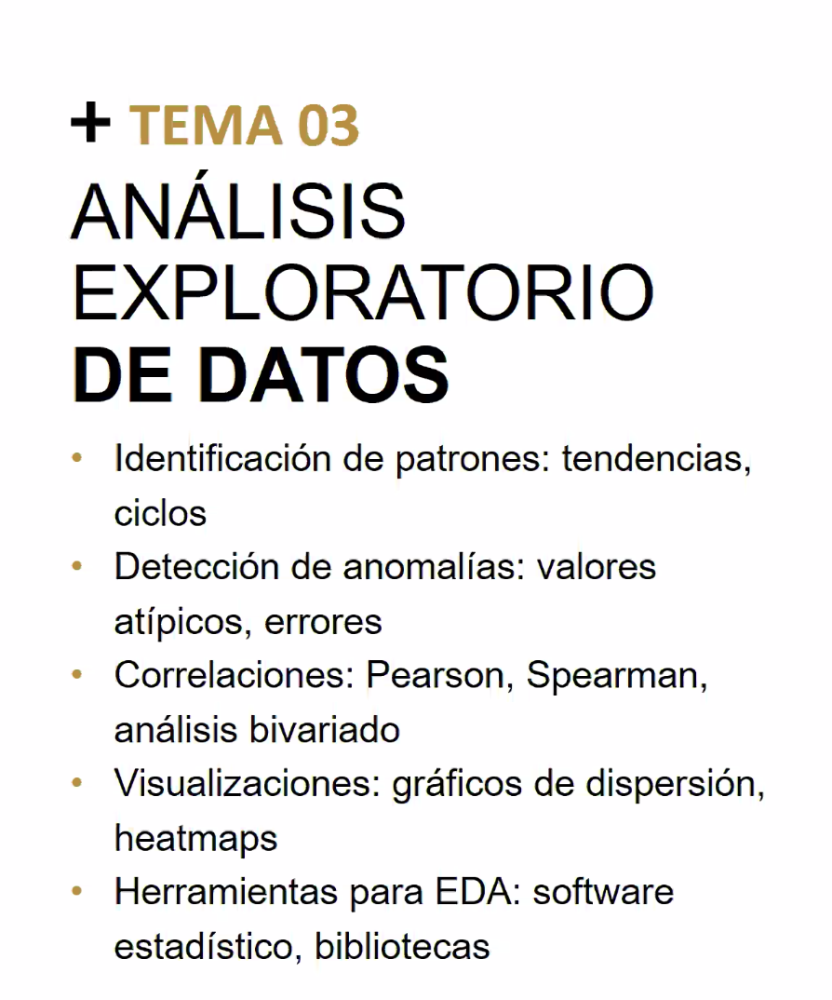

# Análisis Exploratorio de Datos — EDA (Clase 4)

**Curso:** Análisis Estadístico y Data Mining (ISIL, 2026-1)  
**Docente:** Omar David Visitación Romero  
**Fecha:** 30/04/2026

---

## 1. Introducción al Análisis Exploratorio de Datos (EDA)

> **Objetivo central:** Ir más allá de la estadística descriptiva plana para descubrir el **comportamiento real** de los datos.

La estadística descriptiva tradicional solo muestra números agregados (promedios, desviaciones). El EDA va más profundo: busca identificar **patrones, tendencias, frecuencias y anomalías** que expliquen cómo se comportan realmente los datos.

### ¿Por qué Importa?

**Premisa fundamental:** Los datos no son azarosos. Son producto de actividades humanas con conductas específicas que pueden ser modeladas, predecidas e identificadas.

**Aplicaciones Prácticas:**

| Caso de Uso | Descripción | Impacto |
|---|---|---|
| **Detección de fraudes** | Identificar transacciones anómalas que desviarse del patrón normal | Prevenir pérdidas financieras |
| **Ciberseguridad** | Detectar intentos de hacking o accesos no autorizados | Proteger infraestructura |
| **Optimización de procesos** | Encontrar cuellos de botella y patrones de ineficiencia | Mejorar productividad |
| **Exfiltración de datos** | Identificar cuándo datos están siendo robados indebidamente | Seguridad de información |

### Conexión con Clases Anteriores

- **Clase 2 (Estadística Descriptiva):** Proporcionó las herramientas básicas (media, mediana, desviación estándar)
- **Clase 3 (Estadística Inferencial):** Mostró cómo generalizar desde muestras a poblaciones
- **Clase 4 (EDA):** Integra ambas para **explorar y comprender** los datos antes de modelar

---

## 2. Identificación de Patrones y Tendencias

Es común confundir estos dos conceptos. Aquí está la distinción clara:

### A. Tendencia (Trend)

**Definición:** La dirección persistente en la que se mueven los datos **a lo largo del tiempo**.

**Características:**
- Movimiento constante hacia arriba (alcista) o hacia abajo (bajista)
- Persiste incluso si hay fluctuaciones cortas
- Observable en periodos largos (años)

**Ejemplo Práctico: E-commerce**

```
Ventas mensuales de un negocio online:

Mes 1: $100
Mes 2: $105
Mes 3: $110
Mes 4: $115
Mes 5: $120
Mes 6: $125

Observación: Cada mes vende $5 más que el anterior.
Tendencia: ALCISTA CLARA (crecimiento de 25% en 6 meses)
```

**Utilidad para Decisiones:**
- Inversión en oro: si la tendencia es alcista, comprar
- Expansión empresarial: si la tendencia de ingresos es positiva, invertir en nuevas sucursales
- Planificación de recursos: anticipar necesidades futuras

---

### B. Patrones Cíclicos o Estacionales

**Definición:** Fluctuaciones que se **repiten en periodos específicos** de tiempo (horas, días, meses, estaciones).

**Características:**
- Repetición predecible
- Duración fija
- Causas identificables (clima, eventos, comportamiento humano)

**Ejemplos Prácticos:**

| Sector | Patrón Estacional | Período |
|---|---|---|
| **Servicios eléctricos** | Pico en verano (aire acondicionado), baja en invierno | Anual |
| **Educación** | Stock de librerías sube antes del año escolar | Anual (agosto-septiembre) |
| **Turismo** | Ocupación hotelera sube en vacaciones | Anual (verano, fiestas) |
| **Telecomunicaciones** | Mayor tráfico en horas pico (19:00-22:00) vs. madrugada | Diario |
| **E-commerce** | Picos en Black Friday, Navidad, Año Nuevo | Anual (específicos) |

**Concepto de Índice Estacional:**

Los datos se agrupan por parámetros de tiempo (meses, trimestres, horas) para encontrar repeticiones y calcular un índice que mida la intensidad del efecto estacional.

**Ejemplo Simple: Consumo de Energía por Mes**

```
Promedio mensual de consumo = 100 kWh

Enero (invierno frío): 150 kWh → 50% más (gente usa calefacción)
Julio (verano caluroso): 150 kWh → 50% más (gente usa aire acondicionado)
Abril (primavera): 80 kWh → 20% menos (clima templado)

Patrón: Siempre hay consumo alto en extremos de temperatura.
Uso: Preparar más electricidad en enero y julio.
```

---

## 3. Herramientas Matemáticas para el Análisis

### A. Regresión Lineal

**Qué es:** Un modelo matemático que traza una línea a través de puntos dispersos para capturar la tendencia general y permitir predicciones.

**Ecuación:**
$$\hat{y} = \beta_1 x + \beta_0$$

**Cuadro de Símbolos:**

| Símbolo | Nombre | Significado |
|---------|--------|-------------|
| **$\hat{y}$** | Y predicha | La respuesta calculada |
| **$\beta_1$** | Pendiente | Cuánto sube/baja por mes |
| **$\beta_0$** | Intercepto | Valor inicial |
| **$x$** | X independiente | El mes (1, 2, 3...) |

**Interpretación de la Pendiente $\beta_1$:**

```
Si β₁ > 0: Tendencia CRECIENTE (↑ sube)
Si β₁ < 0: Tendencia DECRECIENTE (↓ baja)
Si β₁ = 0: Datos planos (→ ni sube ni baja)
```

**Ejemplo Paso a Paso:**

```
Datos de ventas:
Mes 1: $10   Mes 2: $12   Mes 3: $14
Mes 4: $16   Mes 5: $18

🔍 Análisis: Cada mes sube exactamente $2

Fórmula encontrada: Ŷ = 2X + 8

Desglose:
- β₁ = 2 (cada mes suma $2)
- β₀ = 8 (comenzamos en mes 0 con $8)

📊 Predicciones:
Mes 6: Ŷ = 2(6) + 8 = 12 + 8 = $20
Mes 10: Ŷ = 2(10) + 8 = 20 + 8 = $28
Mes 12: Ŷ = 2(12) + 8 = 24 + 8 = $32

✓ Si continúa la tendencia: mes 12 = $32
```

### B. Suavizado de Datos

**Problema:** Cuando los datos están muy dispersos o "ruidosos", una línea recta no captura bien la realidad.

**Solución:** Usar curvas que se ajusten mejor:

- **Curva Exponencial:** Para datos que crecen aceleradamente
- **Curva Logarítmica:** Para datos que crecen pero cada vez más lentamente
- **Polinómica:** Para relaciones más complejas

**Ejemplo Visual:**

```
Datos reales (dispersos):
    *          *
  *   *      *   *
*       *  *       *

Regresión lineal: línea recta (pierde detalles)
Suavizado polinómico: curva que se ajusta mejor
```

### C. Promedio Móvil (Moving Average)

**Qué es:** Calcular el promedio dentro de una "ventana" de tiempo que se desplaza continuamente.

**Proceso simple:**

```
Datos originales de 6 días:
Día 1: 10
Día 2: 12
Día 3: 8
Día 4: 11
Día 5: 15
Día 6: 9

Promedio móvil de 3 días (ventana que avanza):
- Días 1-3: (10 + 12 + 8) / 3 = 10
- Días 2-4: (12 + 8 + 11) / 3 = 10.3
- Días 3-5: (8 + 11 + 15) / 3 = 11.3
- Días 4-6: (11 + 15 + 9) / 3 = 11.7

Ventaja: Los números suavizados (10, 10.3, 11.3, 11.7)
son más fáciles de leer que los originales (10, 12, 8, 11, 15, 9).
```

**Utilidad:**
- Elimina "ruido" de fluctuaciones momentáneas
- Muestra la dirección clara de la empresa
- Facilita toma de decisiones sin distracciones

### D. Modelo ARIMA

**Mención:** Técnica de matemáticas avanzadas que divide el análisis en **ventanas temporales** para generar modelos de tendencia en escenarios muy complejos.

> **Nota:** Se cubrirá en profundidad en clases posteriores. Por ahora, reconocer que existe como herramienta para series temporales altamente complejas.

---

## 4. Detección de Anomalías (Outliers)

**Definición:** Un **outlier** o anomalía es un valor atípico que se desvía significativamente del comportamiento normal de los datos y requiere investigación.

> **Importancia:** Las anomalías no son errores que se deben ignorar. A menudo, revelan actividades ilícitas, errores en sistemas o eventos excepcionales.

### Métodos de Detección

#### Método 1: Rango Intercuartílico (IQR)

**Conceptos básicos (Cuartiles):**

```
¿Qué es un cuartil?
Si ordenas datos de menor a mayor en 4 partes iguales:

Datos: 5, 8, 10, 12, 14, 16, 18, 20, 22, 25, 28, 30
         ↓                    ↓                    ↓
        Q1                   Q2                  Q3
       (25%)               (50%)               (75%)

IQR = Q3 - Q1 (rango entre cuartiles)
```

**Regla de Detección (Visual):**

```
Límite Inferior = Q1 - 1.5 × IQR
         ↓
    [DATOS NORMALES]
    Q1 | Q2 (mediana) | Q3
         ↑
Límite Superior = Q3 + 1.5 × IQR

Si algo cae FUERA → ⚠️ ANOMALÍA
```

**Ejemplo Paso a Paso: Detección de Fraude**

```
Transacciones del cliente (10 días):
$10, $12, $11, $13, $9, $14, $10, $12, $15, $11

Paso 1: Ordenar de menor a mayor
$9, $10, $10, $11, $11, $12, $12, $13, $14, $15

Paso 2: Encontrar cuartiles
Q1 (25%) = $10.5
Q3 (75%) = $13
IQR = $13 - $10.5 = $2.5

Paso 3: Calcular límites
Límite Inferior = $10.5 - (1.5 × $2.5) = $6.75
Límite Superior = $13 + (1.5 × $2.5) = $16.75

Paso 4: Verificar nueva transacción
Nueva: $500
¿Entre $6.75 y $16.75? NO
→ ⚠️ ANOMALÍA = Posible fraude
```

---

#### Método 2: Z-Score (Puntuación Z)

**Qué es:** Mide cuántas **desviaciones estándar** se aleja un punto de la media.

**Fórmula:**
$$Z = \frac{x - \mu}{\sigma}$$

**Cuadro de Símbolos:**

| Símbolo | Nombre | Significado |
|---------|--------|-------------|
| **Z** | Puntuación Z | Cuántas desviaciones alejadas |
| **x** | Valor observado | El dato a evaluar |
| **μ** | Media | Promedio de todos los datos |
| **σ** | Sigma | Dispersión (desviación estándar) |

**Escala de Interpretación:**

```
← Muy bajo      Normal      Muy alto →
    |___________|___________|
   Z=-3         Z=0        Z=+3
   ↑ Anomalía           Esperado
   
Regla: |Z| > 3 → ⚠️ ALERTA
```

**Ejemplo Paso a Paso: Calificaciones**

```
Notas de examen en clase:
Estudiantes: 60, 65, 70, 75, 80

Paso 1: Calcular media
μ = (60+65+70+75+80)/5 = 70

Paso 2: Calcular desviación estándar
σ ≈ 8 (mide qué tan dispersas son)

Paso 3: Evaluar estudiante con nota 88
Z = (88 - 70) / 8 = 18 / 8 = 2.25
Interpretación: 2.25 desviaciones ARRIBA
→ ✓ Excelente, pero posible

Paso 4: Evaluar estudiante con nota 150
Z = (150 - 70) / 8 = 80 / 8 = 10
Interpretación: 10 desviaciones ARRIBA
→ ⚠️ IMPOSIBLE (máx es 100)
→ ERROR EN LOS DATOS
```

### Comparación de Métodos

| Aspecto | IQR | Z-Score |
|---|---|---|
| **Sensibilidad** | Moderada | Alta a cambios extremos |
| **Robustez** | Resistente a extremos | Sensible a extremos |
| **Cuándo usar** | Datos muy sesgados | Datos aproximadamente normales |
| **Facilidad** | Fácil de calcular | Requiere media y desv. estándar |

---

## 5. Correlación de Datos

**Definición:** Mide el grado de **vinculación o asociación** entre dos variables.

> **Importante:** Correlación NO implica causalidad. Dos variables pueden estar correlacionadas sin que una cause la otra.

### Coeficiente de Correlación de Pearson (r)

**Rango:** Entre -1 y 1

**Interpretación:**

| Valor | Significado | Ejemplo |
|---|---|---|
| **r = +1** | Correlación positiva PERFECTA | Si X sube 1 unidad, Y sube proporcionalmente |
| **r = +0.7 a +0.9** | Correlación positiva FUERTE | Años de experiencia vs. salario |
| **r = +0.3 a +0.7** | Correlación positiva MODERADA | Edad vs. gastos en salud |
| **r ≈ 0** | NO hay relación | Color de zapatos vs. inteligencia |
| **r = -0.3 a -0.7** | Correlación negativa MODERADA | Precio vs. demanda de producto |
| **r = -0.7 a -0.9** | Correlación negativa FUERTE | Millas en auto vs. valor de reventa |
| **r = -1** | Correlación negativa PERFECTA | Si X sube, Y baja proporcionalmente |

**Fórmula:**
$$r = \frac{\sum (x_i - \bar{x})(y_i - \bar{y})}{\sqrt{\sum (x_i - \bar{x})^2 \sum (y_i - \bar{y})^2}}$$

**Cuadro Visual de Correlación:**

```
r = +1.0        r = +0.5        r = 0          r = -0.7
Perfecta        Media          Ninguna         Fuerte
positiva        positiva       relación        negativa

  ↗              ↗              /-/             ↘
 /              /               /-/              
/              /                /-/               
•              •                /-/                •

Si X sube   Si X sube     X y Y        Si X sube
Y sube      Y sube poco  no tienen     Y baja
SIEMPRE     a veces       relación    SIEMPRE
```

**Ejemplo Paso a Paso: Publicidad vs Ventas**

```
Datos de 5 meses:
┌──────┬────────────┬──────────┐
│ Mes  │Publicidad($)│ Ventas($)│
├──────┼────────────┼──────────┤
│  1   │    $10     │   $50    │
│  2   │    $20     │  $100    │
│  3   │    $30     │  $150    │
│  4   │    $40     │  $200    │
│  5   │    $50     │  $250    │
└──────┴────────────┴──────────┘

Patrón observado:
Publicidad × 2 = Ventas × 2
Publicidad × 3 = Ventas × 3

Conclusión: RELACIÓN PERFECTA

Correlación: r = +1.0

✓ Decisión: Publicidad efectiva.
Invertir más = más ventas GARANTIZADO.
```

---

### Correlación de Spearman

**Diferencia con Pearson:**
- Pearson mide **relación lineal**
- Spearman mide **relación monótona** (dirección consistente, no necesariamente línea recta)

**Cuándo usar Spearman:**
- Datos ordinales o rangos
- Relaciones no lineales
- Datos con outliers que distorsionan Pearson

**Ejemplo:**

```
Ranking de satisfacción del cliente (1-5) vs. Número de compras
No es lineal perfecta, pero monótona: clientes más satisfechos compran más.
Spearman captura esto mejor que Pearson.
```

---

## 6. Visualización y Herramientas de Software

> **Principio:** El análisis no sirve si no se comunica efectivamente a los decisores.

### Herramientas de Procesamiento

| Herramienta | Especialidad | Caso de Uso |
|---|---|---|
| **Python** | IA, ML, redes neuronales, automatización | Análisis complejos, modelos predictivos |
| **R** | Estadística, visualización, investigación | Reportes estadísticos, análisis exploratorio |
| **Excel** | Análisis básico, tablas, gráficos simples | Empresa pequeña, cálculos rápidos |
| **SQL** | Consultas de bases de datos | Extracción y transformación de datos |

### Herramientas de Visualización (Dashboards)

| Herramienta | Fortaleza | Público |
|---|---|---|
| **Power BI** | Integración con Microsoft, precio accesible | Empresas medianas |
| **Tableau** | Potencia visual, interactividad | Empresas grandes, consultores |
| **MicroStrategy** | Escalabilidad, datos históricos | Corporativos |

**Visualizaciones Clave:**
- **Mapas de calor:** Mostrar intensidad de datos en matriz
- **Gráficos de dispersión:** Visualizar correlación entre 2 variables
- **Gráficos de línea:** Tendencias temporales
- **Histogramas:** Distribuciones de frecuencia
- **Box plots:** Visualizar cuartiles y outliers

**Ejemplo de Dashboard Ejecutivo:**

```
┌─────────────────────────────────────────────────────┐
│ DASHBOARD DE VENTAS - ÚLTIMO TRIMESTRE              │
├─────────────────────────────────────────────────────┤
│ [KPI: +15% YoY]  [TENDENCIA: Alcista]  [FORECAST: $2.5M] │
├─────────────────────────────────────────────────────┤
│ Gráfico línea: Ventas por mes (12 meses)            │
│ Gráfico barras: Rendimiento por región              │
│ Tabla: Top 10 productos                             │
│ Mapa de calor: Estacionalidad por mes               │
└─────────────────────────────────────────────────────┘
```

---

## 7. Próximas Pasos: Aplicación Práctica con Python

> **Nota importante para la próxima clase:**

Se comenzará a utilizar **Python** para aplicar todos estos conceptos en ejercicios prácticos:

- Cargar datos desde archivos CSV
- Calcular estadísticos (media, desviación, cuartiles)
- Detectar outliers con IQR y Z-score
- Calcular correlaciones
- Crear visualizaciones con matplotlib/seaborn
- Ajustar modelos de regresión
- Identificar tendencias y patrones

**Librerías de Python a usar:**
- **pandas:** Manipulación de datos
- **numpy:** Operaciones numéricas
- **scipy:** Estadística avanzada
- **matplotlib / seaborn:** Visualización
- **scikit-learn:** Modelos de ML y estadística

---

## 8. Resumen: Checklist de EDA

Antes de modelar datos, verifica que hayas explorado:

- [ ] **Tendencias:** ¿Los datos suben, bajan o se mantienen constantes?
- [ ] **Estacionalidad:** ¿Hay ciclos recurrentes (diarios, mensuales, anuales)?
- [ ] **Outliers:** ¿Existen valores anómalos? ¿Son errores o hechos válidos?
- [ ] **Distribución:** ¿Cómo se distribuyen los datos? ¿Sesgados?
- [ ] **Correlaciones:** ¿Qué variables están relacionadas?
- [ ] **Valores faltantes:** ¿Hay datos incompletos? ¿Cuántos?
- [ ] **Calidad de datos:** ¿Son precisos? ¿De fuentes confiables?
- [ ] **Visualización:** ¿He creado gráficos que muestren patrones claramente?

---

## 9. Recordatorio Rápido: Fórmulas y Cuándo Usarlas

### Cheat Sheet de Fórmulas (Hoja de Trucos)

#### 1️⃣ Regresión Lineal

**Fórmula:**
$$\hat{y} = \beta_1 x + \beta_0$$

**Cuándo usarla:**
- Cuando quieres **predecir** un valor basado en un patrón
- Cuando necesitas saber si hay **tendencia clara**

**Pasos simples:**
```
1. Identifica: ¿Qué quiero predecir? (Y)
2. Identifica: ¿Con qué lo predigo? (X)
3. Busca el patrón: ¿Cuánto sube Y por cada X?
4. Aplica: Ŷ = (cambio por X) × X + (valor inicial)
5. Predice: Reemplaza X con el valor futuro
```

**Ejemplo Real:**
```
Ventas suben $2 cada mes, comenzando en $8.
¿Cuánto en mes 10?

Ŷ = 2(10) + 8 = $28

Uso: Presupuestar $28 para mes 10.
```

---

#### 2️⃣ Rango Intercuartílico (IQR)

**Fórmula:**
```
Límite Inferior = Q1 - 1.5 × IQR
Límite Superior = Q3 + 1.5 × IQR
```

**Cuándo usarla:**
- Cuando quieres **detectar fraudes**
- Cuando quieres **identificar datos anómalos**
- Datos con **valores extremos**

**Pasos simples:**
```
1. Ordena los datos de menor a mayor
2. Encuentra Q1 (25%) y Q3 (75%)
3. Calcula IQR = Q3 - Q1
4. Calcula los límites
5. Cualquier dato FUERA = ANOMALÍA
```

**Ejemplo Real:**
```
Transacciones normales: $10-$15
IQR detecta: $500 es imposible
→ Bloquear y investigar

Uso: Sistema automático de seguridad bancaria.
```

---

#### 3️⃣ Z-Score

**Fórmula:**
$$Z = \frac{x - \mu}{\sigma}$$

**Cuándo usarla:**
- Cuando quieres **comparar datos en diferentes escalas**
- Cuando quieres **saber cuán diferente es un valor**
- Datos **aproximadamente normales**

**Pasos simples:**
```
1. Calcula el promedio (μ)
2. Calcula cuán dispersos están (σ)
3. Resta el promedio al valor (x - μ)
4. Divide por la dispersión: Z = resultado / σ
5. Si |Z| > 3 = ANOMALÍA
```

**Ejemplo Real:**
```
Examen: promedio 70, dispersión 8
Estudiante sacó 88:
Z = (88-70)/8 = 2.25 → Excelente ✓

Estudiante sacó 150:
Z = (150-70)/8 = 10 → ¡IMPOSIBLE! ⚠️
→ Error en el sistema
```

---

#### 4️⃣ Promedio Móvil

**Fórmula:**
$$\text{Promedio Móvil} = \frac{x_1 + x_2 + ... + x_n}{n}$$

**Cuándo usarla:**
- Cuando quieres **suavizar datos ruidosos**
- Cuando quieres **ver tendencias sin ruido**
- Series de tiempo **con fluctuaciones**

**Pasos simples:**
```
1. Define una ventana (ej. últimos 3 días)
2. Suma los valores en la ventana
3. Divide por la cantidad de valores
4. Desplaza la ventana un periodo
5. Repite
```

**Ejemplo Real:**
```
Ventas: 10, 12, 8, 11, 15, 9

Promedio móvil 3 días:
(10+12+8)/3 = 10
(12+8+11)/3 = 10.3
(8+11+15)/3 = 11.3

Uso: Ver si ventas suben sin distracciones.
```

---

#### 5️⃣ Correlación de Pearson

**Fórmula:**
$$r = \frac{\sum (x_i - \bar{x})(y_i - \bar{y})}{\sqrt{\sum (x_i - \bar{x})^2 \sum (y_i - \bar{y})^2}}$$

**Cuándo usarla:**
- Cuando quieres **saber si dos cosas están relacionadas**
- Cuando necesitas **identificar variables que se mueven juntas**

**Pasos simples (versión rápida):**
```
1. Calcula: ¿Cuándo X sube, Y también sube?
2. Resultado entre -1 y +1
3. Cerca de +1 = relación positiva fuerte
4. Cerca de -1 = relación negativa fuerte
5. Cerca de 0 = sin relación
```

**Ejemplo Real:**
```
Publicidad: $10, $20, $30, $40, $50
Ventas:    $50, $100, $150, $200, $250

Patrón: Siempre Publicidad × 5 = Ventas
r = +1.0 (PERFECTA)

Uso: "Invertir más en publicidad garantiza más ventas"
```

---

### Tabla Comparativa: Cuál Usar Cuándo

| Problema | Fórmula | Por qué |
|----------|---------|--------|
| **¿Cuánto venderé el próximo mes?** | Regresión Lineal | Predice basado en patrón |
| **¿Esta transacción es fraude?** | IQR o Z-Score | Detecta valores anómalos |
| **¿Los datos suben o bajan?** | Regresión o Promedio Móvil | Identifica tendencia |
| **¿X causa Y?** | Correlación | Mide relación entre variables |
| **¿Está este estudiante fuera de lo normal?** | Z-Score | Compara con promedio |
| **¿Suavizo datos ruidosos?** | Promedio Móvil | Elimina fluctuaciones |

---

### Fórmulas Complementarias (Cálculos intermedios)

Estas fórmulas no son independientes pero son **pasos clave** en los métodos principales:

#### IQR (Rango Intercuartílico)

**Fórmula:**
```
IQR = Q3 - Q1
```

**Cuadro de Símbolos:**

| Símbolo | Significado |
|---------|-------------|
| **IQR** | Rango intercuartílico (distancia entre cuartiles) |
| **Q3** | Tercer cuartil (75% de los datos) |
| **Q1** | Primer cuartil (25% de los datos) |

**Uso en límites de detección:**
```
Límite Inferior = Q1 - 1.5 × IQR
Límite Superior = Q3 + 1.5 × IQR

Cualquier dato FUERA = ANOMALÍA
```

**Cuándo usarla:**
- Calcular rango normal de datos
- Establecer límites para detectar fraude
- Identificar valores extremos

---

#### Porcentaje de Cambio

**Fórmula:**
```
% Cambio = ((Valor Final - Valor Inicial) / Valor Inicial) × 100
```

**Cuadro de Símbolos:**

| Símbolo | Significado |
|---------|-------------|
| **Valor Final** | El número al final del período |
| **Valor Inicial** | El número al inicio del período |
| **× 100** | Convierte a porcentaje |

**Ejemplo:**
```
Ventas enero: $100
Ventas junio: $125

% Cambio = ((125 - 100) / 100) × 100 = 25%
Interpretación: Ventas crecieron 25% en 6 meses
```

---

## 10. Glosario Rápido de Símbolos Matemáticos

**Para no perderse en las fórmulas, aquí están todos los símbolos que usamos:**

| Símbolo | Nombre | Qué significa | Dónde lo vimos |
|---------|--------|---------------|----------------|
| **$\hat{y}$** | Y predicha | Valor calculado por la fórmula | Regresión lineal |
| **$\beta_1$** | Beta uno (pendiente) | Cuánto sube/baja cada vez | Regresión lineal |
| **$\beta_0$** | Beta cero (intercepto) | Punto de inicio de la línea | Regresión lineal |
| **$x$** | X | Variable independiente (el mes) | Regresión lineal |
| **$\mu$** | Mu (media) | Promedio de todos los datos | Z-Score |
| **$\sigma$** | Sigma (desv. est.) | Mide qué tan dispersos están los datos | Z-Score |
| **$Z$** | Puntuación Z | Cuántas desviaciones alejadas de la media | Z-Score |
| **Q1** | Primer cuartil | El 25% de los datos está debajo | IQR |
| **Q3** | Tercer cuartil | El 75% de los datos está debajo | IQR |
| **IQR** | Rango intercuartílico | La diferencia entre Q3 y Q1 | IQR |
| **$r$** | Coeficiente de correlación | Mide relación entre dos variables | Correlación |
| **$\bar{x}$** | X barra | Promedio de X | Fórmula de correlación |
| **$\bar{y}$** | Y barra | Promedio de Y | Fórmula de correlación |

**Regla de Oro:**

```
Cuando veas una fórmula complicada:
1. Identifica cada símbolo en la tabla
2. Lee qué significa cada uno
3. Observa un ejemplo paso a paso
4. La fórmula es solo "código" para hacer cálculos

¡No es magia, es proceso!
```

---

## 10. Referencia Visual



*Fuente: Presentación clase 4 — Materiales del curso*

---

## 11. Recursos Complementarios

- 📊 **Presentación (PDF):** [40097-S04-PRESENTACION.pdf](./40097-S04-PRESENTACION.pdf)
- 📑 **Presentación original (PPTX):** 40097-S04-PRESENTACION.pptx

---

*Última actualización: 30/04/2026 | Clase 4: Análisis Exploratorio de Datos (EDA)*
