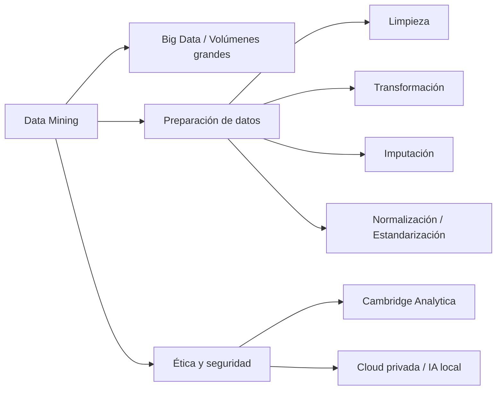
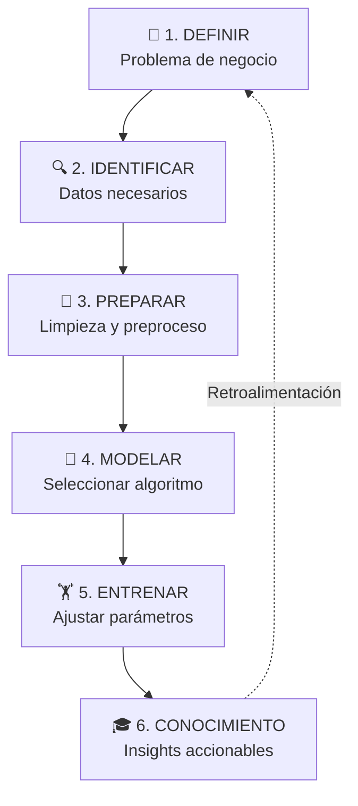

# Minería de Datos: Conceptos, Aplicaciones y Ética (Clase 5)

**Curso:** Análisis Estadístico y Data Mining (ISIL, 2026-1)  
**Docente:** Omar David Visitación Romero  
**Fecha:** 07/05/2026

---

## Introducción

La **minería de datos (data mining)** es el proceso analítico de explorar grandes volúmenes de información para descubrir patrones significativos, relaciones ocultas y tendencias útiles que pueden convertirse en conocimiento accionable.

**Regla clave:** La minería de datos no solo describe lo que ocurrió, sino que explica por qué sucedió e incluso predice lo que podría acontecer.

---

## Resumen de la clase

### 1. Introducción a la Minería de Datos (Data Mining)

- **Concepto:** Explotar y analizar grandes volúmenes de datos en bruto para descubrir patrones, comportamientos o tendencias ocultas que permitan tomar decisiones estratégicas informadas.
- **Aplicación:** Se utiliza en medicina, finanzas, comercio electrónico, marketing industrial y otros sectores.
- **Técnicas mencionadas:** regresiones, clusterización, machine learning y deep learning.
- **Volumen de datos:** Data Mining se justifica principalmente en contextos de **Big Data**. Para conjuntos pequeños (100 a 2,000 registros), muchas veces basta con aplicar estadística tradicional básica.

### 2. Aspectos Éticos y Seguridad de la Data

- **Datos sensibles:** Datos personales como DNI, fechas de nacimiento o vencimientos exigen medidas de seguridad corporativa estrictas.
- **Caso Cambridge Analytica (2018):** Se usaron datos de millones de usuarios de Facebook sin consentimiento explícito. Con técnicas de Data Mining sobre likes y clics se construyeron perfiles psicológicos para campañas comerciales y políticas ultradirigidas.
- **Seguridad en IA:** El profesor advirtió sobre el grave riesgo de subir datos corporativos o sensibles a herramientas de IA externas mediante prompts públicos, ya que no se garantiza el destino ni la protección adecuada de la información.
- **Mitigación:** En grandes empresas, especialmente en el sector financiero, se recomienda usar infraestructura en la nube privada (Azure, AWS) y descargar modelos destilados o personalizados para ejecutarlos localmente bajo control interno.

### 3. Preparación y Limpieza de los Datos (Data Cleansing)

- Es la fase inicial indispensable antes de entrenar modelos de IA o aplicar Data Mining.
- Trabajar con datos sucios genera ruido, sesgos y malas decisiones empresariales.
- **Componentes de la limpieza:** identificación de errores, detección de outliers y eliminación de duplicados.
- **Ejemplo práctico:** Si una consulta SQL `SELECT COUNT(*) FROM alumno` arroja 7 registros pero hay alumnos repetidos, el analista debe limpiar para quedarse con el valor real (ej. 5 registros únicos).

### 4. Transformación y Codificación de Variables

- **Variables cualitativas:** No son numéricas, como género o nivel de satisfacción.
- **Variables nominales:** Sin orden natural, por ejemplo minorista, mayorista, corporativo. Se recomienda codificación dummy con `1` o `0`.
- **Variables ordinales:** Con orden natural, por ejemplo bajo, medio, alto. Se codifican numéricamente respetando la jerarquía (1, 2, 3).
- **Ejemplo de limpieza de texto:** Si la columna "género" contiene "masculino", "Masculino" o "MASCULINO", se unifica el formato antes de codificar, por ejemplo a `01`.

### 5. Escalado y Normalización de Variables Numéricas

- Es clave cuando las variables tienen magnitudes muy distintas que pueden sesgar los modelos.

#### Min-Max Scaler

**Qué es:** Reescala una variable para que todos sus valores queden dentro de un rango, normalmente entre `0` y `1`.

**Para qué sirve:** Ayuda cuando una variable tiene valores mucho más grandes que otra y podría dominar el modelo solo por su escala.

**Fórmula:**

$X_{norm} = \frac{X - X_{min}}{X_{max} - X_{min}}$

**Cuadro de símbolos**

| Símbolo | Nombre | Significado |
| ------- | ------ | ----------- |
| **X<sub>norm</sub>** | Valor normalizado | Resultado final, llevado al rango `0-1` |
| **X** | Valor original | Dato que se quiere transformar |
| **X<sub>min</sub>** | Valor mínimo | Menor valor observado en la variable |
| **X<sub>max</sub>** | Valor máximo | Mayor valor observado en la variable |

**Ejemplo paso a paso**

Supongamos que las ventas mensuales de una tienda van desde **5,000** hasta **20,000**. Queremos normalizar un mes con ventas de **12,500**.

1. Identificamos los valores:
   - $X = 12{,}500$
   - $X_{min} = 5{,}000$
   - $X_{max} = 20{,}000$
2. Reemplazamos en la fórmula:

   $X_{norm} = \frac{12{,}500 - 5{,}000}{20{,}000 - 5{,}000}$

3. Resolvemos numerador y denominador:

   $X_{norm} = \frac{7{,}500}{15{,}000}$

4. Calculamos el resultado:

   $X_{norm} = 0.5$

**Resultado:** Ese mes queda justo en la mitad de la escala. En otras palabras, su nivel de ventas está al **50%** entre el mínimo y el máximo observados.

**Idea clave:** Min-Max Scaler es útil cuando quieres comparar variables en una misma escala visual o matemática.

#### Z-Score

**Qué es:** Mide cuántas desviaciones estándar se aleja un valor respecto de la media.

**Para qué sirve:** Sirve para detectar valores inusuales y comparar datos aunque estén en escalas distintas.

**Fórmula:**

$Z = \frac{X - \mu}{\sigma}$

**Cuadro de símbolos**

| Símbolo | Nombre | Significado |
| ------- | ------ | ----------- |
| **Z** | Z-Score | Resultado final de la estandarización |
| **X** | Valor observado | Dato que se quiere evaluar |
| **μ** | Media | Promedio de la variable |
| **σ** | Desviación estándar | Medida de dispersión de los datos |

**Interpretación rápida**

- **$Z = 0$**: el valor está exactamente en el promedio.
- **$Z > 0$**: el valor está por encima del promedio.
- **$Z < 0$**: el valor está por debajo del promedio.

**Ejemplo paso a paso**

Supongamos que una empresa tiene:

- media de ventas: **10,000**
- desviación estándar: **2,000**
- ventas del mes evaluado: **14,000**

1. Identificamos los valores:
   - $X = 14{,}000$
   - $\mu = 10{,}000$
   - $\sigma = 2{,}000$
2. Reemplazamos en la fórmula:

   $Z = \frac{14{,}000 - 10{,}000}{2{,}000}$

3. Resolvemos la resta:

   $Z = \frac{4{,}000}{2{,}000}$

4. Calculamos el resultado:

   $Z = 2$

**Resultado:** Ese mes está **2 desviaciones estándar por encima de la media**. Es un valor alto y puede indicar un comportamiento atípico superior.

> **Regla práctica:** Si el valor de Z es muy alto o muy bajo, conviene revisarlo porque podría ser un outlier o un caso especial del negocio.

### 6. Tratamiento de Datos Faltantes (Imputación)

- Los valores nulos o vacíos no deben asumirse automáticamente como `0`.
- Se deben excluir o corregir mediante imputación lógica.
- **Eliminación:** Borrar filas o columnas cuando la pérdida de datos sea mínima. Si una columna tiene más del 30-70% de datos faltantes, puede ser recomendable eliminarla.
- **Imputación por media/mediana:** Para variables numéricas.
  - Ejemplo: ingresos de 3,004, 1,500 y 5,000. Si falta un cuarto registro, la media aproximada es 4,165.
- **Imputación por moda:** Para variables categóricas.
  - Ejemplo: si en la columna canal de compras `Online` aparece 2 veces y `Tienda` 1 vez, se imputa `Online`.
- **Imputación por grupo:** Aplicar promedio por segmentos, por ejemplo un promedio para alumnos, otro para docentes y otro para administrativos.

### 7. Estandarización de Formatos de Fuentes Diversas

- Cuando los datos vienen de múltiples sistemas, es obligatorio definir un diccionario y un estándar único.
- **Fechas:** Unificar formatos como `DD/MM/AAAA` y `MM/AAAA`.
- **Monedas:** Convertir todo a una moneda estándar, por ejemplo soles, usando el tipo de cambio vigente.
- **Separadores de miles:** Corregir sistemas que usan comas, puntos o espacios vacíos.

### 8. Laboratorio Práctico (Python en Google Colab)

- Al final de la sesión se inició un ejercicio en Google Colab con hardware remoto (aprox. 12 GB de RAM).
- Se revisaron primeros pasos de programación en Python para analítica.
- Se utilizó `print()` para mostrar texto y resultados en pantalla.
- Se importaron librerías clave como `numpy` (`np`) y `matplotlib.pyplot` (`plt`).
- Se explicó que `numpy` permite manipular vectores y matrices numéricas de forma eficiente.
- Se mostró cómo calcular el promedio con `np.mean(ventas)` sobre un array `ventas`.

### Diagrama de conceptos clave



---

## 1. Definición y Objetivos

### Qué es la minería de datos

Es un proceso que integra:
- **Estadística** — análisis descriptivo e inferencial
- **Aprendizaje automático** — algoritmos que aprenden de datos
- **Modelado predictivo** — construcción de modelos que generalizan
- **Sistemas de bases de datos** — gestión de información a escala

### Por qué importa

Según Han, Pei y Kamber (2022), la minería de datos forma parte esencial del proceso KDD (Knowledge Discovery in Databases), constituyendo su etapa más analítica.

**Valor empresarial:**
- Mejora decisiones basadas en evidencia
- Optimiza procesos operativos
- Comprende mejor el comportamiento de clientes
- Reduce incertidumbre operativa

### Rol estratégico

La minería de datos es crítica en industrias con grandes volúmenes de datos:

| Sector | Aplicación | Beneficio |
|---|---|---|
| **E-commerce** | Recomendaciones de productos | Incrementa ventas cruzadas |
| **Banca** | Prevención de fraude | Reduce riesgos financieros |
| **Salud** | Diagnóstico predictivo | Detección temprana de enfermedades |
| **Redes sociales** | Tendencias emergentes | Estrategia de contenido informada |
| **Telecomunicaciones** | Retención de clientes | Reduce churn (abandono) |

### Fases de la minería de datos

**El Proceso KDD (Knowledge Discovery in Databases): 6 fases hacia el conocimiento**



**Explicación de cada fase:**

| Fase | Qué ocurre | Entradas | Salidas |
|---|---|---|---|
| **1. Definir** | Clarificar el problema y objetivo | Pregunta del negocio | Alcance definido |
| **2. Identificar** | Localizar fuentes de datos | Repositorios disponibles | Datos seleccionados |
| **3. Preparar** | Limpiar y transformar datos | Datos brutos | Datos listos |
| **4. Modelar** | Elegir técnica (árbol, regresión, cluster) | Datos limpios | Modelo entrenado |
| **5. Entrenar** | Ajustar y validar | Parámetros | Modelo optimizado |
| **6. Conocimiento** | Extraer y comunicar insights | Resultados | Decisiones |

| Objetivo | Descripción | Ejemplo |
|---|---|---|
| **Identificación de patrones** | Detectar comportamientos repetitivos | Clientes que compran juntos productos específicos |
| **Segmentación de grupos** | Agrupar por características comunes | Clientes "premium", "ocasionales", "riesgosos" |
| **Detección de anomalías** | Encontrar eventos inusuales | Fraude, fallas técnicas, casos médicos críticos |
| **Predicción** | Estimar valores futuros | Ventas, demanda, riesgo crediticio |

### Caso práctico

Una cadena de supermercados registra millones de transacciones mensuales. Usando minería de datos:

1. **Descubrimiento:** Los clientes que compran pañales también adquieren toallitas húmedas y snacks
2. **Técnica:** Reglas de asociación (Apriori)
3. **Acción:** Reorganizar productos, diseñar promociones complementarias
4. **Resultado:** Incremento en ventas cruzadas

---

## 2. Aplicaciones por Sector

### Comercio

#### 2.1 Análisis de comportamiento del cliente
**Qué:** Identifica patrones de compra, frecuencia, ticket promedio y preferencias

**Cómo:** Análisis de transacciones históricas

**Importancia:** Personalizar ofertas, mejorar experiencia del cliente

#### 2.2 Reglas de asociación (Market Basket Analysis)
**Qué:** Detecta productos que se compran juntos ("quien compra X también compra Y")

**Algoritmo:** Apriori

**Aplicación:** Diseño de promociones, reubicación de productos, combos

**Ejemplo:**
- 72% de clientes que compran cereales también compran leche
- → Promocionar juntos, ubicar juntos

#### 2.3 Predicción de demanda y ventas
**Qué:** Modelos predictivos estiman productos con mayor venta

**Variables consideradas:** Estacionalidad, tendencias, promociones

**Impacto:**
- Evita quiebres de stock
- Reduce sobreinventarios
- Optimiza logística

#### 2.4 Segmentación de clientes (Clustering)
**Qué:** Agrupa clientes por similitudes (gasto, frecuencia, intereses, ubicación)

**Aplicación práctica:** Ofrecer promociones personalizadas según cada grupo

**Ejemplo de clusters:**
- **Cluster 1:** "Alta frecuencia" — compran múltiples veces/mes
- **Cluster 2:** "Por campaña" — solo en promociones
- **Cluster 3:** "Premium" — alto gasto, bajo volumen

**Estrategia:** Ofertas y comunicación personalizadas por cluster

#### 2.5 Pruebas A/B (Análisis Comparativo)
**Qué:** Comparar dos versiones de un anuncio, página web o estrategia para determinar cuál es más efectiva

**Cómo funciona:** 
- Versión A (control) vs. Versión B (experimental)
- Se mide: tasa de conversión, click-through rate, tiempo promedio
- Análisis estadístico para determinar significancia

**Aplicación:** Optimizar campañas de marketing, diseño de sitios web, mensajería comercial

**Importancia:** Decisiones basadas en datos, no en intuición

---

### Finanzas y Riesgo

#### 2.6 Rentabilidad Esperada
**Qué:** Estimación del retorno de inversión basada en datos históricos

**Aplicación:** Si invierto $100,000, ¿cuál será mi ganancia anual?

**Cálculo:** Análisis de series históricas, volatilidad, tendencias

**Riesgo asociado:** No todos los activos con mismo retorno tienen igual riesgo

#### 2.7 Volatilidad
**Qué:** Medición de la variabilidad o dispersión de rendimientos en el tiempo

**Interpretación:**
- **Volatilidad alta** = Rentabilidad impredecible, riesgo mayor
- **Volatilidad baja** = Rentabilidad más estable

**Uso en decisiones:** Inversores usan volatilidad para elegir portafolios acordes a su tolerancia de riesgo

#### 2.8 Análisis de Riesgo Crediticio
**Qué:** Evaluación de probabilidad de que un cliente pague un crédito o préstamo

**Factores analizados:**
- Ingresos y fuentes de empleo
- Historial crediticio previo
- Deudas actuales
- Patrimonio disponible
- Edad y estabilidad laboral

**Técnica:** Modelado predictivo (clasificación)

**Impacto:** Determinar si aprobar crédito, montos, tasas de interés

#### 2.9 Método de Montecarlo (Simulación de Escenarios)
**Qué:** Técnica que simula miles o millones de escenarios posibles para estimar el riesgo de una inversión

**Aplicación en finanzas:**
- Simulación de posibles retrasos en flujo de caja
- Escenarios de impagos parciales o totales
- Refinanciamientos forzados
- Cambios en tasas de interés

**Utilidad:** Proporciona rango de resultados (mejor caso, peor caso, caso medio) con probabilidades

**Caso práctico:**
```
Un banco quiere otorgar crédito de $500,000 por 5 años.
Montecarlo simula 10,000 escenarios:
  → 8,500 escenarios: cliente paga completo
  → 1,200 escenarios: retrasos de 3-6 meses
  → 300 escenarios: impago total

Conclusión: 97% de probabilidad de recuperación → Se aprueba crédito
```

---

### Salud Pública y Epidemiología

#### 2.10 Estadística Epidemiológica
**Qué:** Análisis de distribución y patrones de enfermedades en poblaciones

**Métricas clave:**
- **Incidencia:** Número de casos nuevos en un período
- **Prevalencia:** Número total de casos en un momento
- **Tasa de mortalidad:** Muertes por enfermedad respecto a población total

**Aplicación:** Detectar brotes, alertar a autoridades de salud, asignar recursos

**Ejemplo:** Si incidencia de COVID-19 aumenta 300% en una región en 2 semanas → Alerta de rebrote

#### 2.11 Pruebas de Hipótesis en Salud Pública
**Qué:** Determinar si cambios en datos son significativos o casuales

**Aplicación crítica:** ¿Es lineal o exponencial el crecimiento de contagios?
- **Crecimiento lineal** = + N casos por día (controlable)
- **Crecimiento exponencial** = + N% de casos por día (alarmante)

**Implicación:** Declara o no una emergencia sanitaria según el patrón

**Herramienta:** Pruebas estadísticas (t-test, regresión, análisis de varianza) para validar tendencias

#### 2.12 Predicción y Anomalías Médicas
**Qué:** Identificar pacientes en riesgo o enfermedades en etapas tempranas

**Aplicación:** Análisis de historias clínicas electrónicas, resultados de exámenes, síntomas

**Impacto:** Intervención preventiva, diagnósticos tempranos, mejora de resultados de salud

---

### Redes Sociales

#### 2.9 Análisis de sentimientos
**Qué:** Evalúa si comentarios/publicaciones son positivos, negativos o neutros

**Técnica:** Minería de texto + modelos de lenguaje

**Utilidad:**
- Monitorear reputación
- Medir satisfacción
- Gestionar crisis

#### 2.10 Detección de tendencias y temas relevantes
**Qué:** Identifica temas que se vuelven virales o crecientes

**Basado en:** Hashtags, frecuencia de publicaciones, usuarios influyentes

**Aplicación:** Crear contenido alineado a tendencias

#### 2.11 Recomendación de contenido
**Qué:** Sistemas (TikTok, Instagram) muestran contenido relevante

**Análisis:** Interacciones, tiempos de visualización, preferencias

**Beneficio:** Aumenta permanencia y personalización

#### 2.12 Segmentación de audiencias
**Qué:** Agrupa usuarios por intereses, hábitos, ubicación, consumo digital

**Uso:** Campañas publicitarias dirigidas

**Impacto:** Mayor rentabilidad en marketing digital

**Caso práctico:**
- Una empresa analiza 50,000 comentarios sobre su servicio
- Análisis de sentimientos: críticas negativas = problemas de tiempo de entrega
- Acción: Ajusta logística para mejorar tiempos
- Resultado: Reducción de quejas en semanas posteriores

---

## 3. Tipos de Minería de Datos

### 3.1 Clasificación

**Definición:** Asignar elementos a categorías previamente definidas usando modelos entrenados.

**Característica:** Proceso supervisado (aprende de ejemplos etiquetados)

**Algoritmos:**
- Árboles de decisión
- Redes neuronales
- Máquinas de soporte vectorial (SVM)
- k-Nearest Neighbors (k-NN)

**Aplicaciones:**
- Aprobación de créditos en banca
- Detección de fraude en transacciones
- Clasificación de clientes por riesgo
- Diagnóstico de enfermedades

**Ejemplo práctico:**
Un banco utiliza clasificación para determinar si un solicitante de tarjeta es:
- **"Riesgo alto"** → Denegar o requiere garantía adicional
- **"Riesgo bajo"** → Aprobar

El modelo analiza: ingresos, historial crediticio, deudas, comportamiento financiero previo

---

### 3.2 Clustering (Agrupamiento)

**Definición:** Agrupa elementos automáticamente según similitud, sin categorías predefinidas.

**Característica:** Proceso no supervisado (descubre estructuras ocultas)

**Algoritmos:**
- k-Means
- DBSCAN
- Agrupamiento jerárquico

**Aplicaciones:**
- Segmentación de clientes en marketing
- Agrupamiento de pacientes por síntomas o evolución
- Identificación de patrones en redes sociales
- Detección de regiones geográficas con problemas comunes

**Ejemplo práctico:**
Una empresa de moda agrupa clientes en 3 clusters:

| Cluster | Comportamiento | Estrategia |
|---|---|---|
| **Compradores frecuentes** | Compran múltiples veces/mes | Descuentos por lealtad |
| **Compradores por campaña** | Solo en promociones | Alertas de ofertas especiales |
| **Compradores ocasionales** | Raramente activos | Reenganche, nostalgia |

---

### 3.3 Asociación

**Definición:** Identifica relaciones o reglas que muestran cómo ciertos eventos/productos están vinculados.

**Patrón:** "Si ocurre A, es probable que ocurra B"

**Algoritmo clave:** Apriori (busca conjuntos frecuentes de ítems)

**Aplicaciones:**
- Market basket analysis (análisis de canastas)
- Diseño de promociones y combos
- Análisis de secuencias en navegación web
- Identificación de relaciones entre síntomas y medicamentos

**Métricas clave:**
- **Soporte:** ¿Con qué frecuencia aparecen juntos A y B?
- **Confianza:** Si ocurre A, ¿qué probabilidad hay de que ocurra B?
- **Lift:** ¿Qué tan más probable es que B ocurra dado A?

**Ejemplo práctico:**
Un supermercado descubre:
- **Regla:** "Si cliente compra cereales → compra leche"
- **Soporte:** 35% de todas las transacciones
- **Confianza:** 72% de quienes compran cereales compran leche
- **Acción:** Promoción cruzada, ubicación estratégica

---

### 3.4 Predicción

**Definición:** Estima valores futuros o desconocidos a partir de patrones históricos.

**Diferencia con clasificación:** El resultado es un valor numérico, no una categoría

**Métodos:** Regresión, series temporales, machine learning avanzado

**Aplicaciones:**
- Pronóstico de ventas y demanda
- Predicción de precios en mercados financieros
- Estimación de probabilidad de impago
- Predicción de flujo de pacientes en hospitales

**Ejemplo práctico:**
Una empresa de transporte utiliza predicción para estimar demanda semanal de envíos:

**Variables consideradas:**
- Estacionalidad (compras por fechas especiales)
- Feriados y días festivos
- Condiciones climáticas
- Ventas históricas

**Resultado:** Optimizar asignación de vehículos y personal

---

## 4. Ética en Minería de Datos

### 4.1 Privacidad de datos

**Definición:** Protección de información personal de individuos

**Implica:**
- Garantizar que datos no se usen sin autorización
- Mantener datos en condiciones de seguridad
- Aplicar anonimización, encriptación, control de accesos

**Importancia:**
- Evita uso indebido de datos personales
- Protege información delicada (salud, finanzas, hábitos)
- Alinea con normativas: Ley Peruana de Protección de Datos, GDPR (Europa), CCPA (USA)
- Genera confianza en clientes y usuarios

---

### 4.2 Uso responsable de datos

**Definición:** Emplear datos de manera transparente, ética y alineada con objetivos legítimos

**Supone:**
- Evitar decisiones automatizadas que perjudiquen a personas/grupos
- Garantizar que modelos no reproduzcan sesgos o discriminación
- Transparencia en recopilación y uso

### Principios clave del uso responsable

| Principio | Descripción |
|---|---|
| **Transparencia** | Informar qué datos se recopilan y con qué finalidad |
| **Consentimiento** | Obtener autorización para procesar datos sensibles |
| **Minimización** | Recolectar solo datos estrictamente necesarios |
| **Imparcialidad algorítmica** | Evitar que modelos generen decisiones sesgadas |
| **Responsabilidad corporativa** | La institución es responsable de resultados del análisis |

### Buenas prácticas

✅ Implementar protocolos de ciberseguridad
✅ Aplicar técnicas de anonimización o pseudonimización
✅ Realizar auditorías de modelos para evitar sesgos
✅ Documentar procesos de recopilación y análisis
✅ Capacitar al personal en ética y protección de datos

---

### 4.3 Riesgos éticos

| Riesgo | Descripción | Impacto |
|---|---|---|
| **Discriminación algorítmica** | Modelos que clasifican de manera injusta | Exclusión sistemática de grupos |
| **Vigilancia excesiva** | Recopilación masiva sin consentimiento | Invasión de privacidad |
| **Filtración de datos** | Acceso no autorizado por fallas de seguridad | Exposición de información sensible |
| **Uso secundario no consentido** | Datos para objetivo A, usados para objetivo B | Violación de confianza |

**Ejemplo:** Una app de salud recopila datos para monitorear actividad física, pero una aseguradora intenta usarla para segmentar pólizas. Esto es uso no autorizado y violación ética.

---

### 4.4 Caso: Cambridge Analytica - Facebook (2018)

**El escándalo que cambió la privacidad global**

#### Qué sucedió
- Cambridge Analytica obtuvo acceso a datos de **87 millones de usuarios** de Facebook sin consentimiento explícito
- Una app llamada "This Is Your Digital Life" explotó brecha en políticas de Facebook
- Recopilaba datos no solo del usuario, sino de **todos sus contactos**

#### Cómo se usó
- Cambridge Analytica construyó **perfiles psicológicos** detallados
- Identificó rasgos de personalidad, preferencias políticas, hábitos de consumo
- Diseñó campañas de publicidad **ultradirigida y manipuladora**
- Influenció votantes en **elecciones 2016 (USA)** y **Brexit (UK)**

#### Consecuencias
- **Multa:** Facebook pagó $5,000 millones de dólares a la FTC
- **Audiencia:** Mark Zuckerberg tuvo que declarar ante Congreso de USA
- **Confianza:** Ola global de desconfianza hacia plataformas digitales
- **Regulación:** Aceleró creación de leyes más estrictas (GDPR reforzado)

#### Lecciones éticas clave

| Lección | Implicación |
|---|---|
| **Consentimiento engañoso** | Usuarios no informados correctamente sobre uso real de datos |
| **Uso indebido de información sensible** | Datos psicológicos usados para manipulación política |
| **Falta de transparencia** | Ni Facebook ni Cambridge Analytica explicaron recopilación y uso |
| **Impacto social masivo** | Ética de datos afecta a sociedades completas |
| **Necesidad de regulación** | Plataformas tecnológicas requieren controles estrictos |

---

## 5. Desafíos de la Minería de Datos

### 5.1 Sesgos (Bias) en los Datos

**Definición:** Distorsión sistemática en los datos que produce resultados incorrectos o injustos

**Tipos de sesgo:**

| Tipo | Descripción | Ejemplo |
|---|---|---|
| **Sesgo de muestra** | Muestra no representativa de la población | Encuestar solo a estudiantes universitarios para hablar de "todos los jóvenes" |
| **Sesgo de selección** | Se eligen datos de manera no aleatoria | Recopilar datos solo de clientes satisfechos, excluyendo insatisfechos |
| **Sesgo de falta de respuesta** | Algunos grupos no responden encuestas | Trabajadores de tiempo completo menos probables de responder encuestas largas |
| **Sesgo temporal** | Datos de un período no representan otros | Encuesta de gasto navideño no aplica a otras épocas del año |

**Impacto:**
- Conclusiones erróneas
- Decisiones injustas o discriminatorias
- Pérdida de confianza en análisis

**Solución:** 
✅ Muestreo aleatorio estratificado
✅ Recopilar datos de múltiples grupos
✅ Documentar limitaciones de datos
✅ Validación con expertos del dominio

---

### 5.2 Datos Incompletos: Estrategias de Manejo

**Definición:** Registros con valores faltantes (NA, NULL, vacíos)

**Causas comunes:**
- Fallos en sistemas de captura
- Respondentes omiten campos en encuestas
- Datos no disponibles en ciertos períodos
- Errores de integración de bases de datos

#### Estrategia 1: Eliminación
**Cuándo usar:** Cuando el porcentaje de datos faltantes es muy bajo (< 5%)

```python
# Python: Eliminar filas con NA
datos_completos = datos.dropna()

# O eliminar solo si falta en columna específica
datos_limpios = datos.dropna(subset=['ingreso'])
```

**Ventaja:** No introduce sesgos
**Desventaja:** Reduce tamaño de muestra

---

#### Estrategia 2: Imputación Simple
**Cuándo usar:** Para datos numéricos sin valores extremos significativos

**Opción A - Media:**
```python
datos['ingreso'].fillna(datos['ingreso'].mean(), inplace=True)
```

**Opción B - Mediana:**
```python
datos['ingreso'].fillna(datos['ingreso'].median(), inplace=True)
```

**Opción C - Moda (categorías):**
```python
moda = datos['categoria'].mode()[0]
datos['categoria'].fillna(moda, inplace=True)
```

**Ventaja:** Mantiene tamaño de muestra
**Desventaja:** Puede subestimar variabilidad

---

#### Estrategia 3: Imputación Avanzada (Machine Learning)
**Cuándo usar:** Cuando existe relación entre variables

**Método KNN (k-Nearest Neighbors):**
```python
from sklearn.impute import KNNImputer
imputer = KNNImputer(n_neighbors=5)
datos_imputados = imputer.fit_transform(datos)
```

**Método Regresión:**
```python
from sklearn.linear_model import LinearRegression
# Predecir valores faltantes usando otras variables
modelo = LinearRegression()
modelo.fit(X_train, y_train)
predicciones = modelo.predict(X_faltantes)
```

**Ventaja:** Utiliza información de otras variables
**Desventaja:** Más complejo, requiere conocimiento de relaciones

**Recomendación:** Documentar qué estrategia se usó para reproducibilidad

---

### 5.3 Sobreajuste (Overfitting)

**Definición:** Un modelo aprende de memoria los datos de entrenamiento pero falla al recibir datos nuevos y reales

**Analogía:** 
Un estudiante que memoriza respuestas exactas de exámenes pasados pero fracasa cuando se le hace una pregunta ligeramente diferente

**Cómo ocurre:**
```
Datos de entrenamiento: 100 ejemplos
Modelo tiene 50 parámetros

→ Modelo se ajusta DEMASIADO a las peculiaridades de esos 100 ejemplos
→ Cuando llegan 50 ejemplos nuevos (datos reales), funciona mal

Analogía: Ajustar una ecuación polinómica de grado 100 a solo 10 puntos
```

#### Detección de sobreajuste

| Métrica | Sobreajuste | Bien ajustado |
|---|---|---|
| **Error en entrenamiento** | Muy bajo (0.01) | Bajo (0.05) |
| **Error en prueba** | Muy alto (0.40) | Similar a entrenamiento (0.06) |
| **Brecha error** | Grande (0.39) | Pequeña (0.01) |

#### Soluciones para evitar sobreajuste

**1. Usar más datos de entrenamiento**
```
10 ejemplos + modelo complejo = Alto riesgo
1,000,000 ejemplos + modelo complejo = Bajo riesgo
```

**2. Usar validación cruzada (k-fold validation)**
```python
from sklearn.model_selection import cross_val_score
scores = cross_val_score(modelo, X, y, cv=5)
# Evalúa en 5 subconjuntos diferentes
```

**3. Regularización**
```python
from sklearn.linear_model import Ridge
modelo = Ridge(alpha=1.0)  # Penaliza parámetros grandes
```

**4. Simplificar el modelo**
```
Cambiar: Polinomio grado 10
Por: Polinomio grado 2
```

**5. Early stopping (para redes neuronales)**
```
Detener entrenamiento cuando error de prueba empiece a aumentar
```

---

### 5.4 Escalabilidad: Volumen y Velocidad (Ampliado)

**Definición:** Capacidad de un sistema para procesar cantidades crecientes de datos sin perder velocidad ni precisión

**Contexto empresarial real:**
- Banco procesa 10 millones de transacciones/día
- Red social maneja 500 millones de posts/día
- Plataforma de streaming registra miles de eventos/segundo

**Problema:** Algoritmos tradicionales no escalan

```
Algoritmo X en laptop:
  100 registros → 1 segundo
  1,000,000 registros → 10 horas (INVIABLE)

Algoritmo escalable:
  1,000,000 registros → 1 minuto (distribuido)
```

#### Soluciones tecnológicas

**Apache Hadoop:** 
- Almacenamiento distribuido (HDFS)
- Procesamiento MapReduce
- Ideal para datos históricos masivos

**Apache Spark:**
- 100x más rápido que Hadoop (procesa en memoria)
- Ideal para ML iterativo, análisis en tiempo real
- Usado en: Netflix, Uber, Yahoo

---

### 5.5 Calidad de Datos: Veracidad y Consistencia (Ampliado)

**Regla de oro (Pyle, 2020):**
> "80% del tiempo de un analista se dedica a limpiar y preparar datos porque ningún algoritmo puede corregir un mal conjunto de datos"

**Problemas principales:**

| Problema | Descripción | Impacto | Solución |
|---|---|---|---|
| **Valores faltantes** | Información incompleta | Sesgo si se elimina, imprecisión si se imputa | Imputación inteligente |
| **Errores de registro** | Datos mal ingresados | Conclusiones falsas | Validación en entrada |
| **Duplicados** | Mismo elemento múltiples veces | Sobreponderación artificial | Deduplicación |
| **Inconsistencia** | Formatos diferentes | Integración fallida | Estandarización |
| **Sesgo en datos** | Información que induce conclusiones erróneas | Discriminación sistemática | Análisis de sesgo |

**Impacto ético directo:**
- Modelos defectuosos = Decisiones injustas o discriminatorias
- Predicciones incorrectas = Pérdida financiera o de confianza
- Reproducción de sesgos = Discriminación contra grupos

**Checklist de calidad:**
```
☑ ¿Los datos representan la población?
☑ ¿Hay valores fuera de rango lógico?
☑ ¿Las fechas son consistentes (formatos)?
☑ ¿Se han detectado y manejado valores faltantes?
☑ ¿Se documentó el proceso de limpieza?
☑ ¿Se validaron con expertos del dominio?
```

---

## 6. Configuración del Entorno de Programación en Python

### 6.1 Conceptos Fundamentales

#### Intérprete vs. Compilador

**Compilador:**
- Traduce **todo el código** a un archivo ejecutable (.exe) ANTES de ejecutar
- Detecta errores antes de la ejecución
- Ejemplos: C, C++, Java

**Intérprete (Python):**
- Traduce y ejecuta el código **línea por línea**
- Los errores se detectan durante la ejecución
- Más flexible, más lento
- Mejor para prototipado y análisis

```python
# Python es interpretado
print("Hola")           # Se ejecuta inmediatamente
print(undefined_var)    # Error aquí, durante ejecución
```

#### IDE (Entorno de Desarrollo Integrado)

**Qué es:** Software donde escribes código y que se conecta a un intérprete

**IDE recomendado:** Visual Studio Code (VS Code)
- Ligero, multiplataforma
- Excelente integración con Python
- Requiere instalar extensión Python de Microsoft

**Otros IDEs:**
- PyCharm (profesional, más pesado)
- Jupyter Notebooks (para análisis interactivo)
- Anaconda (distribución que incluye todo)

---

### 6.2 Variables y Tipado Dinámico

**Características de Python:**

Python detecta automáticamente el tipo de dato sin necesidad de declaración explícita:

```python
hola = 30                    # Python entiende que es int
print(type(hola))            # <class 'int'>

hola = "texto"               # Python cambia el tipo
print(type(hola))            # <class 'str'>

numero = 3.14                # float
print(type(numero))          # <class 'float'>

es_verdad = True             # bool
print(type(es_verdad))       # <class 'bool'>
```

**Comparación con otros lenguajes:**
```java
// Java requiere declaración explícita
int edad = 25;
String nombre = "Juan";
double salario = 2500.50;
```

```python
# Python es flexible
edad = 25
nombre = "Juan"
salario = 2500.50
```

---

### 6.3 Instalación de Librerías Esenciales

**Herramienta:** `pip` (Package Installer for Python)

#### Comando base
```bash
pip install [nombre-libreria]
```

#### Librerías fundamentales para análisis de datos

**1. Pandas**
```bash
pip install pandas
```

**Qué hace:** Maneja *datasets* (tablas de filas y columnas, similares a Excel)

```python
import pandas as pd

# Cargar datos desde CSV
datos = pd.read_csv('ventas.csv')

# Ver primeras filas
print(datos.head())

# Estadísticas básicas
print(datos.describe())

# Seleccionar columna
print(datos['producto'])
```

**Usocases:**
- Limpieza de datos
- Transformaciones
- Análisis exploratorio
- Integración de múltiples fuentes

---

**2. NumPy**
```bash
pip install numpy
```

**Qué hace:** Cálculos con arreglos y matrices multidimensionales, muy rápido (optimizado en C)

```python
import numpy as np

# Crear arreglo
vector = np.array([1, 2, 3, 4, 5])
print(vector)                    # [1 2 3 4 5]

# Operaciones
print(vector * 2)                # [2  4  6  8 10]
print(np.mean(vector))           # 3.0
print(np.std(vector))            # 1.58...

# Matrices
matriz = np.array([[1, 2], [3, 4]])
print(matriz.shape)              # (2, 2)
```

**Usocases:**
- Cálculos algebraicos y estadísticos
- Transformaciones lineales
- Operaciones de propósito general

**Ventaja sobre Python puro:** 10-100x más rápido

---

**3. Matplotlib**
```bash
pip install matplotlib
```

**Qué hace:** Crea gráficos y visualizaciones de datos

```python
import matplotlib.pyplot as plt

# Datos
meses = ['Ene', 'Feb', 'Mar', 'Abr', 'May']
ventas = [1000, 1500, 1200, 1800, 2000]

# Crear gráfico
plt.plot(meses, ventas, marker='o')
plt.title('Ventas Mensuales')
plt.xlabel('Mes')
plt.ylabel('Ventas (S/)')
plt.grid(True)
plt.show()

# Gráfico de barras
plt.bar(meses, ventas)
plt.title('Ventas por Mes')
plt.show()
```

**Tipos de gráficos:**
- Líneas (tendencias temporales)
- Barras (comparativas)
- Histogramas (distribuciones)
- Scatter (correlaciones)
- Boxplots (detección de outliers)

---

### 6.4 Instalación Completa (Recomendada)

**Opción A: Individual**
```bash
pip install pandas numpy matplotlib scikit-learn
```

**Opción B: Usando Anaconda** (incluye todo)
```bash
# Descargar de anaconda.com
# Anaconda incluye: Python, Pandas, NumPy, Matplotlib, Jupyter, etc.
# Recomendado para principiantes
```

**Verificar instalación:**
```python
import pandas as pd
import numpy as np
import matplotlib.pyplot as plt
print("Todo instalado correctamente!")
```

---

### 6.5 Herramientas Complementarias

#### Librerías para Machine Learning

**scikit-learn:**
```bash
pip install scikit-learn
```

Implementa: clasificación, clustering, regresión, detección de anomalías

```python
from sklearn.cluster import KMeans
from sklearn.preprocessing import StandardScaler

# Ejemplo de clustering
kmeans = KMeans(n_clusters=3)
clusters = kmeans.fit_predict(datos)
```

**TensorFlow / Keras:**
```bash
pip install tensorflow
```

Para redes neuronales y deep learning

---

### 6.6 Frameworks Distribuidos

| Framework | Características | Cuándo usar |
|---|---|---|
| **Apache Hadoop** | MapReduce, almacenamiento HDFS | Procesamiento batch de datos históricos masivos |
| **Apache Spark** | 100x más rápido, procesa en memoria | ML iterativo, análisis en tiempo real, streaming |

**Spark con Python:**
```bash
pip install pyspark
```

```python
from pyspark.sql import SparkSession

spark = SparkSession.builder.appName("MiApp").getOrCreate()
datos = spark.read.csv("datos.csv", header=True)
datos.show()
```

---

### 6.7 Plataformas Gráficas (sin programación)

| Plataforma | Características | Cuándo usar |
|---|---|---|
| **RapidMiner** | Interfaz "arrastrar y soltar", algoritmos pre-construidos | Usuarios sin experiencia en código |
| **KNIME** | Flujos visuales, integra limpieza + ML + reportes | Procesos complejos, automatización |

---

### 6.8 Herramientas de Visualización Interactiva

| Herramienta | Características | Caso de uso |
|---|---|---|
| **Tableau** | Gráficos interactivos muy avanzados, maneja millones de filas | Business Intelligence, dashboards ejecutivos |
| **Power BI** | Integración con ecosistema Microsoft (Excel, Azure), reportes automatizados | Inteligencia empresarial en organizaciones Microsoft |

---

## 7. Tendencias Futuras: IA y Deep Learning

### 7.1 Deep Learning

**Qué es:** Rama del machine learning usando redes neuronales profundas (múltiples capas)

**Aplicación actual:** Obtener máxima precisión en predicciones complejas

**Ejemplos de éxito:**
- **Predicción de bolsa de valores:** Redes LSTM capturan patrones temporales complejos
- **Reconocimiento de imágenes médicas:** CNN (Convolutional Neural Networks) detectan tumores
- **Procesamiento de lenguaje natural:** Transformers (GPT, BERT) generan texto coherente

**Ventaja sobre ML tradicional:**
- Aprende representaciones internas de datos
- Excelente para datos de alta dimensionalidad
- Escalable a volúmenes masivos

**Desventaja:**
- Requiere muchos datos de entrenamiento (millones)
- Alto costo computacional
- Menos interpretable ("caja negra")

---

### 7.2 Seguridad y Confidencialidad de Datos

**Realidad empresarial:** Las organizaciones grandes evitan subir datos sensibles a IAs abiertas

**Razones:**
- **Riesgo de filtraciones:** ChatGPT, Claude guardan datos en servidores públicos
- **Regulación:** GDPR, CCPA, Ley Peruana de Protección de Datos
- **Competencia:** Información estratégica no puede exponerse

**Solución:** Desarrollar modelos propios bajo control interno

```
❌ Subir datos a ChatGPT
    → Riesgo: Datos filtrados, acceso competidores

✅ Entrenar modelo privado en servidor propio
    → Seguro: Datos bajo control total
    → Cumple regulaciones
```

**Herramientas para privacidad:**
- **Encriptación end-to-end**
- **Federated Learning:** Entrenar modelos sin centralizar datos
- **Differential Privacy:** Agregar ruido matemático para proteger privacidad individual
- **Auditoría de modelos:** Verificar que no reproduzcan sesgos discriminatorios

---

### 7.3 Concepto Clave: La Información es el Activo Más Valioso

> **"La información es el activo más valioso de cualquier corporación hoy en día"**

**Por qué:**

| Perspectiva | Razón |
|---|---|
| **Financiera** | Datos sobre clientes = predicción de ingresos futuros |
| **Competitiva** | Información = ventaja estratégica, primero en detectar tendencias |
| **Innovación** | Datos mejor que competidores = mejores productos |
| **Riesgo** | Datos mal gestionados = pérdida de confianza, multas, quiebra |

**Ejemplos:**
- Netflix: Sus datos de visualización valen más que sus películas
- Amazon: Datos de compra permiten predicciones de demanda exactas
- Tesla: Datos de conducción de millones de autos = mejores modelos de autonomía
- Facebook/Meta: Datos de usuarios = modelos publicitarios ultra-precisos (y problema ético)

**Implicación estratégica:**
Compañías no compiten solo en productos, sino en **calidad de datos y capacidad analítica**

---

## Conclusiones Integradas

1. **Minería de datos transforma datos en decisiones estratégicas**
   - Aplicaciones reales en finanzas, salud, marketing, redes sociales
   - ROI tangible: incrementa ingresos, reduce riesgos, mejora eficiencia

2. **Configuración correcta del entorno es fundamental**
   - Python + Pandas + NumPy + Matplotlib son la base
   - Escalabilidad requiere Spark, Hadoop u otra infraestructura distribuida
   - Documentar proceso es tan importante como ejecutarlo

3. **Los desafíos son tan técnicos como éticos**
   - Sesgos, datos incompletos, sobreajuste requieren mitigación deliberada
   - Calidad de datos determina calidad de decisiones
   - Privacy by design es no-negociable en era moderna

4. **Deep Learning y IA generativa son tendencias, pero requieren cuidado**
   - Máxima precisión tiene costo: datos masivos, recursos computacionales, riesgo de privacidad
   - Seguridad de datos no es opcional
   - Información es activo estratégico

5. **El futuro requiere profesionales multilingües**
   - Combinación: programación (Python) + estadística + ética + negocio
   - Capacidad de explicar a stakeholders no técnicos
   - Conciencia de impacto social de decisiones basadas en datos

---

## Bibliografía

Fernández-Avilés, G., & Montero, J. M. (2024). *Fundamentos de ciencia de datos con R*. McGraw-Hill Interamericana de España.

García Herrero, J., Berlanga de Jesús, A., Guisado, M. A., & Padilla, W. R. (2020). *Ciencia de datos, minería de datos y big data: técnicas analíticas y aprendizaje estadístico. Un enfoque práctico*. Alfaomega / Altaria Editorial.

Han, J., Pei, J., & Kamber, M. (2022). *Data mining: Concepts and techniques* (4th ed.). Morgan Kaufmann.

Larose, D. T., & Larose, C. D. (2021). *Data mining and predictive analytics* (2nd ed.). John Wiley & Sons.

Pyle, D. (2020). *Data preparation for machine learning*. O'Reilly Media.
