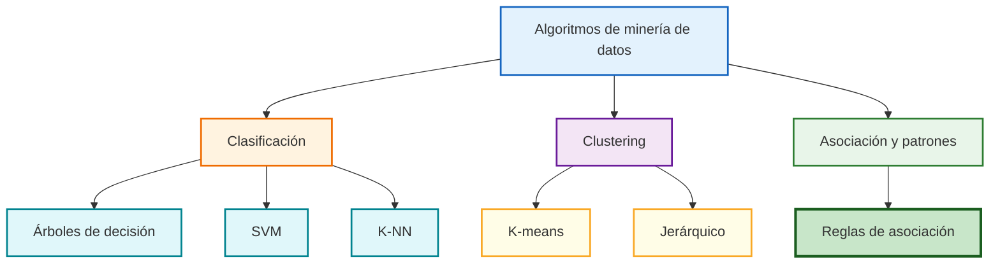

# Algoritmos de Minería de Datos (Clase 7)

**Curso:** Análisis Estadístico y Data Mining (ISIL, 2026-1)  
**Docente:** Omar David Visitación Romero  
**Fecha:** [pendiente]

---

## Introducción

La minería de datos permite extraer patrones, tendencias y relaciones ocultas en grandes volúmenes de información. Sus algoritmos transforman datos dispersos en conocimiento accionable para:

- **Segmentación de clientes**
- **Predicción de comportamientos de compra**
- **Detección de fraudes**
- **Análisis de riesgo**
- **Mejora de procesos operativos**

## Mapa visual de algoritmos de minería

La utilidad del gráfico es clasificar rápido qué algoritmos resuelven problemas supervisados, no supervisados y de descubrimiento de patrones.

---

## Clasificación: Árboles de Decisión, SVM, K-NN

### ¿Qué es clasificación?

Es una técnica supervisada que asigna una categoría o etiqueta a un nuevo registro, basándose en patrones observados en datos históricos.

### Proceso de un modelo de clasificación

| Fase | Descripción |
|------|-------------|
| **1. Definición del problema y variables** | Identifica qué se quiere predecir y con qué información |
| **2. División del conjunto de datos** | Separa datos en entrenamiento y prueba |
| **3. Entrenamiento del modelo** | El modelo aprende patrones |
| **4. Validación y evaluación** | Se miden métricas como precisión y recall |
| **5. Implementación y uso práctico** | El modelo se aplica a casos nuevos |

### Ejemplo práctico: Predicción de morosidad

**Problema:** Predecir si un cliente caerá en mora en los próximos 3 meses.

**Variable objetivo:** Mora (Sí/No)

**Variables predictoras (features):**
- Ingresos mensuales
- Historial de pagos
- Nivel de endeudamiento
- Antigüedad del cliente
- Número de créditos activos

**Beneficio:** Priorizar acciones preventivas y estrategias de cobranza.

### División del conjunto de datos

**Proporciones comunes:**
- 70% entrenamiento – 30% prueba
- 80% entrenamiento – 20% prueba
- 75% entrenamiento – 25% prueba

**En problemas desbalanceados** (ej.: 95% pagan, 5% morosos), usar **estratificación** para mantener proporción de clases en ambos conjuntos, evitando que el modelo aprenda solo de la clase mayoritaria.

---

## Clustering Básicos: K-means, Jerárquico

### Definición

Técnica no supervisada que agrupa registros similares sin etiqueta previa. Útil para segmentación sin categorías predefinidas.

### Aplicaciones

- **Retail:** Segmentar clientes por comportamiento de compra
- **Telecom:** Identificar patrones de uso de servicios
- **Marketing:** Crear campañas por afinidad de grupos

### K-means

- Agrupa datos en K clusters iterativamente
- Minimiza distancia intra-cluster
- Rápido, escalable

### Clustering Jerárquico

- Crea árbol de clusters (dendrograma)
- Permite ver relaciones anidadas entre grupos
- Más interpretable

---

## Reglas de Asociación: Apriori, FP-Growth

### ¿Qué son?

Encuentran patrones frecuentes y relaciones entre variables: "Si ocurre X, entonces probable Y".

### Ejemplo: Análisis de canasta de compra

**Regla:** Si cliente compra pan y mantequilla → 80% de probabilidad de compra leche.

**Métricas:**
- **Soporte:** % de transacciones con la regla
- **Confianza:** % de veces que se cumple Y cuando ocurre X
- **Lift:** Correlación real vs. independencia

### Aplicaciones

- **E-commerce:** Recomendaciones de productos
- **Retail físico:** Colocación de productos en tienda
- **Farmacia:** Detección de patrones de medicamentos

---

## Evaluación de Resultados: Métricas Clave

### Precisión (Precision)

$$\text{Precisión} = \frac{\text{Verdaderos Positivos}}{\text{Verdaderos Positivos + Falsos Positivos}}$$

**Uso:** Cuando es costoso un falso positivo (ej.: spam)

### Recall (Sensibilidad)

$$\text{Recall} = \frac{\text{Verdaderos Positivos}}{\text{Verdaderos Positivos + Falsos Negativos}}$$

**Uso:** Cuando es crítico encontrar todos los casos positivos (ej.: fraude)

### Silhouette Score (Clustering)

Mide cohesión intra-cluster y separación entre clusters. Rango: -1 a 1.
- **Cercano a 1:** Clusters bien definidos
- **Cercano a -1:** Clusters superpuestos

---

## Ejemplo Integrado: Banco Retail

### Caso: Modelo de riesgo crediticio

**Objetivo:** Aprobar/rechazar solicitudes de crédito automáticamente.

**Algoritmo:** Árbol de decisión

**Variables:**
- Ingresos
- Historial crediticio
- Tiempo de empleo
- Deuda existente

**División:** 80% entrenamiento, 20% prueba, estratificado.

**Resultado:** Precisión 92%, Recall 87%

**Decisión:** Validar manuales los casos grises.

---

## Conceptos Avanzados de Clasificación y Clustering

### SVM (Máquinas de Vectores de Soporte)
- **Concepto:** Encuentra el hiperplano óptimo (línea o frontera) que maximiza el margen de separación entre distintas clases.
- **Kernel Trick:** Permite clasificar datos que no son linealmente separables proyectándolos a dimensiones superiores.
- **Ejemplo Práctico:** Diagnóstico médico por imágenes (identificar tumores benignos vs. malignos basándose en bordes y texturas).

### K-NN (K-Nearest Neighbors)
- **Concepto:** Clasifica una nueva muestra según el voto de la mayoría de sus "K" vecinos más cercanos en el espacio de características.
- **Métrica de Distancia:** Frecuentemente usa distancia Euclidiana o Manhattan.
- **Ejemplo Práctico:** Sistemas de recomendación básicos (si a 5 usuarios similares a ti les gustó un curso, te lo recomienda).

### Árboles de Decisión (Detalles)
- **Criterios de División:** Utiliza entropía (Information Gain) o el índice Gini para decidir cómo dividir los nodos.
- **Riesgo:** Alta propensión al sobreajuste (overfitting) si no se realiza "poda" (pruning).

---

## Más Ejemplos Prácticos de Minería de Datos

### Caso: Predicción de Fuga de Clientes (Churn) en Telecom
**Problema:** Identificar clientes con alta probabilidad de cancelar el servicio de internet.
**Modelo:** Árbol de decisión combinado con KNN.
**Variables predictoras:** Meses de antigüedad, cantidad de reclamos técnicos en el último trimestre, variaciones en facturación.
**Resultado esperado:** Campaña de retención proactiva ofreciendo descuentos solo al 15% de clientes con riesgo alto (ahorro masivo frente a dar descuentos a todos).

---

## Glosario de Términos

- **Clustering Jerárquico:** Método de agrupación que no requiere saber "K" de antemano; construye una estructura de árbol (dendrograma). Puede ser aglomerativo (bottom-up) o divisivo (top-down).
- **Entrenamiento (Training):** Proceso por el cual un algoritmo de machine learning ajusta sus parámetros internos a partir de datos históricos.
- **Overfitting (Sobreajuste):** Ocurre cuando el modelo memoriza el ruido de los datos de entrenamiento y pierde la capacidad de generalizar con datos nuevos.
- **Hiperplano:** Límite de decisión en un espacio N-dimensional (utilizado fundamentalmente en SVM).
- **Kernel:** Función matemática usada en algoritmos como SVM para transformar datos de manera que sean linealmente separables.
- **Pruning (Poda):** Técnica para reducir el tamaño de los árboles de decisión eliminando secciones que proveen poco poder predictivo.
