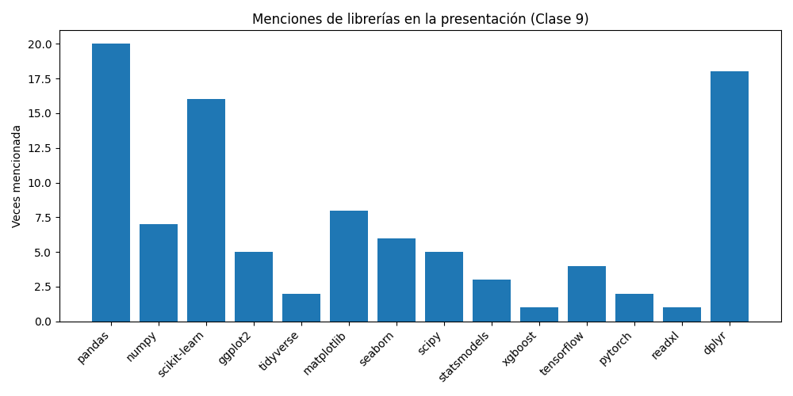
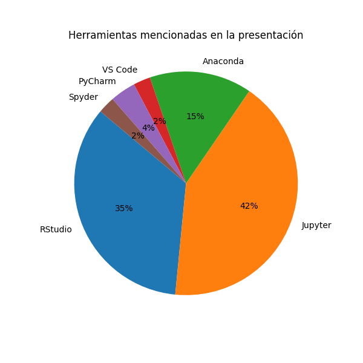

# Instalación y entornos (R y Python) — Clase 9

**Resumen ejecutivo**

Esta sesión explica cómo preparar un entorno local para análisis de datos con R y Python: instalación, IDEs, librerías clave, gestión de dependencias, requisitos de hardware/software y buenas prácticas para entornos reproducibles.

**Puntos clave**

- Instalación recomendada: R desde CRAN + RStudio; Python preferiblemente vía Anaconda/Miniconda (Python 3.9+).
- Entornos reproducibles: `renv` o `packrat` (R); `conda` o `venv` (Python).
- IDEs y herramientas: RStudio, Jupyter Notebook / JupyterLab, VS Code, PyCharm.
- Librerías esenciales: `pandas`, `numpy`, `scikit-learn`, `matplotlib`, `seaborn`, `plotly`, `scipy`, `statsmodels` (Python); `tidyverse`, `dplyr`, `ggplot2`, `readxl`, `shiny`, `caret` (R).
- Configuración común: compatibilidad Excel/CSV, conectores de bases de datos (`RMySQL`, `pyodbc`).
- Buenas prácticas: aislar dependencias por proyecto, documentar versiones, usar control de versiones y automatizar reportes (RMarkdown / Jupyter).

**Preparación del entorno local**

- El entorno local incluye el software necesario para ejecutar R y Python sin depender de internet.
- Ventajas: practicar sin conexión, mayor control del entorno y mejor rendimiento/privacidad.
- También es importante considerar hardware y software según la escala de datos.

**Requisitos hardware/software (orientativo)**

- CPU: mínimo Intel i5 / Ryzen 5; recomendado i7 / Ryzen 7 para cálculos estadísticos grandes y training de modelos.
- RAM: mínimo 8 GB para análisis básicos; recomendado 16 GB o más para datasets grandes.
- Disco: SSD NVMe recomendado; 512 GB o más.
- GPU: no esencial para estadística básica; recomendable para deep learning con TensorFlow o PyTorch.

**Instalación de R y RStudio**

1. Descargar R desde CRAN: https://cran.r-project.org/
2. Instalar RStudio desde https://posit.co/download/rstudio-desktop/
3. Verificar que RStudio abra con una consola activa.

**Instalación de Python**

- Recomendado: Anaconda/Miniconda para facilitar la gestión de paquetes y entornos.
- Alternativas: Python puro desde https://www.python.org/ o IDEs como VS Code, Thonny.
- Tutoriales útiles: videos de instalación de R/RStudio y Python + VS Code.

**Comparación práctica: R vs Python**

- Instalación: R se instala desde CRAN y puede usar RStudio; Python se instala desde Python.org o Anaconda.
- Facilidad de inicio: RStudio es intuitivo para análisis estadístico; Jupyter permite trabajo interactivo en Python.
- Paquetes principales: R usa `tidyverse`, `dplyr`, `ggplot2`; Python usa `pandas`, `numpy`, `matplotlib`, `seaborn`, `scikit-learn`.
- Visualización: R es muy potente con `ggplot2`, Python es versátil con `matplotlib`, `seaborn`, `plotly`.
- Estadística aplicada: R tiene funciones nativas abundantes; Python se apoya en `statsmodels` y `scipy`.
- Curva de aprendizaje: R es más directo para análisis estadístico; Python es más flexible y se integra mejor con IA y producción.
- Reproducibilidad: RMarkdown permite reportes automáticos; Python combina notebooks y scripts con entornos virtuales.
- Escalabilidad: R puede requerir extensiones como `data.table`; Python se integra bien con big data y machine learning.
- Uso recomendado: R para análisis estadístico y académica, Python para IA, producción y aplicaciones mixtas.

**Entornos virtuales**

- Un entorno virtual es una instancia aislada del lenguaje que contiene sus propias librerías y versiones.
- Permite evitar conflictos entre proyectos y mantener la reproducibilidad.
- En Python, usar `conda` o `venv`; en R, usar `renv` o `packrat`.

**Guía rápida de inicio (práctica)**

1) Crear un entorno Python con `conda`:

```bash
conda create -n clase9 python=3.10 -y
conda activate clase9
pip install pandas matplotlib seaborn scikit-learn
```

2) Script de ejemplo (`exploracion.py`):

```python
import pandas as pd
import matplotlib.pyplot as plt
import seaborn as sns

df = pd.read_csv('data/ventas_ejemplo.csv')
print(df.describe())
sns.histplot(df['monto'], kde=True)
plt.savefig('hist_monto.png')
```

3) Instalación y flujo básico en R:

```r
install.packages('tidyverse')
library(tidyverse)
df <- read_excel('data/ventas_ejemplo.xlsx')
df %>% summarize(mean_monto = mean(monto, na.rm = TRUE))
ggplot(df, aes(x = monto)) + geom_histogram()
```

**Visualizaciones generadas automáticamente**

- Frecuencia de librerías: [resumen-clase9-libraries.png](resumen-clase9-libraries.png#L1)
- Herramientas mencionadas: [resumen-clase9-tools.png](resumen-clase9-tools.png#L1)

**Gráficos (embebidos)**



**Figura 1 — Frecuencia de librerías**
- Qué muestra: barras con el número de apariciones de cada librería (`pandas`, `numpy`, `scikit-learn`, `ggplot2`, etc.) extraídas del texto de la presentación.
- Interpretación: las barras más altas indican las librerías que el docente enfatiza; son las que conviene priorizar al practicar.
- Uso práctico: enfoca primeros ejercicios en las librerías con mayor frecuencia; por ejemplo, practicar manipulación con `pandas` y visualización con `matplotlib`/`seaborn`.



**Figura 2 — Herramientas / IDEs mencionadas**
- Qué muestra: gráfico circular con la proporción de menciones por herramienta (RStudio, Jupyter, Anaconda, VS Code, etc.).
- Interpretación: las porciones más grandes reflejan los entornos sugeridos o usados con más frecuencia en el curso.
- Uso práctico: selecciona el IDE predominante para replicar el material (p. ej. R → RStudio; Python interactivo → Jupyter). Cambia según la tarea cuando convenga.

**Pasos recomendados para el estudiante**

1. Instalar Anaconda/Miniconda y crear un entorno por proyecto.
2. Instalar R + RStudio; usar `renv` para proyectos en R.
3. Empezar con datasets pequeños y documentar el flujo en notebooks o RMarkdown.
4. Versionar código con Git y mantener un `requirements.txt` o `environment.yml` por proyecto.

**Recursos**

- R / CRAN: https://cran.r-project.org/
- RStudio / Posit: https://posit.co/download/
- Anaconda: https://www.anaconda.com/download
- Jupyter: https://jupyter.org/

---

Documento integrado: contenido generado a partir de `40097-S09-PRESENTACION.pdf` y texto extraído.
