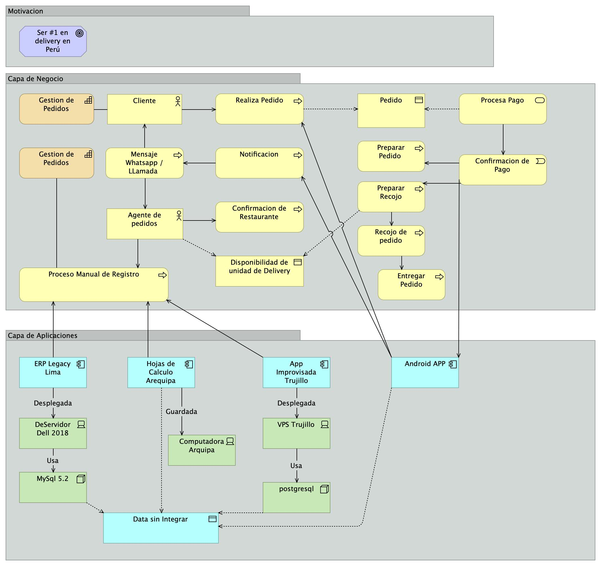

# Actividad 5: Caso Practice — DeliveryTech (TOGAF AS-IS)

**Curso:** Arquitectura Empresarial (ISIL, 2026-1)  
**Docente:** Richard Anthony Romero Mori  
**Fecha:** 14/07/2026

---

## 1. Contexto del Caso

### 1.1 Descripcion de la Empresa

**DeliveryTech** es una plataforma de delivery de alimentos fundada en Lima en 2020. Comenzo como un servicio pequeno para restaurantes del centro de la ciudad, pero en 5 anos ha crecido a 3 ciudades (Lima, Arequipa, Trujillo) con 2,500 restaurantes asociados y 800 repartidores.

### 1.2 Problema Actual

La empresa enfrenta una crisis de crecimiento:

- **Sistemas fragmentados:** Cada ciudad opera con un sistema independiente
- **Datos duplicados:** Clientes con multiples registros
- **Sin trazabilidad:** Imposible medir KPIs consolidados
- **Competencia creciendo:** Rappi, PedidosYa capturan mercado

### 1.3 Objetivo Estrategico

> "Ser la plataforma #1 de delivery de alimentos en Peru para 2028."

---

## 2. Proceso TOGAF AS-IS: Documentacion del Estado Actual

### 2.1 Alcance del Proceso AS-IS

El proceso TOGAF AS-IS documenta la **situacion actual** de la organizacion en las 4 capas de arquitectura:

| Fase | Que hace | Resultado |
|------|----------|-----------|
| **A. Vision de Arquitectura** | Definir alcance, stakeholders, vision | Alcance y stakeholders definidos |
| **B. Arquitectura de Negocio** | Mapear capacidades y procesos actuales | Mapa de procesos AS-IS |
| **C. Arquitectura de Datos y Aplicaciones** | Inventariar sistemas y datos actuales | Inventario de aplicaciones |
| **D. Arquitectura Tecnologica** | Documentar infraestructura actual | Arquitectura tecnica AS-IS |
| **RESULTADO FINAL** | Consolidar todo en documento AS-IS | Documento de estado actual |

---

### 2.2 Fase A: Vision de Arquitectura (AS-IS)

#### Stakeholders

| Stakeholder | Rol | Preocupacion |
|-------------|-----|--------------|
| CEO | Direccion General | Crecimiento sin control |
| CTO | Tecnologia | Infraestructura que no escala |
| Gerente Operaciones | Operaciones | Sin visibilidad multi-ciudad |
| Clientes | Usuarios | Experiencia inconsistente |
| Restaurantes | Socios | Dificultad para gestionar pedidos |

#### Vision AS-IS

- Empresa crecio sin arquitectura formal
- 3 ciudades con sistemas independientes
- Sin gobierno de datos ni integracion
- Decisiones reactivas, no estrategicas
- Riesgo de no poder escalar a mas ciudades

---

### 2.3 Fase B: Arquitectura de Negocio (AS-IS)

#### Capacidades Actuales

| Capacidad | Estado | Problema Principal |
|-----------|--------|-------------------|
| Gestion de Restaurantes | Parcial | Sin onboarding estandarizado |
| Gestion de Pedidos | Critico | 3 sistemas sin integracion |
| Logistica | Critico | Asignacion manual sin optimizacion |
| Experiencia Cliente | Critico | Inconsistente entre ciudades |

---

#### PROCESO 1: Onboarding de Restaurantes

**Capacidad que activa:** Gestion de Restaurantes  
**Responsable:** Gerente Comercial  
**Ciudades involucradas:** Lima, Arequipa, Trujillo

##### Flujo del Proceso (AS-IS)

1. **CONTACTO INICIAL**
   - Restaurante contacta por WhatsApp o telefono
   - Supervisor local registra datos en hoja de calculo
   - Sin validacion formal de requisitos

2. **EVALUACION**
   - Supervisor visita presencialmente el restaurante
   - Evalua menu, tiempos de preparacion, zona de cobertura
   - Decision basada en criterio personal, sin estandar

3. **REGISTRO**
   - Lima: Gerente ingresa datos al ERP Legacy v2.1
   - Arequipa: Supervisor guarda en Excel local
   - Trujillo: Se registra en app improvisada
   - Sin validacion cruzada entre ciudades

4. **CAPACITACION**
   - Capacitacion presencial sobre uso del sistema
   - Cada ciudad usa sistema diferente
   - Sin material estandarizado

5. **ACTIVACION**
   - Restaurante queda "activo" en el sistema local
   - Sin visibilidad para otras ciudades
   - Sin seguimiento post-activacion

##### Problemas Identificados

| Paso | Problema | Impacto |
|------|----------|---------|
| Contacto | Sin formulario unificado | Datos incompletos |
| Evaluacion | Sin criterios estandarizados | Restaurantes no aptos entran |
| Registro | 3 sistemas distintos | Datos duplicados |
| Capacitacion | Sin material comun | Curva de aprendizaje larga |
| Activacion | Sin integracion | No hay seguimiento |

##### Subprocesos Detallados

**1.1 Registro de Datos del Restaurante**

| Subproceso | Detalle |
|------------|---------|
| **Entrada** | Informacion del restaurante (nombre, RUC, direccion, contacto, menu) |
| **1.1.1** | Capturar datos basicos en formato libre |
| **1.1.2** | Verificar RUC en SUNAT (solo Lima) |
| **1.1.3** | Fotografiar local (sin estandar) |
| **1.1.4** | Clasificar tipo de restaurante (sin catalogo) |
| **Salida** | Registro incompleto en sistema local |
| **Sistema** | ERP (Lima) / Excel (Arequipa) / App (Trujillo) |

**1.2 Evaluacion de Idoneidad**

| Subproceso | Detalle |
|------------|---------|
| **Entrada** | Solicitud del restaurante |
| **1.2.1** | Visita presencial del supervisor |
| **1.2.2** | Evaluacion de menu (criterio personal) |
| **1.2.3** | Evaluacion de tiempos (sin metrica formal) |
| **1.2.4** | Verificacion de zona de cobertura |
| **1.2.5** | Decision: Aprobar / Rechazar |
| **Salida** | Decision subjetiva sin registro formal |
| **Herramienta** | WhatsApp + criterio del supervisor |

---

#### PROCESO 2: Procesamiento de Pedidos

**Capacidad que activa:** Gestion de Pedidos  
**Responsable:** Gerente Operaciones  
**Ciudades involucradas:** Lima, Arequipa, Trujillo

##### Flujo del Proceso (AS-IS)

1. **RECEPCION DEL PEDIDO**
   - Cliente abre la app movil Android
   - Selecciona restaurante y productos
   - Confirma pedido con pago (efectivo o tarjeta)
   - Lima: App envia pedido al ERP Legacy v2.1
   - Arequipa: Supervisor recibe notificacion por WhatsApp
   - Trujillo: App conecta a app improvisada, sin confirmacion automatica

2. **CONFIRMACION CON RESTAURANTE**
   - Lima: ERP envia pedido a restaurante (fax o llamada)
   - Arequipa: Supervisor llama por telefono
   - Trujillo: Mensaje WhatsApp al restaurante
   - Sin confirmacion estructurada

3. **PREPARACION**
   - Restaurante prepara el pedido
   - Sin tiempo estimado de entrega
   - Sin actualizacion al cliente

4. **ENTREGA**
   - Repartidor recoge y entrega
   - Sin tracking en tiempo real
   - Sin confirmacion de entrega digital

##### Problemas Identificados

| Paso | Problema | Impacto |
|------|----------|---------|
| Recepcion | 3 canales distintos | Experiencia inconsistente |
| Confirmacion | Sin integracion | Demora en confirmacion |
| Preparacion | Sin tiempos estimados | Cliente no sabe cuando llega |
| Entrega | Sin tracking | Sin visibilidad |

##### Subprocesos Detallados

**2.1 Recepcion y Validacion del Pedido**

| Subproceso | Detalle |
|------------|---------|
| **Entrada** | Pedido del cliente via app movil |
| **2.1.1** | App recibe seleccion del cliente |
| **2.1.2** | Valida disponibilidad del restaurante |
| **2.1.3** | Calcula total (sin descuentos consolidados) |
| **2.1.4** | Procesa pago (efectivo o pasarela basica) |
| **2.1.5** | Genera numero de pedido (sin correlacion global) |
| **Salida** | Pedido registrado en sistema local |
| **Problema** | Sin ID unico global, sin trazabilidad |

**2.2 Comunicacion con Restaurante**

| Subproceso | Detalle |
|------------|---------|
| **Entrada** | Pedido validado |
| **2.2.1** | Lima: ERP envia a impresora/restaurante |
| **2.2.2** | Arequipa: Supervisor envia WhatsApp |
| **2.2.3** | Trujillo: App notifica al restaurante |
| **2.2.4** | Esperar confirmacion (sin SLA) |
| **2.2.5** | Si no responde, llamada manual |
| **Salida** | Restaurante acepta o rechaza |
| **Problema** | Tiempo promedio de confirmacion: 12 minutos |

**2.3 Seguimiento de Preparacion**

| Subproceso | Detalle |
|------------|---------|
| **Entrada** | Pedido confirmado por restaurante |
| **2.3.1** | Restaurante inicia preparacion |
| **2.3.2** | Sin actualizacion de estado al cliente |
| **2.3.3** | Sin estimacion de tiempo restante |
| **2.3.4** | Cliente llama para preguntar (friccion) |
| **Salida** | Pedido listo para recoger |
| **Problema** | Cliente no tiene informacion, genera llamadas |

---

#### PROCESO 3: Asignacion de Repartidores

**Capacidad que activa:** Gestion de Logistica  
**Responsable:** Supervisor de Ciudad  
**Ciudades involucradas:** Lima, Arequipa, Trujillo

##### Flujo del Proceso (AS-IS)

1. **PEDIDO LISTO PARA RECOGER**
   - Restaurante avisa que pedido esta listo
   - Supervisor recibe notificacion (varia por ciudad)

2. **BUSQUEDA DE REPARTIDOR**
   - Supervisor busca repartidor disponible
   - Pregunta por WhatsApp grupal: "quien esta libre?"
   - Primer responde se lleva el pedido
   - Sin considerar ubicacion, capacidad o ruta

3. **ASIGNACION**
   - Supervisor asigna manualmente
   - Sin registro en sistema
   - Sin metricas de asignacion

4. **RECOJO Y ENTREGA**
   - Repartidor recoge en restaurante
   - Entrega al cliente
   - Sin confirmacion digital de entrega
   - Sin registro de tiempo total

##### Problemas Identificados

| Paso | Problema | Impacto |
|------|----------|---------|
| Notificacion | Sin sistema unificado | Demora en avisar |
| Busqueda | Por WhatsApp grupal | Ineficiente, sin criterio |
| Asignacion | Sin registro | Sin metricas |
| Entrega | Sin confirmacion digital | Sin trazabilidad |

##### Subprocesos Detallados

**3.1 Seleccion de Repartidor**

| Subproceso | Detalle |
|------------|---------|
| **Entrada** | Pedido listo para recoger |
| **3.1.1** | Supervisor publica en grupo WhatsApp |
| **3.1.2** | Espera respuestas (tiempo variable: 2-15 min) |
| **3.1.3** | Selecciona primero que responde |
| **3.1.4** | No verifica ubicacion del repartidor |
| **3.1.5** | No verifica capacidad del repartidor |
| **Salida** | Repartidor asignado sin criterio optimo |
| **Metrica** | Tiempo promedio de asignacion: 8 minutos |

**3.2 Tracking de Entrega**

| Subproceso | Detalle |
|------------|---------|
| **Entrada** | Repartidor recoge pedido |
| **3.2.1** | Repartidor inicia viaje |
| **3.2.2** | Sin GPS activo en la mayoria |
| **3.2.3** | Sin actualizacion de ubicacion |
| **3.2.4** | Cliente no sabe donde esta su pedido |
| **3.2.5** | Entrega sin firma ni confirmacion digital |
| **Salida** | Pedido entregado sin registro |
| **Problema** | Sin datos para optimizar rutas futuras |

---

#### PROCESO 4: Atencion al Cliente

**Capacidad que activa:** Experiencia Cliente  
**Responsable:** Gerente de Customer Success  
**Ciudades involucradas:** Lima, Arequipa, Trujillo

##### Flujo del Proceso (AS-IS)

1. **CONSULTA DEL CLIENTE**
   - Cliente llama o escribe por WhatsApp
   - Pregunta por estado de pedido
   - Reporta problema con entrega

2. **BUSQUEDA DE INFORMACION**
   - Atendiente busca en el sistema de la ciudad
   - Lima: busca en ERP Legacy
   - Arequipa: busca en Excel
   - Trujillo: busca en app improvisada
   - Sin acceso a datos de otras ciudades

3. **RESOLUCION**
   - Atendiente resuelve segun informacion disponible
   - Sin protocolo formal de atencion
   - Sin escalamiento definido

4. **REGISTRO**
   - Lima: registra caso en ERP
   - Arequipa: anota en cuaderno
   - Trujillo: no registra nada
   - Sin metricas consolidadas de atencion

##### Problemas Identificados

| Paso | Problema | Impacto |
|------|----------|---------|
| Consulta | Multiples canales | Confusion |
| Busqueda | Sin datos consolidados | Respuesta incompleta |
| Resolucion | Sin protocolo | Calidad variable |
| Registro | Sin consistencia | Sin metricas |

##### Subprocesos Detallados

**4.1 Gestion de Reclamos**

| Subproceso | Detalle |
|------------|---------|
| **Entrada** | Reclamo del cliente (llamada, WhatsApp) |
| **4.1.1** | Registrar reclamo (formato libre) |
| **4.1.2** | Buscar pedido en sistema local |
| **4.1.3** | Contactar restaurante (si aplica) |
| **4.1.4** | Contactar repartidor (si aplica) |
| **4.1.5** | Resolver o escalar (sin SLA definido) |
| **4.1.6** | Notificar al cliente |
| **Salida** | Reclamo resuelto sin registro consistente |
| **Metrica** | Tiempo promedio de resolucion: 45 minutos |

---

#### Mapa de Procesos Consolidado

| Capacidad | Procesos |
|-----------|----------|
| **Gestion de Restaurantes** | Registro de Datos, Evaluacion de Idoneidad, Activacion |
| **Gestion de Pedidos** | Recepcion y Validacion, Comunicacion con Restaurante, Seguimiento de Preparacion |
| **Gestion de Logistica** | Seleccion de Repartidor, Tracking de Entrega |
| **Experiencia Cliente** | Gestion de Reclamos |

---

### 2.4 Fase C: Arquitectura de Datos y Aplicaciones (AS-IS)

#### Inventario de Aplicaciones

| Aplicacion | Ciudad | Estado | Funcion |
|------------|--------|--------|---------|
| ERP Legacy v2.1 | Lima | Obsoleto | Gestion pedidos |
| App Movil Android | Todas | Funcional | Pedidos clientes |
| Web Admin | Lima | Limitada | Gestion restaurantes |
| Hojas de Calculo | Arequipa | Critico | Control pedidos |
| App Improvisada | Trujillo | Critico | Pedidos |

#### Tipologia de Datos Actual: Distribuida sin Gobierno

| Dominio | Lima | Arequipa | Trujillo |
|---------|------|----------|----------|
| Clientes | ERP | Excel | App |
| Pedidos | ERP | Excel | App |
| Restaurantes | Web | WhatsApp | App |

---

### 2.5 Fase D: Arquitectura Tecnologica (AS-IS)

#### Infraestructura Actual

| Componente | Tecnologia | Estado |
|------------|------------|--------|
| Servidor Lima | Dell PowerEdge 2018 | Obsoleto |
| BD Lima | MySQL 5.2 | Sin soporte activo |
| Hosting Arequipa | Computadora local | Critico |
| BD Arequipa | PostgreSQL | Critico |
| Hosting Trujillo | VPS economico | Critico |
| BD Trujillo | PostgreSQL | Critico |

---

## 3. Diagrama TOGAF AS-IS en Archi (Proceso Unico)

### 3.1 Vista Unica: Estado Actual DeliveryTech

El diagrama AS-IS se modela como **una sola vista** que muestra las 4 capas de TOGAF en un unico diagrama. El siguiente diagrama fue creado en Archi y exportado como imagen:

#### Descripcion del Diagrama

El modelo ArchiMate muestra la arquitectura actual de DeliveryTech organizada en 4 capas:

**Capa de Motivacion:**
- Objetivo estrategico: "Ser #1 en delivery en Peru"

**Capa de Negocio:**
- Capacidad principal: Gestion de Pedidos
- Procesos: Registro Manual, Realiza Pedido, Preparar Pedido, Recojo, Entrega
- Actores: Cliente (contacto via WhatsApp/Llamada)
- Objetos: Pedido

**Capa de Aplicaciones (fragmentada):**
- Lima: ERP Legacy (Servidor Dell 2018, MySQL 5.2)
- Arequipa: Hojas de Calculo (Computadora local)
- Trujillo: App Improvisada (VPS, PostgreSQL)
- **Problema central:** Data sin Integrar entre ciudades

**Capa de Tecnologia:**
- Lima: Servidor Dell obsoleto con MySQL sin soporte
- Arequipa: Computadora local con PostgreSQL
- Trujillo: VPS economico con PostgreSQL

#### Elementos del Modelo (según imagen Archi)

**Capa de Motivacion:**

| Elemento | Tipo | Nombre |
|----------|------|--------|
| Goal | Goal | Ser #1 en delivery |

**Capa de Negocio:**

| Elemento | Tipo | Nombre |
|----------|------|--------|
| Capability | Business Capability | Gestion de Pedidos |
| Actor | Business Actor | Cliente |
| Process | Business Process | Realiza Pedido |
| Process | Business Process | Proceso Pago |
| Process | Business Process | Preparar Pedido |
| Process | Business Process | Entregar Pedido |
| Process | Business Process | Proceso Manual de Registro |
| Business Object | Business Object | Pedido |
| Business Object | Business Object | Factura |
| Business Object | Business Object | Inventario |

**Capa de Aplicaciones:**

| Elemento | Tipo | Nombre |
|----------|------|--------|
| Application Component | Application Component | ERP Legacy Lima |
| Application Component | Application Component | Hojas de Calculo Arequipa |
| Application Component | Application Component | App Improvisada Trujillo |
| Data Object | Data Object | Data sin Integrar |

**Capa de Tecnologia:**

| Elemento | Tipo | Nombre |
|----------|------|--------|
| Node | Technology Node | DeServidor Dell 2018 |
| System Software | System Software | MySQL 5.2 |
| Node | Technology Node | Computadora Arquipa |
| Node | Technology Node | VPS Trujillo |
| System Software | System Software | postgresql |

#### Relaciones en el Modelo

| Capa Origen | Elemento | Relacion | Elemento Destino | Capa Destino |
|-------------|----------|----------|------------------|--------------|
| Motivacion | Ser #1 en delivery | requires | Gestion de Pedidos | Negocio |
| Negocio | Cliente | realiza | Realiza Pedido | Negocio |
| Negocio | Realiza Pedido | genera | Pedido | Negocio |
| Negocio | Proceso Pago | accede | Factura | Negocio |
| Negocio | Preparar Pedido | accede | Inventario | Negocio |
| Negocio | Proceso Manual de Registro | sirve | ERP Legacy Lima | Aplicaciones |
| Aplicaciones | ERP Legacy Lima | desplegada en | DeServidor Dell 2018 | Tecnologia |
| Tecnologia | DeServidor Dell 2018 | usa | MySQL 5.2 | Tecnologia |
| Aplicaciones | Hojas de Calculo Arequipa | guardada en | Computadora Arquipa | Tecnologia |
| Aplicaciones | App Improvisada Trujillo | desplegada en | VPS Trujillo | Tecnologia |
| Tecnologia | VPS Trujillo | usa | postgresql | Tecnologia |
| Aplicaciones | ERP Legacy Lima | accede | Data sin Integrar | Aplicaciones |
| Aplicaciones | Hojas de Calculo Arequipa | accede | Data sin Integrar | Aplicaciones |
| Aplicaciones | App Improvisada Trujillo | accede | Data sin Integrar | Aplicaciones |

---

## 4. Modelo ArchiMate para Archi

### 4.1 Un Solo Paso: Crear Vista Layered

En Archi, toda la arquitectura AS-IS va en **una sola vista**:

1. Abre Archi y crea un nuevo modelo: `DeliveryTech-AS-IS`
2. Click derecho sobre el modelo -> **New Viewpoint** -> selecciona **Layered**
3. Nombra la vista: `AS-IS DeliveryTech`

### 4.2 Elementos a Crear

#### Capa de Motivacion (arriba)

| Elemento | Tipo ArchiMate | Nombre |
|----------|----------------|--------|
| Goal | Goal | Ser #1 en delivery |

#### Capa de Negocio

| Elemento | Tipo ArchiMate | Nombre |
|----------|----------------|--------|
| Capability | Business Capability | Gestion de Pedidos |
| Actor | Business Actor | Cliente |
| Process | Business Process | Realiza Pedido |
| Process | Business Process | Proceso Pago |
| Process | Business Process | Preparar Pedido |
| Process | Business Process | Entregar Pedido |
| Process | Business Process | Proceso Manual de Registro |
| Business Object | Business Object | Pedido |
| Business Object | Business Object | Factura |
| Business Object | Business Object | Inventario |

#### Capa de Aplicaciones

| Elemento | Tipo ArchiMate | Nombre |
|----------|----------------|--------|
| Application Component | Application Component | ERP Legacy Lima |
| Application Component | Application Component | Hojas de Calculo Arequipa |
| Application Component | Application Component | App Improvisada Trujillo |
| Data Object | Data Object | Data sin Integrar |

#### Capa de Tecnologia (abajo)

| Elemento | Tipo ArchiMate | Nombre |
|----------|----------------|--------|
| Node | Technology Node | DeServidor Dell 2018 |
| System Software | System Software | MySQL 5.2 |
| Node | Technology Node | Computadora Arquipa |
| Node | Technology Node | VPS Trujillo |
| System Software | System Software | postgresql |

### 4.3 Relaciones a Crear

| Capa | Elemento Origen | Relacion | Elemento Destino |
|------|-----------------|----------|------------------|
| Motivacion → Negocio | Ser #1 en delivery | requires | Gestion de Pedidos |
| Negocio | Cliente | realiza | Realiza Pedido |
| Negocio | Realiza Pedido | genera | Pedido |
| Negocio | Proceso Pago | accede | Factura |
| Negocio | Preparar Pedido | accede | Inventario |
| Negocio → Aplicaciones | Proceso Manual de Registro | sirve | ERP Legacy Lima |
| Aplicaciones → Tecnologia | ERP Legacy Lima | desplegada en | DeServidor Dell 2018 |
| Tecnologia | DeServidor Dell 2018 | usa | MySQL 5.2 |
| Aplicaciones → Tecnologia | Hojas de Calculo Arequipa | guardada en | Computadora Arquipa |
| Aplicaciones → Tecnologia | App Improvisada Trujillo | desplegada en | VPS Trujillo |
| Tecnologia | VPS Trujillo | usa | postgresql |
| Aplicaciones | ERP Legacy Lima | accede | Data sin Integrar |
| Aplicaciones | Hojas de Calculo Arequipa | accede | Data sin Integrar |
| Aplicaciones | App Improvisada Trujillo | accede | Data sin Integrar |

### 4.4 Crea las Relaciones en Archi

1. Selecciona la herramienta **Relationship** (flecha) en el panel izquierdo
2. Click en el elemento origen
3. Arrastra hasta el elemento destino
4. En **Properties** selecciona el tipo de relacion:

| Tipo ArchiMate | Uso en el Caso |
|----------------|----------------|
| **Serving** | Capability sirve a Process |
| **Used by** | Process usa Application Component |
| **Access** | Application accede a Data Object |
| **Deployment** | Application se despliega en Node |
| **Realization** | Application Component realize Process |

---

## 5. Checklist de Verificacion

Antes de entregar verifica que tengas:

- [ ] 1 sola vista Layered creada en Archi
- [ ] 1 Goal en capa de Motivacion ("Ser #1 en delivery")
- [ ] 1 Capability, 5 Processes y 1 Actor en capa de Negocio
- [ ] 3 Business Objects (Pedido, Factura, Inventario) en capa de Negocio
- [ ] 3 Application Components y 1 Data Object en capa de Aplicaciones
- [ ] 3 Nodes y 2 System Software en capa de Tecnologia
- [ ] Todas las relaciones entre capas conectadas
- [ ] El diagrama muestra claramente la fragmentacion (3 sistemas separados)
- [ ] El Data Object refleja que los datos no estan integrados
- [ ] Modelo exportado como imagen JPG con nombre semantico

---

## Fuentes

| # | Fuente | Tipo | URL |
|---|--------|------|-----|
| 1 | TOGAF Standard - ADM | Oficial | [https://pubs.opengroup.org/togaf-standard/](https://pubs.opengroup.org/togaf-standard/) |
| 2 | ArchiMate 3.1 Specification | Oficial | [https://pubs.opengroup.org/archimate3-doc/](https://pubs.opengroup.org/archimate3-doc/) |
| 3 | DAMA-DMBOK | Libro | [https://dama.org/cpages/dama-dmbok](https://dama.org/cpages/dama-dmbok) |

---

*Ultima verificacion: 14/07/2026.*
