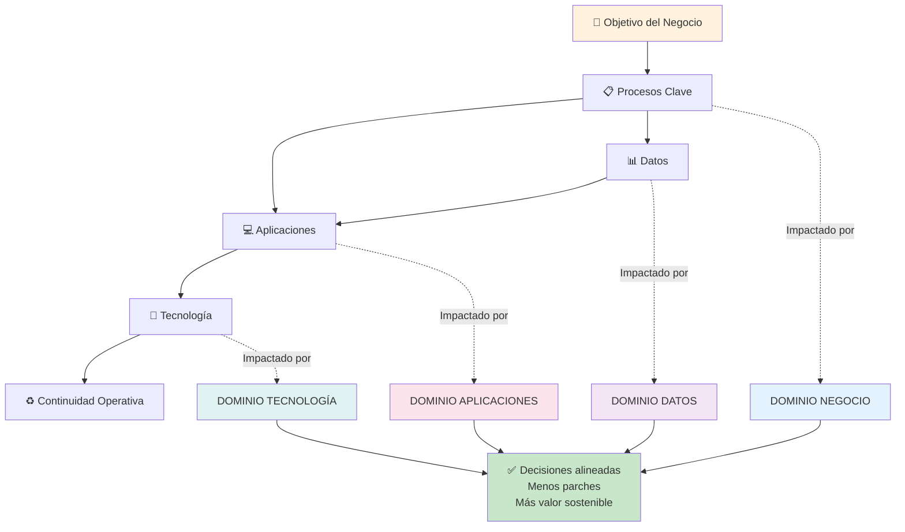

# Arquitectura Empresarial: Fundamentos (Clase 1)

**Curso:** Arquitectura Empresarial (ISIL, 2026-1)  
**Docente:** Richard Anthony Romero Mori  
**Fecha:** 08/04/2026

## Resumen de la sesión
La primera clase presentó la **Arquitectura Empresarial (AE)** como una disciplina de nivel estratégico.  
La idea central fue clara: la tecnología debe responder a objetivos del negocio, no avanzar de forma aislada.

## ¿Qué es la AE y por qué importa?

La **AE** es una forma de diseñar y gobernar la organización como un sistema integrado.

Sirve para:

- Gestionar la complejidad cuando la empresa crece.
- Evitar "parches" que resuelven algo puntual pero crean nuevos problemas.
- Alinear decisiones tecnológicas con metas de negocio.
- Mejorar coordinación entre áreas técnicas y no técnicas.

### Idea clave

La AE no es solo hacer diagramas: es tomar mejores decisiones de cambio organizacional.

## Principios trabajados en clase
- **Alineamiento estratégico:** cada proyecto de TI debe justificar su aporte al negocio.
- **Visión holística:** entender cómo se relacionan procesos, datos, aplicaciones y tecnología.
- **Evolución ordenada:** pasar de decisiones reactivas a una hoja de ruta planificada.
- **Valor sostenible:** priorizar soluciones reutilizables y mantenibles en el tiempo.

## Dominios de la Arquitectura Empresarial (4 pilares)

1. **Negocio:** estrategia, capacidades y procesos que generan valor.
2. **Datos:** información crítica, calidad de datos y soporte para decisiones.
3. **Aplicaciones:** sistemas, integraciones y dependencias entre plataformas.
4. **Tecnología:** infraestructura, redes, plataformas y continuidad operativa.

### Conexión práctica

Cuando estos cuatro dominios se diseñan por separado, aparecen brechas.  
Cuando se diseñan en conjunto, la organización reduce fricción y mejora resultados.

## Introducción a **TOGAF** y **ADM**
En clase se introdujo **TOGAF** como marco de referencia para ordenar el trabajo de arquitectura.

- **TOGAF:** framework para diseñar, planificar y gobernar la AE.
- **ADM (Architecture Development Method):** método de trabajo para conducir el cambio.

### AS-IS y TO-BE
- **AS-IS:** estado actual de la organización.
- **TO-BE:** estado objetivo al que se quiere llegar.

El valor del enfoque es cerrar brechas entre ambos estados con una ruta realista.

## Reutilización: no reinventar la rueda

Se enfatizó que una buena arquitectura aprovecha componentes, patrones y prácticas ya probadas.

Beneficios de reutilizar:

- Menor costo de implementación.
- Menor riesgo técnico y operativo.
- Mayor velocidad de entrega.
- Mayor estandarización entre proyectos.

## Dinámica de clase y perfil de estudiantes
La clase incluyó presentación del grupo y contexto profesional.

- Perfil técnico predominante: Desarrollo, Redes y Ciberseguridad.
- Varios estudiantes están en proceso de convalidación hacia **Ingeniería de Sistemas**.
- Se observó diversidad de experiencia en organizaciones públicas y privadas.

### Sectores representados
- Banca (ej. BCP)
- Educación
- Sector público (ej. SUNAT, Ministerio de Agricultura)
- Seguros
- Hotelería

## Casos prácticos revisados

### Smart Cities (Ciudades Inteligentes)

- Se analizó la ciudad como "sistema de sistemas".
- Sensores y datos permiten optimizar tráfico, seguridad y uso de recursos.
- Lección de AE: integrar múltiples actores, procesos y plataformas.

### Continuidad bancaria y contingencia (DR)

- Caso de inversión anual en centro de contingencia para evitar pérdidas por interrupción.
- Lección de AE: la arquitectura también guía decisiones de riesgo y continuidad del negocio.

### Cambridge Analytica

- Caso usado para discutir uso de datos personales y perfilado.
- Lección de AE: gobierno de datos, ética y control del uso de información son parte del diseño empresarial.

## Próximos pasos del curso
- Comunicación ágil por grupo de WhatsApp.
- Enfoque aplicativo: uso de herramientas para modelar arquitectura.
- Aplicación de conceptos en escenarios reales de sectores diversos.
- Profundización progresiva en **TOGAF**, **ADM** y gobierno de datos.

## Glosario breve

- **AE:** disciplina estratégica para alinear negocio y tecnología. Trata la organización como un sistema integrado donde procesos, datos, aplicaciones e infraestructura deben diseñarse juntos, no aislados.
- **AS-IS:** situación actual de procesos, datos, aplicaciones y tecnología. Es el punto de partida para cualquier iniciativa de cambio.
- **TO-BE:** estado objetivo definido para la evolución organizacional. Es lo que se quiere lograr después de implementar cambios.
- **TOGAF:** marco de trabajo (framework) que proporciona método, herramientas y buenas prácticas para diseñar, planificar e implementar arquitectura empresarial.
- **ADM:** Architecture Development Method. Es el método propuesto por TOGAF que divide el trabajo arquitectónico en fases ordenadas para pasar de AS-IS a TO-BE.
- **Alineamiento estratégico:** relación directa entre iniciativas de TI y objetivos de negocio. Garantiza que el dinero invertido en tecnología aporta valor estratégico.
- **Dominios de AE:** cuatro pilares que deben diseñarse juntos: Negocio (estrategia, procesos), Datos (información crítica), Aplicaciones (sistemas), Tecnología (infraestructura).

---

## Conceptos relacionados en otros cursos

- **Diseño de Soluciones con IA — Clase 1:** introduce el concepto de "alineamiento de diseño", similar a cómo AE alinea negocio con tecnología. Ambos enfoques priorizan **entender el problema antes de elegir la solución**. [Ver notas](../../diseno-soluciones-ia/clase-1/diseno-soluciones-ia-introduccion-clase-1.md)

---

## Visión integrada de los 4 dominios

### Clave del diagrama

- Los **4 dominios** están conectados: cambios en uno afectan a los otros
- Un **objetivo de negocio** debe traducirse en procesos, datos, aplicaciones y tecnología alineados
- El resultado es una **arquitectura coherente** que evita decisiones aisladas
