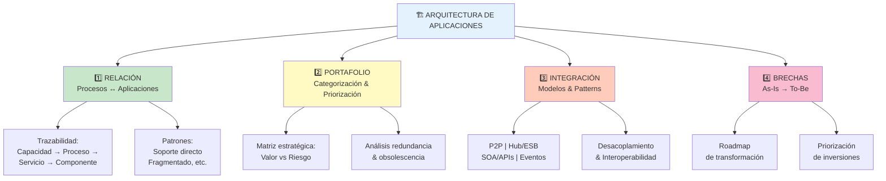
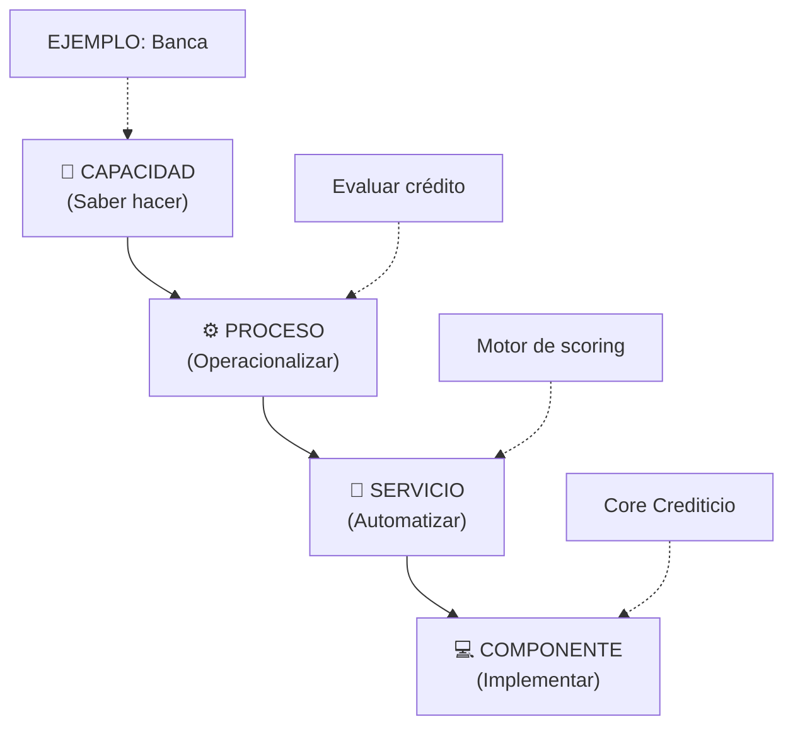
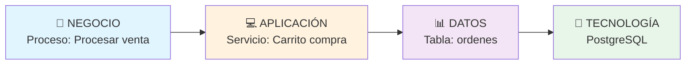
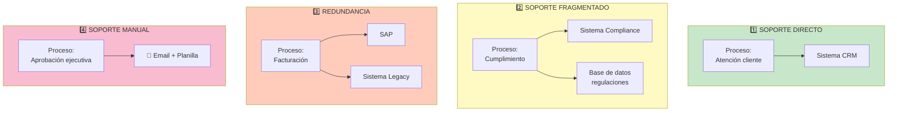
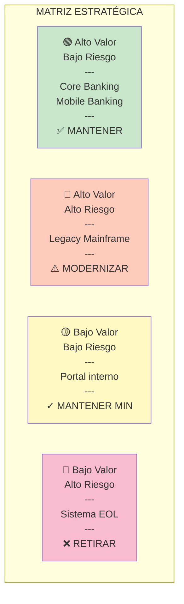
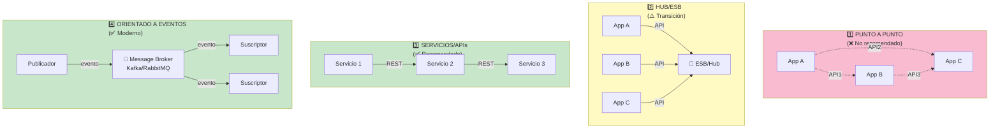
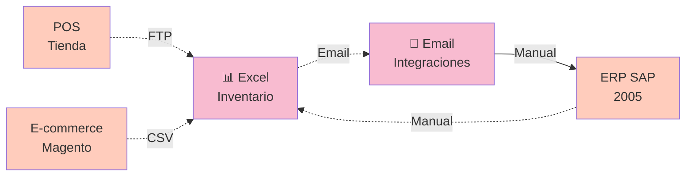
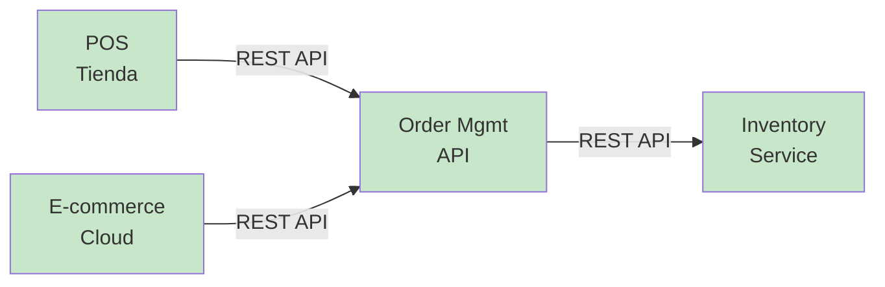
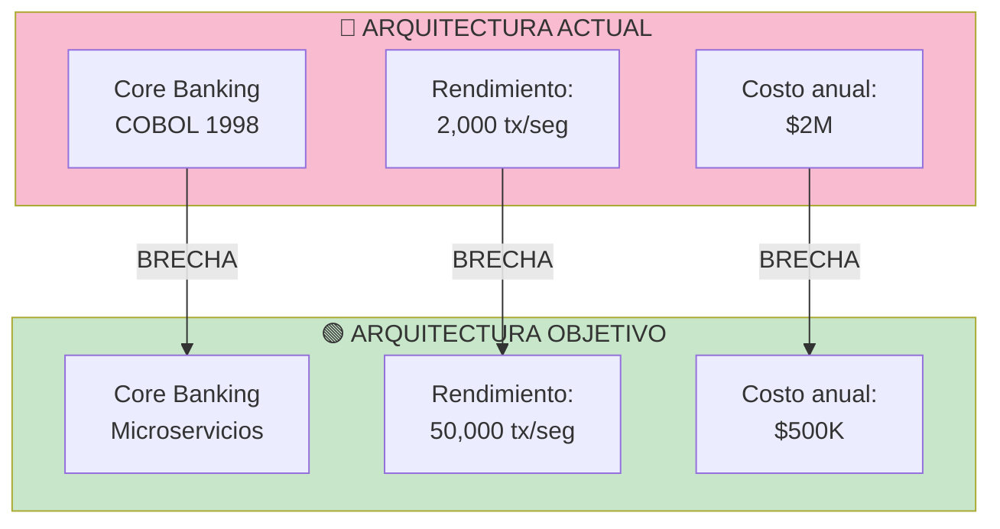
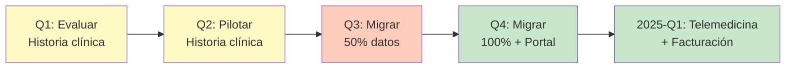

# Arquitectura de Aplicaciones (Clase 10)

**Curso:** Arquitectura Empresarial (ISIL, 2026-1)  
**Tema:** Arquitectura de Aplicaciones  
**Fecha:** Sesión 10

---

## Resumen ejecutivo

La **arquitectura de aplicaciones** analiza cómo los sistemas de información soportan los procesos del negocio y habilitan la ejecución de las capacidades estratégicas. No es un inventario de software, sino un modelo formal de la estructura lógica de las aplicaciones, sus servicios, dependencias e integración con datos y plataformas.

La arquitectura de aplicaciones es la capa intermedia entre el negocio y la tecnología, actuando como mecanismo de automatización, control y escalabilidad de los procesos organizacionales.

**Mapa conceptual del tema:**

---

## 1. Relación entre aplicaciones y procesos del negocio

### 1.1 Fundamento estructural: de capacidad a aplicación

La trazabilidad arquitectónica sigue este flujo:

1. **Capacidades** → lo que la organización debe saber hacer
2. **Procesos** → operacionalizan las capacidades
3. **Servicios de aplicación** → automatizan actividades del proceso
4. **Componentes** → implementan los servicios

**Conclusión clave:** Sin esta trazabilidad no existe alineamiento arquitectónico real.

**Visualización del flujo:**

**Ejemplo real - Banco minorista:**
- **Capacidad:** Evaluar la capacidad de pago de solicitantes
- **Proceso:** Recibir solicitud → Validar datos → Calcular riesgo → Emitir decisión
- **Servicio:** Motor de scoring que calcula puntuación crediticia
- **Componente:** Sistema Core Crediticio que almacena y ejecuta la lógica

### 1.2 Servicio de aplicación: definición técnica

Un **servicio de aplicación** es una funcionalidad lógica expuesta por un sistema que soporta una o más actividades de negocio.

Debe cumplir:
- Tener interfaz definida
- Exponer funcionalidad reutilizable
- Gestionar datos específicos
- Ser invocable por otros componentes

**Ejemplo estructural:**
- Proceso: Evaluación de crédito
- Actividad: Calcular riesgo
- Servicio de aplicación: Motor de scoring
- Componente: Sistema Core Crediticio

### 1.3 Modelado formal de la relación

El análisis proceso–aplicación debe representarse mediante:

| Artefacto | Descripción |
|-----------|-------------|
| **Diagrama de Procesos (BPMN 1-2)** | Identifica actividades automatizadas |
| **Diagrama de Componentes (UML)** | Representa aplicaciones y servicios |
| **Matriz de trazabilidad** | Proceso \| Actividad \| Servicio \| Aplicación \| Dato crítico |
| **Vista por capas** | Negocio ↔ Aplicación ↔ Datos ↔ Tecnología |

**Regla fundamental:** Si no se puede modelar, no se puede analizar el impacto.

**Ejemplo visual - Vista por capas (Comercio electrónico):**

**Ejemplo en matriz de trazabilidad:**

| Proceso | Actividad | Servicio | Aplicación | Dato Crítico |
|---------|-----------|----------|------------|--------------|
| Venta en línea | Validar inventario | Consulta stock | Magento | sku_disponible |
| Venta en línea | Procesar pago | Tokenización | PaymentGateway | token_transaccion |
| Venta en línea | Generar factura | Emisión documento | SAP | factura_pdf |

### 1.4 Tipos de relación estructural

Existen cuatro patrones principales:

1. **Soporte directo:** Una aplicación soporta completamente un proceso
2. **Soporte fragmentado:** Múltiples aplicaciones soportan distintas actividades del mismo proceso
3. **Redundancia funcional:** Dos o más aplicaciones soportan la misma actividad
4. **Soporte manual:** Actividades críticas sin automatización

Cada patrón implica diferente nivel de riesgo y complejidad operativa.

**Visualización de patrones:**

**Ejemplos reales por sector:**

| Patrón | Sector | Ejemplo |
|--------|--------|---------|
| **Soporte directo** | Retail | Una app de POS maneja toda la venta |
| **Soporte fragmentado** | Banca | Depósito en Core, transferencias en Mobile, consultas en Portal |
| **Redundancia** | Salud | Dos sistemas de historias clínicas activos simultáneamente |
| **Soporte manual** | Seguros | Aprobación de reclamos por gerente vía email |

### 1.5 Desalineaciones frecuentes e impacto estructural

**Problemas comunes:**
- Proceso crítico soportado por sistema legacy no escalable
- Alta dependencia punto a punto entre aplicaciones
- Integraciones no documentadas
- Falta de responsable funcional del servicio

**Impacto:**
- Incremento de riesgo operativo
- Baja flexibilidad estratégica
- Dificultad de modernización
- Elevado costo de mantenimiento

---

## 2. Portafolio de aplicaciones y su categorización

### 2.1 ¿Qué es el portafolio de aplicaciones?

El **portafolio de aplicaciones** es el inventario estructurado y clasificado de todos los sistemas que soportan las capacidades y procesos del negocio.

**Nota importante:** No es una lista de software, es un activo arquitectónico.

### 2.2 Para qué sirve

Un portafolio maduro permite:
- Priorizar modernización
- Evaluar riesgo tecnológico
- Detectar obsolescencia
- Identificar redundancias
- Analizar alineamiento estratégico

Debe estar vinculado a capacidades y procesos críticos.

### 2.3 Dimensiones de clasificación arquitectónica

| Dimensión | Opciones |
|-----------|----------|
| **Rol estratégico** | Core / Estratégica / Soporte |
| **Criticidad operativa** | Alta / Media / Baja |
| **Nivel de integración** | Aislada / Parcial / Integrada |
| **Estado tecnológico** | Moderna / En transición / Legacy |
| **Modelo arquitectónico** | Monolítica / Modular / Orientada a servicios / API-based |

### 2.4 Matriz estratégica del portafolio

**Ejes:**
- Eje X: Valor estratégico (bajo → alto)
- Eje Y: Riesgo tecnológico (bajo → alto)

**Cuadrantes y decisiones:**
| Valor | Riesgo | Decisión |
|-------|--------|----------|
| Alto | Bajo | Mantener y potenciar |
| Alto | Alto | **Modernizar prioritariamente** |
| Bajo | Alto | **Retirar o reemplazar** |
| Bajo | Bajo | Mantener mínimo soporte |

**Visualización de matriz (Ejemplo de Banco):**

**Ejemplo de portafolio real - Institución Financiera:**

| Aplicación | Valor | Riesgo | Cuadrante | Acción |
|------------|-------|--------|-----------|--------|
| Core Banking | Alto | Bajo | Q1 | Mantener y modernizar gradualmente |
| Mobile Banking | Alto | Bajo | Q1 | Potenciar con nuevas funciones |
| Legacy Mainframe | Alto | Alto | Q2 | **Migración a plataforma moderna** |
| Portal Empleados | Bajo | Bajo | Q3 | Mantener sin inversión mayor |
| Sistema obsoleto | Bajo | Alto | Q4 | **Retiro en 6 meses** |

### 2.5 Identificación de redundancia funcional

La redundancia ocurre cuando:
- Dos sistemas realizan la misma función
- Se registran datos duplicados en múltiples aplicaciones
- Se ejecutan procesos similares en herramientas distintas

**Impacto:**
- Incremento de costo
- Inconsistencia de datos
- Mayor complejidad de integración
- Dificultad para modernizar

Eliminar redundancia mejora gobernanza tecnológica.

---

## 3. Integración tecnológica: interoperabilidad, plataformas, servicios

### 3.1 Definición

La **integración tecnológica** define cómo las aplicaciones intercambian información, coordinan funcionalidades y soportan procesos de negocio dentro del ecosistema empresarial.

Desde arquitectura, la integración debe:
- Minimizar acoplamiento
- Garantizar interoperabilidad
- Asegurar consistencia de datos
- Facilitar escalabilidad
- Reducir dependencia punto a punto

**Conclusión:** La integración determina la flexibilidad estructural de la organización.

### 3.2 Modelos de integración estructural

Existen cuatro patrones principales:

#### 1. Integración punto a punto
- Conexiones directas entre sistemas
- Alto acoplamiento y difícil escalabilidad

#### 2. Integración centralizada (Hub o ESB)
- Middleware intermedio que orquesta comunicaciones
- Mejor control, pero puede convertirse en cuello de botella

#### 3. Integración orientada a servicios (SOA / APIs)
- Servicios reutilizables desacoplados
- Mayor flexibilidad y escalabilidad

#### 4. Integración basada en eventos
- Comunicación asincrónica orientada a eventos
- Reducción de acoplamiento y mejor reactividad

**Recomendación arquitectónica:** Arquitecturas maduras privilegian servicios desacoplados y APIs.

**Comparativa visual de modelos:**

**Ejemplo real - Sistema de pagos:**

| Modelo | Descripción | Sector | Limitación |
|--------|-------------|--------|-----------|
| **Punto a punto** | Banco conecta directamente con proveedor | Pago único | 20 integraciones = caos |
| **Hub/ESB** | Banco central conecta a 15 proveedores | Retail | Un fallo del ESB cae todo |
| **APIs/SOA** | Cada microservicio expone API REST | FinTech | Requiere madurez operativa |
| **Eventos** | App publica evento "pago completado" | Banca Digital | Require monitoreo distribuido |

### 3.3 Análisis As-Is (Arquitectura actual)

Describe el estado real del ecosistema tecnológico:
- Aplicaciones existentes
- Dependencias entre sistemas
- Integraciones manuales
- Interfaces no documentadas
- Sistemas legacy
- Limitaciones de escalabilidad

**Debe representarse mediante:**
- Diagrama de componentes
- Mapa de integraciones
- Matriz de dependencias

**Ejemplo As-Is - Empresa retail con problemas:**

**Problemas identificados:**
- ❌ Integraciones manuales (riesgo de error)
- ❌ Excel central (cuello de botella)
- ❌ Sin visibilidad en tiempo real
- ❌ Alto costo operativo

### 3.4 Análisis To-Be (Arquitectura objetivo)

Define el estado tecnológico deseado:
- Eliminación de redundancia
- Estandarización de datos
- Plataforma de APIs
- Reducción de acoplamiento
- Mejora de seguridad y gobernanza

**Debe alinearse con:**
- Capacidades estratégicas futuras
- Procesos críticos
- Modelo operativo objetivo

**Ejemplo To-Be - Mismo retail modernizado:**

**Mejoras:**
- ✅ APIs desacopladas
- ✅ Real-time visibility
- ✅ Automatización completa
- ✅ Reducción de costo operativo

---

## 4. Análisis de brechas tecnológicas

### 4.1 Identificación de brechas arquitectónicas

La brecha surge cuando:
- Procesos críticos dependen de sistemas obsoletos
- La integración impide escalabilidad
- Existen dependencias rígidas
- El tiempo de cambio tecnológico es elevado
- La arquitectura no soporta nuevas capacidades estratégicas

**Ejemplo visual - Brecha en banca:**

### 4.2 Documentación de brechas

Se documenta mediante una matriz:

| Componente | Estado actual | Estado objetivo | Impacto | Prioridad | Riesgo |
|------------|---------------|-----------------|---------|-----------|--------|
| Aplicación X | Legacy | Moderno | Alto | 1 | Medio |

**Conclusión clave:** La brecha no es técnica solamente, es estratégica.

**Ejemplo de matriz completa (Hospital):**

| Componente | As-Is | To-Be | Impacto | Prioridad | Riesgo | Inversión |
|-----------|-------|-------|---------|-----------|--------|-----------|
| Historia clínica | Sistema 1980 en disco | Cloud moderna | Crítico | 1 | Alto | $500K |
| Recepción | Manual en papel | Portal digital | Alto | 2 | Medio | $50K |
| Facturación | SAP legacy | Facturación cloud | Medio | 3 | Bajo | $100K |
| Telemedicina | No existe | Plataforma Video | Alto | 2 | Medio | $80K |

**Roadmap de transformación:**

---

## 5. Conclusiones principales

1. **Trazabilidad estructural:** La arquitectura de aplicaciones establece la trazabilidad formal entre capacidades estratégicas, procesos de negocio y servicios tecnológicos, garantizando que la tecnología esté diseñada para habilitar la ejecución organizacional.

2. **Análisis formal:** El análisis de la relación proceso–aplicación permite identificar dependencias, redundancias y vacíos de soporte tecnológico que impactan en eficiencia operativa y riesgo estructural.

3. **Gestión de portafolio:** La categorización del portafolio de aplicaciones transforma el inventario tecnológico en un instrumento de decisión estratégica, permitiendo priorizar modernización, consolidación o retiro de sistemas.

4. **Flexibilidad e integración:** La integración tecnológica determina el nivel de acoplamiento y flexibilidad del ecosistema digital, siendo factor crítico para escalabilidad, interoperabilidad y evolución organizacional.

5. **Roadmap de transformación:** El análisis de brechas convierte el diagnóstico tecnológico en un roadmap estructurado de transformación, alineado a capacidades estratégicas y reducción de riesgo operativo.

---

## Referencias y fuentes

- **TOGAF® Version 9.1** — The Open Group Standard
- **Enterprise Architecture at Work** — Lankhorst, M. (2017)
- **BPMN Version 2.0.2** — Object Management Group
- **UML Version 2.5** — Object Management Group
- **ISO/IEC 42010** — Systems and Software Engineering – Architecture Description
- **Gartner Enterprise Architecture Practice** — Capability-based planning y roadmaps arquitectónicos
