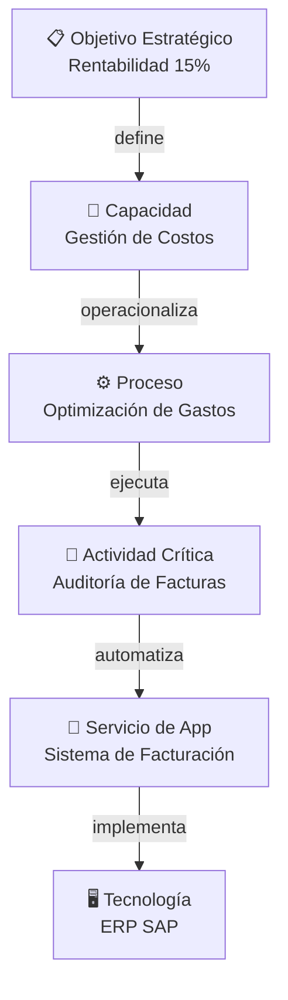
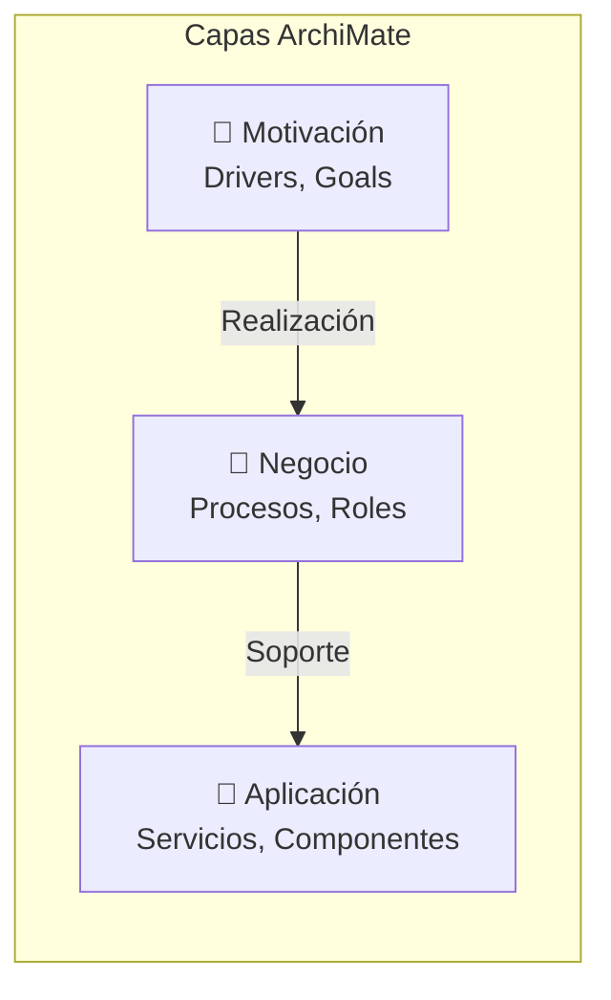
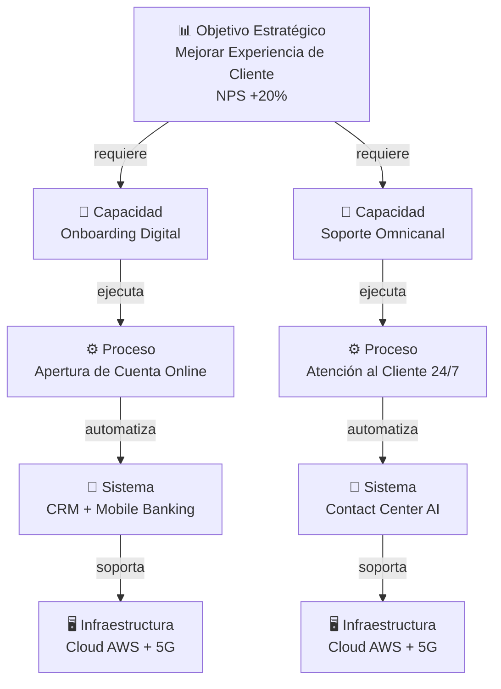
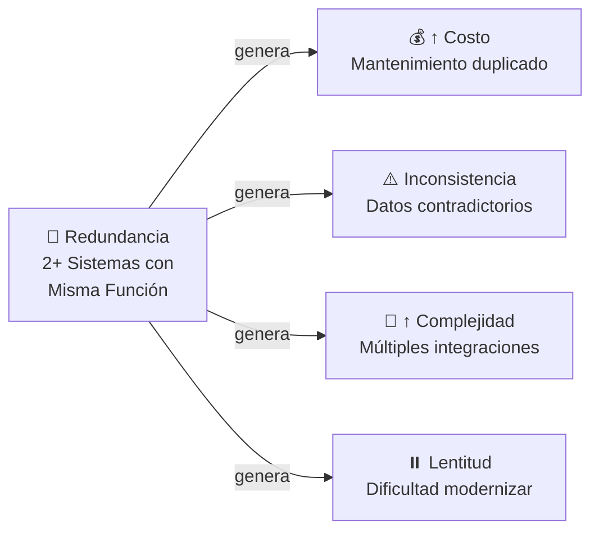
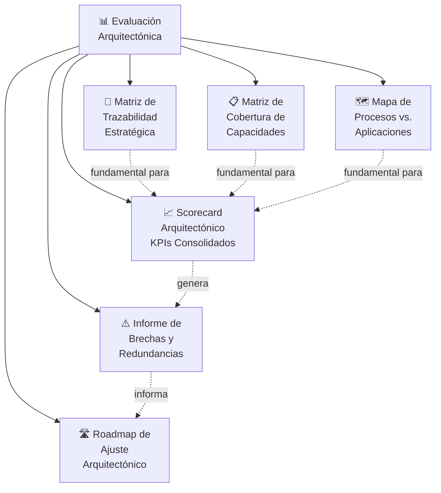
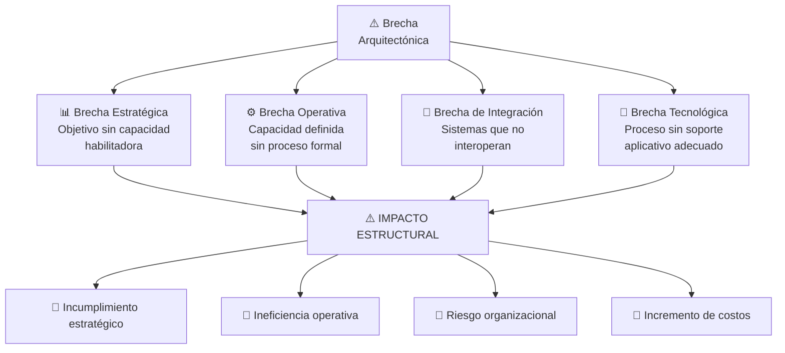
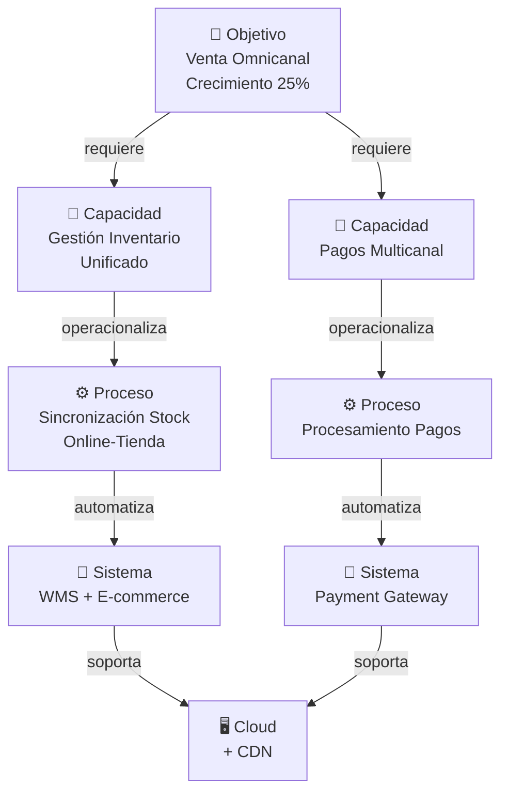

# Alineamiento Estratégico: Trazabilidad entre Objetivos, Procesos y Aplicaciones

**Código:** AE-11  
**Curso:** Arquitectura Empresarial  
**Clase:** 11  
**Tema:** Alineamiento Estratégico y Evaluación del Modelo Arquitectónico  
**Fecha:** Semestre 2026-1  

---

## 🎯 Conceptos Clave

### 1. Alineamiento Estratégico

**Definición**: La coherencia estructural verificable entre múltiples capas organizacionales que garantizan que la estrategia se ejecuta efectivamente a través de la tecnología.

El alineamiento estratégico en arquitectura empresarial **no es conceptual, es estructural y verificable**. Se define como la coherencia entre:

- **Dirección estratégica**: visión, objetivos, metas
- **Capacidades organizacionales**: lo que la organización sabe hacer
- **Procesos de negocio**: cómo se ejecutan las capacidades
- **Arquitectura de aplicaciones y datos**: automatización de procesos
- **Infraestructura tecnológica**: soporte técnico subyacente

**Principio Fundamental:**  
*Una estrategia está alineada cuando puede ser materializada mediante capacidades y soportada por procesos y sistemas medibles.*

### 2. Trazabilidad Estructural

**Trazabilidad** es el mecanismo técnico que valida alineamiento mediante **relaciones explícitas y verificables** entre elementos de la arquitectura en diferentes capas.

Sin trazabilidad formal entre capacidad, proceso y servicio de aplicación, **no existe alineamiento arquitectónico real**.

#### Cadena Formal de Trazabilidad

```
Objetivo estratégico
        ↓ define
Capacidad habilitadora
        ↓ operacionaliza mediante
Proceso clave
        ↓ ejecutado a través de
Actividades críticas
        ↓ automatizadas por
Servicios de aplicación
        ↓ implementados en
Componentes o sistemas tecnológicos
```

### 3. Las Cinco Capas de Alineamiento

| Capa | Descripción | Función |
|------|-------------|---------|
| **Estratégica** | Define objetivos, indicadores y prioridades | Dirección |
| **Capacidades** | Representa lo que la organización debe saber hacer | Habilitación |
| **Procesos** | Ejecuta operacionalmente las capacidades | Operación |
| **Aplicaciones** | Automatiza actividades críticas | Automatización |
| **Tecnológica** | Habilita infraestructura y plataformas | Soporte |

**El alineamiento existe cuando estas capas presentan coherencia vertical**.

### 4. Desalineamiento: Un Problema Estructural

El desalineamiento **NO ocurre por fallas humanas**, sino por:

- Falta de trazabilidad entre objetivos y procesos
- Procesos no soportados por aplicaciones adecuadas
- Sistemas que evolucionan sin referencia estratégica
- Ausencia de modelo arquitectónico formal

**Sin modelo formal, la estrategia y la tecnología evolucionan de manera independiente.**

### 5. Enfoque de Capacidades (Capability-Based Planning)

Las capacidades actúan como **puente estabilizador** entre volatilidad estratégica y rigidez tecnológica:

- La estrategia cambia con mayor frecuencia
- Las aplicaciones evolucionan lentamente
- **Las capacidades permanecen relativamente estables en el tiempo**

Ventaja: Desacopla cambios estratégicos de transformaciones tecnológicas profundas.

---

## 📊 Trazabilidad como Mecanismo de Validación



**Validación**: Cada nivel debe poder justificarse en el nivel superior. Si una aplicación no puede vincularse a un objetivo estratégico, su valor arquitectónico es **cuestionable**.

---

## 🔗 Fundamento Arquitectónico (TOGAF e ISO)

### TOGAF (The Open Group Architecture Framework)

En TOGAF (ADM – Fases B, C y E), la trazabilidad es un principio estructural que conecta:

1. **Architecture Vision**: visión y objetivos
2. **Business Architecture**: capacidades y procesos
3. **Application Architecture**: servicios y aplicaciones
4. **Roadmap**: plan de transformación

TOGAF establece que los artefactos deben mantener relaciones explícitas para garantizar coherencia del **Target Architecture**.

### ISO/IEC 42010

Refuerza que toda arquitectura debe identificar:

- **Stakeholders**: partes interesadas
- **Concerns**: preocupaciones o necesidades
- **Viewpoints**: perspectivas de análisis
- **Relaciones entre elementos**: cómo se conectan

### Lankhorst (ArchiMate)

Plantea vistas por capas con relaciones de:

- **Realización** (realization): cómo se materializa
- **Soporte** (serving): cómo se soporta
- **Dependencia**: cómo se relaciona



---

## 🛠️ Mecanismo de Trazabilidad Formal

La trazabilidad permite:

1. **Demostrar coherencia vertical** entre estrategia y tecnología
2. **Evaluar impacto** ante cambios estratégicos
3. **Identificar redundancias** o activos sin propósito
4. **Justificar inversiones** tecnológicas
5. **Validar prioridades** de modernización

**Beneficio clave**: Convierte la arquitectura en una **herramienta de diagnóstico y toma de decisiones estratégicas**.

---

## 🎨 Ejemplo Práctico: Sector Bancario

### Caso: Banco de Mediano Tamaño



### Validación de Trazabilidad

| Nivel | Elemento | Validación |
|-------|----------|-----------|
| Estrategia | NPS +20% | ✅ Medible y verificable |
| Capacidad | Onboarding Digital | ✅ Habilitador clave |
| Proceso | Apertura de Cuenta Online | ✅ Materializa capacidad |
| Aplicación | Mobile Banking | ✅ Automatiza proceso |
| Tecnología | Cloud AWS | ✅ Infraestructura soporte |

---

## 🔴 Redundancia Funcional

**Redundancia** ocurre cuando múltiples sistemas realizan la misma función:

- Dos sistemas registran datos de clientes
- Procesos similares en herramientas distintas
- Plataformas que duplican funcionalidades

### Impacto de la Redundancia



**Beneficio de eliminar redundancia**: Mejora gobernanza tecnológica y reduce complejidad.

---

## 📈 Evaluación del Modelo Arquitectónico

### Objetivo de la Evaluación

Establecer un mecanismo **cuantitativo** para medir el grado de alineamiento estructural.

**No mide desempeño operativo**, sino **consistencia del modelo** respecto a la Target Architecture.

### Alcance de la Evaluación

La evaluación arquitectónica debe evaluar cuatro dimensiones:

#### 1. Alineamiento Estratégico

- % de objetivos estratégicos con trazabilidad formal
- Nivel de cobertura de capacidades críticas

#### 2. Soporte de Procesos

- % de procesos críticos soportados por aplicaciones
- Nivel de automatización de actividades clave

#### 3. Estructura Tecnológica

- Índice de redundancia funcional
- % de aplicaciones obsoletas
- Nivel de integración (API/interoperabilidad)

#### 4. Adaptabilidad

- Tiempo promedio de ajuste arquitectónico ante cambio
- % de componentes desacoplados

---

## 📊 KPIs Arquitectónicos Clave

### KPI 1: Cobertura Estratégica

$$\text{Cobertura Estratégica} = \frac{\text{N° procesos vinculados a objetivos estratégicos}}{\text{Total procesos críticos}} \times 100$$

**Meta**: > 90%

### KPI 2: Índice de Soporte Aplicativo

$$\text{Soporte Aplicativo} = \frac{\text{N° procesos críticos con aplicación asignada}}{\text{Total procesos críticos}} \times 100$$

**Meta**: 100% en procesos core

### KPI 3: Índice de Redundancia Funcional

$$\text{Redundancia} = \frac{\text{N° funcionalidades duplicadas}}{\text{Total funcionalidades evaluadas}} \times 100$$

**Meta**: < 10%

### KPI 4: Cobertura de Capacidades

$$\text{Cobertura de Capacidades} = \frac{\text{N° capacidades con soporte tecnológico}}{\text{Total capacidades estratégicas}} \times 100$$

**Meta**: > 85%

### KPI 5: Deuda Tecnológica

$$\text{Deuda Tecnológica} = \text{% de aplicaciones fuera de ciclo de vida recomendado}$$

**Meta**: < 15%

---

## 📋 Entregables de la Evaluación



---

## 🔍 Análisis de Brechas (Gap Analysis)

### Definición

Una **brecha estructural** ocurre cuando existe desalineamiento entre capas de la arquitectura.

**En términos TOGAF:**  
*Brecha = Diferencia entre la arquitectura As-Is (actual) y Target Architecture (deseada)*

### Tipos de Brechas Arquitectónicas



---

## 🎯 Acciones de Impacto Inmediato (Quick Wins)

Las brechas y redundancias identificadas mediante KPIs permiten acciones inmediatas:

1. **Eliminación de aplicaciones duplicadas**
   - Reducir costo de mantenimiento
   - Consolidar funcionalidades

2. **Consolidación de funcionalidades similares**
   - Simplificar portafolio
   - Mejorar experiencia de usuario

3. **Priorización de modernización**
   - Enfoque en sistemas críticos
   - Evitar inversión en aplicaciones obsoletas

4. **Formalización de procesos**
   - Documentar procesos no formalizados
   - Establecer estándares

5. **Implementación de métricas**
   - Establecer KPIs de trazabilidad
   - Monitoreo continuo

**Beneficio**: Los quick wins reducen complejidad estructural **sin requerir transformación completa**.

---

## 💡 Madurez Arquitectónica

### Arquitectura Sin Evaluación (Declarativa)

- Existe un modelo arquitectónico
- Pero no hay validación de alineamiento
- Desconocida la coherencia real entre capas
- **Riesgo**: arquitectura y estrategia evolucionan independientemente

### Arquitectura Con KPIs (Gobernable)

- Métricas cuantitativas de alineamiento
- Visibilidad de brechas y redundancias
- Capacidad de optimizar continuamente
- **Ventaja**: arquitectura se convierte en **instrumento de decisión estratégica**

**La madurez arquitectónica consiste en equilibrar brechas (lo que falta) y redundancias (lo que sobra) para sostener la estrategia.**

---

## 🏢 Ejemplo: Retail (E-commerce)

### Escenario: Empresa de Retail Omnicanal



### Evaluación de Madurez Actual

| Métrica | Actual | Meta | Estado |
|---------|--------|------|--------|
| Cobertura Estratégica | 75% | 90% | 🔴 Brecha |
| Soporte Aplicativo | 80% | 100% | 🟡 En progreso |
| Redundancia | 18% | <10% | 🔴 Exceso |
| Cobertura Capacidades | 70% | 85% | 🔴 Brecha |
| Deuda Tecnológica | 22% | <15% | 🔴 Alto riesgo |

**Acción inmediata**: Consolidar 3 sistemas de inventario, evaluar modernización de componentes legacy.

---

## 🗂️ Glosario

| Término | Definición |
|---------|-----------|
| **Alineamiento Estratégico** | Coherencia estructural verificable entre objetivos, capacidades, procesos y tecnología |
| **Trazabilidad** | Relaciones explícitas y verificables entre elementos de arquitectura en diferentes capas |
| **Capacidad** | Lo que la organización debe saber hacer para materializar estrategia |
| **Brecha Arquitectónica** | Diferencia entre arquitectura actual (As-Is) y arquitectura objetivo (To-Be) |
| **Redundancia Funcional** | Duplicación de funcionalidades en múltiples sistemas |
| **Target Architecture** | Arquitectura deseada alineada con estrategia futura |
| **Cohesión Vertical** | Conexión clara entre capas sin desalineamientos |
| **Quick Win** | Acción de impacto inmediato identificable mediante KPIs |
| **Deuda Tecnológica** | Costo de mantener y actualizar sistemas fuera de ciclo de vida |
| **Scorecard Arquitectónico** | Consolidación de KPIs que miden alineamiento estructural |
| **ADM (Architecture Development Method)** | Metodología de TOGAF para desarrollar arquitectura |
| **Viewpoint** | Perspectiva específica desde la que se analiza la arquitectura |

---

## 📚 Referencias Conceptuales

- **TOGAF 9.2**: Architecture Development Method (Fases B, C, E)
- **ISO/IEC 42010:2011**: Recommended Practice for Architecture Description of Software-Intensive Systems
- **ArchiMate 3.1** (Lankhorst): Estándar de modelado de arquitectura empresarial
- **Gartner Capability-Based Planning**: Enfoque de planeamiento basado en capacidades

---

## 🎓 Conclusiones Clave

1. **El alineamiento estratégico NO es un problema organizacional, es un problema arquitectónico.**

2. **La trazabilidad convierte la arquitectura en una herramienta verificable y cuantificable.**

3. **Las cinco capas deben presentar coherencia vertical para garantizar la ejecución estratégica.**

4. **Sin modelo formal, estrategia y tecnología evolucionan independientemente.**

5. **Los KPIs arquitectónicos convierten la evaluación en acción medible y gobernable.**

6. **Brechas revelan lo que falta. Redundancias revelan lo que sobra. La madurez es equilibrarlas.**

7. **La arquitectura empresarial diagnostica inconsistencias del presente y diseña el futuro.**

---

**La evaluación arquitectónica convierte la arquitectura empresarial en un sistema medible de control estratégico.**

