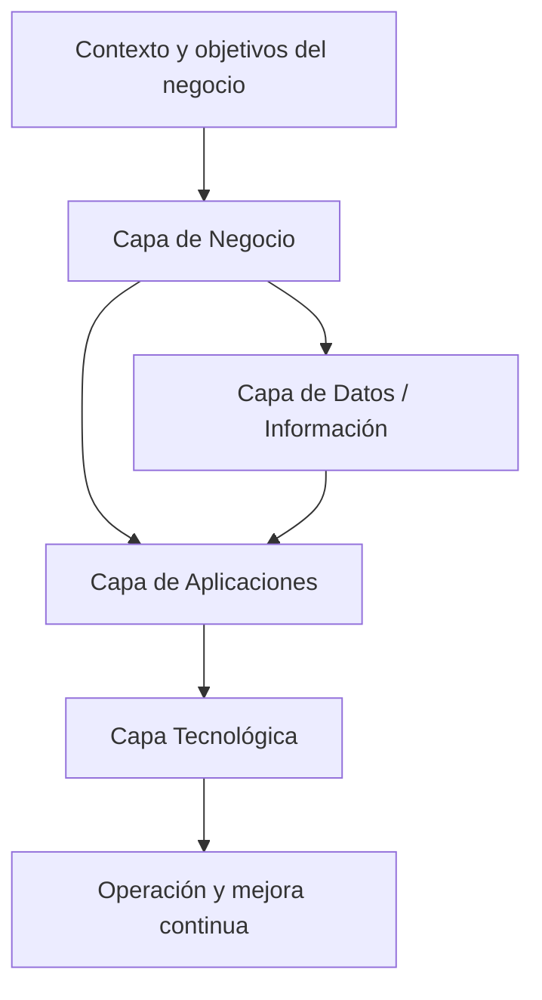
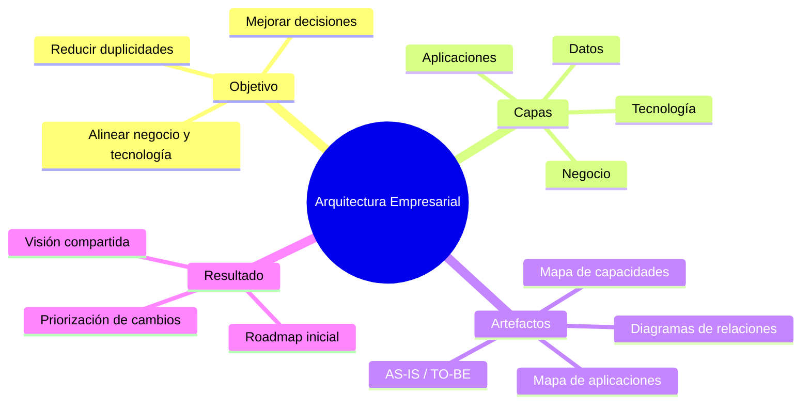
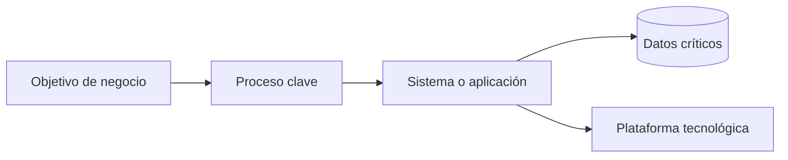

# Arquitectura Empresarial: Gráficos de apoyo (Clase 2)

**Curso:** Arquitectura Empresarial (ISIL, 2026-1)  
**Docente:** Richard Anthony Romero Mori  
**Fecha:** 15/04/2026

## 1) Relación entre capas de AE

## 2) Mapa mental de conceptos de Clase 02

## 3) Trazabilidad simple: negocio a tecnología

