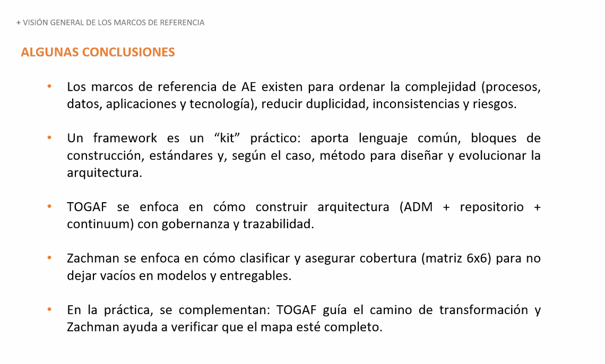
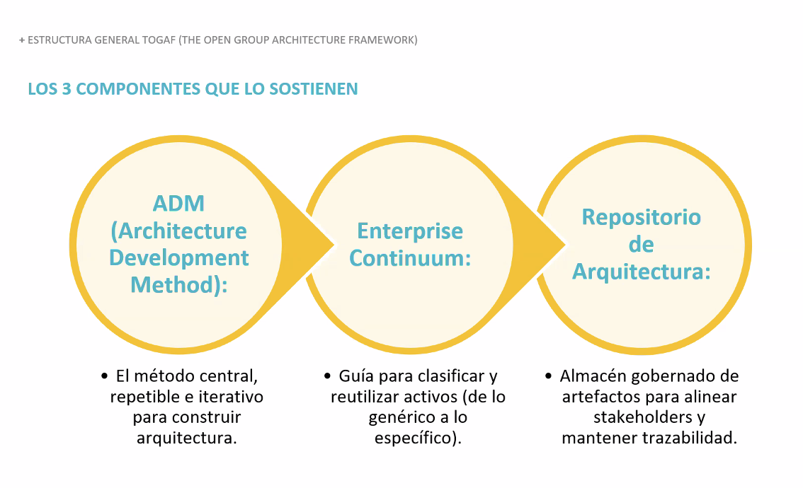
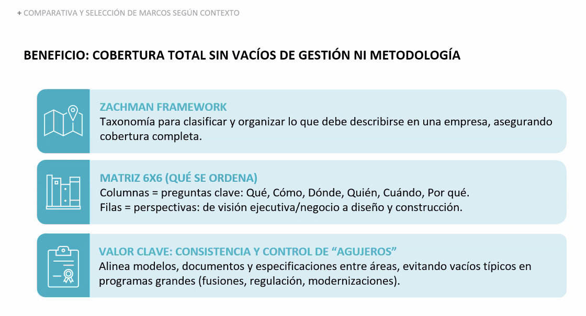
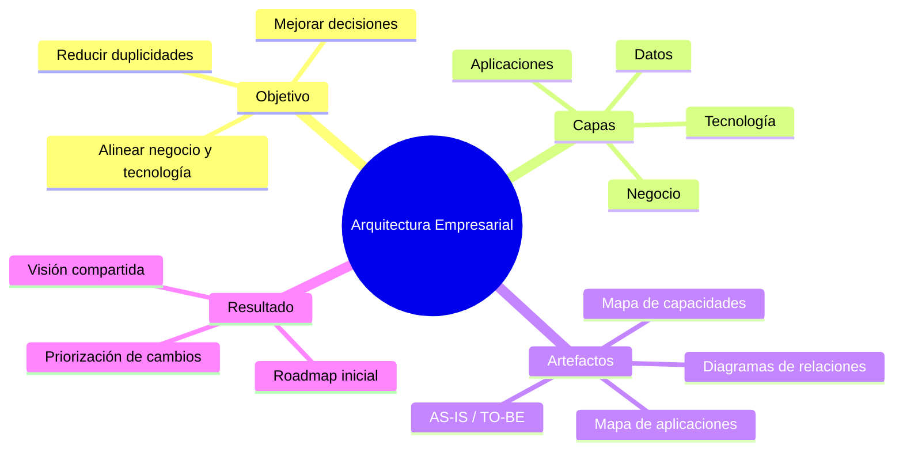
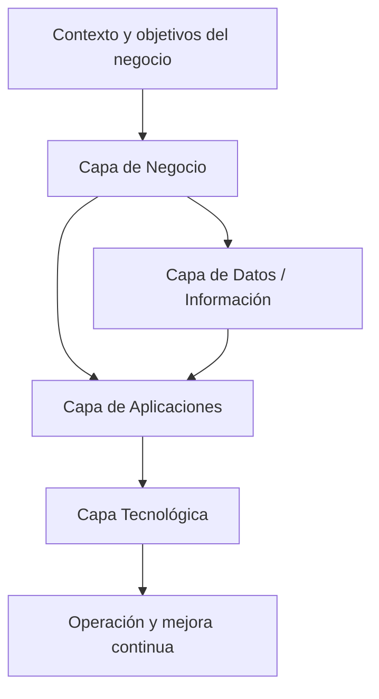
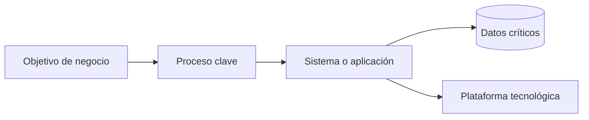

# Arquitectura Empresarial: TOGAF y Zachman (Clase 2)

**Curso:** Arquitectura Empresarial (ISIL, 2026-1)  
**Docente:** Richard Anthony Romero Mori  
**Fecha:** 15/04/2026

## Objetivos de la clase

- Comprender el propósito de la Arquitectura Empresarial (AE) como puente entre negocio y tecnología.
- Identificar las capas principales de AE y cómo se relacionan entre sí.
- Reconocer los artefactos básicos que ayudan a documentar el estado actual y el estado objetivo.

## Idea principal de la clase

La clase explicó que la **Arquitectura Empresarial (AE)** no se trata solo de tecnología. Su función es conectar la estrategia del negocio con procesos, datos, aplicaciones e infraestructura para que la empresa crezca con orden y no por parches.

## Qué es la Arquitectura Empresarial

La **AE** es una disciplina que ayuda a entender la organización como un sistema completo.

Sirve para:

- alinear decisiones tecnológicas con objetivos del negocio;
- reducir duplicidades y retrabajo;
- identificar brechas entre el estado actual (**as-is**) y el estado objetivo (**to-be**);
- priorizar cambios con una visión integral.

## Los cuatro dominios de la AE

Durante la sesión se reforzó que toda arquitectura empresarial debe mirar al menos estos cuatro dominios:

1. **Negocio:** estrategia, capacidades, procesos y reglas.
2. **Datos:** información crítica, calidad, uso y gobierno.
3. **Aplicaciones:** sistemas que soportan procesos y servicios.
4. **Tecnología:** infraestructura, plataformas, redes y hardware.

> Idea clave: si cambia el negocio, normalmente también cambian los datos, las aplicaciones y la tecnología.

## **TOGAF**

**TOGAF** es un marco de trabajo para diseñar, planificar, implementar y gobernar la arquitectura empresarial.

Su valor práctico es que ofrece un proceso ordenado para pasar de la situación actual a una situación objetivo. Dentro de **TOGAF**, el método **ADM** guía ese recorrido por fases.

### Para qué sirve **TOGAF**

- ordenar el trabajo arquitectónico;
- definir entregables y decisiones por etapas;
- alinear negocio y TI con una metodología clara;
- reducir improvisación en iniciativas de cambio.

## **Zachman Framework**

**Zachman** es una taxonomía. No dice exactamente cómo ejecutar el cambio, sino cómo organizar todo lo que la empresa debe describir para entenderse bien.

Se basa en una matriz de **6 columnas** y **6 filas**:

- **Columnas:** Qué, Cómo, Dónde, Quién, Cuándo y Por qué.
- **Filas:** Planner, Owner, Designer, Builder, Subcontractor y Enterprise Operations.

### Para qué sirve **Zachman**

- asegurar cobertura completa del análisis;
- detectar vacíos de información o de diseño;
- clasificar artefactos desde la visión estratégica hasta la operativa;
- mantener trazabilidad entre negocio y tecnología.

## Cómo se complementan **TOGAF** y **Zachman**

La clase remarcó que ambos frameworks se pueden usar juntos porque resuelven problemas distintos:

- **TOGAF** aporta el proceso.
- **Zachman** aporta la estructura de clasificación.

En términos simples:

- **TOGAF** responde: cómo avanzar.
- **Zachman** responde: qué debe quedar cubierto.

## Casos prácticos vistos en clase

La teoría se aterrizó con ejemplos reales para mostrar por qué la AE importa en organizaciones complejas.

### Smart Cities

Se revisó cómo una ciudad inteligente funciona como un sistema de sistemas. Sensores, analítica y plataformas permiten optimizar tráfico, seguridad, riego y servicios públicos.

### Gestión de riesgos en banca

Se comentó el caso de un banco que invierte en un centro de contingencia para evitar pérdidas millonarias ante una caída operativa. El punto central fue entender que una decisión tecnológica también es una decisión de negocio.

### Cambridge Analytica y ética de datos

Este caso mostró que los datos tienen impacto estratégico, reputacional y ético. No basta con tener tecnología; también se necesita gobierno, control y responsabilidad sobre el uso de la información.

## Cómo usar **Zachman** en un caso real

Una forma simple de aplicarlo es esta:

1. Definir el problema o alcance.
2. Elegir la perspectiva inicial, normalmente estratégica.
3. Llenar las preguntas clave de la matriz.
4. Traducir el análisis a procesos, aplicaciones y tecnología.
5. Detectar vacíos, duplicidades y prioridades.

### Ejemplo breve

Si una empresa quiere reducir reclamos de clientes, puede analizar con **Zachman**:

- **Qué:** qué datos faltan o están mal registrados;
- **Cómo:** qué proceso genera la demora;
- **Quién:** qué rol aprueba o bloquea la atención;
- **Dónde:** en qué canal ocurre el problema;
- **Cuándo:** en qué momento del flujo aparece la falla;
- **Por qué:** qué regla o política genera fricción.

Con ese análisis, la mejora ya no se ve como un cambio aislado en un sistema, sino como una mejora integral del negocio.

## Artefactos y entregables mencionados

Los apuntes también dejan claro qué tipo de entregables suelen aparecer al trabajar arquitectura empresarial:

- mapa de capacidades del negocio;
- inventario o mapa de aplicaciones;
- diagramas de relación entre procesos, aplicaciones y datos;
- definición de estado actual (**as-is**) y estado objetivo (**to-be**);
- lista de brechas y prioridades para un roadmap inicial.

## Gráficos de apoyo

### Imagen 1: arquitectura-empresarial-fundamentos-clase-2.png

Esta imagen resume la base de la clase: la **AE** integra negocio, datos, aplicaciones y tecnología para orientar decisiones de cambio con visión completa.

### Imagen 2: zachman-togaf-relacion-clase-2.png

Esta imagen ayuda a entender la complementariedad entre ambos marcos: **TOGAF** guía el proceso y **Zachman** organiza la cobertura de los artefactos.

### Imagen 3: zachman-matriz-cobertura-6x6-clase-2.png

Esta imagen muestra la lógica de cobertura del framework, útil para evitar “agujeros” en el análisis de una organización.

## Gráficos rápidos de repaso

### Mapa mental de los conceptos de la clase

### Relación entre las capas de AE

### Trazabilidad simple de negocio a tecnología

## Preguntas de repaso

1. ¿Por qué la AE ayuda a alinear objetivos del negocio con decisiones tecnológicas?
2. ¿Qué diferencia existe entre capa de negocio y capa de aplicaciones?
3. ¿Qué artefactos mínimos usarías para explicar una propuesta de mejora?
4. ¿Qué riesgos aparecen cuando no se documentan bien datos, procesos y sistemas?

## Conclusión

La sesión dejó una idea central: la arquitectura empresarial permite tomar mejores decisiones porque conecta estrategia y tecnología con método, estructura y contexto real. **TOGAF** y **Zachman** son útiles juntos porque uno ordena el camino y el otro evita vacíos en el análisis.

