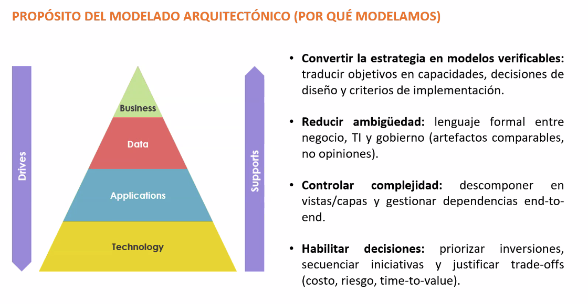
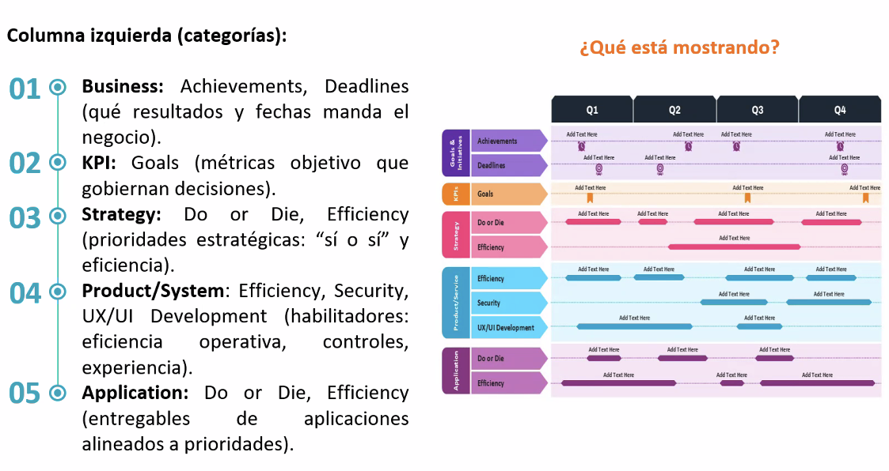

# Modelado Arquitectónico y Capas (Clase 3)

**Curso:** Arquitectura Empresarial (ISIL, 2026-1)  
**Docente:** Richard Anthony Romero Mori  
**Fecha:** 22/04/2026

## 1. Introducción al Modelado Arquitectónico

El **modelo arquitectónico** es una representación abstracta de un sistema. Describe su estructura, comportamiento y organización, y se utiliza para comunicar y documentar las decisiones de diseño. El modelado no es simplemente "dibujar por dibujar", sino una herramienta fundamental para **traducir la estrategia organizacional** en representaciones claras y verificables.

- **Componentes y relaciones:** Modelar un sistema implica identificar sus partes, sus relaciones y cómo interactúan entre sí (a través de diagramas de clases, secuencia, componentes, etc.).
- **Toma de decisiones y control:** Permite evaluar trade-offs (*costo, riesgo, time-to-value*), decidir sobre responsabilidades, la elección de tecnologías y el manejo de aspectos no funcionales (rendimiento, seguridad, escalabilidad), ayudando a controlar la complejidad tecnológica masiva.
- **Reducir ambigüedad:** Sirve como lenguaje formal entre negocio, TI y gobierno para utilizar artefactos comparables, **no opiniones**.
- **Alineamiento TI-Negocio:** TI no es un "área de apoyo" (mentalidad obsoleta). La tecnología **soporta** a las Aplicaciones, que usan Datos para **impulsar** al Negocio, sirviendo como articulador estratégico de un extremo al otro.

## 2. Los Tres Ejes del Modelado

Para construir modelos útiles, la arquitectura se estructura en torno a tres ejes o pilares fundamentales:

---

### A. Vistas (Perspectivas)
Representan el "qué se quiere ver" según el tipo de interesado (*stakeholder*).
Se pueden dividir también en lógicas (organización abstracta, componentes, módulos) y físicas (distribución real en infraestructura). Las vistas principales son:
- **Ejecutiva:** Metas, objetivos y restricciones.
- **Operativa:** Capacidades, procesos y roles.
- **Sistemas:** Aplicaciones, datos y flujos.
- **Tecnológica:** Infraestructura y seguridad.

---

### B. Capas (Dominios)
Organizan la arquitectura de forma vertical para asegurar trazabilidad. También se analizan desde su diseño lógico (responsabilidades específicas) hasta su implementación física (distribución en hardware):
1. **Negocio:** Procesos, estructura operativa, organizaciones y marco referencial.
2. **Datos:** Entidades, flujos y calidad de la información.
3. **Aplicaciones:** Servicios, APIs e interoperabilidad.
4. **Tecnología:** Redes, plataformas y seguridad.

### C. Niveles de Abstracción
Abarcan desde lo más general hasta lo más concreto:
- **Conceptual:** El "qué" (visión general).
- **Lógico:** Jerarquía y reglas (independiente de la tecnología).
- **Físico/Tecnológico:** Cómo se distribuyen los niveles del sistema en la infraestructura física real.

## 3. Mapas de Capacidades y Hojas de Ruta (Roadmaps)

Un punto clave de la sesión fue la diferenciación entre **procesos** y **capacidades**, y cómo las prioridades del negocio fluyen verticalmente hacia la tecnología a lo largo de un período de tiempo (Q1, Q2, Q3, etc.):

- **Categorización por Columnas y Fechas (*Deadlines*):** El negocio impone los resultados (*Achievements, Deadlines*) en el tope (01), que derivan en **KPIs** (02) y fluyen al **Core Estratégico ("Do or Die" y Eficiencia)** (03). Esto rige a nivel sistemas (04 y 05) todo el desarrollo futuro operativo, los protocolos de seguridad, la experiencia de usuario (UX/UI) y las entregas tecnológicas para que estas iniciativas sean posibles.
- **Mapa de Capacidades vs Procesos:** La capacidad es lo que una empresa hace (estable a través de los cuadros temporales), el proceso es cómo lo logra.
- **Análisis de Brechas (*Gap Analysis*):** Identifica la distancia entre el estado actual (*As-Is*) y el objetivo final plasmado en el roadmap temporal (*To-Be*).
- **Priorización Estratégica:** Se dividen las entregas en trimestres (Q1 a Q4) según la urgencia y el valor cruzado con base a la matriz de **Impacto vs. Esfuerzo**.

## Transcripción del PPT: Modelado Arquitectónico

### Vistas, Capas y Niveles de Abstracción

Las organizaciones son "sistemas socio-técnicos" complejos: múltiples capacidades, procesos, datos y aplicaciones interactúan y generan dependencias difíciles de gobernar sin modelos.

Un marco de referencia permite descomponer la empresa por vistas y niveles de abstracción (qué se quiere ver, con qué detalle y para quién), evitando diagnósticos parciales o contradictorios.

**Ejemplo práctico:** En un hospital, la vista ejecutiva muestra metas de reducción de tiempos de espera, la operativa detalla procesos de admisión, la de sistemas integra apps de registros médicos, y la tecnológica asegura servidores seguros. Sin capas, un cambio en software podría romper flujos de datos, causando errores en tratamientos.

### Mapas de Capacidades y Hojas de Ruta Arquitectónicas

Un mapa de capacidades es un inventario estructurado de lo que la organización debe ser capaz de hacer para ejecutar su estrategia.

**Ejemplo práctico:** En una cadena de restaurantes como McDonald's, capacidades incluyen "preparar pedidos rápidos" y "gestionar inventarios". Un mapa prioriza mejoras: primero automatizar pedidos online (alto impacto, bajo esfuerzo), luego integrar delivery (alto impacto, alto esfuerzo). Sin mapa, se invierte en apps innecesarias, perdiendo foco en ventas.

### Lenguajes y Herramientas de Modelado

En arquitectura empresarial no existe un lenguaje único. Cada lenguaje responde a una decisión específica y a una audiencia concreta.

- **ArchiMate:** Arquitectura end-to-end (negocio, aplicaciones, datos, tecnología).
- **BPMN:** Flujo de procesos (actividades, roles, eventos).
- **UML:** Diseño técnico de soluciones (componentes, clases, secuencias).
- **Modelos de Datos (ERD):** Estructura y gobierno del dato.

**Ejemplo práctico:** Para diseñar un sistema de e-learning, usa ArchiMate para vista general (estudiantes acceden a cursos), BPMN para flujo de inscripción, UML para clases de software, y ERD para base de datos de calificaciones. Herramientas como Visio permiten colaboración rápida, mientras repositorios versionados mantienen trazabilidad.

## 4. Lenguajes y Herramientas de Modelado

No existe una herramienta única; se eligen según el objetivo:
- **Archimate:** Visión integral (negocio a tecnología).
- **BPMN:** Flujo operativo y procesos automatizados.
- **UML:** Diseño técnico de software.
- **Herramientas:** Visio o Miro para uso rápido; repositorios versionados para gobierno estricto.

## 5. Ejemplos Prácticos en Clase

- **Big Data para retail/servicios:** Cómo la analítica corrige el rumbo del negocio en tiempo real.
- **Sistema de Crédito Social en China:** Una "arquitectura de gobierno" soportada por tecnología masiva de control ciudadano.
- **Trading de Alta Frecuencia:** La infraestructura física (latencia en milisegundos) como núcleo estratégico.

---

## 6. Primer Proceso de Aprendizaje (PA 1)

El primer encargo evaluado consiste en lo siguiente:

- **Tarea:** Proponer las **4 capas** (Negocio, Datos, Aplicaciones, Tecnología) para una empresa a libre elección.
- **Formato:** Definir el nombre de la iniciativa, la razón fundamental (*business case*) y los riesgos de no tomar acción.
- **Uso de IA:** Se permite el uso de ChatGPT/Gemini solo como apoyo. **Es obligatorio** analizar y personalizar el contenido (sin copypaste).

> **Importante:** La entrega es **individual** y tiene como fecha límite el **martes 28 de abril**.
