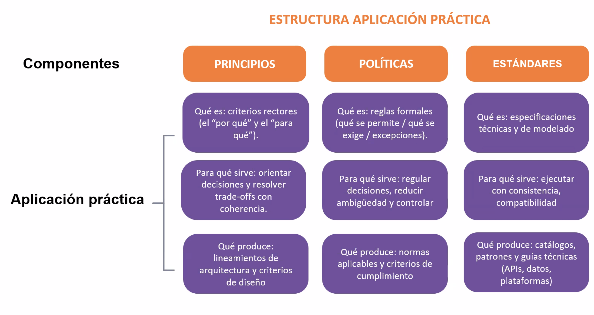
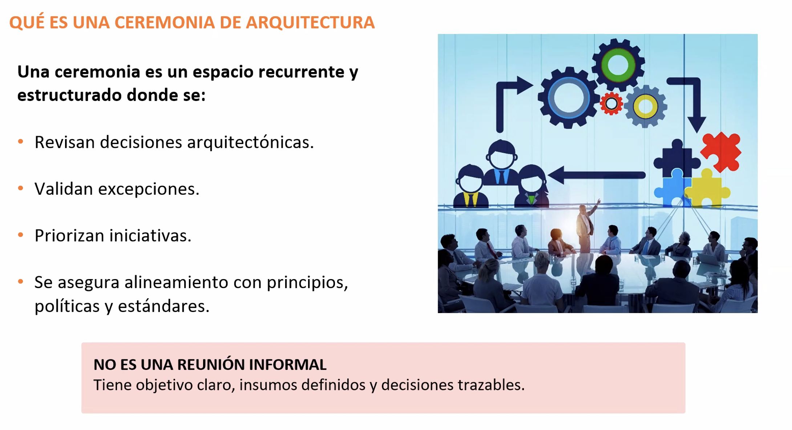

# Clase 4: Gobernanza de la Arquitectura Empresarial (AE)

**Profesor:** Richard Anthony Romero Mori  
**Fecha:** Clase 4 - 2026  
**Tema Central:** Gobernanza de la Arquitectura Empresarial

---

## 📋 Introducción

La gobernanza de la Arquitectura Empresarial es el marco que **convierte la estrategia en reglas de juego ejecutables**. No se trata de burocracia, sino de un mecanismo operativo que define quién toma las decisiones, bajo qué principios y cómo se alinean con la estrategia institucional.

> **Frase Clave:** *"La arquitectura se gobierna en decisiones, no en documentos"*

---

## 1. Fundamentos de la Gobernanza de AE

### Propósito
Definir un marco coherente para la toma de decisiones que:
- Evita decisiones aisladas (soluciones locales inconsistentes)
- Previene la acumulación de **deuda técnica/estructural**
- Asegura la sostenibilidad del valor generado

### Valor Generado
- **Coherencia global:** Todas las decisiones alineadas hacia un objetivo común
- **Sostenibilidad:** Control de cambios y trazabilidad que perduran en el tiempo
- **Eficiencia:** Reducción de conflictos transversales y decisiones costosas

---

## 2. El Trípode Normativo: Principios, Políticas y Estándares

La arquitectura se rige por **tres niveles de directrices** que forman un sistema coherente:

### 📊 Estructura de Aplicación Práctica



### 2.1 Principios

| Aspecto | Descripción |
|---------|-------------|
| **Qué es** | Declaraciones de alto nivel que orientan las decisiones. Son estables y pocos (típicamente 5-10) |
| **Para qué sirve** | Orientar decisiones y resolver trade-offs con coherencia |
| **Qué produce** | Lineamientos de arquitectura y criterios de diseño |

**Ejemplos de Principios:**
- "Los datos son un activo corporativo"
- "Reutilizar antes que construir"
- "La seguridad es de todos"
- "Minimizar acoplamiento entre sistemas"
- "Transparencia en la toma de decisiones"

### 2.2 Políticas

| Aspecto | Descripción |
|---------|-------------|
| **Qué es** | Reglas formales que operativizan los principios y definen límites de cumplimiento |
| **Para qué sirve** | Regular decisiones, reducir ambigüedad y controlar excepciones |
| **Qué produce** | Normas aplicables y criterios de cumplimiento |

**Ejemplos de Políticas:**
- "Trabajar únicamente con proveedores con historial comprobado de cumplimiento"
- "Toda solución debe cumplir con estándares de seguridad ISO 27001"
- "Se requiere aprobación del Comité de Arquitectura para decisiones sobre tecnologías críticas"
- "Las excepciones solo se aprueban si están justificadas y documentadas"

### 2.3 Estándares

| Aspecto | Descripción |
|---------|-------------|
| **Qué es** | Especificaciones técnicas y de modelado detalladas que evolucionan con la tecnología |
| **Para qué sirve** | Ejecutar con consistencia y compatibilidad |
| **Qué produce** | Catálogos, patrones y guías técnicas (APIs, datos, plataformas) |

**Ejemplos de Estándares:**
- Guía técnica para diseño de APIs REST
- Catálogo de patrones de arquitectura de datos
- Estándares de nomenclatura de aplicaciones
- Plataformas autorizadas para desarrollo
- Formatos de intercambio de datos

### Relación Jerárquica

```
PRINCIPIOS (Estables, estratégicos)
    ↓
POLÍTICAS (Dinámicas, normativas)
    ↓
ESTÁNDARES (Muy dinámicos, técnicos)
```

**Nota:** Los principios son los más estables y pocos; los estándares son los más dinámicos y numerosos.

---

## 3. Ceremonias y Comités de Arquitectura

### Definición de Ceremonia

Una ceremonia es un **espacio recurrente y estructurado** donde se:
- Revisan decisiones arquitectónicas
- Validan excepciones
- Priorizan iniciativas
- Aseguran alineamiento con principios, políticas y estándares

> **Importante:** NO es una reunión informal. Tiene objetivo claro, insumos definidos y decisiones trazables.



### Tres Niveles de Ceremonias

#### 3.1 Ceremonias Estratégicas

**Alcance:** Alineamiento con la estrategia empresarial y portafolio de cambios  
**Frecuencia:** Trimestral o semestral  
**Participantes:** Alta dirección, sponsor ejecutivo, arquitecto empresarial, dueños de capacidades  

**Objetivos:**
- Validar que los cambios propuestos alinean con la estrategia
- Resolver conflictos entre dominios de negocio
- Aprobar/rechazar iniciativas de alto impacto
- Revisar el roadmap arquitectónico

#### 3.2 Ceremonias Tácticas

**Alcance:** Diseño de soluciones y gestión de dependencias entre dominios  
**Frecuencia:** Quincenal  
**Participantes:** Arquitectos de dominio, arquitectos de solución, líderes de TI, representantes de negocio

**Objetivos:**
- Revisar diseños de soluciones antes de la ejecución
- Identificar dependencias y riesgos arquitectónicos
- Validar cumplimiento con estándares y políticas
- Identificar y escalar excepciones

#### 3.3 Ceremonias Operativas

**Alcance:** Ejecución diaria respetando estándares  
**Frecuencia:** Semanal  
**Participantes:** Equipos técnicos, PMO, representantes de arquitectura, QA

**Objetivos:**
- Asegurar que la implementación respeta estándares
- Identificar y resolver problemas de integración
- Gestionar deuda técnica detectada
- Validar calidad arquitectónica de entregas

### El Comité de Arquitectura

Es el **foro formal** donde se validan excepciones y se aprueban o rechazan propuestas.

**Función:** No es frenar proyectos, sino evitar inversiones mal alineadas o costosas a futuro.

**Responsabilidades:**
- Revisar y aprobar excepciones de políticas y estándares
- Validar propuestas de arquitectura contra principios corporativos
- Escalar decisiones que requieren sponsor ejecutivo
- Mantener trazabilidad de decisiones y sus justificaciones

---

## 4. Roles Clave en la Gobernanza

Para que la gobernanza sea efectiva, las **responsabilidades deben ser explícitas**:

### Sponsor Ejecutivo (Dirección)
**Responsabilidades:**
- Otorgar legitimidad a la gobernanza
- Resolver conflictos transversales escalados
- Aprobar políticas macro
- Asegurar presupuesto y recursos

### Arquitecto Empresarial
**Responsabilidades:**
- Custodio de la coherencia global "de inicio a fin"
- Mantener el mapa de capacidades actualizado
- Facilitar los comités de arquitectura
- Escalar conflictos sin resolver en otros niveles
- Comunicar la estrategia arquitectónica

### Arquitecto de Dominio
**Responsabilidades:**
- Especialista en áreas específicas (Datos, Aplicaciones, Negocio, Tecnología)
- Validar que las soluciones del dominio cumplen estándares
- Proponer nuevos estándares cuando es necesario
- Actuar como revisor arquitectónico en comités tácticos

### Arquitecto de Solución
**Responsabilidades:**
- El puente con los proyectos
- Diseñar soluciones específicas que encajen en el marco global
- Solicitar y justificar excepciones
- Asegurar que la solución es ejecutable por los equipos

### Dueños de Capacidades (Líderes de Negocio)
**Responsabilidades:**
- Validar que la arquitectura soporta realmente las necesidades del negocio
- Asegurar generación de valor real
- Participar en decisiones estratégicas
- Comunicar cambios en las necesidades del negocio

---

## 5. Casos Prácticos y Analogías

Durante la clase se presentaron ejemplos reales que ilustran la importancia de la gobernanza:

### Amazon: La Silla Vacía
**Concepto:** "Siempre hay una silla vacía reservada para el cliente" en toda decisión.

**Aplicación:**
- Todos los principios arquitectónicos están orientados a servir al cliente
- Las políticas no buscan control burocrático, sino mejora de la experiencia
- Los estándares existen para garantizar confiabilidad y seguridad

**Lección:** La gobernanza debe estar centrada en valor, no en restricción.

### Epic Games (Fortnite): Coherencia Multiplataforma
**Desafío:** Crear una experiencia coherente en móvil, consolas, PC y web.

**Solución:**
- Arquitectura de servicios compartidos (motor gráfico, sistemas de juego, etc.)
- Políticas claras sobre compatibilidad de versiones
- Estándares para sincronización de datos

**Lección:** Una gobernanza fuerte permite escalar sin perder coherencia.

### El Riesgo del Metaverso
**Problema:** Inversin masiva en arquitecturas que no lograron adopción o quedaron obsoletas.

**Causas:**
- Falta de alineamiento claro con la estrategia empresarial
- Ausencia de decisiones trazables y revisables
- No se validaron los principios que justificaban la inversión

**Lección:** La gobernanza protege contra decisiones estratégicas no validadas.

### IoT y Startups (Caso GoEuro)
**Desafío:** Integrar datos de múltiples transportes (trenes, buses, aviones).

**Éxito:**
- Estándares claros para integración de datos
- Políticas de interoperabilidad bien definidas
- Gobernanza que permitió evolucionar sin perder coherencia

**Lección:** La gobernanza facilita la interoperabilidad y la integración a escala.

---

## 6. Conclusiones Finales

### Puntos Clave

✅ **La gobernanza convierte la estrategia en reglas de juego ejecutables**
- No es teoría, es operación
- Cada regla tiene una justificación estratégica

✅ **Una estructura de roles clara reduce ambigüedad y retrocesos**
- Todos saben quién decide qué
- Se evitan conflictos por falta de claridad

✅ **La arquitectura deja de ser teoría cuando:**
- Las decisiones quedan documentadas
- Están vinculadas a un roadmap
- Son auditables y trazables

✅ **La gobernanza es sostenible cuando:**
- Genera valor real (no solo control)
- Es flexible para cambios tecnológicos
- Los roles son claros y legitimados

### El Ciclo Virtuoso

```
Estrategia Empresarial
    ↓
Principios (El "por qué")
    ↓
Políticas (El "qué")
    ↓
Estándares (El "cómo")
    ↓
Ceremonias (La "validación")
    ↓
Roles Claros (La "responsabilidad")
    ↓
Valor Sostenible
```

---

## 📚 Recursos Complementarios

- **Presentación:** `40096-S04-PRESENTACION.pdf` (y PPTX original)
- **Imágenes referencia:**
  - `tripode-normativo-ae.png`: Estructura de Aplicación Práctica (Principios, Políticas, Estándares)
  - `ceremonias-arquitectura-ae.png`: Definición y características de Ceremonias de Arquitectura

---

## ✨ Reflexión Final

> La gobernanza no es un obstáculo para la innovación, es el **habilitador de la innovación sostenible**. Define el espacio seguro donde los equipos pueden crear soluciones alineadas con la estrategia sin temor a crear conflictos o deuda técnica.

**La pregunta correcta no es:** "¿Por qué necesitamos gobernanza?"  
**La pregunta correcta es:** "¿Cómo hacemos que la gobernanza sea tan simple y valiosa que los equipos la abracen voluntariamente?"
