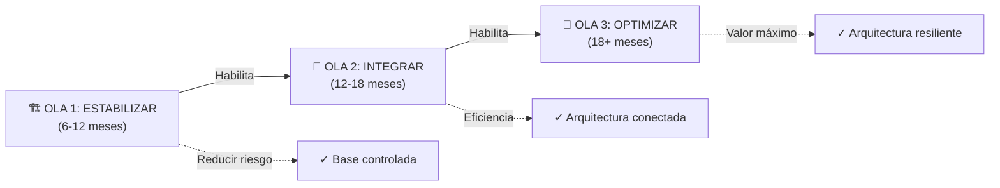

# Gestión del Portafolio Arquitectónico (Clase 5)

**Curso:** Arquitectura Empresarial (ISIL, 2026-1)  
**Docente:** Richard Anthony Romero Mori  
**Fecha:** 06/05/2026

---

## Resumen de la sesión

La gestión del portafolio arquitectónico es el puente entre estrategia empresarial y ejecución disciplinada. Esta clase cubrió tres pilares fundamentales: **evaluar dónde estamos (As-Is)**, **definir dónde queremos ir (To-Be)** y **planificar cómo llegar allá (Transición)**.

Sin gestión del portafolio, la arquitectura se fragmenta en proyectos aislados que generan redundancia, deuda técnica y desalineamiento estratégico.

---

## 1. Evaluación del Estado Actual (As-Is)

### ¿Qué es y por qué es crítico?

El estado actual no es una fotografía superficial de sistemas. Es un **diagnóstico estructural** que revela:

- Capacidades reales de negocio
- Dependencias ocultas
- Redundancias operativas
- Deuda técnica acumulada
- Riesgos que afectan la alineación estratégica

> **Idea clave:** Sin una evaluación rigurosa del As-Is, cada área modela su realidad de forma aislada. La deuda arquitectónica crece sin visibilidad.

### ¿Cómo se evalúa?

El análisis As-Is examina **cuatro capas integradas:**

| Capa | Qué se evalúa | Por qué importa |
|---|---|---|
| **Negocio** | Capacidades y procesos críticos | Define qué debe cambiar para cumplir estrategia |
| **Datos** | Calidad, duplicidad, gobierno | Base para decisiones confiables |
| **Aplicaciones** | Integración y obsolescencia | Identifica redundancias y riesgos |
| **Tecnología** | Estandarización y vigencia | Define qué infraestructura sostiene el cambio |

### Escala de Madurez Arquitectónica

El As-Is se mide en un espectro de madurez:

| Nivel | Estado | Características |
|---|---|---|
| **1 — Crítico** | No controlado | Procesos reactivos, sin estándares, sin trazabilidad |
| **2 — Bajo** | Bajo nivel de gestión | Prácticas básicas inconsistentes |
| **3 — Aceptable** | Gestionado | Procesos definidos, control parcial |
| **4 — Controlado** | Eficiente | Gobernanza clara, métricas establecidas |
| **5 — Optimizado** | Referente | Mejora continua, integración completa, replicable |

### Productos del As-Is

Una evaluación rigurosa produce:

- **Baseline arquitectónico:** Documentación del estado verificable
- **Mapa de deuda arquitectónica:** Excepciones, parches y riesgos acumulados
- **Identificación de brechas estructurales:** Qué falta, qué sobra, qué es crítico
- **Priorización preliminar:** Dónde concentrar esfuerzos de transformación

### Errores típicos al evaluar el As-Is

❌ **Confundir percepción con evidencia:** Evaluar por opinión, no por datos verificables

❌ **Mirar solo tecnología:** Ignorar negocio, datos y procesos integrados

❌ **No identificar dependencias:** Perder trazabilidad end-to-end

❌ **Subestimar deuda:** No documentar excepciones y parches reales

❌ **Desconectar de estrategia:** Hallazgos que no vinculan con objetivos del negocio

### Cómo evitar estos errores

✅ Evaluar las 4 capas con rigor estructural  
✅ Usar métricas, inventarios y evidencia formal  
✅ Mapear capacidades y dependencias transversales  
✅ Clasificar brechas por impacto (costo, riesgo, valor)  
✅ Conectar cada hallazgo explícitamente con la estrategia  

> **Conclusión:** El portafolio arquitectónico es el puente entre la estrategia declarada y la transformación ejecutada. Sin As-Is riguroso, no hay decisiones gobernadas.

---

## 2. Definición del Estado Futuro (To-Be)

### ¿Qué es el To-Be?

El estado futuro (To-Be) es la **arquitectura objetivo** que describe cómo debe estar configurado el negocio, datos, aplicaciones y tecnología para soportar la estrategia en un horizonte definido.

**No es una aspiración abstracta.** Es una arquitectura:

- Alineada explícitamente con objetivos estratégicos
- Diseñada para cerrar brechas específicas del As-Is
- Gobernable mediante principios, políticas y estándares
- Trazable y sostenible en el tiempo

### Componentes estructurales del To-Be

#### Principios Arquitectónicos

**Qué son:** Directrices estratégicas que orientan el diseño de la arquitectura futura

**Para qué sirven:** Alinear decisiones de diseño con la estrategia

**Ejemplos:** "Datos como activo estratégico", "Integración por APIs", "Cloud-first"

**Producen:** Criterios de arquitectura objetivo que guían decisiones

#### Políticas Arquitectónicas

**Qué son:** Reglas formales que regulan cómo se implementará el To-Be

**Para qué sirven:** Evitar desviaciones del modelo objetivo, asegurar coherencia

**Ejemplos:** "Toda nueva solución debe cumplir estándares de seguridad X", "Migración obligatoria a cloud en 2027"

**Producen:** Lineamientos vinculantes para todos los proyectos

#### Estándares Técnicos

**Qué son:** Especificaciones técnicas que materializan el objetivo arquitectónico

**Para qué sirven:** Ejecutar con consistencia, interoperabilidad y escalabilidad

**Ejemplos:** Catálogo de plataformas permitidas, modelos BI, APIs estándar, patrones de integración

**Producen:** Guías técnicas vinculantes que unifican implementación

### Gobernanza del To-Be: Ceremonias Tácticas

Para asegurar que el To-Be sea riguroso y coherente, existen ceremonias estructuradas:

#### Ceremonia de Diseño (Validación Técnica)

**Entrada (inputs):**
- Propuesta de arquitectura objetivo (To-Be)
- Brechas identificadas (As-Is → To-Be)
- Alternativas de solución y trade-offs
- Impactos técnicos y de negocio

**Proceso:**
- Arquitectos empresariales y de dominio revisan la propuesta
- Se validan impactos, dependencias y alineamiento con principios
- Se identifican riesgos y excepciones necesarias

**Salida (outputs):**
- Diseño validado o ajustado
- Recomendación técnica formal
- Riesgos y dependencias identificadas
- Insumos preparados para decisión ejecutiva

> **Principio:** La ceremonia diseña con criterio técnico. El comité decide con criterio estratégico.

#### Comité de Aprobación (Decisión Estratégica)

**Entrada (inputs):**
- Arquitectura validada técnicamente
- Análisis de impacto (costo, riesgo, valor)
- Roadmap y priorización propuesta
- Excepciones o solicitudes especiales

**Proceso:**
- Líderes ejecutivos y responsables de negocio deciden qué se aprueba
- Se establece prioridad en el portafolio
- Se fijan condiciones o restricciones formales

**Salida (outputs):**
- Decisión aprobada o rechazada
- Priorización oficial en el portafolio
- Registro formal en repositorio arquitectónico

### Definiciones Experta

| Perspectiva | Definición |
|---|---|
| **TOGAF® (The Open Group)** | La arquitectura objetivo que cierra brechas del As-Is, guía inversión y establece el rumbo de la transformación, alineada con objetivos de negocio y resultados tangibles. |
| **Ross, Weill & Robertson (Enterprise Architecture as Strategy)** | El modelo operativo deseado que habilita ejecución disciplinada de la estrategia mediante integración, estandarización y claridad de procesos. No es solo tecnología: es cómo opera la organización. |
| **Scott Bernard (An Introduction to Enterprise Architecture)** | La descripción integrada de capacidades, estructuras, procesos y recursos tecnológicos para alcanzar objetivos estratégicos. Debe ser coherente, realista, medible y gobernable. |
| **Jeanne Ross (MIT CISR)** | Define la arquitectura que permite ejecución repetible y escalable, reduciendo variabilidad y deuda estructural. La clave es lo estratégicamente viable y sostenible, no lo "ideal". |
| **John Zachman (Framework Creator)** | Asegurar que todas las perspectivas (qué, cómo, dónde, quién, cuándo, por qué) estén cubiertas en coherencia estructural. Un To-Be incompleto genera vacíos arquitectónicos. |

### Conclusiones sobre el To-Be

✅ El To-Be no es una aspiración teórica: es la arquitectura objetivo alineada con estrategia

✅ Traduce objetivos estratégicos en capacidades, estructuras y lineamientos coherentes

✅ Implica decisiones conscientes sobre qué estandarizar, integrar, transformar o retirar

✅ Debe ser gobernable: trazable a principios, políticas y estándares

✅ Sin To-Be claro, el portafolio se fragmenta y pierde alineamiento

✅ El verdadero valor está en guiar la transición disciplinada hacia arquitectura sostenible

---

## 3. Planeamiento de la Transición

### ¿Qué es la transición?

Es el proceso que convierte la arquitectura objetivo (To-Be) en un **conjunto estructurado de iniciativas ejecutables**, priorizadas y secuenciadas.

**Conecta:**
- Brechas identificadas en el As-Is
- Proyectos concretos definidos
- Dependencias y restricciones
- Valor estratégico y viabilidad operativa

> **Idea central:** La transformación no ocurre de golpe. Se gobierna por etapas con lógica de valor y dependencia.

### ¿Por qué es crítica?

- **Reduce riesgo:** Evita transformaciones improvisadas
- **Asigna recursos:** Con criterio de valor, impacto y factibilidad
- **Asegura coherencia:** Entre estrategia, capacidades e inversiones
- **Convierte visión en realidad:** Evita que el To-Be sea solo documento aspiracional

### Componentes clave

1. **Gap Analysis:** Identificación de brechas entre As-Is y To-Be
2. **Definición de iniciativas:** Proyectos, programas y actividades necesarias
3. **Priorización:** Impacto vs. esfuerzo, riesgo vs. valor
4. **Gobernanza:** Control del avance y excepciones
5. **Gestión de dependencias:** Orden lógico de ejecución

### Estructura típica de la transición

```
Baseline (As-Is)
    ↓
Brechas identificadas + Iniciativas definidas
    ↓
Agrupación en olas (Release Waves)
    ↓
Roadmap arquitectónico
    ↓
Ejecución gobernada
    ↓
To-Be alcanzado
```

**Buena práctica:** Secuenciar iniciativas según impacto estratégico y habilitadores previos. No todo puede hacerse al mismo tiempo.

### Las Tres Olas de Transformación

**Visualización del ciclo transformacional:**



#### Ola 1: ESTABILIZAR
**Objetivo:** Ordenar y reducir riesgo estructural

**Iniciativas típicas:**
- Resolver brechas críticas del As-Is
- Eliminar redundancias y excepciones graves
- Estandarizar tecnologías base y políticas mínimas
- Alinear capacidades críticas con estrategia inmediata
- Establecer métricas y mecanismos de control

**Resultado:** Base controlada y coherente para evolucionar

**Duración aproximada:** 6-12 meses (según complejidad)

#### Ola 2: INTEGRAR
**Objetivo:** Conectar dominios y habilitar eficiencia end-to-end

**Iniciativas típicas:**
- Integrar aplicaciones y datos clave
- Automatizar procesos transversales
- Consolidar plataformas redundantes
- Mejorar interoperabilidad y trazabilidad
- Optimizar dependencias entre capacidades

**Resultado:** Arquitectura conectada, menos fricción operativa

**Duración aproximada:** 12-18 meses

#### Ola 3: OPTIMIZAR Y ESCALAR
**Objetivo:** Maximizar valor estratégico y competitividad

**Iniciativas típicas:**
- Escalar capacidades digitales (cloud, APIs, mobile)
- Incorporar innovación (analytics, IA, IoT)
- Optimizar experiencia de cliente
- Reducir costos estructurales
- Preparar arquitectura para crecimiento futuro

**Resultado:** Arquitectura resiliente, flexible y orientada a valor

**Duración aproximada:** 18+ meses (continua)

### Puntos Clave

✅ Cada ola responde a dependencias previas

✅ No todo puede hacerse simultáneamente

✅ La secuencia debe justificarse por impacto estratégico, riesgo y habilitadores técnicos

✅ El roadmap arquitectónico es el puente entre visión y ejecución disciplinada

> **Distinción crítica:** Un roadmap arquitectónico NO es una lista de proyectos. Es una secuencia lógica trazable que conecta brechas, capacidades e iniciativas con objetivos estratégicos.

### Conclusiones sobre la Transición

✅ Convierte la visión To-Be en un camino ejecutable, priorizado y gobernado

✅ Las olas permiten gestionar dependencias, riesgos y capacidad organizacional

✅ No es un documento: es un proceso vivo de ejecución y ajuste

✅ Bien gobernada, reduce deuda arquitectónica futura y asegura valor sostenido

---

## 4. Síntesis: As-Is, To-Be y Transición Conectados

| Componente | Enfoque | Producción | Objetivo |
|---|---|---|---|
| **As-Is** | Diagnóstico actual | Baseline, brechas, deuda técnica | Identificar qué cambiar y por qué |
| **To-Be** | Arquitectura objetivo | Principios, políticas, estándares | Definir cómo debería operar |
| **Transición** | Plan de ejecución | Roadmap, olas, iniciativas | Secuenciar cambio con disciplina |

### Gestión sin portafolio vs. Con portafolio

**Sin Gestión Estratégica:**
- Se dispersa la inversión
- Se duplican soluciones
- Se pierde coherencia arquitectónica
- Deuda acumulada sin visibilidad

**Con Gestión Disciplinada:**
- La arquitectura se convierte en instrumento de gobierno
- Las decisiones son trazables
- El cambio se ejecuta con orden y propósito
- Valor se entrega de forma sostenida

---

## Conclusiones Finales

1. **La gestión del portafolio arquitectónico conecta estrategia y ejecución.** Diagnósticos rigurosos se convierten en decisiones priorizadas y trazables.

2. **Evaluar As-Is con rigor permite identificar brechas reales, dependencias críticas y riesgos.** Sin evidencia, la arquitectura es percepción, no gobernanza.

3. **Definir To-Be no es imaginar tecnología ideal, sino diseñar capacidades alineadas al valor estratégico del negocio.** Debe ser coherente, realista, medible y gobernable.

4. **El planeamiento de la transición convierte visión en secuencia gobernada.** Equilibra impacto, riesgo y esfuerzo sin generar disrupciones innecesarias.

5. **En conjunto, As-Is, To-Be y transición estructuran una arquitectura empresarial orientada a valor sostenible, coherencia organizacional y disciplina estratégica.**

---

## Referencias Bibliográficas

- The Open Group. (2011). TOGAF® Version 9.1. The Open Group Standard.

- Lankhorst, M. (Ed.). (2017). Enterprise Architecture at Work: Modelling, Communication and Analysis (4th ed.). Springer.

- Object Management Group (OMG). (2014). Business Process Model and Notation (BPMN) Version 2.0.2.

- Object Management Group (OMG). (2017). Unified Modeling Language (UML) Version 2.5.

- ISO/IEC 42010. (2011). Systems and Software Engineering – Architecture Description.

- Gartner. (varios autores). Enterprise Architecture Practice and Capability-Based Planning.
