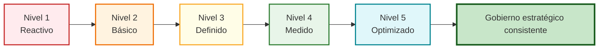

# Modelos de Madurez y Gobierno Estratégico (Clase 6)

**Curso:** Arquitectura Empresarial (ISIL, 2026-1)  
**Docente:** Richard Anthony Romero Mori  
**Fecha:** 12/05/2026  
**Archivo PPT:** 40096-S06-PRESENTACION.pptx

## 📌 Introducción

En esta clase exploramos cómo las organizaciones evolucionan desde prácticas arquitectónicas reactivas hacia modelos estructurados, medibles y optimizados. El énfasis está en entender que **la madurez arquitectónica no mide documentación**, sino la **capacidad organizacional de tomar decisiones consistentes y repetibles** alineadas a la estrategia.

## Mapa visual de niveles de madurez



El gráfico simplifica la progresión central de la clase: pasar de decisiones aisladas a un modelo gobernado, medible y optimizable.

---

## 🎯 Concepto Central: Madurez Arquitectónica

### ¿Qué es la Madurez Arquitectónica?

**Definición:** La capacidad de una organización para transformar estrategia en ejecución consistente a través de prácticas arquitectónicas estructuradas, medibles y alineadas.

**Principios Clave:**

1. **No es sobre documentación** — No importa cuántos documentos existen, sino qué tan gobernadas, repetibles y coherentes son las decisiones.
2. **Progresiva, no binaria** — Evoluciona desde prácticas reactivas hasta modelos institucionalizados (no es "maduro" o "no maduro").
3. **Medio, no fin** — Su objetivo es reducir riesgo, deuda técnica y dispersión de inversiones.
4. **Refleja coherencia** — Evalúa alineamiento entre estrategia, portafolio, diseño e implementación.

### Implicaciones para la Organización

| Aspecto | Sin Madurez | Con Madurez |
|---|---|---|
| **Gobierno** | Simbólico, sin poder real | Estructural, con decisiones trazables |
| **Portafolio** | Disperso, sin foco estratégico | Alineado, priorizado y coherente |
| **Ejecución** | Genera deuda técnica | Reduce deuda mediante arquitectura |
| **Predecibilidad** | Baja, improvisación constante | Alta, decisiones repetibles |

---

## 📊 Evaluación del Estado Actual (AS-IS)

### ¿Cómo se evalúa la madurez?

La evaluación responde preguntas como:

- ¿Existe un proceso formal para decisiones arquitectónicas?
- ¿Se pueden repetir decisiones con consistencia?
- ¿Se mide el impacto de cambios arquitectónicos?
- ¿La arquitectura está integrada en el gobierno corporativo?
- ¿Hay alineamiento visible entre negocio y tecnología?

### Diagnosticando Brecha (Gap Analysis)

**AS-IS (Estado Actual):** Prácticas existentes, nivel de control, gobernanza actual
**TO-BE (Estado Deseado):** Nivel de madurez objetivo basado en estrategia
**GAP:** Diferencia identificada que requiere plan de mejora

**Ejemplo práctico:** Un banco puede estar en nivel 2 (prácticas básicas) pero su estrategia de transformación digital exige nivel 4 (prácticas optimizadas).

---

## 🏆 MODELOS DE MADUREZ

### 1. CMMI (Capability Maturity Model Integration)

**¿Qué significa?** Modelo Integrado de Madurez de Capacidades

**Origen:** Ingeniería de procesos y gestión de software

#### Lo que Evalúa CMMI

- Formalización de procesos
- Repetibilidad de decisiones
- Medición y control estadístico
- Optimización progresiva
- Disciplina operativa

#### Pregunta Central CMMI

> "¿Lo haces de manera repetible, medible y sostenible?"
> 
> NO pregunta "¿Lo haces bien?" → Pregunta sobre **capacidad organizacional**, no sobre calidad individual.

#### Niveles CMMI (5 escalas)

| Nivel | Nombre | Característica |
|---|---|---|
| **1** | Inicial | Prácticas ad-hoc, éxito depende de individuos |
| **2** | Administrado | Procesos documentados, repetibles |
| **3** | Definido | Procesos estándares, institucionalizados |
| **4** | Gestionado Cuantitativamente | Procesos medidos, datos para control |
| **5** | Optimizado | Mejora continua, innovación sistemática |

#### Fortaleza y Limitación

**Fortaleza:** Estructura rigurosa para institucionalizar prácticas, foco en disciplina operativa

**Limitación:** Puede enfocarse demasiado en procesos y menos en **alineamiento estratégico** (más técnico que estratégico)

---

### 2. TOGAF Capability Maturity Model

**Origen:** The Open Group Architecture Framework

**Diferencia clave con CMMI:** 

- **CMMI** = Mide disciplina operativa
- **TOGAF** = Mide capacidad arquitectónica estratégica

#### Lo que Evalúa TOGAF

- Gobierno arquitectónico (estructura, roles, responsabilidades)
- Integración con estrategia empresarial
- Uso de repositorio de arquitectura
- Participación en decisiones de portafolio
- Medición de valor y ROI

#### Niveles TOGAF (0-5 escalas)

| Nivel | Descripción |
|---|---|
| **0** | Sin madurez — Arquitectura no existe como función |
| **1** | Inicial — Esfuerzos aislados, sin gobernanza |
| **2** | Repetible — Procesos definidos, pero inconsistentes |
| **3** | Definido — Métodos estándar, integrados en procesos |
| **4** | Medido — Métricas de desempeño y valor |
| **5** | Optimizado — Mejora continua, arquitectura como ventaja competitiva |

#### Fortaleza y Limitación

**Fortaleza:** Alineado a arquitectura empresarial, foco en valor estratégico

**Diferencia:** TOGAF enfatiza que arquitectura es una función de **decisión estratégica**, no solo procesos

---

## 🔗 Relación con Gobierno, Portafolio y Ejecución

### Sin Madurez Arquitectónica

```
Gobierno ❌ (simbólico)
    ↓
Portafolio ❌ (sin foco)
    ↓
Ejecución ❌ (deuda técnica)
```

### Con Madurez Arquitectónica

```
Gobierno ✅ (estructurado)
    ↓
Portafolio ✅ (alineado)
    ↓
Ejecución ✅ (coherencia)
```

**Conclusión:** La madurez arquitectónica es el **nivel de control estructural** que tiene la organización sobre su propia transformación.

---

## 💡 Conclusiones Clave

### 1. La Madurez no es Documentación

Mide la **capacidad organizacional** para tomar decisiones estructuradas, repetibles y alineadas a la estrategia. Un archivo de 200 páginas sin gobernanza = baja madurez.

### 2. Mayor Madurez = Mayor Coherencia

A mayor madurez arquitectónica:
- Mayor coherencia entre gobierno, portafolio e implementación
- Menos improvisación
- Menos deuda técnica
- Mayor predictibilidad

### 3. La Madurez es Progresiva

No es un destino, sino un **camino de evolución**:
- **Etapa 1:** Prácticas reactivas (dependen de individuos)
- **Etapa 2:** Procesos definidos (documentados, repetibles)
- **Etapa 3:** Integración estratégica (alineados a negocio)
- **Etapa 4:** Medición y control (datos para decisiones)
- **Etapa 5:** Optimización continua (innovación sistemática)

### 4. Diagnóstico es el Punto de Partida

Evaluar la madurez actual permite:
- Identificar brechas (AS-IS vs TO-BE)
- Diseñar planes de mejora estructurados
- Fortalecer arquitectura como **función estratégica transversal**, no como soporte técnico aislado

---

## 📚 Conceptos Relacionados

- **Gobierno Corporativo:** Marco de toma de decisiones y control
- **Portafolio Arquitectónico:** Inventario de proyectos/iniciativas alineados
- **Deuda Técnica:** Acumulación de decisiones arquitectónicas subóptimas
- **Alineamiento Estratégico:** Coherencia entre objetivos de negocio y ejecución técnica

---

## 🎓 Reflexión Final

La pregunta fundamental no es "¿Tenemos documentos de arquitectura?" sino **"¿Nuestra organización puede tomar decisiones arquitectónicas consistentes, repetibles y alineadas a nuestra estrategia?"**

Si la respuesta es sí, tienes madurez. Si es no, tienes documentación sin impacto.

---

**Última actualización:** 12/05/2026 | **Clase 6: Modelos de Madurez y Gobierno Estratégico**
