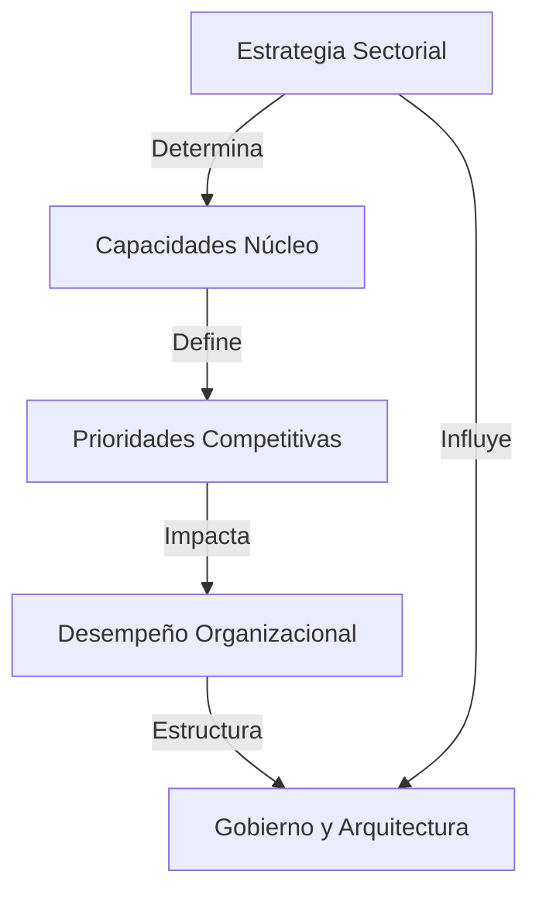

# Enfoques de Arquitectura Empresarial según Sector (Clase 7)

**Curso:** Arquitectura Empresarial (ISIL, 2026-1)  
**Docente:** Richard Anthony Romero Mori  
**Fecha:** [pendiente]

---

## Introducción

La arquitectura empresarial no se diseña en abstracto; **responde a las dinámicas estratégicas del sector** en que opera la organización. Cada industria prioriza capacidades distintas: regulación, eficiencia, velocidad, innovación, seguridad o servicio ciudadano.

El alineamiento estratégico exige que la arquitectura traduzca la **lógica competitiva y el modelo de negocio** dominante en principios, capacidades y gobierno coherente.

---

## Marco Conceptual: Arquitectura como Traductor Estratégico



**Principio clave:** La arquitectura empresarial madura comienza entendiendo en qué industria compite la organización.

---

## Arquitectura Empresarial por Sector

### 1. Sector Financiero

**Presiones estratégicas:** Riesgo, regulación, cumplimiento

| Aspecto | Característica |
|--------|----------------|
| **Prioridad** | Riesgo, regulación y control |
| **Arquitectura** | Altamente gobernada y trazable |
| **Foco** | Datos, cumplimiento y resiliencia |
| **Gobernanza** | Marco regulatorio estricto (Basilea III, normativas locales) |

**Ejemplo: Banco Retail**

Una entidad financiera necesita:
- **Sistemas altamente auditables** para cada transacción
- **Segregación de datos** por cliente y tipo de operación
- **Redundancia crítica** para continuidad operativa
- **Trazabilidad completa** de flujos de dinero

**Aplicación:** Arquitectura con capas de control, auditoría y cumplimiento normativo integradas desde el diseño.

---

### 2. Sector Retail

**Presiones estratégicas:** Experiencia del cliente, velocidad, diferenciación

| Aspecto | Característica |
|--------|----------------|
| **Prioridad** | Experiencia del cliente y velocidad |
| **Arquitectura** | Modular, omnicanal y escalable |
| **Foco** | Analítica y personalización |
| **Gobernanza** | Ágil, basada en feedback continuo |

**Ejemplo: Retail Omnicanal**

Un grupo retail necesita:
- **APIs expuestas** para integración con marketplace
- **Motor de recomendaciones** en tiempo real
- **Sincronización de inventario** entre canal físico y digital
- **Adaptabilidad** para lanzar nuevas experiencias rápidamente

**Aplicación:** Microservicios, APIs REST, bases de datos distribuidas, analítica en tiempo real.

---

### 3. Sector Salud

**Presiones estratégicas:** Seguridad, confidencialidad, continuidad

| Aspecto | Característica |
|--------|----------------|
| **Prioridad** | Seguridad, confidencialidad y continuidad |
| **Arquitectura** | Interoperabilidad entre sistemas clínicos |
| **Foco** | Resiliencia y regulación HIPAA/GDPR |
| **Gobernanza** | Estándares HL7, DICOM, auditoría médico-legal |

**Ejemplo: Hospital Red de Atención**

Un hospital necesita:
- **Historiales médicos integrados** pero segregados por privacidad
- **Interoperabilidad** entre radiología, laboratorio, farmacia
- **Backup automático** de datos clínicos críticos
- **Trazabilidad** de acceso a datos sensibles (quién accedió qué y cuándo)

**Aplicación:** Arquitectura en capas con encriptación, logs de auditoría y protocolos de interoperabilidad.

---

### 4. Sector Industrial

**Presiones estratégicas:** Eficiencia operativa, optimización de procesos

| Aspecto | Característica |
|--------|----------------|
| **Prioridad** | Eficiencia operativa y automatización |
| **Arquitectura** | Integración IT–OT y gestión de activos |
| **Foco** | Optimización de procesos |
| **Gobernanza** | OEE (Overall Equipment Effectiveness) |

**Ejemplo: Manufactura Inteligente**

Una planta industrial necesita:
- **Sensores IoT** en máquinas para monitoreo en tiempo real
- **Integración IT-OT** entre sistemas empresariales y sistemas de planta
- **Predictive maintenance** para evitar paros no planeados
- **Dashboards operacionales** para toma de decisiones rápida

**Aplicación:** Edge computing, arquitectura de eventos, integración MQTT/OPC-UA.

---

### 5. Sector Público

**Presiones estratégicas:** Transparencia, servicio ciudadano, control presupuestal

| Aspecto | Característica |
|--------|----------------|
| **Prioridad** | Transparencia, servicio ciudadano y control presupuestal |
| **Arquitectura** | Gobernanza normativa fuerte |
| **Foco** | Interoperabilidad institucional |
| **Gobernanza** | Rendición de cuentas, LRFD, estándares públicos |

**Ejemplo: Gobierno Electrónico**

Un ministerio necesita:
- **Acceso a ciudadanos** desde múltiples canales (web, móvil, presencial)
- **Interoperabilidad** con otras entidades públicas (Hacienda, RENIEC, etc.)
- **Transparencia** en procesos y presupuestos
- **Seguridad** contra ciberataques a infraestructura crítica

**Aplicación:** Servicios compartidos, arquitectura de gobierno interoperable (SOA).

---

## Variables que Moldean la Arquitectura

Independientemente del sector, estos factores determinan el diseño:

| Variable | Impacto |
|----------|--------|
| **Nivel de regulación** | Define gobernanza, auditoría y compliance |
| **Criticidad operativa** | Determina redundancia y RTO/RPO |
| **Sensibilidad de datos** | Exige encriptación, segregación y acceso restringido |
| **Velocidad de cambio** | Requiere flexibilidad y capacidad de evolución |
| **Mensajes de negocio** | Define qué capacidades IT son diferenciadores |

---

## Lógica Competitiva por Sector

```
┌─────────────────────────────────────────────────────────────┐
│ Sectores altamente competitivos (Retail, Tech)              │
│ → Priorizan: velocidad, diferenciación, experiencia         │
│ → Arquitectura: ágil, modular, orientada al cambio          │
└─────────────────────────────────────────────────────────────┘

┌─────────────────────────────────────────────────────────────┐
│ Sectores regulados (Financiero, Farmacéutico)               │
│ → Priorizan: control, cumplimiento, trazabilidad            │
│ → Arquitectura: determinista, auditada, gobernada           │
└─────────────────────────────────────────────────────────────┘

┌─────────────────────────────────────────────────────────────┐
│ Sectores industriales (Manufactura, Logística)              │
│ → Priorizan: eficiencia operativa, optimización             │
│ → Arquitectura: integrada IT-OT, predictiva                 │
└─────────────────────────────────────────────────────────────┘

┌─────────────────────────────────────────────────────────────┐
│ Sector público (Gobierno, Salud Pública)                    │
│ → Priorizan: transparencia, continuidad, servicio           │
│ → Arquitectura: interoperable, resiliente, abierta          │
└─────────────────────────────────────────────────────────────┘
```

---

## Caso Integrado: Arquitectura de Banca Digital

### Contexto estratégico

Banco tradicional que quiere transformarse en una fintech: captar clientes jóvenes, reducir costos de sucursales, mejorar velocidad de onboarding.

### Conflicto de presiones

| Presión | Requerimiento | Decisión Arquitectónica |
|---------|--------------|------------------------|
| **Innovación** (retail) | Lanzar productos en semanas | Microservicios, APIs |
| **Regulación** (financiero) | Auditar cada transacción | Logs centralizados, blockchain privado |
| **Seguridad** (financiero) | Proteger datos de clientes | Encriptación en reposo y tránsito |
| **Escalabilidad** (retail) | Crecer sin parar de innovar | Infraestructura en cloud multi-región |

### Modelo arquitectónico resultante

**Backend financiero** (altamente gobernado, COBOL/mainframe para core)

**APIs gateway** (capa intermedia segura y auditada)

**Aplicaciones digitales** (microservicios ágiles para experiencia)

**Analítica** (datos de comportamiento para machine learning)

**Resultado:** Arquitectura bimodal que reconcilia innovación y cumplimiento.

---

## Checklist: ¿Tu arquitectura está alineada con el sector?

- [ ] ¿Identificaste las 3 prioridades estratégicas de tu industria?
- [ ] ¿Los principios arquitectónicos reflejan la lógica competitiva?
- [ ] ¿Las capacidades críticas están explícitamente mapeadas?
- [ ] ¿La gobernanza es proporcional al riesgo del sector?
- [ ] ¿El gobierno corporativo está alineado con el modelo de negocio?
- [ ] ¿Hay fricción entre presiones contradictorias? ¿Cómo se reconcilian?


---

## Conceptos Avanzados y Patrones Arquitectónicos por Sector

### Patrones Arquitectónicos Dominantes

| Sector | Patrón Arquitectónico Común | Justificación |
|--------|-----------------------------|---------------|
| **Financiero** | SOA (Service Oriented Architecture) y Core/Mainframe (Monolito) acoplado a APIs. | El core requiere extrema coherencia transaccional (ACID), mientras las interfaces requieren agilidad. |
| **Retail** | Microservicios y EDA (Event-Driven Architecture). | Capacidad para escalar servicios individualmente en picos de demanda (ej. Cyber Monday) sin afectar el sistema completo. |
| **Industrial** | Arquitectura de 3 capas (Edge, Fog, Cloud) + Gemelos Digitales (Digital Twins). | Los sensores requieren procesamiento de baja latencia (Edge) antes de enviar métricas consolidadas a la nube. |

---

## Ejemplos Adicionales de Aplicación Sectorial

### Caso: Smart City - Gestión de Tráfico (Sector Público)
**Capacidad Estructural:** Procesamiento en tiempo real e interconectividad masiva.
**Arquitectura:** Los semáforos y cámaras operan localmente vía Edge Computing. Cada 5 segundos envían telemetría vía 5G a un Data Lake gubernamental integrado con servicios de emergencia médica y bomberos.

### Caso: Open Banking (Sector Financiero)
**Capacidad Estructural:** Apertura segura de capacidades core a terceros.
**Arquitectura:** Implementación de un API Gateway robusto con protocolos de autenticación OAuth 2.0 y OpenID Connect, permitiendo que Fintechs accedan al historial crediticio de los clientes para ofrecer productos personalizados.

---

## Glosario de Términos

- **Trazabilidad:** Capacidad de reconstruir el historial, uso o localización de una entidad, proceso o transacción mediante registros de auditoría (crítico en bancos).
- **Omnicanalidad:** Integración arquitectónica de todos los canales de atención (web, móvil, tiendas físicas) garantizando que la experiencia del usuario sea fluida y compartida sin importar el medio.
- **IT-OT (Information Technology - Operational Technology):** Convergencia entre el software empresarial (IT) y el hardware/sistemas que controlan procesos industriales reales (OT).
- **HL7 / DICOM:** Estándares globales para la transmisión de información clínica y médica (imágenes, textos) en el sector salud.
- **RTO/RPO (Recovery Time Objective / Recovery Point Objective):** Métricas de arquitectura de continuidad y disaster recovery. El límite de tiempo para restaurar servicio (RTO) y la pérdida máxima de datos tolerada (RPO).
- **Arquitectura Bimodal:** Configuración operativa donde se mantiene un sistema robusto, estable y lento para operaciones core (Modo 1), junto con un sistema ágil, rápido y experimental para el front-end y experiencia del usuario (Modo 2).
