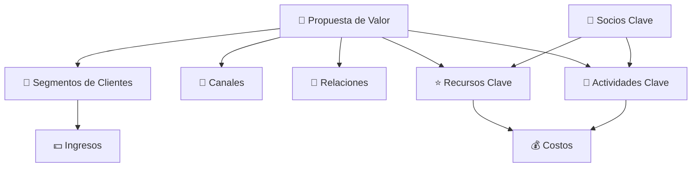

# Arquitectura del negocio y capacidades empresariales (Clase 9)

**Curso:** Arquitectura Empresarial (ISIL, 2026-1)
**Docente:** Richard Anthony Romero Mori
**Fecha:** [Confirmar con docente]

---

## Resumen ejecutivo
Esta clase aborda a profundidad la **arquitectura del negocio** como base estratégica para diseñar soluciones empresariales. El foco está en cómo la organización estructura capacidades, procesos y recursos para ejecutar su estrategia, y en cómo esa definición impacta la efectividad de la tecnología, el modelo de negocio y la estructura organizacional.

## 1. Introducción y contexto de la sesión
- **Profesor:** Richard Anthony Romero Mori.
- **Tema principal:** Arquitectura de negocio, estructura organizacional, capacidades empresariales, mapeo de procesos clave, flujos de valor y Business Model Canvas.
- **Definición clave:** La **arquitectura de negocio** es el punto de partida para comprender cómo una organización estructura sus capacidades, procesos y recursos para ejecutar su estrategia de manera coherente. No se limita a describir un organigrama, sino que analiza cómo la empresa genera y aporta valor a través de sus áreas funcionales.

---

## 2. Dinámica de aprendizaje: la filosofía "Gung Ho"
Para ilustrar el tema de capacidades organizacionales y alineamiento estratégico, el profesor compartió un video basado en la filosofía *Gung Ho*.

### A. El Espíritu de la Ardilla (Trabajo que vale la pena)
Consiste en lograr que el personal entienda el impacto real de su función.

1. **Saber que el trabajo es importante:** entender que lo que se hace contribuye a mejorar el mundo.
2. **Metas compartidas:** tener un objetivo común aceptado por todos, no solo impuesto por la dirección.
3. **Valores como guía:** las metas miran al futuro, los valores se viven en el presente.

> 💡 **Ejemplo del video:** en una planta en crisis, las personas pensaban que solo fabricaban piezas sin importancia. Al ver que su trabajo facilitaba que agricultores mejoraran cosechas y alimentaran a personas necesitadas, ganaron propósito y motivación.

> 💡 **Ejemplo complementario:** lavar platos en la universidad es clave para evitar bacterias que podrían enfermar a toda una clase.

### B. El Método del Castor (Mantener el control para alcanzar la meta)
Plantea una estructura horizontal donde cada persona controla su propio trabajo.
- **Autonomía alineada:** los trabajadores deciden cómo realizar la tarea mientras respetan metas y capacidades.
- Si la administración monopoliza decisiones, se destruye la proactividad.

---

## 3. Estructura organizacional y capacidades empresariales
Se presentó el **Capability Map** como la representación de las habilidades organizacionales necesarias para ejecutar la estrategia.

### ¿Qué es un Capability Map?
- Representa lo que la organización **debe saber hacer**.
- Es independiente del organigrama actual.
- Es relativamente estable en el tiempo.
- No describe tareas puntuales, sino habilidades colectivas.

### Propiedades clave
- **Independencia:** no se confunde con la estructura orgánica.
- **Estabilidad:** las capacidades macro cambian poco.
- **Jerarquía:** permite visualizar el alcance funcional.
- **Enfoque estratégico:** ayuda a priorizar inversiones en capacidades que realmente mueven la estrategia.

---

## 4. Mapeo de procesos clave y flujos de valor
- **Propósito:** identificar procesos críticos que transforman inputs en outputs de valor.
- **Utilidad:** evaluar eficiencia, detectar brechas y oportunidades de mejora.
- Un buen mapeo muestra cómo los recursos se convierten en valor para el cliente.

---

## 5. Business Model Canvas
Herramienta estratégica que integra visualmente: propuesta de valor, clientes, canales, actividades, recursos clave y estructura de costos.

### Para qué sirve
- Analizar la coherencia entre el modelo de negocio y la arquitectura organizacional.
- Identificar impactos de cambios en un bloque sobre el resto.
- Facilitar el diálogo entre negocio y tecnología.



**Pregunta integradora:** ¿los 9 bloques están alineados? Si un bloque cambia, ¿cómo impacta al resto?

---

## 6. Capacidad vs proceso
### Capacidad
- Habilidad organizacional para ejecutar un conjunto de procesos de manera consistente.
- Ejemplos:
  - Gestión de riesgo de crédito.
  - Cumplimiento omnicanal.
  - Atención clínica coordinada.
  - Innovación de productos.

### Proceso
- Secuencia de actividades que activa una capacidad.

**Ejemplo:**

```
Capacidad: Gestión de riesgo de crédito
    ├─ Proceso: Evaluación de solicitudes
    ├─ Proceso: Monitoreo de morosidad
    ├─ Proceso: Cobranza coordinada
    └─ Proceso: Revisión de límites de crédito
```

---

## 7. Ejemplos sectoriales concretos

### Banco digital — Capacidad de cobranza digital
| Elemento | Detalle |
|---|---|
| **Estrategia** | Mejorar recuperación de cartera sin friccionar clientes |
| **Capacidad crítica** | Gestión de morosidad omnicanal |
| **Procesos** | Identificación automática, alertas SMS/mail, negociación de planes, seguimiento |
| **Recursos** | CRM integrado, algoritmos de segmentación, equipo especializado |
| **Indicador de éxito** | Recuperación > 80%, satisfacción del cliente > 7/10 |
| **Riesgo de no hacerlo** | Cartera vencida crece, márgenes se erosionan, cliente migra a competencia |

### Retail omnicanal — Capacidad de cumplimiento omnicanal
| Elemento | Detalle |
|---|---|
| **Estrategia** | El cliente compra cómo, cuándo y dónde quiere |
| **Capacidad crítica** | Click & Collect / Envío desde tienda |
| **Procesos** | Recepción del pedido online, picking en tienda, empaque, despacho, seguimiento |
| **Recursos** | Sistema de inventario unificado, app de tienda, operarios especializados |
| **Indicador de éxito** | Pedidos despachados en < 24h, tasa de devolución < 5% |
| **Riesgo de no hacerlo** | Experiencia inconsistente, clientes a competencia con mejor servicio |

### Salud integrada — Capacidad de atención clínica coordinada
| Elemento | Detalle |
|---|---|
| **Estrategia** | Mejorar continuidad de cuidado, reducir costos innecesarios |
| **Capacidad crítica** | Coordinación de atención entre especialidades |
| **Procesos** | Cita centralizada, historia clínica integrada, referencia entre especialistas, seguimiento post-consulta |
| **Recursos** | Sistema HIS unificado, protocolos de atención, médicos con acceso común |
| **Indicador de éxito** | Redundancia de pruebas < 10%, tiempo de resolución < 20 días |
| **Riesgo de no hacerlo** | Paciente vuelve al especialista 1, luego al 2, sin contexto; duplicación de pruebas; facturación inflada |

---

## 8. Estructura organizacional y estrategia
La estructura que eliges determina **cómo se coordinan**, **quién decide** y **qué tan rápido se puede cambiar**.

| Tipo | Ventajas | Desventajas | Mejor para |
|---|---|---|---|
| **Funcional** | Especialización profunda, eficiencia de costos | Silos, lentitud en decisiones transversales | Organizaciones estables |
| **Divisional** | Autonomía, claridad de resultados | Duplicación de recursos | Organizaciones grandes |
| **Matricial** | Flexibilidad, compartir expertise | Conflictos de autoridad | Organizaciones complejas |
| **Por capacidades** | Adaptación, velocidad, innovación | Menor control, falta de claridad | Startups y entornos dinámicos |

### Relación clave
Una estructura mal alineada genera conflicto entre lo que se dice y lo que se hace.

Ejemplo:
- Estrategia: “Somos ágiles e innovadores”.
- Estructura: jerárquica con procesos largos.
- **Resultado:** frustración y pérdida de iniciativas.

---

## 9. Matriz de evaluación: alineación estructura-capacidades
- [ ] Responsable claro para cada capacidad crítica.
- [ ] Coordinación transversal formalizada.
- [ ] Recursos alineados con capacidades de mayor impacto.
- [ ] Indicadores conectados a objetivos de negocio.
- [ ] Brechas identificadas entre AS-IS y TO-BE.
- [ ] Hoja de ruta con iniciativas y plazos.

Si respondes **NO** a 2 o más, existe un **riesgo arquitectónico**.

---

## 10. Diferencia con otras capas arquitectónicas
| Capa | Responde a | Ejemplo |
|---|---|---|
| **Negocio** | ¿Cómo ejecutamos la estrategia? | Capacidad de cobranza omnicanal |
| **Datos** | ¿Qué datos necesitamos? | Base de datos de morosidad |
| **Aplicaciones** | ¿Qué sistemas integran los datos? | CRM, portal de cliente |
| **Tecnología** | ¿Qué infraestructura soporta todo? | Nube, middleware, conectores |

---

## 11. Conclusión
La clase 9 confirma que la arquitectura del negocio es la base para diseñar soluciones empresariales efectivas. Sin capacidades bien definidas y procesos clave alineados, cualquier inversión en tecnología corre el riesgo de no generar valor.

---

**Fuente:** `40096-S09-PRESENTACION.pdf` | Clase 9 — Arquitectura Empresarial | Docente: Richard Anthony Romero Mori
