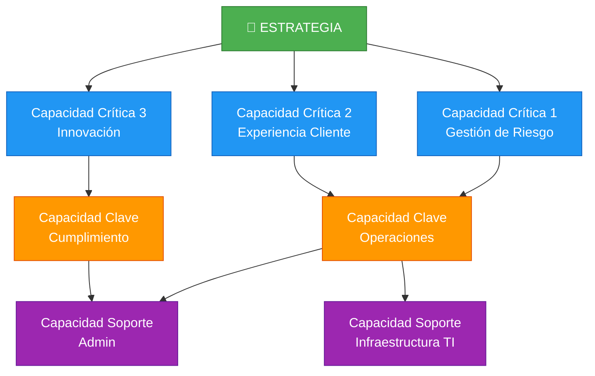
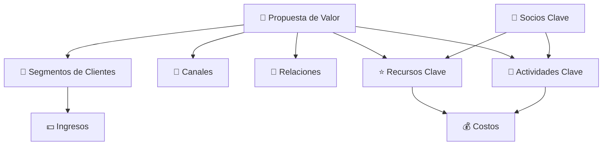

# Arquitectura del negocio y capacidades empresariales (Clase 9)

**Curso:** Arquitectura Empresarial (ISIL, 2026-1)  
**Docente:** Richard Anthony Romero Mori  
**Fecha:** [Confirmar con docente]

---

## Idea central

La **arquitectura del negocio** no es el organigrama.  
Es cómo la organización estructura sus **capacidades estratégicas**, **procesos operativos** y **modelo operativo** para ejecutar la estrategia y convertir recursos en valor real.

Sin arquitectura del negocio bien definida, la tecnología no tiene brújula: puede ser sofisticada pero inútil.

---

## Síntesis del material fuente

**Archivo base:** `40096-S09-PRESENTACION.pdf`

La presentación enfatizó que la arquitectura del negocio es la **base de la pirámide arquitectónica**:

```
┌─────────────────────────────┐
│   Arquitectura de Datos     │
├─────────────────────────────┤
│ Arquitectura de Aplicaciones│
├─────────────────────────────┤
│ Arquitectura de Tecnología  │
├─────────────────────────────┤
│ Arquitectura del NEGOCIO    │
└─────────────────────────────┘
```

Sin negocio claro, todo lo demás es especulación.

---

## ¿Qué es la arquitectura del negocio?

Es la representación estructurada de **cómo funciona realmente la empresa**:

| Componente | Descripción |
|---|---|
| **Estructura Organizacional** | Roles, responsabilidades, niveles de decisión, coordinación entre áreas |
| **Capacidades Empresariales** | Lo que la organización **sabe hacer** de forma consistente para generar valor |
| **Procesos Clave** | Secuencias de actividades que transforman insumos en productos/servicios |
| **Modelo Operativo** | Cómo se integran recursos, tecnología y personas para ejecutar la estrategia |

**Distinción crítica:**
- El **organigrama** muestra quién reporta a quién.
- La **arquitectura del negocio** muestra cómo el negocio realmente funciona.

Ejemplo: un banco puede tener una estructura divisional (Retail, Corporativo, Tesorería), pero su arquitectura del negocio podría estar centrada en la capacidad de **gestionar riesgo de crédito** que atraviesa todas las divisiones.

---

## Componentes clave: Capacidades vs Procesos

### Capacidad

Una **habilidad organizacional** que permite ejecutar un conjunto de procesos de forma consistente y alineada con la estrategia.

**Ejemplos:**
- Gestión de riesgo de crédito
- Cumplimiento omnicanal
- Atención clínica coordinada
- Innovación de productos

### Proceso

Una **secuencia de actividades** que, en combinación con otras, activa una capacidad.

**Ejemplo de relación:**

```
Capacidad: Gestión de riesgo de crédito
    ├─ Proceso: Evaluación de solicitudes
    ├─ Proceso: Monitoreo de morosidad
    ├─ Proceso: Cobranza coordinada
    └─ Proceso: Revisión de límites de crédito
```

Una capacidad **requiere múltiples procesos coordinados**; un solo proceso no define una capacidad estratégica.

---

## Mapa de capacidades (Capability Map)

Es una herramienta que **no describe departamentos**, sino lo que la organización **debe saber hacer** para cumplir su estrategia.

### ¿Por qué importa?

- Visualiza el **alcance funcional completo** del negocio.
- Permite identificar **capacidades críticas** versus capacidades de soporte.
- Detecta **duplicidades** entre áreas.
- Facilita evaluar **madurez y desempeño** de cada capacidad.
- Identifica **brechas** entre estado actual (AS-IS) y estado deseado (TO-BE).
- Prioriza inversiones estratégicas.

### Estructura típica de un Mapa de Capacidades



---

## Ejemplos sectoriales concretos

### Ejemplo 1: Banco digital — Capacidad de cobranza digital

| Elemento | Detalle |
|---|---|
| **Estrategia** | Mejorar recuperación de cartera sin friccionar clientes |
| **Capacidad crítica** | Gestión de morosidad omnicanal |
| **Procesos** | Identificación automática, alertas SMS/mail, negociación de planes, seguimiento |
| **Recursos** | CRM integrado, algoritmos de segmentación, equipo especializado |
| **Indicador de éxito** | % de recuperación > 80%, satisfacción del cliente > 7/10 |
| **Riesgo de no hacerlo** | Cartera vencida crece, márgenes se erosionan, cliente migra a competencia |

### Ejemplo 2: Retail omnicanal — Capacidad de cumplimiento omnicanal

| Elemento | Detalle |
|---|---|
| **Estrategia** | El cliente compra cómo, cuándo y dónde quiere |
| **Capacidad crítica** | Click & Collect / Envío desde tienda |
| **Procesos** | Recepción pedido online, picking en tienda, empaque, despacho, seguimiento |
| **Recursos** | Sistema de inventario unificado, app de tienda, operarios especializados |
| **Indicador de éxito** | Pedidos despachados en < 24h, tasa de devolución < 5% |
| **Riesgo de no hacerlo** | Experiencia inconsistente, clientes a competencia con mejor servicio |

### Ejemplo 3: Salud integrada — Capacidad de atención clínica coordinada

| Elemento | Detalle |
|---|---|
| **Estrategia** | Mejorar continuidad de cuidado, reducir costos innecesarios |
| **Capacidad crítica** | Coordinación de atención entre especialidades |
| **Procesos** | Cita centralizada, historia clínica integrada, referencia entre especialistas, seguimiento post-consulta |
| **Recursos** | Sistema HIS unificado, protocolos de atención, médicos con acceso común |
| **Indicador de éxito** | Redundancia de pruebas < 10%, tiempo de resolución < 20 días |
| **Riesgo de no hacerlo** | Paciente vuelve al especialista 1, luego al 2, sin contexto; duplicación de pruebas; facturación inflada |

---

## Estructura organizacional y ejecución estratégica

### Tipos de estructura y su impacto

La estructura que eliges determina **cómo se coordinan**, **quién decide**, y **qué tan rápido se puede cambiar**.

| Tipo | Ventajas | Desventajas | Mejor para |
|---|---|---|---|
| **Funcional** | Especialización profunda, eficiencia en costos | Silos, lentitud en decisiones transversales | Organizaciones estables, operaciones claras |
| **Divisional** | Autonomía, claridad de resultados, escalabilidad | Duplicación de recursos, pérdida de escala | Organizaciones grandes, múltiples mercados |
| **Matricial** | Flexibilidad, compartir expertise, innovación | Conflictos de autoridad, complejidad | Organizaciones complejas que cambian rápido |
| **Por capacidades** | Adaptación, velocidad, innovación | Pérdida de control, falta de claridad | StartUps, entornos muy dinámicos |

### Relación clave

Una **estructura organizacional mal alineada genera conflicto entre lo que dices que haces y lo que realmente haces**.

Ejemplo de desalineación:
- Estrategia: "Somos ágiles e innovadores"
- Estructura: Fuertemente jerárquica, procesos de aprobación largos
- **Resultado:** Frustración, gente talentosa se va, iniciativas mueren en burocracia.

---

## Business Model Canvas

Herramienta para visualizar los 9 bloques que conforman el modelo de negocio:



**Pregunta integradora:** ¿Los 9 bloques están alineados? Si una pieza cambia (ej: nuevo canal), ¿cómo impacta el resto?

---

## Matriz de evaluación: Alineación estructura-capacidades

Pregunta clave: **¿La estructura soporta las capacidades estratégicas?**

### Checklist de evaluación

- [ ] **Responsable claro:** Cada capacidad crítica tiene un propietario identificable
- [ ] **Coordinación transversal formalizada:** Los procesos que cruzan áreas tienen protocolos de decisión
- [ ] **Recursos alineados:** Las inversiones se priorizan por impacto en capacidades clave
- [ ] **Indicadores conectados:** Cada capacidad tiene métricas que conectan con objetivos de negocio
- [ ] **Brechas identificadas:** Se conocen las diferencias entre el estado actual y el deseado
- [ ] **Hoja de ruta:** Existe un plan de transición con iniciativas y plazos

Si respondes **NO** a 2 o más, tienes un **riesgo arquitectónico**: la estructura no soporta la estrategia.

---

## Diferencia con arquitectura de datos, aplicaciones y tecnología

Aunque esta clase se enfocó en arquitectura del negocio, es importante entender su rol:

| Capa | Responde a | Ejemplo |
|---|---|---|
| **Negocio** | ¿Cómo ejecutamos la estrategia? | Capacidad de cobranza omnicanal |
| **Datos** | ¿Qué datos necesitamos para esa capacidad? | Base de datos de morosidad, reglas de segmentación |
| **Aplicaciones** | ¿Qué sistemas integran esos datos? | CRM, sistema de alertas, portal de cliente |
| **Tecnología** | ¿Qué infraestructura soporta todo? | Servidores, redes, seguridad, backup |

**Flujo correcto de diseño:**
1. Define la capacidad estratégica (NEGOCIO).
2. Mapea los datos que necesitas (DATOS).
3. Diseña los sistemas que los procesan (APLICACIONES).
4. Dimensiona la infraestructura (TECNOLOGÍA).

No al revés.

---

## Conclusión práctica

La arquitectura del negocio es el **puente entre estrategia y ejecución**.

- Permite visualizar cómo la organización realmente funciona, más allá de títulos y reportes.
- Identifica dónde están las fricciones, duplicidades y brechas.
- Guía decisiones de estructura, inversión y cambio organizacional.
- Es la **base obligatoria** para construir arquitecturas de datos, aplicaciones y tecnología que no sean un desperdicio.

**Recordar:** Una tecnología perfecta sobre un negocio mal estructurado es como construir un rascacielos en arena.

---

## Recursos

- [Presentación de la sesión](./40096-S09-PRESENTACION.pdf)
- Ver también: [Clase 1 - Fundamentos de AE](../clase-1/arquitectura-empresarial-fundamentos-clase-1.md)
- Relacionado: [Clase 3 - Modelado Arquitectónico y Capas](../clase-3/modelado-arquitectonico-capas-clase-3.md)

