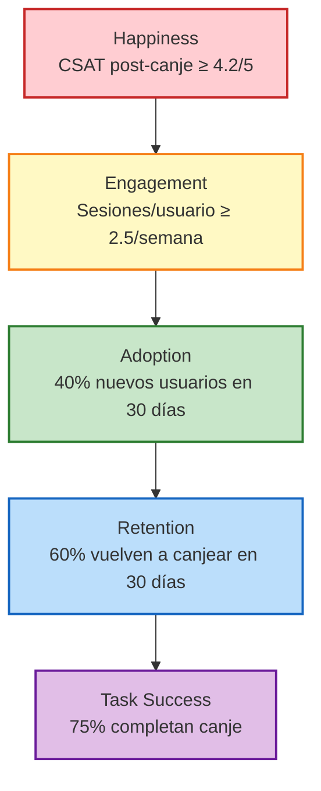
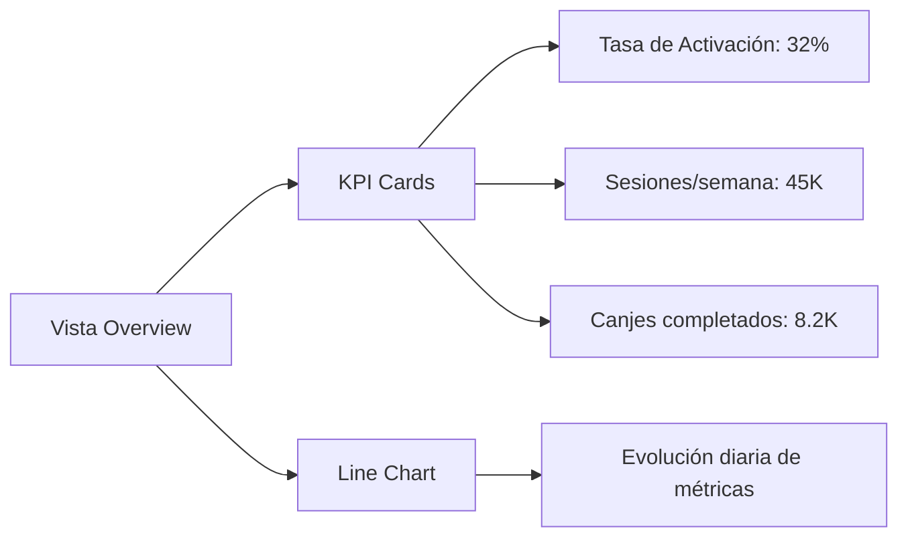
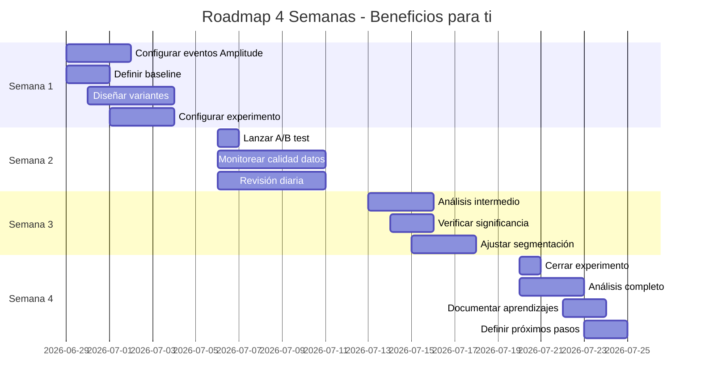

# Yape y la Mejora de la Experiencia en "Beneficios para ti" (Actividad 4)

**Curso:** Customer Centricity & Agilidad en TI (ISIL, 2026-1)  
**Docente:** Henry Joseph Paredes del Alamo  
**Fecha:** 27/06/2026

---

## 1. Diagnóstico del Problema

### Contexto del caso

Yape lanzó la sección **"Beneficios para ti"** donde los usuarios encuentran promociones, descuentos y cupones de comercios afiliados. Sin embargo:

- Muchos usuarios siguen usando la app **solo para transferir dinero**
- Pocos ingresan a la sección de beneficios
- Algunos comentan que **no encuentran promociones relevantes**
- El proceso para usar beneficios tiene **demasiados pasos**

### Diagnóstico customer centric

El problema principal es **mixto**, con tres frentes claros:

| Frente | Evidencia | Impacto |
|---|---|---|
| **Visibilidad** | Los usuarios no descubren la sección o no la consideran relevante al abrir la app | Bajo tráfico hacia "Beneficios para ti" |
| **Relevancia** | Las promociones no conectan con las preferencias o comportamiento del usuario | Bajo engagement una vez que ingresan |
| **Fricción** | El proceso para canjear un beneficio tiene demasiados pasos | Abandono durante el flujo de canje |

> **Conclusión:** El problema no es solo que la sección sea difícil de usar (fricción), sino que los usuarios **no ven valor inmediato** al explorarla. Hay una brecha entre lo que Yape ofrece y lo que el usuario percibe como útil.

---

## 2. Discovery: 4 Preguntas Clave

Antes de rediseñar la experiencia, es fundamental validar con usuarios reales:

| # | Pregunta | Objetivo | Tipo |
|---|---|---|---|
| 1 | **"Cuando abres Yape, ¿qué buscas hacer? ¿Has notado la sección de Beneficios?"** | Entender si el problema es de visibilidad o de hábito | Cualitativa |
| 2 | **"Cuéntame la última vez que usaste un beneficio de Yape. ¿Cómo lo encontraste y qué pasos diste?"** | Mapear el journey real del usuario con beneficios | Cualitativa |
| 3 | **"¿Qué tipo de promociones te harían abrir esa sección regularmente?"** | Identificar qué beneficios serían relevantes para el usuario | Cualitativa |
| 4 | **"Si los beneficios fueran automáticos (sin necesidad de buscar), ¿los usarías?"** | Validar si el problema principal es la fricción o la relevancia | Cualitativa |

### Justificación de las preguntas

- **Pregunta 1:** Valida si el problema es de conciencia (el usuario no sabe que existe) o de hábito (sabe que existe pero no le importa)
- **Pregunta 2:** Permite construir un Customer Journey Map real del flujo de canje
- **Pregunta 3:** Genera ideas para personalización y relevancia
- **Pregunta 4:** Prueba una hipótesis sobre automatización vs búsqueda activa

---

## 3. Métrica de Negocio Principal

### Métrica propuesta: **Tasa de Activación de Beneficios**

**Definición:** Porcentaje de usuarios activos mensuales que al menos una vez interactúan con un beneficio (lo ven, lo seleccionan o lo canjean).

**Fórmula:**

```
Tasa de Activación = (Usuarios que interactúan con Beneficios / Usuarios Activos Mensuales) × 100
```

### ¿Por qué esta métrica?

| Criterio | Justificación |
|---|---|
| **Alineada con el problema** | Si el problema es bajo uso, medir activación captura la adopción |
| **Accionable** | Permite segmentar: ¿dónde se pierden los usuarios? |
| **Conecta con revenue** | Más activación → más canjes → más comisiones para Yape |
| **Baseline clara** | Fácil de medir con herramientas de analítica digital |

### Target inicial

- **Baseline estimada:** 15-20% (usuarios que alguna vez tocaron la sección)
- **Meta a 3 meses:** 35-40%
- **Meta a 6 meses:** 50%+

---

## 4. Propuesta de Mejora

### Nombre de la solución: **"Beneficios para ti — Smart Benefits"**

### Descripción

Transformar la sección de beneficios de un **catálogo estático** que el usuario debe buscar, a una **experiencia personalizada y contextual** que aparece en el momento correcto del journey del usuario.

### Componentes de la solución

| Componente | Qué hace | Dónde aparece en el journey |
|---|---|---|
| **1. Beneficios Contextuales** | Mostrar descuentos relevantes según comportamiento reciente (ej: si pagaste en restaurantes, mostrar descuentos de comida) | Al abrir la app, antes de transferir |
| **2. Resumen Personalizado** | Card que muestra "Tus beneficios de esta semana" con los 3 más relevantes | Home de la app, sección superior |
| **3. Flujo de Canje Simplificado** | Reducir de 5+ pasos a 2 taps: Ver beneficio → Canjear con QR | Dentro de la sección de beneficios |
| **4. Notificación Inteligente** | Push notification contextual (ej: "Tienes 20% en la cafetería que visitas frecuentemente") | Momento oportuno, no invasivo |

### Justificación customer centric

- **Visibilidad resuelta:** Beneficios aparecen en el home, no escondidos
- **Relevancia resuelta:** Personalización basada en comportamiento real
- **Fricción resuelta:** Flujo de canje simplificado de 5 a 2 pasos

---

## 5. Framework HEART

Aplicación del framework de Google para medir la experiencia de la nueva funcionalidad:

| Categoría | Objetivo | Señal | Métrica |
|---|---|---|---|
| **Happiness** | Los usuarios se sienten satisfechos con los beneficios recibidos | Encuesta post-canje, valoraciones | CSAT post-canje ≥ 4.2/5 |
| **Engagement** | Los usuarios exploran y usan beneficios recurrentemente | Frecuencia de visita a la sección, interacciones por sesión | Sesiones por usuario/semana en Beneficios ≥ 2.5 |
| **Adoption** | Los nuevos usuarios descubren y activan beneficios | % de usuarios nuevos que interactúan con Beneficios en primeros 30 días | Tasa de adopción ≥ 40% en nuevos usuarios |
| **Retention** | Los usuarios vuelven a usar beneficios mes a mes | % de usuarios que canjearon beneficios y vuelven a canjear en 30 días | Retención de canje ≥ 60% |
| **Task Success** | Los usuarios completan el canje sin fricción | % de usuarios que inician canje y lo completan | Tasa de conversión de canje ≥ 75% |

### Diagrama HEART



---

## 6. Eventos y Propiedades

### Eventos digitales a medir

| # | Evento | Descripción | Propiedades |
|---|---|---|---|
| 1 | **`beneficios_viewed`** | El usuario abre o visualiza la sección de Beneficios | `fuente` (home/notificación/búsqueda), `tipo_beneficio`, `dispositivo` |
| 2 | **`beneficio_selected`** | El usuario selecciona un beneficio específico para ver detalles | `id_beneficio`, `categoria_comercio`, `descuento_pct`, `distancia_km` |
| 3 | **`beneficio_canje_initiated`** | El usuario inicia el proceso de canje (toca "Canjear") | `id_beneficio`, `metodo_pago`, `monto_estimado` |
| 4 | **`beneficio_canje_completed`** | El usuario completa exitosamente el canje | `id_beneficio`, `tiempo_canje_seg`, `monto_ahorro`, `tipo_comercio` |
| 5 | **`beneficio_shared`** | El usuario comparte un beneficio con otro usuario | `id_beneficio`, `canal_share` (WhatsApp/link/copy), `destino` |
| 6 | **`beneficio_favorited`** | El usuario guarda un beneficio como favorito | `id_beneficio`, `categoria`, `ubicacion_usuario` |

### Propiedades detalladas por evento

#### Evento 1: `beneficios_viewed`

```json
{
  "evento": "beneficios_viewed",
  "propiedades": {
    "fuente": "home | notificacion_push | busqueda | deeplink",
    "tipo_beneficio": "descuento | cashback | cupon | 2x1",
    "dispositivo": "iOS | Android",
    "hora_del_dia": "manana | tarde | noche",
    "dia_semana": "lunes | martes | ..."
  }
}
```

#### Evento 2: `beneficio_selected`

```json
{
  "evento": "beneficio_selected",
  "propiedades": {
    "id_beneficio": "BEN-001",
    "categoria_comercio": "restaurante | supermercada | farmacia | entretenimiento",
    "descuento_pct": 15,
    "distancia_km": 2.3,
    "tiempo_carga_ms": 850
  }
}
```

#### Evento 3: `beneficio_canje_initiated`

```json
{
  "evento": "beneficio_canje_initiated",
  "propiedades": {
    "id_beneficio": "BEN-001",
    "metodo_pago": "saldo_yape | tarjeta | plin",
    "monto_estimado": 45.50,
    "pasos_previos": 2,
    "tiempo_desde_seleccion_seg": 12
  }
}
```

#### Evento 4: `beneficio_canje_completed`

```json
{
  "evento": "beneficio_canje_completed",
  "propiedades": {
    "id_beneficio": "BEN-001",
    "tiempo_canje_seg": 8,
    "monto_ahorro": 6.83,
    "tipo_comercio": "restaurante",
    "exitoso": true
  }
}
```

#### Evento 5: `beneficio_shared`

```json
{
  "evento": "beneficio_shared",
  "propiedades": {
    "id_beneficio": "BEN-001",
    "canal_share": "whatsapp | link | copy_clipboard",
    "destino": "contacto_yape | externo"
  }
}
```

#### Evento 6: `beneficio_favorited`

```json
{
  "evento": "beneficio_favorited",
  "propiedades": {
    "id_beneficio": "BEN-001",
    "categoria": "restaurante",
    "ubicacion_usuario": "Lima | Arequipa | Trujillo"
  }
}
```

---

## 7. Dashboard en Amplitude

### Vistas y gráficos recomendados

| Vista | Tipo de gráfico | Métricas principales | Periodicidad |
|---|---|---|---|
| **Overview de Beneficios** | KPI Cards + Line Chart | Tasa de activación, sesiones totales, canjes completados | Diaria/Semanal |
| **Funnel de Conversión** | Funnel Chart | viewed → selected → initiated → completed | Semanal |
| **Retention de Canje** | Retention Chart | % usuarios que vuelven a canjear en 7, 14, 30 días | Mensual |
| **Segmentación por Fuente** | Bar Chart | Tráfico por origen (home, notificación, búsqueda) | Semanal |
| **Top Beneficios** | Horizontal Bar Chart | Beneficios más vistos, canjeados y compartidos | Semanal |
| **Tiempo de Canje** | Histograma | Distribución de tiempo desde selección hasta completado | Semanal |

### Descripción de cada vista

#### Vista 1: Overview de Beneficios



#### Vista 2: Funnel de Conversión

```
┌─────────────────────────────────────────────────────┐
│ FUNNEL: Beneficios para ti                          │
├─────────────────────────────────────────────────────┤
│                                                      │
│  VIEWED ────────────────── 100% (45,000 usuarios)   │
│     │                                                │
│     ▼                                                │
│  SELECTED ──────────────── 45% (20,250)             │
│     │                                                │
│     ▼                                                │
│  INITIATED ─────────────── 22% (9,900)              │
│     │                                                │
│     ▼                                                │
│  COMPLETED ─────────────── 18% (8,100)              │
│                                                      │
│  Tasa de conversión total: 18%                       │
│  Mayor drop-off: Selected → Initiated (-23%)         │
│                                                      │
└─────────────────────────────────────────────────────┘
```

#### Vista 3: Retención de Canje

| Cohort | Semana 1 | Semana 2 | Semana 3 | Semana 4 |
|---|---|---|---|---|
| Usuarios nuevo canje | 100% | 65% | 52% | 45% |
| Usuarios recurrente | 100% | 78% | 70% | 65% |

#### Vista 4: Segmentación por Fuente

| Fuente | % del tráfico | Tasa de conversión |
|---|---|---|
| Home (card destacada) | 55% | 22% |
| Notificación push | 25% | 28% |
| Búsqueda/Exploración | 15% | 12% |
| Deep link/Compartido | 5% | 30% |

#### Vista 5: Top Beneficios

| # | Beneficio | Vistas | Canjes | Tasa conversión |
|---|---|---|---|---|
| 1 | 20% en restaurantes | 12,500 | 3,200 | 25.6% |
| 2 | Cashback supermercados | 9,800 | 2,100 | 21.4% |
| 3 | 2x1 farmacias | 7,200 | 1,800 | 25.0% |
| 4 | Descuentos entretenimiento | 5,400 | 950 | 17.6% |

---

## 8. Experimento Digital

### Tipo: **A/B Testing**

### Hipótesis

> "Si mostramos beneficios contextuales y personalizados en el home de Yape (en lugar de solo tener la sección estática), la tasa de activación de beneficios aumentará al menos un 30% en 4 semanas."

### Configuración del experimento

| Variable | Detalle |
|---|---|
| **Público** | 50% de usuarios activos mensuales (aleatorio, sin sesgo) |
| **Variante A (Control)** | Experiencia actual: sección "Beneficios para ti" estática en el menú |
| **Variante B (Tratamiento)** | Nueva experiencia: card personalizada en el home + flujo simplificado de canje |
| **Métrica principal** | Tasa de activación de beneficios (interacción con al menos 1 beneficio) |
| **Métrica secundaria** | Tasa de conversión de canje (initiated → completed) |
| **Duración** | 4 semanas |
| **Significancia estadística** | 95% |
| **Mínimo de usuarios por variante** | 25,000 |

### Definición de variantes

#### Variante A (Control)

```
┌─────────────────────────────────────┐
│ HOME YAPE ACTUAL                     │
├─────────────────────────────────────┤
│                                      │
│  [Saldo: S/ 450.00]                 │
│                                      │
│  [Enviar dinero]  [Recargar]         │
│                                      │
│  ─────────────────────────────────  │
│  Mis productos                       │
│  [Yape QR] [Transferir] [Pagar]     │
│                                      │
│  ─────────────────────────────────  │
│  Menú hamburguesa ☰                  │
│    → Beneficios para ti (escondido) │
│                                      │
└─────────────────────────────────────┘
```

#### Variante B (Tratamiento)

```
┌─────────────────────────────────────┐
│ HOME YAPE NUEVA VERSIÓN              │
├─────────────────────────────────────┤
│                                      │
│  [Saldo: S/ 450.00]                 │
│                                      │
│  [Enviar dinero]  [Recargar]         │
│                                      │
│  ┌─────────────────────────────┐    │
│  │ 🎁 TUS BENEFICIOS           │    │
│  │ 20% en El Rincón del Sabor  │    │
│  │ ⏰ Expira en 3 días         │    │
│  │ [Ver todos →]               │    │
│  └─────────────────────────────┘    │
│                                      │
│  ─────────────────────────────────  │
│  Mis productos                       │
│  [Yape QR] [Transferir] [Pagar]     │
│                                      │
└─────────────────────────────────────┘
```

### Criterio de éxito

| Métrica | Variante A (esperado) | Variante B (esperado) | Éxito si... |
|---|---|---|---|
| Tasa de activación | 18% | ≥ 24% | B supera a A por ≥ 30% relativo |
| Tasa de conversión canje | 75% | ≥ 80% | B supera a A |
| CES post-canje | 3.8/5 | ≥ 4.2/5 | B supera a A |

### Duración y parada

- **Mínimo:** 2 semanas para acumular datos suficientes
- **Máximo:** 4 semanas
- **Parada temprana:** Si hay diferencia estadística significativa antes de 2 semanas, se puede parar (con precaución)

---

## 9. Decisión Final

### Escenario: Adopción sube, pero CES sigue bajo

**Situación hipotética:** Después de 4 semanas, el experimento muestra:
- ✅ Tasa de activación sube de 18% a 28% (cumple objetivo)
- ❌ CES post-canje sigue en 3.5/5 (no mejora significativamente)

### Análisis del escenario

| Señal | Interpretación |
|---|---|
| **Adopción sube** | La card personalizada en el home funciona para atraer usuarios a la sección |
| **CES bajo** | Una vez que el usuario ingresa, el flujo de canje sigue siendo difícil |

**Diagnóstico:** El problema de **visibilidad** se resolvió con la card contextual, pero el problema de **fricción en el canje** persiste. Los usuarios llegan pero se frustran al intentar canjear.

### Decisión recomendada

| Acción | Prioridad | Justificación |
|---|---|---|
| **1. Mantener la card personalizada** | Alta | Funcionó para aumentar adopción |
| **2. Rediseñar el flujo de canje** | Crítica | Es donde está el dolor principal (CES bajo) |
| **3. Investigar puntos de fricción** | Alta | Entrevistar usuarios que abandonaron el canje |
| **4. Ejecutar segundo experimento** | Media | Probar flujo de 2 taps vs flujo actual |

### Plan de acción inmediato

```
SEMANA 1-2 ( post-experimento):
├─ Mantener Variante B (card personalizada)
├─ Entrevistar 15 usuarios que canjearon y 15 que abandonaron
├─ Identificar los 3 pasos con mayor abandono en el funnel
└─ Priorizar fix de fricción

SEMANA 3-4:
├─ Diseñar flujo de canje simplificado (2 taps)
├─ Ejecutar segundo A/B test: flujo actual vs flujo simplificado
└─ Medir CES post-canje en ambas variantes

SEMANA 5-6:
├─ Analizar resultados del segundo experimento
├─ Escalar la variante ganadora
└─ Documentar aprendizajes
```

### Lección clave

> **No escalar una mejora de adopción si la experiencia de uso sigue siendo mala.** Más usuarios en un flujo roto = más frustración a escala. Primero arreglar la fricción, después escalar.

---

## 10. Roadmap: Plan de Implementación y Medición (4 Semanas)

### Semana 1: Preparación

| Actividad | Responsable | Entregable |
|---|---|---|
| Configurar eventos en Amplitude | Data/Producto | 6 eventos implementados y validados |
| Definir baseline de métricas | Data | Dashboard con datos actuales |
| Diseñar variantes del experimento | Diseño/UX | Mockups de Variante A y B |
| Configurar experimento en herramienta | Desarrollo | Experimento listo para lanzar |

### Semana 2: Lanzamiento

| Actividad | Responsable | Entregable |
|---|---|---|
| Lanzar A/B test al 50% de usuarios | Producto | Experimento activo |
| Monitorear calidad de datos | Data | Validación de eventos correctos |
| Revisión diaria de métricas | Producto/Data | Reporte diario de salud del experimento |

### Semana 3: Monitoreo y Ajustes

| Actividad | Responsable | Entregable |
|---|---|---|
| Análisis intermedio de resultados | Data | Reporte semanal con métricas HEART |
| Verificar significancia estadística | Data | Estado del experimento |
| Ajustar segmentación si es necesario | Producto | Cambios configurados |

### Semana 4: Cierre y Decisión

| Actividad | Responsable | Entregable |
|---|---|---|
| Cerrar experimento | Producto | Resultados finales |
| Análisis completo de métricas | Data | Dashboard final con conclusiones |
| Documentar aprendizajes | Equipo | Bitácora de experimentos actualizada |
| Definir próximos pasos | Liderazgo | Decisión: escalar, iterar o descartar |

### Timeline visual



---

## Conclusión Ejecutiva

La propuesta **"Smart Benefits"** para Yape aborda el problema de la sección "Beneficios para ti" desde tres ángulos complementarios:

1. **Visibilidad:** Card personalizada en el home que muestra beneficios relevantes
2. **Relevancia:** Personalización basada en comportamiento de pago del usuario
3. **Fricción:** Flujo de canje simplificado de 5 a 2 pasos

El framework HEART permite medir la experiencia de forma integral, mientras que el A/B testing validar si la propuesta genera impacto real. La decisión final se basa en datos: si la adopción sube pero el CES sigue bajo, se prioriza arreglar la fricción antes de escalar.

> **Idea principal:** No basta con que más usuarios lleguen a la sección. Si la experiencia de uso sigue siendo difícil, más tráfico = más frustración. Customer centricity es resolver el dolor completo, no solo atraer más personas al dolor.

---

## Fuentes

| # | Fuente | Tipo | URL |
|---|--------|------|-----|
| 1 | Google. *HEART Framework for Measuring UX* | Oficial | https://research.google/pubs/the-heart-framework-for-measuring-ux/ |
| 2 | Dixon, M., Toman, N., & DeLisi, R. (2013). *The Effortless Experience* | Libro | https://www.penguinrandomhouse.com/books/310798/the-effortless-experience/ |
| 3 | Amplitude. *Product Analytics Documentation* | Oficial | https://amplitude.com/docs |
| 4 | Kohavi, R., Tang, D., & Xu, Y. (2020). *Trustworthy Online Controlled Experiments* | Libro | https://www.trustworthyexperiments.com/ |
| 5 | Forrester Research. *The Customer Experience Index* | Oficial | https://www.forrester.com/report/the-customer-experience-index/ |

---

*Actividad 4 — Customer Centricity & Agilidad en TI | ISIL 2026-1*
