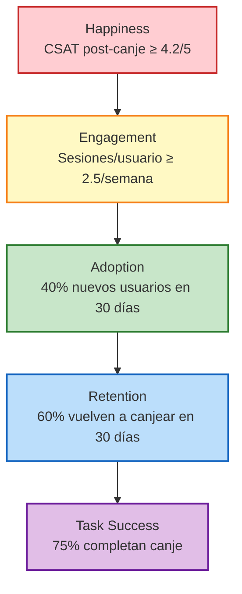
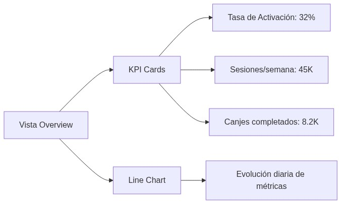
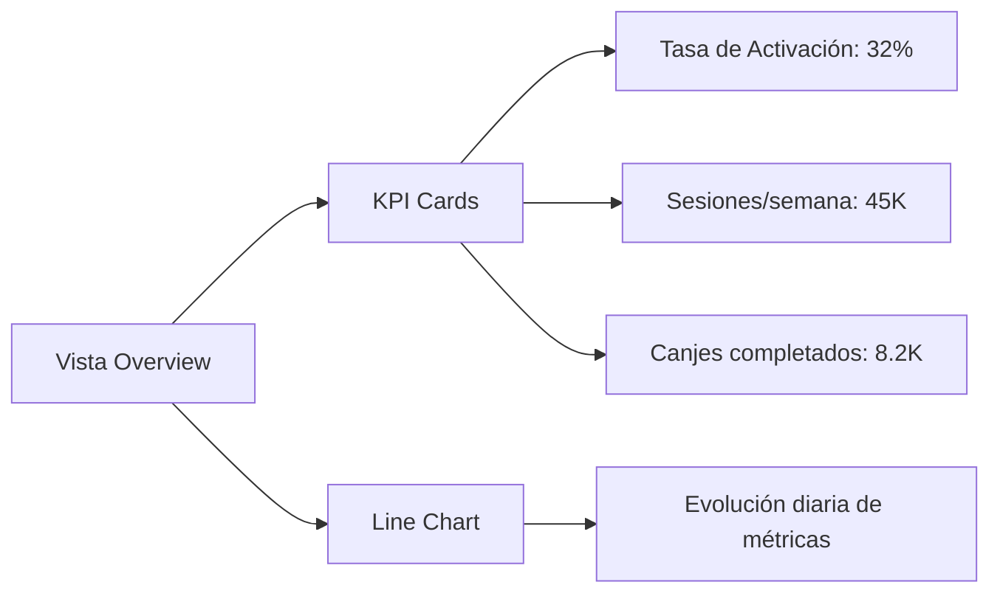
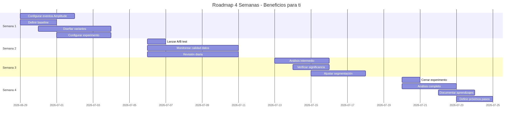
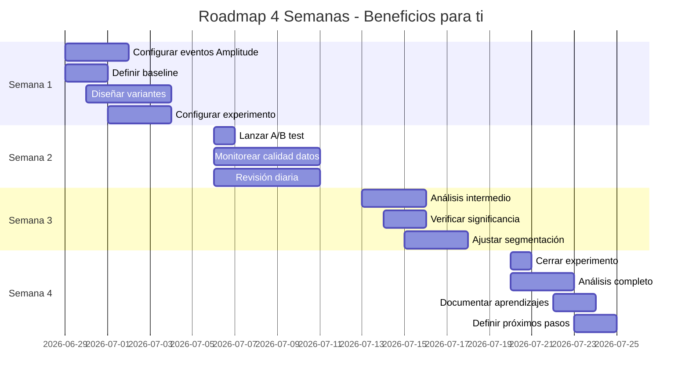

# PA4 — Customer Centricity en TI: Yape y la Mejora de la Experiencia en "Beneficios para ti"

**Curso:** Customer Centricity & Agilidad en TI (ISIL, 2026-1)  
**Docente:** Henry Joseph Paredes del Alamo  
**Fecha:** 27/06/2026

---

## Integrantes

| Apellidos y Nombres | Participación | Correo |
|---|---|---|
| Nieto Puccio, Renato | 100% | 72223893@mail.isil.pe |
| Jara Flores, Marco | 100% | 72424320@mail.isil.pe |
| Gil Carrillo, Carlos Enrique | 100% | 42834069@mail.isil.pe |

---

## 1. Diagnóstico del Problema

### Contexto del caso

Yape lanzó la sección **"Beneficios para ti"** donde los usuarios encuentran promociones, descuentos y cupones de comercios afiliados. Sin embargo:

- Muchos usuarios siguen usando la app **solo para transferir dinero**
- Pocos ingresan a la sección de beneficios
- Algunos comentan que **no encuentran promociones relevantes**
- El proceso para usar beneficios tiene **demasiados pasos**

### Diagnóstico customer centric

El problema principal es **mixto**, con tres frentes claros:

| Frente | Evidencia | Impacto |
|---|---|---|
| **Visibilidad** | Los usuarios no descubren la sección o no la consideran relevante al abrir la app | Bajo tráfico hacia "Beneficios para ti" |
| **Relevancia** | Las promociones no conectan con las preferencias o comportamiento del usuario | Bajo engagement una vez que ingresan |
| **Fricción** | El proceso para canjear un beneficio tiene demasiados pasos | Abandono durante el flujo de canje |

El objetivo principal por el que muchos usuarios acceden a la aplicación es para hacer transferencias, por lo que solo la utilizan para eso. No investigan otras características como "Beneficios para ti". Cuando entran a la sección, se topan con promociones que tienen escasa relación respecto a sus intereses o tienen que completar muchos pasos para conseguir el descuento. Esto reduce su incentivo para volver a usarla.

> **Conclusión:** El problema no es solo que la sección sea difícil de usar (fricción), sino que los usuarios **no ven valor inmediato** al explorarla. Hay una brecha entre lo que Yape ofrece y lo que el usuario percibe como útil. Esta distancia es crucial porque posibilita que la solución se centre en brindar beneficios más adaptados a cada individuo y disminuir el esfuerzo requerido para conseguirlos.

---

## 2. Discovery: 4 Preguntas Clave

Antes de rediseñar la experiencia, es fundamental validar con usuarios reales:

| # | Pregunta | Objetivo | Tipo |
|---|---|---|---|
| 1 | **"¿Qué clase de promociones te interesaría hallar en Yape?"** | Determinar los tipos de ventajas que verdaderamente atraen a los usuarios para poder brindarles promociones personalizadas | Cualitativa |
| 2 | **"¿Has accedido previamente a 'Beneficios para ti'? ¿Por qué sí o por qué no?"** | Determinar si el conflicto está asociado con una percepción baja de valor o con la carencia de conocimiento en la sección | Cualitativa |
| 3 | **"¿Cuán simple fue el uso de un cupón cuando lo intentaste?"** | Detectar los puntos de fricción a lo largo del flujo de intercambio de beneficios | Cualitativa |
| 4 | **"¿Qué te motivaría a recurrir con más asiduidad a esta sección?"** | Facilitar la identificación de posibilidades de mejora desde el punto de vista del usuario | Cualitativa |

### Justificación de las preguntas

- **Pregunta 1:** Valida si el problema es de relevancia (el usuario no ve ofertas atractivas)
- **Pregunta 2:** Permite construir un Customer Journey Map real del flujo de canje
- **Pregunta 3:** Genera datos sobre fricción percibida en el proceso de canje
- **Pregunta 4:** Prueba una hipótesis sobre qué factores motivan la reutilización

---

## 3. Métrica de Negocio Principal

### Métrica propuesta: **Tasa de Adopción Mensual de "Beneficios para ti"**

**Definición:** Porcentaje de usuarios activos de Yape que acceden a la sección durante el mes y canjean, por lo menos, un beneficio.

**Fórmula:**

```
Tasa de Activación = (Usuarios que interactúan con Beneficios / Usuarios Activos Mensuales) × 100
```

### ¿Por qué esta métrica?

Se optó por esta métrica porque muestra la conducta que el negocio busca en realidad: que los usuarios encuentren, empleen y adquieran valor de las ventajas disponibles. Solo contabilizar las consultas al área podría señalar curiosidad, pero no garantiza que el cliente haya hallado una oferta beneficiosa ni que haya terminado el procedimiento de canje.

| Criterio | Justificación |
|---|---|
| **Alineada con el problema** | Si el problema es bajo uso, medir activación captura la adopción |
| **Accionable** | Permite segmentar: ¿dónde se pierden los usuarios? |
| **Conecta con revenue** | Más activación → más canjes → más comisiones para Yape |
| **Baseline clara** | Fácil de medir con herramientas de analítica digital |

### Target inicial

- **Baseline estimada:** 15-20% (usuarios que alguna vez tocaron la sección)
- **Meta a 3 meses:** 35-40%
- **Meta a 6 meses:** 50%+

---

## 4. Propuesta de Mejora

### Nombre de la solución: **"Beneficio recomendado para ti" — Banner contextual post-transferencia**

### Descripción

La propuesta consiste en mostrar un **banner contextual** llamado "Beneficio recomendado para ti" inmediatamente después de que el usuario complete una transferencia, ya que ese es el momento de mayor uso de la app y donde el usuario presta más atención a la pantalla.

Este banner mostraría un **solo beneficio personalizado** según el historial de transacciones y los comercios frecuentes del usuario, y permitiría canjearlo con un solo toque, sin necesidad de salir de la pantalla ni pasar por múltiples pasos como ocurre actualmente.

### Componentes de la solución

| Componente | Qué hace | Dónde aparece en el journey |
|---|---|---|
| **1. Banner post-transferencia** | Mostrar un beneficio personalizado justo después de una transferencia exitosa | Pantalla de confirmación de transferencia |
| **2. Personalización por comportamiento** | Seleccionar beneficios según historial de transacciones y comercios frecuentes | Backend, en tiempo real |
| **3. Canje con un solo toque** | Permitir canjear directamente desde el banner sin pasar por múltiples pantallas | Dentro del banner |
| **4. Notificación contextual** | Push notification en momentos oportunos (no invasivos) con beneficios relevantes | Momento oportuno del día |

### Justificación customer centric

- **Visibilidad resuelta:** El banner aparece en el momento de mayor atención (post-transferencia)
- **Relevancia resuelta:** Personalización basada en comportamiento real de pago
- **Fricción resuelta:** Canje con un solo toque, sin múltiples pasos

Esta solución ayudará al usuario porque reduce la fricción del proceso actual, aumenta la relevancia percibida al personalizar según su comportamiento real, y aprovecha un momento de alta atención dentro del journey en lugar de depender de que el usuario descubra la sección por su propia cuenta.

---

## 5. Framework HEART

Aplicación del framework de Google para medir la experiencia de la nueva funcionalidad:

| Categoría | Objetivo | Señal | Métrica |
|---|---|---|---|
| **Happiness** | Los usuarios se sienten satisfechos con el proceso de canje | CES tras canjear un beneficio | CSAT post-canje ≥ 4.2/5 |
| **Engagement** | Los usuarios exploran y usan beneficios recurrentemente | Frecuencia de acceso a "Beneficios para ti" por usuario | Sesiones por usuario/semana ≥ 2.5 |
| **Adoption** | Los nuevos usuarios descubren y activan beneficios | % de usuarios activos que acceden por primera vez y canjean | 40% nuevos usuarios en 30 días |
| **Retention** | Los usuarios vuelven a usar beneficios mes a mes | % de usuarios que canjearon y vuelven en 30 días | 60% vuelven a canjear en 30 días |
| **Task Success** | Los usuarios completan el canje sin fricción | % de usuarios que inician y completan el canje | 75% completan canje |

### Diagrama HEART



---

## 6. Eventos y Propiedades

### Eventos digitales a medir

| # | Evento | Descripción | Propiedades |
|---|---|---|---|
| 1 | **`beneficio_banner_shown`** | Se le muestra al usuario un banner de beneficio recomendado post-transferencia | `tipo_beneficio`, `hora_del_dia`, `usuario_reciente_o_recurrente` |
| 2 | **`beneficio_banner_selected`** | El usuario selecciona el banner para ver detalles del beneficio | `categoria_beneficio`, `tiempo_desde_transferencia`, `dispositivo` |
| 3 | **`beneficio_details_viewed`** | El usuario visualiza la descripción completa del beneficio | `comercio_asociado`, `tipo_comercio`, `tiempo_estancia` |
| 4 | **`beneficio_canje_initiated`** | El usuario inicia el proceso de canje | `tipo_beneficio`, `metodo_pago`, `ubicacion_usuario` |
| 5 | **`beneficio_canje_completed`** | El usuario completa exitosamente el canje | `monto_descuento`, `comercio_asociado`, `duracion_procedimiento` |
| 6 | **`beneficio_canje_abandoned`** | El usuario abandona el proceso de canje antes de completarlo | `paso_de_abandono`, `motivo_registro`, `periodo_previo_desercion` |

### Propiedades detalladas por evento

#### Evento 1: `beneficio_banner_shown`

```json
{
  "evento": "beneficio_banner_shown",
  "propiedades": {
    "tipo_beneficio": "descuento | cashback | cupon | 2x1",
    "hora_del_dia": "manana | tarde | noche",
    "usuario_reciente_o_recurrente": "nuevo | recurrente"
  }
}
```

#### Evento 2: `beneficio_banner_selected`

```json
{
  "evento": "beneficio_banner_selected",
  "propiedades": {
    "categoria_beneficio": "restaurante | supermercada | farmacia | entretenimiento",
    "tiempo_desde_transferencia_seg": 5,
    "dispositivo": "iOS | Android"
  }
}
```

#### Evento 3: `beneficio_details_viewed`

```json
{
  "evento": "beneficio_details_viewed",
  "propiedades": {
    "comercio_asociado": "El Rincón del Sabor",
    "tipo_comercio": "restaurante",
    "tiempo_estancia_seg": 12
  }
}
```

#### Evento 4: `beneficio_canje_initiated`

```json
{
  "evento": "beneficio_canje_initiated",
  "propiedades": {
    "tipo_beneficio": "descuento",
    "metodo_pago": "saldo_yape | tarjeta | plin",
    "ubicacion_usuario": "Lima | Arequipa | Trujillo"
  }
}
```

#### Evento 5: `beneficio_canje_completed`

```json
{
  "evento": "beneficio_canje_completed",
  "propiedades": {
    "monto_descuento": 6.83,
    "comercio_asociado": "El Rincón del Sabor",
    "duracion_procedimiento_seg": 8
  }
}
```

#### Evento 6: `beneficio_canje_abandoned`

```json
{
  "evento": "beneficio_canje_abandoned",
  "propiedades": {
    "paso_de_abandono": "seleccion | confirmacion | pago",
    "motivo_registro": "opcion_no_disponible | timeout | otro",
    "periodo_previo_desercion_seg": 15
  }
}
```

---

## 7. Dashboard en Amplitude

### Vistas y gráficos recomendados

| Vista | Tipo de gráfico | Métricas principales | Periodicidad |
|---|---|---|---|
| **Overview de Beneficios** | KPI Cards + Line Chart | Tasa de activación, sesiones totales, canjes completados | Diaria/Semanal |
| **Funnel de Conversión** | Funnel Chart | banner_shown → selected → details_viewed → initiated → completed | Semanal |
| **Retention de Canje** | Retention Chart | % usuarios que vuelven a canjear en 7, 14, 30 días | Mensual |
| **Segmentación por Fuente** | Bar Chart | Tráfico por origen (banner, notificación, búsqueda) | Semanal |
| **Top Beneficios** | Horizontal Bar Chart | Beneficios más mostrados, seleccionados y canjeados | Semanal |
| **Tiempo de Canje** | Histograma | Distribución de tiempo desde selección hasta completado | Semanal |

### Vista 1: Overview de Beneficios





### Vista 2: Funnel de Conversión

```
┌─────────────────────────────────────────────────────┐
│ FUNNEL: Beneficios para ti                          │
├─────────────────────────────────────────────────────┤
│                                                      │
│  BANNER_SHOWN ──────────── 100% (45,000 usuarios)   │
│     │                                                │
│     ▼                                                │
│  SELECTED ──────────────── 45% (20,250)             │
│     │                                                │
│     ▼                                                │
│  DETAILS_VIEWED ────────── 30% (13,500)             │
│     │                                                │
│     ▼                                                │
│  INITIATED ─────────────── 22% (9,900)              │
│     │                                                │
│     ▼                                                │
│  COMPLETED ─────────────── 18% (8,100)              │
│                                                      │
│  Tasa de conversión total: 18%                       │
│  Mayor drop-off: Selected → Details (-15%)           │
│                                                      │
└─────────────────────────────────────────────────────┘
```

### Vista 3: Retención de Canje

| Cohort | Semana 1 | Semana 2 | Semana 3 | Semana 4 |
|---|---|---|---|---|
| Usuarios nuevo canje | 100% | 65% | 52% | 45% |
| Usuarios recurrente | 100% | 78% | 70% | 65% |

### Vista 4: Segmentación por Fuente

| Fuente | % del tráfico | Tasa de conversión |
|---|---|---|
| Banner post-transferencia | 55% | 22% |
| Notificación push | 25% | 28% |
| Búsqueda/Exploración | 15% | 12% |
| Deep link/Compartido | 5% | 30% |

### Vista 5: Top Beneficios

| # | Beneficio | Mostrados | Canjes | Tasa conversión |
|---|---|---|---|---|
| 1 | 20% en restaurantes | 12,500 | 3,200 | 25.6% |
| 2 | Cashback supermercados | 9,800 | 2,100 | 21.4% |
| 3 | 2x1 farmacias | 7,200 | 1,800 | 25.0% |
| 4 | Descuentos entretenimiento | 5,400 | 950 | 17.6% |

---

## 8. Experimento Digital

### Tipo: **A/B Testing**

### Hipótesis

> "Si mostramos un banner contextual con beneficio personalizado después de cada transferencia (en lugar de depender de que el usuario descubra la sección de Beneficios), la tasa de activación de beneficios aumentará al menos un 30% en 4 semanas."

### Configuración del experimento

| Variable | Detalle |
|---|---|
| **Público** | 50% de usuarios activos mensuales (aleatorio, sin sesgo) |
| **Variante A (Control)** | Experiencia actual: sección "Beneficios para ti" estática en el menú |
| **Variante B (Tratamiento)** | Banner contextual post-transferencia con beneficio personalizado + canje en 1 toque |
| **Métrica principal** | Tasa de activación de beneficios (interacción con al menos 1 beneficio) |
| **Métrica secundaria** | Tasa de conversión de canje (initiated → completed) |
| **Duración** | 4 semanas |
| **Significancia estadística** | 95% |
| **Mínimo de usuarios por variante** | 25,000 |

### Definición de variantes

#### Variante A (Control)

```
┌─────────────────────────────────────┐
│ HOME YAPE ACTUAL                     │
├─────────────────────────────────────┤
│                                      │
│  [Saldo: S/ 450.00]                 │
│                                      │
│  [Enviar dinero]  [Recargar]         │
│                                      │
│  ─────────────────────────────────  │
│  Mis productos                       │
│  [Yape QR] [Transferir] [Pagar]     │
│                                      │
│  ─────────────────────────────────  │
│  Menú hamburguesa ☰                  │
│    → Beneficios para ti (escondido) │
│                                      │
└─────────────────────────────────────┘
```

#### Variante B (Tratamiento)

```
┌─────────────────────────────────────┐
│ POST-TRANSFERENCIA EXITOSA           │
├─────────────────────────────────────┤
│                                      │
│  ✅ Transferencia completada         │
│  Enviaste S/ 50 a María García      │
│                                      │
│  ┌─────────────────────────────┐    │
│  │ 🎁 BENEFICIO RECOMENDADO    │    │
│  │ 20% en El Rincón del Sabor  │    │
│  │ Tu restaurante favorito     │    │
│  │ [Canjear ahora →]          │    │
│  └─────────────────────────────┘    │
│                                      │
│  [Volver al inicio]                 │
│                                      │
└─────────────────────────────────────┘
```

### Criterio de éxito

| Métrica | Variante A (esperado) | Variante B (esperado) | Éxito si... |
|---|---|---|---|
| Tasa de activación | 18% | ≥ 24% | B supera a A por ≥ 30% relativo |
| Tasa de conversión canje | 75% | ≥ 80% | B supera a A |
| CES post-canje | 3.8/5 | ≥ 4.2/5 | B supera a A |

### Duración y parada

- **Mínimo:** 2 semanas para acumular datos suficientes
- **Máximo:** 4 semanas
- **Parada temprana:** Si hay diferencia estadística significativa antes de 2 semanas, se puede parar (con precaución)

---

## 9. Decisión Final

### Escenario: Adopción sube, pero CES sigue bajo

**Situación hipotética:** Después de 4 semanas, el experimento muestra:
- ✅ Tasa de activación sube de 18% a 28% (cumple objetivo)
- ❌ CES post-canje sigue en 3.5/5 (no mejora significativamente)

### Análisis del escenario

| Señal | Interpretación |
|---|---|
| **Adopción sube** | El banner post-transferencia funciona para atraer usuarios a la sección |
| **CES bajo** | Una vez que el usuario ingresa, el proceso de canje sigue siendo difícil |

**Diagnóstico:** El problema de **visibilidad** se resolvió con el banner contextual, pero el problema de **fricción en el canje** persiste. Los usuarios llegan pero se frustran al intentar canjear.

### Decisión recomendada

| Acción | Prioridad | Justificación |
|---|---|---|
| **1. Mantener el banner post-transferencia** | Alta | Funcionó para aumentar adopción |
| **2. Rediseñar el flujo de canje** | Crítica | Es donde está el dolor principal (CES bajo) |
| **3. Investigar puntos de fricción** | Alta | Entrevistar usuarios que abandonaron el canje |
| **4. Ejecutar segundo experimento** | Media | Probar flujo de 1 toque vs flujo actual |

### Plan de acción inmediato

```
SEMANA 1-2 (post-experimento):
├─ Mantener Variante B (banner post-transferencia)
├─ Entrevistar 15 usuarios que canjearon y 15 que abandonaron
├─ Identificar los 3 pasos con mayor abandono en el funnel
└─ Priorizar fix de fricción

SEMANA 3-4:
├─ Diseñar flujo de canje simplificado (1 toque)
├─ Ejecutar segundo A/B test: flujo actual vs flujo simplificado
└─ Medir CES post-canje en ambas variantes

SEMANA 5-6:
├─ Analizar resultados del segundo experimento
├─ Escalar la variante ganadora
└─ Documentar aprendizajes
```

### Lección clave

> **No escalar una mejora de adopción si la experiencia de uso sigue siendo mala.** Más usuarios en un flujo roto = más frustración a escala. Primero arreglar la fricción, después escalar.

---

## 10. Roadmap: Plan de Implementación y Medición (4 Semanas)

### Semana 1: Preparación

| Actividad | Responsable | Entregable |
|---|---|---|
| Configurar eventos en Amplitude | Data/Producto | 6 eventos implementados y validados |
| Definir baseline de métricas | Data | Dashboard con datos actuales |
| Diseñar variantes del experimento | Diseño/UX | Mockups de Variante A y B |
| Configurar experimento en herramienta | Desarrollo | Experimento listo para lanzar |

### Semana 2: Lanzamiento

| Actividad | Responsable | Entregable |
|---|---|---|
| Lanzar A/B test al 50% de usuarios | Producto | Experimento activo |
| Monitorear calidad de datos | Data | Validación de eventos correctos |
| Revisión diaria de métricas | Producto/Data | Reporte diario de salud del experimento |

### Semana 3: Monitoreo y Ajustes

| Actividad | Responsable | Entregable |
|---|---|---|
| Análisis intermedio de resultados | Data | Reporte semanal con métricas HEART |
| Verificar significancia estadística | Data | Estado del experimento |
| Ajustar segmentación si es necesario | Producto | Cambios configurados |

### Semana 4: Cierre y Decisión

| Actividad | Responsable | Entregable |
|---|---|---|
| Cerrar experimento | Producto | Resultados finales |
| Análisis completo de métricas | Data | Dashboard final con conclusiones |
| Documentar aprendizajes | Equipo | Bitácora de experimentos actualizada |
| Definir próximos pasos | Liderazgo | Decisión: escalar, iterar o descartar |

### Timeline visual





---

## Conclusión Ejecutiva

La propuesta **"Beneficio recomendado para ti"** para Yape aborda el problema de la sección "Beneficios para ti" desde tres ángulos complementarios:

1. **Visibilidad:** Banner contextual post-transferencia que muestra un beneficio personalizado en el momento de mayor atención del usuario
2. **Relevancia:** Personalización basada en comportamiento real de pago y comercios frecuentes
3. **Fricción:** Canje con un solo toque, eliminando los múltiples pasos del proceso actual

El framework HEART permite medir la experiencia de forma integral, mientras que el A/B testing validar si la propuesta genera impacto real. La decisión final se basa en datos: si la adopción sube pero el CES sigue bajo, se prioriza arreglar la fricción antes de escalar.

> **Idea principal:** No basta con que más usuarios lleguen a la sección. Si la experiencia de uso sigue siendo difícil, más tráfico = más frustración. Customer centricity es resolver el dolor completo, no solo atraer más personas al dolor.

---

## Fuentes

Las afirmaciones y datos provienen de estas fuentes.  
Tipo: **oficial** = autor/creador; **tercero** = prensa o fuente secundaria.

### Customer Centricity y UX

| # | Fuente | Tipo | URL |
|---|---|---|---|
| 1 | Google. *HEART Framework for Measuring UX* | Oficial | https://research.google/pubs/the-heart-framework-for-measuring-ux/ |
| 2 | Dixon, M., Toman, N., & DeLisi, R. (2013). *The Effortless Experience* | Libro | https://www.penguinrandomhouse.com/books/310798/the-effortless-experience/ |

### Analítica de Producto

| # | Fuente | Tipo | URL |
|---|---|---|---|
| 3 | Amplitude. *Product Analytics Documentation* | Oficial | https://amplitude.com/docs |
| 4 | Kohavi, R., Tang, D., & Xu, Y. (2020). *Trustworthy Online Controlled Experiments* | Libro | https://www.trustworthyexperiments.com/ |

### Métricas de Experiencia

| # | Fuente | Tipo | URL |
|---|---|---|---|
| 5 | Forrester Research. *The Customer Experience Index* | Oficial | https://www.forrester.com/report/the-customer-experience-index/ |

---

*Actividad 4 — Customer Centricity & Agilidad en TI | ISIL 2026-1*
