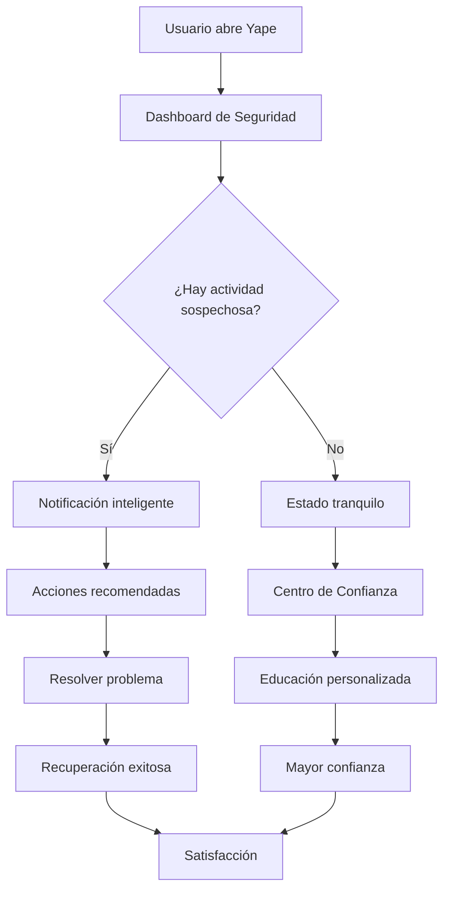
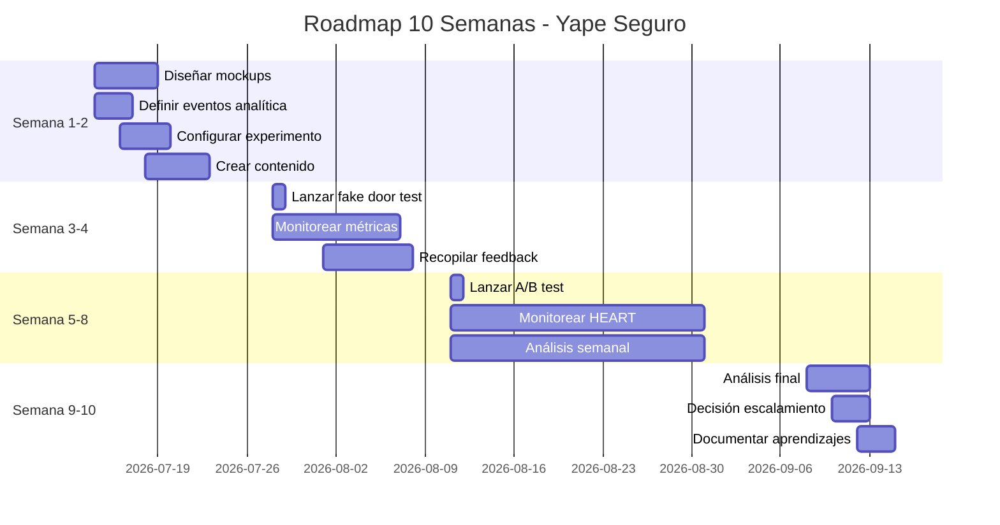

# EVALUACIÓN INTEGRAL — Customer Centricity en TI: Yape y la Mejora de la Seguridad y Confianza

**Curso:** Customer Centricity & Agilidad en TI (ISIL, 2026-1)
**Docente:** Henry Joseph Paredes del Alamo
**Fecha:** 14/07/2026

---

## Integrantes

| Apellidos y Nombres          | Participación | Correo                |
| ---------------------------- | -------------- | --------------------- |
| [Apellido1, Nombre1]         | 100%           | [correo1]@mail.isil.pe |
| [Apellido2, Nombre2]         | 100%           | [correo2]@mail.isil.pe |
| [Apellido3, Nombre3]         | 100%           | [correo3]@mail.isil.pe |

---

## 1. Problema y Usuario

### Contexto del caso

Yape es una de las billeteras digitales más usadas en el Perú, con millones de usuarios que realizan transacciones diarias. Sin embargo, a medida que crece, enfrenta un desafío crítico: **la percepción de seguridad y confianza**.

Muchos usuarios expresan preocupación por:
- **Fraudes y estafas** que usan el nombre de Yape
- **Falta de transparencia** en cómo se protegen sus datos
- **Dudas sobre la seguridad** de transferir grandes montos
- **Miedo a equivocarse** en transferencias (enviar al monto incorrecto o persona equivocada)

### Diagnóstico customer centric

El problema principal es **multidimensional**, con tres frentes claros:

| Frente | Evidencia | Impacto |
|--------|-----------|---------|
| **Percepción de seguridad** | Usuarios temen perder dinero por fraudes o errores | Reduce la frecuencia de uso y monto promedio |
| **Confianza en la plataforma** | Falta de información clara sobre protección de datos | Genera deserción de usuarios nuevos |
| **Recuperabilidad** | Usuarios no saben qué hacer si cometen un error | Aumenta la ansiedad y reduce la satisfacción |

> **Conclusión:** El problema no es solo técnico (Yape tiene seguridad robusta), sino de **comunicación y experiencia**. Los usuarios no perciben la protección que existe, lo que limita su uso completo de la plataforma.

---

## 2. Necesidad o JTBD

### Jobs to be Done identificados

| # | JTBD | Descripción | Prioridad |
|---|------|-------------|-----------|
| 1 | **"Quiero sentirme seguro al usar Yape para que mis dinero esté protegido"** | El usuario necesita confianza de que su dinero y datos están seguros | Alta |
| 2 | **"Quiero saber qué hacer si me equivoco en una transferencia"** | El usuario necesita un proceso claro para recuperar dinero enviado por error | Crítica |
| 3 | **"Quiero entender cómo Yape protege mi información"** | El usuario necesita transparencia sobre las medidas de seguridad | Media |
| 4 | **"Quiero poder reportar un problema fácilmente"** | El usuario necesita acceso rápido a soporte cuando tiene una incidencia | Alta |

### Justificación de los JTBD

- **JTBD 1:** Aborda la barrera psicológica principal que limita el uso de Yape
- **JTBD 2:** Resuelve el miedo a equivocarse, que es una de las mayores preocupaciones
- **JTBD 3:** Genera confianza a través de la transparencia
- **JTBD 4:** Reduce la ansiedad al saber que hay ayuda disponible

---

## 3. Solución Digital Propuesta

### Nombre de la solución: **"Yape Seguro" — Centro de Confianza y Recuperación**

### Descripción general

La solución integra tres componentes principales que abordan los JTBD identificados:

1. **Dashboard de Seguridad Personalizado** — Muestra en tiempo real el estado de seguridad de la cuenta
2. **Proceso de Recuperación Simplificado** — Flujo paso a paso para transferencias erróneas
3. **Centro de Confianza** — Educación interactiva sobre medidas de seguridad

### Componentes de la solución

| Componente | Qué hace | JTBD que resuelve |
|------------|----------|-------------------|
| **1. Dashboard de Seguridad** | Muestra estado de cuenta, actividad sospechosa y recomendaciones personalizadas | JTBD 1 y 3 |
| **2. Botón de "Ayuda" prominente** | Acceso rápido a recuperación de transferencias y soporte | JTBD 2 y 4 |
| **3. Flujo de Recuperación** | Wizard guiado para transferencias erróneas con plazos claros | JTBD 2 |
| **4. Centro de Confianza** | Educación interactiva sobre seguridad con tips personalizados | JTBD 1 y 3 |
| **5. Notificaciones inteligentes** | Alertas proactivas sobre actividad inusual con acciones recomendadas | JTBD 1 |

### Diagrama de la solución

### Justificación customer centric

- **Seguridad percibida:** El dashboard hace visible la protección que ya existe
- **Recuperabilidad:** El flujo simplificado reduce la ansiedad por errores
- **Educación:** El centro de confianza empodera al usuario con conocimiento
- **Accesibilidad:** El botón de ayuda siempre está disponible, reduciendo la fricción

---

## 4. Justificación de Priorización

### Framework de priorización: RICE

| Iniciativa | Reach | Impact | Confidence | Effort | RICE Score |
|------------|-------|--------|------------|--------|------------|
| Dashboard de Seguridad | 80% | 3 | 90% | 2 | 108 |
| Flujo de Recuperación | 40% | 4 | 85% | 3 | 45 |
| Centro de Confianza | 60% | 2 | 80% | 2 | 48 |
| Notificaciones inteligentes | 70% | 3 | 75% | 3 | 52 |

### Justificación de la prioridad

1. **Dashboard de Seguridad (Prioridad 1):**
   - Alta cobertura (80% de usuarios activos)
   - Impacto significativo en percepción de seguridad
   - Alta confianza en implementación
   - Esfuerzo moderado

2. **Flujo de Recuperación (Prioridad 2):**
   - Impacto crítico para usuarios afectados
   - Reduce ansiedad y miedo a equivocarse
   - Complejidad técnica media

3. **Notificaciones inteligentes (Prioridad 3):**
   - Complementa el dashboard
   - Genera alertas proactivas
   - Requiere integración con sistema de monitoreo

### Valor para usuario y negocio

| Perspectiva | Dashboard | Recuperación | Confianza |
|-------------|-----------|--------------|-----------|
| **Valor usuario** | Mayor tranquilidad | Menor ansiedad | Empoderamiento |
| **Valor negocio** | Mayor uso y montos | Menor soporte | Retención |
| **Diferenciación** | Alto | Medio | Alto |

---

## 5. Métricas de Éxito

### Métricas de Negocio

| Métrica | Definición | Target | Fórmula |
|---------|------------|--------|---------|
| **Tasa de uso de montos altos** | % de transferencias > S/ 500 | +25% en 3 meses | (Transferencias altas / Total) × 100 |
| **Reducción de tickets de soporte** | Disminución de consultas por fraude/error | -40% en 3 meses | (Tickets antes - Después) / Antes × 100 |
| **NPS de seguridad** | Satisfacción con percepción de seguridad | ≥ 8.0 | Encuesta NPS post-uso |

### Métricas de Experiencia (Framework HEART)

| Categoría | Objetivo | Señal | Métrica |
|-----------|----------|-------|---------|
| **Happiness** | Usuarios se sienten seguros | CSAT post-uso del dashboard | CSAT ≥ 4.5/5 |
| **Engagement** | Usuarios exploran centro de confianza | Frecuencia de acceso | 2.5 sesiones/usuario/mes |
| **Adoption** | Usuarios activan nuevas funciones | % que usa dashboard en 30 días | 60% adoption |
| **Retention** | Usuarios vuelven a usar funciones de seguridad | % que regresa en 30 días | 70% retention |
| **Task Success** | Usuarios completan recuperaciones | % de flujos completados | 85% success rate |

### Métricas de Analítica Digital

| Evento | Descripción | Propiedades clave |
|--------|-------------|-------------------|
| `security_dashboard_opened` | Usuario abre dashboard de seguridad | `nivel_seguridad`, `tiempo_estancia` |
| `recovery_flow_started` | Usuario inicia flujo de recuperación | `tipo_error`, `monto` |
| `recovery_flow_completed` | Usuario completa recuperación exitosamente | `tiempo_total`, `monto_recuperado` |
| `trust_center_accessed` | Usuario accede a centro de confianza | `tipo_contenido`, `duracion` |
| `security_alert_dismissed` | Usuario descarta alerta de seguridad | `tipo_alerta`, `motivo` |

---

## 6. Validación o Experimento Propuesto

### Tipo: **A/B Testing con Fake Door Test**

### Fase 1: Fake Door Test (2 semanas)

**Objetivo:** Validar interés en la función antes de construirla.

**Configuración:**

| Variable | Detalle |
|----------|---------|
| **Público** | 100% de usuarios activos |
| **Variante A (Control)** | Sin cambios, experiencia actual |
| **Variante B (Tratamiento)** | Botón "Yape Seguro" que muestra landing page explicativa |
| **Métrica principal** | % de usuarios que hacen clic en el botón |
| **Duración** | 2 semanas |

### Fase 2: A/B Testing Completo (4 semanas)

**Hipótesis:**

> "Si implementamos un dashboard de seguridad personalizado y un flujo de recuperación simplificado, la percepción de seguridad aumentará al menos un 30% y el uso de montos altos aumentará un 25% en 4 semanas."

**Configuración:**

| Variable | Detalle |
|----------|---------|
| **Público** | 50% de usuarios activos (aleatorio) |
| **Variante A (Control)** | Experiencia actual sin cambios |
| **Variante B (Tratamiento)** | Dashboard de seguridad + flujo de recuperación + centro de confianza |
| **Métrica principal** | NPS de seguridad |
| **Métrica secundaria** | % de transferencias > S/ 500 |
| **Duración** | 4 semanas |
| **Significancia estadística** | 95% |

### Criterio de éxito

| Métrica | Variante A (esperado) | Variante B (esperado) | Éxito si... |
|---------|----------------------|----------------------|-------------|
| NPS seguridad | 6.5 | ≥ 8.5 | B supera a A por ≥ 30% |
| Transferencias altas | 15% | ≥ 20% | B supera a A |
| CSAT dashboard | N/A | ≥ 4.5/5 | B alcanza target |

---

## 7. Roadmap o Siguientes Pasos

### Semana 1-2: Preparación

| Actividad | Responsable | Entregable |
|-----------|-------------|------------|
| Diseñar mockups del dashboard | UX/Design | 3 pantallas principales |
| Definir eventos de analítica | Data/Producto | 5 eventos configurados |
| Configurar experimento A/B | Desarrollo | Experimento listo |
| Crear contenido centro de confianza | Contenido/UX | 10 artículos educativos |

### Semana 3-4: Lanzamiento Fase 1 (Fake Door)

| Actividad | Responsable | Entregable |
|-----------|-------------|------------|
| Lanzar fake door test | Producto | Botón visible para 100% |
| Monitorear métricas de interés | Data | Reporte diario |
| Recopilar feedback cualitativo | UX | 20 entrevistas |

### Semana 5-8: Lanzamiento Fase 2 (A/B Test)

| Actividad | Responsable | Entregable |
|-----------|-------------|------------|
| Lanzar A/B test al 50% | Producto | Variante B activa |
| Monitorear métricas HEART | Data | Dashboard en tiempo real |
| Análisis semanal | Data/Producto | Reportes de progreso |
| Ajustes si es necesario | Producto | Iteraciones |

### Semana 9-10: Análisis y Escalamiento

| Actividad | Responsable | Entregable |
|-----------|-------------|------------|
| Análisis final de resultados | Data | Reporte completo |
| Decisión de escalamiento | Liderazgo | Go/No-go |
| Documentar aprendizajes | Equipo | Lecciones aprendidas |
| Plan de iteración | Producto | Próximos pasos |

### Timeline visual

---

## 8. Pitch Final de Cierre

### Problema

**"Yape tiene millones de usuarios, pero muchos no se sienten seguros al usarlo."**

Los usuarios temen:
- Perder dinero por fraudes o estafas
- Equivocarse en transferencias y no poder recuperar el dinero
- No entender cómo se protegen sus datos

Este miedo **reduce el uso de montos altos**, **genera ansiedad** y **limita el crecimiento** de la plataforma.

### Solución

**"Yape Seguro" — Centro de Confianza y Recuperación**

Tres componentes que transforman la percepción:

1. **Dashboard de Seguridad** — Estado en tiempo real de la protección de tu cuenta
2. **Flujo de Recuperación** — Proceso simplificado para errores de transferencia
3. **Centro de Confianza** — Educación personalizada sobre seguridad

### Resultados esperados

| Métrica | Antes | Después (3 meses) |
|---------|-------|-------------------|
| NPS de seguridad | 6.5 | 8.5+ |
| Transferencias > S/ 500 | 15% | 20%+ |
| Tickets de soporte | 100% | 60% (-40%) |

### Por qué funciona

- **Visibilidad:** Hace visible la seguridad que ya existe
- **Recuperabilidad:** Reduce el miedo a equivocarse
- **Educación:** Empodera al usuario con conocimiento
- **Accesibilidad:** Siempre disponible cuando se necesita

### Próximos pasos

1. **Fake door test** (2 semanas) → Validar interés
2. **A/B test completo** (4 semanas) → Validar impacto
3. **Escalamiento** → Lanzar al 100% de usuarios

### Cierre

> **"La seguridad no es solo una característica técnica, es una experiencia emocional. Cuando el usuario se siente seguro, usa más, gasta más y recomienda más. Yape Seguro transforma la percepción de seguridad en crecimiento del negocio."**

---

## Fuentes

Las afirmaciones y datos provienen de estas fuentes.
Tipo: **oficial** = autor/creador; **tercero** = prensa o fuente secundaria.

### Customer Centricity y Seguridad

| # | Fuente | Tipo | URL |
|---|--------|------|-----|
| 1 | Baymard Institute. *Checkout Usability Research* | Oficial | https://baymard.com/blog/checkout-usability |
| 2 | Forrester. *The State of Customer Experience* | Oficial | https://www.forrester.com/research/ |

### Métricas y Analítica

| # | Fuente | Tipo | URL |
|---|--------|------|-----|
| 3 | Amplitude. *Product Analytics Documentation* | Oficial | https://amplitude.com/docs |
| 4 | Google. *HEART Framework for Measuring UX* | Oficial | https://research.google/pubs/the-heart-framework-for-measuring-ux/ |

### Seguridad en Fintech

| # | Fuente | Tipo | URL |
|---|--------|------|-----|
| 5 | EY. *Global Fintech Adoption Index* | Oficial | https://www.ey.com/en_gl/insights/financial-services/fintech-adoption-index |

---

*Actividad 5 — Customer Centricity & Agilidad en TI | ISIL 2026-1*