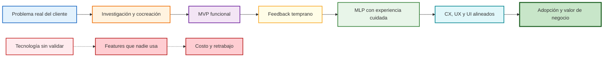

# Customer Centricity y Agilidad en TI (Clase 1)

**Curso:** Customer Centricity en Tecnologías de la Información (ISIL, 2026-1)  
**Docente:** Henry Joseph Paredes del Alamo  
**Fecha:** 10/04/2026

---

## Idea principal de la clase

La clase integró el concepto de **Customer Centricity** con las **Tecnologías de Información**. El hilo conductor fue claro: la tecnología solo crea valor cuando está diseñada desde la perspectiva del cliente y respaldada por una cultura organizacional ágil.

El docente compartió experiencia directa en banca (Interbank, Falabella) y salud (Clínica Internacional) para mostrar cómo estas ideas se aplican en entornos reales.

> **Para entender la clase en una frase:** no importa qué tan avanzada sea tu tecnología, si no resuelve un problema real del cliente, no sirve.

## Mapa visual de la sesión



Este diagrama resume la lógica central de la clase: primero se valida la necesidad, luego se construye una solución mínima, se aprende rápido y recién después se refina la experiencia.

## Síntesis integrada del material fuente

**Archivo base consolidado:** 40064_S01_PPT.pdf

El material de apoyo de la sesión condensó la clase en cinco piezas: **MVP**, **MLP**, desarrollo ágil, relación **CX/UX/UI** y **pivot** como ajuste estratégico. Integrado al documento principal, este resumen reafirma que el valor de la tecnología depende de validar necesidades, ajustar con evidencia y cuidar la experiencia completa del cliente.

**Conceptos clave consolidados:** MVP, MLP, CX, UX, UI, pivot y desafíos de productos digitales.

---

## 1. Customer Centricity

### Qué es

**Customer Centricity** (centralidad en el cliente) no es un lema de marketing ni una campaña publicitaria. Es un **modelo operativo** en el que todas las decisiones de la empresa —incluyendo las tecnológicas— se toman partiendo de una pregunta: ¿esto resuelve un problema real de mi cliente?

En términos simples: el cliente no es el destinatario del producto terminado, sino el punto de partida del diseño.

### Qué implica en la práctica

- Las soluciones tecnológicas no nacen de "ocurrencias" internas. Nacen de necesidades validadas directamente con el usuario: entrevistas, pruebas, observación de comportamiento real.
- No es responsabilidad exclusiva de sistemas o marketing. **Todas las áreas** trabajan bajo la misma meta de satisfacción del cliente. Un buen sistema puede arruinarse si el área de logística falla.
- Requiere **cocreación**: diseñar *con* el usuario, no *para* el usuario. La diferencia es que en la cocreación el usuario participa activamente en el proceso de diseño.

### Por qué importa

Una empresa puede tener tecnología de primer nivel y aun así fallar si no entiende qué necesita realmente su cliente.

**Ejemplo bancario (Interbank/Falabella):** el docente señaló casos donde se lanzaron funcionalidades digitales costosas que los usuarios simplemente no usaron. El problema no fue técnico: fue que nadie validó si existía la necesidad antes de construir. La centralidad en el cliente actúa como filtro que evita ese tipo de inversiones mal orientadas.

### Customer Centricity vs. enfoque tradicional

| Enfoque tradicional | Customer Centricity |
|---|---|
| "Construimos el producto, luego lo vendemos" | "Validamos la necesidad, luego construimos" |
| El cliente recibe lo que TI decide entregar | El cliente co-diseña con el equipo |
| Métrica principal: features entregadas | Métrica principal: adopción y satisfacción real |
| Las áreas trabajan en silos | Todas las áreas comparten el objetivo del cliente |

---

## 2. MVP vs. MLP: cómo construir bien desde el inicio

Uno de los bloques más importantes de la clase fue la diferenciación entre dos enfoques de producto mínimo. Ambos nacen de la misma pregunta: ¿cómo entregamos valor rápido sin desperdiciar recursos?

### MVP — Producto Mínimo Viable

**Definición:** es la versión más simple de un producto que permite probar si la funcionalidad básica resuelve el problema del usuario.

El objetivo del **MVP** no es lanzar algo perfecto. Es aprender lo más posible con la menor inversión posible.

> **Ejemplo del transporte (el más citado en clase):**
> Si quieres construir un auto, no empiezas fabricando una rueda. Una rueda sola no transporta a nadie.
> Empiezas con una **patineta**: es básica, pero cumple la función de llevarte del punto A al B.
> Luego mejoras a bicicleta, luego a moto, luego a auto. Cada paso valida que la solución sirve antes de invertir más.

La metáfora es poderosa porque muestra que los pasos intermedios deben ser **funcionales**, no solo partes del producto final.

**Caso real — Clínica Internacional (autoadmisión):**

La clínica quería modernizar el proceso de admisión de pacientes con máquinas de autoservicio. En lugar de instalar directamente máquinas caras con pasarelas de pago integradas, usaron el enfoque **MVP**:

1. Pusieron una tablet sencilla en recepción.
2. Un anfitrión acompañaba al paciente en el proceso.
3. Observaron qué pasos generaban confusión, qué datos pedía el sistema que nadie entendía, qué errores aparecían.
4. Con ese aprendizaje, diseñaron la máquina final.

Resultado: la máquina sofisticada ya tenía validado el flujo real. No hubo que rediseñarla después de instalarla.

**¿Por qué este enfoque es mejor?** Porque en tecnología, el costo de corregir un error sube exponencialmente mientras más tarde se detecta. Un error en papel cuesta minutos; un error en producción puede costar millones.

### MLP — Producto Mínimo Amable (Minimum Loveable Product)

Va un paso más allá del **MVP**. No solo busca que el producto funcione: busca que el usuario **ame** la experiencia desde el primer contacto.

Un **MLP** cuida:
- el diseño visual (que no sea feo ni confuso);
- el flujo emocional (que el usuario se sienta acompañado, no abandonado);
- los pequeños detalles que hacen que algo se sienta "pulido".

**Ejemplo:** dos apps de transporte que hacen exactamente lo mismo. Una tiene botones grandes, confirmaciones claras y animaciones fluidas. La otra funciona igual pero se ve descuidada. Los usuarios elegirán la primera aunque técnicamente sean idénticas. Eso es la diferencia entre un **MVP** y un **MLP**.

### Comparación directa

| Concepto | Pregunta que responde | Enfoque principal | Cuándo usarlo |
|---|---|---|---|
| **MVP** | ¿Funciona lo básico? | Validar funcionalidad | Primeras pruebas, idea nueva, recursos limitados |
| **MLP** | ¿El usuario lo amaría? | Validar experiencia y emoción | Cuando ya sabes que funciona y quieres tracción |

> **Idea clave para el examen:** un **MVP** puede ser rudo pero funcional. Un **MLP** ya considera cómo se *siente* el usuario al usarlo. Ambos son válidos, pero en momentos distintos del desarrollo.

## Transcripción del PPT: Definición y Conceptos Clave

### Fundamentos y Conceptos del Customer Centricity

- **Producto Mínimo Viable (MVP):** Versión básica que incluye características esenciales para validar la idea con retroalimentación rápida.

**Ejemplo práctico:** Una startup de delivery lanza una app simple que solo permite pedir pizza por teléfono, sin GPS. Valida demanda antes de invertir en mapas y pagos online.

- **Minimum Lovable Product (MLP):** Evolución del MVP que agrega valor emocional para deleitar usuarios desde el inicio.

**Ejemplo práctico:** Una app de fitness no solo cuenta pasos, sino que envía mensajes motivadores diarios, creando conexión emocional.

### Relación entre CX, UX y UI

- **CX (Customer Experience):** Todas las interacciones con la marca, incluyendo servicio y reputación.
- **UX (User Experience):** Interacción con la app, enfocada en efectividad, accesibilidad y credibilidad.
- **UI (User Interface):** Diseño visual, como botones y layouts.

**Ejemplo práctico:** En un banco online, CX incluye atención al cliente, UX la facilidad de transferencias, UI los colores amigables. Una buena UI mejora UX, que soporta CX positiva.

### Pivot o “Pivotear”

Cambiar estrategia basada en retroalimentación: producto, público o modelo de negocio.

**Ejemplo práctico:** Una app de recetas que pivotea de comidas saludables a rápidas después de ver que usuarios prefieren velocidad sobre nutrición.

### Importancia en Desarrollo de Soluciones Tecnológicas

- Comprensión profunda del cliente: recopilar datos de necesidades.
- Enfoque en experiencia: desarrollar con input de usuarios.
- Personalización: adaptar a necesidades únicas.

**Ejemplo práctico:** Una tienda online usa IA para recomendar productos basados en historial, personalizando experiencia y aumentando ventas.

### Principales Beneficios y Desafíos

**Beneficios:** Velocidad de aprendizaje, herramientas disponibles, predisposición a colaborar.

**Desafíos:** Competencia rápida, mercado volátil, necesidad de innovación constante.

**Ejemplo práctico:** En e-commerce, beneficios incluyen iteración rápida para mejorar checkout; desafíos como adaptarse a tendencias como compras por voz.

### Análisis de Casos de Éxito y Fracaso

**Éxito: Airbnb** Evolucionó de alquiler de habitaciones a experiencias globales mediante iteración.

**Fracaso: Empresas como Favo** Fracasaron por falta de adaptación y valor claro.

**Ejemplo práctico:** Una empresa de taxis tradicionales fracasa al no pivotear a apps como Uber, perdiendo mercado por no escuchar a usuarios.

---

## 3. CX, UX y UI: diferencias clave

Tres conceptos que suelen confundirse porque todos hablan de "la experiencia del usuario". Pero tienen alcances muy distintos y se aplican en capas diferentes.

### La analogía del restaurante

Imagina que vas a un restaurante:

- **UI** es el menú y la presentación del plato: el diseño visual de lo que ves.
- **UX** es la facilidad para encontrar lo que buscas en el menú, la claridad del mozo al tomar el pedido, la rapidez del servicio.
- **CX** es todo: el restaurante, el trato del mozo, el ambiente, lo que pasa si algo sale mal, cómo te tratan al pagar y si vuelves o no.

### UI — User Interface (Interfaz de Usuario)

**Qué es:** la capa visual y táctil con la que el usuario interactúa directamente.

Incluye: botones, pantallas, formularios, íconos, colores, tipografía, disposición de elementos.

**Alcance:** solo lo que se ve y toca. No incluye si el flujo tiene sentido o si el proceso completo funciona bien.

**Ejemplo:** la pantalla de inicio de sesión de una app bancaria. Si los botones son grandes, el contraste es bueno y el texto es legible, la **UI** es buena. Pero si después de ingresar el sistema tarda 30 segundos en cargar, eso ya es un problema de **UX**.

### UX — User Experience (Experiencia de Usuario)

**Qué es:** la experiencia completa que tiene el usuario al interactuar con un producto digital. Incluye la lógica, el flujo, la facilidad de uso y la sensación de que el sistema "piensa" como el usuario.

Preguntas que guía el diseño **UX**:
- ¿El usuario encuentra lo que busca en menos de 3 clics?
- ¿Los mensajes de error son claros o confusos?
- ¿El flujo de pago tiene pasos innecesarios?
- ¿El sistema recuerda preferencias del usuario?

**Ejemplo:** en Interbank, el rediseño del flujo de transferencias redujo los pasos de 7 a 3. La **UI** quedó igual (mismos colores, misma marca). Pero la **UX** mejoró drásticamente porque el usuario llegaba a su objetivo más rápido.

### CX — Customer Experience (Experiencia del Cliente)

**Qué es:** la experiencia total que tiene el cliente con una empresa, desde que la conoce hasta después de la compra. Va mucho más allá de lo digital.

Incluye: atención presencial, tiempos de respuesta de soporte, calidad del producto físico, proceso de devolución, trato postventa, comunicación por correo o WhatsApp.

**Por qué es el más importante:**

> Una app rápida y bien diseñada (excelente **UX**) puede ser completamente arruinada por un mal **CX**: una enfermera que trata mal al paciente antes de llegar al kiosco digital, un delivery que llega roto aunque el rastreo online era perfecto, o un banco que resuelve transferencias en segundos pero tarda 15 días en resolver una queja.

**La experiencia del cliente no termina en la pantalla.**

### Tabla resumen

| Concepto | Alcance | Ejemplo concreto | Responsable principal |
|---|---|---|---|
| **UI** | Diseño visual de la interfaz | Colores, botones, tipografía | Diseñador UI |
| **UX** | Flujo y lógica de uso | Pasos para completar un pago | Diseñador UX / Product Designer |
| **CX** | Relación completa con la marca | Desde el primer anuncio hasta el soporte postventa | Toda la organización |

> **Punto de estudio:** CX contiene a UX, y UX contiene a UI. Son capas que se incluyen entre sí, no conceptos separados. Pero cada una se diseña y mide de forma diferente.

---

## 4. Agilidad y cambio cultural

### Qué es la agilidad (y qué NO es)

La agilidad **no** significa trabajar más rápido, presionar al equipo o sacar features a la fuerza. Significa tener la capacidad de **iterar, medir y corregir el rumbo** con base en datos reales del mercado.

Una empresa ágil no lo sabe todo desde el inicio. Acepta que el mercado cambia, que los usuarios sorprenden, y que el plan inicial es solo una hipótesis. Lo que importa es la capacidad de ajustarse sin colapsar.

> Metáfora del docente: una empresa ágil es como un barco con GPS en tiempo real, no como un barco que traza el rumbo en el puerto y no puede corregirlo en alta mar.

### La trampa de las métricas de entrega

"No se puede gestionar lo que no se puede medir."

El error más común en equipos de tecnología es medir solo lo que se entregó:

- ✅ Se terminaron 20 features este mes.
- ✅ El sprint se completó a tiempo.
- ✅ Se lanzó la nueva versión.

Pero ninguna de esas métricas responde la pregunta real: **¿los usuarios lo están usando?**

El docente introdujo el concepto de **métricas de adhesión**:

| Tipo de métrica | Qué mide | Pregunta que responde |
|---|---|---|
| Métrica de entrega | Lo que el equipo hizo | ¿Se terminó? |
| **Métrica de adhesión** | Lo que el usuario hace | ¿Lo usan? ¿Vuelven? ¿Lo recomiendan? |

Una funcionalidad entregada que nadie usa no es un éxito. Es un desperdicio disfrazado de progreso.

### Estructura de equipos: squads

El modelo ágil rompe las jerarquías verticales tradicionales. En una estructura clásica, el área de sistemas recibe un requerimiento, lo desarrolla y lo entrega. El negocio no sabe qué pasa en el medio. Sistemas no sabe si el resultado sirve al negocio.

El modelo de **squads** propone algo diferente:

- Un **squad** es un equipo pequeño (generalmente 5 a 10 personas) con perfiles complementarios: negocio, sistemas, diseño, marketing, datos.
- Todos trabajan sobre el **mismo objetivo** y comparten la responsabilidad del resultado.
- No hay "eso es problema del área de sistemas". Si el indicador falla, falla el squad completo.

**Ventaja:** el equipo tiene todo lo que necesita para entregar sin depender de aprobaciones o pases entre departamentos.

### OKR — Objectives and Key Results

**OKR** es el sistema de gestión de objetivos que acompaña al modelo ágil.

- **Objective (Objetivo):** qué quiero lograr. Inspirador y cualitativo.
  - Ejemplo: "Hacer que los clientes prefieran nuestra app sobre ir a la sucursal."
- **Key Results (Resultados Clave):** cómo sé que lo logré. Medibles y verificables.
  - KR1: Aumentar sesiones mensuales en app de 40.000 a 80.000.
  - KR2: Reducir visitas a sucursal por transacciones simples en 30%.
  - KR3: NPS (satisfacción) de la app pasar de 45 a 65.

Los **OKR** hacen que todos en el squad hablen el mismo idioma: el del negocio. Un desarrollador entiende su trabajo no como "escribir código" sino como "contribuir a que más personas usen la app".

### El problema con la metodología cascada

La metodología en **cascada** (o *waterfall*) propone que el proyecto avanza en fases lineales: análisis → diseño → desarrollo → pruebas → lanzamiento. Cada fase termina antes de que empiece la siguiente.

El problema en proyectos de tecnología es el tiempo:

- Se definen los requisitos hoy.
- El sistema se entrega en 12 meses.
- En esos 12 meses, el mercado cambió, el cliente cambió, la competencia lanzó algo nuevo.
- Al entregar, el producto ya no responde a la necesidad real.

La agilidad propone ciclos cortos (**sprints** de 2 a 4 semanas) donde se entrega algo funcional, se recibe feedback real y se ajusta el rumbo. El cliente no espera un año para ver algo: ve avances reales cada pocas semanas.

```
Cascada:   [Análisis] → [Diseño] → [Desarrollo] → [Pruebas] → [Lanzamiento]
                                                               ↑ 12 meses después
Ágil:      [Sprint 1] → [Sprint 2] → [Sprint 3] → ... → [Lanzamiento continuo]
              ↑ feedback  ↑ feedback   ↑ feedback         ↑ mejora constante
```

---

## 5. Casos de éxito y fracaso

La clase analizó empresas reales para ilustrar las consecuencias de adaptarse o no al cambio tecnológico y al **Customer Centricity**.

### Empresas que no supieron adaptarse

#### Blockbuster

- **Qué era:** la cadena de alquiler de videos más grande del mundo. En su pico tenía más de 9.000 tiendas.
- **Qué pasó:** llegó el streaming (Netflix, luego otros) y Blockbuster no tomó en serio la señal del mercado.
- **El detalle crítico:** en el año 2000, Netflix se acercó a Blockbuster para ofrecerle ser comprada por 50 millones de dólares. Blockbuster rechazó la oferta. En 2010 Blockbuster quebró. Netflix hoy vale más de 200 mil millones de dólares.
- **Lección:** no basta con ser el líder actual. Hay que escuchar hacia dónde se mueve el cliente.

#### Kodak

- **Qué era:** el gigante mundial de la fotografía. En los años 90 dominaba el mercado del carrete fotográfico.
- **Qué pasó:** el irónico detalle es que Kodak **inventó la primera cámara digital** en 1975. Pero decidió no desarrollarla porque temía que canibalizara su negocio del carrete.
- **Resultado:** cuando otros desarrollaron y popularizaron la fotografía digital, Kodak ya no podía competir. Declaró quiebra en 2012.
- **Lección:** el miedo a canibalizar tu propio negocio puede hacer que otro lo haga por ti, y peor.

#### Nokia

- **Qué era:** el fabricante de teléfonos más grande del mundo durante años. En 2007 tenía el 40% del mercado global de móviles.
- **Qué pasó:** Apple lanzó el iPhone (2007) y Google lanzó Android (2008). Nokia siguió apostando a su sistema operativo propio (Symbian) que no podía competir con los nuevos ecosistemas de apps.
- **Resultado:** Nokia vendió su división de móviles a Microsoft en 2013 a una fracción de su valor anterior.
- **Lección:** el hardware ya no era la ventaja competitiva. El ecosistema y la experiencia de usuario sí.

### Caso Fazil (Brasil)

**Fazil** fue una fintech que intentó replicar en Brasil un modelo de negocio exitoso en otro país sin adaptarlo al contexto local.

El error fue el **"copy-paste" sin tropicalización**: copiaron la propuesta de valor, el diseño de producto y el modelo operativo sin estudiar las particularidades del mercado brasileño: comportamiento del consumidor local, regulación diferente, hábitos financieros distintos, infraestructura bancaria particular.

- No hicieron investigación de usuarios local.
- No validaron si el problema que resolvían en el mercado original era el mismo en Brasil.
- Ignoraron señales tempranas de que el modelo no encajaba.

**Lección directa de Customer Centricity:** no existe un "cliente universal". Cada mercado tiene sus propios dolores, hábitos y expectativas. Escuchar al cliente local no es opcional: es el punto de partida.

### Caso Airbnb — El pivot que cambió todo

**Airbnb** es el ejemplo más claro de **agilidad** y **Customer Centricity** combinados.

**El origen (2008):** Brian Chesky y sus socios no podían pagar el alquiler de su departamento en San Francisco. Había una conferencia de diseño en la ciudad y todos los hoteles estaban llenos. Compraron colchonetas inflables y las alquilaron a asistentes a la conferencia.

**El pivot:** al analizar cómo usaban realmente la plataforma sus primeros usuarios, descubrieron algo que no esperaban: la gente no solo quería un lugar barato para dormir durante eventos. Querían alquilar espacios únicos, vivir en casas locales, tener experiencias distintas a las de un hotel estándar.

Con esa información —que vino de **escuchar al usuario real**, no de una suposición interna— **pivotaron** de "colchonetas para eventos" a "alquiler de viviendas únicas en todo el mundo".

**Resultado:** Airbnb hoy opera en más de 220 países y tiene un valor de mercado que supera al de cadenas hoteleras centenarias como Hilton o Marriott.

**Lección para TI:** el producto que diseñas inicialmente rara vez es el producto final que el mercado necesita. La clave está en construir rápido, medir el comportamiento real y tener la valentía de cambiar el rumbo cuando los datos lo indican.

---

## 6. Tecnología al servicio de la personalización

Un tema transversal de la clase fue cómo la tecnología actual —**IA**, **Machine Learning** e **IoT**— convierte el **Customer Centricity** en algo escalable.

### El muro de Amazon

Amazon no muestra el mismo catálogo a todos sus usuarios. Su algoritmo analiza:
- qué compraste antes;
- qué buscaste pero no compraste;
- qué compran personas con perfil similar al tuyo;
- en qué momento del día navegas.

Con eso construye un **muro personalizado** para cada usuario. La experiencia de Amazon de una persona que compra libros de programación es completamente distinta a la de alguien que compra artículos de jardín.

Esto es **Customer Centricity escalado con tecnología**: el cliente siente que la empresa lo conoce, aunque sean millones de usuarios.

### Aplicaciones en otros sectores

| Sector | Tecnología | Cómo se aplica |
|---|---|---|
| Banca | **Machine Learning** | Detecta fraudes en tiempo real analizando patrones inusuales de gasto |
| Salud | **IoT** | Monitores conectados alertan cambios en signos vitales antes de una crisis |
| Retail | **IA** | Recomendaciones personalizadas basadas en historial y contexto |
| Educación | **IA** | Plataformas que adaptan el ritmo y contenido al desempeño del estudiante |

---

## Puntos clave para recordar

1. **La Agilidad ≠ Rapidez:** es la capacidad de iterar y corregir el rumbo basándose en datos reales, no en suposiciones del equipo.
2. **El fin de la metodología cascada:** en proyectos tecnológicos, esperar un año para entregar un producto final es riesgoso porque las necesidades del mercado cambian antes de que el código esté listo.
3. **Personalización a escala:** el uso de **IA**, **Machine Learning** e **IoT** es el estándar actual para ofrecer experiencias personalizadas (como el muro de recomendaciones de Amazon). Lo que antes era un lujo, hoy es una expectativa del usuario.
4. **Cultura Colaborativa:** el equipo de desarrollo debe "respirar" los números del negocio, no solo escribir código. Un desarrollador que entiende el OKR del squad entrega mejor que uno que solo recibe un ticket de Jira.

---

## Glosario rápido

| Término | Definición en una línea |
|---|---|
| **Customer Centricity** | Modelo operativo donde el cliente es el punto de partida de cada decisión |
| **MVP** | Versión mínima funcional de un producto para validar la idea con el menor costo posible |
| **MLP** | Versión mínima que ya genera amor en el usuario por su diseño y experiencia |
| **UI** | Capa visual con la que el usuario interactúa: botones, pantallas, formularios |
| **UX** | Facilidad de uso y lógica de flujo detrás de la interfaz |
| **CX** | Experiencia completa del cliente con la marca, incluye lo presencial y el postventa |
| **Squad** | Equipo ágil multidisciplinario con autonomía para entregar un objetivo de negocio |
| **OKR** | Sistema de objetivos (qué lograr) y resultados clave (cómo medir que lo lograste) |
| **Métrica de adhesión** | Mide si los usuarios realmente usan lo que se construyó, no solo si se entregó |
| **Pivot** | Cambio de dirección del producto o modelo de negocio basado en aprendizaje real |
| **Tropicalización** | Adaptar un modelo de negocio o producto a las particularidades culturales del mercado local |
