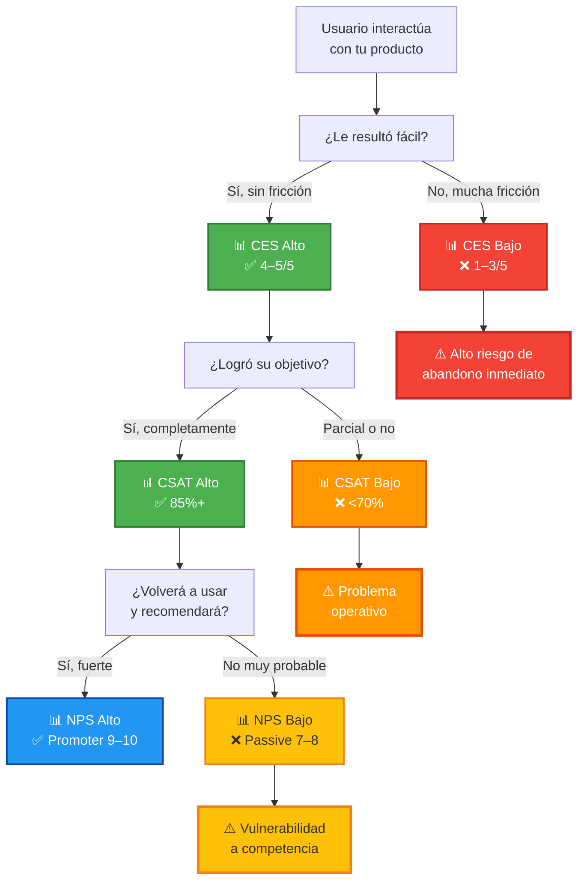

# Customer Centricity: CES vs NPS — Métricas en Profundidad (Clase 10)

**Curso:** Customer Centricity en Tecnologías de la Información (ISIL, 2026-1)  
**Docente:** Henry Joseph Paredes del Alamo  
**Fecha:** [Sesión 10]

---

## Idea principal de la clase

Después de medir con NPS y CSAT (clase 9), profundizamos en la distinción crucial entre **CES** (Customer Effort Score) y **NPS** (Net Promoter Score). Ambas son métricas de satisfacción, pero responden preguntas diferentes y se usan en momentos distintos del viaje del cliente. Entender cuándo usar cada una es la diferencia entre optimizar la experiencia correctamente o desperdiciar recursos en lo incorrecto.

> **Principio clave:** El esfuerzo bajo no garantiza recomendación, pero el esfuerzo alto garantiza abandono.

---

## Cuadro comparativo: CES vs NPS vs CSAT

| Aspecto | **CES** (Customer Effort Score) | **NPS** (Net Promoter Score) | **CSAT** (Customer Satisfaction) |
|---|---|---|---|
| **Pregunta clave** | ¿Cuán fácil fue resolver tu problema? | ¿Qué tan probable es que recomiendes? | ¿Estás satisfecho con [X interacción]? |
| **Escala** | 1–5 o 1–10 (difícil → fácil) | 0–10 (nunca → definitivamente) | 1–5 (muy insatisfecho → muy satisfecho) |
| **Enfoque principal** | **Fricción/esfuerzo operativo** | **Lealtad/intención de promover** | **Satisfacción puntual** |
| **Mide** | Experiencia operativa | Predictor de crecimiento orgánico | Satisfacción con resultado específico |
| **Aplicación temporal** | Post-transacción (inmediato) | Post-experiencia completa | Post-cada-interacción |
| **Señal de éxito** | CES alto (≥4/5) = experiencia sin fricción | NPS ≥ 60 = buen predictor de crecimiento sostenido | CSAT ≥ 85% = usuarios contentos |
| **Indicador de riesgo** | CES bajo (<3/5) = abandono probable | NPS < 0 = riesgo crítico | CSAT < 70% = problemas operativos |
| **Correlación con churn** | **ALTA:** Esfuerzo alto = alta probabilidad de no retorno | **MEDIA-ALTA:** Baja recomendación sugiere baja lealtad | **MEDIA:** Insatisfacción puntual no implica abandono total |
| **Ejemplo en banca** | "¿Cuán fácil fue transferir dinero?" → Si es muy complicado, no vuelven | "¿Recomendarías este banco?" → Predice cambio a banco competidor | "¿Tu transacción se procesó correctamente?" → Mide eficiencia operativa |
| **Ejemplo en delivery** | "¿Fue fácil hacer tu pedido?" → Si requiere muchos clics, abandono | "¿Recomendarías esta app a un amigo?" → Predice crecimiento | "¿Llegó a tiempo?" → Mide cumplimiento de promesa |
| **Mejora derivada** | Reducir pasos, simplificar flujos, eliminar formularios innecesarios | Entender razones de rechazo, mejorar valor percibido global | Ajustar SLA, mejorar operaciones puntuales |

---

## 1. CES: Customer Effort Score

### Definición y contexto

**CES** mide cuánto esfuerzo tuvo que invertir un cliente para resolver su problema o completar una tarea. Es una métrica de **fricción operativa**.

**Pregunta típica:** *"En una escala de 1–5, ¿cuán fácil fue para usted hacer su transacción?"*

### Por qué es importante

Un cliente no necesita estar "muy satisfecho" para volver. Lo que **realmente necesita** es no sufrir fricción innecesaria. Un usuario que logra su objetivo sin dolor volverá. Un usuario que logra su objetivo pero con 10 pasos de frustración probablemente no.

**Investigación de Forrester:** Clientes con **bajo esfuerzo** tienen 3.5× más probabilidad de permanecer leales que aquellos con **alto esfuerzo**.

### Cuándo medir CES

- **Post-transacción específica:**
  - Después de hacer una compra
  - Después de contactar soporte
  - Después de cambiar contraseña
  - Después de cancelar una suscripción

- **No es adecuado para:** medir lealtad global o intención de recomendación

### Ejemplo: RAPIDGO (de tu documentación)

En la actividad 1 de Customer Centricity, RAPIDGO debería medir CES así:

| Momento | Pregunta CES | Target | Acción si falla |
|---|---|---|---|
| Post-pedido | "¿Fue fácil hacer tu pedido?" | CES ≥ 4/5 | Reducir pasos de checkout, simplificar interface |
| Post-cancelación | "¿Fue fácil cancelar?" | CES ≥ 4/5 | Evitar fricción intentada (permitir cancelación fácil) |
| Post-soporte | "¿Fue fácil contactar soporte?" | CES ≥ 4/5 | Mejorar tiempos de respuesta, claridad de opciones |

### Cómo actuar con CES bajo

```
CES bajo → Identificar paso problema → Simplificar/eliminar → Re-medir CES
```

**Ejemplo real:**
- **Problema:** Usuario reporta CES=2 al cambiar método de pago
- **Diagnóstico:** Formulario requiere 8 campos, upload de documento, verificación lenta
- **Solución:** Auto-rellenar campos, permitir foto del documento, verificación instant
- **Re-medición:** CES sube a 4.5

---

## 2. NPS: Net Promoter Score

### Definición y contexto

**NPS** es una métrica de **lealtad y recomendación**. Mide la probabilidad de que un cliente promueva activamente tu producto.

**Pregunta:** *"En escala 0–10, ¿qué tan probable es que recomiendes [producto] a un amigo o colega?"*

### Categorización de respuestas

- **9–10 → Promoters (Promotores):** Clientes leales que recomiendan
- **7–8 → Passives (Pasivos):** Satisfechos pero sin lealtad fuerte; riesgo alto si competencia mejora
- **0–6 → Detractors (Detractores):** Insatisfechos, generan mala reputación boca a boca

**Fórmula:** NPS = (% Promoters) − (% Detractors)

**Rango:** −100 a +100. Contexto por industria:
- **Banca:** NPS promedio ≈ 30–45 (industria poco diferenciada)
- **Fintech:** NPS promedio ≈ 50–70 (alta competencia, expectativa de innovación)
- **Retail online:** NPS promedio ≈ 40–55

### Cuándo medir NPS

- **Post-ciclo completo:**
  - Después de 3–5 transacciones
  - Mensualmente para usuario activo
  - Post-campanya o feature importante

- **No es adecuado para:** medir fricción operativa puntual o satisfacción transaccional

### Ejemplo: RAPIDGO en tu documentación

En actividad 1, el target NPS de RAPIDGO es:
- **Semana 1:** NPS = 35 (MVP básico, asunción)
- **Semana 4:** NPS ≥ 60 (meta de escalabilidad; si lo alcanza, puede expandir a otras ciudades)

**Pregunta a usuarios:**
> "En escala 0–10: ¿Qué tan probable es que recomiendes RAPIDGO a un amigo que necesite delivery rápido?"

### Cómo actuar con NPS bajo

```
NPS bajo → Entrevistar Detractors → Identificar razones → Priorizar fixes → Re-medir NPS
```

**Ejemplo real (RAPIDGO):**
- **Problema:** NPS = 35 después de 2 semanas
- **Detractors dicen:** "Cancelaron mi pedido sin avisar", "No llegó a tiempo", "Atención al cliente no responde"
- **Priorities:**
  1. Fix: Sistema de notificaciones clara ante cancelación
  2. Fix: Mejorar SLA de entrega
  3. Fix: Soporte 24/7 con respuesta en <5 min
- **Re-medición:** 4 semanas después, NPS sube a 62

---

## 3. CSAT: Customer Satisfaction Score

### Definición y contexto

**CSAT** mide satisfacción con una **acción o interacción específica**, no con el producto global.

**Pregunta:** *"¿Estás satisfecho con [X]?"* Escala 1–5 o 1–7.

### Diferencia con NPS y CES

- **CES:** ¿Sin fricción? (proceso)
- **CSAT:** ¿Satisfecho? (resultado)
- **NPS:** ¿Recomendarías? (lealtad)

### En tu documentación: RAPIDGO

CSAT en RAPIDGO se mide post-entrega:

> "¿Estás satisfecho con tu entrega?" → Target: 85% responden "Muy satisfecho" o "Satisfecho"

---

## 4. El triángulo de validación del cliente

Estos tres indicadores no son independientes. Trabajan juntos en un flujo:



### Lectura del diagrama

1. **CES alto → CSAT alto → NPS alto:** El flujo perfecto. Usuario tiene experiencia fácil, logra objetivo, recomendará.
2. **CES bajo → Abandono inmediato:** Sin importar intención, mucha fricción mata cualquier producto.
3. **CES alto pero CSAT bajo:** Proceso fácil pero resultado insatisfactorio. Problema no operativo sino de promesa incumplida.
4. **CSAT alto pero NPS bajo (Passive):** Usuario satisfecho puntualmente, pero no leal. Riesgo de migración a competencia.

---

## 5. Comparación de casos reales

### Caso 1: App bancaria

| Métrica | Escenario | Interpretación |
|---|---|---|
| **CES** | "Transferir dinero toma 3 pasos, sin formularios" CES = 4.8/5 | ✅ Proceso optimizado |
| **CSAT** | "Mi dinero llegó en 2 horas exactas" CSAT = 92% | ✅ Promesa cumplida |
| **NPS** | "Probablemente la recomendaría al cambiar de trabajo" NPS = 72 | ✅ Lealtad alta |

**Acción:** Mantener estándares, explorar nuevas features de valor.

---

### Caso 2: App de delivery

| Métrica | Escenario | Interpretación |
|---|---|---|
| **CES** | "Hacer pedido = 8 pasos, muchos campos" CES = 2.1/5 | ❌ Alta fricción |
| **CSAT** | "Llegó pero 20 min tarde" CSAT = 58% | ❌ SLA incumplido |
| **NPS** | "No la recomendaría" NPS = 15 | ❌ Crítico |

**Acción:** Prioridad máxima → simplificar checkout + mejorar SLA entrega.

---

### Caso 3: Streaming de música

| Métrica | Escenario | Interpretación |
|---|---|---|
| **CES** | "Crear playlist es 2 clics" CES = 4.9/5 | ✅ Muy fácil |
| **CSAT** | "Música disponible y de buena calidad" CSAT = 88% | ✅ Contenido ok |
| **NPS** | "Eh, está bien pero hay competencia mejor" NPS = 42 | ⚠️ Pasivo (riesgo) |

**Acción:** La experiencia operativa es excelente. El problema es **valor percibido**: algoritmo débil, catálogo limitado, precios altos. Necesita innovación de producto, no de UX.

---

## 6. Decisiones estratégicas según métricas

### Si CES es bajo

**Problema:** Experiencia operativa compleja  
**Stakeholder:** Diseño UX/UI + Desarrollo  
**Solución:** Simplificar flujos, reducir pasos, mejorar claridad  
**Métrica de éxito:** CES sube de 2 a 4+ en 2–3 sprints

### Si CSAT es bajo

**Problema:** Promesa no cumplida o expectativa mal gestionada  
**Stakeholder:** Operaciones + Producto  
**Solución:** Mejorar SLA, alinear promesa con realidad, entrenar equipo operativo  
**Métrica de éxito:** CSAT sube de 60% a 85%+ en 4 semanas

### Si NPS es bajo

**Problema:** Falta de lealtad, vulnerabilidad a competencia  
**Stakeholder:** Producto + Liderazgo estratégico  
**Solución:** Entrevistar Detractors, identificar insight profundo, innovar valor  
**Métrica de éxito:** NPS sube de 30 a 55+ en 2–3 meses (cambio más lento porque es cultural)

---

## 7. Ejercicio práctico: Diagnóstico de tu producto

Piensa en una app o servicio digital que usas frecuentemente. Estima:

1. **CES:** ¿Cuán fácil es hacer lo que necesitas? (1–5)
2. **CSAT:** ¿Satisfecho con los resultados? (1–5)
3. **NPS:** ¿Recomendarías a un amigo? (0–10)

Luego responde:
- ¿Hay inconsistencias? (ej: CES alto pero NPS bajo)
- ¿En dónde enfocarías mejoras primero?
- ¿Cuáles serían tus próximas hipótesis de mejora?

---

## Síntesis: El viaje del cliente en tres métricas

| Fase | Métrica | Pregunta | Objetivo |
|---|---|---|---|
| **Ejecución** | CES | ¿Sin fricción? | Optimizar experiencia operativa |
| **Resultado** | CSAT | ¿Satisfecho? | Cumplir promesa |
| **Lealtad** | NPS | ¿Recomendarías? | Generar crecimiento orgánico |

Las tres funcionan como un sistema integrado. Ignorar una es perder vista de parte crítica de tu cliente.
