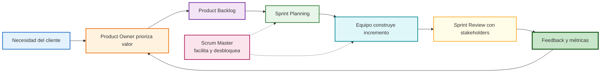
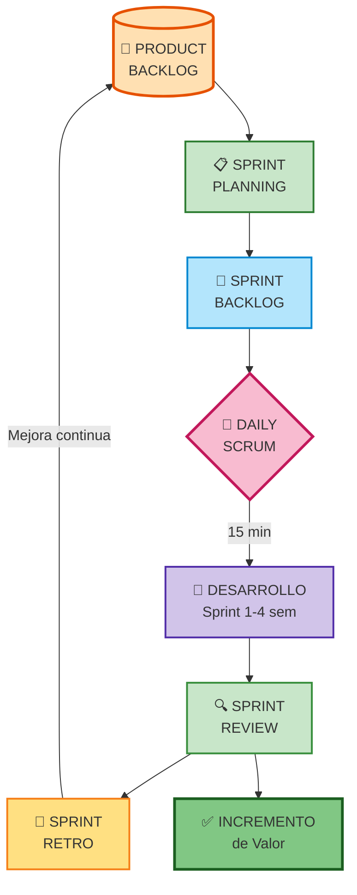

# Customer Centricity: Agilidad y Scrum en la Práctica (Clase 2)

**Curso:** Customer Centricity en Tecnologías de la Información (ISIL, 2026-1)  
**Docente:** Henry Joseph Paredes del Alamo  
**Fecha:** 17/04/2026

---

## Idea principal de la clase

La sesión profundizó en la **Agilidad** como mentalidad (no como proceso) y en cómo Scrum ordena el trabajo de equipos que quieren entregar valor real al cliente. El mensaje central fue claro:

> *"Si el Product Owner no entiende al cliente, el equipo construirá basura... pero la construirá rápido."*

## Mapa visual de Scrum orientado al cliente



Este flujo aterriza la idea central de la clase: Scrum no empieza en el tablero, empieza en una necesidad real del cliente y vuelve al backlog con evidencia.

## Síntesis integrada del material fuente

**Archivo base consolidado:** 40064_S02_PPT.pdf

La síntesis del PPT reforzó el puente entre **Agile Manifesto**, **Scrum**, iteración rápida y feedback continuo. El aporte de esa vista resumida es recordar que la agilidad no es solo una ceremonia de sprint: es un mecanismo de validación constante para entregar valor centrado en cliente.

**Conceptos clave consolidados:** principios ágiles, Scrum, iteración, feedback y métricas de seguimiento.

---

## 1. Repaso: Customer Centricity y Validación Temprana

La clase abrió recordando los conceptos de la sesión anterior para anclar el tema del día.

### Lo que ya sabemos

- **Customer Centricity** no es un eslogan: es un cambio de mentalidad y cultura organizacional. Las decisiones se toman partiendo del cliente, no de la tecnología.
- **MVP vs. MLP:**
  - **MVP** (Minimum Viable Product): versión mínima funcional que permite validar una idea con el menor costo posible.
  - **MLP** (Minimum Lovable Product): versión mínima que ya genera una experiencia positiva, no solo "funciona".
- **Métricas de satisfacción:**
  - **NPS** (Net Promoter Score): mide la probabilidad de que un cliente recomiende el producto (escala 0–10).
  - **CSAT** (Customer Satisfaction Score): mide la satisfacción puntual después de una interacción específica.

### Por qué importar antes de construir

Si no validamos primero con el cliente, corremos el riesgo de construir exactamente lo que nadie pidió. Las métricas como NPS y CSAT sirven para corregir el rumbo **antes** de invertir millones en una solución incorrecta.

---

## 2. Qué es (y qué NO es) la Agilidad

El docente fue enfático en desmontar los mitos más comunes. Muchas organizaciones creen que "adoptaron agilidad" cuando en realidad solo cambiaron el vocabulario.

### Qué NO es la Agilidad

| Mito | Realidad |
|---|---|
| "Es trabajar más rápido" | Es adaptarse y aprender, no acelerar sin parar |
| "Es usar Scrum" | Scrum es un marco; la agilidad es el *mindset* que lo sustenta |
| "Es solo para TI" | Debe permear Marketing, Ventas, Comercial y Operaciones |
| "Tener un tablero Kanban te hace ágil" | Sin metodología detrás, es solo decoración en la pared |
| "Los problemas digitales son técnicos" | La mayoría son fallas de proceso o de entendimiento del cliente |

### Qué SÍ es la Agilidad

- **Adaptación:** cambiar el plan cuando el entorno cambia (mundo VUCA: Volátil, Incierto, Complejo, Ambiguo).
- **Aprendizaje continuo:** cada iteración es una oportunidad de mejorar, no solo de entregar.
- **Entrega constante de valor:** resultados frecuentes y verificables con el cliente, no proyectos de 18 meses que nadie ve.

### Errores comunes al implementar Agilidad

- **Cargo cult:** adoptar las ceremonias (daily, sprint, retrospectiva) sin entender su propósito.
- **Scrum sin PO real:** el Product Owner delega en alguien que no conoce al cliente ni al negocio.
- **Velocidad como único KPI:** el equipo corre mucho, pero en la dirección equivocada.
- **Ignorar la deuda técnica:** se prioriza velocidad y se acumula código frágil que frena el futuro.

---

## 3. El Manifiesto Ágil: Valores y Principios

El Manifiesto Ágil (2001) establece los cuatro valores fundamentales. Cada valor no descarta lo que está a la derecha; simplemente pone más peso en lo de la izquierda.

| Más valor | Menos valor (no eliminado) |
|---|---|
| **Individuos e interacciones** | Procesos y herramientas |
| **Software funcionando** | Documentación extensiva |
| **Colaboración con el cliente** | Negociación contractual |
| **Respuesta ante el cambio** | Seguir un plan rígido |

### Cómo aplicarlo en la práctica

- **Individuos e interacciones:** un equipo que se comunica bien resuelve problemas más rápido que uno con herramientas premium y silencio.
- **Software funcionando:** una demo en vivo vale más que un informe de 50 páginas. Muestra, no describes.
- **Colaboración con el cliente:** involucra al cliente en revisiones de sprint, no solo al final del proyecto.
- **Respuesta ante el cambio:** si el mercado cambia, el backlog cambia. No es fracaso; es inteligencia.

---

## 4. El Ciclo de Entrega Ágil

El proceso ágil es iterativo: nunca termina porque siempre hay algo que mejorar.

```
Definición → Desarrollo → Pruebas → Retroalimentación → Medición → (vuelta al inicio)
```

### Fase a fase

1. **Definición:** ¿Qué necesita el cliente? ¿Cuál es el problema real? Se trabaja con el Product Backlog.
2. **Desarrollo:** el equipo construye lo priorizado en ese sprint (1–4 semanas).
3. **Pruebas:** validación de calidad: ¿funciona? ¿es seguro? ¿cumple los criterios de aceptación?
4. **Retroalimentación:** el cliente/usuario usa el producto y da feedback real, no supuesto.
5. **Medición de resultados:** se usan indicadores para saber si se generó valor:
   - Tasa de conversión (¿cuántos usuarios completaron la acción deseada?)
   - Tiempo de agendamiento (¿cuánto tardó el usuario en lograr su objetivo?)
   - NPS post-lanzamiento

### Mini-ejercicio: identifica la fase

Lee cada situación y di en qué fase del ciclo ágil se encuentra:

| Situación | Fase |
|---|---|
| El equipo revisa los tickets más votados por usuarios en el mes | Definición |
| Un desarrollador entrega el módulo de pagos al área de QA | Desarrollo → Pruebas |
| Se lanza la nueva app y se mide la tasa de abandono de carritos | Retroalimentación / Medición |
| El PO ajusta el backlog después de ver que los usuarios no usan el filtro de búsqueda | Definición (siguiente ciclo) |

---

## 5. Roles en el Marco Scrum

Scrum define tres roles con responsabilidades claras y complementarias. Son **horizontales**, no jerárquicos.

### Product Owner (PO)

- Define el **qué** y el **por qué**.
- Es dueño del *Product Backlog*: lista priorizada de todo lo que el producto necesita.
- Traduce las necesidades del cliente en historias de usuario claras.
- **Responsabilidad clave:** si no entiende al cliente, el equipo construye lo incorrecto.

**Señal de un buen PO:** puede explicar en dos oraciones por qué cada historia de usuario está en el backlog y qué valor aporta.

### Scrum Master

- Es el **facilitador** del equipo, no el jefe.
- Elimina impedimentos (bloqueos) para que el equipo fluya.
- Cuida que las ceremonias Scrum se ejecuten con su propósito original.
- **Madurez del equipo:** un equipo de alta madurez puede prescindir del Scrum Master porque ya sabe autogestionarse.

**No hace:** no asigna tareas, no decide qué se construye, no es el PM del proyecto.

### Development Team (Equipo de Desarrollo)

- No son solo programadores. Incluye diseñadores UX/UI, arquitectos, analistas de datos, testers.
- Definen el **cómo** y ejecutan el trabajo.
- Son **autoorganizados**: deciden cómo distribuir el trabajo dentro del sprint.
- Son **interfuncionales**: en conjunto tienen todas las habilidades para entregar valor.

### Comparación de roles rápida

| Pregunta | Quién responde |
|---|---|
| ¿Qué construimos y para qué? | Product Owner |
| ¿Cómo lo construimos? | Development Team |
| ¿Estamos trabajando bien juntos? | Scrum Master |

---

## 6. Mercenarios vs. Misioneros (Marty Cagan)

El docente introdujo esta comparativa del autor Marty Cagan (*Inspired*, *Empowered*) para describir dos tipos de equipos tecnológicos.

| Dimensión | Mercenarios | Misioneros |
|---|---|---|
| Motivación | Cobrar, cumplir la tarea | Resolver el problema del cliente |
| Actitud ante las tareas | "Me dijeron que lo haga, lo hago" | "¿Tiene sentido hacerlo? ¿Hay mejor forma?" |
| Colaboración | Individualistas, silos | Comparten conocimiento y responsabilidad |
| Horizonte | Resultado inmediato | Impacto sostenible y escalable |
| Interés en el negocio | Ninguno | Entienden cómo su código afecta al cliente |

### Por qué importa

Un equipo misionero puede detectar un error de diseño antes de construirlo y proponer una alternativa mejor. Un equipo mercenario lo construirá aunque sepa que no funciona, porque "eso fue lo que pidieron".

**Pregunta para reflexionar:** ¿tu equipo actual es más mercenario o más misionero? ¿Qué lo haría pasar al otro lado?

---

## 7. Jobs To Be Done: entender la necesidad real

Un cliente no "quiere una app": quiere **lograr algo**. El framework *Jobs To Be Done* (JTBD) ayuda a encontrar la necesidad detrás del pedido.

### Estructura básica

```
Cuando [situación], quiero [motivación], para poder [resultado esperado].
```

### Ejemplos

| Sector | Job To Be Done |
|---|---|
| Banca | "Cuando pago servicios, quiero hacerlo en menos de 1 minuto sin miedo a errores, para no perder tiempo y sentirme seguro." |
| E-commerce | "Cuando hago seguimiento de mi pedido, quiero saber exactamente dónde está, para planificar mi día sin incertidumbre." |
| Salud | "Cuando necesito cita médica urgente, quiero agendarla en menos de 3 clics, para no abandonar el proceso por frustración." |
| Educación | "Cuando reviso mis notas, quiero verlas al instante y con claridad, para saber si necesito reforzar antes del examen." |

### Mini-ejercicio: redacta un JTBD

Piensa en un servicio digital que usas frecuentemente (app bancaria, delivery, streaming). Redacta su JTBD real usando la estructura y luego evalúa: ¿la app actual lo resuelve bien o tiene fricciones?

## Transcripción del PPT: Agilidad y Scrum

### Agilidad y Scrum

Agilidad es una mentalidad que prioriza la adaptación, el aprendizaje continuo y la entrega de valor al cliente. Scrum es un marco de trabajo que estructura esta mentalidad en roles, eventos y artefactos.

**Ejemplo práctico:** Un equipo de desarrollo de una app de reservas de hotel usa Scrum para iterar rápidamente. En cada sprint de 2 semanas, entregan mejoras basadas en feedback de usuarios, adaptándose a cambios como nuevas regulaciones de viajes.

### Roles en Scrum

- **Product Owner (PO):** Representa al cliente, prioriza el backlog y asegura que el equipo construya lo correcto.

**Ejemplo práctico:** En una startup de e-commerce, el PO valida con usuarios que la función de "comprar ahora" es más importante que filtros avanzados.

- **Scrum Master:** Facilita el proceso, elimina obstáculos y promueve la mejora continua.

**Ejemplo práctico:** El Scrum Master resuelve un bloqueo de acceso a servidores, permitiendo al equipo completar el sprint a tiempo.

- **Development Team:** Grupo autoorganizado que desarrolla el producto, incluyendo programadores, diseñadores y testers.

**Ejemplo práctico:** El equipo decide dividir tareas de una nueva feature de chat en vivo, asignando UX a diseñadores y backend a desarrolladores.

### El Ciclo de Vida de Scrum (Sprint)

El trabajo en Scrum se organiza en ciclos cortos llamados Sprints, que permiten inspeccionar y adaptar el producto constantemente.



### Eventos en Scrum

- **Sprint Planning:** Planifica el trabajo del sprint.
- **Daily Scrum:** Reunión diaria de 15 minutos para sincronizar.
- **Sprint Review:** Demuestra el trabajo completado al cliente.
- **Sprint Retrospective:** Reflexiona sobre mejoras.

**Ejemplo práctico:** En Daily Scrum, el equipo reporta progreso en una app móvil, ajustando prioridades cuando un bug retrasa el lanzamiento.

### Artefactos en Scrum

- **Product Backlog:** Lista priorizada de requisitos.
- **Sprint Backlog:** Trabajo seleccionado para el sprint.
- **Increment:** Producto potencialmente entregable al final del sprint.

**Ejemplo práctico:** El Product Backlog de una app de fitness incluye "agregar seguimiento de agua" como alta prioridad basada en feedback de usuarios.

### Beneficios y Desafíos de la Agilidad

**Beneficios:** Mayor flexibilidad, mejor calidad, mayor satisfacción del cliente.

**Desafíos:** Requiere cambio cultural, resistencia al cambio, necesidad de formación.

**Ejemplo práctico:** Una empresa bancaria adopta agilidad, reduciendo tiempo de lanzamiento de productos de meses a semanas, pero enfrenta desafíos en equipos tradicionales resistentes a cambios.

---

## 8. Mapa de Viaje del Cliente (Customer Journey)

La experiencia del cliente no empieza cuando abre la app. Es todo el recorrido, desde que descubre el producto hasta después de usarlo.

### Etapas del Journey

| Etapa | Qué hace el cliente | Qué puede fallar |
|---|---|---|
| **1. Descubre** | Ve un anuncio, oye un comentario, busca en Google | Mensaje confuso, mala visibilidad de marca |
| **2. Evalúa** | Compara opciones, lee reseñas, prueba la app | UX compleja, falta de prueba gratuita, mala reputación |
| **3. Adquiere** | Se registra, paga, activa el servicio | Registro largo, errores en pago, fricción innecesaria |
| **4. Usa** | Completa la tarea que lo trajo | Flujos complicados, errores técnicos, falta de ayuda |
| **5. Repite o abandona** | Vuelve o se va | Falta de valor percibido, mejor alternativa disponible |
| **6. Recomienda** | Habla bien (o mal) a otros | NPS negativo, queja sin respuesta |

### Qué ignoran muchos equipos

- **Las emociones del cliente en cada etapa.** No solo qué hace, sino cómo se siente.
- **Los momentos de abandono.** La mayoría de los usuarios no se quejan: simplemente se van.
- **El postventa.** La experiencia después de la compra determina si el cliente vuelve.

---

## 9. Mitos Finales y Verdades Incómodas

| Mito | Verdad |
|---|---|
| "Somos ágiles porque hacemos dailies" | Si el daily no sirve para detectar bloqueos, es teatro |
| "El Kanban nos volvió ágiles" | Un tablero sin disciplina de flujo es solo papelería digital |
| "La agilidad es cosa de TI" | El equipo ágil más efectivo incluye negocio, diseño y tecnología |
| "La documentación no importa en agilidad" | Importa: lo que no importa es la documentación que nadie lee |
| "Ser ágil significa no planificar" | Se planifica constantemente, en ciclos cortos y con datos reales |

---

## Checklist de comprensión

Antes de la siguiente clase, verifica que puedes responder estas preguntas:

- [ ] ¿Cuál es la diferencia entre MVP y MLP? ¿Por qué importa?
- [ ] ¿Qué diferencia al Manifiesto Ágil de un proceso Scrum?
- [ ] ¿Qué hace realmente el Product Owner? ¿Por qué es el rol más crítico?
- [ ] ¿Qué hace (y qué NO hace) el Scrum Master?
- [ ] ¿Qué es un equipo misionero según Marty Cagan?
- [ ] ¿Puedes escribir un JTBD de un producto que uses a diario?
- [ ] ¿Cuáles son las etapas del Customer Journey y cuál es la más ignorada?

---

## Glosario rápido

| Término | Definición en una línea |
|---|---|
| **Agilidad** | Mentalidad de adaptación y aprendizaje continuo para entregar valor frecuente |
| **Scrum** | Marco de trabajo que organiza equipos en sprints para entregar valor iterativamente |
| **Product Backlog** | Lista priorizada de todo lo que el producto necesita, gestionada por el PO |
| **Sprint** | Ciclo de trabajo fijo (1–4 semanas) al final del cual se entrega algo funcionando |
| **NPS** | Net Promoter Score: mide si el cliente recomendaría el producto (0–10) |
| **CSAT** | Customer Satisfaction Score: mide satisfacción en una interacción específica |
| **JTBD** | Jobs To Be Done: framework para entender la necesidad real detrás de un pedido |
| **Customer Journey** | Mapa de todas las etapas que recorre un cliente, desde que descubre el producto hasta que recomienda o abandona |
| **VUCA** | Entorno Volátil, Incierto, Complejo y Ambiguo; contexto donde la agilidad es esencial |
| **Misionero (Cagan)** | Equipo motivado por propósito, no solo por tareas asignadas |
| **Mercenario (Cagan)** | Equipo que ejecuta sin cuestionar el valor de lo que construye |

---

## Próximos pasos

- La próxima semana se abre la **PA1** (Evaluación Permanente 1): trabajo grupal basado en un caso práctico sobre Customer Centricity y Agilidad.
- Revisar el Manifiesto Ágil completo (12 principios): [agilemanifesto.org](https://agilemanifesto.org/iso/es/manifesto.html)
- Lectura recomendada: *Inspired* de Marty Cagan (especialmente los capítulos sobre Product Owner y equipos misioneros).
