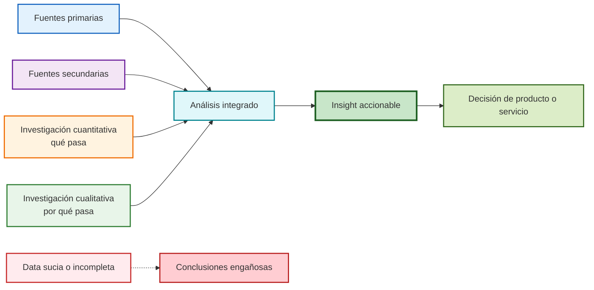

# Investigación y Análisis para la Comprensión del Cliente (Clase 3)

**Curso:** Customer Centricity en Tecnologías de la Información (ISIL, 2026-1)  
**Docente:** Henry Joseph Paredes del Alamo  
**Fecha:** 09/05/2026

## 📌 Introducción

En esta clase exploramos cómo las empresas modernas utilizan **datos y herramientas de investigación** para entender profundamente las necesidades, frustraciones y comportamientos de los usuarios. El enfoque principal es "ponerse en los zapatos del cliente" para identificar sus "dolores" y diseñar soluciones que realmente resuelvan problemas.

**Principio clave:** Los datos muestran el comportamiento; las entrevistas muestran la motivación. Ambos son necesarios para una comprensión completa.

## Mapa visual de comprensión del cliente



El valor del gráfico es mostrar que una buena decisión no sale de una sola fuente: aparece cuando métodos y fuentes se combinan con limpieza y análisis.

---

## 1. Experiencia de Usuario y Frustración Digital

La clase comenzó analizando experiencias reales de frustración en productos digitales. Como diseñadores o gestores, debemos identificar estos "puntos de dolor" para mejorar la experiencia del usuario.

### Ejemplos de Frustraciones Comunes

| Producto | Frustración | Impacto |
| --- | --- | --- |
| **Netflix** | Contenido no disponible o errores de conexión | Usuario abandona la plataforma |
| **Yape** | Sistema caído sin alternativas de pago | Transacción bloqueada, pérdida de confianza |
| **Falabella/Retail** | Restricciones de compra no claras (límites de unidades) | Flujo interrumpido, abandono del carrito |
| **Rappi/Uber** | Cancelaciones después de tiempo de espera | Pérdida de tiempo y dinero |

**Lección:** Las frustraciones digitales ocurren cuando el producto falla en momentos críticos, generando abandono y mala reputación.

---

## 2. Tipos de Investigación: Cualitativa vs. Cuantitativa

El núcleo de la comprensión del cliente radica en la complementariedad de estos dos enfoques de investigación.

### Investigación Cuantitativa (¿Qué?, ¿Cuánto?, ¿Cuándo?)

Se basa en números y estadísticas para medir comportamientos a gran escala.

**Características:**

- **Herramientas:** Encuestas cerradas, Google Analytics, mapas de calor, A/B Testing
- **Propósito:** Medir patrones y tendencias
- **Ventaja:** Escalable, objetiva

**Ejemplo en Spotify:**

- Medir *Skip Rate* (tasa de saltos de canciones)
- Tiempo de retención en playlists
- Indica **qué** está fallando, pero no **por qué**

### Investigación Cualitativa (¿Cómo?, ¿Por qué?)

Busca entender motivaciones, emociones y razones detrás de las acciones.

**Características:**

- **Herramientas:** Entrevistas en profundidad, focus groups, observación directa
- **Propósito:** Explorar sentimientos y contextos
- **Ventaja:** Profunda, reveladora

**Ejemplo en Spotify:**

- Preguntar: "¿Por qué saltas las canciones?"
- Revela que el algoritmo sugiere géneros no deseados en contextos específicos

**Frase clave:** "Los datos muestran el comportamiento; las entrevistas muestran la motivación."

---

## 3. Fuentes de Información: Primarias y Secundarias

Para investigar, es crucial distinguir entre fuentes propias y externas.

### Fuentes Primarias

- **Definición:** Investigaciones propias realizadas por la empresa para sus clientes específicos
- **Ejemplos:** Encuestas directas, datos internos de uso, feedback de soporte
- **Ventaja:** Específica para tu negocio y usuarios reales

### Fuentes Secundarias

- **Definición:** Información pública generada por terceros
- **Ejemplos:** Consultoras como McKinsey, Gartner, Ipsos o Arellano
- **Ventaja:** Tendencias globales y benchmarks

**Advertencia importante:**

- La fuente secundaria da tendencias globales (ej. "A la Gen Z le gustan los juegos inmersivos")
- La primaria revela tu realidad específica (ej. "Mis usuarios Gen Z juegan en el trabajo y prefieren partidas rápidas")

**Recomendación:** Usar secundaria para contexto, primaria para decisiones específicas.

---

## 4. El Proceso de Análisis de Datos

Analizar datos no es solo mirar números, sino seguir un proceso estructurado de 7 pasos para asegurar calidad y validez.

### Los 7 Pasos del Análisis

| Paso | Descripción | Importancia |
| --- | --- | --- |
| **1. Recopilación** | Obtener datos de diversas fuentes | Base sólida de información |
| **2. Exploración** | Verificar completitud de la data | Identificar gaps iniciales |
| **3. Limpieza** | Eliminar "data basura" | Crítico: "Garbage in, Garbage out" |
| **4. Análisis Exploratorio** | Primer contacto con hallazgos | Descubrir patrones iniciales |
| **5. Modelado Analítico** | Crear patrones o modelos | Estructurar insights |
| **6. Interpretación** | Convertir modelos en conclusiones | Hacer accionable |
| **7. Documentación** | Registrar resultados | Preservar conocimiento |

**Énfasis en Limpieza:** Si la data de entrada es mala, todo el análisis será erróneo. Este paso es crucial para evitar conclusiones falsas.

---

## 5. El Concepto de "Insight"

Un **insight** no es un dato aislado, sino una conclusión valiosa que surge de correlacionar múltiples datos para revelar patrones profundos.

### ¿Qué hace valioso un Insight?

- **No es descriptivo:** No solo "los jóvenes abandonan"
- **Es explicativo:** "Los jóvenes abandonan porque..."
- **Es accionable:** "...por eso debemos cambiar X"

### Ejemplo Práctico: Insight en Telecomunicaciones

```text
DATOS INDIVIDUALES:
├─ Dato 1: Clientes jóvenes abandonan la empresa
├─ Dato 2: Baja interacción con la App
└─ Dato 3: Alto uso de soporte telefónico

INSIGHT CORRELACIONADO:
"La App no resuelve las necesidades del segmento joven, 
obligándolos a llamar (lo cual odian) y, por frustración, 
terminan abandonando el servicio."

ACCIÓN RESULTANTE:
- Rediseñar App con features para jóvenes
- Mejorar soporte digital
- Reducir churn en 20%
```

**Lección:** Los insights transforman datos en estrategia.

---

## 6. Mejores Prácticas para Entrevistas

Para obtener información valiosa en entrevistas cualitativas, el profesor recomendó técnicas específicas.

### Recomendaciones Clave

| ❌ Evitar | ✅ Recomendar |
| --- | --- |
| Preguntas de Sí/No | Preguntas abiertas |
| Sugestionar respuestas | Dejar hablar libremente |
| Hablar más que escuchar | Escuchar 80%, hablar 20% |

### Ejemplos de Preguntas Efectivas

**Preguntas Abiertas:**

- "Cuéntame la última vez que tuviste problemas con..."
- "¿Cómo lidias con este problema actualmente?"
- "¿Qué cambiarías en este producto?"

**Técnica:** No sugestionar. En lugar de "¿Te parece bonito mi producto?", preguntar "¿Qué te parece este diseño?"

**Actitud:** Dejar de lado la pasión por tu idea para escuchar críticas reales.

---

## 7. Temas Administrativos: PA1

### Información sobre la Evaluación Práctica 1

- **Estado:** Ya activa en Isil Plus
- **Contenido:** Caso práctico basado en semanas 1-3 (MVP, Agilidad, Roles, Objetivos y contenidos de hoy)
- **Plazo:** Hasta el próximo viernes a las 6:59 PM
- **Grupos:** Asignados aleatoriamente, 5-6 personas por grupo
- **Dónde ver grupos:** Sección "Participantes" de Isil Plus

**Recomendación:** Revisar contenidos previos y coordinar con el grupo temprano.

---

## 📊 Conexión con Otras Clases

- **Clase 1-2:** Fundamentos de Customer Centricity y metodologías ágiles
- **Clase 4:** Marcos de mapeo (User Persona, Journey Map, Empathy Map)
- **Análisis Estadístico:** Datos cuantitativos para investigación
- **Dirección de Datos:** Fuentes y gestión de data primaria/secundaria

---

## 💡 Conclusiones Clave

1. **Frustraciones digitales:** Identificar "puntos de dolor" es el primer paso para mejorar productos
2. **Cuantitativo + Cualitativo:** Los números muestran qué pasa; las entrevistas explican por qué
3. **Fuentes primarias vs secundarias:** Usar externas para contexto, propias para decisiones específicas
4. **Proceso de análisis:** Limpieza de datos es crítica para evitar errores
5. **Insights:** Correlacionar datos para conclusiones accionables
6. **Entrevistas efectivas:** Preguntas abiertas, escuchar más que hablar
7. **PA1:** Caso práctico integrador, coordinar con grupo

---

Clase 3 — Customer Centricity en Tecnologías de Información | ISIL 2026-1
