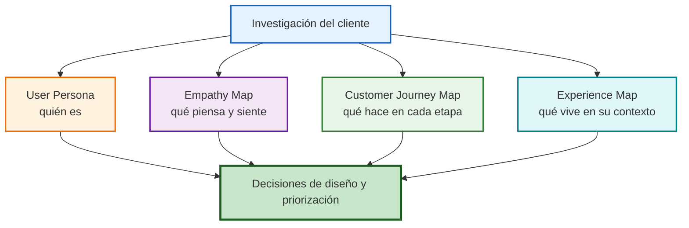
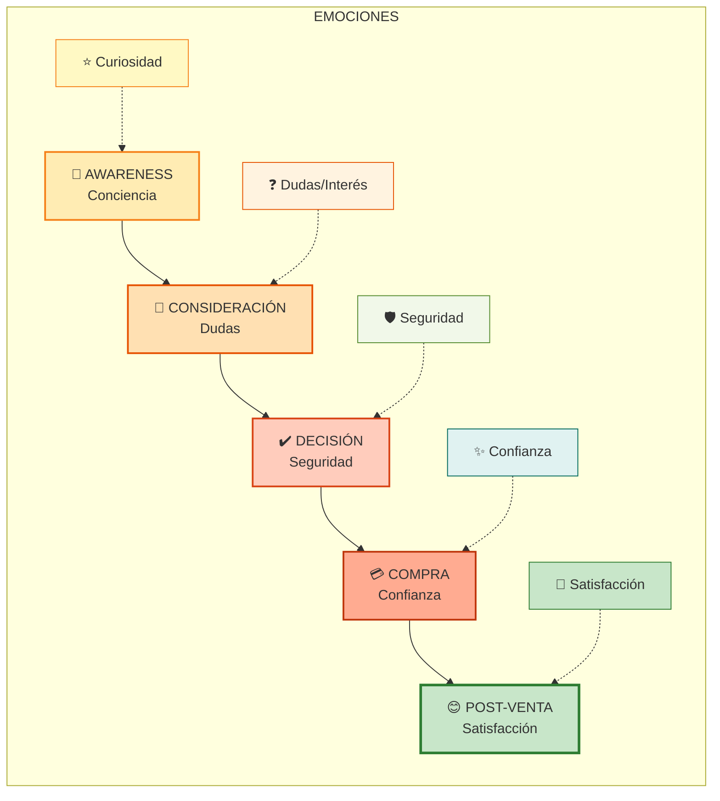

# Marcos Iniciales para Mapeo del Proceso del Cliente (Clase 4)

**Curso:** Customer Centricity en Tecnologías de la Información (ISIL, 2026-1)  
**Docente:** Henry Joseph Paredes del Alamo  
**Fecha:** 12/05/2026

## 📌 Introducción

Esta clase, dirigida por **Henry Joseph Paredes del Alamo**, se centró en herramientas clave para el diseño de experiencias de usuario y la comprensión del comportamiento del cliente. Construir soluciones digitales exige **ver a través de los ojos del cliente**. En esta clase aprenderemos herramientas poderosas que nos permiten plasmar visualmente quiénes son nuestros usuarios, cómo interactúan con nuestro producto, y qué piensan y sienten en cada momento.

**Principio clave:** No queremos construir lo que nosotros creemos que el cliente necesita. Queremos construir lo que el cliente **realmente necesita**.

## Mapa visual de herramientas de mapeo



Este esquema ayuda a no mezclar herramientas: cada marco responde una pregunta distinta y juntos construyen una visión más completa del cliente.

---

## 1. User Persona: Ponle un Rostro a tu Cliente

### ¿Quién es tu cliente? ¿Y tu usuario?

Antes de empezar, es crítico distinguir dos roles:

| Rol | Definición | Ejemplo |
| --- | --- | --- |
| **Usuario** | La persona que **usa/consume** el producto. Es quien nos da feedback. | Empleado que usa Slack |
| **Cliente/Buyer** | La persona que **compra/paga** por el producto. Busca ROI. | Gerente que compra licencias de Slack |

En B2B especialmente, el Buyer y el Usuario son diferentes. Pero el producto se diseña pensando en el **Usuario**, aunque el Buyer es quien decide si comprar.

* **Ejemplo:** En el caso de los pañales, el cliente es la madre/padre, pero el usuario es el bebé. Si el pañal irrita al bebé (usuario), el cliente dejará de comprarlo.

---

### ¿Qué es un User Persona?

* **Definición:** Es una representación semi-ficticia del usuario ideal basada en datos reales (demográficos, psicográficos, objetivos y comportamientos). No es una persona real, pero sus atributos personifican a un grupo de usuarios.
* **Construcción:** Se basa en investigaciones cualitativas y cuantitativas. Es vital no intentar que todos los perfiles calcen en uno solo; si los atributos son muy distantes (ej. diferencia generacional de 10 años), se deben crear varios perfiles.

---

### ¿Qué implica conocer a tu usuario?

Para crear un **User Persona** (representación semificticia del usuario ideal), necesitas información en 5 dimensiones:

#### 1️⃣ Datos Demográficos

```
Edad, Género, Dónde vive, Ocupación, Nivel educativo
Ejemplo: Carlos, 35 años, Ingeniero, Lima, Jefe de Producto
```

#### 2️⃣ Psicográfico (El más importante)

```
Intereses, Motivaciones, Frustraciones, Hobbies, Creencias, Estilo de vida
Ejemplo: Motivado por innovación, frustrado por lentitud, 
         le importa eficiencia, cree en el trabajo ágil
```

#### 3️⃣ Comportamientos

```
¿Qué usa actualmente? ¿Cómo se comunica? ¿Dónde está mayormente?
Ejemplo: Usa Google Drive, Slack, Excel; prefiere Zoom sobre llamadas;
         pasa 8h/día en computadora
```

#### 4️⃣ Historia Personal

```
Background que ayude a entender por qué es así
Ejemplo: Trabajó en startup durante 5 años donde implementaron 
         metodología Agile; ahora valora la eficiencia
```

#### 5️⃣ Objetivos

```
Metas y necesidades que quiere satisfacer
Ejemplo: Quiere lanzar producto en 4 meses con equipo de 8 personas
```

---

### Cómo Construir un User Persona

#### Paso 1: Investigación (Datos)

* Encuestas cuantitativas (100+ usuarios)
* Entrevistas cualitativas (10-15 usuarios profundos)
* Análisis de data histórica (comportamiento en app)

#### Paso 2: Síntesis (Colaboración)

* Sesiones con stakeholders (Producto, Ingeniería, Marketing, Ventas)
* Identificar atributos relevantes (no todo es importante)
* Discriminar "ruido" vs. "señal importante"

#### Paso 3: Documentación (Visual)

* Crear representación clara (foto, nombre, cita célebre)
* Máximo 1-2 páginas (si no cabe, no es Persona, es una novela)
* Hacerlo visible en la oficina/Slack

---

### 📊 Ejemplo Real: E-commerce de Ropa

```text
PERSONA: María - La Compradora Joven Urbana

[Foto] 
Nombre: María José
Edad: 28 años
Ocupación: Coordinadora de Marketing, agencia digital
Ciudad: CDMX
Salario: $2,500 USD/mes

DEMOGRAFÍA
- Soltera, sin hijos
- Vive en departamento en Polanco
- Universitaria (Licenciatura en Marketing)

PSICOGRAFÍA
- Motivaciones: Tendencias, estilo, verse bien
- Frustraciones: Envíos lentos, devoluciones complicadas
- Hobbies: Instagram, tiendas vintage, viajes
- Estilo: Casual-chic, mezcla ropa local con marcas internacionales
- Valores: Sostenibilidad, apoyo a marcas latinas

COMPORTAMIENTO
- 4h/día en redes sociales (Instagram, TikTok)
- Compra ropa 2-3 veces/mes ($50-150 por compra)
- Busca referencias en influencers antes de comprar
- Paga con tarjeta de crédito o Paypal

HISTORIA
Trabajó en retail durante 2 años. Aprendió a identificar 
tendencias. Ahora quiere comodidad de compra online 
pero con la experiencia de tienda física.

OBJETIVO
"Quiero encontrar ropa bonita, actualizada, a precios justos, 
entregada en mi casa en máximo 2 días."

QUOTE
"Si la ropa se demora más de 3 días, cancelo la orden."
```

---

### 3 Recomendaciones Clave

#### ✅ Recomendación 1: No tienes que encasillar todo en UN solo Persona

```
MEJOR: 3-4 personas diferentes
├─ María (Joven, impulsiva, precio sensible)
├─ Roberto (Padre, calidad importante, busca uniformes)
└─ Elena (Ejecutiva, lujo, busca exclusividad)

Cada uno tiene necesidades distintas → Diseño adaptado
```

#### ✅ Recomendación 2: Calidad > Cantidad (en atributos)

```
❌ MALO: 20 atributos extensos, muy detalle
"María tiene 28 años, 1.68m, pelo castaño, ojos cafés, 
prefiere Starbucks, su canción favorita es..., su película favorita es..."
→ PIERDE EL PROPÓSITO: SER VISIBLE Y FÁCIL DE ENTENDER

✅ BUENO: 5-7 atributos RELEVANTES para el diseño
"María es joven urbanita, impulsiva en compra, valora tendencias,
frustrada por envíos lentos, activa en redes"
→ CLARA, CONCISA, ACCIONABLE
```

#### ✅ Recomendación 3: Identifica "Outliers" pero NO los fuerces

```
Outlier: Usuario que NO encaja en ningún Persona
Ejemplo: Abuela de 75 años que compra ropa online

Decisión:
- Si Abuela = 15% del tráfico → CREA PERSONA NUEVA
- Si Abuela = 0.5% del tráfico → Nota especial (pero no persona)
```

---

## 2. Customer Journey Map vs Experience Map

### Customer Journey Map: Mapeando la Interacción

**¿Qué es?** Una visualización de TODAS las interacciones del cliente con tu marca/producto, mostrando emociones y pensamientos en cada etapa.



#### Estructura de 5 Etapas

```text
ETAPA 1: AWARENESS (Conciencia)
   ↓
El usuario descubre tu marca
Emoción: Curiosidad
Acción: Ve publicidad en Instagram

ETAPA 2: CONSIDERACIÓN
   ↓
Evalúa si necesita lo que ofreces
Emoción: Dudas/Interés
Acción: Lee reviews, compara con competencia

ETAPA 3: DECISIÓN
   ↓
Decide comprar
Emoción: Seguridad (espera)
Acción: Clickea "Comprar" en app

ETAPA 4: COMPRA
   ↓
Realiza la transacción
Emoción: Confianza (pagar)
Acción: Ingresa datos tarjeta

ETAPA 5: POST-VENTA
   ↓
Recibe/usa el producto
Emoción: Satisfacción o Frustración
Acción: Usa el producto, deja reseña
```

> **Punto clave:** El CJM mapea emociones y pensamientos en cada punto de contacto para identificar "puntos de dolor" y oportunidades de mejora.

#### 📊 Ejemplo Real: Compra de Café en Starbucks

```text
JOURNEY MAP - Compra de Frappuccino

┌─────────────────────────────────────────────┐
│ ETAPA 1: AWARENESS                          │
├─────────────────────────────────────────────┤
│ Punto de contacto: Instagram                │
│ Acción: Ve publicidad "Promo 2x1 Frappuccino"
│ Pensamiento: "Eso se ve delicioso"         │
│ Emoción: ⭐ Curiosidad                     │
│ Oportunidad: La publicidad es visual/clara  │
└─────────────────────────────────────────────┘

┌─────────────────────────────────────────────┐
│ ETAPA 2: CONSIDERACIÓN                      │
├─────────────────────────────────────────────┤
│ Punto de contacto: App + Reviews            │
│ Acción: Clickea link, ve sabores disponibles
│ Pensamiento: "¿Cuál sabor elijo? ¿Es caro?"
│ Emoción: 😕 Indecisión                     │
│ Frustración: "¿Por qué hay tantos sabores?" │
│ Oportunidad: Simplificar opciones (recomendaciones)
└─────────────────────────────────────────────┘

┌─────────────────────────────────────────────┐
│ ETAPA 3: DECISIÓN                           │
├─────────────────────────────────────────────┤
│ Punto de contacto: Tienda Física            │
│ Acción: Lee comentarios de otros clientes   │
│ Pensamiento: "Si otros lo compran, es bueno"
│ Emoción: 😌 Seguridad                      │
│ Oportunidad: Reviews visibles en caja       │
└─────────────────────────────────────────────┘

┌─────────────────────────────────────────────┐
│ ETAPA 4: COMPRA                             │
├─────────────────────────────────────────────┤
│ Punto de contacto: Caja/Terminal            │
│ Acción: Paga con tarjeta de crédito         │
│ Pensamiento: "Espero que sea bueno"         │
│ Emoción: 💳 Confianza (al pagar)           │
│ Oportunidad: Confirmación rápida de pago    │
└─────────────────────────────────────────────┘

┌─────────────────────────────────────────────┐
│ ETAPA 5: POST-VENTA                         │
├─────────────────────────────────────────────┤
│ Punto de contacto: Degustación              │
│ Acción: Prueba el frappuccino               │
│ Pensamiento: "¡Perfecto! / ¡Muy dulce!"    │
│ Emoción: ⭐ Satisfacción o 😞 Decepción    │
│ Oportunidad: Feedback (chat, encuesta)      │
│ Acción secundaria: Deja reseña en Instagram │
└─────────────────────────────────────────────┘
```

---

### Experience Map: La Visión Holística

**¿Qué es?** Un mapa aún más amplio que incluye actividades, emociones y contexto EXTERNO al producto. Muestra cómo el usuario se siente antes, durante y después de interactuar con la marca.

#### Diferencia Clave

| Customer Journey Map | Experience Map |
| --- | --- |
| Foco: Interacción con **tu** marca | Foco: Contexto **completo** de la vida del usuario |
| Considera: Lo que tu empresa controla | Considera: Factores externos (otros productos, amigos, contexto) |
| Usuarios: Un solo usuario/marca | Usuarios: Múltiples marcas o productos |
| Interés: Equipos de Producto | Interés: Equipos de Operaciones/Soporte |

#### 📊 Ejemplo: Experience Map Completo de Compra Starbucks

```
┌────────────────────────────────────────────────────────────┐
│ ANTES DE ENTRAR A STARBUCKS                                │
├────────────────────────────────────────────────────────────┤
│ CONTEXTO EXTERNO:                                          │
│ - Lluvia afuera                                            │
│ - Salió de trabajo agotado                                │
│ - Jefe le pidió trabajar más                              │
│                                                             │
│ ACTIVIDADES:                                               │
│ - Camina hacia Starbucks                                  │
│ - Llama a novia: "¿Te compro un café?"                   │
│ - Llama a amigo: "¿Te animas?"                           │
│                                                             │
│ EMOCIÓN: Necesitado de pausa                              │
│ PENSAMIENTO: "Necesito despejar mi mente"                │
└────────────────────────────────────────────────────────────┘

┌────────────────────────────────────────────────────────────┐
│ DENTRO DE STARBUCKS (Journey Map tradicional)             │
├────────────────────────────────────────────────────────────┤
│ [Aquí va Customer Journey Map normal]                      │
│ EMOCIÓN: Curiosidad → Indecisión → Satisfacción           │
└────────────────────────────────────────────────────────────┘

┌────────────────────────────────────────────────────────────┐
│ DESPUÉS DE COMPRAR                                         │
├────────────────────────────────────────────────────────────┤
│ CONTEXTO EXTERNO:                                          │
│ - Se encuentra con colega en la calle                      │
│ - Llama a mamá                                             │
│ - Vuelve a oficina                                         │
│                                                             │
│ ACTIVIDADES:                                               │
│ - Toma café en reunión                                    │
│ - Sube foto a Instagram: "Lunes con Starbucks"           │
│ - Deja reseña: 4.8/5 ⭐                                   │
│                                                             │
│ EMOCIÓN: Renovado, feliz                                  │
│ PENSAMIENTO: "Ahora puedo concentrarme"                   │
└────────────────────────────────────────────────────────────┘

OPORTUNIDADES IDENTIFICADAS:
1. Promo para grupos ("Compra 3, paga 2")
2. Delivery para lluvia
3. Programa de puntos por seguidor en Instagram
4. Música ambiental diferenciada por hora del día
```

---

### Estructura Completa de un Customer Journey Map

```
┌────────────────────────────────────────────────┐
│ ETAPAS DEL JOURNEY                             │
│ (Agrupación de actividades con propósito claro)│
│ Ej: "Consideración de compra"                  │
└────────────────────────────────────────────────┘
                    ↓
┌────────────────────────────────────────────────┐
│ INTERACCIONES DEL USUARIO                      │
│ (Puntos de contacto específicos con tu marca)  │
│ Ej: "Ve publicidad en Instagram"               │
└────────────────────────────────────────────────┘
                    ↓
┌────────────────────────────────────────────────┐
│ ACCIONES DEL CLIENTE                           │
│ (Qué hace exactamente el usuario)              │
│ Ej: "Clickea botón 'Ver más'"                  │
└────────────────────────────────────────────────┘
                    ↓
┌────────────────────────────────────────────────┐
│ EMOCIONES                                      │
│ (Cómo se siente: 😊 😕 😤 😞)                  │
│ Ej: "Indecisión (😕)"                         │
└────────────────────────────────────────────────┘
                    ↓
┌────────────────────────────────────────────────┐
│ FRUSTRACIONES / PAINS                          │
│ (Dónde duele, qué falta)                       │
│ Ej: "Demasiadas opciones"                      │
└────────────────────────────────────────────────┘
                    ↓
┌────────────────────────────────────────────────┐
│ INSIGHTS / OPORTUNIDADES                       │
│ (Cómo podemos mejorar)                         │
│ Ej: "Mostrar 'Lo más popular' destacado"       │
└────────────────────────────────────────────────┘
```

---

## 3. Empathy Map: Accediendo a la Mente del Usuario

### ¿Qué es un Empathy Map?

**Herramienta visual de 6 secciones** que accede a los sentimientos, pensamientos, palabras y contexto del usuario.

```
┌──────────────────────────────────────────────┐
│          EMPATHY MAP (Estructura)             │
├──────────────────────────────────────────────┤
│                                              │
│   ¿QUÉ PIENSA    │    ¿QUÉ OYE             │
│   Y SIENTE?      │                         │
│                  │                         │
│   Preocupaciones │    Lo que dicen         │
│   Aspiraciones   │    amigos/jefes/        │
│   Inquietudes    │    influencers          │
│ ─────────────────┼────────────────────────│
│                  │                         │
│   ¿QUÉ VE?       │    ¿QUÉ DICE Y HACE?   │
│                  │                         │
│   Entorno        │    Actitud pública      │
│   Amigos         │    Comportamiento       │
│   Ofertas        │    Comunicación         │
│                  │                         │
├──────────────────────────────────────────────┤
│  ESFUERZOS          │    RESULTADOS         │
│  (PAINS)            │    (GAINS)            │
│  Obstáculos,        │    Metas, beneficios  │
│  fricciones         │    deseados           │
└──────────────────────────────────────────────┘
```

#### 📊 Ejemplo Real Completo: Usuario de Starbucks

```
┌──────────────────────────────────────────────────────────┐
│            EMPATHY MAP - CARLOS (Usuario Starbucks)      │
├──────────────────────────────────────────────────────────┤
│                                                          │
│ ¿QUÉ PIENSA Y SIENTE?                                  │
│ ├─ "Hay mejores cafés que Starbucks"                   │
│ ├─ "Starbucks es sobrevalorado"                        │
│ ├─ Preocupación: "¿Por qué es tan caro?"              │
│ ├─ Inquietud: "¿Es saludable el azúcar?"              │
│ ├─ Aspiración: "Quiero un café de calidad"            │
│ └─ Frustración: "Me gusta el café pero odio la cafeína"│
│                                                          │
│ ¿QUÉ OYE?                                              │
│ ├─ Amigos: "Ese café es adictivo"                      │
│ ├─ Jefe: "Necesitas descansar, tómate un café"        │
│ ├─ Publicidad: "El mejor café de la ciudad"            │
│ ├─ Redes: Influencers promocionan bebidas exóticas     │
│ └─ Mamá: "El café te va a arruinar el corazón"        │
│                                                          │
│ ¿QUÉ VE?                                               │
│ ├─ Entorno: Muchas cafeterías de Starbucks            │
│ ├─ Amigos: Van a Starbucks en fines de semana         │
│ ├─ Ofertas: "Promo 2x1 frappuccinos"                  │
│ ├─ Competencia: Cafés locales también venden café     │
│ └─ Redes: Bebidas coloridas en Instagram              │
│                                                          │
│ ¿QUÉ DICE Y HACE?                                      │
│ ├─ Actitud: "Yo no necesito Starbucks"               │
│ ├─ Pero va 2-3 veces/semana                          │
│ ├─ Ordena: Frappuccino (bebida dulce, no café puro)   │
│ ├─ Comparte: Foto en Instagram con Starbucks         │
│ └─ Habla con amigos: "¿Vamos a Starbucks?"           │
│                                                          │
│ ESFUERZOS (PAINS) ─ Lo que le duele:                  │
│ ├─ 🔴 Precio alto ($6-10 por bebida)                 │
│ ├─ 🔴 Muchas opciones = parálisis de decisión         │
│ ├─ 🔴 No sabe si es saludable                        │
│ ├─ 🔴 Fila larga en horas pico                       │
│ ├─ 🔴 Intolerancia a la lactosa (pide sin leche)     │
│ └─ 🔴 Tardanza en preparación                         │
│                                                          │
│ RESULTADOS (GAINS) ─ Lo que busca:                     │
│ ├─ ✅ Una bebida que lo energice en la mañana        │
│ ├─ ✅ Sentirse "cool" (imagen social)                 │
│ ├─ ✅ Tiempo de calidad con amigos                    │
│ ├─ ✅ Opciones saludables                             │
│ ├─ ✅ Pago rápido y sin fila                          │
│ └─ ✅ Bebida sin lácteos pero sabrosa               │
│                                                          │
└──────────────────────────────────────────────────────────┘

INSIGHTS GENERADOS:
1. Conflicto interno: dice que no lo necesita pero lo compra
2. Búsqueda de estatus: compartir en redes es importante
3. Sensibilidad al precio: dispuesto a pagar pero quiere valor
4. Necesidad de simplificación: menu abrumador
5. Salud importante: pregunta sobre ingredientes
```

---

## 4. Jobs to be Done (JTBD)

Es un marco de trabajo que sostiene que los usuarios "contratan" productos para realizar un trabajo o resolver un problema, no por el producto en sí.

* **Concepto clave:** No compramos aplicaciones, las contratamos para lograr algo.
* **Ejemplos:**
  * **Taladro:** Nadie quiere un taladro; quieren un agujero en la pared para colgar un cuadro. Si existiera una pegatina que soporte el peso, el usuario preferiría eso para evitar ensuciar.
  * **Taxis (Uber/Didi):** El "trabajo" varía según la situación.
    * *Situación:* Salgo tarde del trabajo -> *Job:* Llegar a casa **seguro y rápido**.
    * *Situación:* No tengo efectivo -> *Job:* Poder **pagar con tarjeta/billetera digital**.

### Tipos de "Jobs":

1. **Funcionales:** Tareas prácticas (ej. que el audífono tenga buena calidad de llamada).
2. **Emocionales:** Cómo se siente el usuario (ej. sentirse concentrado al aislarse del ruido).
3. **Sociales:** Cómo quiere ser percibido (ej. proyectar una imagen tecnológica usando una marca reconocida).

---

## 5. Mitos y Prácticas Comunes (Errores)

### ❌ Mito 1: "El Persona debe tener MÁXIMO detalle"

```
FALSO. Ejemplo de SOBREPERSONALIZACIÓN:

❌ PERSONA DETALLADO (16 atributos):
"Prince Charles
 - Nombre: Charles Philip Arthur George
 - Edad: 75 años
 - Género: Masculino
 - Ubicación: Sandringham House, Norfolk, UK
 - Ocupación: Príncipe
 - Estado civil: Viudo (primera vez), Casado (segunda vez)
 - Hobbies: Arquitectura, sostenibilidad, equitación
 - Educación: Trinity College, Cambridge
 - Género de música: Ópera
 - Película favorita: [...]
 - Comida favorita: [...]
 - ...16 atributos más..."

PROBLEMA: ¿Esto qué me dice sobre CÓMO DISEÑAR para él?
RESPUESTA: NADA específico.

✅ PERSONA SIMPLIFICADO (5 atributos relevantes):
"Charles - Ejecutivo Senior (65-75 años)
 Motivado por: Legado, impacto en sociedad
 Frustrado por: Tecnología compleja
 Valora: Sostenibilidad, tradición
 Objetivo: Dejar marca en iniciativas ambientales"

UTILIDAD: Ahora SÍ sé cómo diseñar:
- Interfaz simple (no tech-savvy)
- Énfasis en impacto social
- Opciones de sostenibilidad destacadas
```

---

### ❌ Mito 2: "Un Persona debe servir para TODOS los usuarios"

```
FALSO. Múltiples Personas = Múltiples necesidades

CASO: Aplicación de Transporte (Rappi, Uber)

❌ UN SOLO PERSONA:
"Usuario promedio, edad 30, quiere transporte rápido"
→ NO FUNCIONA. Los usuarios son MUY diferentes.

✅ TRES PERSONAS DIFERENTES:

PERSONA 1: "María - Joven ejecutiva"
├─ Paga con tarjeta
├─ Valora: Rapidez
└─ Frustración: Esperas > 10 min

PERSONA 2: "Roberto - Padre de familia"
├─ Paga con efectivo
├─ Valora: Seguridad del conductor
└─ Frustración: Precio alto

PERSONA 3: "Elena - Turista"
├─ Paga con app (no tiene efectivo)
├─ Valora: Confiabilidad
└─ Frustración: Desconoce la ciudad

RESULTADO: Diseño adapta a cada una
```

---

### ❌ Mito 3: "Customer Journey = Experience Map (son lo mismo)"

```
FALSO. Están relacionados pero son diferentes.

CUSTOMER JOURNEY MAP (Específico)
"¿Cómo interactúa con MI marca?"
Respuesta: Awareness → Consider → Compra → Post-venta
Uso: Equipos de Producto

EXPERIENCE MAP (Holístico)
"¿Cómo es la VIDA del usuario incluyendo contexto?"
Respuesta: Casa → Trabajo → Amigos → Mi marca → Hogar
Uso: Equipos de Operaciones, Soporte

Analogía:
- CJM = Mirar a través de un telescopio (MI marca)
- ExM = Mirar desde satélite (contexto completo)
```

---

## 6. Guía Rápida: Cuándo Usar Cada Herramienta

```
PREGUNTA                          HERRAMIENTA CORRECTA
─────────────────────────────────────────────────────
"¿Quién es mi usuario ideal?"    → USER PERSONA
                                    Crea representación
                                    
"¿Cómo interactúa con mi         → CUSTOMER JOURNEY MAP
 producto?"                        Muestra 5 etapas
 
"¿Qué pasa en la vida del        → EXPERIENCE MAP
 usuario FUERA de mi marca?"      Contexto holístico
 
"¿Qué siente, piensa, oye        → EMPATHY MAP
 nuestro usuario?"                 6 secciones emocionales
```

---

## 7. Proceso Recomendado: Paso a Paso

### Semana 1: Investigación
```
Día 1-2: Recopila data (encuestas, entrevistas)
Día 3-4: Identifica patrones
Día 5: Síntesis inicial
```

### Semana 2: Creación de Herramientas
```
Día 1-2: Draft User Personas (3-4 drafts)
Día 2-3: Draft Customer Journey (5 etapas)
Día 4-5: Draft Empathy Map (por cada Persona)
```

### Semana 3: Validación
```
Día 1-2: Sesión con stakeholders
Día 3-4: Feedback y ajustes
Día 5: Finalización y visualización
```

### Semana 4: Uso
```
Día 1+: Itera producto basado en insights
        Usa Personas/Maps como referencia en decisiones
```

---

## 8. Conexión con Otras Clases

- **Clase 1-3:** Introducción a Customer Centricity y Agile
- **Clase 5:** Marcos adicionales de mapeo y experiencia
- **Análisis Estadístico:** Datos cuantitativos para Personas
- **Dirección de Datos:** Fuentes de data para investigación

---

## 9. Conclusiones Clave

1. **User Persona:** Ponle un rostro específico a tu cliente (no "todos")
2. **Customer Journey:** Mapa el camino exacto de interacción con tu marca
3. **Experience Map:** Entiende el contexto COMPLETO de la vida del usuario
4. **Empathy Map:** Accede a emociones, pensamientos, frustraciones
5. **Calidad > Cantidad:** 5 atributos relevantes > 20 detallados
6. **Múltiples Personas:** No existe "usuario promedio" en productos complejos
7. **Basadas en Data:** Investigación cuantitativa + cualitativa = Personas reales9. **JTBD:** Los usuarios contratan productos para "trabajos", no por el producto en sí
10. **Benchmarking:** Comparar cobertura de "jobs" con competencia para identificar gaps

---

## 10. Benchmarking y Ciclo de Diseño Digital

El profesor explicó cómo se integran estas herramientas en la creación de productos tecnológicos:

* **Benchmarking de JTBD:** Comparar si nuestra empresa cubre los "trabajos" que el usuario busca en comparación con la competencia.
* **Prototipado (Dummies):** Antes de programar, se crean maquetas (en herramientas como Figma) para probar la usabilidad con usuarios reales.
* **Medición Constante:** Una vez lanzado el producto, se deben usar métricas como el **CSAT (Customer Satisfaction Score)** o **NPS** para medir cada flujo específico (agendar cita, pagar, anular) y realizar mejoras continuas.

---

## 11. Próximos Pasos

**Próximos pasos mencionados:** La próxima semana se habilitará la **PEA 2** (Evaluación Permanente), la cual se entregará en la semana 7. No hay examen parcial, solo 4 PEAs y un trabajo final.
---

**Clase 4 — Customer Centricity en Tecnologías de Información | ISIL 2026-1**
