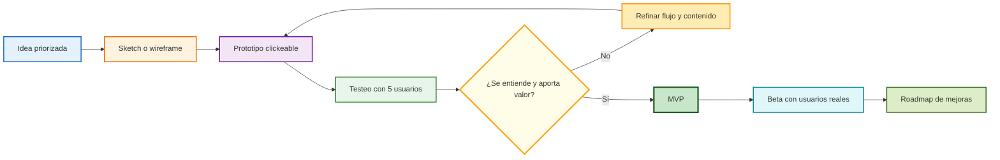
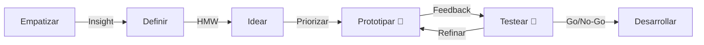

# Design Thinking – Parte 2: Prototipado y Testeo (Clase 7)

**Curso:** Customer Centricity en Tecnologías de la Información (ISIL, 2026-1)  
**Docente:** Henry Joseph Paredes del Alamo  
**Fecha:** [pendiente]

---

## Introducción

Después de empatizar, definir e idear, llegamos a las fases donde **los usuarios ven vida la solución**. Prototipado y testeo nos permiten refinar la solución con feedback real antes de invertir en desarrollo completo.

**Las dos preguntas clave:**
- ¿Cómo prototipamos sin ser diseñadores?
- ¿Cómo hacemos un testeo que realmente nos dé insights?

## Mapa visual de madurez del prototipado



Este gráfico aterriza la secuencia de la clase: la calidad no sale de un prototipo perfecto, sino de iteraciones cortas con evidencia real antes de construir el MVP.

---

## Recapitulación: Las 3 Primeras Etapas



### Empatizar
Recopilar máxima información: ¿Cómo piensan? ¿Qué necesitan? ¿Qué valoran?

### Definir
Priorizar y seleccionar el problema principal. Formulación mediante **"How Might We" (HMW)**.

**Ejemplo HMW:**
- "¿Cómo podríamos reducir el tiempo de espera en una farmacia?"
- "¿Cómo podríamos hacer accesible la educación financiera para personas sin bancarizar?"

### Ideación
- **Divergencia:** Pensar en gran cantidad de soluciones
- **Convergencia:** Encontrar intersección entre **Deseable** (resuelve dolor), **Viable** (es legal/ético) y **Factible** (podemos construirlo)

---

## Fase de Prototipado

### ¿Qué es un prototipo?

**Tangibilizar la idea** en la realidad de cara a mostrar una **vista preliminar que sea entendible por los usuarios**, sin invertir en desarrollo completo.

**Objetivo:** Aprender si la dirección es correcta **antes de comprometer presupuesto**.

### Tipos de Prototipado (De menor a mayor fidelidad)

| Tipo | Tiempo | Costo | Cuándo usar |
|------|--------|-------|-----------|
| **Sketches / Wireframes** | Horas | Bajo | Explorar múltiples conceptos rápido |
| **Prototipos en papel** | 1-2 días | Muy bajo | Testeo de flujo con usuarios |
| **Maquetas interactivas** | 3-5 días | Bajo | Validar UX/UI sin código |
| **MVP (Minimum Viable Product)** | 1-4 semanas | Medio | Testeo más realista, primeros usuarios reales |
| **Prototipo interactivo** | 1-2 semanas | Medio-Alto | Simular experiencia casi real |

### Ejemplo Práctico: App de Gestión de Gastos

**Sprint 1 - Sketches (2 horas)**
- Dibuja cómo vería el usuario su dashboard
- ¿Dónde ve gráficos? ¿Botones? ¿Alertas?

**Sprint 2 - Wireframe (4 horas)**
- Estructura en papel: pantallas, flujo de navegación
- Muestra a 3-5 usuarios: "¿Entiendes cómo se usa?"

**Sprint 3 - Prototipo Figma (8 horas)**
- Clic interactivo entre pantallas
- Usuarios ven movimiento, no solo estáticas

**Sprint 4 - MVP (2 semanas)**
- Backend: solo registro, login, listado de gastos
- Frontend: interfaz real
- Lanzan a 50 usuarios beta

**Feedback realista:** "No entiendo dónde ver mis gastos por categoría" → Rediseñan sprint 5.

---

## Herramientas para Prototipar (Para no-diseñadores)

### Herramientas gratuitas y accesibles

| Herramienta | Propósito | Curva aprendizaje |
|------------|----------|------------------|
| **Figma** | Diseño interactivo, colaborativo | Baja |
| **Miro** | Wireframes, flujos, brainstorm | Muy baja |
| **Marvel** | Prototipo con dispositivos reales | Baja |
| **Axure** | Prototipos avanzados, lógica compleja | Media-Alta |
| **Google Forms** | Encuestas y feedback | Muy baja |
| **Papel + fotos** | Prototipo rápido de baja fidelidad | Muy baja |

### Workflow recomendado (No-diseñador)

**Paso 1:** Sketches en papel durante una reunión
**Paso 2:** Fotografía los sketches
**Paso 3:** Sube a Miro, agrupa y ordena flujos
**Paso 4:** Usa Figma template → copia wireframes
**Paso 5:** Agrega interactividad básica (clicks entre pantallas)
**Paso 6:** ¡Listo! Ya tienes prototipo para testear

---

## Fase de Testeo

### ¿Qué es un testeo efectivo?

**En entorno más real**, observar al usuario **interactuar directamente** con el prototipo, recopilar **feedback cualitativo** (qué piensa, qué siente, qué falla), y validar asunciones antes de desarrollar.

### Preparación del Testeo

**Antes del testeo:**

1. **Define objetivo principal**
   - ¿Qué asunción necesitas validar?
   - Ej.: "¿Los usuarios entienden dónde ven sus gastos?"

2. **Recluta usuarios representativos**
   - No tomes a tu equipo, toma a usuarios reales
   - Mínimo 5 usuarios; máximo 8 (cada uno te da insights)

3. **Crea guía de testeo (no cuestionario)**
   - Escenario: "Imagina que gastaste 50 soles en Starbucks. Registra el gasto."
   - Observa en silencio; deja que fallen
   - Preguntas abiertas: "¿Qué pasó?" en lugar de "¿Fue fácil?"

4. **Ambiente neutral**
   - Sala tranquila, sin distracciones
   - Graba con permiso (video + audio)
   - Duración: 20-30 minutos

### Guía Práctica de Testeo

| Fase | Acciones |
|------|----------|
| **Introducción (2 min)** | Explicar que estás testando el prototipo, no al usuario |
| **Warm-up (3 min)** | Preguntas generales: "¿Cómo manejas tus gastos actualmente?" |
| **Tareas (15-20 min)** | "Por favor, completa estas 3 acciones en el prototipo" |
| **Reflexión (3-5 min)** | "¿Qué te confundió? ¿Qué te gustaría que fuera diferente?" |
| **Cierre (2 min)** | Agradecimiento, incentivo (si corresponde) |

### Recopilación de Feedback

**Registra:**
- ¿Dónde vacila el usuario?
- ¿Dónde sonríe o se frustra?
- ¿Qué comentarios hace espontáneamente?
- ¿Qué tareas no logró completar?

**Después del testeo:**
- Sintetiza aprendizajes en **3-5 insights clave**
- No guardes video; extrae clips de momentos críticos
- Crea matriz: Usuario → Tarea → Resultado → Insight

### Ejemplo: Testeo de App Bancaria

**Prototipo:** App para solicitar crédito digital

**Usuario:** Albañil, 35 años, smartphone como herramienta principal

**Tarea:** "Solicita un crédito de 2,000 soles"

**Lo que pasó:**
- Entró al flujo correcto
- Se perdió en paso 3 (seleccionar propósito del crédito)
- No entendió por qué le pedía foto del DNI
- Completó en 8 minutos, pero con dudas

**Insights:**
- Labels confusos ("Propósito") → cambiar a "¿Para qué necesitas?"
- Foto del DNI necesita contexto → agregar banner "Por seguridad"
- Flujo largo → revisar si realmente necesitas todos los campos

---

## Mitos Comunes en Prototipado y Testeo

### ❌ Mito 1: "El prototipo debe verse perfecto"
**Realidad:** Baja fidelidad es mejor; usuarios se enfocan en funcionalidad, no diseño.

### ❌ Mito 2: "Testeo significa preguntar satisfacción"
**Realidad:** Testeo es **observar comportamiento**, no encuesta.

### ❌ Mito 3: "Con 1-2 usuarios es suficiente"
**Realidad:** 5 usuarios descubren 85% de problemas; 1-2 es insuficiente.

### ❌ Mito 4: "Si gustó en testeo, será éxito en producción"
**Realidad:** Prototipo es simulado. Lanza MVP y observa 1,000 usuarios reales.

### ❌ Mito 5: "El testeo es al final del proceso"
**Realidad:** Testa **temprano y frecuente**. Cada sprint, nuevo testeo.

---

## Ciclo Iterativo: Prototipo → Testeo → Refinar

```
Semana 1-2: Prototipo baja fidelidad
    ↓
Testea con 5 usuarios
    ↓
Insight: Usuarios no entienden campo X
    ↓
Refina prototipo (agrega label, reordena)
    ↓
Semana 3: Prototipo media fidelidad
    ↓
Testea con nuevos 5 usuarios
    ↓
Go/No-go: ¿Procedemos a MVP?
    ↓
Si Go: Desarrollo MVP (4 semanas)
    ↓
Lanza a 100 usuarios beta
    ↓
Feedback real → Product Roadmap
```

---

## Checklist: Prototipado y Testeo Efectivo

### Antes de prototipar
- [ ] ¿Definimos el objetivo central que queremos validar?
- [ ] ¿Elegimos el nivel de fidelidad adecuado?
- [ ] ¿Tenemos herramientas + habilidades mínimas?

### Antes de testear
- [ ] ¿Tenemos 5+ usuarios representativos?
- [ ] ¿Preparamos escenarios y tareas claras?
- [ ] ¿Reservamos ambiente neutral sin distracciones?
- [ ] ¿Grabaremos con permiso?

### Durante el testeo
- [ ] ¿Dejamos que el usuario navegue sin interrupciones?
- [ ] ¿Hacemos preguntas abiertas, no cerradas?
- [ ] ¿Anotamos comportamiento, no satisfacción?

### Después del testeo
- [ ] ¿Sintetizamos en 3-5 insights principales?
- [ ] ¿Prototipo pasa o falla validación?
- [ ] ¿Qué se refina antes del MVP?

---

## Caso Integrado: Plataforma de Educación Financiera

### Contexto
Startup que quiere enseñar educación financiera a jóvenes (18-25 años) sin acceso a asesor.

### Sprint 1: Prototipo baja fidelidad (Semana 1)
- Sketches: Dashboard con cursos, calculadora de ahorro, simulador de inversión
- Papel + fotos

### Sprint 2: Testeo (Día 5)
- 5 usuarios (jóvenes 20-24 años)
- Tarea: "Encuentra un curso sobre fondos de inversión"
- **Resultado:** 4 de 5 se pierden en el menú principal

### Sprint 3: Refinar (Semana 2)
- Rediseña navegación: menú principal más claro
- Agrega iconos para cada categoría
- Prototipo Figma con interactividad

### Sprint 4: Testeo 2 (Día 12)
- 5 nuevos usuarios
- Tarea: "Calcula cuánto ahorrarías en 1 año"
- **Resultado:** Encuentran la sección, pero inputs confusos

### Sprint 5: MVP (Semanas 3-4)
- Desarrollo backend simple: auth + cursos + calculadora
- Frontend básica, pero funcional
- Lanzamiento a 50 usuarios beta

### Resultado final
- Semana 1-4: Prototipo validado
- Semana 5-8: MVP en producción
- Semana 9+: Datos reales → Product Roadmap


---

## Conceptos Avanzados de Prototipado y Validación

### Tipos de Pruebas Rápidas (Testing Methods)

1. **A/B Testing**
   - **Concepto:** Consiste en mostrar dos versiones distintas de una misma pantalla o flujo a usuarios en vivo de forma aleatoria, para medir cuál rinde mejor estadísticamente.
   - **Limitación en Design Thinking:** Solo sirve cuando ya hay tráfico real (después del MVP), no en fase de baja fidelidad.

2. **Fake Door Testing (Puertas Falsas)**
   - **Concepto:** Poner un botón invitando a usar una "nueva funcionalidad que aún no existe". Si el usuario da clic, se le muestra un mensaje ("Estamos trabajando en ello").
   - **Para qué sirve:** Validar el "deseo" o demanda real antes de construir siquiera el prototipo completo.

3. **Prueba Guerrilla (Guerrilla Testing)**
   - **Concepto:** Acercarse a personas en un café o área pública para probar un prototipo rápido de 5 minutos, a menudo a cambio de un incentivo simbólico.
   - **Cuándo usarlo:** Para recoger impresiones instantáneas y descubrir errores obvios de usabilidad a costo cero.

---

## Más Ejemplos Analizados

### Caso 2: Onboarding en SaaS B2B
**Prototipo:** Flujo en alta fidelidad (Marvel) para configurar el perfil de una empresa en un ERP en la nube.
**Misión del Testeo:** "Completa el registro de tu compañía y vincula tu cuenta bancaria".
**El error descubierto:** Los dueños de negocio no tienen a la mano el número SWIFT al registrarse, sentían frustración y abandonaban el flujo.
**Iteración (Refinamiento):** Romper el onboarding en 2 pasos. Permitir ingreso e inicio de uso diario, y solicitar la cuenta bancaria recién al querer emitir la primera factura. El prototipo salvó el funnel de conversión.

---

## Glosario de Términos

- **Wireframe:** Esquema estructural y visual básico (esqueleto) de una interfaz sin diseño estético detallado (colores, fuentes o fotografías).
- **Mockup:** Diseño estático de cómo se verá visualmente el producto final (incluye UI, colores corporativos, tipografía real).
- **MVP (Minimum Viable Product):** Versión del producto con las características suficientes para satisfacer a los primeros clientes y validar las hipótesis clave de negocio. A diferencia del prototipo, el MVP es código real y funcional.
- **Test de Usabilidad:** Método donde se pide a un usuario realizar tareas específicas para observar en qué se equivoca o confunde, revelando problemas de interfaz ("qué hacen realmente").
- **Heatmap (Mapa de calor):** Validación visual pos-lanzamiento que permite ver gráficamente (usando escala de colores) en qué zonas de la pantalla los usuarios hacen más clics o mantienen más tiempo el cursor.
- **Card Sorting:** Técnica para testear de manera temprana cómo estructurar la "Arquitectura de la Información", pidiendo a los usuarios que agrupen tarjetas con temas para ver cómo ellos naturalmente organizarían un menú de navegación.
