# Customer Metrics en el Entorno Digital

**Clase 9 | Customer Centricity en Tecnologías de Información**

---

## Propósito de esta clase

Después de diseñar soluciones centradas en el cliente, es fundamental medir cuán efectivo fue el esfuerzo. Esta clase explora cómo monitorear el éxito de productos digitales a través de métricas específicas que conectan la experiencia del cliente con los resultados del negocio.

---

## 1. La cadena de valor: Métricas de negocio y customer metrics

### ¿De qué hablamos?

Una empresa funciona con dos tipos de métricas que **están directamente relacionadas**:

- **Business Metrics**: Ventas, utilidad, ingreso recurrente anual (ARR), churn, costo de adquisición (CAC)
- **Customer Metrics**: NPS, CSAT, CES, lealtad, satisfacción

**La realidad**: No todas las empresas tienen claras estas métricas, pero puedes darte cuenta por las decisiones que toman.

### Impacto directo: De Customer Metrics a Business Metrics

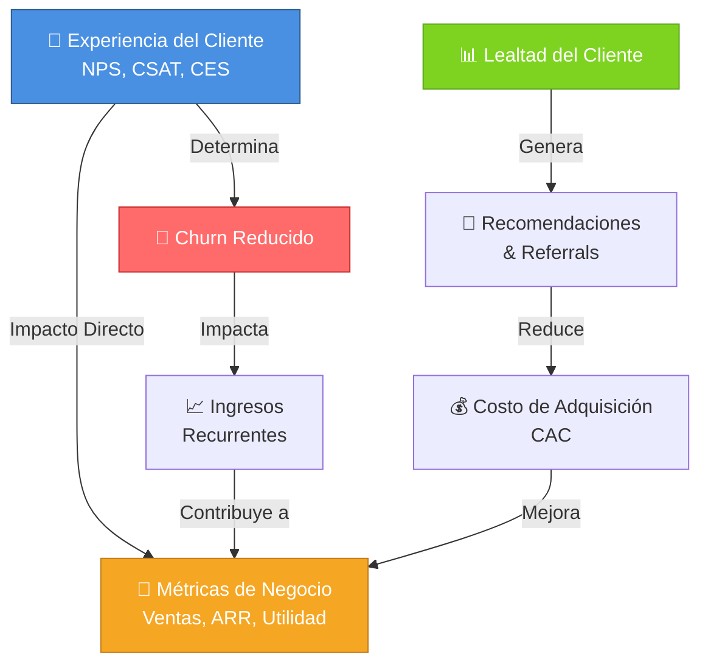

### North Star Metric (NSM)

Es el faro de toda la organización. Define qué éxito significa para tu empresa.

**Definición**: Métrica única que refleja el valor principal que el cliente obtiene del producto y que la empresa identifica como motor de crecimiento a largo plazo.

**Características**:
- Debe reflejar el esfuerzo de TODAS las áreas (negocio, desarrollo, diseño, atención)
- Difícil de definir porque afecta toda la dirección estratégica
- Guía la priorización de todas las decisiones

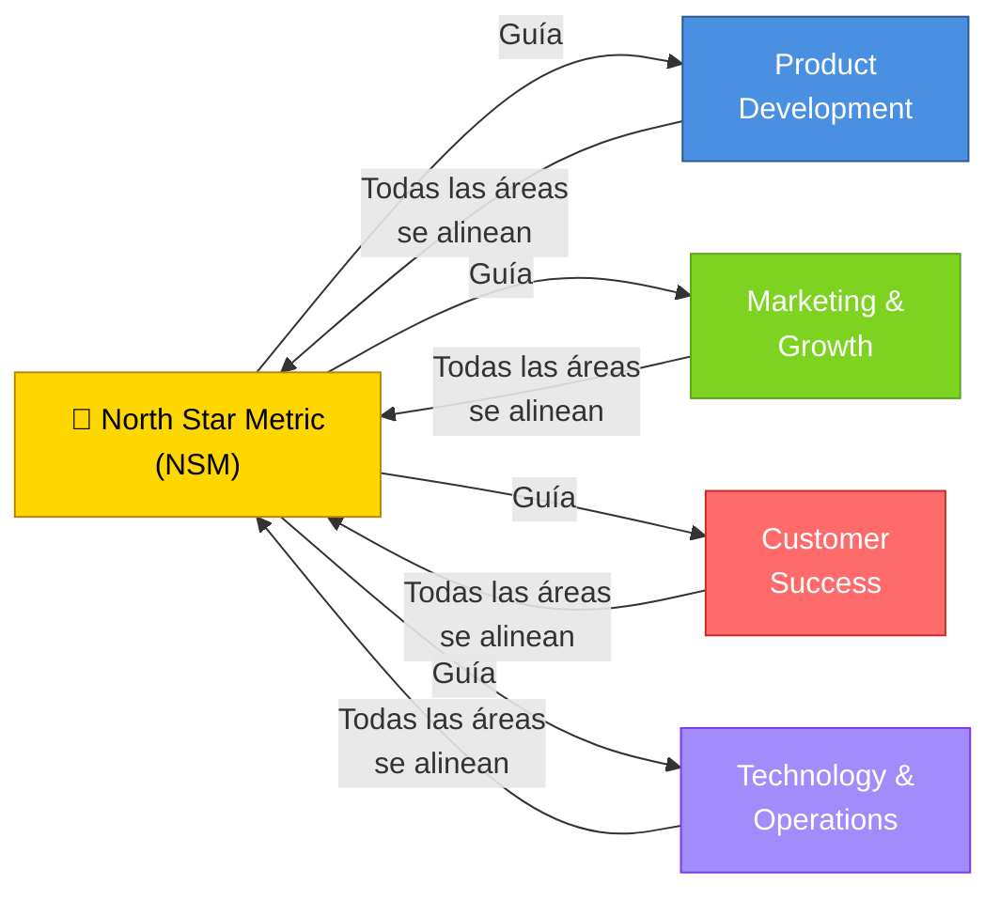

### Relación entre Customer Metrics y Business Metrics

**Conexión clave**: Ninguna empresa puede sobrevivir de forma sostenible teniendo malas métricas de cliente. El mercado actual es transparente y viral: malos clientes = mala reputación = fuga a competidores.

---

## 2. Indicadores principales: NPS, CSAT, CES

### Net Promoter Score (NPS)

**La pregunta**: Del 1 al 10, ¿qué tan probable es que recomiende nuestro producto a amigos o familiares?

**Cómo se calcula**:
```
NPS = % Promotores - % Detractores

Promotores (9-10) = Clientes leales que recomiendan
Neutros (7-8)     = Satisfechos pero sin lealtad
Detractores (0-6) = Insatisfechos, riesgo de fuga
```

**Interpretación**:
- **Cercano a 100%**: Excelente, abundancia de promotores
- **≥ 0**: Equilibrio entre promotores y detractores
- **< 0**: Problema grave, hay más detractores que promotores

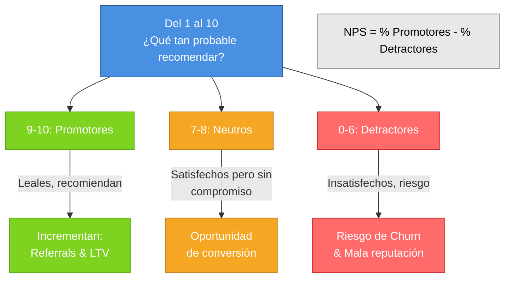

**Preguntas de seguimiento** (dependiendo de la respuesta):
- **Promotores**: ¿Qué podemos hacer para mantener su satisfacción? ¿Qué le gusta más?
- **Neutros**: ¿Qué nos falta para que nos recomiende?
- **Detractores**: ¿Qué problemas tuvo? ¿Qué podríamos mejorar?

---

### Customer Satisfaction Score (CSAT)

**La pregunta**: Del 1 al 5, ¿qué tan satisfecho estás con nuestro producto/servicio?

**Cuándo se usa**: Directamente después de que el cliente use el producto o interactúe con un flujo.

**Interpretación**:
- **70-100%**: Producto satisfaciendo el mercado
- **10-70%**: Rango típico (presencia de insatisfechos)
- **< 10%**: Crisis, casi nadie satisfecho

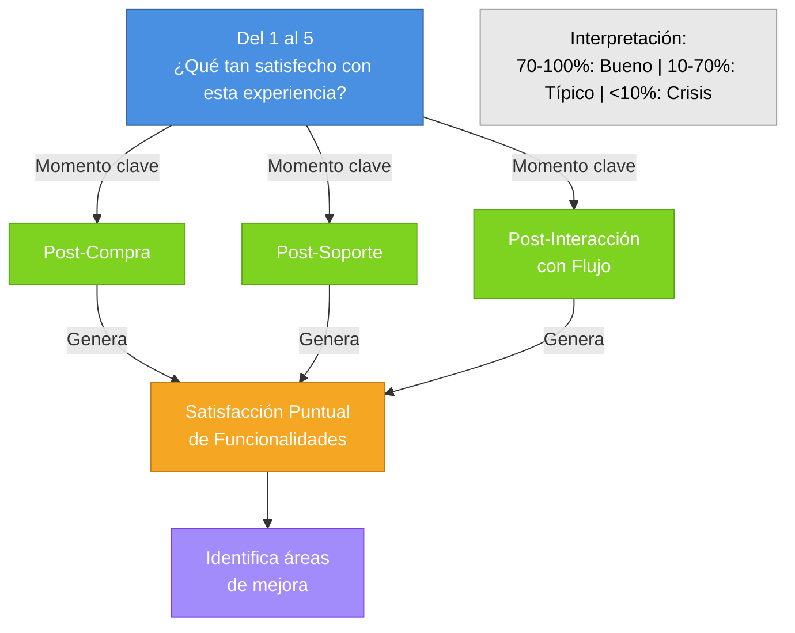

**Preguntas de seguimiento**:
- **General**: ¿Por qué nos dio esta calificación?
- **Promotores**: ¿Qué podríamos mejorar aún más?
- **Neutros**: ¿Qué haría más satisfactoria su próxima compra?
- **Detractores**: ¿Qué cambios sugeriría?

---

### Customer Effort Score (CES)

**La pregunta**: ¿Qué tan fácil fue para usted realizar esta tarea?

**Por qué importa**: Los clientes en 2026 no toleran procesos complejos. Mayor facilidad = mayor lealtad.

**Interpretación**:
- **4-5**: Muy bueno, no requiere inversión urgente
- **2-4**: Oportunidades claras de mejora en UX
- **0-2**: Necesario rediseño del flujo completo

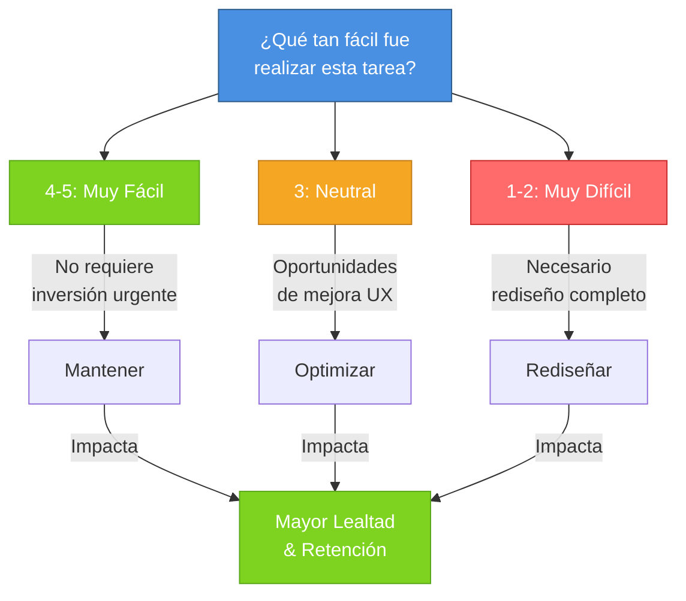

**Preguntas de seguimiento**:
- **Altas (4-5)**: ¿Qué aspectos encontró fáciles? ¿Algo para destacar?
- **Neutra (3)**: ¿Cómo lo hacemos más sencillo? ¿Qué paso fue innecesario?
- **Bajas (1-2)**: ¿Qué obstáculos encontró? ¿Cómo simplificar?

---

### Comparativa de los 3 Indicadores Principales

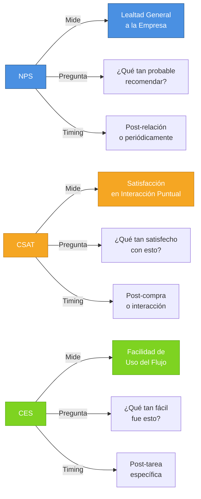

---

## 3. Integración de métricas en el proceso de diseño

### Discovery & Research

Usa NPS, CSAT y CES para **identificar oportunidades de mejora**, no solo para medir lo que ya existe.

**Ejemplos de uso**:
- Alto CES + alto esfuerzo → prioridad máxima
- Comentarios repetidos sobre una funcionalidad en NPS detractores → insights para redesign
- Patrones en CES bajo → rediseño de flujo completo

### Delivery y Mejora Continua

Durante el lanzamiento (especialmente CSAT y CES) se pueden:
- Experimentar con diferentes flujos
- Medir mejoras iterativas
- Tomar insights de clientes para evolucionar la UX


### Experimentación A/B con Métricas

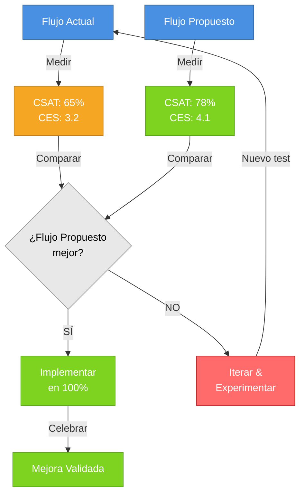

---

## 4. Ciclo de Mejora Continua

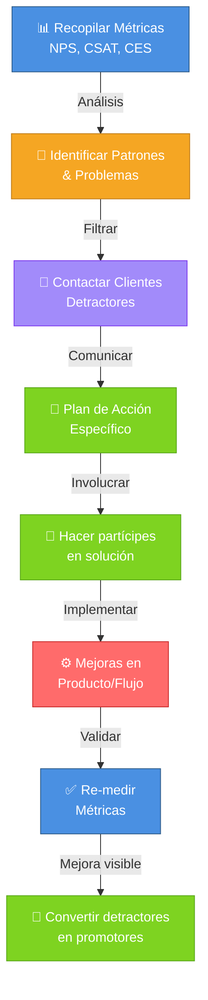

---

## 5. Mitos comunes (y la verdad)

### ❌ Mito 1: Buen NPS = Producto excelente

**Verdad**: NPS mide lealtad a la EMPRESA, no solo al producto. Incluye:
- Atención al cliente
- Experiencia post-venta
- Marca y reputación
- El producto es solo UN factor

### ❌ Mito 2: Si vendo más después de un release = fue exitoso

**Verdad**: Hay muchos factores en juego. Debe medirse cada release con:
- CES específico para ese flujo
- CSAT sobre la nueva funcionalidad
- Impacto directo en el producto, no confundir con marketing o promoción

### ❌ Mito 3: Hacer encuestas todos los días

**Verdad**: Los clientes se aburren y dan respuestas "automáticas". Mejor:
- Hacer preguntas en momentos específicos
- Después de usar un flujo o tarea relevante
- Cuando TÚ necesites tomar una decisión

---

## 6. Buenas prácticas en implementación

### 📌 Práctica 1: Contactar directamente a detractores

No solo observes en un dashboard. **Contacta a los clientes que respondieron como detractores o con baja satisfacción**.

Cuéntales:
- Que tomaste en serio su feedback
- Cuál es el plan de acción específico
- **Hazlos partícipes**: invítalos a probar la mejora

**Efecto**: Conviertes un detractor en promotor, mejoras lealtad y demuestras que escuchas.

### 📌 Práctica 2: Usar métricas para tomar ACCIONES

Las métricas no son solo números para un dashboard. Deben:
- Identificar problemas específicos
- Guiar priorización de trabajo
- Validar que los cambios funcionaron

### 📌 Práctica 3: Combinar cualitativo con cuantitativo

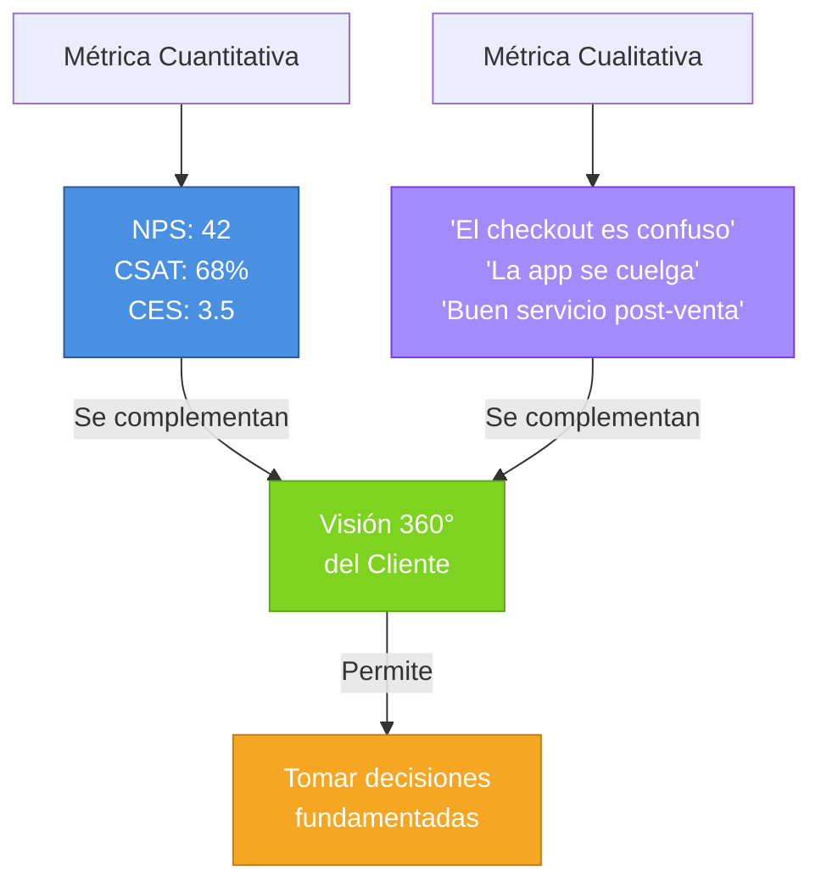

Los comentarios te dicen EL QUÉ y EL POR QUÉ, los números te confirman LA ESCALA.

---

## 7. Priorización: Matriz de Effort vs. Impact

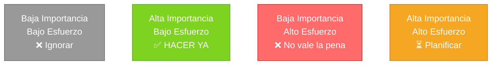

---

## 8. Caso de estudio: El costo de ignorar métricas

### American Airlines (1980s) y Viva Air (2022-2023)

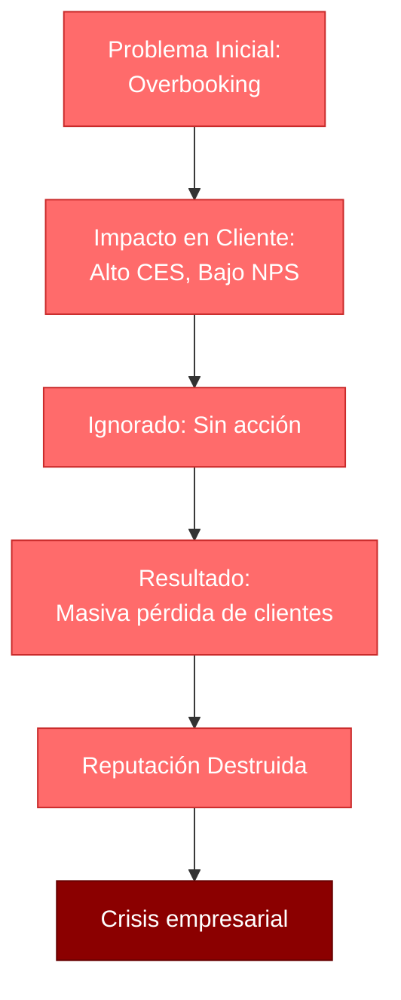

### American Airlines (1980s)

Crisis masiva por **overbooking** (vender más asientos de los disponibles). Miles de clientes migraron a competidores. El daño a la marca fue irreversible durante años.

### Viva Air (Colombia y Perú, 2022-2023)

Cerró operaciones por:
- Overbooking sistemático
- Cambios de vuelos constantes
- Pésimo NPS y CES
- Clientes migrados a Latam, LATAM y otras

**Lección**: Vender barato pero sacrificar experiencia = colapso empresarial. Las métricas de cliente lo hubieran advertido temprano.

---

## 9. Conexiones con otros temas del curso

### Design Thinking + Customer Metrics

Design Thinking te diseña la solución → Customer Metrics te dice si la solución funciona realmente en el mercado.

### Jobs to be Done (JTBD) + Indicadores

JTBD define QUÉ necesita el cliente → CES mide SI nuestro flujo lo hace "fácil" de lograr → CSAT mide SI estamos entregando valor.

### Customer Centricity Holística

La clase 9 cierra el ciclo:
1. Descubrimiento (JTBD, Design Thinking)
2. Construcción (Flujos centrados en usuario)
3. **Medición (NPS, CSAT, CES)** ← Aquí estamos
4. Mejora continua (Loops de feedback)

---

## 10. Conclusiones clave

✅ **Las métricas de negocio dependen directamente de las métricas de cliente**

✅ **NPS mide lealtad, CSAT mide satisfacción puntual, CES mide facilidad**

✅ **Las métricas deben llevar a ACCIONES, no solo a dashboards**

✅ **La cualidad (comentarios) es tan importante como la cantidad (números)**

✅ **Contactar detractores directamente es una buena práctica que convierte**

✅ **Ninguna empresa moderna sobrevive con malas métricas de cliente**

---

## 11. Glosario de términos

### A/B Testing
Metodología de experimentación donde se prueban dos variantes (A y B) de un flujo o funcionalidad simultáneamente, midiendo métricas como CSAT y CES para determinar cuál es más efectiva.

### ARR (Annual Recurring Revenue)
Ingreso anual recurrente. Métrica de negocio que mide el ingreso predecible anual generado por clientes con suscripciones o contratos recurrentes.

### Baseline
Línea base o valor inicial de una métrica. Se captura antes de implementar cambios para medir el impacto real de las mejoras.

### Benchmarking
Proceso de comparar tu rendimiento en métricas (NPS, CSAT, CES) contra competidores o estándares de la industria.

### CAC (Customer Acquisition Cost)
Costo de adquisición de cliente. Métrica de negocio que mide cuánto dinero se gasta para adquirir un nuevo cliente.

### CES (Customer Effort Score)
Indicador que mide qué tan fácil fue para un cliente realizar una tarea específica en tu producto. Escala típica: 1-5.

### Churn
Tasa de deserción de clientes. Porcentaje de clientes que dejan de usar el producto o servicio en un período específico.

### CSAT (Customer Satisfaction Score)
Indicador que mide la satisfacción del cliente con una interacción específica. Pregunta: "¿Qué tan satisfecho estás?" Escala: 1-5.

### Customer Centricity
Filosofía empresarial que coloca al cliente en el centro de todas las decisiones, procesos y diseños. Es el pilar de este curso.

### Customer Metrics
Conjunto de indicadores que miden la experiencia, satisfacción y lealtad del cliente (NPS, CSAT, CES).

### Detractores
Clientes con NPS bajo (0-6). Están insatisfechos y representan riesgo de churn y mala reputación.

### Discovery (Fase de)
Primera fase del proceso de diseño donde se investiga, se recopilan datos y se generan insights sobre clientes y problemas.

### Delivery (Fase de)
Fase de lanzamiento del producto o funcionalidad. Es cuando más se miden CSAT y CES para validar la calidad.

### Feedback Loop
Ciclo continuo de retroalimentación: recopilar datos → analizar → actuar → medir → repetir.

### Insights
Hallazgos profundos derivados del análisis de datos cualitativo y cuantitativo. Permiten tomar decisiones informadas.

### JTBD (Jobs to be Done)
Framework que define el trabajo específico que el cliente necesita realizar. Complementario a NPS/CSAT/CES para entender contexto.

### LTV (Lifetime Value)
Valor de vida útil del cliente. Métrica que calcula el ingreso total que genera un cliente durante toda su relación con la empresa.

### Lealtad
Disposición del cliente a recomendar, volver a comprar y permanecer con la marca. Medida principalmente por NPS.

### Métrica Cuantitativa
Datos numéricos medibles (NPS: 42, CSAT: 68%, CES: 3.5). Proporcionan escala y tendencias.

### Métrica Cualitativa
Datos descriptivos y textuales (comentarios abiertos de clientes). Proporcionan contexto del "por qué".

### Net Promoter Score (NPS)
Indicador de lealtad que mide la probabilidad de que un cliente recomiende la empresa (1-10). Fórmula: % Promotores - % Detractores.

### North Star Metric (NSM)
Métrica única que una empresa identifica como la más importante para el crecimiento a largo plazo. Guía todas las decisiones organizacionales.

### Neutros
Clientes con NPS medio (7-8). Están satisfechos pero sin compromiso. Oportunidad de conversión a promotores.

### Overbooking
Práctica de vender más capacidad de la que se tiene (común en aerolíneas). Causa alto insatisfacción (bajo NPS/CES).

### Post-Launch
Período después de lanzar un producto o funcionalidad. Momento clave para recopilar NPS, CSAT y CES.

### Promotores
Clientes con NPS alto (9-10). Son leales, recomiendan la empresa y generan referrals.

### Rediseño
Proceso de crear una nueva versión de un flujo, funcionalidad o experiencia basado en feedback y análisis de métricas bajas.

### Stakeholder
Persona o grupo interesado en el proyecto (CEO, Product Manager, Developer, Designer, Customer Success).

### UX (User Experience)
Experiencia del usuario. Incluye todo lo que percibe un cliente al interactuar con el producto (facilidad, claridad, satisfacción).

---

## 12. Para profundizar

- **Fuente principal**: Product Compass - The North Star Framework 101
- **Concepto original**: Fred Reichheld - "The Ultimate Question" (libro que introduce NPS)
- **Aplicación práctica**: Experimenta con NPS en un producto que uses, observa cómo responden los clientes a las preguntas de seguimiento

---

**Última actualización**: Clase 9 | 2026-1  
**Curso**: Customer Centricity en Tecnologías de Información  
**Temas relacionados**: Design Thinking, JTBD, Experiencia de Usuario (UX)  
**Glosario**: 30+ términos clave de customer metrics e indicadores de satisfacción
