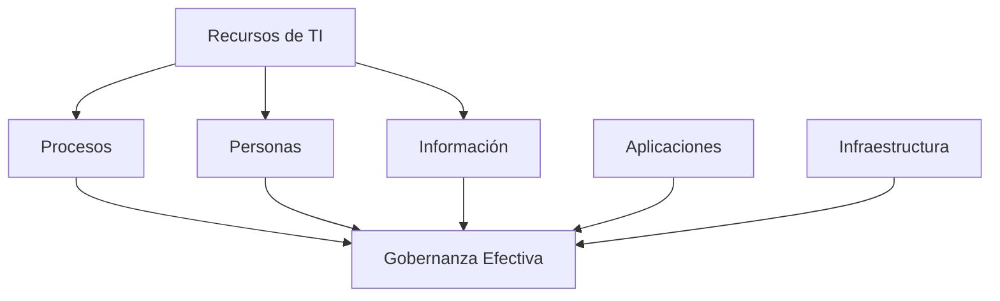
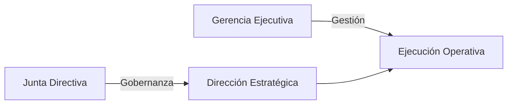
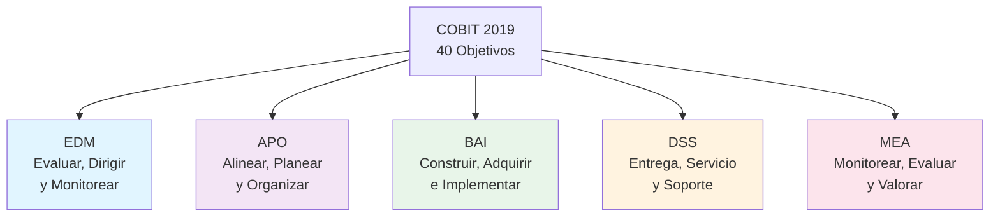
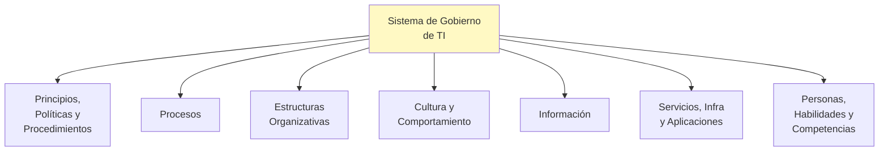
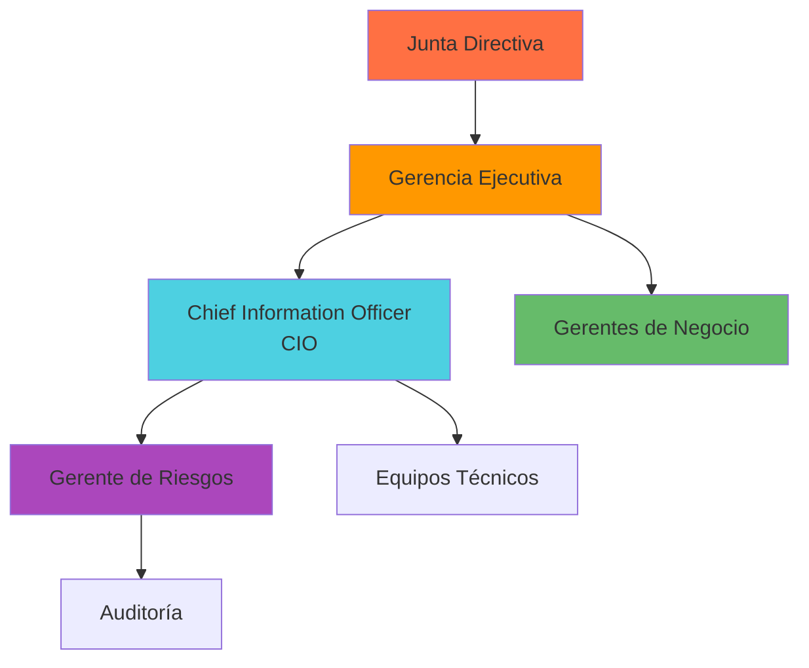
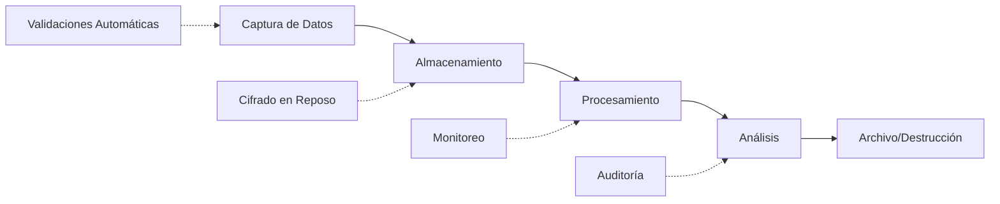
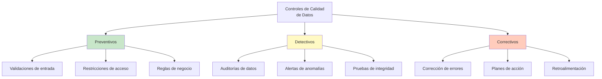

# Introducción a COBIT y su Relación con la Gobernanza de Datos

**Código:** 40062  
**Curso:** Dirección Estratégica de Datos  
**Clase:** 10  
**Tema:** COBIT 2019 - Gobernanza de Datos

---

## Contenidos de la Sesión

1. Exploración de los principios y objetivos de COBIT
2. Descripción de la estructura y componentes del marco de trabajo
3. Identificación de roles y responsabilidades en la gobernanza de datos según COBIT
4. Implementación de controles y procesos para garantizar la integridad y calidad de los datos

---

## 1. Conceptos Fundamentales

### ¿Qué es COBIT?

**COBIT** (Control Objectives for Information and Related Technologies) es un **marco de gobernanza y gestión de TI** que ayuda a las organizaciones a:

- Desarrollar sus prácticas de TI
- Organizar procesos y recursos tecnológicos
- Optimizar su funcionamiento
- Lograr un valor óptimo en la inversión tecnológica

COBIT 2019 es la versión más actualizada y define **40 objetivos** de gobernanza y gestión que abarcan todas las áreas clave de TI.

### Diferencia: Gobernanza vs. Gestión

| Aspecto | Gobernanza | Gestión |
|--------|-----------|---------|
| **Enfoque** | Evaluación, dirección y monitoreo | Planificación, construcción y ejecución |
| **Nivel** | Nivel estratégico | Nivel operativo |
| **Responsables** | Junta directiva, alta dirección | Gerentes operacionales |
| **Horizonte** | Largo plazo | Corto/mediano plazo |

---

## 2. Los Seis Principios de COBIT

### Principio 1: Proveer Valor a los Interesados

- Cada empresa necesita un sistema de gobierno que satisfaga las necesidades de sus **stakeholders** (accionistas, clientes, empleados, reguladores)
- El valor refleja un balance entre:
  - **Beneficios** obtenidos
  - **Riesgos** asumidos
  - **Recursos** invertidos

**Ejemplo Real:** Una empresa financiera implementa COBIT para asegurar que sus sistemas de TI protejan datos de clientes (beneficio), mientras gestiona riesgos de ciberseguridad (riesgo) sin gastar excesivamente (recursos).

### Principio 2: Enfoque Holístico

- Promover una **visión integral** de todos los recursos y procesos de TI
- Considerar las **relaciones entre componentes**
- Gestionar la complejidad organizacional

**Ejemplo Gráfico:**

### Principio 3: Sistema de Gobierno Dinámico

- Enfatiza **agilidad** y **adaptación continua**
- Las prácticas deben ser **flexibles y adaptables** para responder a cambios
- Adaptarse a cambios en:
  - Entorno empresarial
  - Tecnología emergente
  - Regulaciones

**Ejemplo:** En la era del AI y Big Data, COBIT debe adaptarse para incluir gobernanza de modelos ML y calidad de datos no estructurados.

### Principio 4: Distinguir Gobierno de Gestión

- COBIT establece una **distinción clara** entre ambos
- Evita confusiones en responsabilidades
- Mejora la toma de decisiones

### Principio 5: Adaptado a las Necesidades de la Empresa

- El sistema de gobierno debe **customizarse** usando factores de diseño:
  - Tamaño y complejidad
  - Industria y regulaciones
  - Madurez tecnológica
  - Cultura organizacional

**Ejemplo:** Una startup fintech necesita diferente gobernanza que un banco tradicional.

### Principio 6: Sistema de Gobierno Extremo a Extremo

- Debe cubrir **toda la empresa**, no solo TI
- Incluye toda la tecnología e información que procesa la organización
- Considera tanto sistemas centrales como periféricos

---

## 3. Estructura de Dominios: Los 5 Pilares

COBIT organiza sus 40 objetivos en **5 dominios estratégicos**:

### Dominio 1: EDM (Evaluar, Dirigir y Monitorear)
- Responsabilidad de la **Junta Directiva**
- Establece dirección estratégica
- Monitorea resultados
- **Objetivos:** 4 objetivos principales

### Dominio 2: APO (Alinear, Planear y Organizar)
- Alineación entre **TI y negocio**
- Planificación de recursos
- Estructura organizacional
- **Objetivos:** 13 objetivos

### Dominio 3: BAI (Construir, Adquirir e Implementar)
- Diseño e implementación de soluciones
- Adquisiciones de tecnología
- Cambios y proyectos
- **Objetivos:** 11 objetivos

### Dominio 4: DSS (Entrega, Servicio y Soporte)
- Operación de servicios de TI
- Gestión de cambios
- Seguridad de información
- **Objetivos:** 6 objetivos

### Dominio 5: MEA (Monitorear, Evaluar y Valorar)
- Evaluación de desempeño
- Monitoreo de conformidad
- Medición de valor
- **Objetivos:** 6 objetivos

---

## 4. Componentes del Sistema de Gobierno

Los componentes interactúan de forma **holística** para crear gobernanza efectiva:

| Componente | Descripción | Ejemplo |
|-----------|------------|---------|
| **Políticas y Procedimientos** | Guía práctica para gestión diaria | Manual de seguridad de datos |
| **Procesos** | Prácticas y actividades organizadas para lograr objetivos | Proceso de clasificación de datos |
| **Estructuras Organizativas** | Roles, responsabilidades, reportes | Comité de Gobernanza de Datos |
| **Cultura y Comportamiento** | Valores y normas compartidas | Conciencia de privacidad |
| **Información** | Información necesaria para funcionamiento efectivo | Reportes de calidad de datos |
| **Servicios, Infraestructura y Aplicaciones** | Tecnología que procesa información | Data warehouse, sistemas ETL |
| **Personas, Habilidades y Competencias** | Capacidades necesarias para decisiones correctas | Data Stewards certificados |

---

## 5. Roles y Responsabilidades en Gobernanza de Datos

### Estructura Jerárquica

### 5.1 Junta Directiva (Board of Directors)

**Rol:** Grupo de máximos ejecutivos y directores no ejecutivos

**Responsabilidades:**
- Establecer la **dirección estratégica** de la organización
- Asegurar que objetivos de TI alineen con objetivos empresariales
- Aprobar políticas y marcos de gobernanza de TI
- Supervisar la gestión de riesgos

**Ejemplo Real:** En un banco, la Junta aprueba que la estrategia de "transformación digital" incluya gobernanza robusta de datos bancarios.

### 5.2 Gerencia Ejecutiva

**Rol:** Alta dirección responsable de decisiones operacionales y estratégicas

**Responsabilidades:**
- Traducir estrategia empresarial en **objetivos de TI**
- Proveer recursos necesarios
- Asegurar implementación de políticas
- Evaluar y gestionar riesgos de TI

**Ejemplo:** Asignar presupuesto para implementar un data lake conforme a políticas de gobernanza.

### 5.3 Chief Information Officer (CIO)

**Rol:** Funcionario de máximo rango en TI, responsable de alineación estratégica

**Responsabilidades:**
- Implementar estrategia de TI alineada con negocio
- Administrar recursos de TI eficientemente
- Asegurar entrega de servicios de TI de calidad
- Mantener seguridad e integridad de datos

**Ejemplo:** El CIO de una empresa retail implementa un sistema de POS (Point of Sale) integrado con la gobernanza de datos de clientes.

### 5.4 Auditoría Interna y Externa

**Rol:** Verificadores de efectividad de controles y procesos

**Responsabilidades:**
- Evaluar efectividad de controles de TI
- Realizar auditorías regulares de sistemas y procesos
- Reportar hallazgos y recomendar mejoras
- Verificar cumplimiento de regulaciones y políticas internas

**Ejemplo:** Auditoría realiza pruebas de acceso a datos sensibles para verificar que solo personal autorizado puede acceder.

### 5.5 Gerente de Riesgos

**Rol:** Responsable de identificar, evaluar y mitigar riesgos

**Responsabilidades:**
- Identificar riesgos potenciales en TI
- Evaluar impacto y probabilidad
- Desarrollar e implementar planes de mitigación
- Monitorear riesgos continuamente

**Ejemplo:** Identifica el riesgo de pérdida de datos no respaldados y propone plan de backup automático.

### 5.6 Gerentes de Negocio (Business Unit Managers)

**Rol:** Responsables de operaciones diarias y gestión de departamentos específicos

**Responsabilidades:**
- Definir y comunicar requisitos de TI que apoyen negocio
- Trabajar estrechamente con Gerencia de TI
- Evaluar impacto de servicios de TI en rendimiento
- Identificar y gestionar riesgos relacionados con TI

**Ejemplo:** Gerente de Ventas requiere sistema CRM integrado que cumpla con políticas de privacidad de datos de clientes.

---

## 6. Implementación de Controles para Garantizar Calidad e Integridad de Datos

### 6.1 Definir Políticas de Calidad de Datos

**Proceso:**
- Establecer políticas claras que definan **estándares de calidad de datos**
- Documentar criterios de aceptación
- Comunicar a toda la organización

**Controles:**
- Documentación de políticas
- Revisiones periódicas
- Aprobaciones por alta dirección

**Ejemplo:** Política de que todos los clientes en CRM deben tener email validado.

### 6.2 Gestión del Ciclo de Vida de los Datos

**Procesos:**

1. **Captura de Datos**
   - Implementar controles para asegurar precisión y completitud
   - Validaciones automáticas de entrada
   - Doble verificación manual para datos críticos

2. **Almacenamiento**
   - Asegurar que datos se almacenen íntegramente
   - Implementar políticas de backup y recuperación
   - Cifrado de datos en reposo

3. **Procesamiento y Análisis**
   - Mantener trazabilidad de transformaciones
   - Documentar lineage de datos

4. **Archivo y Destrucción**
   - Aplicar retención según regulaciones
   - Destrucción segura de datos sensibles

**Ejemplo Real:** En una empresa farmacéutica, datos de pacientes se capturan con validación (sin espacios en blanco), se almacenan cifrados conforme HIPAA, se procesan solo por personal autorizado, y se destruyen tras 7 años.

### 6.3 Monitoreo y Control

**Proceso:**
- Asegurar cumplimiento con políticas y estándares de calidad
- Realizar auditorías periódicas
- Identificar desviaciones

**Controles:**
- Programas de auditoría
- Revisiones externas e internas
- Métricas de calidad

**Ejemplo:** Verificar que el 95% de registros de clientes tengan teléfono válido cada mes.

### 6.4 Mejora Continua

**Proceso:**
- Desarrollar e implementar planes de acción
- Mejorar continuamente procesos y controles

**Controles:**
- Planes de acción documentados
- Revisiones y aprobaciones de mejoras
- Seguimiento de implementación

---

## 7. Tipos de Controles

Para asegurar calidad e integridad de datos, COBIT propone tres categorías:

| Tipo | Descripción | Ejemplos |
|------|-------------|----------|
| **Preventivos** | Impiden que errores ocurran | Validación de email en formularios, restricciones de acceso |
| **Detectivos** | Identifican errores después de ocurrir | Auditorías, alertas de datos duplicados |
| **Correctivos** | Corrigen errores identificados | Procesos de limpieza de datos, reentrenamiento de modelos |

---

## 8. Glosario de Términos COBIT

| Término | Definición |
|---------|-----------|
| **COBIT** | Control Objectives for Information and Related Technologies - Marco de gobernanza y gestión de TI |
| **Gobernanza** | Evaluación, dirección y monitoreo de recursos y procesos de TI |
| **Gestión** | Planificación, construcción, ejecución y monitoreo de actividades alineadas con directrices de gobernanza |
| **EDM** | Evaluar, Dirigir y Monitorear - Dominio enfocado en responsabilidad de la Junta Directiva |
| **APO** | Alinear, Planear y Organizar - Dominio de alineación entre TI y negocio |
| **BAI** | Construir, Adquirir e Implementar - Dominio de soluciones y tecnología |
| **DSS** | Entrega, Servicio y Soporte - Dominio de operaciones de TI |
| **MEA** | Monitorear, Evaluar y Valorar - Dominio de medición y evaluación |
| **Stakeholders** | Partes interesadas en la organización (accionistas, clientes, empleados, reguladores) |
| **Valor** | Balance entre beneficios, riesgos y recursos en inversiones de TI |
| **Control** | Procedimiento o mecanismo para asegurar que procesos se ejecutan correctamente |
| **Riesgo** | Posibilidad de que un evento adverso afecte objetivos de la organización |
| **Conformidad** | Cumplimiento con políticas, regulaciones y estándares establecidos |
| **Data Steward** | Persona responsable de calidad, disponibilidad y seguridad de datos específicos |
| **Lineage de Datos** | Trazabilidad de origen, transformación y destino de los datos |
| **CIO** | Chief Information Officer - Ejecutivo responsable de estrategia de TI |
| **Integridad de Datos** | Garantía de que los datos son exactos, completos y no han sido alterados |
| **Clasificación de Datos** | Categorización de datos según nivel de sensibilidad o importancia |
| **Auditoría** | Verificación independiente de efectividad de controles y procesos |
| **HIPAA** | Health Insurance Portability and Accountability Act - Regulación de privacidad de datos de salud |

---

## 9. Casos de Uso Prácticos por Industria

### Sector Bancario
COBIT asegura que sistemas de préstamos cumplan con regulaciones financieras y que datos de clientes estén protegidos contra fraude.

### Sector Retail
Gobernanza de datos de transacciones, inventario y clientes para proporcionar insights de negocio confiables y cumplir GDPR.

### Sector Salud
Protección de datos de pacientes conforme HIPAA, auditoría de acceso a historiales médicos, integridad de datos clínicos.

### Smart Cities
Gobernanza de datos de sensores IoT, tráfico, y servicios públicos para toma de decisiones basada en datos confiables.

### FinTech
Implementación de controles de datos en tiempo real para detección de fraude y cumplimiento normativo dinámico.

---

## 10. Resumen Ejecutivo

COBIT 2019 es un framework integral para **gobernanza y gestión de TI** que:

✅ Proporciona **6 principios** para sistemas de gobierno efectivos  
✅ Organiza **40 objetivos** en **5 dominios** estratégicos  
✅ Define **roles claros y responsabilidades** desde Junta Directiva hasta operaciones  
✅ Implementa **controles preventivos, detectivos y correctivos** para calidad de datos  
✅ Facilita **alineación entre TI y negocio** para generación de valor  
✅ Establece **gobernanza extremo a extremo** de toda la tecnología organizacional

---

**Última actualización:** 11 de junio de 2026  
**Fuente:** Clase 10 - Dirección Estratégica de Datos - ISIL 2026-1
