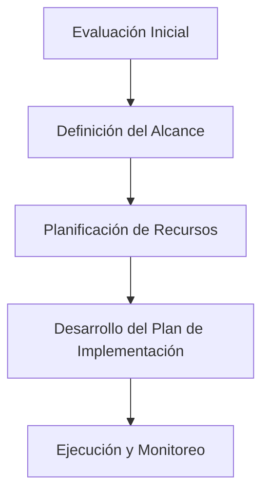

# Modelos de Madurez y Métodos de Implementación de COBIT (Clase 11)

**Código:** 40062  
**Curso:** Dirección Estratégica de Datos  
**Clase:** 11  
**Tema:** Modelos de Madurez y Métodos de Implementación de COBIT

---

## Contenidos de la Sesión

1. Modelos de madurez en la gobernanza de datos (CMM)
2. Métodos para la implementación de COBIT en la gobernanza de datos
3. Herramientas y tecnologías para la implementación de COBIT
4. Estrategias de seguimiento y mejora continua

---

## 1. COBIT Maturity Model (CMM)

El **COBIT Maturity Model (CMM)**, desarrollado por ISACA, permite evaluar el estado de los procesos de TI dentro de una organización, identificar el nivel de madurez actual y planificar mejoras progresivas.

### Niveles de Madurez

| Nivel | Nombre | Descripción |
|-------|--------|-------------|
| 0 | Inexistente | No hay procesos ni controles reconocibles |
| 1 | Inicial | Procesos informales, reactivos, sin estandarización |
| 2 | Repetible | Procesos básicos documentados, con resultados consistentes |
| 3 | Definido | Procesos estandarizados y documentados en toda la organización |
| 4 | Gestionado | Procesos medidos y controlados con KPIs cuantitativos |
| 5 | Optimizado | Mejora continua con automatización y métricas avanzadas |

**Ejemplo por nivel aplicado a un banco:**

| Nivel | Situación concreta |
|-------|-------------------|
| 0 | El banco no sabe qué datos tiene. Cada área maneja sus propios archivos Excel sin control de versiones |
| 1 | El área de riesgos crea un proceso manual para conciliar transacciones, pero solo lo usa su equipo |
| 2 | El proceso de conciliación se documenta y otros equipos empiezan a replicarlo con resultados similares |
| 3 | El banco estandariza la conciliación en toda la organización. Todos los equipos siguen el mismo procedimiento |
| 4 | Se mide semanalmente el % de transacciones conciliadas vs. error manual. Se generan reportes automáticos |
| 5 | El sistema detecta y corrige automáticamente el 95% de las discrepancias sin intervención humana |

### Áreas de Mejora basadas en CMM

| Área | Acciones clave |
|------|---------------|
| **Calidad de datos** | Limpieza de datos, políticas de calidad, herramientas de gestión |
| **Seguridad de datos** | Políticas de seguridad, controles de acceso y cifrado, auditorías periódicas |
| **Gestión de datos** | Formalizar y documentar procesos, marco de gobernanza, herramientas de gestión |
| **Cumplimiento normativo** | Revisar políticas, procesos de cumplimiento continuo, auditorías regulares |
| **Integración de tecnologías** | Evaluar tecnologías, integrar sistemas, adoptar automatización y análisis |
| **Gestión de riesgos** | Proceso formal de riesgos, integrar en gobernanza, evaluaciones periódicas |

**Ejemplo práctico:** Una empresa de retail con nivel 2 en calidad de datos implementa procesos de limpieza automatizada y políticas de calidad. Al alcanzar nivel 4, reduce errores en reportes de ventas de un 15% a menos del 2%.

---

## 2. Métodos para la Implementación de COBIT

### Plan de Acción

**Fase 1: Evaluación Inicial**
- Evalúa el estado actual de la gobernanza de datos
- Define necesidades y objetivos con COBIT

**Ejemplo:** Una aseguradora detecta en la evaluación que 4 áreas distintas capturan el mismo dato del cliente (nombre, DNI, teléfono) con 3 formatos diferentes. Su CMM actual es nivel 1. El objetivo es alcanzar nivel 3 en 12 meses estandarizando la captura en todos los sistemas.

**Fase 2: Definición del Alcance**
- Determina áreas específicas donde aplicar COBIT
- Selecciona procesos y componentes relevantes

**Ejemplo:** La misma aseguradora prioriza dos procesos COBIT: APO14 (Gestión de Datos) y DSS06 (Gestión de Operaciones). Decide no abordar seguridad de datos aún porque su proyecto de cifrado masivo no inicia hasta el próximo semestre.

**Fase 3: Planificación de Recursos**
- Asigna roles y responsabilidades
- Evalúa y selecciona herramientas de soporte

**Ejemplo:** Asigna un Data Governance Officer (DGO) dedicado, un arquitecto de datos y un representante de cada área de negocio. Eligen Jira para tracking de incidencias de calidad de datos y Collibra como catálogo de datos.

**Fase 4: Desarrollo del Plan**
- Cronograma detallado con hitos y plazos
- Actividades y tareas del proyecto

**Ejemplo:** Establecen un plan con 3 sprints de 3 semanas cada uno: Sprint 1 → diagnosticar y mapear fuentes de datos, Sprint 2 → implementar estándares de captura, Sprint 3 → validar calidad con métricas y corregir desviaciones.

### Definición de Métricas (KPIs)

**Identificación de objetivos clave:**
- Alinear KPIs con los objetivos estratégicos de la organización
- Identificar áreas críticas de gobernanza que necesitan monitoreo

**Tipos de KPIs:**

| Tipo | Ejemplos |
|------|----------|
| **Calidad de datos** | % registros completos, % duplicados, precisión de datos |
| **Seguridad de datos** | Accesos no autorizados detectados, tiempo de respuesta a incidentes |
| **Eficiencia operativa** | Tiempo de procesamiento, costo por registro, automatización alcanzada |

**Monitoreo y reportes:**
- Implementar herramientas de monitoreo para recoger datos de KPIs
- Desarrollar informes regulares para revisar rendimiento y ajustar

**Ejemplo práctico:** Un banco define como KPI crítico que el 99.5% de las transacciones tengan lineage completo de datos. Monitorea semanalmente con dashboards automatizados.

**Ejemplo comparativo de KPIs por industria:**

| Industria | KPI | Meta | Frecuencia |
|-----------|-----|------|------------|
| Banca | % transacciones con lineage completo | ≥ 99.5% | Diaria |
| Salud | % historiales clínicos con datos completos | ≥ 95% | Semanal |
| Retail | Precisión de inventario entre canal online y físico | ≥ 98% | Diaria |
| FinTech | Tiempo de detección de anomalías | < 5 minutos | Tiempo real |
| Smart City | % sensores IoT con datos válidos | ≥ 99% | Cada hora |

---

## 3. Herramientas y Tecnologías

| Herramienta | Propósito | Ideal para |
|-------------|-----------|------------|
| **ServiceNow** | Plataforma de gestión de servicios empresariales con flujos automatizados | Organizaciones grandes, procesos complejos |
| **Jira** | Gestión de proyectos y seguimiento de incidencias | Equipos Agile, desarrollo de software |
| **Trello** | Gestión con tableros Kanban | Equipos pequeños, proyectos simples |
| **SharePoint** | Colaboración e integración con ecosistema Microsoft | Organizaciones con infraestructura Microsoft |

### Criterios de Selección

| Criterio | Pregunta guía |
|----------|--------------|
| **Tamaño del proyecto** | ¿Equipo pequeño (Trello) o gran organización (ServiceNow)? |
| **Metodología** | ¿Agile (Jira) o Waterfall? |
| **Integración** | ¿Cómo se conecta con sistemas actuales? |
| **Funcionalidades** | ¿Cubre los procesos COBIT requeridos? |
| **Facilidad de uso** | ¿El equipo puede adoptarla rápido? |
| **Escalabilidad** | ¿Crece con la organización? |

**Ejemplo práctico:** Una fintech elige Jira + ServiceNow: Jira para gestión Agile de sprints de implementación COBIT, y ServiceNow para flujos de gobierno de datos en producción.

**Ejemplo de criterios aplicados a una PYME:**
Una distribuidora local con 30 empleados necesita implementar controles COBIT básicos. Evalúa opciones:
- **ServiceNow:** Lo descarta por costo (> $50,000/año) y complejidad operativa
- **Jira:** Elegido por su flexibilidad para gestionar incidencias de calidad, bajo costo ($10/usuario/mes) y facilidad de integración con Google Workspace que ya usan
- **Trello:** Lo usan para seguimiento semanal del comité de gobierno de datos
El equipo técnico es pequeño (3 personas), por lo que priorizan herramientas que no requieran mantenimiento dedicado.

---

## 4. Estrategias de Seguimiento y Mejora Continua

### Seguimiento del Progreso

- **KPIs específicos** alineados a objetivos estratégicos
- **Dashboards automatizados** con visualización en tiempo real
- **Reuniones periódicas** (mensuales/trimestrales) con stakeholders
- **Auditorías regulares** para evaluar cumplimiento COBIT

**Ejemplo de rutina de seguimiento:** Un banco de consumo establece el siguiente ciclo mensual:
- **Semana 1:** El equipo de gobierno de datos revisa KPIs del mes anterior y actualiza dashboards
- **Semana 2:** Cada dueño de dominio (clientes, productos, transacciones) presenta desviaciones
- **Semana 3:** El comité de datos prioriza acciones correctivas para el próximo mes
- **Semana 4:** Se publica un informe ejecutivo de 1 página para la gerencia general

### Identificar Áreas de Mejora

1. Definir metas y KPIs para medir progreso
2. Recopilar datos de desempeño contra esos KPIs
3. Comparar resultados reales vs. metas establecidas
4. Analizar desviaciones
5. Realizar encuestas con stakeholders

**Ejemplo de análisis:** Una cadena de retail detecta que el KPI "precisión de inventario" bajó de 97% a 91% en el canal online. Al analizar la desviación descubren que el equipo de warehouse dejó de escanear códigos de barras en el 20% de los ingresos por falta de capacitación. La solución no es un nuevo sistema, sino volver a entrenar al personal y agregar controles visuales en el proceso de recepción.

### Ajuste del Plan de Acción

| Paso | Acción |
|------|--------|
| 1 | Desarrollar acciones correctivas basadas en desviaciones |
| 2 | Priorizar por impacto en KPIs clave y urgencia |
| 3 | Programar revisiones periódicas del plan |
| 4 | Evaluar progreso y hacer ajustes según sea necesario |

**Ejemplo práctico:** Un hospital detecta que su KPI de seguridad de datos está en 85% (meta: 98%). Prioriza como acción correctiva la implementación de cifrado en endpoints y programa revisión en 30 días.

---

## 5. Glosario de Términos

| Término | Definición |
|---------|-----------|
| **COBIT** | Control Objectives for Information and Related Technologies - Marco de gobernanza y gestión de TI |
| **CMM** | COBIT Maturity Model - Modelo para evaluar madurez de procesos TI |
| **ISACA** | Asociación profesional internacional que desarrolla COBIT |
| **KPI** | Key Performance Indicator - Indicador clave de rendimiento |
| **Gobernanza de datos** | Conjunto de políticas, procesos y controles para gestionar datos como activo |
| **Lineage de datos** | Trazabilidad del origen, transformación y destino de los datos |
| **Mejora continua** | Proceso iterativo de evaluación y ajuste para optimizar resultados |
| **Stakeholders** | Partes interesadas (accionistas, clientes, reguladores, empleados) |
| **CMMI** | Capability Maturity Model Integration - Evolución de CMM para desarrollo de capacidades |

---

## 6. Casos de Uso por Industria

| Industria | Aplicación de COBIT |
|-----------|-------------------|
| **Banca** | Implementar controles de calidad de datos transaccionales, cumplimiento regulatorio (SBS) y seguridad de datos financieros |
| **Salud** | Gobernanza de historiales clínicos, cumplimiento de privacidad, integridad de datos de pacientes |
| **Retail** | Calidad de datos de inventario y clientes, integración de canales online/offline |
| **Smart Cities** | Gobernanza de datos de sensores IoT, tráfico y servicios públicos para toma de decisiones |
| **FinTech** | Controles de datos en tiempo real para detección de fraude y cumplimiento dinámico |

### Ejemplos detallados por industria

**Banca — CB (CrediBanco)**
CB opera con 4 sistemas core distintos (adquiridos por fusión). Cada sistema tiene su propia definición de "cliente". El CMM inicial es nivel 1. Aplican COBIT para:
- Estandarizar el master data de clientes con una única fuente de verdad
- Implementar controles automáticos de calidad en datos transaccionales
- Cumplir con la SBS que exige lineage completo en operaciones > $10,000
- Resultado: suben a CMM nivel 3 en 8 meses, reducen errores en reportes regulatorios de 12% a 0.5%

**Salud — Clínica San Pablo**
La clínica maneja 500,000 historiales clínicos digitales sin trazabilidad. Auditores internos encuentran que el 30% de los registros tienen datos incompletos o inconsistentes entre sistemas (laboratorio, farmacia, admisión). Aplican COBIT para:
- Definir políticas de calidad de datos por tipo de registro clínico
- Implementar controles de integridad referencial entre sistemas
- Establecer auditorías semanales con dashboards para el comité de calidad
- Resultado: completitud de historiales pasa de 70% a 96% en 6 meses

**Retail — MercadoMax**
Cadena de supermercados con 120 tiendas, canal online y 2 millones de clientes fidelizados. El inventario entre tiendas físicas y web tiene una discrepancia del 8%. Aplican COBIT para:
- Unificar catálogo de productos con un governance council de datos
- Automatizar conciliación de stock entre POS físico, web y almacenes
- Definir KPIs de calidad de datos maestros de producto y cliente
- Resultado: precisión de inventario mejora a 99.2%, reduciendo quiebres de stock en 40%

**Smart Cities — Municipalidad de Miraflores**
La municipalidad gestiona datos de 120 sensores IoT de tráfico, 80 cámaras de seguridad y 15 sistemas municipales. No hay interoperabilidad entre sistemas. Aplican COBIT para:
- Crear un data lake centralizado con gobierno de datos municipales
- Definir ownership de cada fuente de datos (tránsito, seguridad, licencias, tributos)
- Implementar métricas de calidad para datos abiertos al ciudadano
- Resultado: integran 15 sistemas en 1 plataforma, habilitan dashboard ciudadano en tiempo real

**FinTech — PagoYa**
Startup de pagos digitales que procesa 2 millones de transacciones/mes. Crecen rápido pero sin controles formales. Un intento de fraude interno pasa desapercibido por 3 semanas. Aplican COBIT para:
- Definir controles automáticos de detección de anomalías en tiempo real
- Implementar segregación de funciones en acceso a datos transaccionales
- Crear un comité semanal de gobierno de datos con métricas de seguridad
- Resultado: detectan el 99% de intentos de fraude en menos de 5 minutos

---

## 7. Resumen Ejecutivo

- El **COBIT Maturity Model** permite diagnosticar el nivel de madurez en gobernanza de datos y planificar mejoras progresivas
- Un **plan de acción estructurado** (evaluación, alcance, recursos, cronograma) es clave para implementar COBIT exitosamente
- Las **herramientas tecnológicas** deben seleccionarse según tamaño, metodología y capacidades de integración
- El **seguimiento continuo** mediante KPIs, dashboards y auditorías permite identificar desviaciones y ajustar el plan
- La **mejora continua** asegura que la gobernanza evolucione con las necesidades del negocio

---

## 8. Preguntas de Reflexión

1. ¿En qué nivel de madurez CMM estimas que está tu organización actualmente? ¿Qué evidencia tienes?
2. ¿Qué KPI consideras más crítico para medir el éxito de la implementación de COBIT?
3. Si tuvieras que elegir entre ServiceNow, Jira y Trello para un proyecto de gobernanza de datos, ¿cuál elegirías y por qué?
4. ¿Cómo equilibrarías la inversión en herramientas tecnológicas vs. la capacitación del equipo?

---

## Recursos

- **PDF de la sesión:** [`./modelos-madurez-metodos-implementacion-cobit-clase-11.pdf`](./modelos-madurez-metodos-implementacion-cobit-clase-11.pdf)
- ISACA (2018). *COBIT 2019: Introduction and Methodology*
- Carlos V. (2023). *Riesgos ¿Qué es COBIT y para qué sirve?* — globalsuitesolutions.com
- Luis G. (2021). *Construyendo un modelo de madurez para COBIT 2019 basado en CMMI* — ISACA Journal

---

**Última actualización:** 18 de junio de 2026  
**Fuente:** Clase 11 - Dirección Estratégica de Datos - ISIL 2026-1
