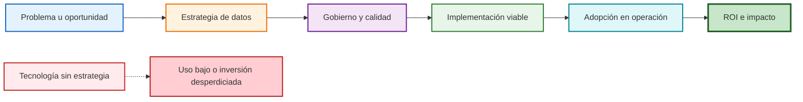

# Estrategias de Datos: casos prácticos y viabilidad de proyectos (Clase 2)

**Curso:** Dirección Estratégica de Datos (ISIL, 2026-1)  
**Docente:** Brezli Paola Luna Figueroa  
**Fecha:** 16/04/2026

---

## Mapa visual de la sesión

Este diagrama resume el criterio transversal de la clase: la viabilidad de un proyecto de datos depende de conectar estrategia, gobierno, operación y resultados.

## Síntesis integrada del material fuente

**Archivo base consolidado:** 40062-S02-PPT.pdf

La síntesis del material de apoyo concentró la clase en tres ejes: **caso de negocio**, **gobernanza** y **ROI**. El mensaje integrado es que una estrategia de datos no se evalúa por sofisticación técnica, sino por su capacidad de alinear transformación digital con resultados medibles en sectores como banca y salud.

**Conceptos clave consolidados:** casos prácticos, gobierno de datos, transformación digital y retorno de inversión.

---

## 1. Innovación social y el proyecto Guagua Laptop

La sesión abrió con un video sobre **Guagua Laptop**, un emprendimiento peruano que fabrica laptops con materiales reciclados y software libre para reducir la brecha digital en zonas vulnerables.

* **Hardware Sostenible:** Son laptops fabricadas con madera reciclada y plástico de residuos electrónicos, diseñadas bajo el modelo de economía circular.
* **Innovación:** Incluyen paneles solares para zonas sin electricidad y una herramienta de IA generativa llamada "EducatIA" que pronto funcionará offline.
* **Impacto:** Han beneficiado a más de 10,000 personas, promoviendo que los estudiantes pasen de ser usuarios a creadores de tecnología.

### EducatIA: IA generativa sin conexión

El proyecto incluye **EducatIA**, una herramienta de inteligencia artificial generativa diseñada para funcionar *offline*. Esto es clave en comunidades rurales donde el acceso a internet es intermitente o inexistente.

> **Conexión con Diseño de Soluciones con IA:** EducatIA demuestra que la IA no siempre depende de la nube. Los modelos locales permiten despliegues en entornos con infraestructura limitada.

### Hardware vs. estrategia: el error más común

El debate en clase reveló una tensión frecuente en proyectos de tecnología educativa:

| Factor | Enfoque equivocado | Enfoque estratégico |
| --- | --- | --- |
| Dispositivo | Entregar la tablet y ya | Asegurar que docentes y alumnos la usen pedagógicamente |
| Conectividad | Asumir internet disponible | Diseñar para funcionar offline con servidores locales |
| Datos | Ignorar el consumo | Monitorear y restringir usos no educativos |

**Experiencia real compartida en clase:** un estudiante (Edwin Merma) describió su trabajo actualizando tablets del Ministerio de Educación (Minedu). Los problemas más frecuentes fueron el agotamiento rápido de datos por usos recreativos y la ausencia de servidores locales en escuelas rurales, que dejaba sin soporte a los dispositivos cuando no había red. El debate destacó que en el sector público, el mantenimiento es anual y burocrático; en el privado, es constante y supervisado. Se cuestiona si la entrega de hardware es suficiente sin un plan estructurado de alfabetización digital y conectividad real.

**Conclusión:** El dispositivo es solo el vehículo. Sin estrategia de datos, formación docente y soporte técnico local, la inversión no genera aprendizaje.

---

## 2. Caso Data Force: gobierno de datos en el sector financiero

**Data Force** es una consultora chilena que trabajó con una institución financiera que sufría graves problemas de calidad de datos.

### El problema

* El banco llamaba a clientes que **ya habían pagado** su deuda, generando fricciones y pérdida de confianza.
* Las campañas de marketing llegaban a segmentos incorrectos, con bajo retorno.
* La raíz de ambos problemas era la misma: **datos de baja calidad**.

### La solución: Data Governance

Data Force implementó un modelo de **Gobierno de Datos** que incluyó:

1. Auditoría del estado actual de los datos (calidad, completitud, consistencia).
2. Definición de propietarios de datos por área del negocio.
3. Reglas claras de validación y actualización de registros.
4. Procesos de limpieza y enriquecimiento continuo.

### El resultado

| Métrica | Antes | Después |
| --- | --- | --- |
| Calidad de datos | 75 % | 99 % |
| Errores en cobranzas | Frecuentes | Casi eliminados |
| Precisión de campañas | Baja | Alta |

**Lección clave:** La calidad de los datos no es un problema técnico aislado; es un problema de gobierno. Sin reglas claras de quién es responsable de los datos y cómo se mantienen, el deterioro es inevitable. La profesora enfatiza que "no se puede decidir si no se tiene información verificada". Un funcionario o gerente que decide "a ciegas" sin datos íntegros puede arruinar un negocio o desperdiciar recursos públicos.

> **Conexión con Arquitectura Empresarial:** el Gobierno de Datos es parte de la capa de Arquitectura de Datos en TOGAF. Establece políticas, roles y estándares que habilitan decisiones confiables.

---

## 3. Estrategia de datos en la administración pública

La profesora contrastó cómo usan los datos el sector privado y el sector público.

### Privado vs. público: objetivos distintos

| Dimensión | Sector privado | Sector público |
| --- | --- | --- |
| Objetivo principal | Competitividad y ROI | Transparencia y servicio al ciudadano |
| Audiencia de los datos | Accionistas, clientes | Ciudadanos, organismos de control |
| Riesgo de opacidad | Pérdida de mercado | Pérdida de legitimidad y confianza |

**Sector Privado:** Enfocado en la eficiencia, innovación constante y competitividad para generar utilidades. Los dueños invierten su propio capital y supervisan el mantenimiento constante.

**Sector Público:** Enfocado en el servicio social y transparencia. Se financia con impuestos y enfrenta barreras burocráticas; el mantenimiento de activos (como las tablets de MINEDU) suele ser anual y rígido.

### Caso: Gobierno de Aragón (España)

El Gobierno de Aragón implementó una estrategia de datos orientada a **interoperabilidad**: la capacidad de que sistemas diferentes se comuniquen y compartan información.

**Problema concreto:** un ciudadano tenía su DNI en un sistema, su pasaporte en otro y su licencia de conducir en un tercero. Cada trámite exigía presentar documentos por separado porque los sistemas no "conversaban" entre sí.

**Solución:** una plataforma de datos centralizada que conecta los registros de identidad, eliminando la duplicidad de trámites y reduciendo tiempos de atención.

**Impacto directo para el ciudadano:**

* Menos papeleo.
* Menos visitas presenciales.
* Menos errores por datos desactualizados en distintos registros.

> **Aplicación local:** en el Perú, iniciativas como la PIDE (Plataforma de Interoperabilidad del Estado) buscan el mismo objetivo: conectar los sistemas de salud, educación, tributación y seguridad para ofrecer servicios más eficientes.

---

## 4. Dinámica: el caso Fabrico

La clase analizó los problemas de datos en **Fabrico**, una empresa ficticia de manufactura con una cadena de suministro disfuncional.

### Causas de ineficiencia identificadas

* **Mala elección de proveedores:** sin datos de desempeño histórico, se elige por precio, no por confiabilidad.
* **Falta de comunicación del alcance:** los proveedores no tienen visibilidad de los volúmenes reales que se les pedirá.
* **Visibilidad de inventario nula:** el área de producción no sabe en tiempo real cuánto hay en bodega, lo que genera sobrestock o desabastecimiento.

### La "última milla": el punto crítico

En logística, la **última milla** es el tramo final de entrega al cliente. Es el más caro y el que más impacta la experiencia.

**Ejemplo concreto:** una torta de cumpleaños producida con los mejores ingredientes y embalada correctamente pierde todo su valor si llega tarde, fría o en mal estado. Todo el esfuerzo previo se anula en el último eslabón.

### El rol de los datos en tiempo real

Las aplicaciones de seguimiento (como las de delivery o de aerolíneas) permiten:

* **Al cliente:** saber exactamente dónde está su pedido y cuándo llega.
* **A la empresa:** detectar cuellos de botella en tiempo real y reasignar recursos.
* **A ambos:** reducir la incertidumbre, que es la principal causa de reclamos y costos adicionales.

**Tecnologías habilitadoras:** GPS integrado, IoT en vehículos, alertas automáticas por umbral de temperatura o tiempo de tránsito.

### Tercerización y monitoreo

Muchas empresas tercerizan el despacho para trasladar el riesgo a especialistas, pero requieren datos para monitorear el desempeño de ese tercero. Sin visibilidad, el tercero puede fallar y afectar la reputación de la empresa.

---

## 5. Planificación y viabilidad de proyectos de datos

La sesión cerró con un marco práctico para implementar una dirección estratégica de datos en cualquier organización.

### Paso 1 — Alineación estratégica

Los datos deben responder al objetivo principal del negocio.

**Ejemplo:** si la meta de una empresa es prepararse para una venta o fusión, los datos deben mostrar la salud financiera con precisión, consistencia y trazabilidad. Un inversor que encuentre inconsistencias en los datos retirará su oferta.

### Paso 2 — Evaluación del estado actual

Tomar una "foto" de la calidad y seguridad de la data actual. Preguntas clave:

* ¿Qué porcentaje de los registros está completo?
* ¿Cuántos sistemas duplican la misma información?
* ¿Quién es responsable de cada fuente de datos?

### Paso 3 — Establecer objetivos claros

Definir qué se quiere lograr (accesibilidad, limpieza, cumplimiento normativo).

### Paso 4 — Marco de Gobierno

Definir roles, responsabilidades y políticas.

### Paso 5 — Selección de Tecnología

Elegir herramientas adecuadas al presupuesto y necesidad (Data Warehouse, Data Mart, etc.). No siempre lo más caro es lo mejor.

### Paso 6 — Monitoreo Continuo

Ajustar el plan según los resultados obtenidos.

### Paso 7 — Análisis de riesgos

Todo proyecto de datos enfrenta tres tipos de riesgo:

| Tipo | Descripción | Ejemplo |
| --- | --- | --- |
| **Técnico** | Incompatibilidad entre sistemas antiguos y nuevos | Un ERP legacy que no puede exportar datos al nuevo CRM |
| **Operativo** | Resistencia al cambio del personal | Equipos que siguen usando Excel en paralelo al nuevo sistema |
| **Financiero** | Presupuesto insuficiente o ROI difícil de justificar | Proyecto detenido a mitad por recortes |

### Change Management: el riesgo más subestimado

La resistencia interna es el mayor obstáculo en proyectos de datos. Un sistema perfecto fracasa si el equipo no lo adopta.

**Estrategias de change management:**

* Involucrar a los usuarios clave desde el diseño, no solo en la implementación.
* Comunicar el beneficio personal de cada cambio ("¿qué gano yo con esto?").
* Capacitar de forma práctica y continua, no en una sola sesión de lanzamiento.
* Designar campeones internos que promuevan el uso del nuevo sistema.

---

## Conclusión de la sesión

> Tomar decisiones "a ciegas" puede arruinar un negocio. En 2026, la tecnología existe y es accesible. El reto principal es establecer un **Gobierno de Datos** que garantice que la información sea íntegra, veraz y segura.

Los tres pilares de una estrategia de datos efectiva:

## Transcripción del PPT: Estrategias de Datos

### Estrategias de Datos

Estrategias de datos incluyen planes para recopilar, gestionar y analizar datos para apoyar objetivos de negocio. Incluyen gobierno, calidad y análisis predictivo.

**Ejemplo práctico:** Una empresa de retail desarrolla estrategia para usar datos de clientes en lealtad, aumentando retención y ventas cruzadas.

### Casos Prácticos

- **Sector Financiero:** Mejora calidad de datos para reducir errores en cobranzas.
- **Sector Público:** Interoperabilidad para servicios ciudadanos eficientes.
- **Manufactura:** Monitoreo en tiempo real para optimizar cadena de suministro.

**Ejemplo práctico:** Un hospital usa datos para predecir admisiones, optimizando recursos y reduciendo tiempos de espera.

### Viabilidad de Proyectos de Datos

Evaluar factibilidad técnica, económica y operativa antes de implementar. Incluir ROI, riesgos y alineación estratégica.

**Ejemplo práctico:** Antes de implementar BI, calcular costo vs. beneficios como reducción de inventario excedente.

### Beneficios y Desafíos

**Beneficios:** Mejor toma de decisiones, eficiencia operativa, innovación.

**Desafíos:** Calidad de datos, privacidad, cambio cultural.

**Ejemplo práctico:** Una startup enfrenta desafíos de privacidad al manejar datos sensibles, pero beneficia con insights precisos para crecimiento.

---

1. **Calidad:** los datos deben ser correctos, completos y actualizados.
2. **Gobierno:** debe haber reglas claras sobre quién gestiona qué datos y cómo.
3. **Alineación:** la estrategia de datos debe servir al objetivo del negocio, no existir por sí sola.

**Conclusión principal:** La dirección estratégica de datos no es solo técnica, es una decisión de negocio que requiere un cambio cultural y una planificación rigurosa para mitigar riesgos y asegurar que cada bit de información genere valor real.
