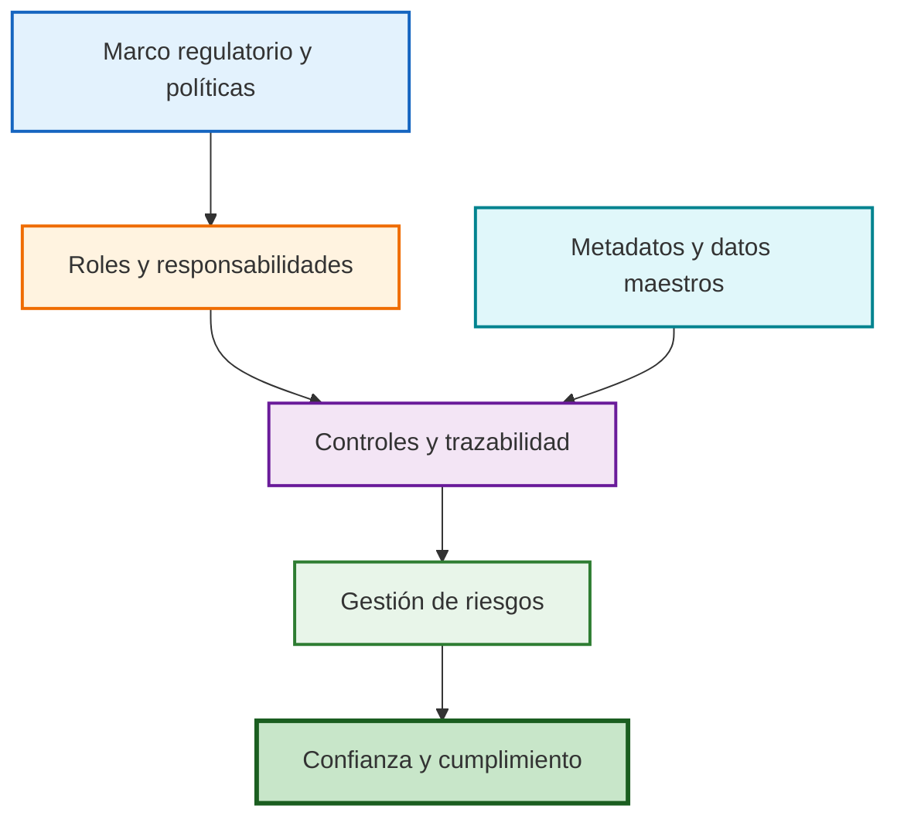

# Gobernanza de Datos y Políticas Digitales (Clase 3)

**Curso:** Dirección Estratégica de Datos (ISIL, 2026-1)  
**Docente:** Brezli Paola Luna Figueroa  
**Fecha:** 23/04/2026

---

Esta sesión de clase, liderada por la profesora **Brezli Paola Luna Figueroa**, se centra en la **Gobernanza de Datos y Políticas Digitales**.

## Mapa visual de gobernanza

El aporte del gráfico es separar con claridad la cadena de gobierno: política, roles, control y cumplimiento.

## Síntesis integrada del material fuente

**Archivo base consolidado:** 40062-S03-PPT.pdf

El resumen ejecutivo del material base reforzó la relación entre **privacidad**, **regulación**, **gobierno de datos** y **gestión de riesgos**, aterrizando la discusión con ejemplos de IA, metadatos, datos maestros y política digital peruana. Esa vista resumida complementa la clase porque conecta el marco conceptual con cumplimiento y confianza institucional.

**Conceptos clave consolidados:** riesgos de IA, regulación, principios de gobernanza, valorización del riesgo y políticas digitales.

---

## 1. Introducción: La IA y la Privacidad de los Datos
La clase inicia con un video sobre la exposición pública de chats de ChatGPT en Google. La profesora utiliza este caso para reflexionar sobre:
* **Riesgos de Identificación:** Cómo datos personales (como perfiles de LinkedIn) compartidos en chats pueden indexarse en buscadores.
* **Seguridad en el uso de Chatbots:** Recomendaciones sobre no compartir datos financieros, borrar historiales y revisar directrices de privacidad.
* **Regulación Global:** Se contrastan dos modelos: el de **EE. UU.** (prioriza la innovación y autorregulación) frente al de la **Unión Europea** (foco en protección al usuario y rendición de cuentas).

---

## 2. Contexto Histórico y Entes Rectores en Perú
Se realiza un breve repaso por la historia de los buscadores (Altavista, Yahoo, Google) para explicar cómo ha crecido el volumen de data. Luego, se aterriza en el marco legal peruano:
* **MTC (Ministerio de Transportes y Comunicaciones):** Explicado como el ente rector que administra la infraestructura y otorga licencias.
* **OSIPTEL:** Mencionado como el regulador del servicio.
* **Poderes del Estado:** Se diferencia la función del Legislativo (crear leyes) y el Ejecutivo (administrar y ejecutar el presupuesto para proyectos como la fibra óptica).

---

## 3. Principios Fundamentales del Gobierno de Datos
La profesora detalla los pilares que guían la gestión efectiva de la información:
* **Responsabilidad (Accountability):** Identificar siempre a un "dueño" del dato (ej. el área de Marketing para la base de clientes).
* **El Dato como Activo:** La información debe cuidarse, mantenerse y valorizarse como si fuera maquinaria física o activos financieros.
* **Auditoría y Diligencia:** La data debe estar lista para revisiones periódicas y cualquier riesgo detectado debe ser informado de inmediato.
* **Operación Continua:** Sin datos íntegros, la operación del negocio se detiene (ej. pérdida de base de datos de ventas).

---

## 4. Gestión de Riesgos y Valorización Económica
Este fue uno de los puntos más dinámicos de la clase. La profesora explica que **Riesgo = Dinero**:
* **Identificación y Valorización:** No basta con saber qué puede pasar; hay que ponerle un precio. Se usó el ejemplo de un robo en taxi: si llevas una laptop y celular de determinado costo, ese es el valor de tu riesgo.
* **Mitigación vs. Evasión:** Mitigar implica tomar acciones (como contratar un seguro) para reducir el impacto financiero si el evento ocurre.
* **Reputación:** Se destaca que la pérdida de credibilidad tiene un impacto directo en el valor de las acciones de una empresa en la bolsa.

---

## 5. Prácticas y Conceptos Técnicos de Gobernanza
Se definen las tareas operativas del gobierno de datos:
* **Metadatos:** Explicados como "los datos de los datos" (ej. fecha de creación, ubicación de una foto). Son vitales para la trazabilidad y no se pueden engañar.
* **Datos Maestros:** Definición de conjuntos de datos críticos que sirven como versión única de la verdad en la organización.
* **Control de Cambios:** La prohibición de modificar bases de datos directamente por programadores sin un registro (log) o flujo de aprobación.
* **Privacidad Comparada:** Diferencias entre el **Social Security Number** en EE. UU. (extremadamente privado) y el **DNI** en Perú.

---

## 6. Política de Gobierno Digital en el Perú
Se analiza cómo el Estado busca generar confianza a través de la tecnología:
* **Interoperabilidad y Transparencia:** Portales donde el ciudadano puede ver proveedores y presupuestos.
* **Caso SUNAT:** Evolución de sus plataformas (SOL SUNAT) para mejorar la recaudación y servicios digitales.
* **Identidad Digital:** Análisis de la ley del **DNI electrónico** y las firmas digitales para acreditar identidad en entornos no presenciales y permitir el voto electrónico.

---

## 7. Diseño e Implementación de Políticas
La profesora detalla cómo se estructura un documento de política de datos:
1.  **Propósito y Alcance:** ¿A qué sistemas y departamentos aplica?
2.  **Definiciones:** Unificar conceptos para evitar ambigüedades.
3.  **Roles:** Quién es el *Data Owner* y quién el *Data Steward*.
4.  **Procesos de Mejora Continua:** Basados en retroalimentación y actualizaciones tecnológicas.

---

## 8. Evaluación: Proceso de Aprendizaje 1 (PA1)
Al final de la clase, se explica el trabajo individual a entregar:
* **Caso:** Transformación *Data-Driven* en la empresa global "Globo".
* **Requerimientos:** Diagnóstico estratégico, propuesta de dirección de datos, modelo de negocio basado en datos, estrategia de gobernanza y evaluación de riesgos.
* **Restricciones:** Máximo 2 páginas, uso de normas APA, enfoque en síntesis y evitar el "copy-paste" directo de IA sin reflexión personal.
* **Fecha de entrega:** Próximo jueves antes de la clase.

## Transcripción del PPT: Gobernanza de Datos y Políticas Digitales

### Gobernanza de Datos

Marco para gestionar datos como activo estratégico, incluyendo políticas, roles y responsabilidades para asegurar calidad, seguridad y cumplimiento.

**Ejemplo práctico:** Una empresa financiera establece gobernanza para proteger datos de clientes, evitando brechas y cumpliendo regulaciones como GDPR.

### Políticas Digitales

Directrices para uso ético y seguro de tecnologías digitales, incluyendo privacidad, ciberseguridad y acceso a información.

**Ejemplo práctico:** Gobierno implementa política digital para servicios en línea, permitiendo ciudadanos acceder a trámites sin visitas físicas.

### Riesgos y Mitigación en Datos

Identificar amenazas como pérdida de datos o brechas, y mitigar con backups, encriptación y planes de contingencia.

**Ejemplo práctico:** Una compañía de e-commerce mitiga riesgo de ciberataques con firewalls y auditorías regulares, protegiendo datos de pagos.

### Casos Prácticos en Gobernanza

- **Sector Público:** Mejora interoperabilidad para servicios ciudadanos.
- **Sector Privado:** Gobierno de datos para compliance y eficiencia.

**Ejemplo práctico:** Un hospital usa gobernanza para integrar registros médicos, mejorando atención paciente y reduciendo errores.

---