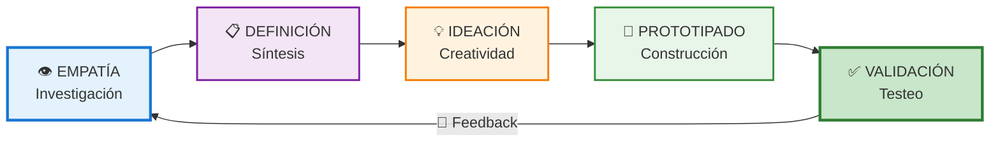

# Desarrollo de Productos y Servicios Basados en Datos (Clase 5)

**Curso:** Dirección Estratégica de Datos (ISIL, 2026-1)  
**Docente:** Brezli Paola Luna Figueroa  
**Fecha:** 09/05/2026

## 📌 Introducción

En esta clase exploramos cómo las empresas modernas desarrollan productos y servicios usando **datos como brújula**. No es suficiente tener datos; hay que usarlos en cada etapa: desde identificar oportunidades hasta monitorear el desempeño post-lanzamiento.

Las empresas líderes (Google, Amazon, Netflix) no innovan por intuición: **innovan por datos**.

### Principio Fundamental: Contrastar Datos con la Realidad de Calle

**La profesora Brezli Luna enfatiza:** El análisis de datos sin conexión con la realidad operativa es teoría pura. Es vital:
- Salir al mercado
- Observar qué está pasando realmente
- Contrastar números con comportamiento en calle
- Identificar **carencias ocultas** que los números aún no revelan

**Ejemplo peruano:** El mercado de productos de limpieza profesionales (ej. O-Cedar/Vileda) muestra enormes oportunidades en Perú porque, aunque el mercado sea burocrático, está **lleno de carencias** que quienes saben analizar datos + entender calle pueden explotar.

---

### Dos Caminos para Crear Productos

Existen dos estrategias principales para desarrollar productos:

1. **Satisfacer necesidades existentes:** Observar qué le falta al consumidor y proveerlo (demanda manifesta).
2. **Crear nuevas necesidades:** Desarrollar un producto innovador que el usuario no sabía que necesitaba hasta que lo vio (demanda latente).

Ambas requieren análisis de datos CONTRASTADO CON OBSERVACIÓN REAL para identificar dónde está la oportunidad verdadera.

---

## 1. Proceso de Desarrollo de Productos Basados en Datos

El ciclo de vida de un producto centrado en datos consta de **5 fases principales**. Este proceso **combina Agile (iteraciones rápidas) con Design Thinking (centrado en usuario)**, buscando aprender rápido del mercado sin costos hundidos.



### Fase 1️⃣: Identificación de Necesidades y Oportunidades

**¿Qué es?** Descubrir patrones, tendencias y relaciones ocultas en datos para identificar **insights** (hallazgos profundos) que revelen problemas que los clientes tienen.

**Pasos:**
1. **Recopilación de datos** → Reunir datos de múltiples fuentes (comportamiento, transacciones, feedback, operaciones)
2. **Análisis de datos** → Buscar patrones y anomalías
3. **Identificación de oportunidades** → Definir qué problema resolver con base en insights reales

**Concepto clave: Insight**  
Un **insight** es una verdad oculta o descubrimiento obtenido tras analizar grandes volúmenes de datos. No es simplemente un dato; es un conocimiento accionable que guía la decisión de negocio.

#### 📊 Ejemplo Práctico 1: E-commerce de Retail

| Datos Recopilados | Patrón Identificado | Oportunidad |
|---|---|---|
| Logs de navegación | 60% usuarios abandona carrito en checkout | Simplificar proceso de pago |
| Feedback de clientes | "El envío es lento" (mention count: 250) | Ofrecer envío express |
| Datos de inventario | Productos X se agotan en 2 horas | Crear notificación de restock |

**Conclusión:** El producto a desarrollar = Sistema de notificación de disponibilidad + Checkout optimizado.

---

#### 📊 Ejemplo Práctico 2: El "Datero" de Microbuses en Perú

Un ejemplo **real y palpable** de operación basada en datos es el rol del **"datero"** en los microbuses peruanos.

**¿Qué datos recopila el datero?**
- Frecuencia de buses en la ruta
- Cantidad de pasajeros por hora
- Intensidad del tráfico
- Horarios pico

**¿Cómo usa estos datos?**
El datero **comunica estos insights al conductor**, quien ajusta su estrategia operativa:
- Si hay mucho tráfico → El conductor esperará en terminal o irá más lento
- Si hay pocos pasajeros en horario pico → El conductor aceleraría para buscar más pasajeros
- Si hay saturación de buses → El conductor buscará rutas alternativas

**Impacto:** Sin datos, el conductor opera por intuición y comete errores. Con datos, **cada decisión se basa en hechos reales**, mejorando rentabilidad y puntualidad.

**Lección:** Este ejemplo demuestra que la cultura data-driven **no es exclusiva de empresas tech grandes**. Cualquier operación, por pequeña que sea, puede beneficiarse de recopilar y analizar datos.

---

### Fase 2️⃣: Definición de Objetivos y Alcance

**¿Qué es?** Convertir los insights en objetivos medibles y definir qué haremos (y qué NO haremos). Esto es crítico para evitar **costos hundidos** (inversión que no genera retorno porque el producto no es viable).

**Componentes clave:**
- **Objetivos SMART** (Específicos, Medibles, Alcanzables, Relevantes, Temporales)
- **Alcance del producto** → Qué features incluir en v1, qué posponer
- **Validación con Stakeholders** → ¿Todos (negocio, ingeniería, marketing, finanzas, operaciones) están alineados?
- **Gestión de Stakeholders** → Identificar aliados, neutrales y detractores

**Concepto clave: Stakeholders**  
Son las personas o grupos impactados por la actividad de la empresa: clientes, empleados, vecinos, proveedores, reguladores, competidores. Cada stakeholder tiene intereses diferentes, y **todos deben validar los objetivos** antes de empezar a construir.

#### 📊 Ejemplo: Identificación de Stakeholders (Caso Real Peruano)

**Escenario:** Camión de cerveza que abastece bodega a las 3 a.m.

| Stakeholder | Interés | Estrategia |
|---|---|---|
| **Bodeguero** | Recibir producto a tiempo, ganancia | Aliado — ofrecer garantía de entrega |
| **Vecinos** | Dormir tranquilo, sin ruido | Detractor — mitigar ruido, horarios |
| **Municipalidad** | Cumplimiento regulatorio, impuestos | Neutro/Aliado — cumplir permisos |
| **Competencia** | Proteger su territorio | Detractor — diferenciación clara |
| **Clientes del bar** | Disponibilidad de producto | Aliado — resurtido garantizado |

**Acción:** Sin validar con vecinos, el proyecto fracasa por oposición. Con datos de ruido + timing óptimo, conviertes detractores en neutrales.

#### Gestión de Stakeholders en Desarrollo de Producto

Antes de iniciar desarrollo, **mapea stakeholders y sus intereses:**

```
STAKEHOLDER MAPPING:

        ALIADOS              NEUTRALES            DETRACTORES
   ┌─────────────┐      ┌─────────────┐      ┌─────────────┐
   │ Clientes    │      │ Reguladores │      │ Competencia │
   │ (alto poder)│      │ (bajo poder)│      │ (alto poder)│
   │ Equipo      │      │             │      │             │
   │ Inversores  │      │             │      │ Stakeholders│
   └─────────────┘      └─────────────┘      │ afectados   │
                                              └─────────────┘

ACCIÓN POR TIPO:
- ALIADOS: Mantener involucrados, comunicación constante
- NEUTRALES: Informar regularmente, buscar apoyo
- DETRACTORES: Entender intereses, ofrecer valor o mitigación
```

#### 📊 Ejemplo: Sistema de Notificación

| Componente | Ejemplo |
|---|---|
| **Objetivo SMART** | "Aumentar la tasa de retención de compra en 25% en 6 meses" |
| **Alcance v1** | Notificación por email + SMS + App push (NO por WhatsApp aún) |
| **Stakeholders** | Marketing, Producto, Ingeniería, Finanzas |
| **Validación** | Todos acuerdan que email es prioridad #1 |

---

### Fase 3️⃣: Diseño y Prototipado

**¿Qué es?** Usar datos sobre preferencias y comportamientos para diseñar un producto que realmente encaje con el mercado. **El prototipado es crítico para evitar costos hundidos**: es mejor invertir 2 semanas en un prototipo tangible (dummy) que 6 meses en un producto que nadie quiere.

**Pasos:**
1. **Diseño del producto** → Wireframes, flujos de usuario basados en datos
2. **Prototipado (Dummy)** → Construir un **MVP (Minimum Viable Product)**, la versión más básica que permite validar la idea. Puede ser papel, figma, o código mínimo.
3. **Pruebas de usuario** → ¿Funciona? ¿Es intuitivo? ¿Lo querría usar? ¿Validamos nuestras hipótesis?

#### 🔍 El Valor del Prototipado Temprano

**Analogía de la Cocina ("Seco de Pollo"):**

```
COCINAR SIN PROBAR:        COCINAR CON PRUEBAS:
├─ Preparas todo (6h)      ├─ Preparas básico (1h)
├─ Pruebas al final        ├─ Pruebas a mitad camino
└─ ¡Está muy salado!       ├─ Rectificas (añade agua)
   → No hay remedio        ├─ Pruebas de nuevo
   → Desperdiciar          ├─ Listo en 3h
   → Costo hundido         └─ Resultado óptimo
```

**En software (Sprints de 2 semanas):**

No esperes 6 meses para saber si la idea funciona. **Prueba a mitad del camino** para rectificar antes de que sea costoso arreglar.

#### 📊 Ejemplo: Diseño de Email de Notificación

```
DATO: Análisis de comportamiento muestra que emails
      con 1-2 imágenes tienen 35% más click-through rate
      que solo texto.

DATO: Subject lines con nombre del usuario = +28% open rate

PROTOTIPO EMAIL:
┌─────────────────────────────────┐
│ Subject: "Carlos, tu producto   │
│          favorito está aquí"    │
│                                 │
│ Hola Carlos,                    │
│                                 │
│ [IMAGEN DEL PRODUCTO]          │
│ Producto X está nuevamente      │
│ disponible por 48 horas.        │
│                                 │
│ [BOTÓN: COMPRAR AHORA]         │
│                                 │
│ Oferta válida solo hoy.         │
└─────────────────────────────────┘

PRUEBAS DE USUARIO:
- 10 usuarios potenciales leen email
- 8 entienden el mensaje
- 6 clickean el botón
→ Resultado: 60% CTR esperado > 35% histórico ✅
```

---

### Fase 4️⃣: Desarrollo y Pruebas Ágiles

**¿Qué es?** Desarrollar en ciclos cortos (sprints de 1-4 semanas), validando con datos continuamente. La idea es **iterar rápido**, no esperar meses para ver un resultado.

**Metodología Agile:**
- Sprints cortos (2 semanas típicamente)
- Pruebas continuas (no solo al final)
- Retroalimentación → Ajustes rápidos
- Mentalidad: "Probar y rectificar" en lugar de "Planificar perfectamente"

**Analogía práctica: El seco de pollo**  
Al cocinar un seco de pollo, no esperas hasta el final para probar. **Pruebas a mitad del proceso** para rectificar la sal, el sazón, la consistencia. Si esperas hasta el final y quedó muy salado, no hay remedio. Lo mismo aplica al desarrollo de software: **itera a mitad del camino**, rectifica según datos, y evita costos hundidos.

#### 📊 Ejemplo: Ciclo Ágil de Desarrollo (6 semanas)

| Sprint | Duración | Qué se construye | Métrica de éxito |
|---|---|---|---|
| **Sprint 1** | 2 sem | Backend de notificaciones (email) | Sistema estable, 0 errores en pruebas |
| **Sprint 2** | 2 sem | Frontend + integraciones | Notificaciones llegan en < 5 min |
| **Sprint 3** | 2 sem | A/B Testing setup, Analytics | Tracking de open rate y CTR funciona |
| **Retrospective** | - | Equipo analiza datos y retroalimentación | Plan de mejora para v2 |

**Datos que guían cada sprint:**
- Métricas técnicas: latencia, errores
- Métricas de usuario: ¿Abren el email? ¿Compran?
- Feedback cualitativo: "Está muy lento", "No llegó el email"

---

### Fase 5️⃣: Lanzamiento y Monitoreo Continuo

**¿Qué es?** Lanzar a producción y monitorear en tiempo real para detectar problemas y oportunidades.

**Componentes:**
1. **Lanzamiento** → Rollout gradual (10% usuarios → 50% → 100%)
2. **Monitoreo de métricas** → Dashboards en tiempo real
3. **Retroalimentación continua** → Feedback de usuarios
4. **Iteraciones post-lanzamiento** → Mejoras basadas en datos reales

#### 📊 Ejemplo: Dashboard de Monitoreo Post-Lanzamiento

```
MÉTRICAS EN TIEMPO REAL (Dashboard)
┌─────────────────────────────────────────────────────┐
│ NOTIFICACIONES ENVIADAS: 145,230 (hoy)             │
│ ├─ Open Rate: 32% ↑ (vs. 28% histórico)           │
│ ├─ Click Rate: 8.5% ↓ (vs. 10% esperado)          │
│ └─ Conversion Rate: 4.2% ✅ (vs. 3% histórico)    │
│                                                     │
│ ERRORES: 23 (0.016%) - dentro de rango            │
│ TIEMPO RESPUESTA: 1.2 seg promedio                │
│                                                     │
│ FEEDBACK USUARIOS:                                │
│ ├─ "Email muy largo" (12 menciones)               │
│ ├─ "No llegó a spam" (5 menciones)                │
│ └─ "Compré el producto" (45 menciones positivas) │
└─────────────────────────────────────────────────────┘

ACCIÓN: Open rate es bueno pero CTR bajo.
        Hipótesis: Botón "COMPRAR" no es visible.
        Próxima iteración: Botón más grande.
```

---

## 2. Enfoque Centrado en Datos (Data-Driven Culture)

Desarrollar un producto es importante, pero **crear una cultura organizacional donde todos toman decisiones basadas en datos** es transformacional.

### ¿Qué es Cultura Data-Driven vs. Solo Tener Datos?

| Aspecto | Sin Cultura Data-Driven | Con Cultura Data-Driven |
|---|---|---|
| **Presupuesto** | "Los datos no son prioridad" | Inversión en infraestructura, licencias, capacitación |
| **Decisiones** | "A mí me parece que..." | "¿Qué dicen los datos?" |
| **Responsabilidad** | Difusa, sin dueño claro | Explícita, roles definidos (Data Owner, Steward) |
| **Alineación** | Cada equipo por su lado | Misión y Visión guían todas las iniciativas |
| **Impacto** | Bajo, improvisación constante | Alto, resultados predecibles y escalables |

**Conclusión:** Cultura Data-Driven = **Presupuesto + Compromiso + Alineación**. Sin presupuesto, no hay infraestructura. Sin compromiso, no hay uso real.

### Componente 1: Gobierno de Datos

**¿Qué es?** Un conjunto de políticas, procesos y roles para asegurar que los datos sean precisos, seguros y éticos.

#### Elementos clave del Gobierno de Datos:

| Elemento | Qué es | Ejemplo |
|---|---|---|
| **Políticas de datos** | Reglas sobre qué datos se usan y cómo | "Solo datos anonimizados para análisis" |
| **Control de calidad** | Procesos para asegurar precisión | "Validar emails antes de enviar" |
| **Seguridad y privacidad** | Protección contra acceso no autorizado | Encriptación, GDPR compliance |
| **Roles y responsabilidades** | Quién es dueño de qué datos | Data Owner, Data Steward, Analytics |
| **Monitoreo continuo** | Alertas cuando datos se corrompen | "Flag: 2% de emails inválidos detecto" |

#### 📊 Caso Real: Banco Retail

```
PROBLEMA: Datos de clientes inconsistentes (mismo cliente
          tiene 3 registros diferentes en el sistema)

SOLUCIÓN - Gobierno de Datos:
├─ Política: "Cada cliente = 1 registro único"
├─ Dueño de datos: Chief Data Officer
├─ Proceso: Validación mensual de duplicados
├─ Herramienta: MDM (Master Data Management)
└─ Resultado: 99.2% consistencia de datos

IMPACTO EN PRODUCTO:
→ Recomendaciones más precisas
→ Comunicaciones personalizadas reales
→ Riesgo regulatorio reducido
```

---

### Componente 2: Cultura Corporativa Centrada en Datos

**¿Qué es?** Una filosofía donde TODOS (no solo analytics) toman decisiones basadas en datos.

#### Misión y Visión Alineadas con Datos

La profesora enfatiza que **el perfil profesional debe alinearse con la cultura empresarial:**

```
EJEMPLO 1: Empresa de Innovación
Misión: "Innovar continuamente"
Visión: "Ser líderes en soluciones disruptivas"
→ Perfil buscado: Ingeniero CREATIVO, que experimente, tome riesgos
→ Herramientas: Agile, prototipado rápido, tolerancia al fallo
→ Cultura: "Fracasar rápido es aprender"

EJEMPLO 2: Empresa de Operaciones Críticas (Banca)
Misión: "Mantener seguridad operativa"
Visión: "Ser el más confiable"
→ Perfil buscado: Ingeniero DISCIPLINADO, que siga procesos
→ Herramientas: Six Sigma, control de calidad, auditorías
→ Cultura: "Cero errores es la meta"
```

**Acción:** Asegúrate de que tu perfil y valores alineados con la **cultura real** de la empresa, no la que dicen que tienen.

#### 6 Pilares de una Cultura Data-Driven:

| Pilar | Cómo se ve | Resultado |
|---|---|---|
| **Liderazgo** | Ejecutivos piden "¿Qué dicen los datos?" antes de decidir | Decisiones consistentes, no por intuición |
| **Presupuesto** | Inversión explícita en infraestructura + herramientas | Cultura sustentada, no solo teoría |
| **Educación** | Todos en la empresa saben leer dashboards básicos | Democratización de datos (no solo Analytics) |
| **Herramientas** | Acceso fácil a datos (BI tools, dashboards en tiempo real) | Sin esperas de 3 meses para reportes; decisiones ágiles |
| **Transparencia** | Datos compartidos abiertamente entre equipos | Menos silos, más colaboración entre Stakeholders |
| **Procesos datos-first** | Las métricas guían sprints, roadmaps, bonificaciones | Alineación a objetivos estratégicos |
| **Evaluación y ajuste** | "¿Qué aprendimos?" es pregunta estándar post-proyecto | Mejora continua real, no discurso |

#### 📊 Caso Real: SaaS (Software as a Service)

```
ANTES (sin cultura data-driven):
- Producto: "Agreguemos esta feature porque a mí me gusta"
- Resultado: Feature no es usada (5% adoption)
- Tiempo/dinero perdido: 2 meses × 5 engineers

DESPUÉS (con cultura data-driven):
- Producto: "Analizamos 10K usuarios. El 85% pide X feature."
- Resultado: Feature usada por 60% de usuarios
- Impacto: +35% retention, +$2M en nuevas ventas
- Toda decisión se basa en datos de usuarios reales
```

---

### Componente 3: Infraestructura de Datos

**¿Qué es?** Los sistemas técnicos que permiten recopilar, almacenar, analizar y visualizar datos.

#### Componentes de Infraestructura:

| Componente | Función | Ejemplo |
|---|---|---|
| **Almacenamiento** | Guardar millones de registros | Data Lake, Data Warehouse (Snowflake, BigQuery) |
| **Integración** | Conectar fuentes dispares | ETL tools, Kafka |
| **Análisis** | Procesamiento de datos | SQL, Python, Spark |
| **Visualización** | Dashboards y reportes | Tableau, Looker, Power BI |
| **Gobernanza** | Control de acceso y linaje de datos | Data Catalog, Access Control |

#### 📊 Arquitectura Típica de Infraestructura:

```
FUENTES                    ALMACENAMIENTO              ANÁLISIS                VISUALIZACIÓN
┌──────────────┐          ┌──────────────┐           ┌──────────────┐        ┌──────────────┐
│ App (eventos)│─────────▶│ Data Lake    │──────────▶│ SQL Queries  │───────▶│ Dashboard    │
└──────────────┘          │ (raw data)   │           │ (exploración)│        │ (en tiempo   │
                          └──────────────┘           └──────────────┘        │  real)       │
┌──────────────┐                │                           │               └──────────────┘
│ CRM (clientes)               │                           │
└──────────────┘               ├─ ETL Pipeline             │
                               │ (limpieza y               ├─ ML Models
┌──────────────┐               │  transformación)          │ (predicción)
│ Bases datos  │               │                           │
│ legacy       │               ▼                           ▼
└──────────────┘          ┌──────────────┐           ┌──────────────┐
                          │ Data Warehouse          │ Recomendaciones
                          │ (datos limpios)        │ (personalizadas)
                          └──────────────┘           └──────────────┘
```

---

## 3. Casos Prácticos: Empresas Líderes

### Caso 1: Google Maps

**Oportunidad:** Millones de usuarios navegaban sin herramientas precisas. Google tenía **datos de búsqueda global** → ¿Por qué no crearlos?

**Proceso:**
1. **Identificación:** Análisis de búsquedas muestra demanda inmensa de "cómo llegar a..."
2. **Objetivos:** Navegación precisa + rápida + multimodo (auto, transporte, bicicleta)
3. **Diseño:** Interfaz limpia, basada en comportamiento de usuarios (qué querían ver)
4. **Desarrollo ágil:** Iteraciones continuas (rutas, tráfico en tiempo real)
5. **Monitoreo:** Precisión de rutas, tiempo de entrega, feedback de usuarios

**Métricas que Google monitorea:**
- Precisión de ruta (¿Llega el usuario a tiempo?)
- Tiempo de cálculo de ruta (< 500ms)
- Adopción por mercado geográfico
- Feedback: "Ruta muy lenta" → datos valiosos

**Resultado:** 1,500+ millones de usuarios activos mensuales.

---

### Caso 2: Amazon Alexa

**Oportunidad:** Los hogares inteligentes crecerían, pero faltaba interfaz intuitiva. Amazon tenía **datos de búsqueda y compras** → ¿Por qué no controlar el hogar con voz?

**Proceso:**
1. **Identificación:** Análisis de búsquedas muestra interés en "smart home". Pero dispositivos existentes = complicados.
2. **Objetivos:** Interfaz de voz natural. Controlar luces, cerraduras, etc.
3. **Diseño:** Prototipado con usuarios reales (famosos, técnicos, no-técnicos)
4. **Desarrollo ágil:** Machine Learning mejorado cada sprint (reconocimiento de voz)
5. **Monitoreo:** % de comandos entendidos, conversión a compra de dispositivos

**Métricas clave:**
- Precisión de reconocimiento de voz: 95%+
- Tasa de abandono: Si el usuario dice "Alexa" y no pasa nada → mal
- Conversión: ¿Compra el usuario el Echo Dot?

**Resultado:** +100M dispositivos Alexa en uso. Ingresos adicionales por cada comando ejecutado.

---

### Caso 3: Netflix - Motor de Recomendación

**Oportunidad:** Usuarios tienen millones de opciones. Sin recomendaciones → parálisis. Netflix tenía **datos de visualización de 200M+ usuarios** → ¿Por qué no personalizar?

**Proceso:**
1. **Identificación:** Netflix descubre que el 80% de películas vistas son descubiertas por recomendaciones (no búsqueda)
2. **Objetivos:** Aumentar tiempo de visualización en 30 minutos/mes con mejor recomendaciones
3. **Diseño:** Algoritmo que considere (1) historial, (2) géneros, (3) ratings similares, (4) hora del día
4. **Desarrollo ágil:** ML models testeados contra 10% de usuarios en paralelo
5. **Monitoreo:** % de películas clickeadas que se terminan (≠ solo clicadas), retención de usuarios

**Métricas:**
- Click-through rate en recomendación: 25%
- Tasa de "completación" (ver ≥ 90% de película): 68%
- Reducción de "churn" (cancelación): +5% por mejora pequeña

**Fórmula simplificada del algoritmo:**

$$\text{Score}(usuario_i, película_j) = \alpha \cdot \text{Historial} + \beta \cdot \text{Género} + \gamma \cdot \text{Ratings similares}$$

**Donde:**
- $\alpha, \beta, \gamma$ = pesos aprendidos de datos históricos
- Si el usuario A vio 10 películas de Scifi con 4.5★ → Score alto en Scifi nuevas

**Resultado:** Recomendaciones son 50% de ingresos. Sin ellas, Netflix perdería $2B+/año.

---

## 3.5 Glosario: Conceptos Clave en Data-Driven Development

Antes de continuar con buenas prácticas, asegúrate de entender estos términos:

| Término | Definición | Ejemplo |
|---|---|---|
| **Insight** | Verdad oculta descubierta tras analizar datos; conocimiento accionable | "El 60% de abandonos en checkout ocurren en paso 3" |
| **Stakeholder** | Persona o grupo impactado por la operación (cliente, empleado, regulador, proveedor) | Marketing quiere conversión ↑, Ingeniería quiere mantenibilidad, CFO quiere ROI |
| **MVP (Minimum Viable Product)** | Versión más básica de un producto que permite validar la idea sin gastar 6 meses | Prototipo clickeable, no código en prod |
| **Costo Hundido** | Dinero invertido que no se puede recuperar; común si no se prototipa correctamente | Gastar $100K en feature que nadie usa |
| **Iteración** | Ciclo de construcción → prueba → aprendizaje → mejora | Sprint de 2 semanas donde se prueba, rectifica y evoluciona |
| **KPI (Key Performance Indicator)** | Métrica que mide si alcanzamos objetivos | Conversion Rate, Open Rate, Retention Rate |
| **A/B Testing** | Prueba controlada donde comparo dos versiones para ver cuál funciona mejor | Email con botón grande vs botón pequeño |
| **Rollout Gradual** | Lanzar a 10% → 50% → 100% de usuarios, no todo de golpe | Detectar bugs antes de afectar a todos |

---

## 4. Buenas Prácticas en el Desarrollo

### Práctica 1: Agile + Design Thinking (El Combo Ganador)

Olvidar planes rígidos de 12 meses. **Combinar Agile (iteraciones rápidas) con Design Thinking (usuario primero)** es la fórmula ganadora.

**Agile aportA:**
- Sprints de 2 semanas
- Feedback continuo
- Rectificación rápida
- Evita costos hundidos

**Design Thinking aporta:**
- Empatía real con usuarios
- Prototipado temprano
- Validación con usuarios reales
- Enfoque en problema, no en solución

**Juntos:**
```
DESIGN THINKING (Qué problema)  →  AGILE (Cómo resolverlo rápido)
┌──────────────────────────┐      ┌──────────────────────────┐
│ Empatía                  │      │ Sprint 1: Prototipo      │
│ Definir                  │  →   │ Sprint 2: Feedback       │
│ Idear                    │      │ Sprint 3: Mejora         │
│ Prototipo                │      │ Sprint N: Iteración      │
│ Probar                   │      │ Release                  │
└──────────────────────────┘      └──────────────────────────┘
```

#### Principios Agile (adaptados a datos):

| Principio | Significado | En práctica |
|---|---|---|
| **Iteraciones cortas** | Ciclos de 1-4 semanas máximo | Release cada 2 semanas, no cada año (evita costos hundidos) |
| **MVP primero** | Lanzar lo mínimo viable posible | No gastar 6 meses en perfección; valida primero con prototipo |
| **Feedback continuo** | Usuarios y Stakeholders = mejores críticos | Daily standup: "¿Qué dijeron los usuarios/datos?" |
| **Respuesta al cambio** | El plan cambia según datos | Si métrica X cae, pivota inmediatamente |
| **Colaboración** | Producto + Datos + Ingeniería + Stakeholders juntos | No silos; todos miran el dashboard |
| **Prueba y rectifica** | Como cocinar: probar a mitad de camino | "Seco de pollo": prueba en sprint 1, rectifica en sprint 2 |

#### 📊 Ejemplo: Sprint de 2 Semanas

```
INICIO DE SPRINT (Lunes)
├─ Objetivo: "Aumentar CTR de email en 5%"
├─ Hipótesis: "Si el botón es 2x más grande, +CTR"
└─ Métricas de éxito: CTR ≥ 8.5% (vs. 8% actual)

DESARROLLO (Martes-Jueves)
├─ Ingeniero: Implementa botón más grande
├─ Designer: A/B test con 20% usuarios
└─ Data: Monitorea CTR en tiempo real

VIERNES - CIERRE DE SPRINT
├─ Resultados: CTR = 8.7% ✅
├─ Retrospectiva: "¿Qué aprendimos? ¿Qué falta?"
├─ Feedback: "Usuarios dicen: el botón es mejor, pero..."
└─ Plan próximo sprint: "Ahora optimicemos el copy del botón"

CICLO COMPLETO = 2 SEMANAS DE MEJORA BASADA EN DATOS
```

---

### Práctica 2: Design Thinking

**¿Qué es?** Un proceso de 5 pasos para resolver problemas centrado en el usuario, no en la tecnología.

#### Los 5 Pasos del Design Thinking:

```
        ┌─────────────┐
        │   EMPATÍA   │ ← Entender al usuario REALMENTE
        │ (User pain) │
        └──────┬──────┘
               │
        ┌─────────────┐
        │   DEFINIR   │ ← Sintetizar el problema
        │ (Problem)   │
        └──────┬──────┘
               │
        ┌─────────────┐
        │    IDEAR    │ ← Generar soluciones (sin filtrar)
        │ (Solutions) │
        └──────┬──────┘
               │
        ┌─────────────┐
        │  PROTOTIPAR │ ← Construir tangible (no perfecto)
        │ (Build fast)│
        └──────┬──────┘
               │
        ┌─────────────┐
        │    PROBAR   │ ← Validar con usuarios reales
        │ (Real users)│
        └─────────────┘
```

#### Fase 1: EMPATÍA

**Herramienta: Mapa de Empatía** (Entender qué piensa, siente, oye, ve el usuario)

```
┌────────────────────────────────────────────┐
│           MAPA DE EMPATÍA USUARIO            │
├────────────────────────────────────────────┤
│                                            │
│ ¿QUÉ PIENSA Y SIENTE?                    │
│ - "Hay demasiadas opciones en Netflix"    │
│ - "No sé qué ver, siempre tardo 30 min"   │
│ - Estrés por "perder tiempo"              │
│                                            │
│ ¿QUÉ OYE?                                 │
│ - Amigos: "Mira esta serie, es increíble" │
│ - Publicidad: "Los mejores estrenos"      │
│ - Familia: "Esto era mejor antes"         │
│                                            │
│ ¿QUÉ VE?                                  │
│ - Pantalla con 5,000+ opciones            │
│ - Portadas coloridas (todas se ven iguales)│
│ - Reviewa conflictivas (3★ vs 5★)         │
│                                            │
│ PUNTOS DE DOLOR (Frustración)             │
│ - Parálisis de decisión                   │
│ - Miedo a "perder tiempo" en mala película│
│ - Dificultad para descubrir contenido nuevo│
│                                            │
│ RESULTADOS DESEADOS (Win)                 │
│ - Encontrar contenido en < 5 minutos      │
│ - Recomendaciones personalizadas          │
│ - Sentirse confiante en la elección       │
│                                            │
└────────────────────────────────────────────┘
```

#### Fase 2: DEFINIR

**Convertir insight en un "Punto de Vista":**

```
PUNTO DE VISTA (POV):
"El usuario de Netflix necesita una forma más RÁPIDA
 de descubrir contenido PERSONALIZADO porque PIERDE
 TIEMPO AHORA buscando."

PREGUNTA REENCUADRADA (How Might We?):
"¿Cómo podríamos ayudar a usuarios a encontrar
 contenido perfecto en < 5 minutos usando sus
 preferencias históricas?"
```

#### Fase 3: IDEAR

**Generar muchas ideas SIN juzgar (brainstorming puro):**

```
IDEAS PARA RESOLVER "Descubre contenido en < 5 min":
├─ Algoritmo de recomendación (ML) ← ELEGIDA
├─ Encuesta rápida de géneros (5 preguntas)
├─ "Hoy vemos..." (recomendación de edición diaria)
├─ Social: "Qué ven tus amigos ahora"
├─ Sorpresa: Botón "Hazme sorprender"
└─ Curaduría humana: "Top 10 del mes"

SELECCIÓN: La #1 (algoritmo) es escalable y personalizada.
```

#### Fase 4: PROTOTIPAR

**Construir rápido para testear idea sin invertir 6 meses:**

```
PROTOTIPO DE BAJA FIDELIDAD (Wireframe):
┌─────────────────────────┐
│ ← Volver a Home         │
│                         │
│ PARA TI HECHO A MEDIDA  │
│                         │
│ [Imagen] Título        │ ← Card 1 (recomendación)
│ ★★★★★ 92% match        │
│ Ver tráiler | Agregar  │
│                         │
│ [Imagen] Título        │ ← Card 2
│ ★★★★☆ 87% match        │
│ Ver tráiler | Agregar  │
│                         │
│ [Imagen] Título        │ ← Card 3
│ ★★★★☆ 85% match        │
│ Ver tráiler | Agregar  │
│                         │
│ + Ver más recomendaciones
└─────────────────────────┘

MÉTRICAS A TESTEAR:
- ¿Entiende el usuario "% match"?
- ¿Qué acción toma: Ver trailer vs Agregar?
- ¿Tarda < 5 min en elegir?
```

#### Fase 5: PROBAR

**Validar con usuarios reales:**

```
TEST CON 10 USUARIOS (Think-Aloud Protocol):

Usuario #1:
- Acción: Clickea en "Ver tráiler" (Card 1)
- Feedback: "El %match me confunde. ¿Qué significa 92%?"
- Insight: Necesitamos tooltip explicativo

Usuario #2-10:
- Acción: Mayoría clickea en "Ver tráiler" primero
- Tiempo: Promedio 3 min hasta click
- Satisfacción: 8/10

CONCLUSIÓN:
✅ Concepto funciona
⚠️ Label "%match" es confuso → cambiar a "Sé que te gustará"
→ Próximo sprint: Refinar copy e implementar en prod
```

---

## 4.5 Design Thinking Reforzado: Validación de Stakeholders

Una etapa crítica en Design Thinking (frecuentemente omitida) es **validar con Stakeholders en cada fase**:

#### Validación Post-Definición

Al terminar la fase "Definir" (problema), reúnete con Stakeholders:
- **Marketing:** "¿Esto alineado con estrategia de marca?"
- **Finanzas:** "¿El ROI estimado justifica inversión?"
- **Legal/Compliance:** "¿Cumplimos regulaciones?"
- **Ingeniería:** "¿Es técnicamente viable?"

**Si algún Stakeholder dice 'no', vuelve a iterar.** No avances sin alineación.

#### Validación Post-Prototipo

Al terminar "Prototipado":
- Muestra el MVP a usuarios reales
- Recopila feedback de Stakeholders (gerentes, inversores)
- Rectifica antes de construir código en producción

**Esto previene costos hundidos:** Mejor descubrir a los 2 sprints que a los 6 meses que no funciona.

---

## 5. Evaluación de la Efectividad

No basta lanzar. Hay que medir si funcionó.

### Paso 1: Definir KPIs (Key Performance Indicators)

**¿Qué es?** Métricas que muestran si alcanzamos objetivos.

#### Ejemplo: Product de Sistema de Notificaciones

| Objetivo del Negocio | KPI | Meta | Cómo se mide |
|---|---|---|---|
| Aumentar compra repetida | Conversion Rate | 4.5% → 5.5% | `Compras / Notificaciones clickeadas` |
| Mantener satisfacción | Email Open Rate | > 30% | `Emails abiertos / Emails enviados` |
| Escalar sin perder calidad | Bounce Rate | < 2% | `Emails inválidos / Total enviados` |
| Reducir costos | CTR vs Cost | ROI > 300% | `Revenue / Costo de envío` |

---

### Paso 2: Recopilación de Datos

**¿Qué datos necesitamos?**

| Tipo de Dato | Fuente | Uso |
|---|---|---|
| **Datos de uso** | App/web tracking (Google Analytics, Mixpanel) | ¿Qué hace el usuario? |
| **Feedback cualitativo** | Encuestas, entrevistas, chat | ¿Qué piensa/siente? |
| **Datos de negocio** | CRM, facturaćión | ¿Se convierte en dinero? |
| **Datos técnicos** | Logs, monitoreo de servidores | ¿Funciona el sistema? |

#### 📊 Ejemplo: Recopilación de Datos para Notificación

```
DATOS AUTOMÁTICOS (Real-time):
├─ Usuarios recibieron notificación: 145,230
├─ Emails abiertos: 46,474 (32%)
├─ Links clickeados: 12,345 (8.5%)
├─ Conversiones (compra): 6,100 (4.2%)
└─ Abandono en checkout: 1,234 (0.8%)

DATOS CUALITATIVO (Manual):
├─ Encuesta post-click: "¿Por qué no compraste?"
│  └─ "El precio está alto" (234 respuestas)
│  └─ "No tenía mi talla" (189 respuestas)
│  └─ "Quería pensar más" (456 respuestas)
│
└─ Chat: "Hola, ¿puedo devolver?" (52 chats)

DATOS TÉCNICOS (Monitoreo):
├─ Email delivery rate: 99.2%
├─ Bounce rate: 1.8%
└─ Avg. time to open: 2.3 horas
```

---

### Paso 3: Pruebas y Validación

**Técnicas para probar ideas:**

#### A/B Testing (Prueba Controlada)

```
GRUPO A (Control)          GRUPO B (Variante)
┌──────────────┐          ┌──────────────┐
│ Email normal │          │ Email con    │
│              │          │ botón 2x más │
│ [Botón]      │   VS     │ grande       │
│              │          │ [BIG BUTTON] │
│ Open Rate: 30%           │ Open Rate: 35%
│ CTR: 8%                  │ CTR: 11%
└──────────────┘          └──────────────┘

CONCLUSIÓN: Variante B es +5% CTR
             → Rolear a 100% usuarios
```

#### Pruebas Multivariadas

```
TESTEAMOS SIMULTÁNEAMENTE:
├─ Copy: "Ahora disponible" vs "Solo 48 horas"
├─ Color botón: Verde vs Rojo
├─ Imagen: Producto vs Lifestyle
└─ Resultado: Encontramos combo ganador

COMBINACIÓN GANADORA:
Copy: "Solo 48 horas" +
Botón rojo +
Lifestyle image
= CTR 12% (vs 8% inicial)
```

---

### Paso 4: Monitoreo Continuo

**Una vez en producción, vigilar 24/7:**

#### Dashboard de Monitoreo En Tiempo Real

```
┌─────────────────────────────────────────────────────┐
│ MÉTRICAS EN TIEMPO REAL (Actualizado cada 15 min)  │
├─────────────────────────────────────────────────────┤
│                                                     │
│ SALUD DEL SISTEMA:                                │
│ ├─ Emails enviados HOY: 145,230                   │
│ ├─ Errores: 23 (0.016%) ✅                        │
│ ├─ Latencia (tiempo entrega): 1.2 seg ✅          │
│ └─ Uptime: 99.98% ✅                              │
│                                                     │
│ MÉTRICAS DE NEGOCIO:                              │
│ ├─ Open Rate: 32% (vs 30% ayer) ↑                │
│ ├─ CTR: 8.5% (vs 8% ayer) ↑                      │
│ ├─ Conversion: 4.2% (meta: 4.5%) ⚠️              │
│ └─ Revenue: $51,000 (vs $48K ayer) ↑             │
│                                                     │
│ ALERTAS:                                          │
│ 🔴 Bounce rate 2.1% (limite: 2%) → Investigar   │
│ 🟡 Conversion tasa baja → A/B test nuevo copy    │
│                                                     │
└─────────────────────────────────────────────────────┘
```

**Acciones automáticas por alerta:**
- Si Bounce Rate > 2% → Alert al equipo de datos
- Si CTR < 7% por 3 días → Parar campaña, investigar
- Si Revenue < $45K/día → Posible anomalía

---

## 6. Guía Rápida: Checklist de Lanzamiento

Antes de lanzar un producto o feature, verifica:

### Pre-Lanzamiento ✅

- [ ] **Datos:** ¿Identificamos el problema con datos reales (no intuición)?
- [ ] **Objetivos:** ¿Son SMART? (Específicos, Medibles, Alcanzables, Relevantes, Temporales)
- [ ] **Alcance:** ¿Qué incluir en v1 y qué NO?
- [ ] **Design:** ¿Prototipamos y testamos con usuarios reales?
- [ ] **Ágil:** ¿Hicimos sprints de 2 sem? ¿Iteramos?
- [ ] **KPIs:** ¿Definimos las 3-5 métricas clave?

### Lanzamiento 🚀

- [ ] **Rollout gradual:** Comienza con 10% usuarios, no 100%
- [ ] **Monitoreo:** ¿Dashboard en tiempo real está activo?
- [ ] **Alertas:** ¿Avisos configurados para anomalías?
- [ ] **Equipo listo:** ¿Todo el mundo sabe qué hacer si falla?

### Post-Lanzamiento 📊

- [ ] **Datos reales:** ¿Comparamos resultados vs predicción?
- [ ] **Feedback:** ¿Recopilamos opiniones de usuarios en 48 horas?
- [ ] **Iteración:** ¿Plantificamos sprint de mejoras basado en aprendizajes?
- [ ] **Documentación:** ¿Documentamos qué funcionó y qué no?

---

## 7. Conexión con Otras Clases

Este tema se conecta con:

- **Clase 1 (Introducción a Datos):** Fuentes de datos
- **Clase 2 (Recopilación de Datos):** ETL para alimentar el producto
- **Clase 3 (Análisis de Datos):** Cómo extraer insights
- **Clase 4 (Innovación Digital):** Transformación mediante datos
- **Análisis Estadístico (EDA):** Exploramos datos antes de diseñar

---

## 8. Conclusiones Clave

1. **Datos + Calle = Realidad:** Contrastar números con observación real es vital. El "datero" en microbuses peruanos es un ejemplo de análisis de datos en operación.

2. **Agile + Design Thinking = Éxito:** Iteraciones cortas basadas en feedback de usuarios. Prototipado temprano = Evita costos hundidos (analogía del seco de pollo).

3. **Stakeholders importan:** Aliados, neutrales, detractores. Cada uno requiere estrategia diferente. Sin validar, el proyecto fracasa.

4. **Cultura = Presupuesto + Compromiso:** No es suficiente decir "usamos datos". Debe haber inversión real en infraestructura, herramientas y capacitación. Sin presupuesto, no hay cultura.

5. **Misión y Visión guían el perfil:** La cultura empresarial define si buscas innovación o estabilidad. Alinéate con los valores REALES de la empresa, no los teóricos.

6. **Monitoreo continuo es obligatorio:** No lanzar y olvidar; medir siempre. Dashboards en tiempo real, alertas configuradas, feedback recopilado.

7. **Casos reales funcionan:** Google, Amazon, Netflix no innovan por suerte; es por datos. Y tú también puedes en el contexto peruano si análizas + observas mercado.

---

## 📚 Referencias Bibliográficas

- Alonso, M. (2024). *Insights: qué son y cómo aplicarlos a tu proyecto*. Asana.
- Giovanny (2021). *Principales Herramientas para las fases de Design Thinking*. 
- SAP España (2023). *La importancia del análisis de datos en una empresa*.
- Wikipedia (2022). *Amazon Alexa*.

---

**Clase 5 — Dirección Estratégica de Datos | ISIL 2026-1**
