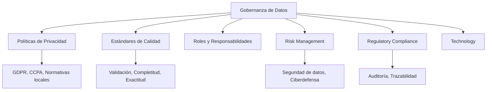

# Gestión de la Innovación de Datos

## Introducción

La innovación en datos es la capacidad de una organización para **crear valor continuo** a partir de datos, transformando información dispersa en decisiones estratégicas y productos que diferencian.

Durante esta sesión exploraremos:
- Conceptos fundamentales de innovación en datos
- Estrategias para fomentar una cultura de datos
- Casos de estudio reales
- Implementación de proyectos piloto

---

## Conceptos Clave de Innovación en Datos

### Innovación Basada en Datos

**Definición:** Uso de datos para mejorar productos, servicios y procesos.

**Ejemplos:**
- **Big Data** para análisis de patrones masivos
- **Inteligencia Artificial** para automatización inteligente
- **Análisis Predictivo** para anticipar comportamientos
- **Recomendación personalizada** en e-commerce
- **Detección de fraudes** en tiempo real

### Estrategia de Datos

**Definición:** Plan integral que define cómo una organización recoge, gestiona, analiza y utiliza datos para alcanzar objetivos empresariales.

**Componentes:**
- Identificación de fuentes de datos
- Infraestructura de recopilación y almacenamiento
- Procesos de calidad y gobernanza
- Competencias analíticas del equipo
- Alineación con objetivos empresariales

### Gobernanza de Datos

**Definición:** Marco de políticas, procedimientos y estándares que aseguran calidad, seguridad y gestión ética de datos.

### Chief Data Officer (CDO)

**Rol:** Ejecutivo senior responsable de la estrategia de datos organizacional.

**Responsabilidades:**
- Desarrollo de políticas de datos
- Alineación de estrategia de datos con objetivos empresariales
- Supervisión de iniciativas de datos
- Gestión de recursos analíticos
- Asegurar cumplimiento normativo

### Cultura Basada en Datos

**Definición:** Cultura organizacional donde decisiones se toman basándose en datos y análisis, no solo en intuición o experiencia.

**Características:**
- Accesibilidad de datos a todos los niveles
- Capacitación en lectura e interpretación de datos
- Valoración de evidencia sobre intuición
- Tolerancia al aprendizaje mediante experimentación
- Inversión en herramientas y talento analítico

### Arquitectura de Datos

**Definición:** Diseño y organización de sistemas de gestión de datos.

**Importancia:** Asegurar que datos estén disponibles, sean accesibles y utilizables para cumplir objetivos empresariales.

**Elementos:**
- Infraestructura (cloud, on-premise, híbrida)
- Almacenamiento (data lake, data warehouse, database)
- Integración (ETL, APIs, real-time streaming)
- Seguridad (encriptación, acceso, auditoría)

### Producto de Datos

**Definición:** Aplicaciones, herramientas o servicios desarrollados a partir de datos y análisis para proporcionar valor a usuarios o clientes.

**Casos de uso:**
- Dashboards de inteligencia empresarial
- Sistemas de recomendación
- Plataformas de análisis predictivo
- Marketplace de datos
- APIs de datos para terceros

---

## Estrategias para Fomentar la Innovación en Datos

### 1. Cultura Organizacional Orientada a la Innovación

**Objetivo:** Crear un entorno donde innovación sea valorada en todos los niveles.

**Acciones:**
- Invertir en **mentalidad de experimentación**
- Permitir "fallos aprendidos" sin penalización
- Incentivar colaboración entre áreas (IT, negocio, datos)
- Comunicar casos de éxito internos

**Ejemplo: Banco que incentiva hackathones internos**
- Trimestral: equipo de datos compite con ideas de innovación
- Ideas ganadoras reciben presupuesto para MVP
- Resultado: 3 productos de datos nuevos en un año

### 2. Capacitación y Desarrollo de Habilidades

**Objetivo:** Desarrollar competencias analíticas necesarias para innovación continua.

**Programas:**
- Formación en herramientas: Power BI, Tableau, Python, SQL
- Certificaciones en Data Science, Machine Learning
- Programas de mentoring: analistas juniors con seniors
- Acceso a comunidades (Kaggle, DataTalks, etc.)

**Ejemplo: Retail omnicanal**
- Capacita 50 empleados en análisis básico (Power BI)
- 15 avanzan a nivel intermedio en Python
- Resultado: Reducción de ciclo analítico de 2 semanas a 3 días

### 3. Gobernanza de Datos Efectiva

**Objetivo:** Asegurar que datos sean gestionados y utilizados de manera segura, eficiente y conforme a regulaciones.

**Componentes clave:**
- **Políticas y procedimientos** claros
- **Roles y responsabilidades** definidas
- **Cumplimiento y auditoría** continua

**Ejemplo: Aseguradora con gobernanza madura**
- Política: Solo área de riesgos accede a datos de salud
- Procedimiento: Acceso por tickets, auditado mensualmente
- Resultado: Cumplimiento GDPR, sin brechas de datos en 3 años

### 4. Infraestructura Moderna

**Objetivo:** Tecnología que permita escalabilidad y flexibilidad.

**Stack típico:**
- Cloud (AWS, Azure, GCP)
- Data lake para datos raw
- Data warehouse para análisis
- Herramientas de BI y ML

**Ejemplo: E-commerce que migra a cloud**
- Antes: Análisis tardaba 1 semana
- Después: Dashboards en tiempo real
- Resultado: Decisiones de pricing 100x más rápidas

### 5. Liderazgo Ejecutivo Comprometido

**Objetivo:** CDO con poder decisional y presupuesto.

**Acciones:**
- Reporta directamente a CEO o COO
- Presupuesto dedicado a innovación de datos
- KPIs asociados a valor generado por datos
- Comunicación visible de estrategia

---

## Casos de Estudio

### Caso 1: Municipalidad Inteligente (Sector Público)

**Contexto:** Municipalidad urbana con 500k ciudadanos, múltiples servicios descentralizados.

**Problema:** Presupuesto fragmentado, poca visibilidad de demanda ciudadana.

**Estrategia:**
- Centralizar datos de servicios (agua, luz, transporte, seguridad)
- Crear dashboard de inteligencia municipal
- Implementar sistemas predictivos para mantenimiento

**Innovación de datos:**
- Predicción de demanda de transporte público
- Detección de fugas de agua mediante sensores + ML
- Personalización de servicios por zona

**Resultado:**
- Reducción de costos operativos: 15%
- Mejora de satisfacción ciudadana: +25%
- Tiempo de respuesta en reclamos: -60%

### Caso 2: Hospital Red de Salud (Sector Salud)

**Contexto:** Red de 5 hospitales con sistemas clínicos desintegrados.

**Problema:** Pacientes atienden en múltiples hospitales, registros fragmentados, baja continuidad asistencial.

**Estrategia:**
- Integrar historiales clínicos en repositorio único
- Crear alertas tempranas de riesgo (sepsis, complicaciones)
- Análisis de patrones de enfermedades

**Innovación de datos:**
- Modelo predictivo de reingreso hospitalario
- Recomendaciones de tratamiento basadas en cohortes similares
- Dashboard clínico para médicos

**Resultado:**
- Reducción de reingresos no planeados: 20%
- Mejora de calidad de atención: +30%
- Cumplimiento regulatorio: 100%

### Caso 3: Fábrica Inteligente (Sector Industrial)

**Contexto:** Planta de manufactura con 200 máquinas, paros impredecibles.

**Problema:** Cada parada cuesta 50k$ en producción perdida. Mantenimiento reactivo, no predictivo.

**Estrategia:**
- Implementar sensores IoT en máquinas críticas
- Integrar datos con sistemas ERP
- Algoritmo de predictive maintenance

**Innovación de datos:**
- Predicción de falla de componentes 2 semanas antes
- Optimización de ciclos de producción
- Recomendaciones de mejora en procesos

**Resultado:**
- Reducción de paros no planeados: 70%
- Aumento de OEE: +15%
- ROI en 18 meses

### Caso 4: Fintech de Microcréditos (Sector Financiero)

**Contexto:** Startup que otorga microcréditos a trabajadores informales.

**Problema:** Métodos tradicionales de scoring no funciona. Riesgo de mora alto.

**Estrategia:**
- Datos alternativos: transacciones móviles, historial de pagos digitales
- Modelo ML de scoring alternativo
- Monitoreo en tiempo real de repago

**Innovación de datos:**
- Scoring basado en comportamiento digital, no ingresos declarados
- Ajuste dinámico de límites según patrones
- Predicción de abandono del servicio

**Resultado:**
- Tasa de aprobación: +40% vs. métodos tradicionales
- Mora reducida a 8% vs. 20% del mercado
- Escalabilidad sin aumento de riesgo

---

## Buenas Prácticas en Innovación de Datos

### 1. Empieza por el Negocio, no por la Tecnología

**Principio:** No construyas soluciones en busca de problema.

**Proceso:**
- Identificar dolor empresarial real
- Definir métrica de éxito
- Luego, elegir tecnología

**Ejemplo:** No lances un data lake porque está de moda. Lánzalo si necesitas consolidar 50 fuentes dispersas.

### 2. Comienza con Proyectos Piloto

**Principio:** Valida antes de escalar.

**Estructura:**
- Alcance pequeño y bien definido
- Equipo dedicado 4-8 semanas
- Métrica clara de éxito o fracaso
- Aprendizaje documentado

### 3. Construye Comunidades de Datos

**Principio:** El conocimiento se multiplica en comunidades.

**Tácticas:**
- Foros internos de datos
- Brown bags mensuales (share learnings)
- Oficina de horas abiertas para consultas
- Reconocimiento de expertos

### 4. Mide Valor, no Solo Actividad

**Principio:** Los datos generan valor solo si las decisiones cambian.

**Métricas:**
- ¿Cuántas decisiones se toman con datos?
- ¿Cuál fue el impacto en negocio?
- ¿Se redujo ciclo de decisión?
- ¿Mejoró precisión de pronósticos?

**Ejemplo:** No midas "dashboards creados". Mide "decisiones de pricing optimizadas + reducción de 5% en costo".

### 5. Itera Rápido, Comunica Visión

**Principio:** Aprende de pequeños experimentos, comunica dirección clara.

**Cadencia:**
- Sprint de 2 semanas: test, aprender, iterar
- Comunicación mensual de progreso
- Revisión trimestral de dirección

---

## Implementación de Proyectos Piloto

### Estructura de un Proyecto Piloto (8 semanas)

#### Semana 1-2: Definición y Preparación
- Identificar problema empresarial específico
- Definir métrica de éxito (KPI)
- Asignar equipo (analista, ingeniero de datos, sponsor de negocio)
- Preparar datos (acceso, limpieza inicial)

#### Semana 3-4: Exploración y Modelado
- Análisis exploratorio de datos
- Desarrollo de modelo/solución
- Validación interna

#### Semana 5-6: Prototipo y Validación
- Demostración a stakeholders
- Feedback de usuarios finales
- Ajustes

#### Semana 7-8: Decisión y Documentación
- Go/No-go: ¿Escalamos?
- Documentación de aprendizajes
- Plan de escalabilidad (si Go)

### Ejemplo: Proyecto Piloto en Retailer

**Semana 1-2:** Problema: Rotación de inventario ineficiente en 50 tiendas

**Semana 3-4:** Modelo de predicción de demanda por SKU y tienda

**Semana 5-6:** Prueba en 5 tiendas piloto, feedback de gerentes

**Semana 7-8:** Reducción de ruptura en 12% vs. control → Go! Escalamos a 50 tiendas

**Semana 9+:** Nuevo KPI en dashboard mensual; analista dedicado

---

## Checklist: Gestión de Innovación de Datos

### Fundamentos
- [ ] ¿Tenemos CDO o equivalente con poder decisional?
- [ ] ¿Existe gobernanza de datos documentada?
- [ ] ¿Hay presupuesto dedicado a innovación de datos?

### Cultura
- [ ] ¿Los líderes comunicar importancia de datos?
- [ ] ¿Hay capacitación activa en habilidades analíticas?
- [ ] ¿Se celebran casos de éxito de datos?

### Tecnología
- [ ] ¿Infraestructura moderna (cloud, scalable)?
- [ ] ¿Accesibilidad de herramientas a todo el equipo?
- [ ] ¿Seguridad y cumplimiento regulatorio?

### Estrategia
- [ ] ¿Estrategia de datos alineada con estrategia empresarial?
- [ ] ¿Proyectos piloto documentados y escalables?
- [ ] ¿Métricas de valor, no solo actividad?

