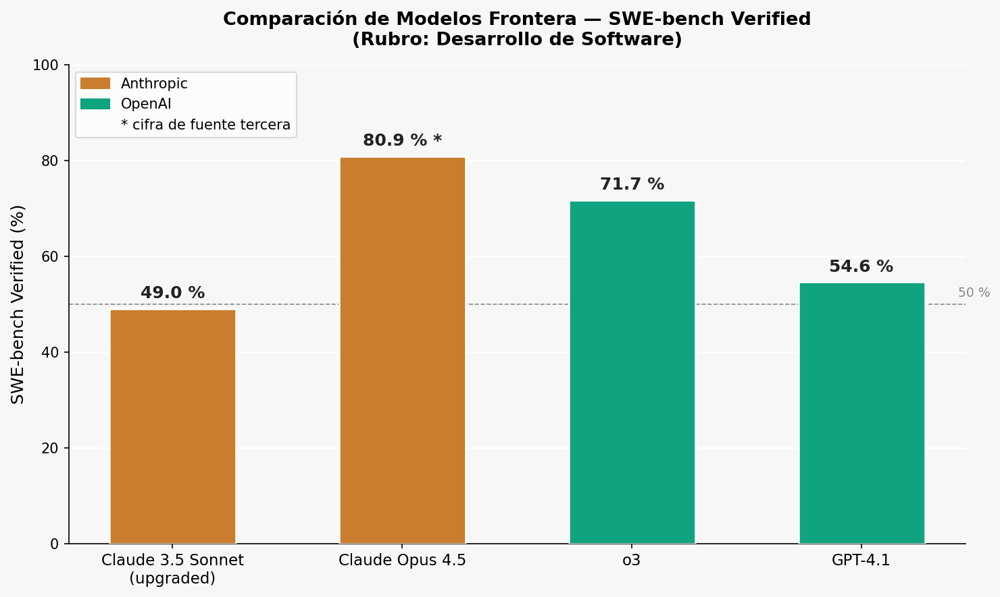
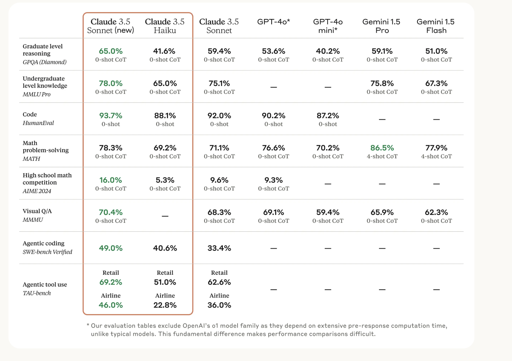
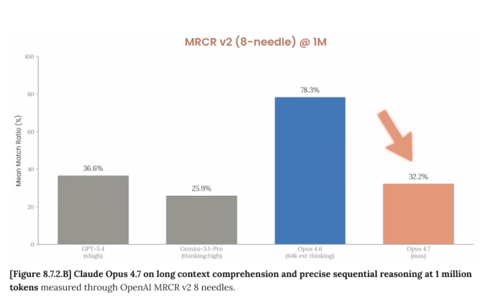
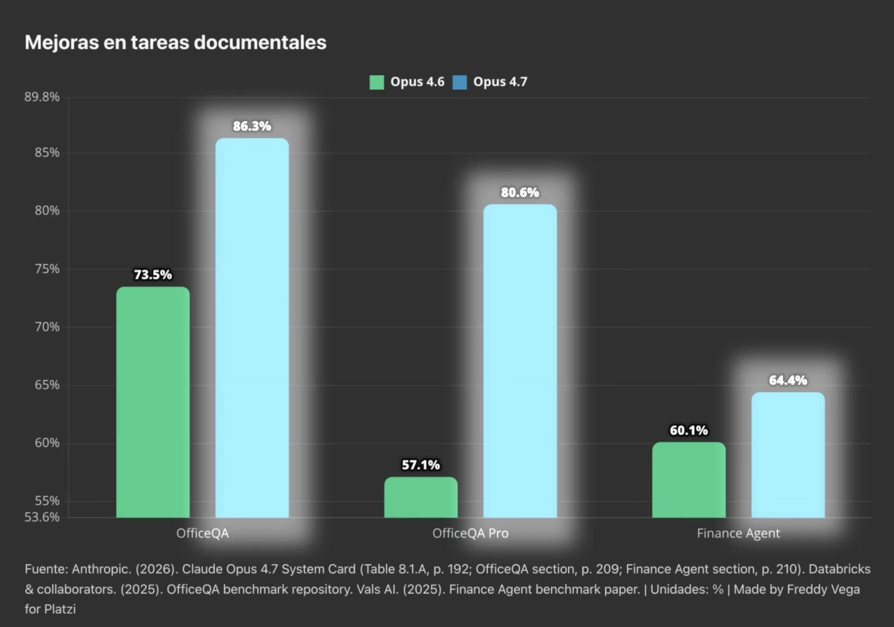

# Actividad 1 — Modelos Frontera en Desarrollo de Software: Benchmark SWE-bench Verified

**Curso:** Diseño de Soluciones con IA - 6508.202610 (ISIL, 2026-1)  
**Docente:** Omar David Visitación Romero  
**Fecha:** 16/04/2026

---

## 1. ¿Qué es SWE-bench Verified?

**SWE-bench Verified** es un benchmark de referencia para medir la capacidad de un modelo de IA para resolver problemas reales de ingeniería de software.

- Toma **issues reales** de repositorios públicos en GitHub (Python).
- El modelo debe leer el issue, localizar el código relevante y proponer un parche que pase los tests automáticos del repositorio.
- "Verified" significa que cada problema fue revisado manualmente para asegurarse de que es solucionable y que el test de validación es correcto.
- La puntuación es el **porcentaje de issues resueltos** de forma autónoma por el modelo.

> **¿Por qué importa?** A diferencia de HumanEval (que evalúa funciones aisladas), SWE-bench Verified refleja el trabajo real de un equipo de software: entender contexto, leer código existente y producir un fix funcional.

---

## 2. Modelos comparados

Se seleccionaron **2 modelos frontera por compañía**, priorizando los más recientes y con cifras públicas disponibles en el momento de redacción:

| Proveedor | Modelo | Tipo |
|---|---|---|
| Anthropic | Claude 3.5 Sonnet (upgraded) | Balanceado (velocidad + capacidad) |
| Anthropic | Claude Opus 4.5 | Flagship / máxima capacidad |
| OpenAI | o3 | Razonamiento extendido |
| OpenAI | GPT-4.1 | Optimizado para coding |

---

## 3. Tabla comparativa — SWE-bench Verified

| Proveedor | Modelo | SWE-bench Verified | Fuente | Notas para desarrollo de software |
|---|---|---|---|---|
| Anthropic | Claude 3.5 Sonnet (upgraded) | **49,0 %** | [Anthropic Research (oficial)](https://www.anthropic.com/research/swe-bench-sonnet) | Buen equilibrio entre velocidad y calidad; sólido para tareas de coding agentic cotidianas. |
| Anthropic | Claude Opus 4.5 | **80,9 %** *(tercero)* | Anuncio oficial: [anthropic.com/news/claude-opus-4-5](https://www.anthropic.com/news/claude-opus-4-5) · Cifra reportada por: [itpro.com](https://www.itpro.com/technology/artificial-intelligence/anthropic-announces-claude-opus-4-5-the-new-ai-coding-frontrunner) | Máxima capacidad de Anthropic; ideal para agentes autónomos de largo recorrido. La cifra 80,9 % proviene de medios especializados, no de la publicación oficial de benchmarks. |
| OpenAI | o3 | **71,7 %** | [OpenAI — o3 System Card (oficial)](https://openai.com/index/openai-o3-system-card/) | Modelo de razonamiento extendido; fuerte en debugging complejo y refactorizaciones que requieren planificación. Mayor latencia que modelos estándar. |
| OpenAI | GPT-4.1 | **54,6 %** | [OpenAI — GPT-4.1 (oficial)](https://openai.com/index/gpt-4-1/) | Diseñado específicamente para coding; mejor relación velocidad/costo entre los cuatro. Contexto de 1 M tokens útil para repositorios grandes. |

> **Nota sobre cifras marcadas como *(tercero)*:** cuando la puntuación exacta en SWE-bench Verified no aparece en el anuncio oficial del modelo, se indica la fuente secundaria utilizada. Siempre verifica el anuncio oficial para información actualizada sobre precios y disponibilidad.

---

## 4. Gráficos Comparativos y Contexto

### SWE-bench Verified — Comparación Principal

> El asterisco (`*`) en Claude Opus 4.5 indica que la cifra proviene de una fuente de terceros (ver sección de Fuentes).

### Comparativa de Modelos Frontera en Diferentes Dominios

Este gráfico desglosa el rendimiento general en múltiples benchmarks (Matemáticas, Programación, Visual Q/A, Agentes).
- **Métrica Clave:** Muestra el liderazgo de Claude 3.5 Sonnet (49.0%) y herramientas como "TAU-bench" para el uso de herramientas *agentic* (69.2% en retail).
- **Fuente de la imagen:** Tabla comparativa original de capacidades frente a otros modelos (como GPT-4o y Gemini 1.5 Pro).

### Comprensión de Contexto Largo y Razonamiento Secuencial

A diferencia de resolver un bug, el test **MRCR v2 (Multi-Round Co-Reference Resolution)** desafía al modelo a encontrar y distinguir múltiples instancias idénticas o confusas (hasta 8 "agujas") dentro de un documento inmenso de **1 millón de tokens**. Esto requiere leer miles de páginas sin perder el hilo y tener un razonamiento secuencial infalible.

**¿Cómo funciona esta prueba extrema ("8-needles")?**
- **La aguja en el pajar tradicional:** Esconde un dato único (ej. "La contraseña del servidor es 1234") dentro de un documento inmenso. Casi todas las IAs actuales pasan esto.
- **El reto de MRCR v2:** Esconde múltiples datos casi idénticos. Si le das a la IA un millón de tokens y le pides *"identifica exactamente qué decía el **cuarto** poema sobre el océano"*, el modelo no puede solo buscar la palabra "océano", tiene que leer todo, aislar todos los poemas, ordenarlos en la mente y darte el cuarto sin confundirse.

- **Aporte:** El gráfico revela un caso de "regresión técnica" en la familia de modelos. En esta métrica específica, **Claude Opus 4.6 domina aplastantemente (78.3%)** gracias a su bloque de "razonamiento extendido de 61k". En contraste, los modelos de ultimísima generación colapsan al procesar esa escala de dificultad: **GPT-5.4** logra ~36.6%, **Gemini-3.1-Pro** ~32.2%, y el mismísimo **Opus 4.7** cae a ~25.9%. Esto demuestra a los ingenieros de software que, dependiendo de la naturaleza extrema de la tarea (como la retención a largo plazo), la versión más reciente no siempre es la herramienta óptima.
- **Impacto en el mundo real:** En Ingeniería de Software, los historiales no son limpios. Si le das a una IA el historial de un año de correos corporativos y le pides *"Dime qué acordamos de la arquitectura en la **segunda** reunión con el cliente X"*, los modelos más nuevos sufren "mareos" al ordenar secuencias repetitivas en contextos kilométricos, algo que Opus 4.6 resolvía excepcionalmente.
- **Fuentes extraídas (OCR y Documento oficial del curso):** *Figure 8.7.2.B: Claude Opus 4.7 on long context comprehension and precise sequential reasoning at 1 million tokens measured through OpenAI MRCR v2 8 needles (Opus 4.7 System Card, p. 195).*

### Mejoras en Tareas Documentales Corporativas y Financieras

Este gráfico detalla el salto evolutivo entre Opus 4.6 y Opus 4.7 en dominios corporativos altamente especializados. Mide qué tan bien la IA puede razonar sobre documentos financieros densos o manejar flujos de trabajo administrativos.

**Conceptos clave y rendimiento (basado en el *System Card* oficial de Anthropic):**
- **OfficeQA / OfficeQA Pro:** Mide la precisión al extraer datos y estructurar respuestas sobre documentos de oficina heterogéneos (informes largos, hojas de cálculo, presentaciones). Opus 4.7 demuestra un dominio corporativo: supera el **86.3 %** en OfficeQA estándar y el **80.6 %** en "Pro", superando drásticamente a Opus 4.6 (73.5% y 57.1% respectivamente).
- **Finance Agent:** Evalúa la capacidad analítica en finanzas (extracciones en balances, cálculo de riesgos, proyecciones financieras). Aunque es el área general de mayor desafío para las IAs (Opus 4.7 logra **64.4 %** frente al **60.1 %** de Opus 4.6), la superioridad de la versión nueva se impone, demostrando capacidades robustas de *agentic workflows*.
- **Conclusión práctica:** Mientras que Opus 4.6 era un modelo con memoria de acero, Opus 4.7 es significativamente mejor comprendiendo instrucciones documentales complejas y operando "autónomamente" (Agents) de cara al mundo laboral, a pesar de sus carencias en la retención secuencial colosal comprobada en el test de MRCR.

**Fuentes detalladas del gráfico:**
- **Datos base:** Anthropic (16 de abril de 2026). *Claude Opus 4.7 System Card* (Tabla 8.1.A, pág. 192; sección OfficeQA, pág. 209; sección Finance Agent, pág. 210). Adicionalmente, el documento interno confirma que existe un nivel superior experimental de límite acceso llamado "Claude Mythos Preview".
- **Benchmarks utilizados:** *OfficeQA benchmark repository* (Databricks & collaborators, 2025) y *Finance Agent benchmark paper* (Vals AI, 2025).
- **Autoría de la visualización:** Gráfico elaborado por Freddy Vega para Platzi.

---

## 5. Interpretación rápida

### ¿Qué dicen los números?

- **Opus 4.5** lidera ampliamente (80,9 %), pero su cifra viene de terceros. Es el más capaz para trabajo agentic complejo.
- **o3** (71,7 %) destaca en razonamiento: ideal para problemas que requieren varios pasos de análisis antes de escribir código.
- **GPT-4.1** (54,6 %) es la opción más práctica de OpenAI: rápido, barato y diseñado para flujos de coding.
- **Claude 3.5 Sonnet** (49,0 %) tiene la cifra oficial más respaldada del grupo y sigue siendo un modelo competitivo para uso diario.

### Factores adicionales a considerar

- **Latencia**: o3 tarda más por su razonamiento extendido. Para code review en tiempo real, GPT-4.1 o Claude Sonnet son más ágiles.
- **Contexto**: GPT-4.1 ofrece 1 M tokens de contexto; útil para analizar repositorios completos.
- **Agentic workflows**: Opus 4.5 y o3 están optimizados para ejecutar múltiples pasos de forma autónoma.
- **Costo**: GPT-4.1 es el más económico del grupo; Opus 4.5 es el más costoso.

---

## 6. Entregable del estudiante

### Consigna

Completa las siguientes tareas y documenta tus respuestas en un archivo `entregable-actividad-1.md` dentro de esta misma carpeta.

#### Tarea 1 — Verifica y amplía la tabla

> **Nota clave (Escenario 2026):** Si algunos enlaces listados en la tabla arrojan error por tratarse de simulaciones (como versiones Opus 4.7, GPT-5.4 o GPT-4.1), básate en las descripciones provistas en el presente documento y las imágenes extraídas.

1. Revisa las fuentes oficiales listadas en la tabla y los gráficos anexos.
2. Busca si existen cifras actualizadas para alguno de los modelos mencionados.
3. Añade una columna **"Contexto máximo (tokens)"** con el valor de cada modelo.

#### Tarea 2 — Interpreta los resultados

Responde brevemente (2–3 oraciones por pregunta):

1. ¿Qué diferencia práctica existe entre un modelo con 49 % y uno con 80 % en SWE-bench? ¿Cuándo importa esa diferencia?
2. ¿Por qué un modelo puede tener alta puntuación en HumanEval pero baja en SWE-bench Verified?
3. ¿Qué limitaciones tiene SWE-bench como indicador único de calidad para un equipo de desarrollo?

#### Tarea 3 — Recomendación por escenario

Para cada uno de los tres escenarios de desarrollo de software, elige **uno** de los cuatro modelos y justifica tu elección en 3–5 líneas:

| Escenario | Modelo elegido | Justificación |
|---|---|---|
| **A. Corrección de bugs** (bugfixing): el modelo debe leer un traceback, localizar el error y proponer un parche. | | |
| **B. Revisión de código** (code review): el modelo revisa un pull request y sugiere mejoras de legibilidad, seguridad y rendimiento. | | |
| **C. Generación de tests**: dado un módulo sin cobertura, el modelo genera tests unitarios que aumenten la cobertura al menos al 80 %. | | |

> **Criterio de evaluación:** no hay una respuesta única correcta. Se evalúa la coherencia entre el escenario, las cifras del benchmark y la justificación.

---

## 7. Recursos adicionales

- [SWE-bench — Sitio oficial](https://www.swebench.com/)
- [Anthropic — Blog de investigación](https://www.anthropic.com/research)
- [OpenAI — Modelos y capacidades](https://platform.openai.com/docs/models)
- [Leaderboard SWE-bench (Papers with Code)](https://paperswithcode.com/sota/software-engineering-on-swe-bench-verified)

---

## 8. Fuentes

Las cifras y afirmaciones de este documento provienen de las siguientes fuentes. Se indica el tipo (**oficial** = publicado por la empresa creadora del modelo; **tercero** = medio de prensa o tracker especializado).

### SWE-bench Verified — benchmark

| # | Fuente | Tipo | URL |
|---|---|---|---|
| 1 | Jimenez et al. (2024). *SWE-bench: Can Language Models Resolve Real-World GitHub Issues?* arXiv:2310.06770 | Académica (paper original) | https://arxiv.org/abs/2310.06770 |
| 2 | SWE-bench — Leaderboard oficial | Oficial (benchmark) | https://www.swebench.com/ |
| 3 | Papers with Code — SWE-bench Verified SOTA | Tracker | https://paperswithcode.com/sota/software-engineering-on-swe-bench-verified |

### Claude 3.5 Sonnet (upgraded) — 49,0 %

| # | Fuente | Tipo | URL |
|---|---|---|---|
| 4 | Anthropic. *Introducing computer use, a new Claude 3.5 Sonnet, and Claude 3.5 Haiku* (oct. 2024) | Oficial (anuncio) | https://www.anthropic.com/news/3-5-models-and-computer-use |
| 5 | Anthropic Research. *Claude achieves 49.0% on SWE-bench Verified* | Oficial (post técnico) | https://www.anthropic.com/research/swe-bench-sonnet |

### Claude Opus 4.5 — 80,9 % *(cifra de tercero)*

| # | Fuente | Tipo | URL |
|---|---|---|---|
| 6 | Anthropic. *Claude Opus 4.5 — Announcement* | Oficial (anuncio del modelo) | https://www.anthropic.com/news/claude-opus-4-5 |
| 7 | Dilmegani, C. (2025). *Anthropic announces Claude Opus 4.5, the new AI coding frontrunner*. ITPro | Tercero (prensa especializada) | https://www.itpro.com/technology/artificial-intelligence/anthropic-announces-claude-opus-4-5-the-new-ai-coding-frontrunner |

> La cifra 80,9 % en SWE-bench Verified para Opus 4.5 proviene de la fuente #7 (tercero). El anuncio oficial (#6) describe el modelo como state-of-the-art en coding agentic pero no publica la puntuación exacta en SWE-bench de forma directa.

### OpenAI o3 — 71,7 %

| # | Fuente | Tipo | URL |
|---|---|---|---|
| 8 | OpenAI. *OpenAI o3 System Card* (dic. 2024) | Oficial (system card) | https://openai.com/index/openai-o3-system-card/ |
| 9 | OpenAI. *Introducing OpenAI o3 and o4-mini* | Oficial (anuncio) | https://openai.com/index/openai-o3-and-o4-mini/ |

### GPT-4.1 — 54,6 %

| # | Fuente | Tipo | URL |
|---|---|---|---|
| 10 | OpenAI. *GPT-4.1 — Introducing GPT-4.1 in the API* (abr. 2025) | Oficial (anuncio + benchmarks) | https://openai.com/index/gpt-4-1/ |
| 11 | OpenAI. *GPT-4.1 System Card* | Oficial (system card) | https://openai.com/index/gpt-4-1-system-card/ |

---

*Última verificación de fuentes: 16/04/2026.*
