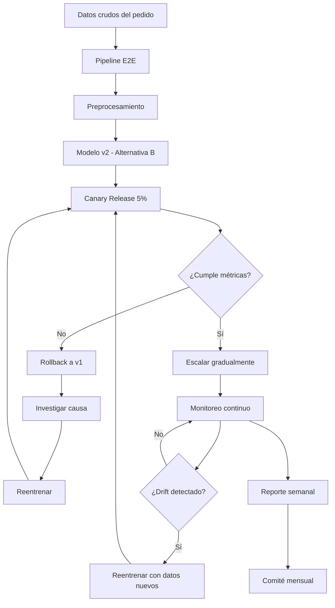

# Evaluación Integral: Entrega a Tiempo — Diagnóstico, Selección, Ética y Despliegue (Actividad 5)

**Curso:** Diseño de Soluciones con IA (ISIL, 2026-1)  
**Docente:** Omar David Visitacion Romero  
**Fecha:** 20/07/2026

---

## Introducción

Entrega a Tiempo es una empresa de distribución en Lima que todos los días recibe pedidos de alimentos, ropa, electrónicos y productos para el hogar. El problema es claro: algunos pedidos llegan a tiempo y otros no. Cuando eso pasa, vienen reclamos, devoluciones y clientes que no vuelven. Por ahora, un equipo revisa cada pedido manualmente para intentar prever los retrasos. La empresa quiere que la IA haga ese trabajo, pero con un supervisor revisando cada recomendación antes de actuar.

Este documento responde cuatro preguntas clave: ¿qué problemas tiene la información?, ¿qué modelo conviene usar?, ¿cómo respetamos la privacidad de los clientes?, y ¿cómo ponemos el sistema en producción sin que se rompa?

---

## a) Diagnóstico de la información y decisiones previas (5 puntos)

### Diagnóstico general

La empresa tiene 1,000 pedidos guardados. De esos, 200 llegaron con retraso y 800 a tiempo. Esto nos dice dos cosas importantes: es un problema de clasificación (retraso o normal) y hay muchos más pedidos a tiempo que con retraso, lo cual puede sesgar al modelo si no se maneja bien.

Los datos incluyen números (distancia, tiempo de entrega), categorías (distrito, tipo de producto, transportista), fechas y comentarios escritos por el cliente. También hay fotos y grabaciones de llamadas, pero esos son otro tema que trataremos más adelante.

### Problemas identificados y decisiones recomendadas

#### 1. Distancia faltante en 100 pedidos (10%)

**Diagnóstico:** A 100 de los 1,000 pedidos les falta la distancia del recorrido. Es una variable que probablemente influya en el retraso (más distancia, más posibilidad de retraso).

**Decisión:** No borrar esos registros. 10% de datos faltantes es mucho como para ignorarlo, pero tampoco es tan grave como para descartar filas. La clase 5 nos dice que cuando los nulos están entre 5% y 30%, lo mejor es imputar, no eliminar.

**Estrategia recomendada:**
- Primero hay que entender por qué faltan: ¿fue un error aleatorio o hay un patrón? (MCAR, MAR o MNAR)
- Si es aleatorio o depende de otras variables: rellenar con la mediana de distancia por distrito, que es más resistente a valores extremos
- Si faltan porque son pedidos muy cortos que no se midieron: crear una columna que diga "distancia no registrada" y luego imputar
- **Rechazar** la idea del trabajador de borrar todo lo que tenga datos faltantes: perderíamos 100 pedidos valiosos y el modelo aprendería con información incompleta

**Rechazo de la propuesta del trabajador 1:** Eliminar todos los pedidos con algún dato faltante es una estrategia demasiado agresiva. Con 1,000 registros, perder 100 o más filas reduce la calidad del entrenamiento y puede meter sesgo si los datos que faltan no son aleatorios.

#### 2. Tiempos de entrega negativos (30 registros)

**Diagnóstico:** Un tiempo de entrega no puede ser negativo. Es físicamente imposible. Estos 30 registros son errores de carga, no datos reales.

**Decisión:** Antes de imputar nada, hay que investigar qué pasó.

**Estrategia:**
- Puede ser un error de formato (alguna fecha quedó invertida) o de zona horaria
- Si se puede corregir el signo, se corrige. Si no, se elimina la fila
- Si no hay forma de saber el valor real: tratar como outlier y sacar del entrenamiento
- **Rechazar** la idea de completar con el promedio: meter un promedio en un dato que es imposible no tiene sentido y arruinaría el modelo

**Rechazo de la propuesta del trabajador 2:** Rellenar datos con el promedio suena rápido, pero es una simplificación que falla cuando los datos tienen distribución irregular o valores extremos. Para tiempos de entrega, la mediana o métodos como KNN son mucho más confiables.

#### 3. Fechas con formatos inconsistentes

**Diagnóstico:** Las fechas están escritas de distintas formas ("01/05/2026", "2026-05-01", "1 de mayo"). Esto impide usar la variable temporal para extraer datos útiles como día de la semana, mes o estacionalidad.

**Decisión:** Estandarizar todas las fechas a un formato único.

**Estrategia:**
- Pasar todo a formato ISO 8601: `YYYY-MM-DD`
- Sacar variables útiles: día de semana, hora del día, si es fin de semana o feriado
- Con eso el modelo puede aprender patrones como "los lunes hay más retrasos" o "los pedidos después de las 6 PM se complican más"

#### 4. Distrito con nombres inconsistentes

**Diagnóstico:** "San Miguel", "SAN MIGUEL" y "S. Miguel" son el mismo distrito escrito de tres formas. Esto fragmenta los datos y el modelo no puede agrupar bien la información.

**Decisión:** Unificar los nombres.

**Estrategia:**
- Pasar todos los nombres a formato con primera letra mayúscula y resto minúscula
- Armar un diccionario de sinónimos para juntar variantes
- Verificar contra el censo oficial de distritos de Lima (43 distritos)

#### 5. Pedidos aparentemente repetidos (40 registros)

**Diagnóstico:** Hay 40 pedidos que parecen duplicados. Puede ser un error del sistema o puede que el cliente haya cancelado y vuelto a ordenar.

**Decisión:** Investigar antes de borrar.

**Estrategia:**
- Comparar los registros por: distrito, distancia, transportista, fecha y hora
- Si son idénticos en todo: quedarse con el primero y eliminar el resto
- Si tienen alguna diferencia (un campo distinto, por ejemplo): pueden ser pedidos diferentes y no se borran
- Documentar cuántos se eliminaron y por qué

#### 6. Comentarios con abreviaturas, errores y campos vacíos

**Diagnóstico:** Los comentarios del cliente son texto libre que puede contener pistas valiosas ("llamé y no contestaron", "el producto llegó dañado"). Pero también tienen abreviaturas, errores de escritura y campos vacíos.

**Decisión:** Procesarlos antes de descartarlos.

**Estrategia:**
- Limpiar el texto: pasar a minúsculas, arreglar abreviaturas comunes
- Si el campo está vacío: marcarlo con una bandera `comentario_vacio`
- Extraer sentimiento (positivo, negativo, neutro) como variable nueva
- No borrar la columna: los comentarios pueden ser una señal predictiva del retraso

#### 7. Datos sensibles en fotografías y grabaciones

**Diagnóstico:** Las fotos muestran rostros, placas de vehículos y el interior de las casas. Las grabaciones tienen nombres, teléfonos, direcciones y datos de pago. Todo esto son datos personales protegidos por la **Ley 31814** y la normativa de privacidad.

**Decisión:** No usar estos datos para el modelo de retrasos.

**Justificación:**
- Al modelo solo le importan cosas como la distancia, el distrito y el tipo de producto
- Las fotos y grabaciones fueron recolectadas para otra cosa (evidenciar la entrega), no para entrenar IA
- Usarlas para este modelo violaría el principio de minimización y podría verse como vigilancia masiva
- Si en algún momento se quisieran usar, habría que pedir permiso explícito al cliente y hacer una evaluación de impacto

#### 8. Incorporar edad, nacionalidad e ingresos

**Diagnóstico:** El área comercial quiere agregar edad, nacionalidad e ingresos del cliente, creyendo que mejorarían el modelo.

**Decisión:** No agregarlos de entrada. Evaluar con mucho cuidado.

**Justificación:**
- Son variables sensibles que pueden introducir discriminación
- Si el modelo aprende que "los distritos con menos ingresos se retrasan más", estaría sesgado: el retraso depende de la logística, no del nivel socioeconómico del cliente
- La clase 4 nos recuerda que el sesgo (bias) aparece cuando el modelo aprende patrones injustos de datos incompletos o dirigidos
- Si se llegan a incorporar: primero una auditoría de equidad, verificando que el modelo no discrimine por género, nacionalidad o ingresos
- Preferir siempre variables directamente relacionadas con la operación (distancia, hora, transportista) sobre variables demográficas

### Resumen de decisiones previas

| Problema | Propuesta incorrecta | Decisión correcta | Acción específica |
|---|---|---|---|
| 100 distancias faltantes | Eliminar todos los faltantes | Imputar con mediana por distrito | KNN o mediana condicional |
| 30 tiempos negativos | Completar con promedio | Investigar y corregir/eliminar | Verificar origen del error |
| Fechas inconsistentes | No mencionada | Estandarizar a ISO 8601 | Extraer variables temporales |
| Distritos inconsistentes | No mencionada | Homogeneizar nombres | Title Case + diccionario |
| 40 duplicados | No mencionada | Investigar y eliminar confirmados | Comparar campos clave |
| Comentarios sucios | No mencionada | Limpiar y extraer sentimiento | NLP básico + bandera vacío |
| Fotos y grabaciones | No mencionada | **NO usar** para este modelo | Respetar minimización de datos |
| Edad, nacionalidad, ingresos | Incorporar directamente | Auditar sesgo primero | Evaluar impacto ético |

---

## b) Análisis de las tres alternativas y recomendación (5 puntos)

### Construcción de la matriz de confusión

De los 100 pedidos nuevos evaluados: 20 llegaron con retraso real y 80 sin retraso.

**Cómo se obtienen los valores:** El enunciado del ejercicio da el accuracy de cada alternativa (90%, 89%, 79%) pero no los valores individuales de VP, FN, FP y VN. Para deducirlos, se usa un sistema de ecuaciones con estas restricciones:
- **VP + FN = 20** (todos los retrasos reales)
- **FP + VN = 80** (todas las entregas normales)
- **VP + VN = Accuracy × 100** (aciertos totales)
- **FN + FP = 100 - Accuracy × 100** (errores totales)

Con estas cuatro ecuaciones se resuelve el sistema y se obtienen los valores de cada cuadrante. Luego se calculan las demás métricas (Precisión, Recall, F1) con las fórmulas de la tabla.

| | **Predicho: Retraso** | **Predicho: Normal** | **Total real** |
|---|---|---|---|
| **Real: Retraso** | VP (Verdadero Positivo) | FN (Falso Negativo) | 20 |
| **Real: Normal** | FP (Falso Positivo) | VN (Verdadero Negativo) | 80 |

### Cálculos por alternativa

#### Alternativa A — Reglas sencillas (caja blanca)

| Métrica | Fórmula | Cálculo | Resultado |
|---|---|---|---|
| VP | Retrasos identificados correctamente | — | **14** |
| FN | Retrasos no identificados | — | **6** |
| FP | Entregas normales señaladas como retrasos | — | **4** |
| VN | Entregas normales identificadas correctamente | — | **76** |
| **Exactitud (Accuracy)** | (VP + VN) / Total | (14 + 76) / 100 | **90%** |
| **Precisión** | VP / (VP + FP) | 14 / (14 + 4) | **77.8%** |
| **Recall (Sensibilidad)** | VP / (VP + FN) | 14 / (14 + 6) | **70.0%** |
| **F1-Score** | 2 × (Prec × Recall) / (Prec + Recall) | 2 × (0.778 × 0.70) / (0.778 + 0.70) | **73.7%** |

**Características:** Reglas sencillas comprensibles por supervisores. Caja blanca. Alta interpretabilidad.

#### Alternativa B — Explicable (caja blanca/semi-transparente)

| Métrica | Fórmula | Cálculo | Resultado |
|---|---|---|---|
| VP | Retrasos identificados correctamente | — | **17** |
| FN | Retrasos no identificados | — | **3** |
| FP | Entregas normales señaladas como retrasos | — | **8** |
| VN | Entregas normales identificadas correctamente | — | **72** |
| **Exactitud (Accuracy)** | (VP + VN) / Total | (17 + 72) / 100 | **89%** |
| **Precisión** | VP / (VP + FP) | 17 / (17 + 8) | **68.0%** |
| **Recall (Sensibilidad)** | VP / (VP + FN) | 17 / (17 + 3) | **85.0%** |
| **F1-Score** | 2 × (Prec × Recall) / (Prec + Recall) | 2 × (0.68 × 0.85) / (0.68 + 0.85) | **75.7%** |

**Características:** Permite conocer qué datos influyeron en cada recomendación (explicabilidad). Caja blanca/semi-transparente. Balance entre precisión e interpretabilidad.

#### Alternativa C — Mayor cobertura (caja negra)

| Métrica | Fórmula | Cálculo | Resultado |
|---|---|---|---|
| VP | Retrasos identificados correctamente | — | **19** |
| FN | Retrasos no identificados | — | **1** |
| FP | Entregas normales señaladas como retrasos | — | **20** |
| VN | Entregas normales identificadas correctamente | — | **60** |
| **Exactitud (Accuracy)** | (VP + VN) / Total | (19 + 60) / 100 | **79%** |
| **Precisión** | VP / (VP + FP) | 19 / (19 + 20) | **48.7%** |
| **Recall (Sensibilidad)** | VP / (VP + FN) | 19 / (19 + 1) | **95.0%** |
| **F1-Score** | 2 × (Prec × Recall) / (Prec + Recall) | 2 × (0.487 × 0.95) / (0.487 + 0.95) | **64.4%** |

**Características:** Identifica casi todos los retrasos (95%), pero genera mucha falsa alarma (48.7% de precisión). Caja negra: no explica por qué. 1 de cada 2 predicciones de "retraso" es un error.

### Tabla comparativa resumen

| Métrica | Alternativa A | Alternativa B | Alternativa C |
|---|---|---|---|
| Exactitud | **90%** | 89% | 79% |
| Precisión | **77.8%** | 68.0% | 48.7% |
| Recall | 70.0% | 85.0% | **95.0%** |
| F1-Score | 73.7% | **75.7%** | 64.4% |
| Interpretabilidad | **Alta** | **Alta** | Baja |
| Falsas alarmas | **4** | 8 | **20** |
| Retrasos perdidos | **6** | 3 | **1** |

### Análisis del contexto de negocio

**¿Qué es más grave para el negocio?**

- **Falso negativo (FN):** Un retraso que pasa desapercibido. El cliente recibe su pedido tarde sin aviso. Resultado: reclamo, devolución y probablemente pierdes al cliente. **Costo alto.**
- **Falso positivo (FP):** Un pedido a tiempo que el modelo marca como retraso. El supervisor lo revisa sin necesidad, quizás avisa al cliente de un retraso que no va a pasar. Molestia, pero no pierdes al cliente. **Costo bajo.**

En este negocio, perder un cliente por no detectar un retraso cuesta mucho más que una falsa alarma. Por eso, **el Recall (capacidad de detectar retrasos reales) es la métrica que más importa**.

### Recomendación: Alternativa B

**Justificación:**

1. **Detecta la mayoría de retrasos (85%):** De cada 20 retrasos reales, atrapa 17 y solo se le escapan 3. Es un balance justo entre cobertura y precisión.

2. **Mejor equilibrio general (F1-Score de 75.7%):** Esta métrica junta precisión y recall en un solo número. La Alternativa C tiene mejor recall, pero su F1 (64.4%) muestra que la baja precisión le pesa mucho.

3. **Se puede explicar:** La Alternativa B dice "qué datos influyeron en cada recomendación". Esto es clave porque:
   - El supervisor necesita entender por qué el modelo dijo que ese pedido se va a retrasar
   - Ayuda a detectar si el modelo está siendo injusto con ciertos distritos
   - Cumple con la Ley 31814, que exige transparencia en las decisiones de IA
   - El supervisor puede explicarle al cliente por qué se toma cierta medida

4. **No satura al equipo:** Con solo 8 falsas alarmas (vs. 20 de la C), el equipo no se frustra. Si el modelo grita "¡retraso!" todo el tiempo, lo terminan ignorando.

5. **¿Por qué no la A?** Tiene mejor precisión (77.8%) y accuracy (90%), pero su recall del 70% deja pasar 6 retrasos de cada 20. Cuando el problema principal es la pérdida de clientes por retrasos, perder 3 retrasos más que la B no se justifica.

6. **¿Por qué no la C?** Atrapa casi todo (95% de recall), pero con 48.7% de precisión, la mitad de sus alertas son falsas. Los supervisores van a dejar de confiar en el modelo. Además, como no explica nada, si el modelo se equivoca no hay forma de saber por qué.

---

## c) Recomendación sobre uso responsable de la información (5 puntos)

### Recomendación al comité

La recomendación es simple: empezar con lo mínimo necesario, demostrar que funciona, y después evaluar si vale la pena usar más datos. La confianza del cliente se construye con transparencia, no con recolección agresiva de información.

### Datos del pedido (estructurados)

**Se pueden usar.**

Fecha, distrito, distancia, tipo de producto, transportista, hora y tiempo de entrega son datos operacionales que el modelo necesita para funcionar. Son la materia prima del sistema.

**Condiciones:**
- Guardar solo lo necesario (principio de minimización)
- Quitar el nombre del cliente antes de entrenar
- Documentar qué datos se usaron y en qué versión del modelo

### Comentarios del cliente

**Se pueden usar, pero con cuidado.**

Los comentarios tienen información cualitativa valiosa, pero también datos personales que hay que proteger.

**Condiciones:**
- No guardar nombres, teléfonos ni direcciones que aparezcan en el comentario
- Extraer solo lo útil: sentimiento (positivo/negativo/neutro) y palabras clave ("retraso", "dañado", "no contestaron")
- Antes de entrenar, reemplazar nombres propios por marcadores genéricos (anonimización)
- Guardar registro del proceso de transformación por si alguien pregunta

### Fotografías de entrega

**No se recomienda usarlas para este modelo.**

**Por qué:**
- Las fotos muestran rostros (datos biométricos), placas de vehículos y el interior de casas
- Son datos personales sensibles bajo la Ley 31814 y regulaciones como el GDPR
- No ayudan a predecir retrasos logísticos
- Se recolectaron para evidenciar la entrega, no para entrenar IA

**Si en el futuro se quisieran usar (ej: verificar estado del paquete):**
- Pedir permiso explícito al cliente (opt-in)
- Aplicar borrado de rostros y anonimización de placas
- Usarlas solo para verificación de entrega, nunca para entrenar modelos
- Hacer una evaluación de impacto antes de implementar

### Grabaciones de llamadas

**No se recomienda usarlas para este modelo.**

**Por qué:**
- Contienen nombres, teléfonos, direcciones y datos de pago
- Son datos de alta sensibilidad que requieren consentimiento bajo la Ley 31814
- El modelo de retrasos no necesita analizar audio

**Si en el futuro se quisieran usar (ej: análisis de sentimiento):**
- Pedir consentimiento grabado a cada cliente
- Transcribir y anonimizar de inmediato: borrar nombres, teléfonos, direcciones, datos de pago
- Guardar solo el texto anonimizado, no el audio original
- Establecer cuánto tiempo se guardan (ej: borrar después de 30 días)
- Control de acceso estricto: solo personal autorizado

### Datos demográficos propuestos (edad, nacionalidad, ingresos)

**No se recomienda usarlos sin una auditoría previa de sesgos.**

**Por qué:**
- Son variables protegidas que pueden generar discriminación algorítmica
- Un modelo que usa nacionalidad podría aprender correlaciones falsas como "distritos pobres se retrasan más", cuando el retraso depende de la logística, no del cliente
- No se necesitan para predecir retrasos

**Si se aprueba su inclusión:**
- Hacer una auditoría de equidad antes de entrenar: verificar que la precisión sea parecida para todos los grupos
- Monitorear resultados por separado para cada grupo demográfico
- Si la precisión difiere más del 10% entre grupos, reentrenar con datos balanceados
- Documentar por qué se incluye cada variable sensible

### Principios éticos aplicables

| Principio | Cómo aplica en Entrega a Tiempo |
|---|---|
| **Minimización** | Usar solo lo que el modelo necesita: datos del pedido, nada más |
| **Propósito limitado** | Los datos de entrega no sirven para marketing, perfilado ni vigilancia |
| **Consentimiento** | Para fotos y grabaciones: pedir permiso explícito al cliente |
| **Transparencia** | Decirle al cliente que un sistema de IA ayuda a predecir retrasos |
| **Supervisión humana** | El modelo recomienda, el supervisor decide. Nunca automatizar la comunicación |
| **Cumplimiento legal** | Respetar la Ley 31814: evaluar riesgos, auditar sesgos, proteger datos |

### Conclusión del literal

La recomendación es avanzar con responsabilidad: empezar con los datos mínimos necesarios (los del pedido), demostrar que el sistema funciona, y luego evaluar con calma si vale la pena usar fuentes adicionales (comentarios, fotos, grabaciones). La clave es construir confianza, tanto del cliente como del equipo interno, con transparencia y no con recolección masiva de datos.

---

## d) Propuesta de puesta en funcionamiento y control (5 puntos)

### Contexto del problema de degradación

Después de varias semanas, el sistema empezó a fallar. Tres cosas preocupantes pasaron al mismo tiempo:
1. **Los datos cambiaron:** Llegaron pedidos de distritos nuevos y de transportistas que el modelo nunca había visto
2. **El modelo se degradó:** La precisión cayó de 90% a 76%
3. **Nadie sabe qué pasó:** No hay registro de qué versión del modelo o de los datos se usó en cada predicción
4. **No se puede explicar:** Solo muestra "retraso" o "normal" sin decir por qué

### Propuesta de puesta en funcionamiento

#### Fase 1: Infraestructura base (Semana 1-2)

**1.1 Versionado triple obligatorio**

Hay que controlar tres cosas al mismo tiempo: datos, código y modelo. Si uno cambia y los otros no, el sistema se rompe en silencio.

| Componente | Herramienta | Qué versionar |
|---|---|---|
| **Datos** | DVC o Git LFS | El dataset de entrenamiento con su huella digital (hash SHA-256) |
| **Código** | Git | Los scripts de limpieza, entrenamiento y predicción |
| **Modelo** | MLflow o Kubeflow | El modelo final, sus parámetros y las métricas |

Cada predicción debe guardar: qué versión del modelo se usó, qué datos, cuándo se hizo y qué entró.

**1.2 Registro de decisiones (logging)**

Cada vez que el modelo predice algo, hay que guardar:
- ID del pedido
- Qué datos entraron
- Qué dijo el modelo (retraso o normal)
- Con cuánta probabilidad
- Qué variables influyeron más (si se usa la Alternativa B)
- Qué versión del modelo y de los datos se usó
- Cuándo se hizo la predicción
- Qué decidió el supervisor (confirmó o cambió la recomendación)

#### Fase 2: Despliegue controlado (Semana 3-4)

**2.1 Estrategia Canary Release**

No se cambia el modelo de golpe. Se hace gradualmente, como quien prueba un plato nuevo antes de servirlo a todos:

```
Semana 3: 95% del tráfico va al modelo actual (v1)
           5% va al modelo nuevo (v2) ← el "canario"

Semana 4: Evaluar cómo le fue al 5%
  - Si v2 mantiene 90% o más de accuracy → subir a 20%
  - Si v2 baja de 85% → volver a v1 inmediatamente

Semana 5-6: Ir subiendo a 50% y luego a 100%
```

**2.2 Validación previa al despliegue**

Antes de cada actualización, el modelo tiene que demostrar que funciona:
- **Accuracy mínima:** 90%
- **Recall mínimo:** 80% (detectar al menos 8 de cada 10 retrasos)
- **Velocidad:** menos de 2 segundos por predicción
- **Equidad:** funcionar bien (>85%) para todos los distritos y transportistas

#### Fase 3: Monitoreo continuo (Permanente)

**3.1 Métricas de monitoreo**

| Métrica | Qué busca | Frecuencia | Qué hacer si falla |
|---|---|---|---|
| **Accuracy** | ¿Se está degradando el modelo? | Diaria | Revisar la calidad de los datos nuevos |
| **Recall** | ¿Se están escapando retrasos? | Diaria | Evaluar reentrenamiento urgente |
| **Tasa de falsos positivos** | ¿Hay demasiadas alarmas falsas? | Semanal | Ajustar el umbral de decisión |
| **Drift de inputs** | ¿Los datos de entrada cambiaron? | Semanal | Investigar los nuevos patrones |
| **Reversiones del supervisor** | ¿El supervisor está cambiando muchas predicciones? | Semanal | Revisar la explicabilidad del modelo |

**3.2 Detección de drift**

Cuando aparezcan nuevos distritos o transportistas:
- El sistema debe detectar solo que los datos cambiaron
- Soltar una alerta: "15% de los pedidos de esta semana son de distritos que no estaban en entrenamiento"
- Activar reentrenamiento con los datos nuevos
- No dejar que el modelo se degrade sin que nadie se dé cuenta

**3.3 Reentrenamiento programado**

| Qué pasa | Qué hacer |
|---|---|
| **Cada mes** | Reentrenar con los últimos 30 días de datos |
| **Se detecta drift** | Reentrenar de urgencia con datos recientes |
| **Aparece un distrito o transportista nuevo** | Agregar esos datos y reentrenar |
| **El accuracy baja de 85%** | Revisar todo: datos, variables, modelo |

#### Fase 4: Explicabilidad y trazabilidad (Permanente)

**4.1 Explicabilidad por predicción**

Cada recomendación del modelo debe decir por qué. Ejemplo:

```
Pedido #4521 → PREDICCIÓN: Posible retraso (78% de probabilidad)

Por qué:
  1. Distancia: 45 km (más del doble del promedio de 20 km)
  2. Transportista: "Logística Express" tiene 35% de retrasos 
     en distritos lejanos
  3. Hora de salida: 18:30 (hora pico en Lima)

Qué hacer: Revisar la ruta y considerar cambiar de transportista.
```

**4.2 Auditoría de trazabilidad**

Cada semana, un reporte que responda:
- ¿Cuántos pedidos se procesaron?
- ¿Cuántos marcó como retraso y cuántos como normal?
- ¿Cuántos el supervisor confirmó y cuántos cambió?
- ¿Qué versión del modelo se usó?
- ¿Hubo drift o se reentrenó?

#### Fase 5: Gobernanza del modelo

**5.1 Comité de revisión mensual**

Un comité que se reúna cada mes para revisar:
- Cómo está funcionando el modelo (métricas)
- Qué pasó con las predicciones erróneas que afectaron clientes
- Si se necesitan nuevos datos o variables
- Si el modelo está siendo justo para todos los distritos

**5.2 Política de rollback**

Si el modelo falla:
1. **Ya:** Volver al modelo anterior (v1 o la última versión que funcionaba)
2. **Investigar:** ¿Por qué falló? ¿Los datos cambiaron? ¿Hay un bug?
3. **Corregir:** Arreglar lo que sea y reentrenar
4. **Validar:** Probar con datos viejos y nuevos
5. **Volver a lanzar:** Con Canary Release desde 5%

**5.3 Sobre eliminar la versión anterior**

La propuesta de la gerencia de "reemplazar todo y borrar la versión anterior" es **mala idea**.

**Por qué:**
- Si la nueva versión falla, no hay vuelta atrás
- Sin versionado, no se puede comparar qué versión funcionaba mejor
- Si hay un bug, no hay forma de restaurar el sistema
- La regla de oro en MLOps: **nunca borrar una versión hasta tener dos más nuevas validadas en producción**

**Qué hacer en su lugar:**
- Guardar al menos las 2 últimas versiones
- Cada nueva versión pasa por Canary Release antes de reemplazar
- Si se necesita un cambio instantáneo, usar Blue-Green Deployment
- Documentar en qué versión está cada predicción

### Resumen de la estrategia



### Checklist de implementación

- [ ] Versionado triple implementado (datos + código + modelo)
- [ ] Logging de cada predicción (input, output, versión, timestamp)
- [ ] Canary Release con 5% de tráfico inicial
- [ ] Métricas de monitoreo configuradas (accuracy, recall, drift)
- [ ] Explicabilidad por predicción implementada
- [ ] Políticas de rollback documentadas
- [ ] Comité de revisión mensual establecido
- [ ] Auditoría de equidad programada trimestralmente
- [ ] Retención de versiones anteriores garantizada
- [ ] Capacitación a supervisores sobre el sistema

---

## Fuentes

Las afirmaciones y datos provienen de estas fuentes.  
Tipo: **oficial** = autor/creador; **tercero** = prensa o fuente secundaria.

### Calidad de Datos y Preprocesamiento

| # | Fuente | Tipo | URL |
|---|---|---|---|
| 1 | Visitacion Romero, O. D. (2026). *Calidad de Datos y Pre-procesamiento para IA — Clase 5*. ISIL | Oficial | [📄](../../clase-5/diseno-soluciones-ia-calidad-datos-clase-5.md) |

### Selección de Modelos y Métricas

| # | Fuente | Tipo | URL |
|---|---|---|---|
| 2 | Visitacion Romero, O. D. (2026). *Fundamentos de ML y Elección del Modelo Correcto — Clase 10*. ISIL | Oficial | [📄](../../clase-10/eleccion-modelo-correcto-clase-10.md) |
| 3 | Visitacion Romero, O. D. (2026). *Métricas de Evaluación de Modelos — Clase 11*. ISIL | Oficial | [📄](../../clase-11/diseno-soluciones-ia-metricas-evaluacion-modelos-clase-11.md) |

### Ética, Privacidad y Transparencia

| # | Fuente | Tipo | URL |
|---|---|---|---|
| 4 | Visitacion Romero, O. D. (2026). *Integración Estratégica y Ética de IA — Clase 4*. ISIL | Oficial | [📄](../../clase-4/diseno-soluciones-ia-integracion-etica-clase-4.md) |
| 5 | Congreso de la República del Perú. *Ley 31814 — Ley que regula el uso de Inteligencia Artificial* (2023) | Oficial | https://busquedas.elperuano.pe |

### Despliegue y Monitoreo

| # | Fuente | Tipo | URL |
|---|---|---|---|
| 6 | Visitacion Romero, O. D. (2026). *Despliegue de Modelos y Demo Interactiva — Clase 13*. ISIL | Oficial | [📄](../../clase-13/despliegue-modelos-demo-ia-clase-13.md) |

---

*Última verificación: 20/07/2026.*
