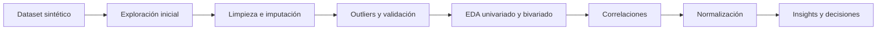

# Exploración, limpieza, visualización e insights de datos con Python (Actividad 8)

**Curso:** Diseño de Soluciones con IA (ISIL, 2026-1)  
**Docente:** Omar David Visitación Romero  
**Fecha:** 30/05/2026

---

## 1. Contexto o problema

La empresa ficticia **ShopSmart Retail Analytics** necesita entender mejor el comportamiento de sus clientes en e-commerce.

El problema no es solo técnico. La gerencia quiere responder preguntas de negocio concretas:

- qué clientes gastan más;
- qué señales anticipan abandono;
- qué variables están realmente relacionadas;
- qué datos deben limpiarse antes de entrenar un modelo.

La solución de esta actividad sigue el flujo completo del laboratorio:

1. Construir un dataset sintético de 1,500 clientes.
2. Simular problemas de calidad de datos.
3. Limpiar e imputar valores faltantes.
4. Detectar outliers y validar reglas de negocio.
5. Analizar distribuciones, relaciones y correlaciones.
6. Traducir el análisis en insights, recomendaciones y una conclusión ejecutiva.



## 2. Desarrollo / análisis

### 2.1 Términos clave del laboratorio

| Término | Qué es | Aplicación en esta actividad |
| --- | --- | --- |
| **Dataset sintético** | Conjunto de datos generado artificialmente con reglas controladas. | Permite practicar análisis sin depender de datos reales sensibles. |
| **DataFrame** | Tabla de `pandas` con filas y columnas. | Es la estructura central del laboratorio. |
| **EDA** | Análisis Exploratorio de Datos. | Sirve para entender distribución, calidad y relaciones antes de modelar. |
| **Imputación** | Reemplazo de valores faltantes con una regla estadística. | Se usó media, mediana y moda según el tipo de variable. |
| **Outlier** | Valor atípico o extremo. | Se detectó con boxplot e IQR para `Ingreso_Mensual`. |
| **Correlación** | Medida de relación lineal entre dos variables. | Se usó para ver qué variables se asocian más con `Gasto_Mensual`. |
| **Normalización** | Escalar variables a un rango común. | Se aplicó Min-Max para dejar variables entre 0 y 1. |
| **Insight** | Hallazgo útil que sugiere acción. | No basta con decir un número; debe explicar qué hacer con él. |
| **Storytelling con datos** | Convertir análisis en narrativa ejecutiva. | Ayuda a que negocio entienda problema, evidencia, impacto y acción. |

### 2.2 Fórmulas aplicadas y qué significan

#### a. Distribuciones usadas para construir el dataset

Los ingresos se generan con distribución normal:

$$
Ingreso\_Mensual \sim N(4500, 1800^2)
$$

Esto significa que los ingresos se concentran alrededor de 4,500, con una dispersión típica de 1,800.

Las compras mensuales se generan con distribución de Poisson:

$$
Compras\_Mes \sim Poisson(4)
$$

Esto significa que el número esperado de compras por cliente es 4 por mes.

Para evitar ingresos imposibles se aplica un recorte:

$$
Ingreso\_Ajustado = \min(\max(Ingreso, 900), 15000)
$$

> **Idea clave:** `np.clip()` fuerza a que el dato quede dentro de un rango realista. En este caso, ningún ingreso puede ser menor a 900 ni mayor a 15,000.

#### b. Regla de negocio para gasto y abandono

El gasto mensual se genera así:

$$
Gasto\_Mensual = 0.28 \cdot Ingreso + 140 \cdot Compras + 4 \cdot Tiempo\_Web + 9 \cdot Score\_Fidelidad + \varepsilon
$$

donde el ruido aleatorio sigue:

$$
\varepsilon \sim N(0, 700^2)
$$

La regla de abandono es directa:

$$
Abandono =
\begin{cases}
\text{Si}, & \text{si } Score\_Fidelidad < 40 \\
\text{No}, & \text{si } Score\_Fidelidad \geq 40
\end{cases}
$$

Esto modela una lógica simple: menor fidelidad implica mayor riesgo de churn.

#### c. Fórmulas estadísticas usadas en la limpieza y el análisis

Media:

$$
\bar{x} = \frac{1}{n} \sum_{i=1}^{n} x_i
$$

La media se usó para imputar `Ingreso_Mensual`.

Asimetría o skewness:

$$
Skew = \frac{\frac{1}{n}\sum_{i=1}^{n}(x_i - \bar{x})^3}{s^3}
$$

Curtosis:

$$
Kurtosis = \frac{\frac{1}{n}\sum_{i=1}^{n}(x_i - \bar{x})^4}{s^4} - 3
$$

Rango intercuartílico:

$$
IQR = Q_3 - Q_1
$$

Límites para detectar outliers:

$$
LI = Q_1 - 1.5 \cdot IQR
$$

$$
LS = Q_3 + 1.5 \cdot IQR
$$

Correlación de Pearson:

$$
r = \frac{\sum_{i=1}^{n}(x_i - \bar{x})(y_i - \bar{y})}{\sqrt{\sum_{i=1}^{n}(x_i - \bar{x})^2} \cdot \sqrt{\sum_{i=1}^{n}(y_i - \bar{y})^2}}
$$

Normalización Min-Max:

$$
x' = \frac{x - x_{min}}{x_{max} - x_{min}}
$$

#### d. Cuadro de símbolos

| Símbolo | Significado |
| --- | --- |
| **$N(\mu, \sigma^2)$** | Distribución normal con media $\mu$ y varianza $\sigma^2$ |
| **$\mu$** | Media poblacional |
| **$\sigma$** | Desviación estándar |
| **$\lambda$** | Frecuencia esperada en una distribución de Poisson |
| **$\varepsilon$** | Ruido aleatorio |
| **$n$** | Número de observaciones |
| **$x_i$** | Valor individual de una observación |
| **$\bar{x}$, $\bar{y}$** | Media de la variable $x$ o $y$ |
| **$s$** | Desviación estándar muestral |
| **$Q_1$** | Primer cuartil |
| **$Q_3$** | Tercer cuartil |
| **$IQR$** | Rango intercuartílico |
| **$LI$, $LS$** | Límite inferior y superior para outliers |
| **$r$** | Coeficiente de correlación de Pearson |
| **$x'$** | Valor normalizado |

### 2.3 Construcción del dataset sintético

Código base del laboratorio:

```python
import pandas as pd
import numpy as np

np.random.seed(2026)
clientes = 1500

edad = np.random.randint(18, 65, clientes)
ingreso = np.random.normal(4500, 1800, clientes)
ingreso = np.clip(ingreso, 900, 15000)
tiempo_web = np.random.randint(5, 240, clientes)
compras_mes = np.random.poisson(4, clientes)
score_fidelidad = np.random.randint(1, 101, clientes)

gasto = (
    ingreso * 0.28 +
    compras_mes * 140 +
    tiempo_web * 4 +
    score_fidelidad * 9 +
    np.random.normal(0, 700, clientes)
)

abandono = np.where(score_fidelidad < 40, "Si", "No")
```

Variables generadas:

| Variable | Qué representa |
| --- | --- |
| **Cliente_ID** | Identificador único del cliente |
| **Edad** | Edad del cliente |
| **Ingreso_Mensual** | Ingreso económico estimado |
| **Gasto_Mensual** | Gasto promedio calculado con regla sintética |
| **Tiempo_Web** | Tiempo de navegación |
| **Compras_Mes** | Frecuencia mensual de compra |
| **Score_Fidelidad** | Índice de lealtad del cliente |
| **Campaña_Email** | Si abrió o no campañas de email |
| **Categoria_Favorita** | Categoría preferida |
| **Abandono** | Riesgo de churn según la regla del laboratorio |

### 2.4 Exploración inicial del dataset

Código usado:

```python
df.shape
df.info()
df.describe()
df.skew(numeric_only=True)
df.kurtosis(numeric_only=True)
```

Resultados principales del dataset ya construido:

| Indicador | Resultado | Lectura rápida |
| --- | ---: | --- |
| **Tamaño del dataset** | 1,500 filas x 10 columnas | Hay suficiente volumen para practicar EDA y segmentación básica. |
| **Edad promedio** | 40.80 | Segmento adulto, relativamente equilibrado entre 18 y 64 años. |
| **Ingreso promedio** | 4,490.59 | El centro del poder adquisitivo está en un nivel medio. |
| **Gasto promedio** | 2,791.80 | El gasto está influido por ingreso, compras, navegación y fidelidad. |
| **Tiempo web promedio** | 120.35 minutos | Hay interacción digital considerable. |
| **Compras promedio** | 3.98 al mes | El comportamiento esperado sí coincide con la Poisson de $\lambda = 4$. |
| **Score de fidelidad promedio** | 50.81 | La base está dividida casi a la mitad entre clientes tibios y leales. |
| **Skew de ingresos** | 0.0599 | Distribución casi simétrica. |
| **Skew de gasto** | -0.0449 | También casi simétrica. |
| **Skew de compras** | 0.4229 | Hay una cola moderada hacia clientes que compran más veces. |

Interpretación de forma de distribución:

- **Skew cercano a 0**: la variable es bastante balanceada.
- **Skew positivo**: hay cola hacia la derecha; algunos clientes compran más que la mayoría.
- **Kurtosis negativa** en edad, ingresos y score: la distribución es algo más plana que una normal perfecta.
- **Kurtosis ligeramente positiva** en `Compras_Mes` (0.1164): existen algunos casos relativamente extremos, pero no de manera severa.

> **Hallazgo técnico importante:** `Gasto_Mensual` tiene un mínimo de **-45.53**. En negocio esto no tiene sentido. El ruido aleatorio generó 2 registros con gasto negativo (0.13 % del total), por lo que en un caso real habría que aplicar una validación adicional como `clip(lower=0)`.

### 2.5 Limpieza e imputación de valores faltantes

El laboratorio inserta valores faltantes de forma intencional:

```python
df.loc[10:30, 'Ingreso_Mensual'] = np.nan
df.loc[50:60, 'Tiempo_Web'] = np.nan
df.loc[100:110, 'Compras_Mes'] = np.nan
```

Cantidad de nulos detectados:

| Variable | Nulos antes | Técnica aplicada | Valor usado | Nulos después |
| --- | ---: | --- | ---: | ---: |
| **Ingreso_Mensual** | 21 | Media | 4,490.59 | 0 |
| **Tiempo_Web** | 11 | Mediana | 118 | 0 |
| **Compras_Mes** | 11 | Moda | 4 | 0 |

Código de imputación:

```python
df['Ingreso_Mensual'].fillna(df['Ingreso_Mensual'].mean(), inplace=True)
df['Tiempo_Web'].fillna(df['Tiempo_Web'].median(), inplace=True)
df['Compras_Mes'].fillna(df['Compras_Mes'].mode()[0], inplace=True)
```

Por qué se eligió cada técnica:

- **Media para ingreso:** conserva la tendencia central de una variable casi simétrica.
- **Mediana para tiempo web:** es más robusta si aparecen extremos.
- **Moda para compras:** al ser una frecuencia discreta, la categoría más repetida es una imputación razonable.

Resultado:

- Se resolvieron **43 valores faltantes**.
- No se perdió ninguna fila del dataset.
- La base quedó lista para análisis sin sacrificar cobertura de clientes.

### 2.6 Detección de outliers con IQR

Código usado:

```python
Q1 = df['Ingreso_Mensual'].quantile(0.25)
Q3 = df['Ingreso_Mensual'].quantile(0.75)
IQR = Q3 - Q1

limite_inferior = Q1 - 1.5 * IQR
limite_superior = Q3 + 1.5 * IQR

outliers = df[
    (df['Ingreso_Mensual'] < limite_inferior) |
    (df['Ingreso_Mensual'] > limite_superior)
]
```

Resultados reales:

| Métrica | Valor |
| --- | ---: |
| **$Q_1$** | 3,340.27 |
| **$Q_3$** | 5,642.45 |
| **$IQR$** | 2,302.18 |
| **Límite inferior** | -113.01 |
| **Límite superior** | 9,095.72 |
| **Outliers detectados** | 4 |

Interpretación:

- El límite inferior es negativo, pero los ingresos ya fueron recortados a 900, así que el riesgo práctico está en el extremo alto.
- Solo **4 clientes** quedaron por encima del umbral superior.
- Eso representa apenas **0.27 %** de la base.

En un negocio real, esos outliers podrían significar:

- clientes premium de muy alto valor;
- registros mal capturados;
- transacciones corporativas atípicas.

Por eso, el mejor criterio no es eliminar automáticamente, sino **investigar primero**.

### 2.7 Análisis univariado, bivariado y correlaciones

Código base del análisis visual:

```python
sns.histplot(df['Ingreso_Mensual'], bins=30, kde=True)
sns.boxplot(x=df['Ingreso_Mensual'])

sns.scatterplot(
    x=df['Ingreso_Mensual'],
    y=df['Gasto_Mensual'],
    hue=df['Abandono']
)

correlacion = df.corr(numeric_only=True)
sns.heatmap(correlacion, annot=True, cmap='coolwarm')
```

Correlaciones más relevantes con `Gasto_Mensual`:

| Variable | Correlación con gasto | Interpretación |
| --- | ---: | --- |
| **Ingreso_Mensual** | 0.4743 | Es la relación más fuerte; a mayor ingreso, mayor gasto esperado. |
| **Compras_Mes** | 0.3306 | La frecuencia de compra sí mueve el ticket mensual. |
| **Score_Fidelidad** | 0.2635 | La lealtad aporta al valor económico, aunque menos que ingreso y compras. |
| **Tiempo_Web** | 0.2544 | Más tiempo navegando se asocia con mayor gasto, pero no de forma dominante. |
| **Edad** | -0.0040 | Prácticamente no explica el gasto en este dataset. |

Lecturas de negocio:

- **Ingreso** es el mejor predictor lineal del gasto dentro de este ejercicio.
- **Compras** y **fidelidad** aportan señal operativa accionable.
- **Edad** y `Cliente_ID` no deberían priorizarse para segmentación comercial en este caso.

Además, el comportamiento por abandono refuerza la lógica del dataset:

| Indicador | Clientes que no abandonan | Clientes con abandono |
| --- | ---: | ---: |
| **Porcentaje de clientes** | 61.67 % | 38.33 % |
| **Gasto promedio** | 2,972.22 | 2,501.56 |
| **Compras promedio** | 4.03 | 3.89 |
| **Tiempo web promedio** | 119.16 | 122.27 |

Interpretación:

- Los clientes con abandono gastan **470.66 menos** al mes en promedio.
- La caída equivale a aproximadamente **15.8 %** frente al grupo retenido.
- El tiempo web por sí solo no evita el churn; la fidelidad sí es la variable decisiva porque el abandono fue definido por esa regla.

### 2.8 Normalización

Código del laboratorio:

```python
from sklearn.preprocessing import MinMaxScaler

scaler = MinMaxScaler()
df[['Ingreso_Mensual', 'Gasto_Mensual', 'Tiempo_Web']] = scaler.fit_transform(
    df[['Ingreso_Mensual', 'Gasto_Mensual', 'Tiempo_Web']]
)
```

Qué logra esta transformación:

- deja todas las variables en escala **0 a 1**;
- evita que una variable con números grandes domine a otra en modelos sensibles a escala;
- facilita comparar patrones entre variables heterogéneas.

Resultado esperado del escalamiento:

| Variable | Mínimo normalizado | Máximo normalizado |
| --- | ---: | ---: |
| **Ingreso_Mensual** | 0.0000 | 1.0000 |
| **Gasto_Mensual** | 0.0000 | 1.0000 |
| **Tiempo_Web** | 0.0000 | 1.0000 |

> **Nota práctica:** aunque el notebook propone `MinMaxScaler`, la fórmula matemática es la misma incluso si se implementa manualmente.

## 3. Resultados o hallazgos

### 3.1 Cinco insights accionables

1. **Los ingresos son la señal más fuerte del gasto.**
   Evidencia: `Ingreso_Mensual` tiene la mayor correlación con `Gasto_Mensual` (**0.4743**).  
   Lectura de negocio: conviene diseñar segmentación premium y ofertas diferenciadas por capacidad económica.

2. **La frecuencia de compra y la fidelidad explican valor recurrente.**
   Evidencia: `Compras_Mes` correlaciona **0.3306** y `Score_Fidelidad` **0.2635** con el gasto.  
   Lectura de negocio: programas de lealtad y recompra sí pueden elevar el ticket mensual.

3. **El churn destruye valor económico de forma visible.**
   Evidencia: clientes retenidos gastan **2,972.22**, mientras que los de abandono gastan **2,501.56**.  
   Lectura de negocio: prevenir abandono no solo conserva clientes; también protege ingreso mensual.

4. **La base requiere gobernanza de calidad, no solo visualización.**
   Evidencia: se detectaron **43 nulos** y **2 registros con gasto negativo**.  
   Lectura de negocio: si estos errores pasan a un modelo, el sistema aprenderá patrones incorrectos.

5. **La variable de email, por sí sola, no muestra señal de negocio sólida.**
   Evidencia: el gasto promedio entre quienes abrieron y no abrieron campaña es muy parecido (**2,786.15 vs 2,803.54**).  
   Lectura de negocio: hace falta enriquecer campañas con más atributos, como tipo de mensaje, momento de envío, canal y conversión.

### 3.2 Tres recomendaciones

1. **Crear un segmento premium** usando ingreso, gasto y fidelidad para personalizar promociones de mayor valor.
2. **Activar alertas tempranas de churn** cuando `Score_Fidelidad` baje de 40 o el gasto mensual caiga de manera sostenida.
3. **Fortalecer reglas de calidad de datos** antes de modelar: imputación controlada, validación de valores negativos y revisión manual de outliers de alto ingreso.

### 3.3 Aclaración del punto 12: storytelling con datos

El **punto 12** no pide repetir gráficos ni volver a calcular métricas. Pide **contar una historia de negocio con base en el análisis**.

La lógica es esta:

| Elemento | Qué responde | Cómo se aplica aquí |
| --- | --- | --- |
| **Problema** | ¿Qué situación preocupa a la empresa? | ShopSmart no entiende bien qué clientes generan más valor ni qué señales anticipan abandono. |
| **Hallazgo** | ¿Qué descubrió el análisis? | Ingreso, compras y fidelidad explican buena parte del gasto; además, los clientes con abandono gastan menos. |
| **Evidencia** | ¿Qué dato o gráfico respalda el hallazgo? | Correlación de `Ingreso_Mensual` con `Gasto_Mensual` = **0.4743** y diferencia de gasto promedio entre clientes retenidos y en abandono = **470.66**. |
| **Impacto** | ¿Qué riesgo u oportunidad de negocio existe? | Si no se actúa, la empresa pierde clientes con valor económico y desperdicia campañas poco segmentadas. |
| **Acción** | ¿Qué decisión concreta debería tomar la empresa? | Segmentar clientes premium y crear alertas tempranas de churn basadas en fidelidad y caída del gasto. |

#### Ejemplo redactado como storytelling ejecutivo

**Problema:** ShopSmart observa baja personalización en sus campañas y dificultad para anticipar qué clientes dejarán de comprar.

**Hallazgo:** El análisis muestra que el gasto mensual está más asociado con el ingreso, la frecuencia de compra y el score de fidelidad. También se observa que los clientes con abandono tienen un gasto promedio menor que los clientes retenidos.

**Evidencia:** La correlación entre `Ingreso_Mensual` y `Gasto_Mensual` es **0.4743**, la más alta entre las variables analizadas. Además, los clientes retenidos registran un gasto promedio de **2,972.22**, frente a **2,501.56** en los clientes con abandono.

**Impacto:** Esto sugiere que la empresa no solo está perdiendo clientes, sino también ingreso recurrente. Si no diferencia a sus clientes de alto valor ni detecta señales tempranas de fuga, seguirá invirtiendo campañas de forma poco precisa.

**Acción:** Se recomienda construir una estrategia comercial en dos frentes: campañas premium para clientes con mayor capacidad de gasto y un sistema de alerta de churn para clientes cuyo score de fidelidad sea bajo o cuyo gasto comience a caer.

> **Regla práctica:** en el punto 12, un buen storytelling siempre traduce un dato técnico en una decisión de negocio. Si el texto solo dice números, todavía no es storytelling.

## 4. Conclusiones

La actividad demuestra que el valor del análisis no está en producir gráficos, sino en convertir datos limpios en decisiones de negocio.

En esta solución se comprobó que:

- el dataset puede quedar listo para análisis sin perder registros gracias a la imputación;
- los outliers deben investigarse antes de eliminarse;
- ingreso, frecuencia de compra y fidelidad explican buena parte del gasto;
- la calidad del dato sigue siendo un requisito previo para cualquier proyecto serio de IA.

**Conclusión ejecutiva:** ShopSmart debería priorizar una estrategia doble: segmentación de clientes de alto valor y prevención de abandono en clientes de baja fidelidad. Técnicamente, el siguiente paso no es entrenar un modelo de inmediato, sino consolidar reglas de calidad y enriquecer variables de campaña para que los insights sean más confiables y accionables.

## 5. Fuentes

Las explicaciones y fórmulas de este documento se apoyan en el material del laboratorio y en documentación oficial de las librerías usadas.
Tipo: **Oficial** = publicado por el curso o por la herramienta.

### Material base del laboratorio

| # | Fuente | Tipo | URL |
| --- | --- | --- | --- |
| 1 | ISIL. *Actividad sesión 8: Exploración, limpieza, visualización e insights de datos con Python* | Oficial | [Documento base](./ACTIVIDAD%20SESIÓN%208.docx) |

### Librerías y métodos usados

| # | Fuente | Tipo | URL |
| --- | --- | --- | --- |
| 2 | NumPy. *numpy.random.normal* | Oficial | [Ver documentación](https://numpy.org/doc/stable/reference/random/generated/numpy.random.normal.html) |
| 3 | NumPy. *numpy.random.poisson* | Oficial | [Ver documentación](https://numpy.org/doc/stable/reference/random/generated/numpy.random.poisson.html) |
| 4 | pandas. *DataFrame.describe* | Oficial | [Ver documentación](https://pandas.pydata.org/docs/reference/api/pandas.DataFrame.describe.html) |
| 5 | pandas. *DataFrame.fillna* | Oficial | [Ver documentación](https://pandas.pydata.org/docs/reference/api/pandas.DataFrame.fillna.html) |
| 6 | pandas. *DataFrame.corr* | Oficial | [Ver documentación](https://pandas.pydata.org/docs/reference/api/pandas.DataFrame.corr.html) |
| 7 | seaborn. *heatmap* | Oficial | [Ver documentación](https://seaborn.pydata.org/generated/seaborn.heatmap.html) |
| 8 | scikit-learn. *MinMaxScaler* | Oficial | [Ver documentación](https://scikit-learn.org/stable/modules/generated/sklearn.preprocessing.MinMaxScaler.html) |

*Última verificación de fuentes: 30/05/2026.*
