# Fundamentos de Machine Learning y Elección del Modelo Correcto en IA

**Código de Clase:** 40098  
**Curso:** Diseño de Soluciones con IA  
**Clase:** 10  
**Tema:** Fundamentos de Machine Learning + Selección del Modelo Correcto  
**Profesor:** Omar David Visitación Romero  
**Fecha:** Semana 10  

---

## 📌 Introducción: ¿Qué es un Modelo de IA?

### Concepto Fundamental

Un **modelo de Inteligencia Artificial** es esencialmente un **algoritmo basado en ecuaciones matemáticas** que:

1. **Recibe una entrada (input):** Variables o datos que alimentan el modelo
2. **Procesa internamente:** Aplica operaciones matemáticas complejas
3. **Genera una salida (output):** Predicción, clasificación o recomendación esperada

**Fase Previa:** Antes de ser funcional, todo modelo pasa por una **fase de entrenamiento** donde:
- Se ajustan automáticamente los parámetros internos
- Se optimiza la precisión mediante iteraciones
- Aprende patrones de los datos históricos

### Principio de Funcionamiento

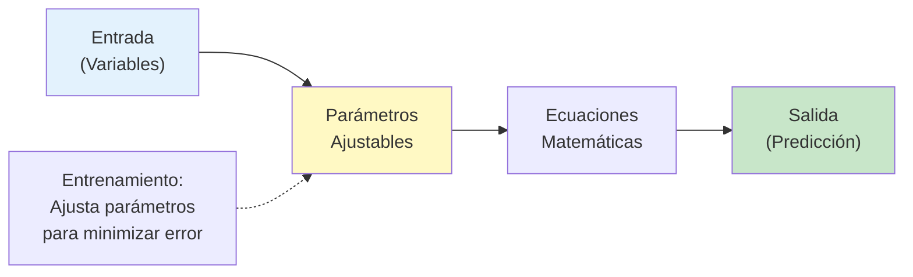

En Machine Learning no existe un modelo "mejor" para todos los casos. La elección correcta depende de:
- El tipo de problema (clasificación, regresión, clustering)
- La cantidad y calidad de datos disponibles
- Los recursos computacionales disponibles
- El nivel de interpretabilidad requerido
- La naturaleza de las variables de entrada

En esta clase aprenderemos **los fundamentos del aprendizaje automático** y a seleccionar el modelo más adecuado para cada situación.

---

## 1️⃣ Tres Metodologías Principales del Aprendizaje Automático

### A. Aprendizaje Supervisado 🏫

**Concepto:**
Se aplica cuando los **datos de entrenamiento están etiquetados**; es decir, el modelo conoce de antemano la respuesta correcta para cada dato de entrada. Se utiliza principalmente para **adelantarse a situaciones** o **categorizar elementos** en grupos ya conocidos.

**Analogía:** Un profesor que proporciona las respuestas correctas mientras el alumno aprende.

**Aplicaciones del Profesor:**

1. **Predicción/Pronóstico**
   - Anticipar la cotización de un producto en la bolsa de valores
   - Predecir variables climáticas (temperatura, precipitación pluvial) basándose en datos históricos
   - Estimar demanda de productos para el siguiente trimestre

2. **Clasificación de Créditos**
   - Una entidad financiera evalúa si un cliente califica ("Apto") o no ("No Apto") para un crédito
   - Variables: Salario, edad, historial de pagos, deudas actuales
   - Output: Decisión binaria de aprobación

3. **Filtro de Spam**
   - Un servidor de correos analiza las cabeceras y contenido de un email entrante
   - Clasifica como: "Spam" o "Correo Legítimo"
   - Se entrena con millones de ejemplos etiquetados previamente

**Algoritmos típicos:** Regresión Lineal, Regresión Logística, Árboles de Decisión, SVM, Redes Neuronales

---

### B. Aprendizaje No Supervisado 🔍

**Concepto:**
Se utiliza cuando **los datos no tienen etiquetas** y se desconocen los perfiles o grupos de salida. El modelo **no intenta predecir un resultado correcto**, sino **analizar la estructura matemática** de los datos para **descubrir patrones ocultos** o similitudes.

**Analogía:** Un explorador que descubre patrones en territorio desconocido sin mapa previo.

**Aplicaciones del Profesor:**

1. **Segmentación de Clientes (Clasterización/Agrupación)**
   
   **Escenario:** Un comercio recopila el historial de compras en crudo de miles de clientes (sin asignarles etiquetas previas)
   
   **Proceso:**
   - El algoritmo calcula las similitudes matemáticas en sus hábitos de consumo
   - Agrupa clientes con patrones similares
   
   **Ejemplo Concreto:**
   ```
   Si el Cliente A y el Cliente C compran:
   - Frecuentemente el "Producto 1" ✓
   - Casi nunca el "Producto 3" ✓
   
   → El modelo los agrupa en el MISMO CLUSTER
   → Les ofrece recomendaciones similares
   ```
   
   **Valor Empresarial:**
   - Ayuda a las empresas a dirigir mejor sus estrategias de mercado
   - Campañas de marketing personalizadas por cluster
   - Recomendaciones de productos más precisas
   - Identificar nichos de clientes desconocidos

**Algoritmos típicos:** K-Means, DBSCAN, Análisis Jerárquico, PCA

---

### C. Aprendizaje por Refuerzo 🎮

**Concepto:**
Una fase avanzada de entrenamiento orientada a **dotar de máxima precisión al modelo**. Introduce la figura de un **agente que interactúa con el entorno**.

**Mecanismo de Aprendizaje:**
- **Si el modelo genera una respuesta correcta:** Recibe una **recompensa** 🎁
- **Si se equivoca:** Recibe un **castigo** ⚠️
- El modelo aprende a **optimizar su comportamiento** a través del **ensayo y error**

**Analogía:** Entrenar a un perro: das premios por comportamiento correcto, castigos (regaños) por incorrecto

**Aplicaciones Reales:**
- Algoritmos de juegos (AlphaGo, Chess engines)
- Robótica autónoma
- Sistemas de recomendación adaptativos
- Conducción autónoma de vehículos

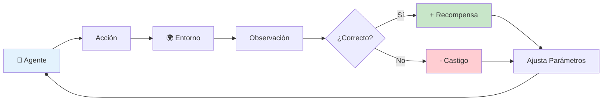

---

## ⚠️ DIFERENCIA CRÍTICA: Clasificación vs. Clasterización

El profesor **hace énfasis especial** en no confundir estos dos términos fundamentales:

### Tabla Comparativa

| Criterio | Clasificación (Supervisado) | Clasterización (No Supervisado) |
|----------|---------------------------|--------------------------------|
| **Conocimiento previo** | ✅ Los grupos/etiquetas ya están **previamente definidos** y se conocen sus parámetros específicos | ❌ Se **desconoce por completo** a qué perfiles o cuántos grupos van a pertenecer los objetos |
| **Ejemplos de etiquetas** | Spam/No Spam, Apto/No Apto, Gato/Perro/Pájaro | *No hay etiquetas* — el modelo las descubre |
| **Acción del modelo** | **Asigna** un nuevo elemento a una de las categorías **ya existentes** | El modelo **junta** los elementos de manera individual basándose puramente en **similitud matemática** |
| **Pregunta que responde** | ¿A cuál de mis categorías conocidas pertenece este objeto? | ¿Cuáles elementos son similares entre sí? |
| **Ejemplo práctico** | ¿Es este email Spam o Legítimo? | ¿Cuáles clientes tienen hábitos de compra similares? |
| **Precisión evaluable** | ✅ Sí — podemos comparar contra etiquetas reales | ⚠️ Compleja — no hay "respuesta correcta" |

### Visualización Conceptual

#### Decisión: ¿Clasificación o Clasterización?

```
           ¿Tengo etiquetas de lo que busco?
                        |
         _______________|_______________
        |                               |
       SÍ                              NO
        |                               |
        v                               v
   🎯 CLASIFICACIÓN              🔍 CLASTERIZACIÓN
   (Supervisado)                 (No Supervisado)
        |                               |
   ✓ Asigna a categorías         ✓ Descubre grupos
     conocidas                      naturales
   ✓ Predice clases              ✓ Agrupa por
     definidas                      similitud
   ✓ Compara contra              ✓ Sin respuesta
     verdad conocida                'correcta'
        |                               |
   Ej: ¿Es spam?               Ej: Agrupar clientes
   Respuesta: SÍ o NO          Resultado: Clusters
                                automáticos
```

#### Ejemplo Práctico

| Pregunta | Tipo | Respuesta |
|----------|------|-----------|
| **¿Es este email spam o legítimo?** | Clasificación | SÍ es spam / NO es legítimo |
| **¿Este cliente es apto para crédito?** | Clasificación | SÍ es apto / NO es riesgoso |
| **¿Cuáles clientes tienen hábitos similares?** | Clasterización | Cluster A, Cluster B, Cluster C |
| **¿Qué tipos de imágenes tengo?** | Clasterización | Agrupa automáticamente por similitud |

---

## 1️⃣ Fundamentos y Clasificación de Modelos

### Tipos de Aprendizaje Automático

```
                 Aprendizaje Automático
                           |
          _________________|_________________
         |                 |                 |
      Supervisado      No Supervisado   Por Refuerzo
         |                 |                 |
    • Datos          • Sin etiquetas      • Prueba y
      etiquetados    • Descubre             error
    • Profesor         patrones          • Recompensas
      corrige        • Grupos              y castigos
                       naturales
```

### Tareas Principales

| Tarea | Descripción | Ejemplo |
|-------|-------------|---------|
| **Clasificación** | Predecir categorías discretas | ¿Email es spam o no? |
| **Regresión** | Predecir valores continuos | Estimar precio de una casa |
| **Clustering** | Agrupar datos similares | Segmentación de clientes |

### Caja Blanca vs. Caja Negra

#### Tabla Comparativa

| Aspecto | 🔓 Caja Blanca | 🔐 Caja Negra |
|--------|---|---|
| **Modelos** | Árboles de Decisión, Modelos Lineales | Redes Neuronales, Ensambles |
| **Interpretabilidad** | ✅ Excelente | ❌ Muy baja |
| **Explicabilidad** | ✅ Fácil explicar decisiones | ❌ Difícil entender por qué |
| **Precisión** | ⭐⭐⭐ Media | ⭐⭐⭐⭐⭐ Muy Alta |
| **Velocidad** | ⚡ Rápido | 🐢 Lento |
| **Requisitos** | CPU básica | GPU recomendada |
| **Mejor para** | Alto riesgo (finanzas, medicina) | Alta complejidad (visión, NLP) |

#### Trade-off: Interpretabilidad vs Precisión

```
Caja Blanca (Árbol)          Caja Negra (Red Neuronal)
┌─────────────────┐          ┌─────────────────┐
│ Precisión: 87%  │          │ Precisión: 93%  │
│ Interpretable ✓ │          │ Caja negra ✗    │
│ Explico por qué │          │ No sé por qué   │
└─────────────────┘          └─────────────────┘
      ↓                             ↓
   CLARO                       PRECISO
   SIMPLE                      COMPLEJO
```

#### Guía de Decisión

- **Contexto de Alto Riesgo** (medicina, créditos, legal)
  → Preferir **Caja Blanca** (necesito explicar decisiones)

- **Contexto de Alta Complejidad** (imágenes, lenguaje, patrones ocultos)
  → Preferir **Caja Negra** (precisión más importante que explicabilidad)

---

## 2️⃣ Modelos Básicos

### Regresión Lineal

**Propósito:** Predecir valores continuos asumiendo relación lineal

**Ecuación Fundamental:**

$$y = mx + b$$

Donde:
- $y$ = Variable dependiente (a predecir)
- $x$ = Variable independiente (dato de entrada)
- $m$ = Pendiente de la recta
- $b$ = Intercepto (punto donde cruza eje Y)

**Ejemplo Numérico del Profesor:**

Si el algoritmo durante el entrenamiento calcula que:
- $m = 4$ (pendiente)
- $b = 1$ (intercepto)

Entonces la ecuación es: $y = 4x + 1$

**Predicción:**
Al ingresar una entrada de $x = 5$:
$$y = 4(5) + 1 = 20 + 1 = 21$$

El modelo predice con **certeza matemática** una salida de $y = 21$

**Aplicaciones Reales:**
- Predecir precio de vivienda según metros cuadrados
- Estimar ventas según inversión en publicidad
- Pronosticar temperatura basándose en datos históricos

**Ventajas:** 
- ✅ Simple de entender y explicar
- ✅ Rápido de entrenar
- ✅ Bajo consumo computacional

**Desventajas:** 
- ✗ Solo funciona con relaciones lineales
- ✗ Sensible a outliers (valores extremos)

---

### Regresión Logística (Clasificación)

**Propósito:** Clasificación binaria (sí/no, 0/1)

**Función Sigmoide:** Limita predicciones entre 0 y 1 (probabilidad)

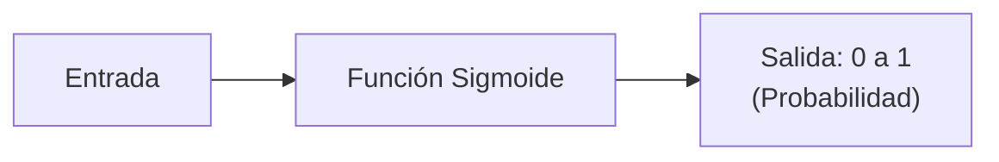

**Ejemplo Real:**
- ¿Aprobará el cliente el crédito? (0 o 1)
- ¿Tiene diabetes el paciente? (Sí o No)

---

### Árboles de Decisión

**Propósito:** Partición de datos mediante preguntas binarias (sí/no) en ramificaciones sucesivas

**Estructura y Funcionamiento:**

Un árbol evalúa reglas sucesivas mediante ramificaciones:

```
                    Regla 1
                ¿Salario > 3,000?
                /             \
              Sí               No
             /                  \
        (Continúa)          (Denegado)
         |
      Regla 2
    ¿18-80 años?
     /        \
    Sí        No
   /          \
(Continúa)  (Denegado)
   |
Regla 3
¿Trabajador
Dependiente?
  /       \
 Sí       No
/         \
APROBADO  (Revisar)
```

**Ejemplo del Profesor: Evaluación de Crédito**

Para evaluar si se aprueba un crédito:

1. **Regla 1:** ¿El salario es mayor a 3,000 soles?
   - Si NO → Denegado (termina aquí)
   - Si SÍ → Continúa a la siguiente regla

2. **Regla 2:** ¿El cliente tiene entre 18 y 80 años?
   - Si NO → Denegado
   - Si SÍ → Continúa a la siguiente regla

3. **Regla 3:** ¿Es trabajador dependiente (registrado en SUNAT)?
   - Si NO → Revisar manualmente
   - Si SÍ → Aprobado ✓

**Ventajas:**
- ✅ Maneja variables numéricas Y categóricas automáticamente
- ✅ Cada camino es una regla explícita "si-entonces"
- ✅ Muy fácil de explicar a no técnicos (gerentes, clientes)
- ✅ Interpretabilidad total

**Desventajas:**
- ✗ Tendencia al sobreajuste si el árbol crece demasiado profundo
- ✗ Puede crear decisiones demasiado específicas a casos únicos

---

### KNN (K-Nearest Neighbors / Vecinos Más Cercanos)

**Propósito:** Clasificación basada en distancia geométrica en el espacio bidimensional (o multidimensional)

**Mecanismo:**

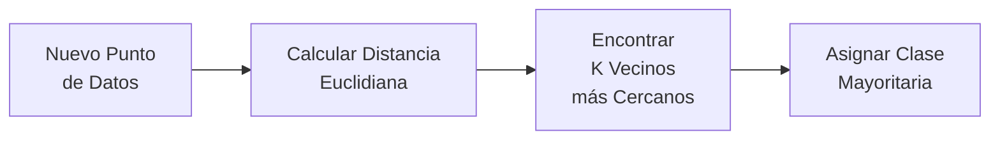

**Ejemplo Conceptual del Profesor:**

En un espacio 2D (coordenadas $x, y$):

```
Si dos componentes/clientes están muy cerca en el espacio:
  → Existe una relación fuerte
  → Se clasifican juntos

Si están alejados:
  → No comparten relación
  → Se clasifican en grupos distintos
```

**Aplicación Real:**
- Sistema de recomendación: "Productos similares a este"
- Clasificación de imágenes: "¿A qué objeto se parece?"
- Segmentación de usuarios: "¿Qué tipo de cliente eres?"

**Ventajas:**
- ✅ Simple de entender
- ✅ No requiere entrenamiento previo
- ✅ Flexible para múltiples dimensiones

**Desventajas:**
- ✗ Lento en predicción (debe calcular distancia a todos los puntos)
- ✗ Sensible a la escala de variables (requiere normalización)
- ✗ Consume mucha memoria con grandes datasets

---

### Redes Neuronales

**Inspiración:** Simula el funcionamiento del cerebro humano con capas de neuronas artificiales

**Arquitectura General:**

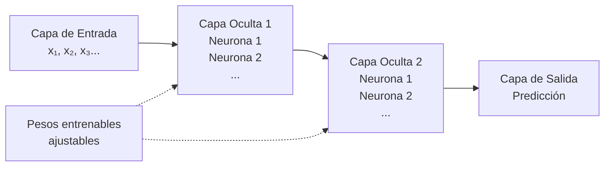

**Características:**
- ✅ Modelan relaciones **muy complejas y no lineales**
- ✅ Excelentes en visión por computadora (reconocimiento de imágenes)
- ✅ Excelentes en NLP (procesamiento de lenguaje natural)
- ✅ Pueden detectar patrones sutiles que otros modelos pierden
- ✗ Requieren **muchos datos** (miles o millones de registros)
- ✗ Requieren **alto poder computacional** (GPU recomendada)
- ✗ Son "cajas negras" — difíciles de interpretar

**Aplicaciones Reales del Profesor:**
- Clasificación de imágenes médicas (detectar tumores)
- Reconocimiento de voz y conversación
- Generación de texto (ChatGPT, modelos de lenguaje)
- Detección de fraudes en redes complejas

---

### Otros Modelos Básicos

| Modelo | Propósito | Ventajas | Desventajas |
|--------|----------|----------|------------|
| **K-NN** | Clasificación simple | Sin entrenamiento | Lento en predicción |
| **Naive Bayes** | Clasificación probabilística | Rápido, ideal para texto (spam) | Asume independencia |
| **SVM** | Separación óptima de clases | Funciona bien en altas dimensiones | Caja negra, lento |
| **Ensambles** (Random Forest, Boosting) | Combina múltiples modelos | Alta precisión | Menos interpretable |

---

## 🔧 Consideraciones Técnicas en el Desarrollo de IA

### 1. Ajuste y Control de Calidad de Datos

#### Limpieza de Datos

Antes de entrenar **cualquier algoritmo**, la data debe estar:

- ✅ **Limpia:** Sin valores duplicados o inconsistentes
- ✅ **Normalizada:** Variables en escala comparable
- ✅ **Escalada:** Evitar sesgos por magnitudes diferentes
- ✅ **Completa:** Valores faltantes imputados o eliminados

**Impacto:** Datos sucios → Predicciones erróneas → Decisiones costosas

#### Distribución de la Data (Regla 80/20)

Lo recomendable es usar:

```
80% de los datos para ENTRENAR el modelo
20% de los datos para VALIDAR en producción
```

**Razón:**
- El modelo aprende patrones del 80%
- El 20% verifica que funcione en casos reales desconocidos
- Evita medir precisión con los mismos datos usados para entrenar

---

### 2. Sobreajuste (Overfitting) vs. Subajuste (Underfitting)

#### Sobreajuste — El Modelo Memoriza

```
Si usas demasiada data para entrenar (ej: 95% o 99%):
  → El modelo memoriza esos datos específicos PERFECTAMENTE
  → PERO cuando recibe datos nuevos en producción:
     ✗ Es incapaz de generalizar
     ✗ Comete errores graves
```

**Analogía:** Un estudiante que memoriza todas las preguntas del examen pasado pero no entiende los conceptos.

#### Subajuste — El Modelo es Demasiado Simple

```
Si el modelo es muy simple (ej: una línea recta para datos complejos):
  → Subestima la complejidad del problema
  → No captura los patrones reales
  → Tiene baja precisión incluso en datos de entrenamiento
```

#### La Zona Ideal

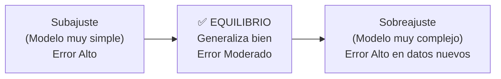

---

### 3. Sesgo vs. Varianza

| Concepto | Definición | Causa | Solución |
|----------|-----------|-------|----------|
| **Sesgo (Bias)** | Error sistemático del modelo | Entrenamiento con **pocos datos** | Usar más datos, modelo más complejo |
| **Varianza** | Sensibilidad a cambios en datos | **Sobreajuste**, modelo muy complejo | Regularización, menos complejidad |

**Visualización:**

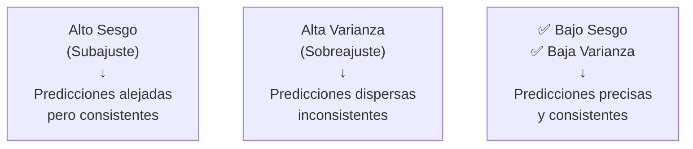

---

### 4. Regularización L1 y L2

**Propósito:** Herramientas matemáticas para reducir complejidad de un modelo y evitar sobreajuste

**Escenario del Profesor:**

```
Si tienes 40 atributos de entrada:

❌ Sin regularización:
   → El modelo intenta usar TODOS los 40 atributos
   → Muchos tienen impacto bajo o innecesario
   → Resultado: Sobreajuste

✅ Con Regularización L1/L2:
   → El modelo identifica que solo 30 atributos son importantes
   → Reduce la atención a los 10 menos útiles
   → Resultado: Modelo más simple, mejor generalización
```

**Diferencia L1 vs L2:**

| Tipo | Método | Efecto | Uso |
|------|--------|--------|-----|
| **L1** | Suma de valores absolutos | Lleva pesos a CERO (elimina variables) | Feature selection |
| **L2** | Suma de cuadrados | Reduce pesos gradualmente | Prevenir extremos |

---

### 5. Recursos Computacionales Necesarios

#### Modelos Básicos (Bajo Consumo)

```
✅ Regresión Lineal
✅ Árboles de Decisión
✅ KNN

Requisitos:
  - 8 GB de RAM comunes
  - Procesador estándar
  - Tiempo: segundos a minutos
```

#### Modelos Grandes (Alto Consumo) — LLMs

```
⚠️ Large Language Models (GPT, Gemini, etc.)

Requisitos si se descargan LOCALMENTE:
  - GPU dedicada (NVIDIA recomendado)
  - MÍNIMO 128 GB de RAM
  - Almacenamiento SSD grande
  - Tiempo: horas a días
  
Alternativa:
  - Usar APIs en la nube (OpenAI, Google Cloud)
  - No requiere hardware local
  - Pago por uso
```

**Consideración del Profesor:**
> "Para trabajar localmente con versiones medianamente complejas de modelos grandes de lenguaje, el profesor recomienda contar con soporte de GPUs dedicadas y un mínimo de 128 GB de RAM."

---

## 3️⃣ Criterios para Seleccionar el Modelo Correcto

### 1. Volumen de Datos vs. Complejidad

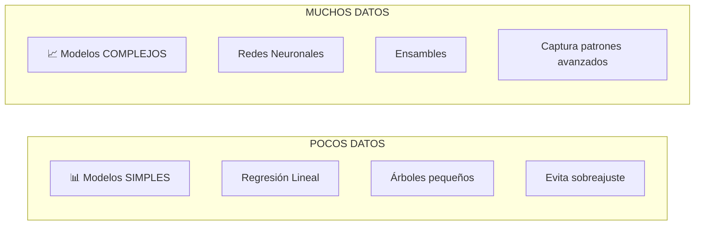

**Principio:** A menos datos → modelo más simple

---

### 2. Tipo de Variable

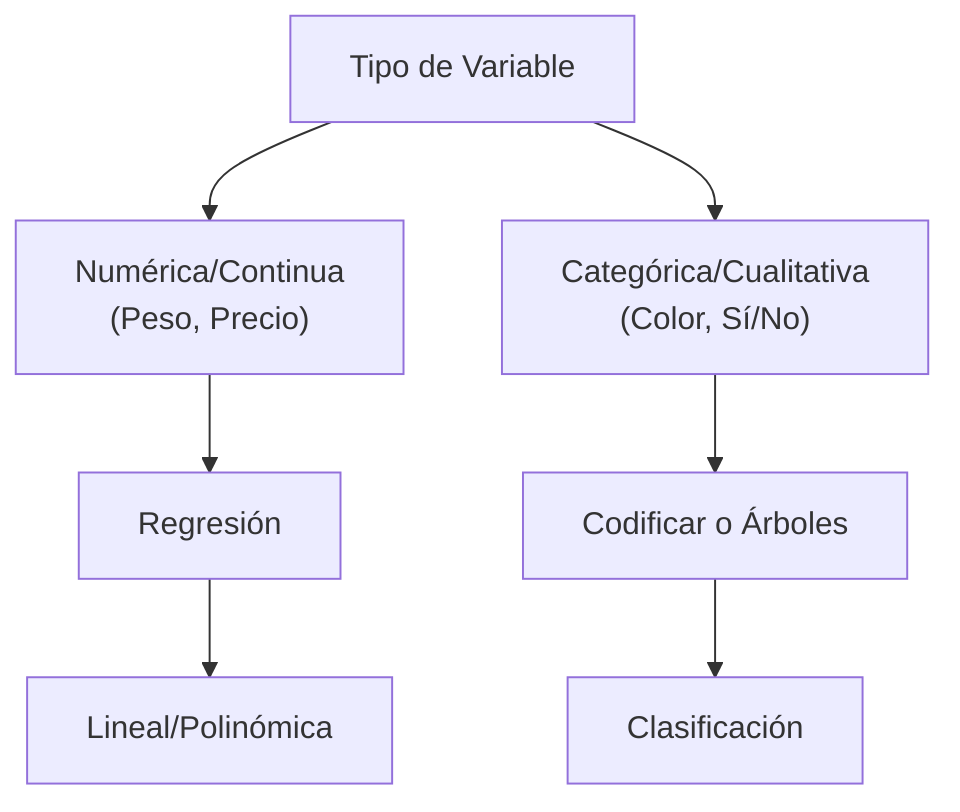

---

### 3. Naturaleza de los Datos

#### Datos Lineales
- ✓ Regresión Lineal
- ✓ Regresión Logística

#### Datos No Lineales
- ✓ Árboles de Decisión
- ✓ SVM con kernel
- ✓ Redes Neuronales

**Ejemplo:**
- **Lineal:** Precio de casa vs. metros cuadrados → Línea recta
- **No Lineal:** Clasificar imágenes → Relaciones complejas

---

### 4. Sobreajuste vs. Subajuste

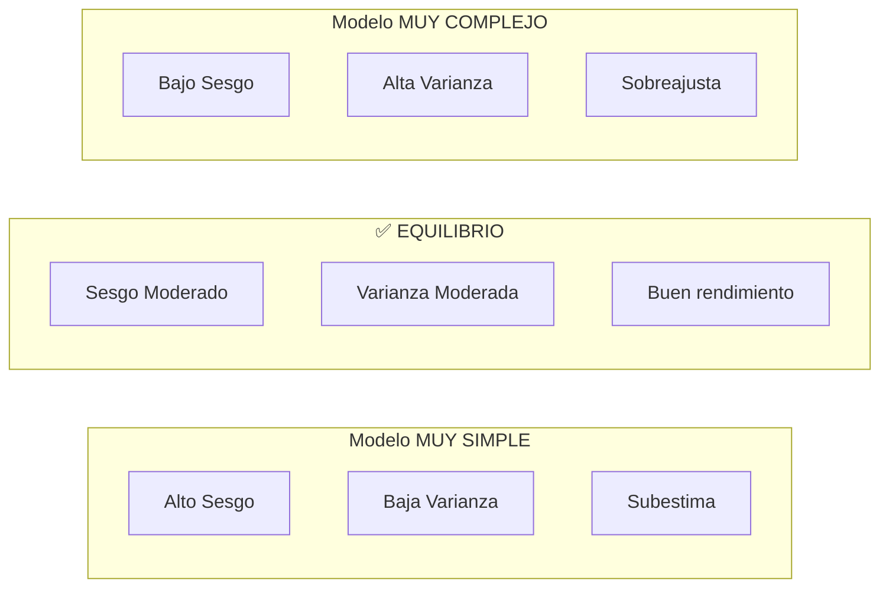

**Regularización:** Penaliza la complejidad
- L1/L2 en regresión
- Poda en árboles
- Dropout en redes neuronales

---

### 5. Estructura de los Datos

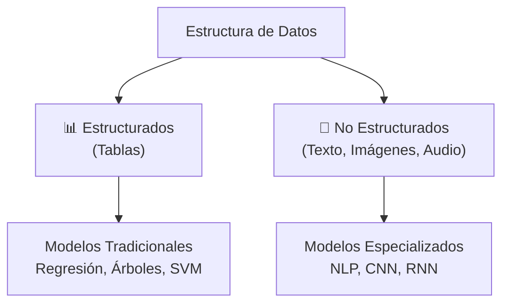

**Ejemplos:**
- **Estructurado:** Predecir ventas con variables de económicas
- **No Estructurado:** Análisis de sentimientos en redes sociales

---

### 6. Escala y Preprocesamiento

| Modelo | Requiere Normalizar | Notas |
|--------|-------------------|-------|
| Regresión Lineal | ❌ No necesario | Pero mejora convergencia |
| K-NN | ✅ Sí, obligatorio | Usa distancias |
| SVM | ✅ Sí, obligatorio | Kernel requiere escala |
| Redes Neuronales | ✅ Sí, muy importante | Acelera entrenamiento |
| Árboles de Decisión | ❌ No afectado | Invariante a escala |

---

### 7. Interpretabilidad vs. Precisión

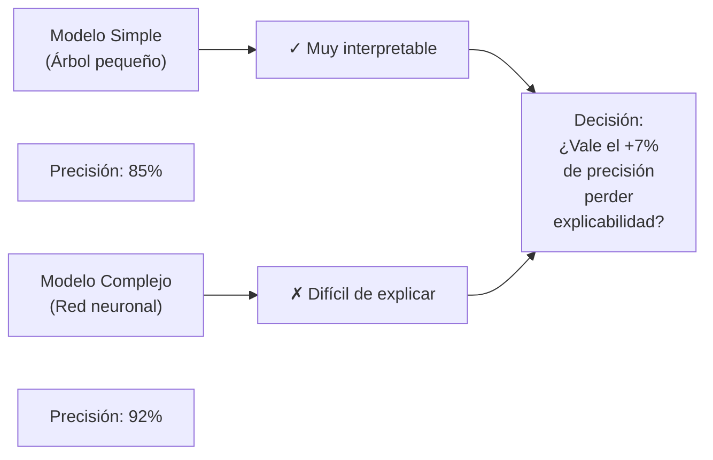

**Regla de Oro:** En áreas de alto riesgo (medicina, finanzas) → preferir interpretabilidad

---

### 8. Datos Desbalanceados

**Problema:** Clases con representación desigual (ej: 1% fraude, 99% legítimo)

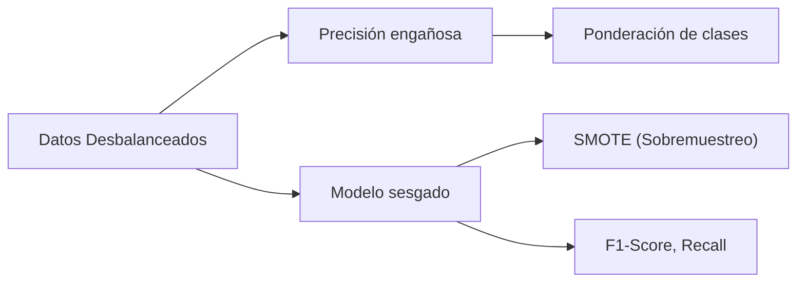

**Métrica correcta:** Usar F1-Score o Recall, no Precisión global

---

### 9. Recursos Computacionales

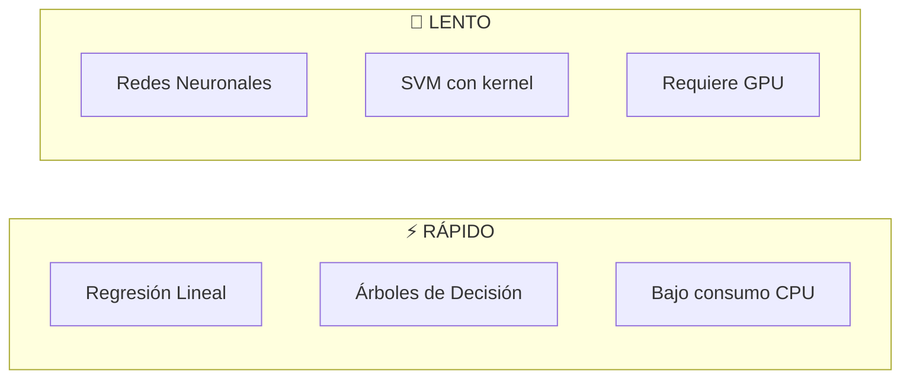

---

## 4️⃣ Caso Práctico: Detección de Fraude

**Contexto:** Banco necesita detectar transacciones fraudulentas en tiempo real

### Proceso

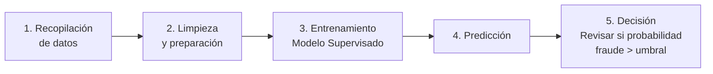

### Elección del Modelo

✓ **Redes Neuronales** (caso común en banca)
- Aprenden patrones complejos de fraude
- Detectan anomalías sutiles
- Requieren GPU pero resultado de alto valor

✓ **Alternativa:** Árbol de Decisión
- Si se requiere explicabilidad
- "Por qué esta transacción fue bloqueada"

### Resultado
- ✅ Automatiza detección
- ✅ Reduce errores humanos
- ✅ Procesa miles de transacciones/segundo

---

## 5️⃣ Evaluación y Métricas

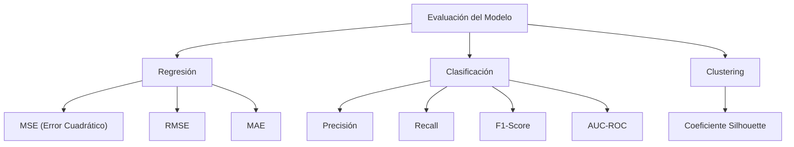

### Matriz de Confusión (Clasificación)

```
                Predicción
                Positivo  Negativo
Realidad  +     VP        FN
          -     FP        VN

VP = Verdaderos Positivos
FP = Falsos Positivos
FN = Falsos Negativos
VN = Verdaderos Negativos
```

**Métricas derivadas:**
- **Precisión:** VP / (VP + FP) → ¿De los predichos positivos, cuántos acertamos?
- **Recall:** VP / (VP + FN) → ¿De los positivos reales, cuántos encontramos?
- **F1-Score:** Promedio armónico de Precisión y Recall

---

## 6️⃣ Regla de Parsimonia

**Principio:** Si dos modelos tienen rendimiento similar, **elige el más simple**

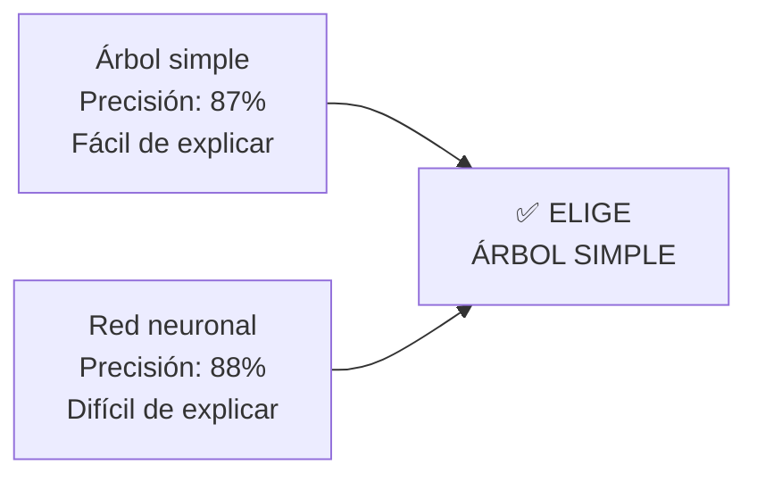

**Beneficios del modelo simple:**
- Más rápido de entrenar
- Menos recursos
- Más fácil de mantener
- Mejor explicabilidad

---

## 📊 Diagrama de Decisión: Seleccionar Modelo

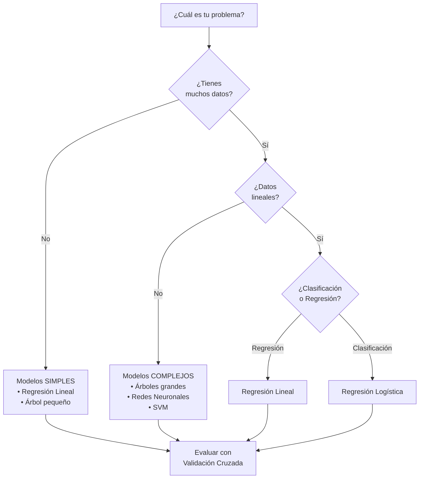

---

## 🎯 Resumen: Checklist para Elegir Modelo

- [ ] **Entender el problema:** ¿Clasificación, regresión o clustering?
- [ ] **Analizar los datos:** ¿Cuántos registros? ¿Tipos de variables?
- [ ] **Evaluar relaciones:** ¿Lineales o no lineales?
- [ ] **Considerar interpretabilidad:** ¿Necesito explicar el modelo?
- [ ] **Revisar recursos:** ¿CPU, memoria, tiempo disponibles?
- [ ] **Elegir el modelo más simple** que resuelva el problema
- [ ] **Validar con datos de prueba** o validación cruzada
- [ ] **Usar métricas apropiadas** según el tipo de problema
- [ ] **Iterar y mejorar** basado en resultados

---

## 📚 Conceptos Clave

| Concepto | Definición |
|----------|-----------|
| **Sobreajuste** | Modelo memoriza datos en lugar de aprender patrones |
| **Subajuste** | Modelo muy simple para capturar la complejidad |
| **Validación Cruzada** | Divide datos en grupos para evaluar generalización |
| **Regularización** | Penaliza complejidad para evitar sobreajuste |
| **Sesgo** | Error sistemático del modelo |
| **Varianza** | Sensibilidad a cambios en datos de entrenamiento |

---

##  Próxima Actividad Anunciada

El profesor subirá a la plataforma virtual un **ejercicio práctico** con escenarios cortos para que los alumnos:

✅ **Identifiquen qué tipo de aprendizaje aplicar:**
- Aprendizaje Supervisado
- Aprendizaje No Supervisado
- Aprendizaje por Refuerzo

✅ **Seleccionen la técnica correcta:**
- Clasificación (si es supervisado)
- Clasterización (si es no supervisado)

✅ **Justifiquen su elección** basándose en:
- Tipo de datos disponibles
- Objetivos del negocio
- Recursos computacionales
- Necesidad de interpretabilidad

**Plazo de Entrega:**
- Curso semivirtual → Entrega extendida
- Próxima semana durante la hora asíncrona

---

## 📚 Glosario de Términos Expandido

| Término | Definición |
|---------|-----------|
| **Aprendizaje Supervisado** | Técnica de ML donde el modelo aprende de datos etiquetados (con respuestas correctas conocidas) |
| **Aprendizaje No Supervisado** | Técnica de ML donde el modelo descubre patrones en datos sin etiquetar |
| **Aprendizaje por Refuerzo** | Técnica avanzada donde el modelo aprende mediante recompensas y castigos |
| **Clasificación** | Tarea supervisada que asigna datos a categorías predefinidas |
| **Clasterización** | Tarea no supervisada que agrupa datos similares sin categorías previas |
| **Modelo de IA** | Algoritmo basado en ecuaciones matemáticas que predice outputs a partir de inputs |
| **Entrenamiento** | Fase donde el modelo ajusta sus parámetros usando datos históricos |
| **Regresión Lineal** | Modelo que predice valores continuos usando relación lineal $y = mx + b$ |
| **Árboles de Decisión** | Modelo que clasifica usando reglas binarias ("si-entonces") |
| **KNN (K-Nearest Neighbors)** | Modelo que clasifica basado en distancia a vecinos más cercanos |
| **Redes Neuronales** | Modelos complejos inspirados en el cerebro con múltiples capas de neuronas |
| **Sobreajuste (Overfitting)** | Cuando el modelo memoriza datos de entrenamiento pero falla en datos nuevos |
| **Subajuste (Underfitting)** | Cuando el modelo es demasiado simple para capturar la complejidad real |
| **Sesgo (Bias)** | Error sistemático del modelo por entrenamiento con pocos datos |
| **Varianza** | Sensibilidad del modelo a cambios menores en datos de entrenamiento |
| **Regularización L1/L2** | Técnicas matemáticas para reducir complejidad y evitar sobreajuste |
| **Distribución 80/20** | Usar 80% de datos para entrenar, 20% para validar |
| **Validación Cruzada** | Técnica que divide datos en pliegues para evaluación robusta |
| **Normalización** | Transformación de variables a escala comparable (0-1 o media=0, std=1) |
| **Feature Selection** | Proceso de seleccionar atributos relevantes para el modelo |
| **Matriz de Confusión** | Tabla que compara predicciones vs realidad en clasificación |
| **Precisión** | VP / (VP + FP) → Proporción de predicciones positivas correctas |
| **Recall** | VP / (VP + FN) → Proporción de positivos reales detectados |
| **F1-Score** | Promedio armónico entre Precisión y Recall |
| **AUC-ROC** | Métrica que mide rendimiento en clasificación binaria |
| **Regla de Parsimonia** | Principio: elegir modelo más simple si rendimiento es similar |
| **GPU (Graphics Processing Unit)** | Unidad de procesamiento gráfico para acelerar cálculos en IA |
| **LLM (Large Language Model)** | Modelos de lenguaje de gran escala (GPT, Gemini) |
| **Caja Blanca** | Modelo interpretable donde se entiende cómo llega a decisiones |
| **Caja Negra** | Modelo complejo donde es difícil entender el razonamiento interno |
| **Agente (en Aprendizaje por Refuerzo)** | Entidad que interactúa con el entorno recibiendo recompensas |
| **Recompensa (en Aprendizaje por Refuerzo)** | Señal positiva que incentiva al modelo a repetir acciones correctas |
| **Castigo (en Aprendizaje por Refuerzo)** | Señal negativa que desalienta acciones incorrectas |

---

## 🔗 Conexiones con Otros Cursos

- **Estadística:** Distribuciones, correlación, sesgo-varianza en análisis de datos
- **Análisis Estadístico y Data Mining:** Preprocesamiento, clustering, evaluación de modelos
- **Arquitectura Empresarial:** Implementación de modelos en sistemas empresariales
- **Dirección de Datos:** Gestión de datos para entrenar modelos en producción

---

## 📖 Recapitulación de Conceptos Clave

### Las Tres Metodologías Fundamentales

1. **Supervisado:** Datos etiquetados → Predice respuestas conocidas
2. **No Supervisado:** Sin etiquetas → Descubre patrones ocultos
3. **Por Refuerzo:** Prueba-error → Maximiza recompensas

### Diferencia Crítica: Clasificación vs Clasterización

**Clasificación:** ¿A cuál categoría CONOCIDA pertenece?  
**Clasterización:** ¿Cuáles elementos son similares entre sí?

### Modelos Principales

| Modelo | Complejidad | Velocidad | Interpretabilidad |
|--------|------------|----------|------------------|
| Regresión Lineal | ⭐ | ⚡ Muy rápido | ✅ Excelente |
| Árbol de Decisión | ⭐⭐ | ⚡ Rápido | ✅ Muy buena |
| KNN | ⭐⭐ | 🐢 Lento | ✅ Buena |
| SVM | ⭐⭐⭐ | 🐢 Medio | ⚠️ Compleja |
| Red Neuronal | ⭐⭐⭐⭐⭐ | 🐢 Muy lento | ❌ Pobre |

### Checklist de Decisión

- ✅ Tipo de problema: ¿Regresión, clasificación o clustering?
- ✅ Cantidad de datos: ¿Pocos, moderados o muchos?
- ✅ Tipo de variables: ¿Numéricas, categóricas o mixtas?
- ✅ Relaciones: ¿Lineales o no lineales?
- ✅ Interpretabilidad: ¿Crítica o secundaria?
- ✅ Recursos: ¿Limitados o disponibles?
- ✅ Elegir el **modelo más simple** que cumpla objetivos

---

**Recuerda:** No hay modelo perfecto. La mejor opción depende de tu problema específico. 🚀

**Fuente:** Clase 10 - Diseño de Soluciones con IA  
**Instructor:** Omar David Visitación Romero  
**Última actualización:** 11 de junio de 2026
