# Elección del Modelo Correcto en IA

## 📌 Introducción

En Machine Learning no existe un modelo "mejor" para todos los casos. La elección correcta depende de:
- El tipo de problema
- La cantidad y calidad de datos
- Los recursos disponibles
- El nivel de interpretabilidad requerido

En esta clase aprenderemos a seleccionar el modelo más adecuado para cada situación.

---

## 1️⃣ Fundamentos y Clasificación de Modelos

### Tipos de Aprendizaje Automático

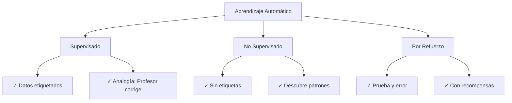

### Tareas Principales

| Tarea | Descripción | Ejemplo |
|-------|-------------|---------|
| **Clasificación** | Predecir categorías discretas | ¿Email es spam o no? |
| **Regresión** | Predecir valores continuos | Estimar precio de una casa |
| **Clustering** | Agrupar datos similares | Segmentación de clientes |

### Caja Blanca vs. Caja Negra

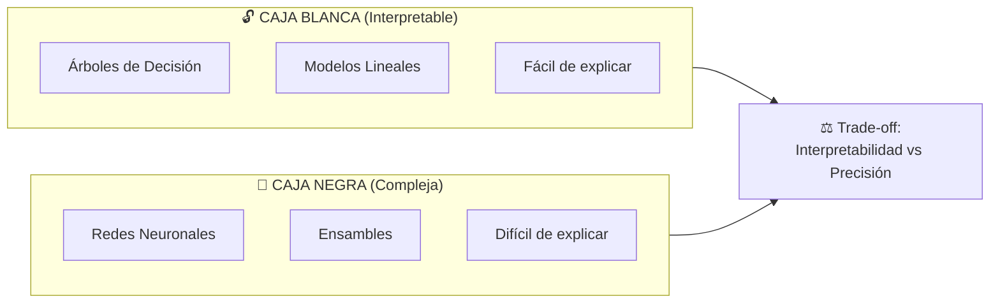

---

## 2️⃣ Modelos Básicos

### Regresión Lineal

**Propósito:** Predecir valores continuos asumiendo relación lineal

```
y = m·x + b
```

**Ejemplo Real:**
- Predecir precio de vivienda según área construida
- Estimar ventas según inversión en publicidad

**Ventajas:** Simple, rápido, interpretable  
**Desventajas:** Solo para relaciones lineales

---

### Regresión Logística (Clasificación)

**Propósito:** Clasificación binaria (sí/no, 0/1)

**Función Sigmoide:** Limita predicciones entre 0 y 1 (probabilidad)

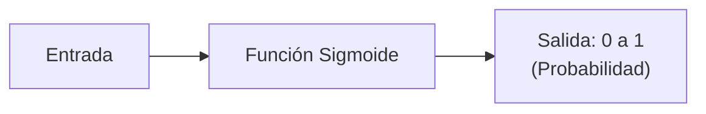

**Ejemplo Real:**
- ¿Aprobará el cliente el crédito? (0 o 1)
- ¿Tiene diabetes el paciente? (Sí o No)

---

### Árboles de Decisión

**Propósito:** Partición de datos mediante preguntas binarias

**Estructura:**
```
            ¿Edad > 30?
            /         \
          Sí           No
         /  \         /  \
      ¿Renta>    ¿Renta>
       5000?      3000?
```

**Ventajas:**
- Maneja variables numéricas Y categóricas
- Cada camino es una regla "si-entonces"
- Fácil de explicar a no técnicos

**Desventajas:**
- Tendencia al sobreajuste si crece demasiado

---

### Redes Neuronales

**Inspiración:** Cerebro humano con capas de neuronas

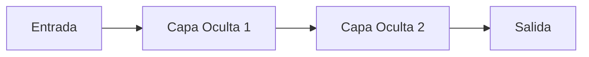

**Características:**
- ✓ Modelan relaciones muy complejas y no lineales
- ✓ Excelentes en visión por computadora y NLP
- ✗ Requieren muchos datos
- ✗ Consumen mucho cómputo (GPU)

**Ejemplo Real:** Clasificación de imágenes médicas, reconocimiento de voz

---

### Otros Modelos Básicos

| Modelo | Propósito | Ventajas | Desventajas |
|--------|----------|----------|------------|
| **K-NN** | Clasificación simple | Sin entrenamiento | Lento en predicción |
| **Naive Bayes** | Clasificación probabilística | Rápido, ideal para texto (spam) | Asume independencia |
| **SVM** | Separación óptima de clases | Funciona bien en altas dimensiones | Caja negra, lento |
| **Ensambles** (Random Forest, Boosting) | Combina múltiples modelos | Alta precisión | Menos interpretable |

---

## 3️⃣ Criterios para Seleccionar el Modelo Correcto

### 1. Volumen de Datos vs. Complejidad

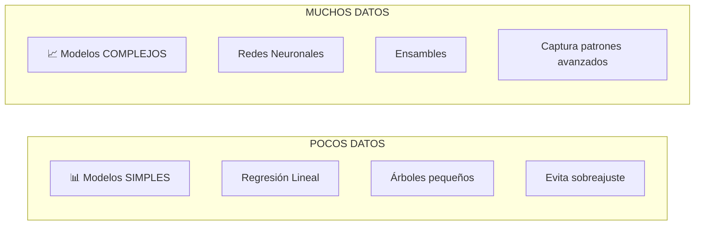

**Principio:** A menos datos → modelo más simple

---

### 2. Tipo de Variable

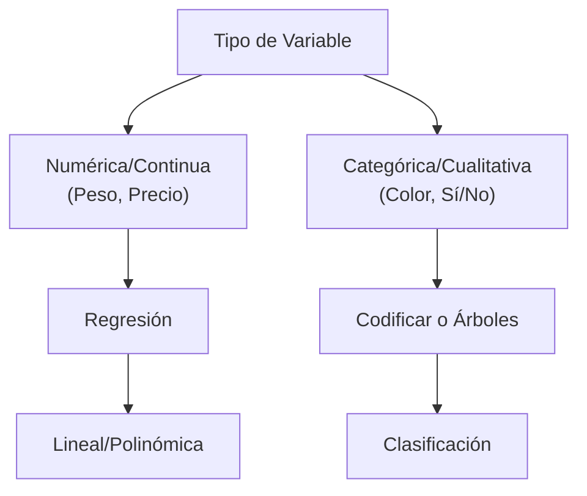

---

### 3. Naturaleza de los Datos

#### Datos Lineales
- ✓ Regresión Lineal
- ✓ Regresión Logística

#### Datos No Lineales
- ✓ Árboles de Decisión
- ✓ SVM con kernel
- ✓ Redes Neuronales

**Ejemplo:**
- **Lineal:** Precio de casa vs. metros cuadrados → Línea recta
- **No Lineal:** Clasificar imágenes → Relaciones complejas

---

### 4. Sobreajuste vs. Subajuste

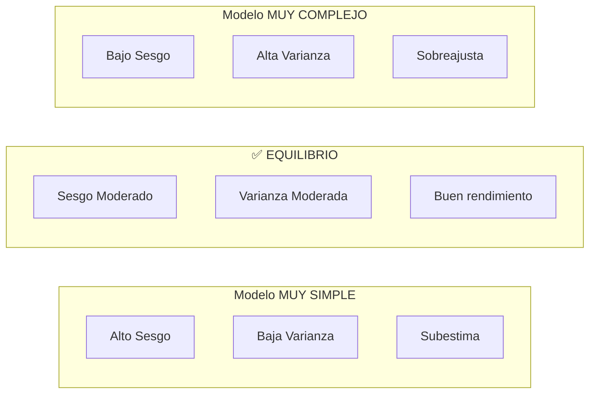

**Regularización:** Penaliza la complejidad
- L1/L2 en regresión
- Poda en árboles
- Dropout en redes neuronales

---

### 5. Estructura de los Datos

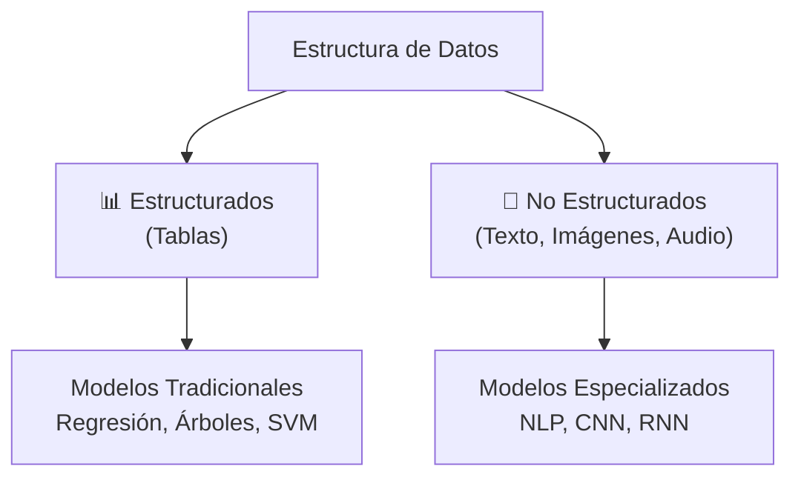

**Ejemplos:**
- **Estructurado:** Predecir ventas con variables de económicas
- **No Estructurado:** Análisis de sentimientos en redes sociales

---

### 6. Escala y Preprocesamiento

| Modelo | Requiere Normalizar | Notas |
|--------|-------------------|-------|
| Regresión Lineal | ❌ No necesario | Pero mejora convergencia |
| K-NN | ✅ Sí, obligatorio | Usa distancias |
| SVM | ✅ Sí, obligatorio | Kernel requiere escala |
| Redes Neuronales | ✅ Sí, muy importante | Acelera entrenamiento |
| Árboles de Decisión | ❌ No afectado | Invariante a escala |

---

### 7. Interpretabilidad vs. Precisión

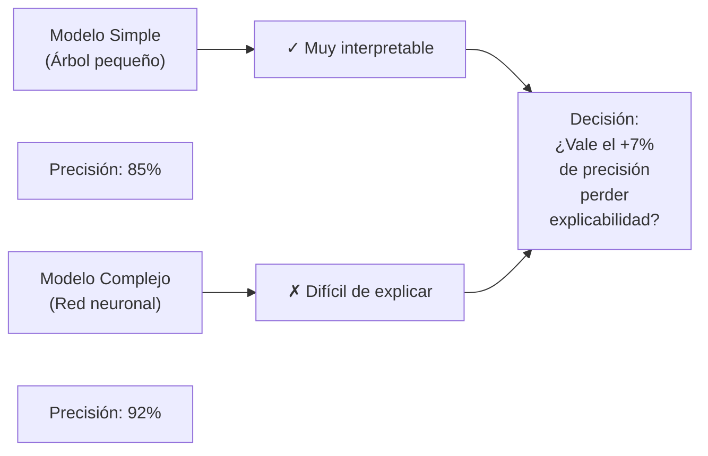

**Regla de Oro:** En áreas de alto riesgo (medicina, finanzas) → preferir interpretabilidad

---

### 8. Datos Desbalanceados

**Problema:** Clases con representación desigual (ej: 1% fraude, 99% legítimo)

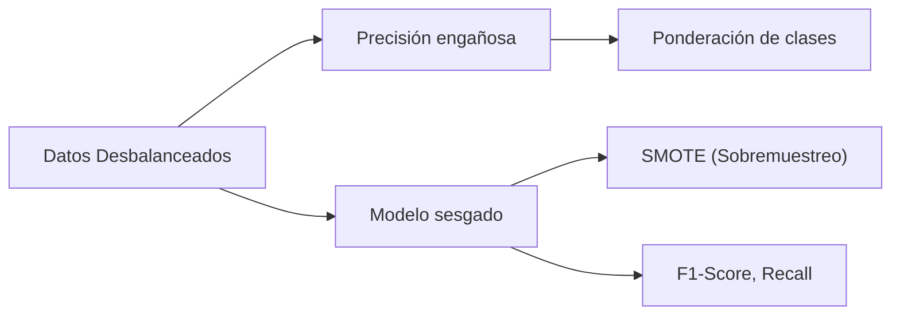

**Métrica correcta:** Usar F1-Score o Recall, no Precisión global

---

### 9. Recursos Computacionales

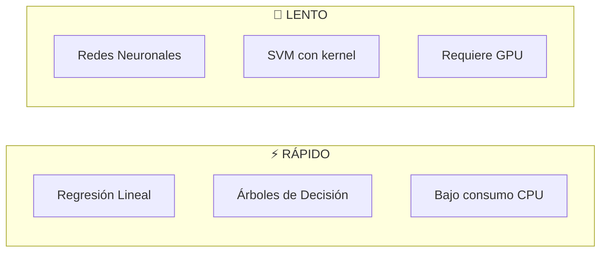

---

## 4️⃣ Caso Práctico: Detección de Fraude

**Contexto:** Banco necesita detectar transacciones fraudulentas en tiempo real

### Proceso

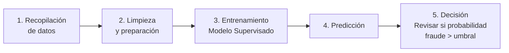

### Elección del Modelo

✓ **Redes Neuronales** (caso común en banca)
- Aprenden patrones complejos de fraude
- Detectan anomalías sutiles
- Requieren GPU pero resultado de alto valor

✓ **Alternativa:** Árbol de Decisión
- Si se requiere explicabilidad
- "Por qué esta transacción fue bloqueada"

### Resultado
- ✅ Automatiza detección
- ✅ Reduce errores humanos
- ✅ Procesa miles de transacciones/segundo

---

## 5️⃣ Evaluación y Métricas

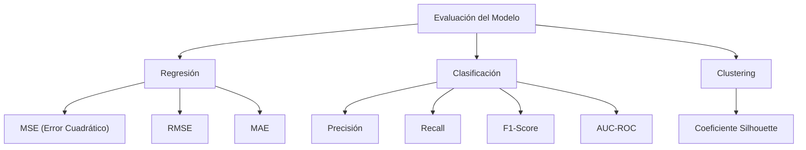

### Matriz de Confusión (Clasificación)

```
                Predicción
                Positivo  Negativo
Realidad  +     VP        FN
          -     FP        VN

VP = Verdaderos Positivos
FP = Falsos Positivos
FN = Falsos Negativos
VN = Verdaderos Negativos
```

**Métricas derivadas:**
- **Precisión:** VP / (VP + FP) → ¿De los predichos positivos, cuántos acertamos?
- **Recall:** VP / (VP + FN) → ¿De los positivos reales, cuántos encontramos?
- **F1-Score:** Promedio armónico de Precisión y Recall

---

## 6️⃣ Regla de Parsimonia

**Principio:** Si dos modelos tienen rendimiento similar, **elige el más simple**

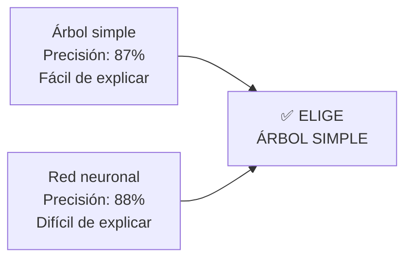

**Beneficios del modelo simple:**
- Más rápido de entrenar
- Menos recursos
- Más fácil de mantener
- Mejor explicabilidad

---

## 📊 Diagrama de Decisión: Seleccionar Modelo

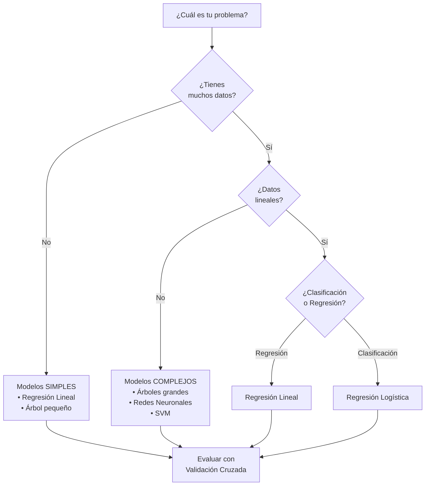

---

## 🎯 Resumen: Checklist para Elegir Modelo

- [ ] **Entender el problema:** ¿Clasificación, regresión o clustering?
- [ ] **Analizar los datos:** ¿Cuántos registros? ¿Tipos de variables?
- [ ] **Evaluar relaciones:** ¿Lineales o no lineales?
- [ ] **Considerar interpretabilidad:** ¿Necesito explicar el modelo?
- [ ] **Revisar recursos:** ¿CPU, memoria, tiempo disponibles?
- [ ] **Elegir el modelo más simple** que resuelva el problema
- [ ] **Validar con datos de prueba** o validación cruzada
- [ ] **Usar métricas apropiadas** según el tipo de problema
- [ ] **Iterar y mejorar** basado en resultados

---

## 📚 Conceptos Clave

| Concepto | Definición |
|----------|-----------|
| **Sobreajuste** | Modelo memoriza datos en lugar de aprender patrones |
| **Subajuste** | Modelo muy simple para capturar la complejidad |
| **Validación Cruzada** | Divide datos en grupos para evaluar generalización |
| **Regularización** | Penaliza complejidad para evitar sobreajuste |
| **Sesgo** | Error sistemático del modelo |
| **Varianza** | Sensibilidad a cambios en datos de entrenamiento |

---

## 🔗 Conexiones con Otros Cursos

- **Estadística:** Distribuciones, correlación, sesgo-varianza
- **Arquitectura Empresarial:** Implementar modelos en sistemas
- **Dirección de Datos:** Gestionar datos para entrenar modelos

---

**Recuerda:** No hay modelo perfecto. La mejor opción depende de tu problema específico. 🚀
