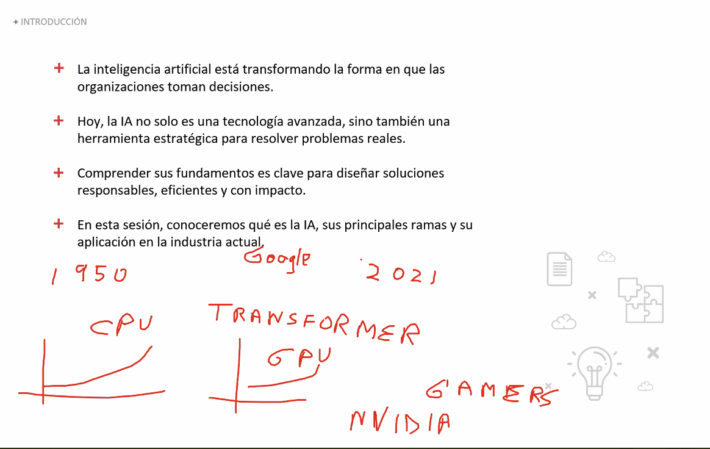
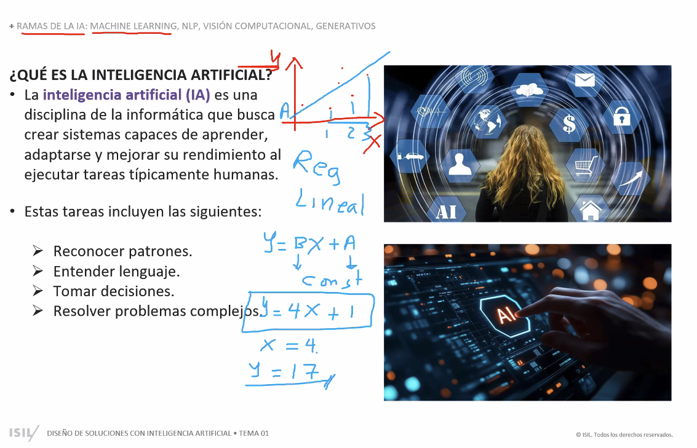
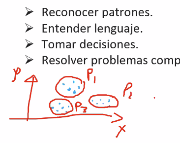
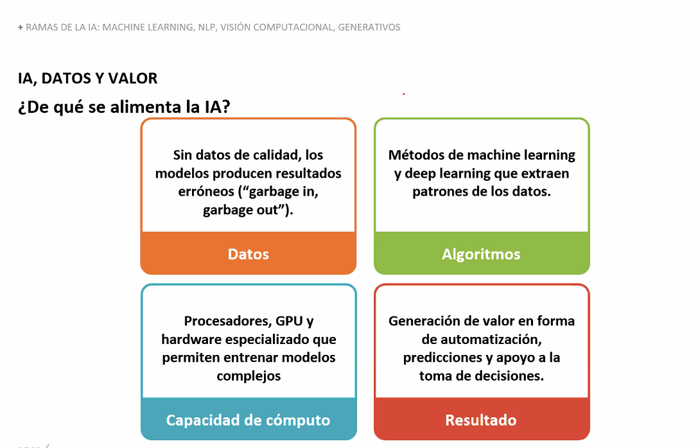

# Inteligencia Artificial, Machine Learning y Deep Learning (Clase 2)

**Curso:** Diseño de Soluciones con IA - 6508.202610 (ISIL, 2026-1)  
**Docente:** Omar David Visitación Romero  
**Fecha:** 15/04/2026

---

## Resumen de la sesión

La segunda clase construyó la base conceptual del curso: qué es la inteligencia artificial, qué ramas existen y de qué depende su valor real. También se profundizó en **Machine Learning**, sus tipos de aprendizaje, y en **Deep Learning** como subtipo clave, incluyendo su historia, sus conceptos fundamentales y cómo se diferencia del ML clásico.

La idea central: la IA genera valor cuando combina **datos**, **algoritmos** y **capacidad de cómputo** para apoyar decisiones, automatizar tareas o predecir resultados. Sin esos tres elementos, no hay solución útil.

---

## Qué es la inteligencia artificial

La **IA** es una disciplina de la informática que busca crear sistemas capaces de ejecutar tareas que normalmente asociamos con capacidades humanas.

Entre esas tareas están:

- reconocer patrones;
- entender lenguaje;
- tomar decisiones;
- resolver problemas complejos.

## Para qué sirve la IA

La IA no debe verse solo como una tecnología "moderna". Su valor aparece cuando ayuda a una organización a:

- automatizar actividades repetitivas;
- anticipar comportamientos o eventos;
- analizar grandes volúmenes de información;
- mejorar la toma de decisiones.

---

## Ramas principales vistas en clase

| Rama | Qué hace | Ejemplo rápido |
|---|---|---|
| **Machine Learning** | Aprende patrones desde datos para predecir o clasificar | Predecir qué clientes abandonarán un servicio |
| **NLP** | Procesa texto y lenguaje humano | Clasificar comentarios, responder preguntas |
| **Visión computacional** | Interpreta imágenes y video | Detectar defectos en producción, validar documentos |
| **IA generativa** | Crea contenido nuevo (texto, imágenes, código) | Redactar borradores, asistentes conversacionales |

### Machine Learning

Es la rama que permite que un sistema aprenda a partir de datos. En lugar de programar cada regla de forma manual, el modelo encuentra patrones y los usa para hacer predicciones o clasificaciones.

Los principales tipos de aprendizaje en ML son:

- **Supervisado:** el modelo aprende con datos etiquetados (entrada → salida conocida). Se usa para clasificación (fraude/no fraude) y regresión (precio de un inmueble).
- **No supervisado:** el modelo trabaja sin etiquetas para descubrir estructura. Se usa para segmentación de clientes, reducción de dimensiones y detección de anomalías.
- **Semi-supervisado:** mezcla pocos datos etiquetados con muchos sin etiquetar. Útil cuando etiquetar es caro, como en imágenes médicas.
- **Por refuerzo:** un agente aprende tomando decisiones y recibiendo recompensas o penalizaciones. Se aplica en robótica, juegos y optimización de políticas.
- **Auto-supervisado (self-supervised):** las etiquetas se generan desde los propios datos. Es la base de muchos modelos de lenguaje modernos.

Es la rama más usada en el curso para problemas de predicción y segmentación.

**Ejemplo:** predecir qué clientes tienen mayor probabilidad de abandonar un servicio.

### NLP

El **Procesamiento de Lenguaje Natural** permite que las máquinas trabajen con texto o lenguaje humano.

- Incluye tareas como clasificación de texto, extracción de entidades, traducción automática y resumen.
- Herramientas como ChatGPT son ejemplos de NLP combinado con IA generativa.

**Ejemplo:** clasificar comentarios de clientes, responder preguntas o resumir documentos.

### Visión computacional

Permite que un sistema interprete imágenes o video.

- Puede identificar objetos, personas, defectos o patrones visuales que escapan al ojo humano en escala.
- Se aplica ampliamente en manufactura, salud e identidad digital.

**Ejemplo:** detectar productos en una cámara, validar documentos o identificar defectos en una línea de producción.

### IA generativa

Es la rama orientada a crear contenido nuevo, como texto, imágenes, audio o código, a partir de patrones aprendidos.

- A diferencia del ML clásico que clasifica o predice, la IA generativa **produce** salidas nuevas.
- Es la rama de más crecimiento reciente y también la de mayor riesgo ético si no se usa con criterio.

**Ejemplo:** generar borradores de informes, asistentes conversacionales o prototipos visuales.

---

## IA, datos y generación de valor

Uno de los mensajes más importantes de la clase fue que la IA no funciona sola. Necesita una base mínima para producir resultados útiles:

1. **Datos:** si los datos son malos, el resultado también lo será.
2. **Algoritmos:** son los métodos que extraen patrones y aprendizaje.
3. **Capacidad de cómputo:** hace posible entrenar y ejecutar modelos más complejos.
4. **Resultado:** el valor aparece cuando todo eso se traduce en automatización, predicción o apoyo a decisiones.

> Idea clave: sin datos de calidad, la IA no resuelve el problema; solo automatiza errores.

---

## Cómo se conecta esto con el curso

Esta base conceptual es importante porque el curso no busca "usar IA por moda", sino diseñar soluciones con criterio.

Entender qué puede hacer cada rama ayuda a decidir:

- qué tipo de problema se quiere resolver;
- qué datos se necesitan;
- qué enfoque conviene usar;
- qué valor de negocio se espera obtener.

### Qué rama usar según el problema

| Tipo de problema | Rama recomendada |
|---|---|
| Predecir un valor o clasificar registros | Machine Learning |
| Analizar texto, opiniones o documentos | NLP |
| Reconocer imágenes, fotos o video | Visión computacional |
| Generar contenido o asistentes de lenguaje | IA generativa |

---

## Ejemplos rápidos de aplicación

- **Banca:** detección de fraude (ML) y clasificación de reclamos (NLP).
- **Retail:** recomendación de productos (ML) y análisis de reseñas (NLP).
- **Manufactura:** control de calidad visual (Visión computacional).
- **Educación:** asistentes académicos (IA generativa) y análisis de desempeño (ML).
- **Salud:** apoyo al diagnóstico por imágenes (Visión computacional) e identificación de patrones clínicos (ML).

---

## Gráficos de apoyo

### Imagen 1: inteligencia-artificial-introduccion-clase-2.png

Resume el enfoque general de la sesión: la IA ya no es solo un tema técnico, sino una capacidad con impacto organizacional.

### Imagen 2: inteligencia-artificial-ramas-clase-2.png

Presenta la definición general de IA y las ramas principales vistas en clase: **Machine Learning**, **NLP**, **Visión Computacional** y modelos **generativos**.

### Imagen 3: inteligencia-artificial-capacidades-clave-clase-2.png

Refuerza las capacidades básicas asociadas a la IA: reconocer patrones, entender lenguaje, tomar decisiones y resolver problemas complejos.

### Imagen 4: inteligencia-artificial-datos-y-valor-clase-2.png

Explica la relación entre datos, algoritmos, cómputo y resultados de negocio.

---

## Historia del Deep Learning

El aprendizaje profundo no apareció de la nada. Tiene décadas de evolución detrás, con períodos de entusiasmo y de abandono.

### Cronología resumida

1. **1943 – Neuronas matemáticas (McCulloch y Pitts):** proponen el primer modelo matemático de una neurona biológica. Primer paso hacia las redes neuronales artificiales.
2. **1958 – Perceptrón (Rosenblatt):** primer algoritmo que aprende a clasificar datos linealmente separables. Genera gran entusiasmo inicial.
3. **1969 – Crítica de Minsky y Papert:** demuestran las limitaciones del perceptrón simple (no puede resolver XOR). La investigación en redes neuronales entra en letargo.
4. **1986 – Retropropagación popularizada (Rumelhart, Hinton, Williams):** se publica el artículo clave que hace practicable entrenar redes multicapa con el algoritmo de **backpropagation**. Segunda ola de interés.
5. **1990s – Limitaciones de cómputo y datos:** los modelos son lentos y los datos escasos. El enfoque simbólico y las SVMs dominan el campo. Segundo período frío.
6. **1998 – LeNet (LeCun):** red convolucional exitosa para reconocimiento de dígitos escritos a mano (dígitos del banco). Semilla de las CNNs modernas.
7. **2006 – Deep Belief Networks (Hinton):** propone un método eficiente de preentrenamiento por capas que permite entrenar redes profundas. Comienza la era moderna del deep learning.
8. **2012 – AlexNet y el resurgimiento definitivo:** la red de Krizhevsky, Sutskever e Hinton gana ImageNet con una ventaja enorme sobre los modelos clásicos, entrenada sobre **GPU**. Es el punto de inflexión que lleva al DL al mainstream.
9. **2017 – Transformers (Vaswani et al.):** el artículo *"Attention is All You Need"* introduce la arquitectura que da origen a GPT, BERT y los grandes modelos de lenguaje.
10. **2022–hoy – LLMs y IA generativa masiva:** ChatGPT, Gemini, Llama y otros modelos de lenguaje llevan el deep learning a millones de usuarios.

> Idea clave: el deep learning no es nuevo. Tiene raíces en los años 40. Lo que cambió fue la escala: más datos, más cómputo y mejores algoritmos.

---

## Deep Learning: conceptos clave

El **Deep Learning (DL)** es un subtipo de Machine Learning que usa **redes neuronales artificiales con muchas capas**. La palabra "profundo" se refiere a la cantidad de capas, no a la complejidad filosófica del modelo.

### Red neuronal artificial

- Conjunto de **neuronas artificiales** organizadas en capas.
- Cada neurona recibe entradas, aplica una transformación matemática y pasa el resultado a la siguiente capa.
- La red aprende ajustando los **pesos** (valores numéricos que regulan cuánto influye cada conexión).

### Capas

Una red profunda tiene tres tipos de capas:

- **Capa de entrada:** recibe los datos (una imagen, una frase, un audio).
- **Capas ocultas (hidden layers):** procesan y transforman la información. Cuantas más capas, más representaciones complejas puede aprender el modelo.
- **Capa de salida:** produce el resultado final (una clase, un número, un texto generado).

### Embeddings y representaciones

- Un **embedding** es una representación numérica densa de un concepto (una palabra, una imagen, un usuario).
- La ventaja: el modelo aprende automáticamente qué características son relevantes, sin que el desarrollador las defina a mano.
- Ejemplo: la palabra "gato" y "felino" tendrán embeddings similares porque el modelo aprende su relación semántica.

### Entrenamiento

El proceso de entrenamiento busca ajustar los pesos de la red para minimizar el error en las predicciones:

1. El modelo hace una predicción con los datos de entrada.
2. Se calcula el **error** comparando la predicción con la respuesta correcta (función de pérdida).
3. Se usa **backpropagation** para calcular cómo contribuye cada peso al error.
4. Se actualizan los pesos usando un algoritmo de optimización como **Gradient Descent** o **Adam**.
5. Se repite el proceso con todos los datos de entrenamiento (**época**).

### Overfitting y regularización

- **Overfitting (sobreajuste):** el modelo aprende tan bien los datos de entrenamiento que pierde capacidad de generalizar a datos nuevos.
- Señal de alerta: el error de entrenamiento baja, pero el error de validación sube.
- **Regularización:** técnicas para controlar el sobreajuste:
  - **Dropout:** desactiva neuronas aleatoriamente durante el entrenamiento para que la red no dependa de conexiones específicas.
  - **L2 / Weight decay:** penaliza pesos muy grandes para mantener el modelo simple.
  - **Early stopping:** detiene el entrenamiento cuando el error de validación deja de mejorar.
  - **Data augmentation:** genera variaciones artificiales de los datos de entrenamiento.

### GPUs y cómputo

- Entrenar redes profundas requiere millones (o miles de millones) de operaciones matemáticas en paralelo.
- Las **GPUs (Graphics Processing Units)** son ideales para esto porque tienen miles de núcleos diseñados para cálculos paralelos.
- El auge del DL en 2012 fue posible, en gran parte, por el uso de GPUs para entrenar AlexNet.
- Hoy también se usan **TPUs** (unidades dedicadas diseñadas por Google para deep learning a escala).

---

## Machine Learning vs Deep Learning

**Deep Learning** es un subtipo de **Machine Learning**. No son enfoques opuestos: el DL forma parte del ML. La diferencia está en el tipo de modelo, los datos necesarios y el tipo de problema que resuelven mejor.

### Comparación directa

| Aspecto | Machine Learning (clásico) | Deep Learning |
|---|---|---|
| **Tipo de modelo** | Árboles, regresión, SVM, random forest, gradient boosting | Redes neuronales profundas (CNN, RNN, Transformer) |
| **Ingeniería de características** | Manual: el desarrollador define qué variables usar | Automática: el modelo aprende las representaciones |
| **Volumen de datos** | Funciona bien con **pocos datos** | Necesita **grandes volúmenes** (o datos preentrenados) |
| **Cómputo requerido** | Bajo a moderado (CPU suficiente) | Alto (GPU/TPU recomendados) |
| **Interpretabilidad** | Alta (árboles, regresiones son legibles) | Baja (caja negra, aunque hay técnicas de explicación) |
| **Mejor para...** | Datos tabulares, problemas con contexto claro, menos datos | Imágenes, texto, audio, video; problemas con estructura compleja |
| **Ejemplo típico** | Predecir rotación de clientes con datos de CRM | Clasificar imágenes de radiografías o traducir texto |

### Cuándo usar cada uno

- Usa **ML clásico** si:
  - tienes datos tabulares (columnas y filas);
  - el volumen de datos es limitado;
  - necesitas que el modelo sea explicable (compliance, reguladores);
  - quieres resultados rápidos con menos infraestructura.

- Usa **Deep Learning** si:
  - trabajas con imágenes, texto libre, audio o video;
  - tienes acceso a grandes cantidades de datos o modelos preentrenados;
  - el problema tiene estructura compleja que el ML clásico no captura bien.

> Regla práctica: empieza siempre por ML clásico. Si el rendimiento no es suficiente y tienes datos y cómputo, escala a deep learning.

---

## Padres del Deep Learning

Los tres investigadores más reconocidos como fundadores del deep learning moderno son conocidos como la **"trinidad del deep learning"**:

- **Geoffrey Hinton** (Universidad de Toronto / Google Brain): impulsó backpropagation en redes profundas, Boltzmann machines y redes de creencia profunda. Premio Turing 2018.
- **Yann LeCun** (NYU / Meta AI): desarrolló las **redes convolucionales (CNN)** y su aplicación práctica al reconocimiento de imágenes. Premio Turing 2018.
- **Yoshua Bengio** (Universidad de Montreal / Mila): contribuciones clave en aprendizaje de representaciones, redes recurrentes y atención. Premio Turing 2018.

Los tres compartieron el **Premio Turing 2018**, considerado el "Nobel de la computación", por sus contribuciones al deep learning.

---

## Conclusión

La clase dejó una base clara para el resto del curso: antes de construir una solución con IA, hay que entender qué es, qué ramas existen y de qué depende su valor real.

Elegir la rama correcta —y dentro de ML, saber si se necesita deep learning o no— es tan importante como tener buenos datos. La tecnología importa, pero el criterio para aplicarla importa más.

El deep learning amplía las posibilidades del ML clásico, pero no lo reemplaza. Cada herramienta tiene su contexto ideal.

---

## Preguntas de repaso

1. **¿Cuál es la diferencia entre Machine Learning y Deep Learning?** ¿En qué casos conviene usar uno sobre el otro?
2. **¿Qué es el overfitting** y qué técnicas existen para controlarlo en una red neuronal?
3. **¿Qué papel jugaron las GPUs** en el resurgimiento del deep learning a partir de 2012?
4. **¿Qué es un embedding** y por qué es útil en modelos de lenguaje o visión computacional?
5. **Menciona dos hitos históricos clave del deep learning** (año y contribución) y explica por qué fueron importantes para el campo.
