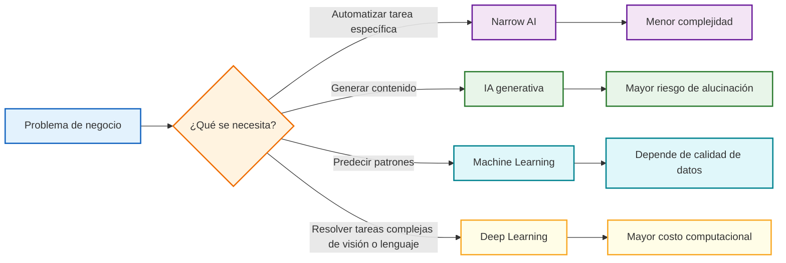
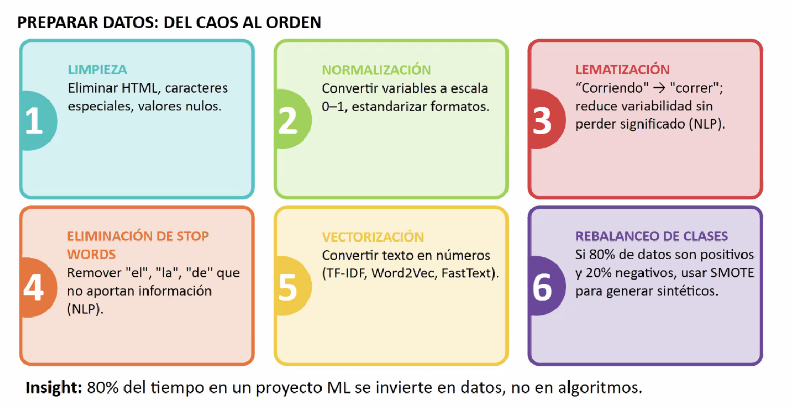

# Diseño de Soluciones con IA — Tema 02: Inteligencia Artificial (Clase 3)

**Curso:** Diseño de Soluciones con IA (ISIL, 2026-1)  
**Docente:** Omar David Visitación Romero  
**Fecha:** 22/04/2026

---

## 1. ¿Qué es la Inteligencia Artificial?

> **Definición clave:**  
> La Inteligencia Artificial (IA) es el conjunto de tecnologías que permite a máquinas realizar tareas que típicamente requieren inteligencia humana: **razonamiento**, **aprendizaje**, **reconocimiento de patrones** y **toma de decisiones**.

En organizaciones, la IA no es monolítica. Existen diferentes tipos, cada uno con capacidades, limitaciones y casos de uso específicos. Entender esta diversidad es clave para seleccionar la solución correcta según el problema empresarial.

## Mapa visual para seleccionar tipo de IA



Este gráfico sintetiza la decisión que atraviesa toda la clase: no toda necesidad empresarial requiere el mismo nivel de IA.

---

## 2. Tipología de la IA: Capacidades y Limitaciones


Existen cuatro categorías principales de IA, cada una con fortalezas y restricciones:

| **Tipo** | **Qué es** | **Fortaleza** | **Limitación** | **Caso de uso** |
|----------|-----------|---------------|----------------|----------------|
| **Narrow AI** | Modelo especializado en única tarea (chatbot, clasificador imágenes) | Muy preciso y eficiente en su dominio | No generaliza fuera de su área | Automación repetitiva, clasificación binaria |
| **IA Generativa** | Crea contenido nuevo (texto, imágenes, código, vídeos) | Resultados originales y adaptativos; alto valor creativo | Alucinaciones: confabula información plausible pero falsa | Redacción de reportes, ideación, asistentes de código |
| **Machine Learning** | Aprende patrones de datos etiquetados sin código explícito | Escalable; requiere poco ajuste manual de parámetros | Necesita muchos datos de calidad y tuning de hiperparámetros | Predicción demanda, segmentación clientes, detección fraude |
| **Deep Learning** | Redes neuronales profundas para tareas complejas (visión, NLP) | Estado del arte; resuelve problemas de altísima complejidad | Alto costo computacional (GPUs/TPUs); caja negra; baja interpretabilidad | Visión computadora, NLP avanzado, conducción autónoma |

> **Insight:** Seleccionar el tipo de IA correcto depende de la complejidad del problema, disponibilidad de datos y presupuesto computacional. No siempre "más complejo = mejor".

---

## 3. Priorización de Proyectos de IA: Matriz de Decisión


Una de las decisiones más críticas en la implementación de IA es **¿cuál proyecto implementar primero?** Existen tres ejes fundamentales:

| **Eje** | **Pregunta Clave** | **Indicadores de Alto Potencial** |
|--------|------------------|-----------------------------------|
| **Impacto** | ¿Cuánto valor económico o de eficiencia puede generar? | Reduce costos >30% | Aumenta ingresos | Mejora CX significativamente | Habilita nuevas líneas |
| **Viabilidad** | ¿Tenemos datos, recursos y tiempo? | Datos históricos disponibles | Expertise técnico interno o presupuesto para contratar | Timeline realista (3-6 meses) |
| **Riesgo** | ¿Requisitos de confianza? ¿Salidas críticas? | Decisiones no reguladas | Impacto de error es manejable | Privacidad de datos controlada |

> **Quick Win Ideal:** Alto impacto + Viabilidad moderada + Bajo riesgo = Prioridad máxima

**Evitar:** Alto riesgo + viabilidad baja (incluso si el impacto es alto)

---

## 4. Riesgos e Implicaciones Éticas de un Proyecto de IA


Toda solución de IA introduce riesgos que no deben ignorarse. El marco de riesgo incluye cinco categorías críticas:

| **Riesgo** | **Qué Significa** | **Ejemplo Real** | **Mitigación** |
|-----------|------------------|-----------------|----------------|
| **Sesgo Algorítmico** | Modelo hereda prejuicios del dataset de entrenamiento | Modelo de hiring rechaza candidatas por patrones históricos discriminatorios | Auditoría datos + Diversidad en entrenamiento + Balanceo de clases |
| **Privacidad de Datos** | Exposición de datos personales/sensibles; incumplimiento GDPR/CCPA | Modelo con datos de crédito que puede ser re-identificado | Federated learning + Differential privacy + Encriptación |
| **Interpretabilidad** | Deep Learning como "caja negra"; no se justifican decisiones | Modelo aprueba/rechaza crédito sin explicación auditable | XAI (Explainable AI) + LIME/SHAP + Auditoría decisiones |
| **Escalabilidad** | GPU/TPU costosas; modelo no deployable en recursos limitados | V100 ($10k+) requerida para entrenar; prohibitivo para pymes | Modelos ligeros + Quantization + Edge computing |
| **Mantenimiento** | Datos cambian; modelo se degrada en producción (Model Drift) | Detector fraude 2024 falla 2026 por evolución patrones delictivos | MLOps: reentrenamiento automático + Alertas monitoreo |

### Privacidad de Datos
- **Riesgo:** Exposición de datos personales o sensibles. Incumplimiento de GDPR, CCPA o normativas locales.
- **Ejemplo:** Un modelo entrenado con datos de crédito que puede ser re-identificado.
- **Mitigación:** *Federated learning* (entrenamiento distribuido), *differential privacy* (ruido matemático para proteger identidades).

### Interpretabilidad (Explainability)
- **Riesgo:** Modelos complejos (Deep Learning) funcionan como "cajas negras": no se sabe por qué el modelo toma una decisión.
- **Ejemplo:** Un modelo de deep learning aprueba/rechaza un crédito, pero nadie sabe la lógica detrás.
- **Solución:** **XAI (Explainable AI)** — técnicas para abrir la caja negra y justificar decisiones.

### Escalabilidad Computacional
- **Riesgo:** Entrenar modelos grandes requiere GPU/TPU costosas. El modelo puede no ser deployable en recursos limitados.
- **Ejemplo:** Un modelo de deep learning necesita una GPU NVIDIA Tesla V100 ($10k+) cada vez que se entrena.
- **Implicación:** Barrera económica para pymes. Latencia en producción si el hardware es insuficiente.

### Mantenimiento en Producción
- **Riesgo:** Los datos cambian, el modelo se degrada. Requiere monitoreo y reentrenamiento continuo.
- **Ejemplo:** Un modelo de detección de fraude de 2024 falla en 2026 porque los patrones delictivos evolucionaron.
- **Solución:** MLOps — pipeline automatizado para reentrenamiento, versionado de modelos y alertas de degradación.

---

## 5. Valor Estratégico de la IA en Organizaciones


La IA aporta valor en tres niveles estratégicos. Cada uno tiene un ROI diferente:

### Matriz de Valor por Sector

| **Sector** | **Aplicación Principal** | **Tipo de IA Ideal** | **Beneficio Esperado** | **Horizonte ROI** |
|-----------|-------------------------|---------------------|----------------------|-------------------|
| **Marketing** | Personalización de campañas, predicción de churn | ML + IA Generativa | +40% engagement, -25% CAC | 3-6 meses |
| **Comunicación** | Chatbots, análisis de sentimiento en redes | IA Generativa + NLP | -60% tickets manuales, +15% satisfaction | 2-4 meses |
| **Finanzas** | Detección fraude, scoring crediticio, trading automatizado | Deep Learning + ML | -70% fraude, +30% velocidad aprobaciones | 6-12 meses |
| **Salud** | Diagnóstico asistido, predicción de enfermedades | Deep Learning (Visión) | +20% precisión diagnóstico, -15% tiempo | 12-24 meses |
| **Educación** | Personalización de aprendizaje, recomendaciones de cursos | ML | +35% retención, -40% time-to-competency | 4-8 meses |
| **Customer Service** | Automatización soporte, routing inteligente | IA Generativa + ML | -50% costo operativo, +25% CSAT | 2-6 meses |

### Tres Fuentes de ROI

1. **Reducción de costos:** Automatización de procesos manuales (RPA + ML) → Ahorro directo de nómina
2. **Mejora de eficiencia:** Procesos más rápidos, menos errores, ciclos acelerados → Mayor throughput con mismo recurso
3. **Nuevas líneas de negocio:** Productos/servicios completamente nuevos habilitados por IA → Revenue incremental

**Ejemplo práctico:** ChatGPT ha reducido tiempos de redacción de reportes financieros de **horas → minutos**, liberando recursos para análisis de mayor valor agregado.

> **Pregunta Estratégica:** ¿La IA en tu organización es un *cost center* (reducir gastos) o *profit center* (generar ingresos)? La respuesta define el presupuesto y timeline.

---

## 6. Desarrollo del Plan de Investigación para un Proyecto de IA


Un proyecto de IA robusto sigue un ciclo científico de 8 fases:

```
┌─────────────────────────────────────────────────────────────┐
│ CICLO DE DESARROLLO DE IA: 8 FASES                          │
├──────┬──────────────────┬──────┬──────────────────┬─────────┤
│ Fase │ Entrada          │ Proc │ Salida           │ Duración│
├──────┼──────────────────┼──────┼──────────────────┼─────────┤
│  1   │ Problema real    │  →   │ Briefing SMART   │ 1 sem   │
│  2   │ Fuentes de datos │  →   │ Dataset limpio   │ 4 sem   │
│  3   │ Datos brutos     │  →   │ Datos preparados │ 3 sem   │
│  4   │ Variables raw    │  →   │ Features vector  │ 2 sem   │
│  5   │ Matriz features  │  →   │ Modelo entrenado │ 4 sem   │
│  6   │ Modelo          │  →   │ Reporte de perf  │ 1 sem   │
│  7   │ Modelo validado │  →   │ Modelo en API    │ 2 sem   │
│  8   │ Sistema live    │  →   │ Alertas MLOps    │ Continuo│
└──────┴──────────────────┴──────┴──────────────────┴─────────┘

Tiempo Total Estimado: 4-6 MESES (si todo va bien)
```

### Fase 1: Planteamiento del Problema
- **Qué hacer:** Definir el objetivo, métricas de éxito, línea base (baseline).
- **Pregunta clave:** ¿Cuál es el problema exacto que resolvemos? ¿Cómo medimos "éxito"?
- **Entregable:** Documento de definición de proyecto con objetivos SMART.

### Fase 2: Recolección y Etiquetado de Datos


## Transcripción del PPT: Tipología de la IA y Priorización de Proyectos

### Tipología de la IA

IA se clasifica en Narrow AI (especializada), IA Generativa (creativa), Machine Learning (predictiva) y Deep Learning (compleja).

**Ejemplo práctico:** Narrow AI en un asistente de voz responde consultas específicas, mientras IA Generativa crea historias originales.

### Priorización de Proyectos de IA

Usar criterios de impacto, viabilidad y riesgo para seleccionar proyectos. Alto impacto y bajo riesgo primero.

**Ejemplo práctico:** Priorizar proyecto de detección de fraude en banca por alto impacto en seguridad y bajo riesgo técnico.

### Ética en IA

Considerar sesgos, privacidad y transparencia para evitar discriminación y proteger datos.

**Ejemplo práctico:** Auditar modelo de hiring para eliminar sesgos de género, asegurando equidad.

### Casos Prácticos de IA

- **Salud:** Diagnóstico asistido con imágenes.
- **Finanzas:** Predicción de riesgos crediticios.
- **Retail:** Recomendaciones personalizadas.

**Ejemplo práctico:** En retail, IA analiza compras pasadas para sugerir productos, aumentando ventas en 20%.

---

- **Qué hacer:** Reunir datos representativos y etiquetar correctamente. El flujo típico es: **Fuentes → Muestreo → Guía de etiquetas → Etiquetado → QA → Dataset final**.
- **Desafío:** Calidad >> Cantidad. 100 datos bien etiquetados valen más que 1 millón mal etiquetados.
- **Riesgos principales:**
  * **No representativo:** Muestreo sesgado que no cubre casos extremos. *Mitigación:* muestreo estratificado por segmentos, casos raros.
  * **Etiquetas inconsistentes:** Ambigüedad en las reglas de etiquetado. *Mitigación:* guidelines claras + ejemplos + revisión cruzada.
  * **Data leakage:** Información de test colándose en train. *Mitigación:* separar train/validation/test desde el inicio.
- **Entregable:** Dataset limpio, guía de etiquetado y reporte de calidad de datos.

### Fase 3: Análisis Exploratorio y Procesado


**Los datos raramente llegan listos. Esta fase es donde ocurre el 80% del trabajo real en un proyecto ML.**

#### Seis pasos clave:

1. **Limpieza:** Eliminar HTML, caracteres especiales, valores nulos, duplicados.
2. **Normalización:** Convertir variables a escala 0-1, estandarizar formatos (fechas, monedas, unidades).
3. **Lematización:** Agrupar variantes de palabras ("corriendo" → "correr") para reducir ruido sin perder significado (técnica NLP).
4. **Eliminación de Stop Words:** Remover palabras sin valor semántico ("el", "la", "de") que no aportan información.
5. **Vectorización:** Convertir texto en números usando TF-IDF, Word2Vec o FastText para que el modelo pueda procesar.
6. **Rebalanceo de Clases:** Si los datos están desbalanceados (ej. 80% positivos, 20% negativos), usar SMOTE para generar datos sintéticos.

#### Ejemplo crítico:
Si 99% de transacciones son legítimas y 1% fraudulentas, el modelo aprende a predecir "siempre legítimo" y alcanza 99% de accuracy. El problema real son los **falsos negativos**: fraudes no detectados. Hay que balancear.

- **Entregable:** Dataset limpio, normalizado, vectorizado y balanceado listo para modelado.

### Fase 4: Extracción de Características (*Feature Engineering*)
- **Qué hacer:** Vectorización de texto, selección de variables importantes, transformaciones matemáticas.
- **Ejemplo:** Para un modelo de NLP, convertir palabras en números (embeddings). Para clasificación de imágenes, extraer bordes, texturas.
- **Entregable:** Matriz de características lista para el algoritmo.


### Fase 5: Modelado y Entrenamiento
- **Qué hacer:** Elegir el algoritmo (Linear Regression, Random Forest, Neural Networks, etc.), ajustar hiperparámetros con *GridSearch*.
- **Técnica:** *Cross-validation* para no sobreajustar.
- **Entregable:** Modelo entrenado con parámetros óptimos.

### Fase 6: Evaluación
- **Qué hacer:** Medir performance contra línea base usando métricas (Accuracy, Precision, Recall, F1, AUC, RMSE).
- **Pregunta:** ¿El modelo supera la baseline? ¿Es good enough para producción?
- **Entregable:** Reporte de evaluación comparativo.

#### Guía Rápida: Métricas de Evaluación por Caso de Uso

| **Métrica** | **Qué mide** | **Cuándo usarla** | **Ejemplo Real** |
|-----------|-------------|-----------------|-----------------|
| **Accuracy** | % predicciones correctas | Datos BALANCEADOS | Reconocimiento de dígitos: 98% ✓ |
| **Precision** | De los positivos predichos, cuántos son reales | Minimizar falsos positivos | Email spam: si dices "spam", acerta >95% |
| **Recall** | De los positivos reales, cuántos encontraste | Minimizar falsos negativos | Cáncer: encontrar TODOS los casos |
| **F1-Score** | Balance Precision-Recall | Datos desbalanceados | Fraude: 0.88 F1 = excelente |
| **AUC-ROC** | Capacidad discriminación (0-1) | Ranking de probabilidades | Crédito: 0.95 AUC = muy buen modelo |
| **RMSE** | Error promedio (regresión) | Predicción de números | Demanda: RMSE <5% del promedio |

**Regla Práctica:**
- **Fraude/Cáncer/Seguridad:** Maximiza **Recall** (mejor falso positivo que falso negativo)
- **Hiring/Crédito:** Maximiza **Precision** (mejor rechazar que aceptar mal)
- **Balanceado:** Usa **F1-Score** o **AUC-ROC**

### Fase 7: Puesta de Producción
- **Qué hacer:** Integrar el modelo en un sistema real (API, app, dashboard).
- **Consideraciones:** Latencia, escalabilidad, seguridad, versionado.
- **Entregable:** Modelo deployado en infraestructura real.

### Fase 8: Mantenimiento y Monitoreo
- **Qué hacer:** Detectar degradación del modelo, reentrenar según sea necesario.
- **Métrica clave:** *Model Drift* — cuánto cambió la performance real vs esperada.
- **Entregable:** Pipeline de MLOps con alertas automáticas.

---

### Tabla Resumen: Las 8 Fases de un Proyecto de IA

| **Fase** | **Nombre** | **Input** | **Actividad Clave** | **Output** | **Duración** | **Criterio de Éxito** |
|----------|-----------|----------|---------------------|-----------|------------|----------------------|
| 1 | Planteamiento | Problema empresarial | Definir objetivos SMART, métricas | Briefing con línea base | 1 semana | Objetivos claros y medibles |
| 2 | Recolección & Etiquetado | Fuentes de datos | Muestreo, labeling, QA | Dataset limpio etiquetado | 4 semanas | Datos balanceados y auditables |
| 3 | Análisis Exploratorio | Datos brutos | Limpieza, normalización, vectorización | Datos preparados | 3 semanas | 0% valores nulos, escala normalizada |
| 4 | Feature Engineering | Datos preprocessados | Extracción variables relevantes | Matriz de características | 2 semanas | Features correlacionadas y reducidas |
| 5 | Modelado | Features vector | Selección algoritmo, tuning | Modelo entrenado | 4 semanas | Cross-validation >0.8 score |
| 6 | Evaluación | Modelo candidato | Testing con datos holdout | Reporte de performance | 1 semana | Supera baseline; F1 >0.85 |
| 7 | Producción | Modelo validado | Deployment en API/app | Modelo versionado en vivo | 2 semanas | <200ms latencia, uptime >99% |
| 8 | Monitoreo | Sistema en producción | Alertas de drift, reentrenamiento | MLOps pipeline | Continuo | Model Drift <5% / mes |

**Insight:** El 60% del tiempo se invierte en fases 2-4 (datos). No apresures. Datos malos = modelo malos.

---

## 7. Checklist de Calidad Antes de Deployar

> ✅ **Antes de poner cualquier modelo en producción, verifica estos puntos críticos:**

- [ ] **Objetivo:** ¿Está claro qué resolvemos y cómo medimos éxito?
- [ ] **Datos:** ¿Dataset es representativo, balanceado y libre de sesgos obvios?
- [ ] **Validación:** ¿Cross-validation aprueba? ¿Performance en test set es consistente?
- [ ] **Comparación:** ¿Modelo supera baseline por margen significativo (>10%)?
- [ ] **Interpretabilidad:** ¿Podemos explicar por qué el modelo decide X vs Y?
- [ ] **Riesgos:** ¿Auditamos sesgo, privacidad, escalabilidad computacional?
- [ ] **Monitoreo:** ¿Tenemos alertas para Model Drift, errores, performance?
- [ ] **Documentación:** ¿Está documentado el modelo, versión, parámetros, limitations?
- [ ] **Rollback:** ¿Podemos volver a versión anterior en caso de falla?
- [ ] **Stakeholder:** ¿Presentamos resultados y riesgos al negocio/legal/compliance?

**Si NO marcas todos, aún no está listo. Espera.**

---

## 9. Glosario Visual: Términos Clave de IA

| **Término** | **Definición** | **Sinónimo/Contexto** |
|-----------|--------------|---------------------|
| **Baseline** | Modelo simple (ej. regresión lineal) que sirve de referencia. Tu IA debe superar esto. | Punto de comparación |
| **Cross-Validation** | Dividir datos múltiples veces para validación robusta sin "peek" en test set. | K-fold CV (típicamente 5 o 10) |
| **Overfitting** | Modelo memoriza entrenamiento pero falla en datos nuevos. Síntoma: train accuracy 99%, test 60%. | Aprendizaje memorístico |
| **Underfitting** | Modelo demasiado simple; ni siquiera entiende el patrón principal. Síntoma: train y test ambos ~50%. | Modelo ingenuo |
| **Hiperparámetro** | Configuración que TÚ eliges antes de entrenar (learning rate, depth de árbol). NO se aprende. | Diales a ajustar |
| **Feature** | Variable de entrada. Ej: edad, ingreso, historial de compras. | Atributo, característica |
| **Target/Label** | Variable que predices. Ej: "compra sí/no", "precio estimado", "riesgo alto/bajo". | Objetivo, clase |
| **Model Drift** | Performance degrada en producción porque datos reales cambiaron vs entrenamiento. | Data shift, concept drift |
| **Embeddings** | Representación numérica densa de texto/imágenes en vectores. Ej: palabra2vec. | Vectores densos, representaciones |
| **MLOps** | Prácticas DevOps aplicadas a ML: versionado, CI/CD, monitoreo, reentrenamiento automático. | Machine Learning Operations |
| **SMOTE** | Técnica para generar datos sintéticos de clase minoritaria y balancear dataset. | Oversampling sintético |
| **Federated Learning** | Entrenar modelo sin centralizar datos; datos permanecen en dispositivos. | Privacy-preserving ML |

---

## 10. Próxima Actividad

Los alumnos aplicarán estos conceptos eligiendo un problema de su organización y mapeando las 8 fases del desarrollo de un proyecto de IA, considerando riesgos, viabilidad e impacto.

### Entregable esperado:
- **Documento:** 2-3 páginas con problema, dataset disponible, 8 fases desglosadas, riesgos identificados, timeline y ROI estimado.
- **Formato:** Markdown o Google Doc con enfoque empresarial (no solo técnico).
- **Consideraciones:** Puede ser proyecto ficticio o real de experiencia personal.

---

*Última actualización: 22/04/2026 | Tema 02: Inteligencia Artificial*
