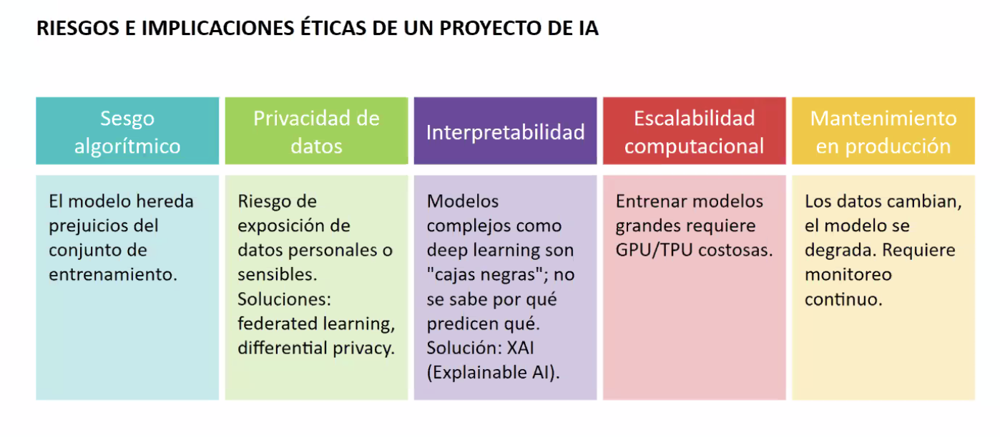
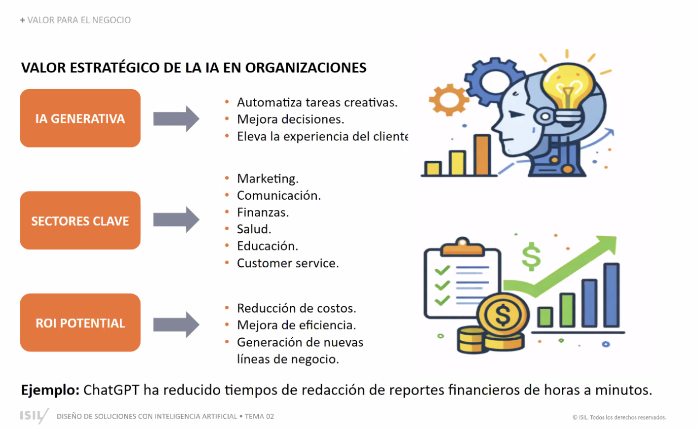
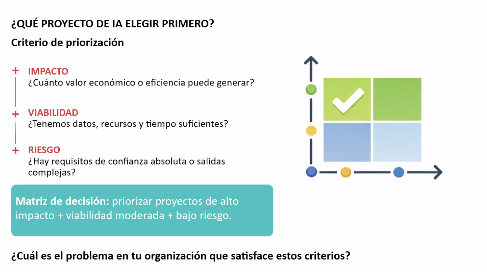
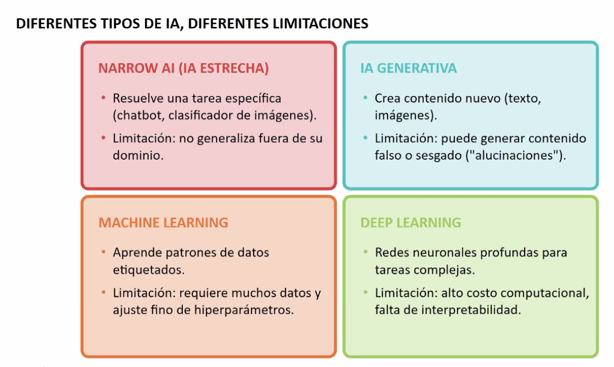
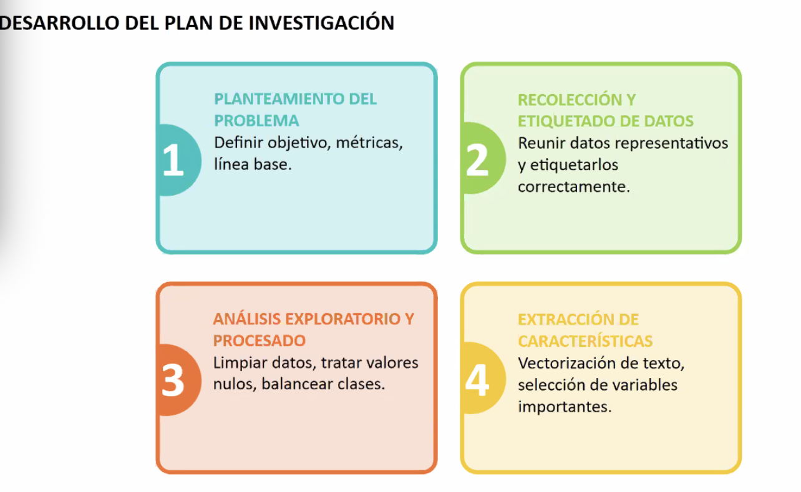
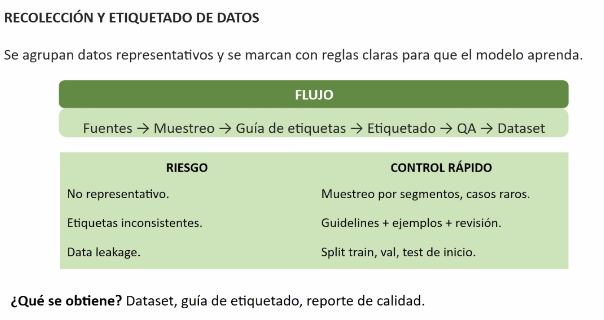
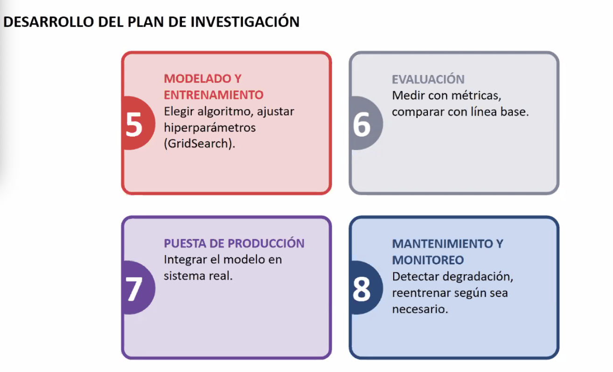

# Diseño de Soluciones con IA — Tema 02: Inteligencia Artificial (Clase 3)

**Curso:** Diseño de Soluciones con IA (ISIL, 2026-1)  
**Docente:** Omar David Visitación Romero  
**Fecha:** 22/04/2026

---

## 1. ¿Qué es la Inteligencia Artificial?

**La Inteligencia Artificial (IA)** es el conjunto de tecnologías que permite a máquinas realizar tareas que típicamente requieren inteligencia humana: razonamiento, aprendizaje, reconocimiento de patrones y toma de decisiones.

En organizaciones, la IA no es monolítica. Existen diferentes tipos, cada uno con capacidades, limitaciones y casos de uso específicos. Entender esta diversidad es clave para seleccionar la solución correcta según el problema empresarial.

---

## 2. Tipología de la IA: Capacidades y Limitaciones

Existen cuatro categorías principales de IA, cada una con fortalezas y restricciones:

### A. Narrow AI (IA Estrecha)
- **Qué es:** Un modelo especializado que resuelve una única tarea específica (ej. chatbot, clasificador de imágenes).
- **Fortaleza:** Muy preciso y eficiente en su dominio.
- **Limitación:** No generaliza fuera de su área. Un chatbot de servicio técnico no puede hacer análisis financiero.
- **Caso de uso:** Automación de procesos repetitivos, clasificación binaria.

### B. IA Generativa
- **Qué es:** Crea contenido nuevo (texto, imágenes, código, vídeos).
- **Fortaleza:** Produce resultados originales y adaptativos; alto valor para creatividad y síntesis.
- **Limitación:** Puede generar contenido falso o "alucinaciones" (confabular información que parece plausible pero es incorrecta).
- **Caso de uso:** Redacción de reportes, generación de ideas, asistentes de código.

### C. Machine Learning
- **Qué es:** Aprende patrones a partir de datos etiquetados sin programación explícita.
- **Fortaleza:** Requiere datos, pero poco ajuste manual de parámetros. Escalable.
- **Limitación:** Necesita muchos datos de calidad y ajuste fino de hiperparámetros (*tuning*). Sin datos, no hay aprendizaje.
- **Caso de uso:** Predicción de demanda, segmentación de clientes, detección de fraude.

### D. Deep Learning
- **Qué es:** Redes neuronales profundas para tareas complejas (visión, procesamiento de lenguaje).
- **Fortaleza:** Resuelve problemas de altísima complejidad; el estado del arte en muchos dominios.
- **Limitación:** Alto costo computacional (requiere GPUs/TPUs), interpretabilidad limitada ("cajas negras"), falta de transparencia en decisiones.
- **Caso de uso:** Visión por computadora, procesamiento de lenguaje natural avanzado, conducción autónoma.

---

## 3. Priorización de Proyectos de IA: Matriz de Decisión

Una de las decisiones más críticas en la implementación de IA es **¿cuál proyecto implementar primero?** Existen tres ejes fundamentales:

### Criterios de Decisión:

**1. Impacto:** ¿Cuánto valor económico o de eficiencia puede generar?
- ¿El proyecto reduce costos significativamente?
- ¿Aumenta ingresos o mejora la experiencia del cliente?
- ¿Habilita nuevas líneas de negocio?

**2. Viabilidad:** ¿Tenemos los datos, recursos y tiempo suficientes?
- ¿Existe un conjunto de datos representativo?
- ¿Contamos con expertise técnico o presupuesto para contratar?
- ¿Es realista el timeline?

**3. Riesgo:** ¿Qué requisitos de confianza absoluta existen? ¿Hay salidas complejas?
- ¿El modelo toma decisiones en áreas reguladas (salud, finanzas)?
- ¿Hay riesgos de seguridad o privacidad de datos?
- ¿El error tiene consecuencias graves?

### Matriz de Decisión:
**Prioridad:**  Proyectos con **alto impacto + viabilidad moderada + bajo riesgo** son los "quick wins" ideales.

---

## 4. Riesgos e Implicaciones Éticas de un Proyecto de IA

Toda solución de IA introduce riesgos que no deben ignorarse. El marco de riesgo incluye cinco categorías críticas:

### Sesgo Algorítmico
- **Riesgo:** El modelo hereda prejuicios del conjunto de datos de entrenamiento.
- **Ejemplo:** Un modelo de hiring que rechaza candidatas porque aprendió patrones históricos de discriminación.
- **Mitigación:** Auditoría de datos, diversidad en conjuntos de entrenamiento, balanceo de clases.

### Privacidad de Datos
- **Riesgo:** Exposición de datos personales o sensibles. Incumplimiento de GDPR, CCPA u normativas locales.
- **Ejemplo:** Un modelo entrenado con datos de crédito que puede ser re-identificado.
- **Mitigación:** *Federated learning* (entrenamiento distribuido), *differential privacy* (ruido matemático para proteger identidades).

### Interpretabilidad (Explainability)
- **Riesgo:** Modelos complejos (Deep Learning) como "cajas negras": no se sabe por qué el modelo predicen qué.
- **Ejemplo:** Un modelo de deep learning aprueba/rechaza un crédito, pero nadie sabe la lógica detrás.
- **Solución:** **XAI (Explainable AI)** — técnicas para abrir la caja negra y justificar decisiones.

### Escalabilidad Computacional
- **Riesgo:** Entrenar modelos grandes requiere GPU/TPU costosas. El modelo puede no ser deployable en recursos limitados.
- **Ejemplo:** Un modelo de deep learning necesita una GPU NVIDIA Tesla V100 ($10k+) cada vez que se entrena.
- **Implicación:** Barrera económica para pymes. Latencia en producción si el hardware es insuficiente.

### Mantenimiento en Producción
- **Riesgo:** Los datos cambian, el modelo se degrada. Requiere monitoreo y reentrenamiento continuo.
- **Ejemplo:** Un modelo de detección de fraude de 2024 falla en 2026 porque los patrones delictivos evolucionaron.
- **Solución:** MLOps — pipeline automatizado para reentrenamiento, versionado de modelos y alertas de degradación.

---

## 5. Valor Estratégico de la IA en Organizaciones

La IA aporta valor en tres niveles estratégicos. Cada uno tiene un ROI diferente:

### IA Generativa
**Valor que aporta:**
- Automatiza tareas creativas (redacción, diseño, ideación).
- Mejora la toma de decisiones al procesar información masiva.
- Eleva la experiencia del cliente con interacciones personalizadas.

**Sectores clave:** Marketing, Comunicación, Finanzas, Educación, Customer Service.

### Sectores Clave (Todos los tipos de IA)
- **Marketing:** Personalización de campañas, predicción de churn.
- **Comunicación:** Chatbots, análisis de sentimiento en redes sociales.
- **Finanzas:** Detección de fraude, scoring crediticio, trading automatizado.
- **Salud:** Diagnóstico asistido, predicción de enfermedades.
- **Educación:** Personalización de aprendizaje, recomendaciones de cursos.
- **Customer Service:** Automatización de soporte, routing inteligente de tickets.

### ROI Potencial
- **Reducción de costos:** Automatización de procesos manuales (ej. RPA + ML).
- **Mejora de eficiencia:** Procesos más rápidos, menos errores, ciclos acelerados.
- **Generación de nuevas líneas de negocio:** Productos/servicios completamente nuevos habilitados por IA (ej. asistentes virtuales, análisis predictivo como servicio).

**Ejemplo práctico:** ChatGPT ha reducido tiempos de redacción de reportes financieros de horas a minutos, liberando recursos para análisis de mayor valor.

---

## 6. Desarrollo del Plan de Investigación para un Proyecto de IA

Un proyecto de IA robusto sigue un ciclo científico de 8 fases:

### Fase 1: Planteamiento del Problema
- **Qué hacer:** Definir el objetivo, métricas de éxito, línea base (baseline).
- **Pregunta clave:** ¿Cuál es el problema exacto que resolvemos? ¿Cómo medimos "éxito"?
- **Entregable:** Documento de definición de proyecto con objetivos SMART.

### Fase 2: Recolección y Etiquetado de Datos

- **Qué hacer:** Reunir datos representativos y etiquetar correctamente. El flujo típico es: **Fuentes → Muestreo → Guía de etiquetas → Etiquetado → QA → Dataset final**.
- **Desafío:** Calidad >> Cantidad. 100 datos bien etiquetados valen más que 1 millón mal etiquetados.
- **Riesgos principales:**
  * **No representativo:** Muestreo sesgado que no cubre casos extremos. *Mitigación:* muestreo estratificado por segmentos, casos raros.
  * **Etiquetas inconsistentes:** Ambigüedad en las reglas de etiquetado. *Mitigación:* guidelines claras + ejemplos + revisión cruzada.
  * **Data leakage:** Información de test colándose en train. *Mitigación:* separar train/validation/test desde el inicio.
- **Entregable:** Dataset limpio, guía de etiquetado y reporte de calidad de datos.

### Fase 3: Análisis Exploratorio y Procesado
- **Qué hacer:** Limpiar datos (valores nulos, outliers), balancear clases, transformar variables.
- **Ejemplo:** Si 99% de transacciones son legítimas y 1% fraudulentas, el modelo cae en bias. Hay que balancear.
- **Entregable:** Dataset preprocessado listo para modelado.

### Fase 4: Extracción de Características (*Feature Engineering*)
- **Qué hacer:** Vectorización de texto, selección de variables importantes, transformaciones matemáticas.
- **Ejemplo:** Para un modelo de NLP, convertir palabras en números (embeddings). Para clasificación de imágenes, extraer bordes, texturas.
- **Entregable:** Matriz de características lista para el algoritmo.

### Fase 5: Modelado y Entrenamiento
- **Qué hacer:** Elegir el algoritmo (Linear Regression, Random Forest, Neural Networks, etc.), ajustar hiperparámetros con *GridSearch*.
- **Técnica:** *Cross-validation* para no sobreajustar.
- **Entregable:** Modelo entrenado con parámetros óptimos.

### Fase 6: Evaluación
- **Qué hacer:** Medir performance contra línea base usando métricas (Accuracy, Precision, Recall, F1, AUC, RMSE).
- **Pregunta:** ¿El modelo supera la baseline? ¿Es good enough para producción?
- **Entregable:** Reporte de evaluación comparativo.

### Fase 7: Puesta de Producción
- **Qué hacer:** Integrar el modelo en un sistema real (API, app, dashboard).
- **Consideraciones:** Latencia, escalabilidad, seguridad, versionado.
- **Entregable:** Modelo deployado en infraestructura real.

### Fase 8: Mantenimiento y Monitoreo
- **Qué hacer:** Detectar degradación del modelo, reentrenar según sea necesario.
- **Métrica clave:** *Model Drift* — cuánto cambió la performance real vs esperada.
- **Entregable:** Pipeline de MLOps con alertas automáticas.

---

## 7. Próxima Actividad

Los alumnos aplicarán estos conceptos eligiendo un problema de su organización y mapeando las 8 fases del desarrollo de un proyecto de IA, considerando riesgos, viabilidad e impacto.

---

*Última actualización: 22/04/2026 | Tema 02: Inteligencia Artificial*
